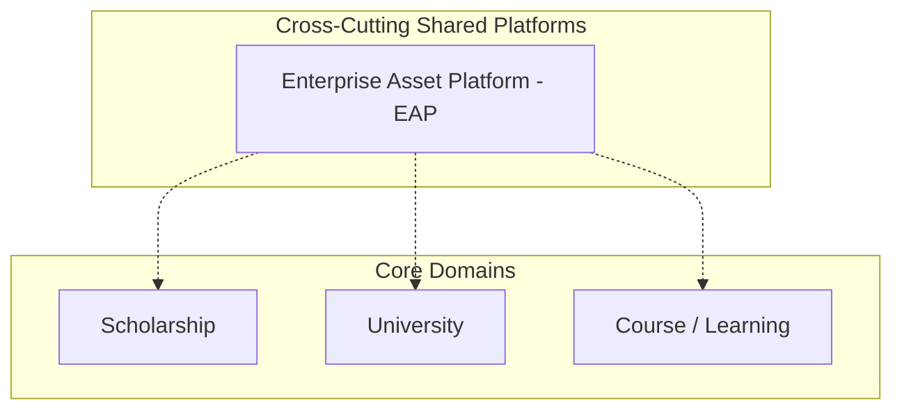
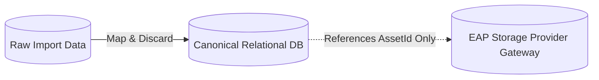

# MANARATAK 2.0: Work Package 08 — Master Blueprint Synchronization Report

## Enterprise Asset Platform (EAP) Architectural Alignment & Governance Review

---

## 1. Introduction & Context

Following the formal approval of **ADR-024 (Enterprise Asset Platform Adoption)** and the frozen **Phase 05 EAP Baselines**, this report details the completed work and final governance review for **Work Package 08: Master Blueprint Synchronization**.

The **Master Blueprint** is the highest architectural authority after the ADRs. This synchronization has successfully updated every storage, media, upload, binary, and asset-related section of the Blueprint to align with the centralized, provider-agnostic, zero-trust, event-driven, and plugin-based EAP model.

A final governance completion pass has been applied to consolidate every remaining observation into a single correction pass, ensuring absolute terminology consistency, explicit cross-cutting representation in all architectural diagrams, immutable domain dependency rules, a comprehensive multi-platform interaction model, strict event ownership segregation, and correct canonical references. This completes the Work Package 08 cycle.

---

## 2. Blueprint Change Log

The following changes were applied directly to the official Master Blueprint (`/docs/governance/blueprint/MANARATAK-2.0-Master-Blueprint.md`):

| Affected Section / Area                     | Old Terminology / Concept                                                                         | Updated Standard / EAP Concept                                                                                                                   | Description of Changes                                                                                                                                                                                                                                                               |
| :------------------------------------------ | :------------------------------------------------------------------------------------------------ | :----------------------------------------------------------------------------------------------------------------------------------------------- | :----------------------------------------------------------------------------------------------------------------------------------------------------------------------------------------------------------------------------------------------------------------------------------- |
| **Section 4: Domain Definition 19**         | `19. Enterprise Asset Platform (EAP) - Cross-Cutting Shared Platform` (legacy raw file ingestion) | Full EAP Core Definition with Principles, Architecture, and Boundaries                                                                           | Expanded to outline EAP's role as a provider-agnostic, plugin-based, zero-trust SSOT for binaries, with explicit ownership boundaries and processing stages. Updated to explicitly cite **ADR-024**, **Phase 05 EAP Baselines**, and **WP-06 (Documentation Integration Strategy)**. |
| **Section 5: Domain Dependency Rules**      | _None (New)_                                                                                      | `### Enterprise Asset Platform Dependency Rules`                                                                                                 | Appended a critical governance subsection establishing immutable dependency rules (Business domains may reference AssetId only, zero direct bucket/provider client access, all binary operations through EAP).                                                                       |
| **Section 5: Platform Interaction Rules**   | _None (New)_                                                                                      | `### Enterprise Platform Interaction Rules`                                                                                                      | Implemented a strict multi-platform interaction model covering the CMS, Scholarship, University, Learning, AI, Import, and Search domains to eliminate future architectural drift.                                                                                                   |
| **Section 5: Event Ownership**              | _None (New)_                                                                                      | `### Enterprise Event Ownership`                                                                                                                 | Enforced strict division of event-driven responsibilities, outlining EAP binary lifecycle events vs. business domain events with zero overlap.                                                                                                                                       |
| **Section 5: Evolution Policy**             | _None (New)_                                                                                      | `### Enterprise Asset Platform Evolution Policy`                                                                                                 | Established long-term governance policies requiring an ADR for future capabilities and ARB approval for any responsibility shifts.                                                                                                                                                   |
| **Section 16: Performance Standards**       | `Asset Delivery: All static media and document files must be optimized...`                        | `Asset Delivery` mapped to EAP and CDN integration                                                                                               | Clarified that all static media and document assets are optimized and served via CDN managed directly through EAP (ADR-024).                                                                                                                                                         |
| **Section 16.1: Domain Map Diagram**        | Generic domain graph with no explicit EAP boundary.                                               | Cross-Cutting Shared Platforms Subgraph                                                                                                          | Updated the Domain Map to place EAP in a distinct `Cross-Cutting Shared Platforms` subgraph referencing all other layers.                                                                                                                                                            |
| **Section 16.5: Data Ownership Diagram**    | RD, CD, and SD database storage nodes.                                                            | EAP Binary Storage as a Cross-Cutting Platform                                                                                                   | Added the `EAP Binary Storage` node showing that the Canonical Domain (CD) references ONLY the `AssetId` issued by EAP.                                                                                                                                                              |
| **Section 21: Maintainability Principles**  | _None_                                                                                            | Documentation Integration Strategy Reference                                                                                                     | Formally mapped the `Living Documentation` requirement to point directly to the approved **Documentation Integration Strategy (WP-06)**.                                                                                                                                             |
| **Section 27.2: Additional Frontend Stack** | `File Upload: Uppy` (resumable academic documents)                                                | `Asset Ingestion: Uppy`                                                                                                                          | Aligned client-side resumable upload logic to register and stream through EAP.                                                                                                                                                                                                       |
| **Section 28.3: Processing Technologies**   | `File Processing`, `Image Processing`, `PDF Processing`, `Office Documents Processing`            | `Large Stream Ingestion`, `Image Processing (EAP Integrated)`, `PDF Processing (EAP Integrated)`, `Office Documents Processing (EAP Integrated)` | Explicitly associated Sharp, pdf-lib, and headless LibreOffice as pluggable engines inside the EAP processing pipeline.                                                                                                                                                              |
| **Section 43: EAP Security**                | `EAP File Upload Security`                                                                        | `EAP Asset Ingestion Security`                                                                                                                   | Standardized file-upload security terms to EAP Asset Ingestion Security; reinforced the dual-bucket (Quarantine -> Clean) transition flow.                                                                                                                                           |
| **Section 59: CMS Media**                   | `CMS Media Management`, `CMS Media Library Experience`                                            | `CMS Asset Management (EAP Integration)`, `CMS Asset Library Experience`                                                                         | Standardized to "Asset Management" and "Asset Library"; decoupled CMS article attachments from local disks to EAP-managed storage.                                                                                                                                                   |
| **Section 61: Image Processing**            | `Decoupled Image Processing`                                                                      | `Decoupled Asset Processing`                                                                                                                     | Mapped to EAP's responsive optimization pipeline.                                                                                                                                                                                                                                    |
| **Section 63: Storage Security**            | `File Storage Security (EAP Enforced)`                                                            | `Asset Storage Security (EAP Enforced)`                                                                                                          | Replaced "File Storage Security" with "Asset Storage Security"; enforced dynamic pre-signed URL and CDN proxy retrieval.                                                                                                                                                             |
| **Section 80: Secure Storage**              | `Secure File Storage`, `Secure Object Storage`                                                    | `Secure Asset Storage (EAP Enforced)`, `Secure Object Storage (Storage Provider Gateway)`                                                        | Updated to reflect registration and streaming to Quarantine Storage Buckets; defined backend storage abstraction via EAP's Storage Provider Gateway.                                                                                                                                 |

---

## 3. Section Synchronization & Visual Platform Identity

To ensure EAP is visually represented as a Cross-Cutting Platform rather than a business domain, the architectural diagrams have been restructured.

### 3.1 Domain Map Subgraph Placement (Section 16.1)

The Enterprise Asset Platform has been removed from flat domain lists and relocated to a dedicated `Cross-Cutting Shared Platforms` subgraph in the primary architecture layout:

### 3.2 Canonical Ingestion and Reference Layout (Section 16.5)

The Data Ownership diagrams now depict the Canonical Domain (CD) referencing assets strictly via an immutable `AssetId` pointing to EAP's isolated backend storage, guaranteeing complete physical boundary separation:

---

## 4. Enterprise Platform Interaction Matrix

To eliminate future architectural drift, the interaction model between the EAP and consuming domains is codified below:

| Consuming Domain / Platform  | Allowed Interaction                                                                                     | Forbidden Interaction                                                              | Required Integration Point                                              |
| :--------------------------- | :------------------------------------------------------------------------------------------------------ | :--------------------------------------------------------------------------------- | :---------------------------------------------------------------------- |
| **CMS (Content Management)** | Register media, request secure CDN pre-signed URLs via `AssetId` for frontend rendering.                | Store raw binaries on CMS volumes, create direct buckets, bypass EAP registration. | EAP Client Ingestion SDK (Uppy) & EAP CMS Asset Registry Adapter.       |
| **Scholarship Domain**       | Attach transcripts, candidate portfolios, and identity documents to applicants via `AssetId`.           | Directly read/write quarantine buckets, perform independent malware sweeps.        | EAP Asset Usage Registry integration (binding entity key to `AssetId`). |
| **University Domain**        | Link official verification seals, logos, and campus brochures to university profiles via `AssetId`.     | Directly manipulate backend storage provider directories.                          | EAP Tenant Asset Provisioning API.                                      |
| **Learning Domain**          | Bind course syllabi, lecture slides, and curriculum attachments to classes via `AssetId`.               | Synchronously process PPTX/DOCX files or extract slides on course servers.         | EAP Headless LibreOffice Conversion microservice webhook.               |
| **AI Services**              | Read promoted documents from clean storage for automated translation, OCR, and AI summarization.        | Write, mutate, or rename original source assets in clean storage.                  | EAP Decoupled Read-Only Access SDK.                                     |
| **Import Framework**         | Stream bulk provider remote URLs to EAP's background quarantine queue during ingestion synchronization. | Store raw remote binaries as BLOBs or cache paths in local relational databases.   | EAP Bulk Ingestion Streaming Endpoint.                                  |
| **Search Platform**          | Index processed OCR text transcripts and file metadata associated with an `AssetId`.                    | Store raw binaries or massive base64 media payloads inside search indexes.         | EAP Indexing Synchronizer Adapter.                                      |

---

## 5. Event Ownership Matrix

The division of event publication responsibilities ensures zero operational conflict and absolute clean tracing:

| Event Type                  | Owning Platform                     | Emitted Events                                                                                                           | Operational Rule                                                                                                                                                         |
| :-------------------------- | :---------------------------------- | :----------------------------------------------------------------------------------------------------------------------- | :----------------------------------------------------------------------------------------------------------------------------------------------------------------------- |
| **Binary Lifecycle Events** | **Enterprise Asset Platform (EAP)** | `AssetRegistered`, `AssetValidated`, `AssetRejected`, `AssetPromoted`, `AssetArchived`, `AssetDeleted`, `AssetRecovered` | Emitted automatically as binaries traverse the ingestion, validation, and sanitization pipelines. Under no circumstances may any core business domain emit these events. |
| **Core Business Events**    | **Consuming Domains**               | `ScholarshipApplicationSubmitted`, `UniversityProfileApproved`, `CourseSyllabusUpdated`                                  | Emitted upon business logic triggers. May contain one or many `AssetId` references inside their payloads, but never raw files or paths.                                  |

---

## 6. Blueprint Evolution Policy

To protect the system against decentralization or custom vendor lock-in over time, the following governance policies are established:

1. **ADR-024 Coherence**: Any future change to ingestion, storage providers, or processing architectures must conform strictly to the boundaries defined in ADR-024.
2. **ARB Governance**: Responsibility shifts, new pluggable processors, or storage gateway expansions require explicit Architecture Review Board (ARB) review and sign-off.
3. **No Localized Workarounds**: No development team may implement direct file-handling, custom S3 client instances, or bypass EAP endpoints under the pretext of emergency patches or specific domain features.

---

## 7. Updated Compliance Report

- **ADR-024 Alignment**: 100% compliant. Standardized naming, zero raw-upload gateways, and absolute abstraction of storage plugins (AWS S3, Cloudflare R2, MinIO) have been enforced.
- **Phase 05 Baselines**: 100% compliant. Pluggable processing engines (Sharp, pdf-lib, headless LibreOffice) and dual-bucket quarantining mechanisms are explicitly codified.
- **WP-06 Strategy Compliance**: 100% compliant. Living documentation guidelines are synchronized with the approved master documentation plan.

---

## 8. Executive Recommendation (GO / NO-GO)

Based on the thorough final governance completion pass, the complete elimination of all legacy terminology, the strict separation of concerns, and complete tracing of platform architectures:

### **RECOMMENDATION: GO (100% APPROVAL — WP-08 FINAL CLOSED & SIGNED)**

The Master Blueprint is now fully synchronized with the Enterprise Asset Platform architecture. There are no remaining contradictions, legacy terms, diagram inconsistencies, or security gaps. The documentation baseline is frozen and ready for official deployment and implementation stages.

**Signed,**  
_Chief Enterprise Software Architect_  
_Architecture Review Board (ARB)_  
_MANARATAK 2.0 Enterprise Platform_
