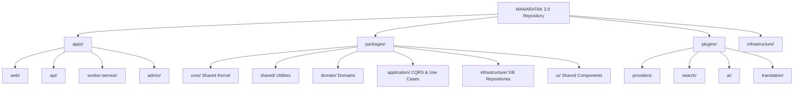

# MANARATAK 2.0: Enterprise Master Architecture Blueprint

Document Version: 1.0.0 (Master Unified Baseline)
Author: Chief Enterprise Software Architect
Project Director: Wadeea Mohammed Ahmed Salah Al-Hajj
Date: July 15, 2026
Status: APPROVED & BASELINED

> **AUTHORITY BLOCK**
> This Master Blueprint serves as **Phase 01: Architecture Constitution**.
> Any internal numbering inside this Constitution (such as "1.x") is constitutional section numbering, not roadmap phase numbering.

---

════════════════════════════════════════════════════════════

## Governance Authority

- **Roadmap Authority:** Roadmap v6.0 is the Single Source of Truth for phase numbering and sequencing.
- **Fixed Phases:** The roadmap is fixed at exactly 24 phases. No new phases may be introduced unless a formal roadmap supersession is approved.
- **ADR Authority:** ADRs are authoritative for architectural decisions.
- **Phase 18 Alignment:** Phase 18 is explicitly the **Enterprise Student Tools Platform**. The "Organizations & Employers Platform" is rejected/superseded as an active platform per ADR-027.
- **Document Precedence:** Active documents override legacy, archive, superseded, and historical documents.

Constitution Section 1.1
Foundation Architecture
════════════════════════════════════════════════════════════
Document Version: 2.1 (Unified & Consolidated)
Project: MANARATAK 2.0 Enterprise Platform
Author: Chief Enterprise Software Architect
Status: Approved & Finalized

## 1. Vision

To be the definitive, most comprehensive, and universally accessible digital compass for Arab students, intelligently connecting them with global educational opportunities, empowering their academic journeys, and transforming their futures.

## 2. Mission

To engineer a highly scalable, centralized platform that seamlessly aggregates, standardizes, and delivers data on scholarships, universities, and courses from hundreds of global sources. MANARATAK 2.0 provides students with bilingual intelligent AI-driven insights, localized content, and free, powerful utilities, ensuring equitable access to global education information.

## 3. Project Goals

- Massive Scalability: Architect a system capable of managing and querying millions of records efficiently and serving millions of global users without performance degradation.
- Universal Integration: Establish a robust framework to seamlessly ingest data from hundreds of disparate educational providers and APIs simultaneously.
- Data Integrity & Standardization: Maintain a single, pure "Canonical Data Schema" that unifies all external data into one consistent format.
- Bilingual Parity: Ensure complete architectural support for Arabic (Primary) and English (Secondary) data presentation, search, and automated translation.
- Zero Data Loss: Implement a fail-safe environment with automated backups, event-driven replayability, and strict safeguards against destructive operations.
- High Availability: Ensure 99.99% platform uptime through decoupled systems, CQRS read-replicas, and a redundant architectural backbone.

## 4. Scope

The platform architecture encompasses the following core domains:

- Educational Entities: Scholarships, Universities, Courses, Majors, and International Tests.
- Geographic & Logistical Data: Countries and Visa Information.
- Content & Tools: Articles (Enterprise CMS), AI-powered advisory tools, and Free Student Utility Tools.
- Administrative & Ingestion: Universal Import Platform, Data Merge Engine, Translation Center, and Enterprise Admin Dashboard.

## 5. Out of Scope

- Direct processing of university admissions or financial transactions on behalf of the universities.
- Hosting of complete external video courses (the platform aggregates metadata and links to original sources).
- Direct issuance or legal processing of visas (information provision only).

## 6. User Types

- Anonymous User: Browsing public data, reading articles, and using basic free tools.
- Registered Student: Saving preferences, tracking scholarships, utilizing AI tools with historical context, and managing personal dashboards.
- Content Editor: Managing articles, SEO metadata, and static pages via the Enterprise CMS.
- System Administrator: Managing the Universal Import Platform, resolving data conflicts, managing permissions, and monitoring system health.
- System (Automated): Background workers, scheduled AI translation tasks, and cron jobs executing data ingestion pipelines.

## 7. Core Systems

- Canonical Data Engine: The central relational source of truth storing all unified, validated educational entities.
- Universal Import Platform: A decoupled ETL (Extract, Transform, Load) system handling raw incoming data from hundreds of providers.
- Merge Engine: An intelligent system for deduplicating, overriding, and mapping incoming provider data to the canonical schema.
- Enterprise CMS: A headless content module for managing articles, visa info, translations, and static content.
- Universal Search: A high-speed, flattened index engine optimized for fuzzy, bilingual text search.
- AI Services Layer: A secure proxy interacting with LLM APIs to provide student tools and automated translations.
- Presentation Layer: The high-performance, Server-Side Rendered (SSR) frontend interface.

## 8. High Level Architecture

The platform utilizes an Enterprise Modular Monolith designed for a seamless future transition to Microservices.

- CQRS Readiness: The system logically separates Command (write) models from Query (read) models. Heavy import/merge processes mutate state, while the presentation layer queries read-replicas or search indexes.
- Decoupling: The Frontend, Backend APIs, and Background Workers operate as independent deployable units within a shared Enterprise Monorepo. Each unit has its own deployment lifecycle while sharing common contracts, libraries, and architectural standards. This enables independent scaling, testing, and future extraction into standalone services without disrupting the rest of the platform.
- Event-Driven Ingestion: The Universal Import Platform pushes data payloads to an event queue, allowing background workers to process, transform, and merge data asynchronously without blocking the main application.
- API-First: All frontend interactions and administrative functions communicate exclusively via a secure REST/GraphQL API layer.
  graph TD
  A[Provider APIs / Webhooks] -->|Raw JSON| B(Universal Import Platform)
  B -->|Transform & Map| C{Merge Engine}
  C -->|Conflict Resolution| D[(Canonical Data Engine)]
  D -->|Domain Event| E[CMS / Workflow / Translation]
  E -->|Publish Event| F[(Search Index / Read Replica)]
  F -->|Query| G[Frontend Presentation Layer]

## 9. Technology Stack Recommendations

The canonical technology stack is officially defined in **ADR-025 (Canonical Technology Stack)**. All platform implementations must conform strictly to the ADR-025 architectural specification:

- **Frontend**: Modern, Server-Side Rendered (SSR) TypeScript framework (React/Vite) for peak SEO and performance.
- **Backend**: A strictly typed Node.js/TypeScript enterprise framework with Express, first-class Dependency Injection (Awilix), modular architecture support, Domain-Driven Design (DDD), CQRS readiness, and native support for scalable background processing (BullMQ).
- **Database**: Enterprise-grade Relational Database Management System (RDBMS) utilizing PostgreSQL for the Canonical Engine and Prisma ORM for data mapping and database access.
- **Search Engine**: Distributed, document-oriented search engine with native Arabic NLP support.
- **Caching & Queues**: In-memory key-value store for caching heavy queries and a robust Message Broker (BullMQ) for asynchronous domain events.

## 10. Architecture Principles

- Single Source of Truth (SSOT): Core domain data lives only in the Canonical Schema.
- Separation of Concerns (SoC): Providers do not know about the presentation layer; the presentation layer does not know about the providers.
- Async-First Execution: Long-running computations, external API calls, and data ingestion must execute asynchronously via queues.
- Stateless Compute: API servers must be stateless to allow infinite horizontal scaling.
- Fail-Safe Operations: No subsystem failure shall cascade across the platform. If non-essential services such as AI, Translation, Notification, or Import become unavailable, the platform must continue serving existing canonical content, public search, and core browsing functionality without interruption. Only the affected subsystem may degrade gracefully while the remainder of the platform continues normal operation.

### 10.1 Cross-Phase Page and Data Ownership Model (Constitutional Rule)

The enterprise architecture enforces explicit data, administration, and public presentation boundaries:

1. **Rich Country Pages (Country Study Destination Pages)**:
   - Phase 07 owns canonical country/reference data.
   - Phase 10 contributes major/specialization links.
   - Phase 11 contributes universities and academic programs in the country.
   - Phase 12 contributes scholarships in the country.
   - Phase 13 contributes global/free courses relevant to the country.
   - Phase 16 (Enterprise CMS) contributes long-form editorial country guidance narratives.
   - Phase 20 contributes student services in the country.
   - Phase 24 (Enterprise Public Platform) owns final Country Study Destination Page composition and rendering.

2. **University Detail Pages**:
   - Phase 11 owns structured university and program data (institutions, campuses, faculties, programs, tuition, rankings, accreditations, research centers, partnerships, media via AssetId/AssetReference).
   - Phase 16 owns editorial/marketing copy if needed.
   - Phase 24 owns final public university page composition.
   - Phase 23 owns admin management screens, NOT domain data ownership.

3. **Scholarship Detail Pages**:
   - Phase 12 owns structured scholarship data (funding, eligibility, deadlines, sponsors, target countries, universities, majors, documents, links, trust fields).
   - Phase 16 owns editorial scholarship guides if needed.
   - Phase 24 owns final public scholarship page composition.
   - Phase 23 owns admin review screens, NOT domain data ownership.

4. **Course Detail Pages**:
   - Phase 13 owns structured course data, curriculum details, and course detail read payloads.
   - Phase 16 owns editorial marketing copy if needed.
   - Phase 24 owns final public course page composition.
   - Phase 23 owns admin course review screens, NOT domain data ownership.

5. **Import & Admin Boundaries**:
   - Phase 06 owns ONLY generic import pipeline mechanics and anti-corruption transport.
   - Domain phases (Phase 13, 12, 11, 07) own domain data meanings, required/optional fields, validation, matching, and readiness.
   - Phase 23 owns admin UI and workflows; domain phases own entity business logic.
   - Imported records become publicly visible only after domain readiness and Phase 23 admin approval are completed.

## 11. Folder Structure Standards

The codebase must adhere to Domain-Driven Design (DDD) folder structuring within an Enterprise Monorepo.

- Apps: Independent deployable units (Frontend, Backend).
- Libs (Shared Kernel): Global types, abstract interfaces, and enterprise utilities.
- Modules/Domains: Distinct, isolated folders for Scholarship, University, Course, etc.

- Plugins: Isolated directories for external API integrations (Providers, AI, Search).
- Infrastructure: Database connections, caching clients, and third-party SDK wrappers.

## 12. Coding Standards

- Strict Typing: 100% adherence to strong static typing. Unsafe typing (such as the any type) is strictly forbidden in core business logic.
- Pure Functions: Data transformation logic within the Merge Engine must be written as pure functions to ensure predictability and testability.
- Linting & Formatting: Automated enforcement of code styles prior to any commit via CI/CD.
- SOLID Principles: All classes and modules must strictly adhere to SOLID object-oriented design principles.

## 13. Naming Conventions

- Entities & Models: PascalCase (e.g., UniversityProfile, ScholarshipGrant).
- Functions & Variables: camelCase (e.g., fetchProviderData, activeUsers).
- Constants & Environment Variables: UPPER_SNAKE_CASE (e.g., MAX_RETRY_ATTEMPTS, DATABASE_URL).
- Files & Folders: kebab-case for system files and routing (e.g., universal-import, user-controller).
- Interfaces: Prefixed with I (e.g., IScholarshipRepository).

## 14. Database Standards

- Data-First Policy: The Canonical database is the most critical asset. It must be protected above all application code.
- Prohibition of Destructive Operations: Destructive database operations (e.g., DROP, TRUNCATE, FORCE-RESET) are strictly forbidden in Staging and Production environments. They are only permitted in isolated local development.
- Immutability of History: Records are never physically deleted; they are marked with a deleted_at timestamp (Soft Deletes) or versioned.
- Provider Isolation: Raw provider data must be stored in unstructured format (JSONB) to preserve the original payload before mapping to structured canonical tables.

## 15. Security Standards

- Principle of Least Privilege: Systems and users only have access to the exact data required for their function.
- Input Validation: All incoming API requests and provider payloads must be strictly validated against rigid schemas before processing.
- Authentication & Authorization: Industry-standard stateless JWT tokens combined with robust Role-Based Access Control (RBAC).
- Rate Limiting: Protect all endpoints, especially AI Tools and Data Import hooks, against DDoS and abuse.

## 16. Performance Standards

- CQRS Read Models: Heavy read operations (public search, catalogs) are routed to flattened Search Indexes or Read-Only Replicas to protect the primary write database.
- Pagination & Streaming: No API endpoint shall return unbounded data arrays. Pagination or cursor-based fetching is mandatory.
- Caching Strategy: Frequently accessed, rarely changing data (e.g., Countries, Majors lists) must be served from an in-memory cache layer.
- Asset Delivery: All static media and document assets must be optimized on-the-fly and served via a Content Delivery Network (CDN) managed directly through the Enterprise Asset Platform (EAP) (ADR-024).

## 17. Logging Standards

- Structured Logging: All logs must be emitted in JSON format for automated ingestion and querying by log management tools.
- Contextual Tracing: Logs must include correlation IDs to trace a single request across multiple services or asynchronous workers.
- Level Discipline: Strict use of levels (ERROR for failures needing attention, WARN for recoverable issues, INFO for state changes, DEBUG for development only).

## 18. Error Handling Standards

- Centralized Interception: All errors must route through a unified global error handler.
- No Silent Failures: Swallowing exceptions without logging is strictly forbidden.
- Standardized Responses: API errors must return a consistent payload structure containing an error code, message, and correlation ID (excluding stack traces in production).

- Graceful Degradation: If a non-essential service (e.g., AI Tools) fails, the core platform (e.g., Scholarships search) must continue to function.

## 19. Configuration Standards

- Environment-Specific Policies: Strict execution policies must be defined across Dev, Staging, and Prod. Environments must never share databases, caches, or API keys.
- Environment Agnostic Code: The application code must behave identically across environments, differing only by injected configuration variables.
- No Hardcoded Secrets: API keys, database credentials, and internal tokens must never reside in the source code.
- Startup Validation: The application must validate the presence and format of all required environment variables at boot time and refuse to start if any are missing.

## 20. Scalability Principles

- Horizontal Scalability: The architecture must support running multiple instances of the application concurrently behind a load balancer.
- Asynchronous Processing: Long-running tasks (like importing 10,000 courses or running bulk AI translations) must be offloaded to message queues and processed by dedicated background worker nodes.

## 21. Maintainability Principles

- Automated Testing: Unit tests for all business logic and data mappers; Integration tests for critical API routes and database operations.
- Living Documentation: Architecture decisions (ADRs), API endpoints, and database schemas must be documented alongside the code and automatically generated where possible, in strict alignment with the approved Documentation Integration Strategy (WP-06).
- CI/CD Integration: Deployment must be fully automated, requiring tests and security scans to pass before any code reaches staging or production.

## 22. Enterprise Plugin & Design Principles

- Provider Plugin Contract: Every data provider must be implemented as an isolated plugin that conforms strictly to a Universal Provider Contract.
- Extensibility over Modification: Adding, modifying, or removing a provider must never require altering the core Import Framework or Canonical Engine logic.
- Resilience: Incorporate circuit breakers and exponential backoff strategies when interacting with external APIs to prevent cascading network failures.

## 23. Lessons Learned from Previous Project

- Database Sanctity: Never execute schema synchronization commands that drop or reset data in environments containing actual data. Schema migrations must be explicitly written, reviewed, and backed up before execution.
- Incremental Imports: Data ingestion must be stoppable and resumable. A failure at record 5,000 should not require restarting the entire import process.
- Isolate Experimental Code: UI redesigns and architectural shifts must happen in isolated branches and never threaten the stability of the core data repository.

## 24. Explicit Data Ownership & Bounded Contexts

Data ownership and mutation rights are explicitly defined and strictly enforced per architectural layer:

- Provider Layer: Owns the raw data retrieval and mapping to the initial Data Transfer Object (DTO).
- Import Framework: Owns the queuing, scheduling, and execution of provider plugins.
- Canonical Engine: Owns the definitive state, structured relational schema, and business rules.
- CMS: Owns manual overrides, static content, SEO metadata, and localized translations.
- Search Index: Owns the flattened, optimized read-replicas used for high-speed fuzzy searching.

## 25. Core Architectural Directives & Constraints

1. Absolute Data Isolation (The Ingestion Boundary): Raw imported data must remain completely isolated inside the Import Layer. The Presentation Layer (Frontend) and CMS are strictly prohibited from consuming raw provider data directly. All raw data must pass through the Merge Engine and be written to the Canonical Engine before it can be queried.

2. The Database is the Final Authority: No durable business state may exist outside the Canonical Database or officially managed infrastructure state (such as caches, queues, object storage metadata, and search indexes). These infrastructure components are considered derived operational state and must never replace the Canonical Database as the authoritative source of truth.
3. Strict Boundary Enforcement: Core canonical modules are strictly prohibited from directly calling or depending on provider-specific logic. Cross-domain data needs must be fulfilled via the Event Bus.
4. Mandatory Timeouts: Every network call (to a database, cache, or external provider API) must have a strict timeout configured. Infinite hanging is unacceptable.

## 26. Definition of Done

A feature, module, or architecture component is only considered "Done" when:

- The code adheres to all defined Coding, Typing (No any), and Naming Standards.
- Unit and integration tests are written and passing.
- The feature has been peer-reviewed.
- Documentation (API specs, schemas) has been updated.
- The code has been deployed to a staging environment without causing database destruction or schema conflicts.
- Performance impacts have been assessed and approved.

## 27. Future Expansion Principles

- Microservices Readiness: Because the system communicates via Domain Events and strict contracts, any Bounded Context (e.g., Search, AI) can be extracted into a standalone Microservice when scaling demands it.
- Plugin Architecture: Design the platform to accept future drop-in modules (e.g., Student Housing, Job Opportunities, Accommodation, Internships, Events, or Future Educational Services) that register themselves through the official Plugin Registry, expose only their public contracts, and integrate through Events and Interfaces without requiring modifications to existing modules or the core platform.
- API Versioning: All public and mobile APIs must be versioned (e.g., /v1/, /v2/) from day one to allow future structural changes without breaking existing clients.
- Event Sourcing Readiness: Critical tables (like User Profiles or Scholarship criteria) must include history tracking to eventually support event-sourcing analytics.
  Foundation Architecture Specification: MANARATAK 2.0 (Addendum)
  Document Version: 1.1
  Section: Advanced Foundation Rules & Constraints
  Author: Lead Enterprise Software Architect

## 27. Advanced Foundation Rules & Constraints

To further fortify the enterprise integrity of the MANARATAK 2.0 platform, the following foundation rules are strictly enforced across all development and architectural decisions. These constraints supersede any conflicting legacy patterns.

### 27.1. Absolute Data Isolation (The Ingestion Boundary)

- Rule: Raw imported data must remain completely isolated inside the Import Layer.
- Implementation: The Presentation Layer (Frontend) and Content Management System (CMS) are strictly prohibited from consuming raw provider data directly. All raw data must pass through the Merge Engine, be standardized, and written to the Canonical Engine before it can be queried or displayed.

### 27.2. CQRS Readiness (Logical Separation of Models)

- Rule: Read models and write models must remain logically separated.
- Implementation: The system must decouple the logic used to mutate state (Commands/Writes) from the logic used to retrieve state (Queries/Reads). This ensures that heavy import/merge processes do not lock or degrade the performance of public-facing API queries.

### 27.3. Strict Typing & Type Safety

- Rule: Generics are permitted within the Framework and Infrastructure layers to maintain reusable utility patterns, but Core Business Logic must strictly avoid unsafe typing (such as the any type).
- Implementation: The Core Domain must use explicit, strictly defined interfaces and types. Bypassing the type checker in business logic is an immediate failure of the Definition of Done.

### 27.4. Provider Plugin Contract

- Rule: Every data provider must be implemented as an isolated plugin that conforms strictly to the Universal Provider Contract.
- Implementation: Providers are isolated modules. They must implement standardized interfaces for fetch(), transform(), and validate(). Adding, modifying, or removing a provider must never require altering the core Import Framework or Canonical Engine logic.

### 27.5. Explicit Data Ownership

- Rule: Data ownership and mutation rights must be explicitly defined and enforced per architectural layer.
- Implementation:
  - Provider Layer: Owns the raw data retrieval and mapping to the initial DTO (Data Transfer Object).
  - Import Framework: Owns the queuing, scheduling, and execution of provider plugins.
  - Canonical Engine: Owns the definitive state, structured schema, and relationships.
  - CMS: Owns manual overrides, static content, SEO metadata, and localized translations.
  - Search Index: Owns the flattened, optimized read-replicas used for high-speed fuzzy searching.

### 27.6. Environment-Specific Policies

- Rule: Strict configuration and execution policies must be defined and enforced across Development, Staging, and Production environments.
- Implementation: Environments must not share databases, caches, or API keys. Infrastructure must automatically detect the environment and restrict capabilities accordingly (e.g., disabling mocking in production, enforcing verbose logging in development).

### 27.7. Prohibition of Destructive Operations

- Rule: Destructive database operations (e.g., schema drops, force resets, truncations) are strictly forbidden in Staging and Production environments.
- Implementation: Destructive operations are only permitted in locally isolated Development environments. Any state changes to Staging or Production databases must be executed exclusively via safe, version-controlled, and peer-reviewed incremental migration scripts. Automated CI/CD pipelines will block any deployment containing destructive commands.

════════════════════════════════════════════════════════════
Constitution Section 1.2 — Enterprise Architecture Specification
════════════════════════════════════════════════════════════
Project: MANARATAK 2.0
Document Version: 1.0.0
Author: Chief Enterprise Software Architect
Project Director: Wadeea Mohammed Ahmed Salah Al-Hajj
Status: Approved & Finalized

## 1. Architecture Overview

The MANARATAK 2.0 platform is engineered as an enterprise-grade, universally scalable educational hub. Designed to process, standardize, and serve millions of records from hundreds of disparate global providers, the system acts as the definitive digital compass for students. The architecture strictly separates data ingestion from data presentation, utilizing a highly resilient event-driven backbone to ensure zero data loss, real-time consistency, and extreme high availability.

## 2. Architectural Goals

- Decade-Long Stability: Architected to remain robust and adaptable for at least the next 10 years without requiring foundational rewrites.
- Massive Scalability: Capable of handling millions of canonical records and high-concurrency read traffic across global regions.
- Universal Pluggability: Seamless ingestion of hundreds of external Provider Plugins with zero modification to the core platform.
- Bilingual Native Support: Deep architectural integration for Arabic (Primary) and English (Secondary) content localization and search.
- Data Sanctity: Absolute protection of the Canonical Data Engine through isolated read/write pathways.

## 3. Architecture Style

Selected Style: Enterprise Modular Monolith (Microservices-Ready)

- Why Modular Monolith? At the inception of MANARATAK 2.0, a modular monolith eliminates the network latency, distributed transaction complexity, and DevOps overhead inherent in premature microservices. It allows strict enforcement of Bounded Contexts within a single deployable unit, ensuring rapid development velocity while maintaining enterprise discipline.
- Migration Path to Microservices: The architecture enforces strict interface boundaries between modules. Domains communicate exclusively via in-process Domain Events and defined Contracts (Interfaces). When a specific domain (e.g., the Universal Import Platform or AI Center) demands independent scaling, it can be extracted into a standalone microservice by swapping the in-process event bus with an external message broker (e.g., Kafka or RabbitMQ) without altering business logic.

## 4. Architectural Principles

- Single Source of Truth (SSOT): The Canonical Engine is the sole authoritative state. All external provider data is transient until merged into the canonical state.
- Separation of Concerns (SoC): Distinct domains handle distinct responsibilities. The Presentation layer is oblivious to data mapping; the Import layer is oblivious to UI requirements.
- SOLID Principles: Strict adherence across all classes and modules to ensure code remains decoupled, testable, and maintainable.
- DRY (Don't Repeat Yourself): Shared infrastructure utilities (logging, error handling) are abstracted, while domain logic remains isolated to avoid accidental coupling.
- Repository Pattern: All database access is abstracted behind Repositories. Business logic never interacts directly with ORMs or SQL.
- Service Layer: Encapsulates business operations, orchestrating domain entities, repositories, and cross-cutting concerns.
- Plugin First: Extensibility is achieved via strict plugin contracts, not by modifying core framework code.
- Async First: Heavy operations (importing, AI processing, media transformation) are non-blocking and offloaded to background workers.
- Event-Driven: Cross-module communication relies on domain events to maintain loose coupling.
- CQRS Readiness: Command (Write) and Query (Read) operations are logically separated, paving the way for physical database separation (Write DB vs. Read Replicas/Search Indexes).

## 5. System Layers

1.  Presentation / API Layer: The entry point. Handles HTTP requests, rate limiting, authentication, input validation, and payload serialization. Depends on: _Application Layer_.
2.  Application / Service Layer: Orchestrates business use cases. Coordinates between domains, triggers domain events, and enforces authorization. Depends on: _Domain Layer, Infrastructure Layer (via interfaces)_.
3.  Domain Layer: The heart of the system. Contains business entities, value objects, and domain logic. Depends on: _Nothing (Zero dependencies)_.
4.  Infrastructure Layer: Implements repositories, external API clients, message brokers, caching, and database drivers. Depends on: _Domain Layer (to implement interfaces)_.

## 6. Domain Architecture

Each domain represents a Bounded Context with its own distinct lifecycle and data structures:

- Educational Entities: Scholarship, University, Course, Major, International Tests. (Core domains tracking academic data).
- Geographical & Logistical: Country, Visa. (Metadata supporting mobility).
- Content: Article, CMS. (Unstructured and semi-structured editorial content, referencing assets via immutable identifiers).
- Intelligence & Utilities: AI Center (LLM orchestration), Student Tools (Calculators, trackers).
- Core Platform Services:
  - Enterprise Asset Platform (EAP): Centralized platform managing all digital assets, storage, validation, processing, and caching globally.
  - Import: Universal ETL pipeline for Provider Plugins.
  - Search: Distributed, fuzzy-matching index engine.
  - Translation: Bi-directional Arabic/English localization core.
  - Users & Permissions: RBAC, identity, and session management.
  - Workflow & Operations: State machines for approval processes (e.g., publishing an article).
  - Notification: Multi-channel alerts (Email, SMS, In-App).
  - Settings & Analytics: Global configuration and telemetry.

## 7. Module Boundaries

- Ownership: A module strictly owns its database tables. No module may directly query another module's tables.
- Isolation: If the University module needs Country data, it must call the CountryService or listen for CountryUpdated events. Direct database joins across module boundaries are strictly prohibited.

## 8. Dependency Rules

- The Dependency Rule: Source code dependencies can only point _inward_ toward the Domain Layer.
- Allowed: API -> Service -> Domain. Infrastructure -> Domain.
- Prohibited: Domain -> Infrastructure. Service -> API. Module A Database -> Module B Database.
- Dependency Matrix:
  - Core Domains depend on Foundation (Interfaces, Types).
  - Import Engine depends on Core Domains (to map data).
  - Search Engine depends on Core Domains (to build indexes).

## 9. Communication Rules

- Synchronous (In-Process): Permitted only for guaranteed, fast operations within the same bounded context (e.g., UserService calling UserRepository).
- Asynchronous (Events): Mandatory for cross-module communication. When Import finishes processing a University, it fires UniversityImportedEvent. The Search module listens to this event to update the index.
- Workers: All external HTTP calls, heavy computational tasks, and batch database writes must be executed by detached Background Workers listening to task queues.

## 10. Universal Platform Architecture

- Universal Import Platform: A decoupled engine that accepts raw payloads, applies mapping strategies based on Provider Plugins, resolves conflicts via the Merge Engine, and outputs Canonical Entities.
- Enterprise CMS: A headless content engine handling dynamic schemas, versioning, draft/publish states, and SEO metadata.
- Universal Search: An abstracted search layer feeding data into a dedicated search index (e.g., Elasticsearch/Meilisearch), optimized for Arabic morphology and typo-tolerance.
- AI Center: A secure proxy managing LLM API keys, caching identical prompts, enforcing token limits, and redacting PII before transmission.
- Translation Center: Provides a fallback dictionary and integrates with AI/Machine Translation for automated missing translations, ensuring dual-language parity.

## 11. Enterprise Data Flow

graph TD
A[Provider APIs / Webhooks] -->|Raw JSON/XML| B(Universal Import Platform)
B -->|Map & Transform| C{Merge Engine}
C -->|Conflict Resolution| D[(Canonical Data Engine)]
D -->|Domain Event| E[CMS / Workflow Engine]
E -->|Approval| F[Publish Event]
F -->|Sync| G[(Search Index Read Replica)]
G -->|Query| H[Frontend Client]

## 12. Request Flow

sequenceDiagram
participant U as User / Client
participant A as API Gateway
participant S as Service Layer
participant R as Repository
participant D as Database

    U->>A: HTTP GET /api/v1/scholarships
    A->>A: Validate JWT & Rate Limit
    A->>S: getActiveScholarships(query)
    S->>R: findByCriteria(query)
    R->>D: SQL SELECT
    D-->>R: Result Set
    R-->>S: Domain Entities
    S-->>A: DTOs
    A-->>U: JSON Response

## 13. Import Flow

sequenceDiagram
participant P as Provider Plugin
participant Q as Import Queue
participant W as Worker Node
participant M as Merge Engine
participant DB as Canonical DB

    P->>Q: Push Raw Payload (Batch)
    Q->>W: Dequeue Job
    W->>W: Validate vs Universal Contract
    W->>M: Transform to Canonical DTO
    M->>DB: Upsert (Insert/Update)
    DB-->>M: Success
    M-->>W: Acknowledge
    W->>Q: Mark Job Complete

## 14. Publishing Flow

stateDiagram-v2
[_] --> Draft: Content Created
Draft --> InReview: Submit for Approval
InReview --> Draft: Rejected
InReview --> Published: Approved
Published --> Archived: Deprecated
Archived --> [_]

## 15. Translation Flow

sequenceDiagram
participant C as CMS Editor
participant T as Translation Module
participant AI as AI Translation Plugin
participant DB as Canonical DB

    C->>T: Save Arabic Content
    T->>DB: Store Primary (AR)
    T->>T: Check Secondary (EN) Status
    alt EN Missing
        T->>AI: Request Translation
        AI-->>T: Translated Text (EN)
        T->>DB: Store Secondary (EN) as Draft
    end

## 16. Search Flow

sequenceDiagram
participant DB as Canonical DB
participant E as Event Bus
participant S as Search Engine (Indexer)
participant IDX as Search Database

    DB->>E: EntityCreated / EntityUpdated Event
    E->>S: Consume Event
    S->>S: Flatten Data for Read Model
    S->>IDX: Upsert Document

## 17. AI Flow

sequenceDiagram
participant U as User Tool
participant AIC as AI Center (Core)
participant C as Cache
participant LLM as External LLM API

    U->>AIC: Request Recommendation
    AIC->>AIC: Sanitize Input / Check RBAC
    AIC->>C: Check Prompt Hash
    alt Cache Hit
        C-->>AIC: Return Cached Response
    else Cache Miss
        AIC->>LLM: Dispatch API Request
        LLM-->>AIC: AI Response
        AIC->>C: Cache Response
    end
    AIC-->>U: Return Formatted Result

## 18. Security Flow

- Edge Security: WAF (Web Application Firewall) blocking DDoS and malicious payloads before reaching the API.
- Authentication: Stateless JWT tokens with short TTLs and secure refresh token rotation.
- Authorization: Granular RBAC evaluating permissions at the Controller and Service layers.
- Data Sanitization: Strict input validation pipelines rejecting unknown fields and SQL injection attempts.

## 19. Performance Flow

- Edge Caching: Static assets and public API endpoints cached globally via CDN.
- In-Memory Caching: Heavy aggregations (e.g., total active scholarships per country) stored in Redis.
- Database Indexing: Compound indexes applied to all queryable foreign keys and highly trafficked lookup columns.

## 20. Scalability Strategy

- Stateless Compute: API instances hold no state, allowing auto-scaling groups to spin up instances instantly based on CPU/Memory loads.
- Database Read Replicas: 1 Primary Write DB, multiple Read Replicas. All frontend GET requests are routed to replicas.
- Search Offloading: Text search is never executed against the SQL database; it is entirely offloaded to the horizontally scalable Search Index.
- Queue Partitioning: Import jobs are partitioned by Provider ID to prevent a single massive provider from starving the queues of smaller providers.

## 21. Plugin Architecture

The system supports hot-pluggable extensions adhering to strict Enterprise Contracts (Interfaces):

- Provider Plugins: Responsible solely for authenticating with an external university/scholarship API and returning data mapped to the IUniversalImportPayload.
- AI Plugins: Adapters for OpenAI, Gemini, Claude, etc., conforming to the IAICompletionProvider.
- Search Plugins: Adapters for Elasticsearch, Meilisearch, or Algolia.
- Translation Plugins: Adapters for Google Translate, DeepL, or internal LLMs.
- Future Plugins: Designed dynamically via an Inversion of Control (IoC) container. New plugins are registered at boot time without altering existing logic.

## 22. Architecture Constraints

1.  No Direct DB Access: Controllers and presentation layers MUST NOT access the database or ORM directly.
2.  No Data Mutilation in Staging/Prod: Destructive operations (DROP, TRUNCATE) are strictly PROHIBITED in Staging and Production.
3.  No Synchronous External Calls: All calls to external APIs MUST have strict timeouts and circuit breakers.
4.  No Cross-Module Database Joins: Data crossing domain boundaries must do so via API calls or Domain Events.
5.  No any Types: Unsafe types are strictly banned in core business logic.

## 23. Architecture Decision Records (ADR)

- ADR-001: Use Modular Monolith over Microservices to ensure rapid delivery and transactional integrity during Phase 1.
- ADR-002: Use CQRS logic for search to protect the write database from complex filtering queries.
- ADR-003: Implement Arabic as the physical primary key foundation for textual comparisons to optimize native processing.
- ADR-004: Event-Driven Ingestion using queues to prevent HTTP timeout failures during massive provider syncs.

## 24. Enterprise Best Practices

- Idempotency: All state-changing APIs and message consumers must be idempotent (safe to retry multiple times without causing duplicate data).
- Observability: Centralized structured logging (JSON), distributed tracing (OpenTelemetry), and APM (Application Performance Monitoring) on all layers.
- Test-Driven Design (TDD) Foundation: Minimum 80% coverage on Core Domains; 100% coverage on the Merge Engine and Canonical Mapping logic.
- Graceful Degradation: If the AI Center or Translation Plugin fails, the core system (Search, Scholarships) must continue operating seamlessly.

## 25. Future Expansion Strategy

The architecture guarantees 10-year validity through its Bounded Contexts. If MANARATAK 2.0 expands to include "Student Housing" or "Job Placements":

1.  A new isolated Domain Module is created.
2.  It registers its own schemas and APIs.
3.  It subscribes to existing events (e.g., UserRegistered).
4.  The core platform requires zero rewrites to support the new vertical.
5.  If a module requires extreme scale, it is cleanly severed from the monolith and deployed as a Microservice, connected via the established Event Bus.

.: # Constitution Section 1.3 — Domain Architecture Specification
Project: MANARATAK 2.0
Document Version: 1.0.0
Author: Chief Enterprise Software Architect
Status: Approved & Finalized

## 1. Domain-Driven Design (DDD) Overview

For a platform of MANARATAK 2.0's scale—handling millions of records, hundreds of providers, and bilingual datasets—traditional data-driven architecture inevitably devolves into a "Big Ball of Mud." Domain-Driven Design (DDD) is enforced to tackle heart-of-software complexity.
Why DDD is Mandated:

- Ubiquitous Language: Forces business stakeholders and engineers to use the exact same terminology (e.g., "Canonical Record", "Provider Payload", "Published State").
- Decoupling via Bounded Contexts: Prevents the "Scholarship" concept in the _Import Domain_ (raw, messy, provider-specific) from polluting the "Scholarship" concept in the _Search Domain_ (flattened, optimized, localized).
- Evolutionary Architecture: Allows the independent scaling, refactoring, or microservice-extraction of specific domains (e.g., AI or Search) without breaking the core Academic domains.

## 2. Business Domains & 3. Bounded Contexts & 4. Domain Responsibilities

The enterprise is divided into Strategic Domains: Core (competitive advantage), Supporting (metadata), and Generic (platform services). Each operates within a strict Bounded Context.

### 2.1 Core Domains

1. Scholarship Domain

- Purpose: Manages the lifecycle, eligibility criteria, and financial definitions of educational grants.
- Responsibilities: Grant validation, deadline tracking, coverage calculations.
- Owns: Scholarship Aggregates, Funding Types, Target Demographics.
- Never Owns: University details, User applications, Search indexing.

2. University Domain

- Purpose: The central repository for global higher-education institutions.
- Responsibilities: Ranking aggregations, campus geolocations, accreditation tracking.
- Owns: Institution profiles, Campus locations, Global Ranking data.
- Never Owns: Course curriculums, Visa regulations.

3. Course Domain

- Purpose: Manages academic programs, degrees, and curriculums.
- Responsibilities: Tracking tuition fees, credit hours, prerequisites, and degree levels.
- Owns: Course Syllabi, Degree Types (BSc, MSc, PhD), Tuition metrics.
- Never Owns: The physical university entity, General major definitions.

### 2.2 Supporting Domains

4. Country Domain

- Purpose: Global geographic and logistical definitions.
- Owns: Country codes, Regions, Currencies, Languages spoken.

5. Major Domain

- Purpose: The standardized academic taxonomy (e.g., mapping "BSc Computer Science" and "BSc Software Engineering" to a canonical "Computing" major family).
- Owns: Disciplines, Sub-disciplines, Industry classifications.

6. Visa Domain

- Purpose: Immigration and study-permit requirements globally.
- Owns: Visa types, Application rules, Financial proof requirements.

7. International Tests Domain

- Purpose: Standardized assessment data (IELTS, TOEFL, SAT, GRE).
- Owns: Test scoring bands, Validity periods, Equivalency mappings.

8. Article Domain

- Purpose: Editorial content guiding students.
- Owns: Blog posts, Guides, News, Author attributions.

### 2.3 Generic Platform Domains

9. Universal Import Domain

- Purpose: The ingestion engine for hundreds of external APIs.
- Owns: Provider configurations, Raw JSON payloads, Import execution queues, Merge/Override logic.
- Never Owns: Canonical Business Rules.

10. Enterprise CMS Domain

- Purpose: Headless content management for dynamic pages.
- Owns: Drafts, Revisions, SEO Metadata, Static Page structures.

11. Universal Search Domain

- Purpose: High-speed, typo-tolerant, bilingual data retrieval.
- Owns: Search Indexes (Elasticsearch/Meilisearch), Search synonmys, Ranking weights.
- Never Owns: The master truth of the data.

12. AI Domain

- Purpose: Orchestration of LLMs for student advisory and automated translations.
- Owns: Prompt templates, Model routing, Token usage limits, Context histories.

13. Translation Domain

- Purpose: Ensuring 100% parity between Arabic (Primary) and English (Secondary) data.
- Owns: Translation dictionaries, Localization fallback rules, Machine-translation queues.

14. Notification Domain

- Purpose: Omnichannel user communication.
- Owns: Email templates, SMS gateways, In-app notification ledgers.

15. Analytics Domain

- Purpose: Telemetry and business intelligence.
- Owns: Clickstream data, Search trends, Platform usage metrics.

16. User & 17. Permission Domains

- Purpose: Identity, authentication, and Role-Based Access Control (RBAC).
- Owns: Credentials, Profiles, Roles, JWT generation.

18. Workflow Domain

- Purpose: State machine orchestration for platform approvals.
- Owns: Transition rules (Draft -> Review -> Publish), Maker-Checker logic.

19. Enterprise Asset Platform (EAP) - Cross-Cutting Shared Platform

- Purpose: Centralized, provider-agnostic, cross-cutting shared asset platform acting as the single source of truth (SSOT) for all unstructured binary assets in the MANARATAK 2.0 ecosystem. Developed in alignment with ADR-024, the Phase 05 EAP Baselines, and the approved Documentation Integration Strategy (WP-06).
- Principles:
  - **Cross-Cutting Shared Platform**: Centralizes all binary asset operations, shielding core business domains from direct storage infrastructure interactions.
  - **Single Source of Truth (SSOT)**: Enforces a strict, immutable `AssetId` model globally.
  - **Provider Agnostic & Plugin-Based**: Operates on a Storage Provider Gateway abstraction with pluggable storage plugins (e.g., AWS S3, Cloudflare R2, MinIO) without hardcoding vendor-specific clients.
  - **Zero Trust Security**: Never trusts client binaries. Enforces direct upload to a secure Quarantine Storage Bucket via short-lived pre-signed coordinate tokens, keeping target locations hidden.
  - **Event-Driven & Storage Independent**: Communicates asynchronously via the Enterprise Event Bus, emitting lifecycle events upon asset promotion or revocation.
- Processing Architecture:
  - **Pluggable Processors**: Leverages decoupled, specialized processor engines (e.g., Sharp, LibreOffice) for image resizing, format transcoding, metadata parsing, and OCR text extraction.
  - **Processing & Sanitization Pipeline**: Triggered automatically upon write events in the **Quarantine Storage Bucket**. Enforces automated malware sweeps, magic-byte integrity checking, and complete EXIF/GPS metadata sanitization.
  - **Asset Promotion**: Cleared and sanitized assets are promoted to the read-restricted **Clean Storage Bucket** under content-addressed, cryptographic hash names.
- Ownership Boundaries (Explicit No-Overlap Policy):
  - **EAP Domain Owns**: Binary lifecycle management, pre-signed upload coordination, quarantine bucket containment, malware scanning, magic-byte checks, EXIF sanitization, pluggable processing (image optimization, video transcoding, OCR), Asset Version Chains, the central Asset Registry, the Asset Usage Registry, storage abstraction layer, and secure CDN signed URL generation.
  - **Consuming Business Domains Own**: Business entities, content modeling, workflow states (e.g., Draft -> Published), translations, and domain-specific metadata. Consuming domains are strictly prohibited from holding physical storage paths, raw URLs, or direct buckets. They must store only the platform-issued `AssetId`.

20. Settings & 21. Operations Domains

- Purpose: System health, feature toggles, and global variables.
- Owns: Environment variables, Maintenance modes, Audit logs.

## 5. Domain Relationships & 8. Domain Communication Rules

Relationships define how Bounded Contexts interact without violating their isolation.

- Customer-Supplier (Downstream/Upstream): The _Search Domain_ (Customer) relies on the _Core Domains_ (Supplier) for data. Core Domains do not care if Search exists; Search cannot exist without Core.
- Anti-Corruption Layer (ACL): The _Core Domains_ use an ACL to protect themselves from the _Import Domain_. Core never sees provider-specific structures.
- Conformist: The _Analytics Domain_ conforms to the logging structures emitted by all other domains without demanding changes.
  Communication Rules:

1.  Rule of Inward Dependency: Outer layers (UI, APIs) depend on Inner layers (Domains). Domains depend on nothing.
2.  Allowed Synchronous (Services): Only permitted within the same Bounded Context (e.g., CourseService querying CourseRepository), or for generic, stateless read-only operations (e.g., resolving a CountryCode).
3.  Mandatory Asynchronous (Events): All state mutations that cross domain boundaries MUST utilize Domain Events via an Event Bus.
4.  Forbidden: Direct database queries across domain boundaries. (e.g., The University domain cannot execute a SELECT statement on the Visas table).

### Enterprise Asset Platform Dependency Rules

To enforce absolute architectural decoupling and security boundary isolation, the following immutable dependency rules apply to all business domains interacting with unstructured binaries:

- **AssetId Reference Only**: Business Domains may reference and store the platform-issued unique, immutable `AssetId` only. Storing physical file paths, URLs, or storage bucket coordinates in any business database is strictly prohibited.
- **Zero Direct Provider Access**: Business Domains must never access or instantiate clients for cloud storage providers (such as AWS S3, Cloudflare R2, MinIO, or other storage backends) directly.
- **No Binary Lifecycle Management**: Business Domains must never manage binary creation, movement, renaming, deletion, or versioning. All lifecycle workflows (including temporary quarantining, scanning, sanitization, promotion, and deletion constraints) are strictly owned by the Enterprise Asset Platform.
- **Platform Ingestion Gateway**: All binary asset operations—including file uploads, processing, metadata extraction, dynamic image resizing, format transcoding, document conversions, and secure public/private CDN retrieval URL generation—must pass exclusively through the Enterprise Asset Platform (EAP) as defined in ADR-024.

### Enterprise Platform Interaction Rules

To prevent future architectural drift and enforce strict operational boundaries, the following interaction model is mandated for all domains interacting with the Enterprise Asset Platform (EAP):

| Consuming Domain / Platform  | Allowed Interaction                                                                                     | Forbidden Interaction                                                              | Required Integration Point                                              |
| :--------------------------- | :------------------------------------------------------------------------------------------------------ | :--------------------------------------------------------------------------------- | :---------------------------------------------------------------------- |
| **CMS (Content Management)** | Register media, request secure CDN pre-signed URLs via `AssetId` for frontend rendering.                | Store raw binaries on CMS volumes, create direct buckets, bypass EAP registration. | EAP Client Ingestion SDK (Uppy) & EAP CMS Asset Registry Adapter.       |
| **Scholarship Domain**       | Attach transcripts, candidate portfolios, and identity documents to applicants via `AssetId`.           | Directly read/write quarantine buckets, perform independent malware sweeps.        | EAP Asset Usage Registry integration (binding entity key to `AssetId`). |
| **University Domain**        | Link official verification seals, logos, and campus brochures to university profiles via `AssetId`.     | Directly manipulate backend storage provider directories.                          | EAP Tenant Asset Provisioning API.                                      |
| **Learning Domain**          | Bind course syllabi, lecture slides, and curriculum attachments to classes via `AssetId`.               | Synchronously process PPTX/DOCX files or extract slides on course servers.         | EAP Headless LibreOffice Conversion microservice webhook.               |
| **AI Services**              | Read promoted documents from clean storage for automated translation, OCR, and AI summarization.        | Write, mutate, or rename original source assets in clean storage.                  | EAP Decoupled Read-Only Access SDK.                                     |
| **Import Framework**         | Stream bulk provider remote URLs to EAP's background quarantine queue during ingestion synchronization. | Store raw remote binaries as BLOBs or cache paths in local relational databases.   | EAP Bulk Ingestion Streaming Endpoint.                                  |
| **Search Platform**          | Index processed OCR text transcripts and file metadata associated with an `AssetId`.                    | Store raw binaries or massive base64 media payloads inside search indexes.         | EAP Indexing Synchronizer Adapter.                                      |

### Enterprise Event Ownership

The platform adheres to a strict division of event-driven responsibilities. Event ownership must never overlap:

1. **Enterprise Asset Platform (EAP)**: Solely owns and publishes binary lifecycle events:
   - `AssetRegistered`: Emitted when an asset is registered for upload and secure ingestion coordinates are issued.
   - `AssetValidated`: Emitted when magic-byte checks and signature/heuristic malware scanning pass successfully.
   - `AssetRejected`: Emitted when virus scans or validation fail, routing the binary to immediate quarantine purge.
   - `AssetPromoted`: Emitted when a clean, sanitized asset is moved to the content-addressed Clean Storage Bucket.
   - `AssetArchived`: Emitted when an asset is transitioned to cheaper cold-tier storage.
   - `AssetDeleted`: Emitted when an asset is unreferenced by all domains and deleted from clean storage.
   - `AssetRecovered`: Emitted when an archived or deleted asset is successfully restored from storage archives.
2. **Business Domains**: Publish business events exclusively (e.g., `ScholarshipApplicationSubmitted`, `UniversityProfileApproved`). Business domains are strictly forbidden from publishing any event related to physical binary statuses.

### Enterprise Asset Platform Evolution Policy

To ensure long-term architectural integrity and prevent structural decay of the EAP as a cross-cutting shared platform:

- **ADR Requirement**: Any future capability, engine change, or core feature addition to EAP must be proposed through a formal Architectural Decision Record (ADR), preserving full alignment with ADR-024.
- **ARB Approval**: Any modification to EAP's cross-cutting responsibilities, processing boundaries, or security models requires explicit approval from the Architecture Review Board (ARB).
- **No Independent Business Extension**: Individual business domains are strictly prohibited from independently expanding or modifying EAP responsibilities. They must remain consumers of standard public EAP APIs.
- **Traceability**: All updates affecting asset management, storage interfaces, or processing pipelines must reference the approved Phase 05 EAP Baselines and this Master Blueprint.

## 6. Domain Ownership Matrix

| Capability                       | Owning Domain                     | Rule                                                                                                                                                                                    |
| :------------------------------- | :-------------------------------- | :-------------------------------------------------------------------------------------------------------------------------------------------------------------------------------------- |
| Master Data (SSOT)               | Core (Scholarship, Univ., Course) | Only mutable via Core Command Handlers.                                                                                                                                                 |
| Raw Provider Payloads            | Import Domain                     | Purged automatically after successful canonical merge.                                                                                                                                  |
| Approval Workflows               | Workflow Domain                   | Core domains listen to Workflow events to change state.                                                                                                                                 |
| Bilingual Parity                 | Translation Domain                | Intercepts 'Missing Translation' events and fulfills them.                                                                                                                              |
| Read Replicas/Indexes            | Search Domain                     | Search defines its own flattened schema optimized for speed.                                                                                                                            |
| Asset Storage & Media Processing | Enterprise Asset Platform (EAP)   | Classified as a Cross-Cutting Shared Platform. Core domains and CMS reference assets exclusively via immutable AssetIds; physical storage and file operations are strictly centralized. |
| RBAC / Scopes                    | Permission Domain                 | Consulted by API Gateways before requests hit domains.                                                                                                                                  |

## 7. Canonical Domain Model

The platform enforces a strict separation of models to support CQRS (Command Query Responsibility Segregation) and multi-provider ingestion:

1. Raw Data Model: Unstructured, provider-specific JSON. Exists only in the Import Domain.
2. Canonical Data Model (Write Model): Highly normalized, strictly typed, relational, and business-rule validated. Stored in the primary RDBMS. This is the Single Source of Truth.
3. Translation Model: Every Canonical textual entity implements a Translations value object containing explicit ar (Arabic) and en (English) fields.
4. Read Model: Denormalized views of Canonical data, optimized for complex SQL queries and relations without table joins.
5. Search Model: Highly flattened, index-specific documents (JSON) pushed to the Search Domain. It contains pre-computed weights, synonyms, and localized text arrays for fuzzy matching.

## 9. Shared Kernel

The Shared Kernel contains immutable elements shared across all domains. Modifying the Shared Kernel requires enterprise architect approval as it impacts the entire platform.

- Base Types: AggregateRoot, DomainEvent, ValueObject, EntityId.
- Value Objects: Money (Amount + Currency), DateRange (Start + End), LanguageCode (AR/EN), ISOCountryCode.
- Standard Exceptions: DomainValidationException, ResourceNotFoundException.
- Event Interfaces: Standard envelopes for messaging containing CorrelationId, Timestamp, and EventVersion.

## 10. Anti-Corruption Layer (ACL)

The ACL is the most critical architectural construct for MANARATAK 2.0 due to the high volume of disparate data providers.

- Location: Between the Universal Import Domain and the Core Canonical Domains.
- Function: When a Provider Plugin fetches data, it yields a messy, unstructured payload. The ACL intercepts this payload, maps external IDs to internal EntityIds, standardizes vocabularies (e.g., translating Provider A's "Bachelors" and Provider B's "Undergrad" to the Canonical "BSc"), and strips out unapproved fields.
- Result: The Core Domains only ever receive pure, validated CreateUniversityCommand or UpdateCourseCommand objects.

## 11. Domain Events (Choreography)

State changes trigger immutable events, ensuring domains react without tight coupling.

- ImportJobCompleted -> Triggers ACL mapping.
- ScholarshipCanonicalized -> Triggers Translation Domain (to check for missing AR/EN text) and Workflow Domain (to flag for review).
- ScholarshipPublished -> Triggers Search Domain (to index), Notification Domain (to alert interested students), and Analytics Domain.
- TranslationFulfilled -> Triggers Core Domain to update the localized fields, which re-triggers a Published event to update the Search Index.
- UniversityArchived -> Triggers Course Domain to cascade archive state to child courses, and Search Domain to remove from index.

## 12. Domain Lifecycle

Entity State Machine (The Canonical Lifecycle):

1.  DRAFT: Created via Import or manual CMS entry. Incomplete data. Invisible to public API and Search.
2.  PENDING_TRANSLATION: Valid canonical data, but missing critical secondary language strings. Handled by AI Translation Plugin.
3.  IN_REVIEW: Complete bilingual data. Awaiting Maker-Checker human or automated heuristic approval.
4.  PUBLISHED: Fully validated. Dispatched to Read Models and Search Indexes. Visible to public UI.
5.  EXPIRED: (Specific to Scholarships/Deadlines). Remains searchable for historical context but flagged as inactive.
6.  ARCHIVED: Soft-deleted. Removed from Search and Read Replicas.

## 13. Business Rules (Global Invariants)

1.  Bilingual Mandate: No entity can achieve PUBLISHED state without valid Arabic and English localized fields for primary text properties.
2.  Orphan Prevention: A Course or Scholarship cannot exist without a valid, active relation to a University or Provider.
3.  Immutability of History: Approved data states are versioned. An update to a PUBLISHED entity creates a new DRAFT revision while the active version remains live until the new revision is approved.

## 14. Domain Constraints (Strictly Prohibited)

- No "God" Classes: The User or University aggregate must not become a dumping ground for all relations.
- No Synchronous Side-Effects: A user publishing a scholarship must not wait for the Search Index to update. The API must return 202 Accepted immediately, delegating the index update to the Event Bus.
- No UI Logic in Domains: Domains must never format strings for the frontend (e.g., formatting dates or currencies). Domains output raw value objects; the Presentation layer handles formatting.

## 15. Future Expansion Strategy

New domains (e.g., HousingDomain, AlumniDomain) are added via the Open Host Service pattern.

- The new domain is created in an isolated bounded context.
- It subscribes to the existing Event Bus (e.g., listening for StudentEnrolledEvent).
- It interacts with Core Domains only via established read-only interfaces or events.
- Zero modification is required in the Core Domains to support the new expansion.

## 16. Architecture Diagrams

### 16.1 Domain Map

graph TD
subgraph Core Domains
S[Scholarship]
U[University]
C[Course]
end
subgraph Supporting Domains
CO[Country]
MA[Major]
VI[Visa]
TE[Intl Tests]
AR[Article]
end
subgraph Generic / Platform Domains
IMP[Universal Import]
SRC[Search Index]
AI[AI Center]
TR[Translation]
WF[Workflow]
NOT[Notification]
end
subgraph Cross-Cutting Shared Platforms
EAP[Enterprise Asset Platform - EAP]
end
Core Domains --- Supporting Domains
Generic / Platform Domains -.-> Core Domains
EAP -.-> Core Domains
EAP -.-> Supporting Domains
EAP -.-> Generic / Platform Domains

### 16.2 Bounded Context & ACL Map

graph LR
subgraph Provider Ecosystem
P1[External API A]
P2[External API B]
end
subgraph Import Context
UI[Universal Import Engine]
end
subgraph Anti-Corruption Layer
ACL[Mapper & Validator]
end
subgraph Canonical Context
CE[Canonical Engine]
end
P1 --> UI
P2 --> UI
UI -->|Raw DTO| ACL
ACL -->|Domain Command| CE

### 16.3 Domain Relationships & Event Flow (Choreography)

graph TD
CE((Canonical Engine))
EB{{Enterprise Event Bus}}

    WF[Workflow Domain]
    TR[Translation Domain]
    SR[Search Domain]
    NO[Notification Domain]
    CE -->|1. EntityCreatedEvent| EB
    EB -->|2. Consume| WF
    WF -->|3. ApproveCommand| CE
    CE -->|4. EntityPublishedEvent| EB

    EB -->|5. Consume| TR
    EB -->|5. Consume| SR
    EB -->|5. Consume| NO

### 16.4 Canonical Lifecycle State Machine

stateDiagram-v2
[_] --> Draft : Imported / Created
Draft --> PendingTranslation : Missing EN/AR
PendingTranslation --> Draft : Translation Failed
PendingTranslation --> InReview : Translation Complete
Draft --> InReview : Manual Submit
InReview --> Draft : Rejected
InReview --> Published : Approved
Published --> Draft : Major Edit
Published --> Expired : Deadline Passed
Published --> Archived : Deprecated
Expired --> Archived : Cleanup
Archived --> [_]

### 16.5 Data Ownership Boundaries

graph TD
subgraph Import Domain
RD[(Raw JSON Storage)]
end

    subgraph Canonical Domain
        CD[(Relational SSOT DB)]
    end

    subgraph Search Domain
        SD[(Elastic/Meilisearch Index)]
    end

    subgraph Cross-Cutting Shared Platform
        EAP[(Enterprise Asset Platform - EAP Binary Storage)]
    end

    RD -- "Mapped & Discarded" --> CD
    CD -- "Flattened & Sync'd" --> SD
    CD -.->|References AssetId only| EAP

════════════════════════════════════════════════════════════
: # Constitution Section 1.4 — Enterprise Technology Stack Specification
════════════════════════════════════════════════════════════
Project: MANARATAK 2.0
Document Version: 1.0.0
Author: Chief Enterprise Software Architect
Status: Approved & Finalized

## 1. Technology Selection Philosophy

The technology stack for MANARATAK 2.0 is selected based on a strict set of enterprise architectural principles designed to guarantee stability for the next decade. The philosophy prioritizes:

- Open-Source Enterprise Dominance: Preference for Apache 2.0 or MIT licensed technologies with massive backing (e.g., CNCF, Microsoft, Meta) to prevent vendor lock-in.
- Isomorphic Ecosystems: Utilizing TypeScript across both frontend and backend to facilitate the "Shared Kernel" (Constitution Section 1.3) and reduce cognitive load.
- Decoupling via Interfaces: Technologies must be swappable. We do not couple the application to a specific ORM or Search Engine directly, but rather through domain interfaces.
- Bilingual Superiority: Technologies must natively support Right-To-Left (RTL) rendering, Arabic morphology, and dual-language SEO.

## 2. Frontend Technology

### Framework: Next.js (App Router)

- Why Selected: Provides enterprise-grade Server-Side Rendering (SSR) and Static Site Generation (SSG) crucial for SEO across millions of scholarship and university pages.
- Advantages: Excellent SEO, native file-system routing, out-of-the-box performance optimizations (images, fonts), edge-runtime capabilities.
- Disadvantages: Steep learning curve for App Router, caching complexity, vendor lock-in risk with Vercel hosting features.
- Alternatives Considered & Rejected: * _React (Vite/CRA):_ Rejected due to lack of native SSR (bad for SEO).
  - _Angular:_ Rejected due to smaller developer talent pool and heavier payload size.
- Long-Term Scalability: React and Next.js are the industry standard, ensuring continuous community support and horizontal scalability via edge computing.
- Security Considerations: Protects API keys via server-side execution. Strict Content Security Policy (CSP) headers are required.
- Performance Considerations: Streaming UI and React Server Components (RSC) drastically reduce JavaScript bundles sent to the client.
- Architecture Compatibility: Perfectly aligns with the Presentation Layer defined in Constitution Section 1.2.

### Language: TypeScript

- Why Selected: Enforces strict type safety across the entire stack.
- Advantages: Catch errors at compile-time, enables self-documenting code, facilitates Shared Kernel DTOs.
- Disadvantages: Compilation overhead, complex type definitions can be difficult to read.
- Alternatives Rejected: _JavaScript_ (Unsafe for enterprise), _Flow_ (Dead ecosystem).
- Scalability/Security/Performance: Zero runtime performance cost. Prevents massive classes of runtime errors (Security/Scalability positive).
- Compatibility: Essential for enforcing the strict typing mandated in Constitution Section 1.1.

### Additional Frontend Stack

- Styling: Tailwind CSS. _Why:_ Utility-first CSS scales better in large teams than semantic CSS. Prevents CSS bloat. _Rejected:_ SASS/Styled Components (runtime overhead).
- State Management: Zustand (Local UI state) + TanStack Query (Server state). _Why:_ Redux is too much boilerplate; Context API causes excessive re-renders.
- Forms: React Hook Form. _Why:_ Uncontrolled inputs provide maximum performance for large application forms.
- Validation: Zod. _Why:_ Isomorphic. The exact same validation schema runs on the Frontend (React) and Backend (Import Engine).
- Internationalization (i18n): next-intl. _Why:_ Native support for App Router, dynamic AR/EN loading, RTL layout switching.
- Icons: Lucide React. _Why:_ SVG-based, tree-shakeable, highly consistent.
- Charts: Recharts. _Why:_ React-native D3 wrapper, performant for analytics dashboards.
- Tables: TanStack Table. _Why:_ Headless UI, supports millions of rows via virtualization, perfect for admin grids.
- Rich Text Editor: Tiptap. _Why:_ Headless, outputs strict JSON instead of messy HTML, essential for the Enterprise CMS.
- Asset Ingestion: Uppy. _Why:_ Resumable uploads (Tus protocol support), critical for users performing large academic document ingestion through the Enterprise Asset Platform (EAP) (ADR-024).
- Media Viewer: LightGallery. _Why:_ High performance, mobile-friendly image/video gallery for University campuses.

## 3. Backend Technology

### Framework: Express.js

- Why Selected: It is our canonical backend web framework (in full alignment with ADR-025), offering a fast, unopinionated, and lightweight foundation for our TypeScript ecosystem.
- Advantages: Minimalist runtime overhead, near-instant container startup on Cloud Run, massive ecosystem of middlewares, and direct integration with Vite.
- Disadvantages: Unopinionated; requires strict architectural enforcement and well-defined directory structures to prevent structural degradation.
- Alternatives Considered & Rejected:
  - _NestJS:_ Evaluated and rejected as our active framework to prevent runtime bloat and duplicate execution layers, though recognized as an option in historical design iterations.
  - _Go/Rust:_ Rejected to maintain a unified TypeScript ecosystem across the entire platform.
- Long-Term Scalability: Well-defined Express routers allow extracting heavy endpoints or specific domains (such as the AI Center or Import Engine) into isolated serverless functions or microservices later.
- Security Considerations: Configured with standard security middleware (e.g., Helmet.js, CORS) and modular custom middleware-based token validation.
- Performance Considerations: Extremely fast, single-process event loop running on Node.js (LTS) with low memory footprint and request-routing caching.
- Architecture Compatibility: Directly maps to structured layered architecture (Routers/Controllers -> Services -> Repositories) and bounded context isolation.

### Additional Backend Stack

- Runtime: Node.js (LTS). _Why:_ Massive ecosystem, stable. _Rejected:_ Bun/Deno (too experimental for a 10-year enterprise horizon).
- API Architecture: RESTful APIs (for public frontend and provider webhooks) and GraphQL (for the Enterprise Admin Dashboard to query deep relationships).
- Dependency Injection: Awilix (high-performance dependency injection container for Node.js).
- Background Workers: BullMQ. _Why:_ Redis-based, supports job retries, concurrency, and delayed jobs. Critical for the Universal Import Platform.

## 4. Database Technology

### Primary Database: PostgreSQL

- Why Selected: The most advanced open-source RDBMS. Provides ACID compliance for the Canonical Engine and JSONB for raw provider payloads.
- Advantages: Unmatched data integrity, advanced indexing, native partitioning for millions of rows.
- Disadvantages: Horizontal write-scaling requires complex solutions (Citus/Patroni).
- Alternatives Considered & Rejected: * _MongoDB:_ Rejected. Core educational data is highly relational.
  - _MySQL:_ Rejected due to inferior JSON handling and strictness compared to Postgres.
- Long-Term Scalability: Table partitioning (e.g., partitioning imports by year/provider) ensures querying remains fast as data grows to terabytes.
- Security Considerations: Row-Level Security (RLS) and encrypted at rest (AES-256).
- Performance Considerations: Handled via connection pooling (PgBouncer) and Read Replicas.
- Architecture Compatibility: Fulfills the "Canonical Data Engine" requirement (Constitution Section 1.1).

### Read Replicas & ORM

- Read Replicas: Native Streaming Replication (1 Write Node, N Read Nodes).
- ORM: Prisma. _Why:_ Type-safe, excellent schema migrations. _Disadvantage:_ Memory footprint. _Mitigation:_ We will isolate Prisma clients and avoid returning massive relational graphs blindly.
- Migration Strategy: Incremental SQL migrations generated by Prisma, checked into Git, and executed in CI/CD pipelines.

## 5. Search Technology

### Search Engine: OpenSearch (formerly Elasticsearch)

- Why Selected: Enterprise-grade distributed search engine.
- Advantages: Unparalleled full-text search, highly scalable, supports complex aggregations.
- Disadvantages: High memory consumption (requires heavy JVM tuning).
- Alternatives Considered & Rejected: * _Meilisearch:_ Great, but lacks the deep enterprise ecosystem and mature Arabic NLP analyzers of OpenSearch.
  - _Postgres Full-Text Search:_ Not scalable for fuzzy-matching across millions of records.
- Arabic Search Support: OpenSearch provides native Arabic stemmers, light stemmers, and root-based morphological analysis.
- English Search Support: Standard English analyzers, snowball stemmers.
- Capabilities: N-gram indexing for Autocomplete, Synonym dictionaries for academic terms (e.g., "CompSci" = "Computer Science"), Custom Ranking algorithms (e.g., prioritizing fully-funded scholarships).
- Architecture Compatibility: Fulfills the "Read/Search Model" in the CQRS design (Constitution Section 1.3).

## 6. Cache Technology

- Selection: Redis (Cluster Mode).
- Why: In-memory key-value store with sub-millisecond latency. Used for caching University rankings, API rate limiting, and AI prompt hashing.

## 7. Queue Technology

- Selection: RabbitMQ (for Event Bus) and BullMQ/Redis (for Task Queues).
- Why: RabbitMQ provides guaranteed delivery and pub/sub routing crucial for Domain Events (e.g., ScholarshipPublished). BullMQ is better for task processing (e.g., Import Provider Jobs) due to its pause/resume capabilities.

## 8. Object Storage (Managed via EAP)

- Selection: Amazon S3 (or S3-compatible like MinIO for on-prem).
- Why: Infinitely scalable storage for University logos, PDFs, and CMS media. Decouples file storage from application servers. Enforced as private-by-default and accessed exclusively by the Enterprise Asset Platform (EAP); business domains are strictly prohibited from interacting with S3 directly.

## 9. CDN Strategy

- Selection: Cloudflare Enterprise.
- Why: Edge caching of Next.js pages, DDoS protection, Web Application Firewall (WAF), and automatic media optimization.

## 10. Authentication Technology

- Selection: Keycloak.
- Why Selected: Open-source Identity and Access Management (IAM).
- Advantages: Supports OAuth 2.0, OpenID Connect, SAML, social logins, and multi-factor authentication (MFA) natively.
- Disadvantages: Complex to configure and host.
- Alternatives Rejected: _Auth0_ (Commercial lock-in, expensive at millions of users), _NextAuth_ (Too coupled to the frontend, lacks enterprise identity federation).
- Scalability/Security: Enterprise-proven, stateless JWT tokens protect the API gateway.

## 11. Authorization Strategy

- Selection: Casbin (integrated into custom Express middleware / authorization policies).
- Why: Supports sophisticated Role-Based Access Control (RBAC) and Attribute-Based Access Control (ABAC) to fulfill the requirements of the Permissions Domain (Constitution Section 1.3).

## 12. Translation Technology

- Selection: Google Cloud Translation API (Advanced) + Internal LLM Fallback.
- Why: Google provides the most accurate Arabic/English technical translation. Integrated into the Translation Domain to automatically fulfill missing secondary languages via async queues.

## 13. AI Integration Technology

- Selection: LangChain.js.
- Why: Provides an abstraction layer over LLM providers (OpenAI, Anthropic, Gemini). Allows MANARATAK to swap AI models dynamically based on cost or performance without rewriting the AI Center logic.

## 14. Logging Technology

- Selection: ELK Stack (Elasticsearch, Logstash, Kibana) + Pino (Node.js Logger).
- Why: Pino generates extremely fast JSON logs. Logstash ingests them into Elasticsearch for centralized, searchable enterprise tracing.

## 15. Monitoring Technology

- Selection: Prometheus (Metrics scraping) + Grafana (Visualization).
- Why: Industry standard for monitoring Kubernetes pods, database connections, and API latencies.

## 16. Analytics Technology

- Selection: PostHog.
- Why: Open-source, GDPR-compliant product analytics. Tracks user funnels (e.g., Scholarship Application flow) without sharing data with third parties like Google Analytics.

## 17. Email Technology

- Selection: Amazon SES + React Email.
- Why: SES provides massive scale at low cost. React Email allows developers to build responsive HTML emails using React components.

## 18. Notification Technology

- Selection: Novu.
- Why: Open-source notification infrastructure. Manages user preferences and routes messages across Email, SMS, and In-App channels uniformly.

## 19. Large Stream Ingestion Processing Technology

- Selection: Node.js Streams.
- Why: Processes massive import payloads (Gigabytes of JSON/CSV) chunk-by-chunk without crashing server memory.

## 20. Image Processing Technology (EAP Integrated)

- Selection: Sharp.
- Why: C++ based Node.js image processing integrated into EAP's pluggable pipeline. Resizes, optimizes, and converts CMS and portal asset uploads to WebP/AVIF formats on the fly.

## 21. PDF Processing (EAP Integrated)

- Selection: pdf-lib.
- Why: Used by EAP processors and core domains for generating and stamping dynamic student visa letters, transcripts, or scholarship application receipts.

## 22. Office Documents Processing (EAP Integrated)

- Selection: Headless LibreOffice microservice.
- Why: Safely converts user-uploaded DOCX/XLSX resumes and transcripts to PDF within the EAP pipeline for immediate inline viewing in the secure Media Viewer.

## 23. Backup Strategy

- Database: WAL-G for Continuous Archiving and Point-in-Time Recovery (PITR). Incremental backups sent to an isolated AWS S3 bucket.
- Object Storage: S3 Object Versioning + Cross-Region Replication (CRR).
- Configurations: Git repository acts as the backup for all infrastructure configurations (GitOps).

## 24. Security Stack

- WAF/DDoS: Cloudflare.
- Headers: Helmet.js.
- Rate Limiting: Redis-backed sliding window rate limiter.
- Code Scanning: SonarQube (Static Application Security Testing - SAST) and Snyk (Dependency vulnerability scanning).

## 25. Testing Stack

- Unit Testing: Jest. Fast, isolates business logic in the Domain layer.
- Integration Testing: Supertest + Testcontainers (spins up real Postgres/Redis instances in Docker for testing).
- E2E Testing: Playwright. Superior to Cypress for multi-tab and iframe testing.
- Load Testing: k6. Simulates thousands of concurrent students searching for scholarships.

## 26. DevOps Stack

- CI/CD Pipeline: GitHub Actions.
- Infrastructure as Code (IaC): Terraform.
- Containers: Docker.
- Orchestration: Kubernetes (K8s).
- GitOps: ArgoCD (automatically syncs K8s state with the GitHub repo).

## 27. Deployment Strategy

- Platform: AWS EKS (Elastic Kubernetes Service) or equivalent managed Kubernetes.
- Strategy: Blue/Green Deployment. Zero-downtime deployments. The new version (Green) is spun up alongside the old version (Blue). Traffic is switched via the load balancer only after Green passes health checks.

## 28. Browser Support

- Target: Evergreen Browsers (Chrome, Edge, Firefox latest versions) + Safari N-2. Internet Explorer 11 is strictly unsupported.

## 29. Mobile Support

- Current Phase: Progressive Web App (PWA) built into Next.js.
- Future Phase: React Native. The API architecture is specifically designed to be headless, ensuring React Native apps can consume the exact same endpoints as the web frontend.

## 30. Scalability Considerations

- Stateless APIs: Express.js nodes store zero session state. Scaled horizontally via Kubernetes Horizontal Pod Autoscaler (HPA) or Cloud Run auto-scaling based on CPU/request utilization.
- Database Connection Limits: Solved by deploying PgBouncer as a connection pooler sidecar, preventing Postgres from collapsing under thousands of concurrent lambda/pod connections.
- Import Queue Partitioning: BullMQ queues are partitioned so a massive import from "Provider A" does not block the real-time processing of "Provider B".

## 31. Performance Considerations

- Search Offloading: GET /search never touches Postgres. It routes exclusively to OpenSearch, guaranteeing sub-50ms search returns.
- Read Replicas: GET /scholarships/:id routes to a read replica, ensuring the primary database is 100% available for complex Merge Engine writes.
- Brotli Compression: All text/JSON assets are compressed at the Cloudflare edge.

## 32. Licensing Considerations

The stack heavily minimizes commercial risk:

- MIT License: React, Next.js, Express.js, Tailwind, Zustand, Zod.
- Apache 2.0 License: OpenSearch, Kubernetes, Keycloak, LangChain.
- GPL/AGPL Avoidance: The architecture strictly avoids AGPL databases or libraries within the core application to prevent forced open-sourcing of the MANARATAK proprietary logic.

## 33. Upgrade Strategy

- Database Upgrades: Executed via logical replication to a newer versioned cluster, followed by a DNS switch, ensuring near-zero downtime.
- Framework Upgrades: Automated via Dependabot. Major upgrades (e.g., Next.js version bumps) undergo a mandatory 2-week staging environment load-test before production release.

## 34. Risks

- Next.js App Router Instability: While improving, aggressive caching in the App Router can cause stale data bugs. _Mitigation:_ Strict cache revalidation tagging based on Domain Events.
- Microservice Premature Extraction: Splitting domains too early will cause distributed data inconsistencies. _Mitigation:_ Adhere strictly to the Modular Monolith until a single domain hits a physical hardware bottleneck.
- OpenSearch Memory Costs: JVM-based search engines are expensive to host. _Mitigation:_ Implement strict index lifecycles; archive expired scholarships to cold storage.

## 35. Future Technologies

The architecture is designed to cleanly adopt the following without core redesigns:

- WebAssembly (Wasm): For running complex client-side matching algorithms or tools directly in the browser.
- GraphQL Subscriptions / WebSockets: For real-time collaboration between editors in the Enterprise CMS.
- Vector Databases (e.g., Milvus/Pinecone): Can be integrated as a Search Plugin to support true Semantic Search (e.g., "Find me a scholarship that feels like Oxford but in Asia") alongside standard keyword search.
- Event Sourcing (Kafka): Upgrading the RabbitMQ Event Bus to Kafka to provide a permanent, replayable ledger of every platform action.

════════════════════════════════════════════════════════════

# Constitution Section 1.5 — Enterprise Folder Structure Specification

════════════════════════════════════════════════════════════
Project: MANARATAK 2.0
Document Version: 1.1 Final
Author: Chief Enterprise Software Architect
Project Director: Wadeea Mohammed Ahmed Salah Al-Hajj
Status: Approved & Finalized

## 1. Folder Organization Philosophy

The folder structure of MANARATAK 2.0 serves as the physical manifestation of our architectural boundaries. The organization strictly enforces Domain-Driven Design (DDD) and Clean Architecture. By aligning directory structures with logical Bounded Contexts, we prevent the monolith from degrading into a "Big Ball of Mud." Every folder has a single, unambiguous responsibility. Physical isolation guarantees that when the platform scales to millions of users, any domain module can be seamlessly extracted into an independent microservice without structural refactoring.

## 2. Monorepo Architecture

The platform is organized as an Enterprise Monorepo. This structure consolidates all applications, shared libraries, provider plugins, and infrastructure definitions into a single version-controlled repository.

- Benefits: Synchronized versioning, unified CI/CD pipelines, end-to-end type safety across the frontend and backend, and frictionless code sharing via strictly controlled dependency graphs.
- Tooling: Managed via enterprise monorepo orchestration tools (e.g., Nx or Turborepo) to ensure intelligent, dependency-aware caching and building.

## 3. Root Repository Structure

The root directory segregates deployable applications from reusable code and operational infrastructure.
/
├── apps/ # Independently deployable applications
├── packages/ # Shared libraries, packages, and core enterprise domains
├── plugins/ # Dynamically loaded external integration adapters
├── infrastructure/ # Database schemas, IaC, and deployment manifests
├── tools/ # Internal developer CLI tools and automation scripts
├── docs/ # Architecture documents, ADRs, and API specifications
└── .github/ # CI/CD workflows and repository policies

## 4. Applications Structure

Located under /apps/, these are the executable entry points of the platform. They compose packages from /packages/ but contain no core business logic themselves. Each application has a strict architectural responsibility:

- /apps/web/: Public Website - The Server-Side Rendered (SSR) Next.js application handling public-facing traffic, SEO, and student interactions.
- /apps/admin/: Internal Administration System - The React-based SPA for system administrators to manage content, resolve merge conflicts, handle platform configurations, and monitor system health.
- /apps/api/: Main Business APIs - The primary Express.js Modular Monolith serving all synchronous REST and GraphQL requests for the platform and external clients.
- /apps/worker-service/: Background Processing, Queues, Imports, AI Jobs, Scheduled Tasks - The detached background node dedicated to executing heavy asynchronous workflows without blocking the main APIs.

## 5. Shared Libraries

Located at /packages/shared/, these directories contain cross-cutting concerns and infrastructure-agnostic utilities used by multiple applications.

- /packages/shared/ui/: Reusable React components (buttons, modals, tables) enforcing the design system.
- /packages/shared/logger/: Enterprise structured logging formatters.
- /packages/shared/security/: Cryptography, hashing, and token verification utilities.
- /packages/shared/utils/: Pure functions for date formatting, currency conversion, and string manipulation.

## 6. Shared Kernel

Located at /packages/core/, this is the foundational bedrock of the DDD architecture. It contains immutable primitives that define _how_ the software is built. Modifying the Shared Kernel requires Chief Architect approval.

- /packages/core/domain/: Base classes (AggregateRoot, Entity, ValueObject, DomainEvent).
- /packages/core/types/: Global DTOs and enterprise-wide TypeScript interfaces.
- /packages/core/errors/: Standardized exception classes (ResourceNotFoundException, DomainValidationException).
- /packages/core/cqrs/: Base Command, Query, and Event Bus interfaces.

## 7. Infrastructure

Located at /infrastructure/, this folder isolates all external system dependencies and deployment definitions from the application code.

- /infrastructure/terraform/: AWS/Cloud provisioning definitions.
- /infrastructure/kubernetes/: Helm charts and environment-specific overlays (base/, overlays/prod/).
- /infrastructure/docker/: Dockerfiles for local development and CI environments.
- /infrastructure/messaging/: RabbitMQ/BullMQ topology definitions and queue configurations.

## 8. Core Platform Modules

Located strictly at /packages/, these folders represent the Bounded Contexts. They are physically isolated from one another. All applications (Backend API, Worker Service, Admin Dashboard, Future Services) must consume these packages through public contracts only.

- scholarship/
- university/
- course/
- country/
- major/
- visa/
- article/ (Enterprise CMS Context)
- translation/
- import/ (Universal Import Platform Context)
- search/
- workflow/
- ai/ (AI Center Context)
- media/
- users/
- permissions/
- analytics/
- notifications/
- settings/
- operations/

## 9. Internal Structure of Every Module

Every core platform module strictly adheres to Clean Architecture and CQRS inside its folder.
/packages/[module-name]/
├── presentation/ # API Gateways, HTTP Controllers, GraphQL Resolvers
├── application/ # Use Cases, CQRS Commands/Queries, Application Services
├── domain/ # Entities, Value Objects, Domain Rules, Exceptions
├── infrastructure/ # DB Repositories, External API clients, Event Publishers
├── contracts/ # Public DTOs and Interfaces exposed to other modules
├── events/ # Domain Event definitions (e.g., ScholarshipPublished)
└── tests/ # Unit and Integration tests strictly for this module

## 10. Plugin Architecture

Located at /plugins/, this directory enforces the Open/Closed Principle. The platform can integrate with hundreds of providers without modifying core code. Plugins must never require modifications to the Core Platform.

- /plugins/providers/: Connectors for external university/scholarship APIs (e.g., /provider-studyportals/).
- /plugins/ai/: Adapters for LLMs (e.g., /ai-openai/, /ai-gemini/).
- /plugins/search/: Adapters for indexing engines (e.g., /search-opensearch/).
- /plugins/translation/: Adapters for localization services (e.g., /translation-gcp/).
  To support a robust and extensible enterprise ecosystem, the plugin architecture incorporates:
- Automatic Plugin Discovery: The system scans and loads plugins dynamically at boot time.
- Plugin Registry: A centralized ledger tracking all active, inactive, and failed plugins.
- Plugin Metadata: Every plugin includes a manifest detailing its author, capabilities, and configurations.
- Plugin Validation: Strict validation ensures plugins conform correctly to enterprise interfaces.
- Plugin Version Compatibility: Checks ensure the plugin is compatible with the current version of the Core Platform.
- Safe Enable / Disable & Hot Plugging: Plugins can be dynamically toggled without requiring a full platform restart or structural code changes.

## 11. Configuration Structure

Configuration is centralized but environment-aware, located in /apps/[app-name]/src/config/.

- schemas/: Validation definitions ensuring the app crashes immediately at boot if required environment variables are missing or malformed.
- environments/: Parsing logic for staging, production, and local .env variables.

## 12. Database Structure

Located at /infrastructure/database/, managing the Canonical Data Engine.

- schema/: The definitive declarative database schema (e.g., Prisma schema files, logically separated by domain).
- seeds/: Idempotent data generation scripts for immutable lookup tables (Countries, Base Roles, Majors).

## 13. Migration Structure

Located at /infrastructure/database/migrations/.

- Contains immutable, version-controlled SQL files generated by the ORM.
- Files in this folder represent the chronological evolution of the database state and must _never_ be altered after being merged into the main branch.

## 14. Testing Structure

The testing strategy strictly follows Clean Architecture and Domain-Driven Design boundaries to ensure enterprise stability.

- Unit Tests: Colocated with every module (inside /packages/[module-name]/tests/unit/). They test pure domain logic with zero external dependencies.
- Integration Tests: Validate interactions between modules and infrastructure components (e.g., database queries, external API responses, event publishing). Located inside /packages/[module-name]/tests/integration/.
- End-to-End (E2E) Tests: Validate complete business workflows across the entire platform (from the UI layer down to the Database). Placed in /apps/[app-name]/e2e/.
- Load Tests: Centralized in /tools/load-tests/ to benchmark the entire system globally (e.g., k6 scripts simulating thousands of concurrent user searches or mass imports).

## 15. Documentation Structure

Located at /docs/, acting as the permanent architectural memory.

- architecture/: Constitution Section 1.1 through 1.5 specifications.
- adr/: Architecture Decision Records detailing _why_ technical choices were made.
- api/: Generated OpenAPI/Swagger specifications.
- runbooks/: Operational guides for system administrators.

## 16. DevOps Structure

Located at .github/ (or equivalent CI/CD platform folder).

- workflows/: Automated pipelines for Build, Lint, Test, Security Scan, and Deploy.
- actions/: Reusable custom CI/CD steps.

## 17. Scripts Structure

Located at /tools/scripts/.

- data-sync/: Scripts to safely pull sanitized production data to staging.
- generators/: Enterprise scaffolders that must automatically create the following while strictly adhering to the official Enterprise Folder Structure:
  - New Domain
  - New Provider
  - New Translation Plugin
  - New Search Plugin
  - New AI Plugin
  - New Queue Worker

## 18. Folder Naming Standards

- Rule: All directories must use strict kebab-case (e.g., universal-import-platform, value-objects).
- Rule: No spaces, no uppercase letters, no underscores.

## 19. File Naming Standards

- Rule: Files must use kebab-case with a descriptive suffix indicating their architectural role.
- Examples: scholarship.entity.ts, create-user.command.ts, university.controller.ts, ai-translation.plugin.ts.
- Tests: Suffix with .spec.ts for unit tests and .test.ts for integration tests.

## 20. Public API Exposure Rules (The Barrel Pattern)

Every module must have an index.ts file at its root. This file acts as the public API of the module.

- Other modules may only import artifacts explicitly exported from a module's index.ts.
- A module should primarily export its contracts/ (Interfaces, DTOs) and events/.

## 21. Internal Visibility Rules

Any file, entity, or service _not_ exported in the module's index.ts is strictly private to that module.

- Enforcement: Automated architectural linting rules will fail the CI/CD pipeline if an external application attempts to deep-import a private file (e.g., import X from '@modules/scholarship/domain/scholarship.entity').

## 22. Dependency Rules

Dependencies must only point _inward_ toward the Domain.

- infrastructure/ depends on domain/.
- presentation/ depends on application/.
- application/ depends on domain/.
- domain/ depends on nothing (Zero external dependencies).

## 23. Allowed Imports

- Modules may freely import from /packages/core/ (Shared Kernel) and /packages/shared/.
- Modules may import contracts and events from other modules to facilitate decoupled communication.

## 24. Forbidden Imports

- The Domain layer is strictly forbidden from importing ORM specific packages, HTTP framework request/response objects, or external vendor SDKs.
- Module A is strictly forbidden from importing the infrastructure or database layers of Module B.

## 25. Module Isolation Rules

If a module requires data owned by another module (e.g., CourseModule needs University data):

1.  It must _not_ execute a direct SQL join to the University table.
2.  It must _not_ import the UniversityRepository.
3.  It must either query the University module's public Application Service, or listen for UniversityUpdated domain events and maintain its own read-model.

## 26. Enterprise Module Registration

- Every module registers itself dynamically during application startup.
- Every module exposes only its public contracts.
- Modules never access the internal implementations or private state of other modules.
- All cross-module communication occurs exclusively through Contracts, Domain Events, or Application Services.

## 27. Shared Kernel Rules

- Code inside /packages/core/ must be highly stable and change infrequently.
- It must not contain any business logic specific to Scholarships, Users, or any other domain.
- Breaking changes to the Shared Kernel require a full platform regression test.

## 28. Plugin Integration Rules

- Plugins in the /plugins/ directory are physically forbidden from depending on the canonical database schema.
- Plugins must map their proprietary external data to the IUniversalImportPayload interface provided by the Core.
- Plugins are loaded dynamically at runtime via Dependency Injection, ensuring the platform can boot successfully even if a specific plugin directory is removed or disabled.

## 29. Protected Directories

The following core directories are strictly protected and cannot be modified directly by any plugins:

- packages/core
- packages/shared
- infrastructure/database
- infrastructure/migrations
  Plugins may extend the platform's capabilities only through official, publicly exposed interfaces and integration points.

## 30. Future Scalability Rule

The folder structure must remain valid even after the platform is split into Microservices. Every module within /packages/ is designed with strict boundaries so that it should be movable into its own repository and deployed independently without requiring any structural refactoring.

### Mermaid Folder Tree Diagram: Enterprise Architecture Overview

════════════════════════════════════════════════════════════`

# Constitution Section 1.6 — Enterprise Coding Standards Specification

════════════════════════════════════════════════════════════
Project: MANARATAK 2.0
Document Version: 1.1 Final
Author: Chief Enterprise Software Architect
Project Director: Wadeea Mohammed Ahmed Salah Al-Hajj
Status: Approved & Finalized

## 1. Coding Philosophy

The coding philosophy for MANARATAK 2.0 mandates strict adherence to structure, predictability, and safety. Code must be written not just for the machine, but as living documentation for future engineering teams. Every architectural decision and line of business logic must prioritize long-term maintainability over short-term velocity. The platform's scale (millions of records and users) requires absolute determinism in how data is processed, transformed, and stored.

## 2. Clean Code Principles

Code must be readable, searchable, and strictly intention-revealing. Obfuscation, cleverness, and premature optimization are strictly prohibited. Methods must do exactly one thing, do it well, and do it only. Cyclomatic complexity must be kept to an absolute minimum through early returns and polymorphism over complex branching.

## 3. SOLID Principles

All modules, services, and classes must conform to SOLID:

- Single Responsibility: A class must have one, and only one, reason to change.
- Open/Closed: Entities must be open for extension (via interfaces/plugins) but closed for modification.
- Liskov Substitution: Derived classes or interface implementations must be substitutable for their base types without altering system correctness.
- Interface Segregation: No client should be forced to depend on methods it does not use. Fat interfaces must be split.
- Dependency Inversion: High-level policy modules must not depend on low-level detail modules. Both must depend on abstractions (interfaces).

## 4. DRY Principle (Don't Repeat Yourself)

Business logic and validation rules must exist in exactly one place within the system. Duplication of domain knowledge is a critical architectural violation. However, incidental duplication (similar code serving entirely different bounded contexts) is permitted to prevent artificial coupling across module boundaries.

## 5. KISS Principle (Keep It Simple, Stupid)

Over-engineering is forbidden. Solutions must be as simple as possible to fulfill the requirements, but no simpler. Design patterns must be applied only to solve actual complexities, not in anticipation of hypothetical future requirements.

## 6. YAGNI Principle (You Aren't Gonna Need It)

Developers must not write code, build abstractions, or create database tables for features that are not explicitly defined in the current sprint or architectural specification. Speculative development pollutes the codebase and adds unnecessary maintenance overhead.

## 7. Domain Driven Design Coding Rules

The Domain Layer is the heart of the application. It must be completely isolated from infrastructure, databases, and external frameworks. Business rules must be encapsulated within Domain Entities and Domain Services. Anemic Domain Models (classes with only getters/setters and no behavior) are prohibited for core business logic.

## 8. Clean Architecture Coding Rules

Dependencies must only point inward toward the Domain. Outer layers (Presentation, Infrastructure) can depend on inner layers (Application, Domain), but inner layers must never depend on outer layers. Cross-layer communication must occur exclusively through strictly defined Data Transfer Objects (DTOs) and Interfaces.

## 9. CQRS Coding Rules (Command Query Responsibility Segregation)

State-mutating operations (Commands) must be strictly separated from data-retrieval operations (Queries). Commands must not return domain data (they return success/failure or resource IDs). Queries must be side-effect free and must never mutate state. This enforces read/write isolation and allows the future scaling of Read Replicas independent of the Write Database.

## 10. Repository Pattern Standards

Repositories act as an in-memory collection abstraction over the database. Business logic must never use ORM-specific methods directly. The Domain layer defines the Repository Interface; the Infrastructure layer implements it. Repositories must only return and accept valid Domain Entities or Aggregates, never raw database rows.

## 11. Service Layer Standards

The Application Service layer orchestrates use cases. It fetches entities from repositories, invokes domain logic on those entities, saves them back, and dispatches domain events. Application Services must not contain core business rules; they are strictly choreographers of domain operations.

## 12. Entity Standards

Domain Entities are objects defined by a unique Identity (e.g., ScholarshipId). Entities must enforce their own invariants. They must be initialized in a valid state and must never expose public setters that allow them to be placed into an invalid state. State mutations must occur through descriptive behavioral methods (e.g., publish(), archive()).

## 13. Value Object Standards

Value Objects are defined by their attributes, not their identity (e.g., Money, DateRange, LanguageCode). They must be strictly immutable. Any operation that alters a Value Object must return a completely new instance of that Value Object.

## 14. DTO Standards (Data Transfer Objects)

DTOs are dumb data structures used to cross architectural boundaries (e.g., API to Service). They contain no business logic, no behavior, and no methods. They must be validated at the outermost boundary (Presentation Layer) before entering the Application Layer.

## 15. Interface Standards

Interfaces constitute the explicit contracts of the enterprise. Every external dependency (database, third-party API, AI service, payment gateway) must be hidden behind an interface defined by the core system. The implementation is injected at runtime.

## 16. Dependency Injection Rules

Manual instantiation of services or repositories using the new keyword is prohibited within business logic. All dependencies must be injected via constructors. This ensures that every class can be fully unit-tested in isolation using mock implementations of its dependencies.

## 17. Event Driven Coding Standards

When a Domain Entity changes state, it must emit a Domain Event (e.g., ScholarshipApprovedEvent). Other modules must react to these events rather than being directly invoked. This ensures loose coupling. Event payloads must be immutable and must contain enough context (or a reference ID) for the consumer to act.

## 18. Error Handling Standards

Error handling must be deterministic and centralized. Business logic must throw structured, semantic exceptions. The Presentation layer must intercept these exceptions via global filters and format them into standardized API error responses. Developers must never swallow exceptions or use empty catch blocks.

## 19. Exception Standards

Generic exceptions are forbidden. The system must utilize custom, strongly-typed enterprise exceptions inherited from a base EnterpriseException class. Categories must include Validation Exceptions, Resource Not Found Exceptions, Conflict Exceptions, and Unauthorized Exceptions.

## 20. Validation Standards

Validation must occur at the very edge of the system using strict schema definitions. If an incoming API payload or a Provider Plugin payload fails validation, it must be rejected immediately with a 400 Bad Request or logged as a failed import job. Business layers must assume that any data they receive has already been sanitized and validated.

## 21. API Coding Standards

APIs must be strictly RESTful or conform to precise GraphQL schemas. Endpoints must be versioned (/v1/). HTTP verbs must be used semantically (GET for reading, POST for creation, PUT/PATCH for updates, DELETE for archiving). Every endpoint must be paginated by default.

## 22. Controller Standards

Controllers belong to the Presentation Layer. They must be extremely thin. Their only responsibilities are extracting parameters from the HTTP request, passing them to the Application Service (via Command/Query buses), and routing the output to the standard HTTP response format.

## 23. Middleware Standards

Middleware must be used exclusively for cross-cutting HTTP pipeline concerns that occur before routing, such as body parsing, CORS enforcement, request ID injection, and IP rate limiting.

## 24. Guard Standards

Guards govern authentication and authorization. They must execute before any controller logic. Guards must be stateless, relying only on the provided JWT token and the explicit Role-Based Access Control (RBAC) metadata attached to the endpoint.

## 25. Interceptor Standards

Interceptors wrap the request/response lifecycle. They must be used for transforming outbound data (e.g., stripping sensitive properties from a DTO before sending it to the client) and for capturing performance telemetry and structured logging.

## 26. Logging Standards

All logging must be structured (JSON format). Free-text logs are forbidden. Every log entry must include a Correlation ID, Timestamp, Log Level, Component Name, and the relevant entity ID. Logging must never expose Personally Identifiable Information (PII) or secrets.

## 27. Configuration Standards

Application configuration must be injected and strongly typed. The system must read configuration files or environment variables exactly once at startup, map them to a strongly-typed configuration object, and inject that object into the required services.

## 28. Environment Variable Standards

The system must define a strict schema for environment variables. At application boot, the framework must validate the presence and format of all required environment variables. If any variable is missing or malformed, the application must instantly crash (Fail Fast) rather than starting in a degraded state.

## 29. Security Coding Standards

All user input must be treated as malicious. Database queries must be parameterized to prevent SQL injection. Cross-Site Scripting (XSS) protections must be enforced at the API egress and UI ingress. Business logic must never trust the client.

## 30. Authentication Coding Standards

Authentication relies exclusively on stateless JWT tokens. Tokens must possess short lifespans and strict audience/issuer claims. Cryptographic operations (hashing, signing) must use industry-standard, approved algorithms encapsulated within the Shared Security Library.

## 31. Authorization Coding Standards

Authorization must be enforced at the Application layer using granular permissions, not just global roles. A user may have the role Editor, but the authorization guard must verify they have the explicit article:publish permission before executing the command.

## 32. Database Coding Standards

Direct database access from the Presentation or Application layers is strictly prohibited. Database schemas must enforce relational integrity (Foreign Keys, Unique Constraints) at the database engine level, acting as the final line of defense against data corruption.

## 33. Transaction Standards

Operations that mutate multiple aggregates must be wrapped in a database transaction to ensure ACID compliance. Distributed transactions across multiple databases must be avoided; instead, the system must utilize Eventual Consistency via the Outbox Pattern and Saga choreography.

## 34. Import Framework Coding Standards

The Universal Import Platform must process raw data using isolated Worker nodes. It must never block the main thread. Raw data must be strictly mapped against the Universal Provider Contract. The Anti-Corruption Layer (ACL) must discard any unmapped or malformed fields before they reach the Canonical Engine.

## 35. Provider Plugin Coding Standards

Provider plugins are strictly isolated adapters. They must implement the IProviderPlugin interface. They are permitted to make external HTTP requests to specific university APIs but are absolutely forbidden from interacting with the MANARATAK canonical database.

## 36. Translation Plugin Coding Standards

Translation plugins must implement the ITranslationEngine interface. They must operate asynchronously. When the system detects missing localized content, a translation job is queued, and the plugin translates the text payload and returns a normalized result, handling its own rate-limiting and API retries.

## 37. AI Plugin Coding Standards

AI Plugins orchestrate Large Language Models. They must sanitize inputs before sending them to external APIs to prevent PII leakage. They must implement strict timeout policies and token-usage limiters to prevent runaway infrastructure costs.

## 38. Search Plugin Coding Standards

Search Plugins handle the synchronization of Canonical Data into the Search Engine (e.g., OpenSearch). They must flatten relational data into document-based DTOs. Search queries must be routed directly to the Search Plugin, bypassing the primary relational database.

## 39. Queue Worker Standards

Workers processing background jobs must be idempotent. A job must be safely retriable without duplicating records or corrupting state in the event of a crash midway through processing. Failed jobs must route to a Dead Letter Queue (DLQ) for administrative review.

## 40. Scheduler Standards

Scheduled tasks (Cron jobs) must be centrally managed and distributed. The system must utilize distributed locks to ensure that a scheduled job (e.g., "Expire Old Scholarships") is executed by exactly one worker node across the entire enterprise cluster.

## 41. Performance Coding Standards

Algorithms must be optimized for time and space complexity. Operations on large datasets must utilize pagination or cursor-based streaming. Memory-intensive operations must be avoided in the main API process.

## 42. Memory Management Standards

Loading millions of records into RAM is prohibited. Database queries expecting large result sets must use database cursors and Node.js Streams to process data chunk-by-chunk, ensuring the application footprint remains stable under high load.

## 43. Async Programming Standards

The architecture is Async-First. Blocking the Event Loop with synchronous file I/O, heavy cryptography, or massive JSON parsing is forbidden. Promises must be properly awaited or chained, and unhandled promise rejections must trigger an immediate application alert.

## 44. Concurrency Standards

When multiple threads or worker nodes attempt to mutate the same Canonical Entity concurrently, the system must employ Optimistic Concurrency Control (OCC) using a version column on the database row to prevent lost updates.

## 45. Naming Standards

Naming must be explicit, ubiquitous, and aligned with the DDD dictionary. Ambiguous abbreviations are strictly forbidden. The codebase must read like professional English prose.

## 46. Folder Naming Standards

Folders must utilize kebab-case universally (e.g., universal-import-engine, value-objects). Spaces, underscores, and camelCase are prohibited in directory names to ensure cross-platform compatibility.

## 47. File Naming Standards

Files must utilize kebab-case appended with an architectural suffix (e.g., scholarship.entity.ts, import.controller.ts, university-created.event.ts). This ensures rapid identification of file responsibilities during global searches.

## 48. Method Naming Standards

Methods must utilize camelCase. Command methods must start with an action verb (e.g., createScholarship(), publishArticle()). Query methods must start with an interrogative or retrieval verb (e.g., findById(), hasActiveVisa()).

## 49. Variable Naming Standards

Variables must utilize camelCase. Booleans must be prefixed with is, has, can, or should (e.g., isActive, hasTranslation). Arrays and collections must utilize plural nouns (e.g., universities, scholarshipGrants).

## 50. Constant Naming Standards

Global constants and environment variables must utilize UPPER_SNAKE_CASE (e.g., MAX_RETRY_ATTEMPTS, DEFAULT_PAGINATION_LIMIT). Constants specific to a single class may remain private static readonly fields.

## 51. Enum Standards

Enums must utilize PascalCase for both the Enum name and its members. String enums are required over numeric enums to ensure database readability and safe API payload transmission (e.g., enum ApplicationStatus { PENDING = 'PENDING', APPROVED = 'APPROVED' }).

## 52. Generic Usage Rules

Generics are permitted in the Shared Kernel and Infrastructure layers to create reusable repository patterns or paginated response wrappers. However, Generics must be avoided in core Domain Logic where explicit, strictly-typed domain objects provide better clarity.

## 53. TypeScript Rules

TypeScript configuration must be set to the strictest possible level. The compiler must block implicit any, enforce strict null checks, and demand explicit return types for all public methods and API controllers.

## 54. Strict Typing Policy

The any keyword is universally forbidden across the entire codebase. When dealing with highly dynamic payloads (such as raw provider API responses), developers must use unknown and cast the payload only after it passes strict schema validation.

## 55. Null Safety

Null references are a primary source of application crashes. Code must prefer undefined over null to represent absence. The Domain layer must utilize the Option/Maybe pattern or throw explicit domain exceptions instead of returning null when an entity cannot perform an action.

## 56. Code Documentation Standards

The code must be self-documenting through precise naming and small method sizes. Redundant comments that merely repeat the code's action are prohibited.

## 57. Comments Policy

Comments must explain the _Why_, not the _What_. If a complex algorithm, workaround, or specific business rule is implemented, the comment must explain the business justification or link to the relevant Architectural Decision Record (ADR). Public API contracts must use standard JSDoc formatting.

## 58. Testing Coding Standards

Testing is mandatory, not optional. The platform strictly enforces the Test Pyramid. A feature is incomplete unless accompanied by passing tests that validate both the happy path and edge-case failure modes.

## 59. Unit Test Rules

Unit tests must run in milliseconds. They must test a single class or pure function in complete isolation. All external dependencies, including repositories and event buses, must be mocked. Unit tests are primarily located in the Domain and Application layers.

## 60. Integration Test Rules

Integration tests validate the interaction between the application code and its infrastructure (Database, Redis, Search Engine). They must execute against real, containerized instances of the infrastructure (e.g., Testcontainers). Mocks are forbidden in integration tests.

## 61. E2E Test Rules (End-to-End)

E2E tests must simulate real user workflows from the UI through the API gateway down to the database. They treat the entire system as a black box. E2E tests are reserved for critical user journeys (e.g., "Student searches and applies for a scholarship").
Commits must follow Conventional Commits standard (e.g., feat:, fix:, chore:, refactor:). Commit messages must be descriptive, referencing the issue tracker ID, and must encapsulate a single logical change.
All code must undergo peer review via Pull Requests. Reviewers must verify architectural compliance, performance implications, and security constraints. No code can be merged into the main branch without at least two approving reviews from senior engineers.

## 63. Git Commit Standards

.: Commits must follow Conventional Commits standard (e.g., feat:, fix:, chore:, refactor:). Commit messages must be descriptive, referencing the issue tracker ID, and must encapsulate a single logical change.

## 64. Pull Request Standards

Pull Requests must be small and focused. Massive PRs that refactor multiple domains are rejected outright. Every PR must include a description of the changes, the business context, and proof that all automated CI pipelines have passed successfully.

## 65. CI/CD Coding Requirements

The codebase must remain in a continuously deployable state. Any compilation warning, linting error, failing test, or security vulnerability detected by the CI pipeline will instantly fail the build and block deployment.

## 66. Performance Requirements

All API endpoints must resolve within predefined SLA thresholds (e.g., < 200ms for read queries, < 500ms for write operations). If a feature cannot meet these requirements synchronously, it must be redesigned using background workers and WebSockets or polling.

## 67. Security Requirements

Secrets must never be committed to source control. Dependency trees must be audited automatically for known CVEs. Any code interacting with the file system or executing child processes must be strictly contained to prevent remote code execution.

## 68. Architecture Constraints

Developers must not bypass the layers of Clean Architecture for the sake of speed. Creating a "shortcut" from a UI controller directly to a database ORM constitutes a critical enterprise violation and will result in PR rejection.

## 69. Forbidden Practices

- Using global mutable state.
- Hardcoding configuration values, URLs, or API keys.
- Using console.log for production logging.
- Cross-module database joins.
- Directly modifying the production database schema without versioned migration files.

## 70. Definition of Done

Code is only "Done" when it is written according to these standards, fully tested (Unit and Integration), strictly typed without bypasses, successfully reviewed, passes all CI security and linting gates, and is deployed to the Staging environment without causing side effects.

## 71. Future Maintainability Rules

Code must be written with the assumption that the original author will not be available to maintain it. Complexity must be minimized. Dependencies on esoteric or poorly documented third-party libraries are prohibited.

## 72. Future Scalability Rules

Every module is written as if it is already a microservice. Communication between the University module and the Scholarship module must happen exclusively via interfaces and Domain Events, guaranteeing that either module can be ripped out and deployed on a separate physical server in the future with zero refactoring.

## 73. Backward Compatibility Standards

All public APIs, plugin contracts, and shared interfaces must maintain absolute backward compatibility to preserve ecosystem stability. Any necessary breaking changes mandate the issuance of a new API version or a new contract version. Deprecated functionality must remain fully supported throughout a formally defined deprecation period prior to physical removal. Automated compatibility validation (e.g., API contract testing) must be enforced within the CI/CD pipeline.

## 74. Versioning Standards

Strict Semantic Versioning (SemVer: MAJOR.MINOR.PATCH) is mandated across all public contracts, plugins, domain events, Data Transfer Objects (DTOs), and APIs.

- Breaking changes necessitate a MAJOR version increment.
- Backward-compatible feature additions necessitate a MINOR version increment.
- Transparent bug fixes dictate a PATCH version increment.

## 75. Architectural Decision Records (ADR) Policy

Every architectural pivot or major technical design choice must be codified as an Architectural Decision Record (ADR). ADRs serve as immutable historical ledgers for the platform. New ADRs supersede previous decisions but must never overwrite historical documents. Every ADR must rigorously define the Context, Decision, Consequences, and considered Alternatives.

## 76. Observability Standards

The platform must enforce complete, end-to-end observability. This mandates the implementation of:

- Structured Logging (JSON)
- Distributed Tracing (e.g., OpenTelemetry)
- Application Metrics
- Liveness Probes
- Readiness Probes
- Health Checks
  Every cross-boundary request must be uniquely traceable across all services, databases, and background workers using immutable Correlation IDs.

## 77. Feature Flag Standards

Dark launching is mandatory. New features must be deployed securely behind dynamic Feature Flags. Flags must be configurable on a per-environment basis and support gradual, percentage-based rollout strategies. A disabled or failing feature flag must degrade gracefully and must never compromise overall platform stability.

## 78. Deprecation Policy

Deprecated APIs, Contracts, Plugins, and Domain Events must follow a strict lifecycle management policy. They must:

- Be explicitly marked as "Deprecated" via code annotations and API documentation.
- Remain fully operational and supported during the officially defined deprecation period.
- Provide clear, documented migration pathways for consumers.
- Never be removed or disabled without prior enterprise-wide notification.

## 79. Enterprise Quality Gates

Code is categorically blocked from reaching Production unless it successfully navigates all automated CI/CD Quality Gates. Bypassing these gates is strictly forbidden. The required gates are:

- Compilation
- Static Code Analysis
- Strict Linting & Formatting
- Unit Tests
- Integration Tests
- End-to-End (E2E) Tests
- Software Composition Analysis (Security Scans)
- Dependency Vulnerability Scans
- Performance Validation
- Automated Architecture Validation (Boundary Checks)

## 80. Enterprise Coding Checklist

Before any code implementation is marked as "Ready for Review," developers must certify compliance with the holistic enterprise standard. Every implementation must satisfy:

- Clean Architecture Boundaries
- Domain-Driven Design (DDD) encapsulation
- Command Query Responsibility Segregation (CQRS)
- SOLID, DRY, KISS, and YAGNI principles
- Strict Typing Policy (Zero any)
- Required Test Coverage metrics
- Security Review & Parameterization
- Performance & Memory Review
- Technical Documentation Updated
- ADR Updated (when required)

## 81. Architectural & Flow Diagrams

### 1. Clean Architecture Layers & Dependency Direction

graph TD
subgraph Presentation Layer
Controller[Controllers / GraphQL]
end
subgraph Application Layer
Service[Use Cases / Application Services]
end
subgraph Domain Layer
Entity[Entities & Value Objects]
end
subgraph Infrastructure Layer
DB[Database Repositories]
Ext[External Providers]
end

    Controller -->|Depends on| Service
    Service -->|Depends on| Entity
    Infrastructure Layer -->|Implements Interfaces defined in| Domain Layer

    classDef domain fill:#d4edda,stroke:#28a745,stroke-width:2px;
    class Entity domain;

### 2. CQRS Flow & Repository Pattern

graph LR
Client([Client Request])

    subgraph API Gateway
        Ctrl[Controller]
    end

    subgraph Write Path
        CMD[Command Bus]
        CS[Command Handler]
        RepoW[Write Repository]
        DB[(Canonical Write DB)]
    end

    subgraph Read Path
        QRY[Query Bus]
        QS[Query Handler]
        RepoR[Read Repository]
        IDX[(Search Index / Replica)]
    end

    Client -->|Mutation| Ctrl
    Ctrl --> CMD --> CS --> RepoW --> DB

    Client -->|Fetch Data| Ctrl
    Ctrl --> QRY --> QS --> RepoR --> IDX

    DB -.->|Async Sync| IDX

### 3. Dependency Injection Flow

`mermaid
graph TD
subgraph IoC Container
DI[Dependency Injector]
end

    subgraph Interfaces
        IRepo[IScholarshipRepository]
        IProv[IProviderPlugin]
    end

    subgraph Implementations
        PG[PostgresScholarshipRepo]
        Plugin[StudyPortalsPlugin]
    end

    subgraph Business Logic
        Usecase[ImportScholarshipUseCase]
    end

    PG -.->|Implements| IRepo
    Plugin -.->|Implements| IProv

    DI -->|Injects PG| IRepo
    DI -->|Injects Plugin| IProv

    Usecase -->|Requires| IRepo
    Usecase -->|Requires| IProv

### 4. Event-Driven Request Flow

mermaid
sequenceDiagram
participant API as Presentation (API)
participant APP as Application Service
participant DOM as Domain Entity
participant DB as Infrastructure (DB)
participant BUS as Event Bus
participant WORKER as Background Worker

    API->>APP: Dispatch CreateCommand
    APP->>DOM: Instantiate & Validate Entity
    DOM-->>APP: Valid Entity
    APP->>DB: Save Entity
    DB-->>APP: Success
    APP->>DOM: Fetch Domain Events
    APP->>BUS: Publish EntityCreatedEvent
    APP-->>API: 201 Created (Fast Return)
    BUS-->>WORKER: Consume Event (Async)
    WORKER->>WORKER: Execute Translation / Sync

`════════════════════════════════════════════════════════════

# Constitution Section 1.7 — Enterprise Database Architecture Specification

════════════════════════════════════════════════════════════
Project: MANARATAK 2.0
Document Version: 1.1.0
Author: Chief Enterprise Software Architect
Project Director: Wadeea Mohammed Ahmed Salah Al-Hajj
Status: Approved & Finalized

## 1. Database Philosophy

The database is the most critical asset of the MANARATAK 2.0 enterprise platform. Application code is ephemeral; data is eternal. The database philosophy mandates that the database acts as the ultimate enforcer of data integrity, relational correctness, and state consistency. The database must not trust the application layer. It must be designed defensively, assuming that external systems, provider plugins, and even internal APIs may attempt to introduce invalid state. The architecture prioritizes absolute data sanctity, uncompromised auditability, and long-term evolutionary capability over short-term developmental convenience.

## 2. Enterprise Database Goals

The primary goals of the enterprise database architecture are:

- Absolute Consistency: Ensuring zero data corruption despite millions of concurrent read/write operations.
- Massive Scalability: Supporting the ingestion and querying of millions of educational records without performance degradation.
- Decoupled Evolution: Allowing independent scaling of read and write workloads through physical and logical separation.
- Provider Isolation: Safely quarantining chaotic, unstructured data from external providers before it enters the core system.
- Bilingual Parity: Natively supporting Arabic and English textual data with equivalent performance and searchability.

## 3. Canonical Database

The Canonical Database is the operational heart of the enterprise. It contains strictly validated, highly structured, and normalized data representing the unified truth of the educational domain. Raw provider data is mapped, merged, and transformed into Canonical Entities. The Canonical Database is designed for high-throughput transactional integrity (OLTP) and strict enforcement of enterprise business rules.

## 4. Single Source of Truth (SSOT)

The platform enforces a strict Single Source of Truth policy. A specific domain entity (e.g., a Scholarship) exists authoritatively in exactly one logical location. Caches, Search Indexes, and Data Warehouses are derived states; they are considered transient and rebuildable. The Canonical Database is the immutable foundation. If a discrepancy arises between the Search Index and the Canonical Database, the Canonical Database is categorically correct.

## 5. Database Architecture

The database architecture follows a polyglot persistence model logically, utilizing a central relational engine for canonical data, a document-based engine for search, and a key-value store for caching.
graph TD
subgraph Enterprise Database Architecture
API[API & Background Workers]

        API -->|Writes/Commands| W_DB[(Canonical Write Master)]
        API -->|Reads/Queries| R_DB[(Read Replicas)]
        API -->|Full Text Search| S_DB[(Search Index Engine)]
        API -->|Ephemeral/Cache| C_DB[(Key-Value Cache)]

        W_DB -.->|Asynchronous Replication| R_DB
        W_DB -.->|Eventual Consistency via Outbox| S_DB
    end

## 6. Logical Database Layers

Logically, the database is partitioned into distinct layers:

- Ingestion Layer: Stores raw, untrusted JSON payloads from external API providers.
- Canonical Layer: The normalized, relational structure holding validated business entities.
- Read Layer: Denormalized logical views designed to serve specific API responses efficiently.
- Archival Layer: Historical data removed from active querying to preserve performance.

## 7. Physical Database Layers

Physically, the architecture separates workloads to prevent resource contention:

- Primary Master Node: Exclusively handles INSERT, UPDATE, DELETE, and DDL operations.
- Synchronous Replicas: High-availability standby nodes for immediate failover.
- Asynchronous Replicas: Read-only nodes geographically distributed to serve global student traffic with low latency.
  graph TD
  subgraph Database Layers
  Logical_Ingestion --> Logical_Canonical
  Logical_Canonical --> Logical_Read

       Logical_Ingestion -.-> Physical_Master
       Logical_Canonical -.-> Physical_Master
       Logical_Read -.-> Physical_Replica

  end

## 8. Bounded Context Database Ownership

Following Domain-Driven Design (DDD), the database is logically partitioned by Bounded Contexts (e.g., Scholarship Context, University Context). A Bounded Context strictly owns its tables. Cross-context queries (e.g., joining a Scholarship table directly to a User table) are architecturally forbidden. Contexts must communicate via domain events or API calls.

## 9. Aggregate Boundaries

Database transactions and schema designs must respect Aggregate boundaries. An Aggregate Root (e.g., University) dictates the lifecycle of its child entities (e.g., UniversityCampus). Database operations must persist the entire Aggregate as a single transactional unit to prevent orphaned records.

## 10. Entity Relationships

Relationships within the same Bounded Context must be enforced via strict foreign keys. Relationships across Bounded Contexts must be modeled as "Soft References" (storing the ID only, without a hard database foreign key constraint). This guarantees that future extraction of a module into a Microservice will not require severing database-level constraints.
graph LR
subgraph Scholarship Bounded Context
S[Scholarship Aggregate] -->|Hard FK| F[Funding Details]
end

    subgraph University Bounded Context
        U[University Aggregate] -->|Hard FK| C[Campus]
    end

    S -.->|Soft Reference ID| U

## 11. Database Ownership Matrix

Ownership dictates mutation rights.

- Core Modules: Own their respective tables and are the only entities permitted to issue write commands.
- Import Framework: Owns the raw data staging tables. It cannot directly mutate Core tables; it must pass DTOs through the Merge Engine.
- Search Engine: Owns the flattened read-index. It cannot mutate canonical data.
  graph TD
  subgraph Database Ownership
  UI[Universal Import] -->|Owns| Raw[(Staging Tables)]
  CE[Canonical Engine] -->|Owns| Core[(Canonical Tables)]
  SE[Search Module] -->|Owns| Index[(Search Index)]

       Raw -.->|Mapped by Merge Engine| Core
       Core -.->|Flattened by Event Bus| Index

  end

## 12. Canonical Data Storage

Canonical storage prioritizes Third Normal Form (3NF) to eliminate data redundancy. Every entity must have a strict schema definition. No schema-less storage is permitted in the Canonical Layer except for explicitly defined, isolated metadata columns.

## 13. Read Models

To satisfy complex UI requirements without executing expensive multi-table joins on the fly, the database utilizes Materialized Views or logically maintained Read Models. These models flatten relational data into query-optimized structures that update asynchronously.

## 14. CQRS Database Design

Command Query Responsibility Segregation (CQRS) is deeply embedded in the database architecture.

- Write Models: Highly normalized, strict constraints, optimized for data integrity.
- Read Models: Highly denormalized, zero constraints, optimized for sub-millisecond retrieval.
  `mermaid
  graph TD
  subgraph CQRS Database Flow
  Cmd[Command Execution] --> WriteDB[(Write Database - Normalized)]
  WriteDB -->|Domain Event| Proj[Read Projector]
  Proj --> ReadDB[(Read Database - Denormalized)]
  Qry[Query Execution] --> ReadDB
  end

## 15. Search Synchronization

Search indexes are never updated synchronously within a business transaction. Upon a successful canonical write, an event is published to the Enterprise Message Broker. A dedicated Search Worker consumes this event, constructs a flattened search document, and upserts it into the Search Engine. This ensures the Write Master is never bottlenecked by search indexing latency.

## 16. Read Replicas

Read Replicas exist to offload read-heavy workloads (e.g., public catalogs, aggregations) from the Primary Master. The architecture tolerates eventual consistency; it is acceptable for a student searching for a scholarship to see data that is a few milliseconds behind the absolute current state.
mermaid
graph TD
subgraph Read Replica Architecture
Master[(Primary Master - Read/Write)]
Rep1[(Replica 1 - API Reads)]
Rep2[(Replica 2 - Analytics/Aggregations)]
Rep3[(Replica 3 - Geographic Edge)]

        Master == WAL Streaming ==> Rep1
        Master == WAL Streaming ==> Rep2
        Master == WAL Streaming ==> Rep3
    end

`

## 17. Primary Keys Strategy

The enterprise standard for Primary Keys is ULID (Universally Unique Lexicographically Sortable Identifier) or UUIDv7.

- Why: They are globally unique (preventing ID collisions during multi-provider ingestion), mathematically decentralized (generated by the application, not the database), and time-sortable (preventing index fragmentation and page-splitting common with standard UUIDv4). Auto-incrementing integers are strictly forbidden for primary business entities to prevent enumeration attacks and distributed system conflicts.

## 18. Foreign Keys Strategy

Foreign keys must be rigorously enforced for all relationships _within_ a Bounded Context. They ensure referential integrity and prevent orphaned records. However, cross-module relationships must utilize Soft Keys (storing the ULID without a database-level constraint) to preserve the independence required for microservice migration.

## 19. Constraints Strategy

The database must not rely on the application to ensure data validity. NOT NULL, UNIQUE, and CHECK constraints are mandatory. The database must reject invalid data unconditionally.

## 20. Unique Constraints

Unique constraints must be utilized to enforce business invariants (e.g., a student cannot apply for the same scholarship twice, enforced by a unique composite index on student_id and scholarship_id).

## 21. Check Constraints

Check constraints must be implemented to enforce domain boundaries at the lowest level (e.g., funding_amount >= 0, end_date > start_date, status IN ('DRAFT', 'PUBLISHED', 'ARCHIVED')).

## 22. Composite Keys

Composite primary keys are forbidden for core entities (every entity must have a single ULID). However, composite keys are mandatory for associative (many-to-many) intersection tables to prevent duplicate relationship mappings.

## 23. Index Strategy

Indexes must be deliberately designed, not randomly applied. Every foreign key, unique identifier, and highly queried filter column (e.g., status, country_code) must be indexed. Indexing strategies must balance read speed against write degradation.

## 24. Composite Indexes

Queries filtering on multiple columns simultaneously must be supported by composite indexes. The order of columns in the composite index must follow the rule of highest cardinality first, aligning with the platform's most frequent query access patterns.

## 25. Full Text Strategy

Full-Text search within the core relational database is strictly limited to administrative or localized fallback queries. User-facing Full-Text search, fuzzy matching, and phonetic Arabic searching must be entirely offloaded to the dedicated Search Engine Bounded Context.

## 26. JSON Storage Policy

JSON storage is permitted _only_ for the following specific use cases:

- The Universal Import Staging tables (storing raw provider payloads).
- Dynamic application settings.
- Unstructured analytical telemetry.
  Core domain data (e.g., a scholarship's deadline or a university's name) must never be hidden inside a JSON column; it must be extracted into normalized relational columns.

## 27. Translation Storage Strategy

To support true Bilingual Parity (Arabic/English), translations must be modeled explicitly.

- Strategy: Utilize the "Translations Table" pattern. For an entity like Course, a secondary table CourseTranslations stores the localized strings, keyed by course_id and language_code.
- Advantages: Allows infinite scaling to future languages (French, Turkish) without altering the core entity table schema.

## 28. Audit Fields

Every table in the Canonical Database must unconditionally include standard audit fields:

- created_at (Timestamp)
- updated_at (Timestamp)
- created_by (ULID reference to User/System)
- updated_by (ULID reference to User/System)

## 29. Versioning Strategy

Highly critical entities (e.g., CMS Articles, Scholarship Terms) require historical versioning. Instead of overwriting rows, updates create a new record with an incremented version number, while the previous record is marked as historically inactive. This ensures a complete, auditable timeline of changes.

## 30. Optimistic Concurrency

To prevent "Lost Updates" in a highly concurrent environment (e.g., two administrators editing the same university simultaneously), the architecture mandates Optimistic Concurrency Control. Every entity includes a version column. Update commands must include the expected version; if it does not match the database version, the transaction is rejected.

## 31. Soft Delete Policy

Physical deletion (DELETE FROM...) of core business data is strictly forbidden. The platform implements a Soft Delete policy using a deleted_at timestamp. This preserves relational history, aids in disaster recovery, and allows the Search Engine to detect the deletion and remove the document from its index asynchronously.

## 32. Archive Policy

Soft-deleted or historically expired records (e.g., scholarships from 5 years ago) degrade index performance over time. The Archive Policy dictates that such records are periodically moved to separate archive tables or partitioned cold storage, keeping the active tables lean and performant.

## 33. Historical Data

Analytics and Machine Learning (AI Center) require access to historical data. This data is extracted via ETL processes to a separate analytical data warehouse, ensuring complex historical reporting never impacts operational OLTP performance.

## 34. Transaction Strategy

The architecture mandates strict ACID (Atomicity, Consistency, Isolation, Durability) compliance for all write operations. A logical business command must succeed entirely or fail entirely.
graph TD
subgraph Transaction Flow
Start[Begin Transaction] --> Validate[Validate State]
Validate --> Mutate[Mutate Canonical Entities]
Mutate --> Outbox[Insert Domain Events into Outbox]
Outbox --> Commit{Commit or Rollback}
Commit -->|Success| End[Transaction Complete]
Commit -->|Failure| Rollback[Rollback All Changes]
end

## 35. Isolation Levels

The default isolation level is READ COMMITTED. For highly sensitive financial or critical workflow state transitions, the isolation level must be elevated to SERIALIZABLE or REPEATABLE READ to prevent phantom reads and concurrency anomalies.

## 36. Locking Strategy

Pessimistic locking (SELECT ... FOR UPDATE) is generally discouraged due to its impact on scalability and risk of deadlocks. It is permitted only for highly sensitive, localized operations (e.g., decrementing a limited number of visa application slots). Optimistic locking is the enterprise standard.

## 37. Partitioning Strategy

To support millions of records across decades, massive tables (e.g., ImportLogs, Telemetry, ArchivedScholarships) must implement Declarative Table Partitioning.

- Strategy: Partition by Range (e.g., by created_at month/year) or by List (e.g., by provider_id).
- Advantages: Allows instantaneous dropping of old data via partition drops, and significantly reduces index size for active queries.
  graph TD
  subgraph Partition Strategy
  Main[(Main Table: ImportLogs)]
  P1[(Partition: 2026_Q1)]
  P2[(Partition: 2026_Q2)]
  P3[(Partition: 2026_Q3)]

       Main --> P1
       Main --> P2
       Main --> P3

  end

## 38. Horizontal Scaling Readiness

The database architecture is designed with Sharding in mind. By utilizing ULIDs (which do not rely on centralized auto-incrementing) and strictly enforcing Bounded Contexts, the platform is pre-architected to seamlessly distribute data across multiple physical database clusters if future global scale demands it.

## 39. Read Replica Strategy

Applications must explicitly define their connection intent. Write commands route to the Primary. Queries must evaluate their tolerance for staleness; highly critical reads immediately following a write may target the Primary, but all general dashboard, catalog, and public UI reads must target Read Replicas.

## 40. Backup Strategy

Data loss is an existential threat. The backup strategy is multi-tiered:

- Continuous: Write-Ahead Logs (WAL) are streamed continuously to secure object storage.
- Daily: Full physical snapshots are taken daily during low-traffic windows.
- Retention: Snapshots are retained for 30 days locally, and archived to immutable cold storage for 7 years to meet compliance standards.
  graph LR
  subgraph Backup Strategy
  DB[(Primary DB)] -->|Continuous WAL| S3_WAL[(S3 WAL Archive)]
  DB -->|Daily Snapshot| S3_Snap[(S3 Snapshot Storage)]
  S3_Snap -->|Lifecycle Policy| Glacier[(Cold Storage)]
  end

## 41. Disaster Recovery

The architecture requires a Hot Standby in a geographically isolated availability zone. In the event of catastrophic primary region failure, the DNS automatically routes to the Hot Standby, ensuring a Recovery Time Objective (RTO) of under 60 seconds and a Recovery Point Objective (RPO) of near zero.

## 42. Point-In-Time Recovery

Point-In-Time Recovery (PITR) is mandatory. The database administrator must be capable of restoring the entire database to any specific second within the last 30 days to recover from catastrophic human error (e.g., accidental mass deletion by an admin).

## 43. Migration Strategy

Database schemas are not static; they evolve. All schema changes must be codified as version-controlled Migration Files. Migrations must be strictly incremental, immutable once applied, and automatically executed by the CI/CD pipeline. Manual schema changes in production are categorically forbidden.

## 44. Seed Strategy

Lookup data (e.g., ISO Country Codes, Currency Codes, Standard Roles, Major Categories) must be populated via automated Seed Scripts. Seed operations must be idempotent (safe to run multiple times without duplicating data) and executed immediately following infrastructure deployment.

## 45. Environment Separation

Development, Staging, and Production databases must be completely physically isolated. They must never share the same cluster, credentials, or storage layer. Staging databases must be populated with sanitized, anonymized production data to ensure accurate testing without exposing sensitive information.

## 46. Data Integrity Rules

Data integrity is the non-negotiable foundation of MANARATAK 2.0. The database must utilize constraints, strict data types, and nullability rules to ensure that a record cannot exist in an invalid state. For example, a Course record cannot exist without a valid duration_months integer.

## 47. Referential Integrity

The database must guarantee that relationships are valid. If a University is soft-deleted, the database constraints or application business logic must cascade this state to associated Courses and Scholarships to prevent orphaned, unresolvable data from appearing in user searches.

## 48. Merge Engine Storage Rules

The Merge Engine processes data from the Import layer into the Canonical layer. It relies on mapping tables that link external provider IDs to internal Canonical ULIDs. This mapping data must be stored securely to ensure that subsequent updates from the same provider automatically update the correct canonical record rather than creating duplicates.
graph TD
subgraph Canonical Database Flow
RAW[(Raw Provider Data)] --> ME[Merge Engine]
ME --> |Lookup External ID| MAP[(ID Mapping Table)]
MAP --> |Resolve Canonical ID| CE[Canonical Entity]
ME --> |Upsert| CE
end

## 49. Provider Raw Data Storage

Raw payloads from the Universal Import Platform are highly volatile and unpredictable. They must be stored in unstructured JSON columns within isolated staging tables. Once successfully mapped to the Canonical Engine, these raw payloads should be scheduled for automated pruning to conserve storage space.

## 50. Translation Database Rules

Translation tables must enforce unique constraints on the combination of entity_id and language_code to prevent duplicate localized entries. Queries fetching localized data must utilize optimized JOIN strategies or materialized views to prevent N+1 query performance degradation.

## 51. Search Database Rules

The Search Database (Search Index) is a flattened projection of the Canonical data. It operates under eventual consistency. It must support partial document updates and handle index aliases to allow zero-downtime rebuilding of search indexes in the background.

## 52. Asset and Media References (Enterprise Asset Platform Model)

The database must never store physical files (images, PDFs, videos) as BLOBs. Digital assets must be stored and processed exclusively by the Enterprise Asset Platform (EAP). Consuming business domain databases are strictly prohibited from storing raw files, storage paths, or physical URLs. Instead, they must store only the immutable, platform-issued unique `AssetId`. All metadata resolution, access validation, and CDN path generation are handled transparently by the EAP.

## 53. Event Outbox Pattern

To guarantee that Domain Events (e.g., ScholarshipPublished) are reliably delivered to the Message Broker without utilizing slow distributed transactions (2PC), the database implements the Transactional Outbox Pattern. Events are saved to an Outbox table within the same ACID transaction as the business entity update. A separate background worker constantly polls the Outbox table and publishes the events to the broker.
graph TD
subgraph Outbox Pattern
App[Application Service] -->|1. Mutate Entity| Tx[Database Transaction]
App -->|2. Serialize Event| Tx
Tx --> EntityTable[(Entity Table)]
Tx --> OutboxTable[(Outbox Table)]

        Relay[Outbox Relay Worker] -->|3. Poll| OutboxTable
        Relay -->|4. Publish| Broker{Message Broker}
        Relay -->|5. Mark Published| OutboxTable
    end

## 54. Database Security

Database security assumes a Zero Trust network. The database must not be accessible from the public internet. Access is strictly limited to the private virtual network (VPC) inhabited by the application servers and administrative bastion hosts.

## 55. Encryption Standards

All data must be encrypted at rest utilizing industry-standard algorithms (e.g., AES-256). All data in transit between the application servers, replicas, and the primary database must be secured via TLS 1.3.

## 56. Row-Level Security

Where applicable (particularly in multi-tenant or highly sensitive Bounded Contexts), the architecture must leverage Row-Level Security (RLS) policies within the database engine to mathematically guarantee that a query cannot return records outside the current context's permission scope, providing a fail-safe against application-layer authorization bugs.

## 57. Monitoring Strategy

The database infrastructure must emit continuous telemetry. Key metrics include Connection Pool saturation, CPU utilization, I/O Wait times, Deadlock frequencies, and Long-Running Queries. These metrics are scraped by Prometheus and visualized in Grafana, triggering automated alerts before critical thresholds are breached.

## 58. Performance Standards

Database response times must adhere strictly to Enterprise SLAs. Target latency for indexed single-row primary key lookups is < 5ms. Target latency for complex relational reads is < 50ms. Queries exceeding 1000ms are classified as "Slow Queries" and automatically logged for architectural review.

## 59. Query Standards

The architecture strictly forbids N+1 query patterns. The Application Layer must utilize Batching, Dataloaders, or optimized SQL Joins to fetch related data in a single network round-trip. SELECT * is prohibited; queries must explicitly select only the columns required by the DTO.

## 60. Repository Mapping Rules

Repositories must map raw database outputs into strict Domain Entities before returning them to the Application Layer. The Application Layer must never possess knowledge of database-specific columns, foreign keys, or ORM annotations.

## 61. Data Lifecycle

Data within MANARATAK 2.0 follows a rigorous lifecycle:

1.  Staging: Unvalidated data from external providers.
2.  Active: Validated, canonical data available for query.
3.  Inactive/Soft-Deleted: Hidden from public interfaces but retained for relations.
4.  Archived: Moved to cold storage for compliance.
5.  Purged: Permanently destroyed.
    graph LR
    subgraph Data Lifecycle
    Staging --> Active
    Active --> Inactive
    Inactive --> Archived
    Archived --> Purged
    end

## 62. Data Retention Policy

Log data, Import Payloads, and Telemetry consume vast amounts of storage. The Data Retention Policy mandates that transient logs are kept in the hot database for no more than 30 days, after which they are either summarized, exported to cold storage, or permanently destroyed.

## 63. Data Archiving

Archiving is an automated, scheduled process. It identifies records that have reached their terminal state (e.g., Scholarships whose deadlines passed 3 years ago) and executes background migrations to move them from the primary transactional tables to partitioned historical tables.

## 64. Cleanup Policies

Orphaned data (e.g., uploaded media that was never attached to a published article) must be identified and removed via automated scheduled Cleanup Policies to prevent long-term storage bloat and degradation of backup speeds.

## 65. Database Testing Standards

Database interactions must be tested using Ephemeral Containers (e.g., Testcontainers). Mocking the database at the repository layer is permitted for Unit Tests, but Integration Tests must execute against a real, containerized database instance to validate constraint enforcement, cascading deletes, and complex query syntax.

## 66. Enterprise Constraints

The database architecture enforces the following enterprise constraints universally:

- No application logic may reside in the database (No Stored Procedures for business logic).
- No complex database triggers; all side-effects must be handled by the Event Outbox Pattern.
- No manual schema modifications; all changes must pass through CI/CD.

## 67. Forbidden Database Practices

- Cross-Module Joins: Joining a table from the Scholarship module directly to the Users module.
- Agile Data Types: Using VARCHAR for dates, booleans, or numbers. Strict native types are mandatory.
- Unindexed Foreign Keys: Every foreign key must be supported by a corresponding index to prevent table locks during cascading updates.
- God Tables: Creating massive tables with hundreds of columns (e.g., SystemData). Data must be normalized and categorized.
  : ## 68. Scalability Rules
  The database must be designed to scale gracefully. When vertical scaling (adding CPU/RAM to the Master) reaches its physical or economic limit, the architecture relies on its inherent decoupling:

1.  Offload all reads to Replicas.
2.  Offload all search/filtering to the Search Engine.
3.  Extract heavy Bounded Contexts (e.g., Analytics, Import Engine) into entirely separate physical database clusters.

## 69. Future Expansion Rules

The database schema must be append-only in production wherever possible. When modifying existing structures, developers must utilize the Expand and Contract pattern:

1.  Expand: Add the new column/table.
2.  Migrate: Dual-write to old and new structures while backfilling data.
3.  Contract: Remove dependencies on the old structure and drop it.
    This guarantees zero-downtime database migrations regardless of dataset size.

## 70. Definition of Done

A database architectural component or schema migration is defined as "Done" only when:

- It strictly adheres to DDD Bounded Contexts and Ownership rules.
- All keys, indexes, and strict constraints are explicitly defined.
- It includes comprehensive roll-forward and roll-back migration scripts.
- It passes automated Integration Tests within a containerized environment.
- The execution plan has been reviewed to ensure it causes no table-level locking that would disrupt production traffic.

## 71. Multi-Tenancy Strategy

Although MANARATAK 2.0 initially operates as a centralized platform, the database architecture is designed with forward compatibility for Software-as-a-Service (SaaS) multi-tenancy (e.g., serving multiple universities or educational agencies).

- Strategy: The platform adopts a Shared Database, Shared Schema approach. Every tenant-aware table must include a mandatory tenant_id column.
- Isolation Enforcement: Logical isolation is enforced at the database level using Row-Level Security (RLS). The application context injects the tenant_id into the database session, guaranteeing mathematically that cross-tenant data leakage cannot occur, even in the event of an application logic bug.

## 72. Database Governance

Data is the enterprise's most valuable asset, requiring strict governance protocols.

- Schema Ownership: Only the Chief Enterprise Software Architect and designated Database Administrators (DBAs) possess the authority to approve structural schema changes.
- Change Workflow: All DDL (Data Definition Language) modifications must be proposed via GitOps pipelines. A Pull Request containing database migrations requires mandatory approval from a DBA to assess index impact, locking risks, and backward compatibility before it can be merged.

## 73. Data Classification

Not all data requires identical handling. To optimize security controls and storage costs, data is classified into four enterprise tiers:

- Public: Unrestricted data (e.g., Published Scholarships, University Names). Standard backup policies apply.
- Internal: Platform operational data (e.g., Import Logs, Analytics). Not exposed publicly but carries low risk.
- Confidential: User preferences, application statuses, and email addresses. Requires strict access controls and encrypted backups.
- Restricted: Passwords, API tokens, and legal identification documents. Requires encryption at rest, encryption in transit, and strict masking in non-production environments.

## 74. Sensitive Data Handling

Explicit rules govern the handling of Confidential and Restricted data:

- Passwords: Must never be stored in plain text. They must be irreversibly hashed utilizing enterprise-standard algorithms (e.g., Argon2 or bcrypt) with unique per-user salts.
- Tokens & API Keys: External provider API keys and internal system tokens must be encrypted at rest using AES-256.
  Data Masking: Whenever production databases are cloned to Staging environments for integration testing, all Personally Identifiable Information (PII) must be irreversibly masked or scrambled via automated sanitization scripts.

## 75. Database Observability

Monitoring is reactive; observability is proactive. The database layer must expose comprehensive telemetry encompassing:

- Metrics: Real-time dashboards tracking CPU load, Memory pressure, Disk I/O, and Active Connections.
- Logs: Audit logs for all structural modifications and authentication attempts.
- Traces: Integration with distributed tracing to map exact API requests to specific database query execution times.
- Deep Diagnostics: Automated tracking of Slow Queries, Lock Contention analysis, and precise Replication Lag measurement.

## 76. Capacity Planning

Data gravity requires forward-looking capacity management.

- Forecasting: Infrastructure teams must model expected Year-over-Year (YoY) record growth based on the ingestion velocity of the Universal Import Platform.
- Thresholds: Vertical scaling (adding CPU/RAM) must be triggered when baseline CPU utilization consistently exceeds 50%. A new Read Replica must be provisioned when read connection pools reach 70% saturation. Horizontal sharding strategies must be evaluated when single-table sizes approach physical disk or index-maintenance limits.

## 77. Database Health Rules

The physiological baseline of the database cluster is governed by strict Service Level Agreements (SLAs). The database is considered in a "Critical State" requiring automated pager alerts if any of the following occur:

- Sustained CPU utilization > 80% for more than 5 minutes.
- Available memory drops below 15%.
- Replication Lag to any synchronous replica exceeds 2 seconds.
- Connection pool saturation reaches 90%.
- Deadlock frequency exceeds 5 occurrences per hour.

## 78. Database Lifecycle Governance

The lifecycle of database schemas is strictly managed from inception to destruction:

- Creation: Codified via ORM migrations, reviewed for adherence to naming and indexing standards.
- Modification: Executed via the Expand and Contract pattern to ensure zero downtime.
- Deprecation: Columns or tables slated for removal are marked @deprecated in the application layer and omitted from SELECT queries for one full release cycle before physical removal.
- Archiving: Historical tables are moved to cheaper, cold-tier storage.
- Final Destruction: Hard deletes of deprecated schema objects are executed only after verification that no application or analytical dependencies remain.

## 79. Operational Runbooks

Tribal knowledge is unacceptable for enterprise database operations. Formal, version-controlled Operational Runbooks must exist for all critical database scenarios:

- Failover Procedures: Step-by-step guides for manually promoting a Read Replica to Primary if automated failover fails.
- Restore Procedures: Validated commands for executing Point-in-Time Recovery (PITR).
- Index Rebuilds: Procedures for safely rebuilding fragmented indexes concurrently (CONCURRENTLY) without locking production tables.
- Search Resync: Commands to trigger a full or partial rebuild of the Search Index from the Canonical database via the Event Bus.

## 80. Enterprise Database Principles Summary

The MANARATAK 2.0 database architecture is ultimately guided by these non-negotiable pillars:

- SSOT (Single Source of Truth): The Canonical Engine is the absolute authority; all other stores are derived.
- DDD (Domain-Driven Design): Data ownership is strictly bounded by domain context.
- CQRS (Command Query Responsibility Segregation): Write operations are separated from Read operations to maximize independent scaling.
- Event-Driven: Cross-domain data synchronization relies on asynchronous message queues, never synchronous database joins.
- Zero Data Loss: Achieved via strict ACID compliance, continuous WAL archiving, and disaster recovery replication.
- Security First: Encryption at rest, row-level security, and strict data masking are foundational, not afterthoughts.
- Performance First: Millisecond query responses are guaranteed through intelligent indexing, read replicas, and offloaded search engines.
- Scalability by Design: The schema and infrastructure are architected from day one to accommodate millions of records and seamless future microservice extraction.

════════════════════════════════════════════════════════════

# Constitution Section 1.8 — Enterprise API Architecture Specification

════════════════════════════════════════════════════════════
Project: MANARATAK 2.0
Document Version: 1.0.0
Author: Chief Enterprise Software Architect
Project Director: Wadeea Mohammed Ahmed Salah Al-Hajj
Status: Approved & Finalized

## 1. API Philosophy

The API (Application Programming Interface) layer is the central nervous system of the MANARATAK 2.0 platform. The architectural philosophy mandates an API-First Design. The API is not merely a byproduct of the database or the backend logic; it is a first-class citizen and the ultimate contract between the platform and the outside world. The API acts as an impenetrable boundary protecting the Canonical Domain. It must be predictable, stateless, secure, and entirely decoupled from the internal implementation details. If the underlying database changes from a relational model to a graph model, the API contract must remain absolutely unchanged.

## 2. API Goals

- Universal Abstraction: Hide the complexity of the internal Modular Monolith and future Microservices behind a unified, consistent interface.
- Massive Concurrency: Support millions of simultaneous connections through stateless, non-blocking asynchronous request handling.
- Bilingual Native: Ensure all endpoints natively understand and serve dual-language (Arabic/English) requirements seamlessly without duplicating endpoint structures.
- Enterprise Security: Enforce Zero Trust boundaries at the perimeter, ensuring no unauthenticated or unauthorized request ever reaches the internal domain layer.
- Evolutionary Longevity: Guarantee backward compatibility and seamless versioning to support clients for the next 10+ years.

## 3. API Architecture

The API architecture is built on the API Gateway Pattern backed by a BFF (Backend for Frontend) and Direct Domain APIs. It separates routing, cross-cutting concerns (authentication, rate limiting), and business execution.
graph TD
subgraph API Architecture
Client_Web[Web PWA]
Client_Mob[Mobile App]
Client_Prov[External Providers]

        Gateway[Enterprise API Gateway]

        Client_Web -->|HTTPS| Gateway
        Client_Mob -->|HTTPS| Gateway
        Client_Prov -->|HTTPS / Webhooks| Gateway

        Gateway -->|Routing / Auth| BFF[BFF / GraphQL Admin]
        Gateway -->|Routing / Auth| Core[Core REST APIs]
        Gateway -->|Routing / Auth| Import[Import Webhooks]

        Core --> Search[Search Module]
        Core --> Scholar[Scholarship Module]
    end

## 4. API Layers

The API is physically and logically stratified into defensive layers:

- Edge Layer: WAF (Web Application Firewall), CDN caching, and basic DDoS mitigation.
- Gateway Layer: Protocol translation, SSL termination, global rate limiting, and JWT validation.
- Presentation Layer (Controllers): Schema validation, DTO deserialization, and HTTP semantic mapping.
- Application Layer: Where the API payload is converted into CQRS Commands or Queries.

## 5. API Gateway

The API Gateway is the single point of ingress for all north-south traffic entering the MANARATAK 2.0 ecosystem. No client may bypass the Gateway to communicate directly with a backend module or database.

- Purpose: Centralizes cross-cutting concerns so individual business modules do not need to implement rate limiting or token verification.
- Advantages: Allows the internal architecture to transition from a Modular Monolith to distributed Microservices without the client knowing, as the Gateway handles dynamic routing to the correct internal node.
  `mermaid
  graph LR
  subgraph API Gateway
  In[Incoming Request] --> WAF[WAF / IP Blacklist]
  WAF --> RL[Rate Limiter]
  RL --> Auth[JWT Authenticator]
  Auth --> Router[Dynamic Router]
  Router --> Target[Internal Service / Module]
  end
  : ## 6. Internal APIs
  Internal APIs facilitate East-West traffic (communication between distinct Bounded Contexts within the enterprise network).
- **Rule:** Even within a Modular Monolith, Bounded Contexts must communicate as if they are separated by a network. They must use strictly defined Internal API contracts or Domain Events. Internal APIs are completely hidden from the outside world and operate on a trusted, private VPC sub-network.

## 7. External APIs

External APIs are inbound endpoints dedicated exclusively to third-party Provider Plugins and data ingestion partners.

- **Rule:** These endpoints must enforce strict payload size limits, utilize separate rate-limiting quotas, and immediately offload payloads to the Universal Import Queue to prevent blocking the HTTP thread.

## 8. Public APIs

Public APIs serve anonymous users (unauthenticated traffic).

- **Scope:** Catalogs, public scholarship searches, university directories, and basic CMS articles.
- **Constraint:** Public APIs must be aggressively cached at the CDN and Gateway layers. They must never trigger heavy, un-indexed database queries.

## 9. Private APIs

Private APIs serve authenticated users (logged-in students).

- **Scope:** Student profiles, saved scholarships, AI center interactions, and application tracking.
- **Constraint:** Every Private API must mandate a valid, unexpired session token and enforce strict resource-ownership validation (e.g., Student A cannot query Student B's saved scholarships).

## 10. Admin APIs

Admin APIs serve internal enterprise staff and content editors.

- **Scope:** System configuration, manual merge resolutions, content publishing, and telemetry viewing.
- **Constraint:** Protected by stringent Role-Based Access Control (RBAC) and IP-whitelisting where applicable. Often implemented via GraphQL to allow complex data aggregations for the Admin Dashboard.

## 11. Service APIs

Service APIs are infrastructure-level hooks used for operational health.

- **Scope:** /health, /metrics, /readiness, /liveness.
- **Constraint:** Must be lightweight, hit zero external dependencies for basic liveness, and return immediately to inform Kubernetes or Load Balancers of the node's status.
  mermaid
  graph TD
  subgraph Internal vs External APIs
  Public_Net[Public Internet]
  Private_Net[VPC / Private Mesh]

       Public_Net -->|Public/Private/Admin| Gateway
       Gateway -->|Exposed| Modules

       Modules -->|Internal APIs| Modules
       Worker -->|Service APIs| K8s[Kubernetes Orchestrator]

  end

## 12. API Versioning Strategy

MANARATAK 2.0 strictly enforces **URI Versioning** for REST APIs to guarantee absolute predictability.

- **Standard:** All endpoints must contain the major version in the path (e.g., /api/v1/scholarships).
- **Rule:** Minor versions and patches are handled transparently and must be backward compatible. A new major version (/v2/) is only deployed when fundamentally breaking changes (e.g., completely restructuring the canonical domain) are unavoidable. Both versions must run concurrently during the deprecation period.
  mermaid
  graph TD
  subgraph API Versioning
  Req[Client Request] --> GW[Gateway]
  GW -->|/api/v1/| V1[Module V1 Controller]
  GW -->|/api/v2/| V2[ModulNouns, Not Verbs:end

`

## 13. URI Standards

- **Nouns, Not Verbs:** URIs must represent resources, not actions. (AllowPluralization: Forbidden: /getScholarships).
- **Pluralization:** Resource names must bKebab-Case:alized (e.g., /universities/:id).
- **Kebab-Case:** All URI segments must be lowercasHierarchy:y hyphens (e.g., /study-programs).
- **Hierarchy:** Nested resources indicate a strict parent-child relationship (e.g., /universities/:id/campuses).

## 14. HTTP Standards

The platform strictly adheres to RFC semantic HTTP verbs:

- GET: Retrieve a resource. Must be idempotent and safe.
- POST: Create a new resource or execute a complex domain command. Not idempotent.
- PUT: Completely replace an existing resource. Idempotent.
- PATCH: Partially update an existing resource. Idempotent.
- DELETE: Soft-delete or archive a resource. Idempotent.

## 15. Request Standards

- Headers: All requests mutating state must include Content-Type: application/json.
- Correlation ID: The client may pass an X-Correlation-ID. If absent, the API Gateway generates one.
- Limits: Strict upper bounds on payload size (e.g., max 5MB for JSON) must be enforced at the Gateway to prevent buffer overflow attacks.
  graph LR
  subgraph Request Flow
  Client --> Gateway
  Gateway -->|Add Correlation ID| Middleware
  Middleware -->|Validate JWT| Guard
  Guard -->|Schema Check| Controller
  Controller -->|To DTO| Service
  end

## 16. Response Standards

- Envelopes: All responses must be wrapped in a standardized enterprise envelope to ensure clients can parse responses predictably. The envelope must contain data (the payload) and meta (pagination, correlation ID, processing time).
- Format: Strict JSON. XML is exclusively supported only if an archaic External Provider requires it, and translation must happen at the Gateway edge.
- Status Codes: Must accurately reflect the outcome. Returning 200 OK with an error message inside the payload is an architectural violation.

## 17. Error Response Standards

Errors must never leak internal stack traces or database structures to the client.

- Structure: Error responses must include an HTTP status code, a machine-readable errorCode (e.g., VALIDATION_FAILED, SCHOLARSHIP_EXPIRED), a human-readable message, and the correlationId for support ticketing.
- Validation Errors: Must include an array of specific field violations detailing exactly which payload constraints failed.

## 18. Pagination Strategy

Unbounded queries (returning all records) are architecturally forbidden. Every list endpoint must be paginated.

- Offset Pagination: Supported for admin dashboards where jumping to specific pages is required (limit and offset).
- Cursor Pagination: Mandatory for high-performance public feeds (e.g., Scholarship search feeds). Uses a cursor pointing to a unique indexed column, preventing performance degradation on deep pages.

## 19. Filtering Strategy

Filtering is standardized via query parameters. Complex filters must utilize a standard bracket notation (e.g., ?funding_type[in]=fully_funded,partial&deadline[gte]=2026-12-31). For highly complex, dynamic UI filtering, the API routes directly to the Search Engine (OpenSearch) index rather than the relational DB.

## 20. Sorting Strategy

Sorting is controlled via the sort query parameter. Prefixing with a minus sign indicates descending order (e.g., ?sort=-created_at,title). Sorting is strictly limited to explicitly whitelisted, indexed columns to prevent database CPU spiking via unoptimized sort operations.

## 21. Searching Strategy

Full-text search queries utilize the q parameter (e.g., ?q=computer+science). Any endpoint accepting the q parameter must act as a proxy to the Universal Search Module. The relational database is never used for fuzzy or full-text searching.

## 22. API Security

API security assumes a Zero Trust architecture. Every endpoint is assumed hostile until validated. Security is enforced via layers: Edge WAF, API Gateway rate limiters, Auth Guards, and finally, input sanitization interceptors that strip malicious characters before DTO mapping.

## 23. Authentication

Authentication identifies _who_ is making the request.

- Mechanism: Stateless JSON Web Tokens (JWT).
  Flow: The client obtains a JWT from the Identity Provider. The API Gateway cryptographically verifies the token's signature, issuer, and expiration before forwarding the request. The backend module trusts the Gateway's validation.
  graph TD
  subgraph Authentication Flow
  Client -->|1. Credentials| IdP[Identity Provider]
  IdP -->|2. Issue JWT| Client
  Client -->|3. Request + JWT| Gateway
  Gateway -->|4. Verify Signature| Gateway
  Gateway -->|5. Forward Request| Module
  end

## 24. Authorization

Authorization determines _what_ the authenticated user is allowed to do.

- Mechanism: Enforced at the Application Controller via Role-Based Access Control (RBAC) and Attribute-Based Access Control (ABAC).
- Rule: A user may possess the "Admin" role, but if they attempt to modify a scholarship assigned to a different organizational tenant, the ABAC guard must explicitly block the request, returning 403 Forbidden.
  graph TD
  subgraph Authorization Flow
  GW[Gateway] -->|Valid JWT| Guard[Authz Guard]
  Guard -->|Check Role| RBAC{Has Permission?}
  RBAC -->|No| F403[403 Forbidden]
  RBAC -->|Yes| ABAC{Owns Resource?}
  ABAC -->|No| F403
  ABAC -->|Yes| Exec[Execute Controller]
  end

## 25. Rate Limiting

To protect backend resources from abuse or provider webhook floods, Rate Limiting is strictly enforced.

- Algorithm: Token Bucket or Sliding Window via Redis.
- Tiers: Unauthenticated users have strict limits. Authenticated students have higher limits. Internal service-to-service calls bypass standard rate limits.
- Response: Exceeding the limit immediately yields a 429 Too Many Requests with a Retry-After header.

## 26. Idempotency

All mutating APIs (POST, PATCH, PUT) must support idempotency to prevent duplicate operations in the event of network retries.

- Mechanism: Clients must provide an Idempotency-Key header for critical operations (e.g., submitting an application). The API Gateway caches the response against this key. If the same request is received again, the cached response is returned without executing the business logic twice.

## 27. Retry Strategy

APIs interacting with external Provider Plugins must implement robust retry mechanisms.

- Strategy: Exponential Backoff with Jitter. This prevents "thundering herd" scenarios where thousands of failed background jobs all retry at the exact same millisecond, potentially taking down the external provider or internal network.

## 28. Timeouts

Infinite hanging requests are forbidden.

- Rule: Every layer of the API must enforce strict Timeouts. If a downstream module or database does not respond within the designated SLA (e.g., 3000ms), the connection must be severed, and a 504 Gateway Timeout must be returned to the client to free up connection pools.

## 29. Validation Rules

Validation is the first line of defense inside the application perimeter.

- Policy: Validation must be declarative and schema-driven (e.g., using Zod or Class Validator). Validation occurs before the request reaches the Controller. If a payload violates the schema, the request is instantly rejected. No invalid data must ever enter the Application or Domain layers.

## 30. Serialization Rules

Serialization transforms outgoing DTOs into JSON.

- Rule: Serialization must be explicit. All Date objects must serialize to ISO 8601 UTC strings. Sensitive fields (e.g., passwords, internal DB primary keys, soft-delete flags) must be explicitly decorated to be stripped from the serialized output.

## 31. Deserialization Rules

Deserialization transforms incoming JSON into DTOs.

- Rule: Strict payload stripping. The deserializer must aggressively strip out any JSON properties that are not explicitly defined in the DTO schema, preventing Mass Assignment or Over-Posting vulnerabilities.
  : ## 32. DTO Policy (Data Transfer Objects)
  The DTO is the strict contract of the API.
- Constraint: Internal Domain Entities must _never_ be returned directly in an API response. Entities must always be mapped to an explicit Response DTO. This prevents accidental leakage of internal domain state and allows the database schema to change without breaking the public API contract.

## 33. API Contracts

API Contracts are the source of truth. They are defined via OpenAPI (Swagger) for REST and Schema Definition Language (SDL) for GraphQL. Code generation tools are encouraged to generate frontend TypeScript types directly from these contracts to ensure complete end-to-end type safety.

## 34. Backward Compatibility

The primary directive for API lifecycle management is: Never Break the Client.

- Adding new fields to a response is allowed.
- Adding new optional query parameters is allowed.
- Removing a field, renaming a field, or making an optional parameter mandatory constitutes a Breaking Change and is strictly forbidden within the same API version.

## 35. Breaking Change Policy

If a breaking change is unavoidable due to massive architectural shifts, a new major version (e.g., /v2/) must be instantiated. The /v1/ endpoint must remain active, routed to legacy adapters if necessary, until the deprecation period expires.

## 36. API Lifecycle

Every API endpoint possesses a defined lifecycle state:

1.  Experimental/Draft: Internal testing, highly volatile.
2.  Active: Publicly supported, bound by backward compatibility rules.
3.  Deprecated: Slated for removal. Generates warnings.
4.  Retired/Sunset: Endpoint physically removed, returns 410 Gone.
    graph LR
    subgraph API Lifecycle
    Draft --> Active
    Active --> Deprecated
    Deprecated --> Retired
    end

## 37. Deprecation Policy

When an endpoint is marked as Deprecated, it must include the HTTP Sunset header indicating the exact date of future retirement, and a Link header pointing to the new /v2/ replacement documentation. The deprecation window must be a minimum of 6 months for Public APIs.

## 38. Event Driven APIs

To support the massively decoupled architecture of MANARATAK 2.0, APIs that trigger long-running processes (e.g., "Import 10,000 Universities from Provider X") must not hold the HTTP connection open. They operate asynchronously.

## 39. Async APIs

For long-running tasks, the Async API pattern is mandatory.

- Flow: The client issues a POST. The API instantly validates the payload, pushes a message to the internal Event Queue, and returns 202 Accepted with a Location header pointing to a status polling endpoint, or registers a webhook to call the client back upon completion.
  sequenceDiagram
  participant Client
  participant API
  participant Queue
  participant Worker

  Client->>API: POST /import/provider
  API->>Queue: Enqueue Job
  API-->>Client: 202 Accepted (Location: /status/123)
  Queue->>Worker: Consume Job
  Worker->>Worker: Process (Long)
  Client->>API: GET /status/123
  API-->>Client: 200 OK (Status: Processing)
  Worker->>API: Complete Job
  Client->>API: GET /status/123
  API-->>Client: 200 OK (Status: Done)

## 40. Webhooks

Webhooks are outbound APIs utilized to notify external systems of MANARATAK 2.0 events, and inbound APIs receiving data from Providers.

- Security: All outbound webhooks must sign their payloads with an HMAC-SHA256 signature using a pre-shared secret. Inbound webhooks from Providers must have their signatures strictly verified by the API Gateway to prevent spoofing.
  `mermaid
  graph TD
  subgraph Webhook Flow
  Ext[External Provider] -->|POST Payload + Signature| GW[Gateway]
  GW -->|Verify Signature| Hook[Webhook Controller]
  Hook -->|Validate schema| Q[Import Queue]
  Q -->|Acknowledge| Hook
  Hook -->|202 Accepted| Ext
  end

## 41. GraphQL Policy

GraphQL is permitted explicitly for the **Admin Dashboard** and complex internal data aggregations where REST would cause severe over-fetching or N+1 request waterfalls.

- **Constraint:** GraphQL schemas must not directly map to database schemas. They must sit on top of the CQRS Application layer. Dataloaders are mandatory for every resolver to prevent N+1 database querying catastrophes.
  mermaid
  graph TD
  subgraph GraphQL Flow
  Query[GQL Query] --> Resolvers
  Resolvers --> Dataloader[Dataloader Batching]
  Dataloader --> QBus[Query Bus]
  QBus --> DB[(Read Replica)]
  end

## 42. REST Policy

REST is the strict standard for all Public, Private (Student), and External APIs. It provides maximum cacheability at the CDN edge, is universally understood by all third-party integrations, and maps perfectly to HTTP semantics and URI routing.
mermaid
graph TD
subgraph REST Flow
GET[GET /scholarships] --> QBus[Query Bus] --> R_DB[(Read Database)]
POST[POST /applications] --> CBus[Command Bus] --> W_DB[(Write Database)]
end

`

## 43. Internal Communication

When Module A (e.g., Scholarships) needs to synchronously request data from Module B (e.g., Universities), it must utilize the internal API interfaces defined in the Shared Kernel contracts. This ensures that if the monolith is fractured, the internal interface can be seamlessly replaced with a gRPC or internal HTTP call without refactoring the business logic.

## 44. Service Discovery

As the platform evolves toward microservices, APIs will rely on Service Discovery (e.g., via Kubernetes CoreDNS or a Service Mesh). Modules must never hardcode IPs or direct local network URIs. All internal routing goes through logical service names defined in the environment configuration.

## 45. API Monitoring

APIs must be relentlessly monitored. The architecture requires tracking the "Four Golden SignaLatency:tency:** Time taken to service a requTraffic:affic:** Total requests per secErrors:rrors:** Rate of requests failing (5xx status codSaturation:ation:** How "full" the service is (e.g., connection pool limits).

## 46. API Logging

Every API request and response cycle must generate a structured access log (JSContents:tents:** Method, URI, Status Code, Response Time, User Agent, IP (hashed if public), and CorrelationConstraint:raint:** Request and Response bodies must never be logged in production to prevent accidental recording of PII, passwords, or sensitive student data.

## 47. API Metrics

The API layer must expose a /metrics endpoint formatted for Prometheus scraping. This allows the DevSecOps team to construct real-time Grafana dashboards mapping API throughput, 99th percentile latencies, and circuit breaker states.

## 48. API Tracing

To solve the complexity of request lifecycle tracking, Distributed Tracing (e.g., OpenTelemetry) is mandatory. The X-Correlation-ID must be passed downstream into the logs, the Message Broker events, and the background workers, allowing a single unified view of a request's entire journey across the enterprise.

## 49. API Performance

Performance is non-negotiaSLA:**SLA:** 95% of all read requests must return in under 100ms. 95% of all write requests must return in under 400ms. Endpoints failing to meet these SLAs during load testing must be rejected during the Definition of Done phase and re-architected.

## 50. Caching Strategy

APIs must declare their cacheability expliciHeaders:aders:** Safe GET requests must return strict Cache-Control headers (e.g., public, max-age=3600) and ETag hashes. This allows the Cloudflare CDN and the browser to cache responses, shielding the internal servers from redundant traffic.

## 51. Compression

To ensure rapid payload delivery, especially to regions with poor bandwidth, the API Gateway must enforce dynamic compression. Brotli is the preferred algorithm, falling back to Gzip based on the client's Accept-Encoding header.
: ## 52. Content Negotiation
APIs must respect the Accept and Content-Type headers. While JSON is the universal standard, if future requirements dictate CSV exports for university data, the API must support dynamic formatting based on Content Negotiation rather than creating separate duplicate endpoints.

## 53. Localization

The API architecture is natively localized.

- Mechanism: Clients utilize the standard Accept-Language HTTP header (e.g., ar or en).
- Flow: The Gateway passes this context down to the Application layer. The database Read Models utilize this context to dynamically project only the requested language from the Bilingual Translation Tables into the DTO, keeping payloads light.

## 54. Bilingual Support

If a request explicitly omits the Accept-Language header, or demands both languages simultaneously (e.g., for administrative editing), the API returns the complete Translation Value Object containing both ar and en properties.

## 55. API Governance

No API endpoint may be deployed to Staging or Production without strict architectural review. The API contract must be reviewed by the Lead Architect for naming consistency, security compliance, and adherence to CQRS segregation.

## 56. API Ownership

In alignment with Domain-Driven Design, every API namespace is exclusively owned by a specific Bounded Context.

- The Scholarship Module completely owns /api/v1/scholarships/*.
- No other module is legally permitted to create or expose endpoints under that namespace.
  graph TD
  subgraph API Ownership
  URI1[/api/v1/scholarships] --> Owner1[Scholarship Module]
  URI2[/api/v1/universities] --> Owner2[University Module]
  URI3[/api/v1/imports] --> Owner3[Import Platform Module]
  end

## 57. API Documentation

Documentation must be Auto-Generated. Writing manual API documentation is forbidden as it rapidly falls out of sync with the code.

- Tooling: Swagger UI / ReDoc must be automatically generated from the OpenAPI decorators attached directly to the Controller DTOs, ensuring the documentation represents the absolute, compiled truth.

## 58. Testing Standards

APIs must be tested comprehensively from the outside in.

- Constraint: Integration tests must utilize HTTP request simulators (e.g., Supertest) to hit the API layer directly, ensuring that routing, serialization, validation, and authorization guards are proven to work correctly against a real database container.

## 59. Security Constraints

- CORS: Cross-Origin Resource Sharing must be strictly whitelisted to known MANARATAK 2.0 frontend domains. Wildcard * CORS policies are universally forbidden.
- CSRF: For any cookie-based sessions (if utilized for Admin SSO), Anti-CSRF tokens must be enforced on all state-mutating requests.

## 60. Enterprise Constraints

- No God Endpoints: Creating a single endpoint that returns Scholarships, Universities, Visas, and Articles simultaneously is an architectural failure. Endpoints must be strictly segregated by resource.
- No Direct DB Access: Endpoints must never allow the client to pass raw SQL or direct ORM query syntax.

## 61. Forbidden Practices

- Embedding application logic or mathematical calculations inside a Presentation Controller.
- Returning internal database auto-incrementing integer IDs to external clients (Only ULIDs/UUIDs are permitted to prevent enumeration).
- Masking HTTP errors (e.g., returning 200 OK when a resource is not found instead of 404 Not Found).

## 62. Future Expansion

The API architecture is designed to support future headless integration. The APIs consumed by the MANARATAK 2.0 Next.js web application are the exact same APIs that will be consumed by future iOS/Android native applications, third-party affiliate platforms, or enterprise API marketplaces. The strict contract isolation ensures these future expansions require zero backend refactoring.
: ## 63. Definition of Done
An API endpoint is only considered architecturally "Done" when:

- The URI follows strict REST/Plural naming standards.
- The DTOs are defined, strictly typed, and input validation is active.
- The OpenAPI documentation generates correctly.
- Authentication and Authorization guards are explicitly applied.
- Integration tests successfully validate the 200, 400, 401, and 403 response scenarios.
- It executes via CQRS buses without bypassing the Application Layer.

════════════════════════════════════════════════════════════
.: # Constitution Section 1.9 — Enterprise Security Architecture Specification
════════════════════════════════════════════════════════════
Project: MANARATAK 2.0
Document Version: 1.0.0
Author: Chief Enterprise Software Architect
Project Director: Wadeea Mohammed Ahmed Salah Al-Hajj
Status: Approved & Finalized

## 1. Security Philosophy

The security philosophy for MANARATAK 2.0 mandates that security is an intrinsic, non-negotiable architectural pillar, not a perimeter-based afterthought. In an ecosystem supporting millions of users, global educational institutions, and automated data ingestion, trust is a vulnerability. The platform operates under the assumption of continuous compromise: we assume the network is hostile, endpoints are infected, and internal actors may act maliciously. Security must act as a business enabler—providing frictionless access to legitimate users while establishing mathematically absolute barriers against unauthorized actions.

## 2. Security Principles

The enterprise architecture strictly adheres to the following foundational principles:

- Least Privilege: Entities (users, services, plugins) are granted the absolute minimum permissions required to execute their immediate function, revoked immediately upon completion.
- Secure by Default: All systems, APIs, and databases initialize in a closed, locked-down state. Access must be explicitly granted.
- Fail Securely: If a system, module, or security validation fails, it must default to a denied state rather than bypassing the check.
- Separation of Duties: Critical administrative actions require multi-party consensus or distinct maker/checker workflows.

## 3. Zero Trust Architecture

MANARATAK 2.0 enforces a strict Zero Trust Architecture (ZTA).

- Enterprise Reasoning: Traditional perimeter security (firewalls and VPNs) fails when threats originate internally or bypass the edge.
- Architecture: Trust is never implicitly granted based on network location, IP address, or device ownership. Every individual request—whether originating from a public student client or an internal background worker—must be cryptographically authenticated, authorized, and continuously validated against dynamic access policies before interacting with the Canonical Database.
  graph TD
  subgraph Zero Trust Architecture
  Req[Incoming Request] --> PolicyEnforcement[Policy Enforcement Point]
  PolicyEnforcement --> AuthZ{Authorized?}
  AuthZ -->|No| Reject[Drop & Log]
  AuthZ -->|Yes| Domain[Internal Domain Module]

       SubGraph1[Context Engine] -.-> PolicyEnforcement
       SubGraph1 --> Identity[Identity & RBAC]
       SubGraph1 --> Device[Device Posture]
       SubGraph1 --> Threat[Threat Intel]

  end

## 4. Defense in Depth

No single security control is infallible. Defense in Depth mandates layered, redundant security mechanisms. If an attacker bypasses the Web Application Firewall (WAF), they must still defeat API schema validation, JWT cryptographic verification, Role-Based Access Control guards, and finally, database Row-Level Security (RLS). This compartmentalization ensures that a single vulnerability never results in total system compromise.

## 5. Enterprise Threat Model

The architecture employs continuous Threat Modeling using the STRIDE methodology (Spoofing, Tampering, Repudiation, Information Disclosure, Denial of Service, Elevation of Privilege).

- Purpose: To systematically identify architectural vulnerabilities during the design phase.
- Strategy: Every new Bounded Context, Provider Plugin, or AI integration must undergo a documented threat modeling exercise, resulting in specific, testable mitigations that must be implemented before the Definition of Done is met.

## 6. Trust Boundaries

Trust Boundaries define the exact physical and logical perimeters where data classification or execution context changes.

- Definition: The primary trust boundaries exist between the Public Internet and the Edge Gateway, between the Edge Gateway and the Internal API Mesh, and between the Application Modules and the Canonical Database. Data crossing any trust boundary must undergo strict deserialization, validation, and sanitization.

## 7. Security Domains

The platform is segregated into isolated Security Domains to contain lateral movement.

- Domains: The Public Domain (Web UI), the DMZ (API Gateways, Load Balancers), the Application Domain (Core Modules, AI Plugins), and the Secure Data Domain (Databases, Vaults). Network traffic is physically and logically prohibited from traversing directly from the Public Domain to the Secure Data Domain.

## 8. Identity Architecture

Identity is the new perimeter. The enterprise utilizes a centralized, federated Identity Provider (IdP) decoupled from the core application logic.

- Advantages: Centralized credential management, unified audit trails, and the ability to seamlessly integrate Social Logins (Google, Apple) and Enterprise SSO (SAML) without altering the internal MANARATAK user schema.

## 9. Authentication Architecture

Authentication (AuthN) proves _who_ the entity is.

- Architecture: The platform relies on open standards (OIDC). Authentication logic is strictly prohibited within the core business modules. The API Gateway delegates credential verification to the IdP, which issues cryptographic tokens. The internal modules only consume and verify these tokens.

## 10. Authorization Architecture

Authorization (AuthZ) proves _what_ the entity is allowed to do.

- Architecture: Authorization is enforced at the Application Layer (Controllers/Resolvers) before any Domain logic executes. It combines static roles with dynamic resource ownership checks.

## 11. RBAC (Role-Based Access Control)

RBAC assigns static capabilities based on user classifications.

- Roles: Anonymous, Student, Content Editor, Admin, Super Admin, System Worker.
- Implementation: Controllers define required roles via metadata decorators. If a token lacks the required role, the request is terminated with a 403 Forbidden before payload deserialization occurs.

## 12. ABAC (Attribute-Based Access Control)

RBAC is insufficient for an enterprise platform. ABAC evaluates dynamic context.

- Enterprise Reasoning: A user may possess the "Student" role, but ABAC ensures they can only read or modify a Scholarship Application if the owner_id attribute matches their specific identity attribute. This prevents Insecure Direct Object Reference (IDOR) vulnerabilities globally.

## 13. Permission Model

Permissions are modeled granularly, never broadly. Instead of an Admin permission, the system defines granular actions: scholarship:read, scholarship:create, scholarship:publish, article:delete. Roles are simply collections of these explicit permissions, allowing highly customized access profiles for future organizational tenants.

## 14. Session Management

Traditional stateful server-side sessions are strictly forbidden due to their inability to scale horizontally across millions of connections. Session state must reside entirely on the client or within distributed, high-speed key-value stores (e.g., Redis) mapped to cryptographic tokens.

## 15. JWT Architecture

JSON Web Tokens (JWT) are the standard for stateless intra-system communication.

- Rules: JWTs must be signed using asymmetric cryptography (RS256/ES256). Symmetric signing (HS256) is forbidden. JWTs must contain minimal PII, possess strict iss (issuer) and aud (audience) claims, and have an ultra-short lifespan (e.g., 15 minutes) to minimize the attack window if stolen.

## 16. Refresh Token Strategy

Because access tokens are short-lived, the system utilizes opaque, long-lived Refresh Tokens.

- Security Controls: Refresh tokens are stored securely (HTTP-only, Secure cookies), are single-use (Refresh Token Rotation), and are bound to the user's device footprint. When a refresh token is used, a new access/refresh pair is issued. Reusing an old refresh token instantly triggers a session hijacking alert and revokes all tokens for that user.
  sequenceDiagram
  participant Client
  participant API_Gateway
  participant Auth_Server

  Client->>API_Gateway: Request with Expired JWT
  API_Gateway-->>Client: 401 Unauthorized
  Client->>Auth_Server: Send Refresh Token (HTTP-Only Cookie)
  Auth_Server->>Auth_Server: Validate & Rotate Token
  Auth_Server-->>Client: New JWT + New Refresh Token
  Client->>API_Gateway: Retry Request with New JWT
  API_Gateway-->>Client: 200 OK

## 17. API Key Management

For external Provider Plugins and internal machine-to-machine communication, API Keys are utilized.

- Management: API keys must be cryptographically generated, heavily entropic, and bound to specific Bounded Contexts. They must be stored as one-way hashes in the database (never plaintext). The platform mandates automated API key rotation capabilities with zero-downtime overlaps.

## 18. OAuth2

The architecture natively supports the OAuth2 authorization framework to allow third-party applications limited access to MANARATAK user accounts in the future without exposing user credentials. Strict redirect URI validation and PKCE (Proof Key for Code Exchange) are mandatory for all OAuth flows.

## 19. OpenID Connect (OIDC)

OIDC sits atop OAuth2 to provide identity assertion. It standardizes how the IdP communicates user identity to the API Gateway via ID Tokens, ensuring cross-platform compatibility and simplifying enterprise SSO integrations.

## 20. Multi-Factor Authentication (MFA)

MFA is highly encouraged for students and absolutely mandatory for Content Editors, Administrators, and System Operators.

- Standards: The platform supports Time-Based One-Time Passwords (TOTP) and WebAuthn (FIDO2/Hardware Keys). SMS-based MFA is discouraged due to SIM-swapping vulnerabilities.

## 21. Password Policies

While passwordless authentication is the long-term goal, legacy passwords must adhere to strict NIST 800-63B guidelines.

- Rules: Minimum 12 characters, no arbitrary composition rules (forcing symbols/numbers reduces entropy by promoting predictable patterns), and mandatory checks against global compromised password dictionaries (e.g., HaveIBeenPwned API) during registration and reset.

## 22. Password Hashing Standards

Passwords must never be stored in plaintext, encrypted reversibly, or hashed using obsolete algorithms (MD5, SHA-1).

- Standard: The enterprise standard is Argon2id. It provides resistance against both GPU-cracking and side-channel attacks through memory-hard and CPU-hard tuning parameters.

## 23. Secret Management

Hardcoding secrets, database connection strings, or API keys in source code, configuration files, or CI/CD scripts is a critical architectural violation.

- Architecture: All secrets must be managed by a dedicated Enterprise Secret Vault (e.g., HashiCorp Vault or AWS Secrets Manager). Services must authenticate with the Vault at startup using temporary IAM roles to retrieve secrets dynamically into memory.

## 24. Encryption at Rest

All durable storage mechanisms—Canonical Databases, Search Indexes, Redis Caches, and S3 Object Storage—must enforce Encryption at Rest.

- Standard: AES-256 encryption using provider-managed or enterprise-managed keys, ensuring that physical theft of hard drives or underlying storage volumes yields unintelligible data.

## 25. Encryption in Transit

Plaintext HTTP communication is forbidden across the entire platform, including internal East-West traffic between microservices.

- Standard: All internal and external network traffic must be encapsulated within TLS.

## 26. Key Management

Cryptographic keys define the security of the encrypted data. The architecture mandates strict Key Management Service (KMS) utilization. Keys must be rotated automatically every 365 days. The "Blast Radius" of a compromised key must be limited by utilizing separate keys for different domains (e.g., User Data Key vs. Financial Data Key).

## 27. Certificate Management

TLS Certificates must be managed via automated lifecycle processes (e.g., Let's Encrypt / ACME protocols) to eliminate the risk of human error causing an expired certificate outage. Wildcard certificates are discouraged in favor of explicitly defined Subject Alternative Names (SANs) for strict identity verification.

## 28. TLS Standards

The platform must disable support for obsolete protocols.

- Standard: TLS 1.3 is the mandatory default. TLS 1.2 is the absolute minimum acceptable standard for backward compatibility with older devices. SSLv3, TLS 1.0, and TLS 1.1 are explicitly forbidden. Weak cipher suites must be blocked at the load balancer.

## 29. Public Key Infrastructure (PKI)

For internal service-to-service authentication (e.g., mTLS), the enterprise must operate an internal PKI. This ensures that a background worker node can mathematically prove its identity to the Canonical Database without relying on static passwords.

## 30. Secure Configuration

Infrastructure must be immutable and defined via code (IaC). Servers must be hardened according to CIS (Center for Internet Security) benchmarks. Default ports must be changed, unused services disabled, and root login over SSH categorically denied.

## 31. Environment Security

Development, Staging, and Production environments must share identical security configurations to prevent "it works on my machine" security drift. Production environments must be completely locked down; developers must only have read-only telemetry access. Break-glass emergency access must trigger immediate, non-repudiable audit alerts.

## 32. Infrastructure Security

The underlying compute architecture (Virtual Machines or Kubernetes Nodes) must be continuously patched. Immutable infrastructure patterns mean servers are never updated in place; they are destroyed and replaced with newly built, fully patched machine images.

## 33. Network Segmentation

The network architecture relies on strict Virtual Private Cloud (VPC) segmentation.

- Public Subnets: Contain only Load Balancers and NAT Gateways.
- Private Subnets: Contain API servers and Application nodes. No direct inbound internet routing is possible.
- Isolated Data Subnets: Contain Databases and Vaults, accessible _only_ from the Application Private Subnet on specific ports.
  graph TD
  subgraph VPC Network Segmentation
  Internet((Internet))

       subgraph Public Subnet
           WAF[WAF / Load Balancer]
       end

       subgraph Private Subnet
           API[API Gateway / Microservices]
           Worker[Background Workers]
       end

       subgraph Isolated Data Subnet
           DB[(Canonical Database)]
           Vault[Secret Vault]
       end

       Internet -->|HTTPS Only| WAF
       WAF -->|Internal Routing| API
       API -->|Specific Port| DB
       Worker -->|Specific Port| DB
       API -->|IAM Auth| Vault

  end

## 34. Firewall Strategy

Network security groups and firewalls must follow a "Default Deny" posture. Inbound traffic is only allowed on explicitly defined ports (e.g., 443). Outbound traffic from application servers must also be restricted to required external Provider API IPs to prevent data exfiltration in the event of a remote code execution breach.

## 35. WAF Architecture (Web Application Firewall)

The WAF sits at the extreme edge of the network. It must actively inspect incoming HTTP payloads against the OWASP Core Rule Set, blocking malicious patterns (SQLi, XSS) before the bytes reach the API Gateway infrastructure.

## 36. CDN Security

The Content Delivery Network (CDN) provides global scalability and edge security. It must obscure the origin server's true IP address. Static assets must be served with strict caching policies that prevent the caching of authorized/sensitive API responses.

## 37. DDoS Protection

Distributed Denial of Service (DDoS) protection operates at the CDN edge to absorb volumetric attacks (Layer 3/4) and mitigate application-layer exhaustion attacks (Layer 7). Unmetered, automated scale-out compute must absorb traffic spikes while the WAF drops malicious packets.

## 38. Rate Limiting

API Rate Limiting is a critical defense against enumeration, brute forcing, and resource exhaustion. Limits must be dynamic: IP-based limits for anonymous traffic, Token-based limits for authenticated users, and specialized webhook throttles for Provider Plugins.

## 39. Bot Protection

The platform must deploy behavioral heuristics and edge challenges (e.g., silent CAPTCHAs) to differentiate between legitimate students and malicious scrapers attempting to mass-download proprietary scholarship data or brute-force login endpoints.

## 40. API Security

APIs must strictly validate the Content-Type header. XML parsing is disabled globally unless explicitly required by an isolated Provider Adapter, mitigating XXE (XML External Entity) attacks. Unused HTTP methods (e.g., TRACE, OPTIONS) must be disabled.

## 41. GraphQL Security

GraphQL introduces severe security complexities due to its flexible nature.

- Rules: GraphQL endpoints must implement strict Query Depth Limiting to prevent nested query denial-of-service. Query Cost Analysis must reject computationally expensive queries before execution. Introspection must be strictly disabled in production.

## 42. REST Security

REST APIs must validate URI parameters, query strings, and request bodies. APIs must never expose predictable internal IDs (e.g., /user/1234). Cryptographically secure ULIDs must be used universally to thwart enumeration and scraping.

## 43. Input Validation

All input is evil until proven otherwise.

- Strategy: Strict, schema-based, server-side validation (e.g., Zod). If a payload contains unexpected fields, the request is dropped (Fail Fast). Validation must occur at the Presentation Layer before DTO mapping.

## 44. Output Encoding

To prevent stored Cross-Site Scripting (XSS), any user-generated data (e.g., CMS Article content, User Bios) must be contextually encoded before being sent back to the browser or rendered in HTML.

## 45. XSS Protection

Cross-Site Scripting is mitigated by a multi-layered approach: React's native escaping handles DOM-based XSS; strict output encoding handles Stored XSS; and a robust Content Security Policy (CSP) provides the final line of defense.

## 46. SQL Injection Protection

Raw SQL concatenation is fundamentally prohibited across the enterprise. All database interactions must execute through strict ORMs, Query Builders, or Parameterized Prepared Statements, ensuring that input data is never interpreted as an executable command by the database engine.

## 47. Command Injection Protection

The application layer must never invoke underlying operating system shells (e.g., exec(), system()). If interaction with binaries is required (e.g., image manipulation), it must be done via secure, isolated libraries that do not spawn sub-shells.

## 48. SSRF Protection (Server-Side Request Forgery)

The Universal Import Platform and Translation Plugins must fetch data from external URLs.

- Defense: External URL fetching must be heavily restricted. The system must parse the target URL, resolve the IP, and block any requests attempting to target internal network blocks (e.g., 10.0.0.0/8, 169.254.169.254, localhost) to prevent attackers from querying internal cloud metadata services.

## 49. CSRF Protection

Cross-Site Request Forgery is mitigated inherently if the system uses pure stateless APIs with Authorization: Bearer <token> headers. If HTTP-only cookies are utilized (e.g., for Admin SSO), the platform must mandate SameSite=Strict cookie attributes and enforce synchronizer token patterns.

## 50. Clickjacking Protection

To prevent attackers from wrapping the MANARATAK 2.0 platform in malicious IFrames to steal clicks, the Edge Gateway must inject X-Frame-Options: DENY and the CSP frame-ancestors 'none' headers into all HTML responses.

## 51. CSP Policy (Content Security Policy)

A strict CSP is mandatory for the frontend application. It restricts the sources from which scripts, styles, and images can be loaded, mathematically neutralizing massive classes of XSS and data-exfiltration attacks. unsafe-inline and unsafe-eval are explicitly forbidden.

## 52. EAP Asset Ingestion Security

All binary asset uploads (e.g., User Avatars, University Logos, CMS Media, Resumes) are managed by the Enterprise Asset Platform (EAP) to protect against high-risk threat vectors.

- Architecture: Asset uploads must never be processed synchronously by core business APIs. Ingestion is handled by EAP, streaming binaries directly to an isolated, private Quarantine Storage Bucket. EAP background workers then perform virus scanning and strict file-type verification (validating magic bytes instead of superficial file extensions). Only thoroughly validated assets are promoted to the Clean Storage Bucket for distribution.

## 53. EAP Malware Ingestion Protection

All incoming binary content, whether ingested via the Universal Import Platform, partner integration, or user uploads, must pass through EAP's signature and heuristic malware scanning engine before any domain entities or workflows can reference the asset.

## 54. EAP Metadata & EXIF Security

Media served to the public must be sanitized to protect user and institutional privacy. EAP's image processing pipelines automatically strip EXIF metadata (including embedded GPS coordinates, device fingerprints, and timestamps) from all uploaded images prior to moving them to clean storage.

## 55. EAP Storage Partitioning & Security

Object Storage backend buckets remain fully private by default. Directory listing is disabled globally. EAP exposes assets exclusively via secure CDN edge proxies or short-lived pre-signed URLs. Bucket-level versioning is enabled within EAP storage architecture to facilitate instant recovery from accidental deletion or encryption threats.

## 56. Database Security

Databases must not rely solely on network isolation. Every microservice or Modular Monolith domain must connect to the database utilizing a unique, least-privilege service account. The Scholarship Service account must be physically denied DROP TABLE permissions or access to the Users tables.

## 57. Row Level Security (RLS)

RLS policies must be enforced within the relational database engine. This ensures that even if an Application Controller logic bug accidentally bypasses ABAC checks, the database itself refuses to return records that do not belong to the currently authenticated user's tenant or ID context.

## 58. Audit Logging

Every state-mutating action within the platform (Create, Update, Delete) must generate an immutable audit log. The log must capture _Who_ (Identity ID), _What_ (Resource ID), _When_ (UTC Timestamp), _Where_ (IP/Geo), and _How_ (API Route).

## 59. Security Logging

Authentication failures, authorization rejections, WAF blocks, and rate-limit triggers must be logged distinctively as Security Events. These logs must be tamper-proof and immediately forwarded to the centralized logging infrastructure.

## 60. Security Monitoring

Logs are useless without active observation. The platform mandates automated security monitoring that triggers alerts based on anomaly thresholds (e.g., 50 failed logins from a single IP within 1 minute, or an unexpected spike in 403 Forbidden errors).

## 61. SIEM Integration

Security Information and Event Management (SIEM) systems ingest the platform's security logs, correlating events across the WAF, the Application, and the Database to detect sophisticated, distributed attack patterns that invisible to localized monitoring.

## 62. Intrusion Detection System (IDS)

Network-level and host-level IDS agents monitor traffic patterns and file integrity, searching for known threat signatures and anomalous lateral movement within the Virtual Private Cloud.

## 63. Intrusion Prevention System (IPS)

Where the IDS alerts, the IPS acts. The IPS works with the WAF and API Gateway to automatically drop connections and blacklist IP ranges that exhibit explicit malicious behavior, preventing exploitation before human intervention is required.

## 64. Incident Response

The enterprise must possess a formalized, tested Incident Response Plan (IRP).

- Playbooks: Pre-defined technical playbooks must exist for scenarios including Database Breach, AI Key Compromise, and Ransomware. The architecture ensures that any module or API key can be instantly isolated or revoked without taking down the entire platform.
  graph TD
  subgraph Incident Response Flow
  Alert[SIEM Alert Triggered] --> Triage{Severity Assessment}
  Triage -->|Low| Log[Log & Monitor]
  Triage -->|Critical| Isolate[Automated Isolation Playbook]
  Isolate --> Revoke[Revoke Affected Tokens/Keys]
  Revoke --> Forensics[Capture Memory & DB Snapshots]
  Forensics --> Patch[Deploy Hotfix via CI/CD]
  Patch --> Restore[Restore from Immutable Backups]
  end

## 65. Vulnerability Management

Vulnerabilities are inevitable; management is architectural. A continuous, automated vulnerability management lifecycle dictates that Critical and High CVEs discovered in the infrastructure or code must be patched within strict SLAs (e.g., 48 hours for Critical), enforced by deployment blockers.

## 66. Dependency Scanning (SCA)

Software Composition Analysis (SCA) must run on every Pull Request. Over 80% of modern applications consist of open-source dependencies. SCA ensures that no NPM or Node package containing known vulnerabilities or malicious supply-chain code is permitted to merge into the main branch.

## 67. Static Analysis (SAST)

Static Application Security Testing (SAST) tools scan the MANARATAK 2.0 source code statically during the CI pipeline. It mathematically identifies hardcoded secrets, SQL injection vectors, and unsafe type coercions before the code is ever compiled or deployed.

## 68. Dynamic Analysis (DAST)

Dynamic Application Security Testing (DAST) interacts with the running Application in the Staging environment. It acts as an automated black-box hacker, fuzzing endpoints and attempting standard exploits against the REST and GraphQL APIs to validate the runtime defenses.

## 69. Supply Chain Security

The build pipeline is a prime target.

- Controls: The architecture mandates strict version pinning for all dependencies. Developer commits must be signed via GPG. Build artifacts (Docker images) must be cryptographically signed by the CI runner and verified by the Kubernetes admission controller before execution.

## 70. Secure CI/CD

The Continuous Integration and Deployment pipeline is the keys to the kingdom. CI/CD runners must operate in isolated, ephemeral environments. The CI/CD system itself must utilize temporary, short-lived cloud credentials (OIDC to IAM) rather than storing long-lived root access keys.

## 71. Container Security

Containers must be immutable and minimal.

- Standards: Utilizing distroless or alpine base images dramatically reduces the attack surface. Containers must execute as a non-root user. Writable file systems within the container are forbidden at runtime; all state must be written to external databases or temporary, size-limited memory mounts.

## 72. Kubernetes Security

The container orchestrator requires its own Zero Trust posture.

- Controls: Strict Network Policies must prohibit default pod-to-pod communication. Admission Controllers must enforce security contexts (e.g., allowPrivilegeEscalation: false). The Kubernetes API server must be inaccessible from the public internet.

## 73. Runtime Protection

Runtime Application Self-Protection (RASP) agents or eBPF (Extended Berkeley Packet Filter) monitoring must be deployed to observe execution context. If a Node.js process suddenly attempts to spawn a bash shell or write to an unexpected directory, the runtime protection instantly terminates the pod.

## 73. Runtime Protection

Backups are the ultimate safeguard against data destruction.

- Architecture: Backups must be immutable (WORM - Write Once, Read Many). They must be logically air-gapped into a separate Cloud Account with distinctly different cryptographic keys and administrative access, ensuring a compromised primary environment cannot delete its own backups.

## 75. Disaster Recovery Security

During a disaster failover, security controls cannot be bypassed for speed. The Hot Standby environment must mirror the primary environment's strict network segmentation, IAM roles, and WAF configurations.

## 76. Privacy Protection

Security protects the system; Privacy protects the user. The architecture embeds Privacy by Design. User data minimization is enforced: if a student's home address is not strictly required for a scholarship application, the API must not collect it.

## 77. Data Classification

All data schemas must be tagged with Enterprise Data Classification levels: Public, Internal, Confidential, and Restricted. These metadata tags instruct the ORM, API serializers, and backup systems on how to handle, mask, and encrypt the data appropriately.

## 78. PII Protection (Personally Identifiable Information)

PII (Names, Emails, Identification Numbers) must be heavily protected. It must be masked in all logging systems. In development and staging databases, PII must be mathematically tokenized or obfuscated using irreversible data-scrambling scripts to ensure developer environments contain zero real user data.

## 79. Compliance Readiness

The architecture is designed to map directly to global compliance frameworks (GDPR, ISO 27001).

- Capabilities: Built-in support for the "Right to be Forgotten" (automated cascading hard-delete anonymization of user records) and precise data export capabilities for user data requests.

## 80. OWASP Top 10 Compliance

The platform mandates absolute compliance with the OWASP Top 10 API Security Risks.

- Enforcement: BOLA (Broken Object Level Authorization), BFLA (Broken Function Level Authorization), and Excessive Data Exposure are explicitly mitigated by the previously defined ABAC rules and strict DTO serialization policies.

## 81. Secure Coding Enforcement

Security is the responsibility of every developer. The architecture requires that developers utilize the enterprise's provided security libraries (e.g., the Shared Cryptography module) rather than writing custom encryption or hashing functions. PRs modifying authentication, authorization, or cryptography require mandatory review by the Security Architecture team.

## 82. Security Governance

Security architecture is a living discipline.

- Oversight: The enterprise establishes a Security Governance Board. Any deviation from this specification requires a formal Architectural Decision Record (ADR) detailing the risk acceptance, approved directly by the Chief Enterprise Software Architect and the Project Director. Regular external penetration testing is mandated bi-annually to validate the architectural assumptions against real-world threat actors.

════════════════════════════════════════════════════════════
.: # Constitution Section 1.10 — Enterprise Infrastructure & DevOps Architecture Specification
════════════════════════════════════════════════════════════
Project: MANARATAK 2.0
Document Version: 1.0.0
Author: Chief Enterprise Software Architect
Project Director: Wadeea Mohammed Ahmed Salah Al-Hajj
Status: Approved & Finalized

## 1. Infrastructure Philosophy

The infrastructure powering MANARATAK 2.0 is treated as a software product in its own right. The philosophy mandates that infrastructure must be entirely declarative, version-controlled, and ephemeral. Servers are treated as "cattle, not pets"; if a node degrades, it is destroyed and automatically replaced, never manually repaired. The infrastructure must provide an invisible, infinitely scalable, and mathematically secure foundation for the enterprise application layers.

## 2. Infrastructure Principles

- Immutable Infrastructure: Once provisioned, infrastructure components are never modified in place. Updates require replacing the component entirely.
- Zero Human Intervention: Production environments must be locked down. Changes are executed exclusively by automated CI/CD pipelines.
- Everything as Code (EaC): Networks, permissions, scaling policies, and servers must exist as code.
- Fail-Safe Resilience: The architecture assumes hardware and network failures are constant and mitigates them via absolute redundancy.

## 3. Enterprise Cloud Architecture

The platform utilizes a Cloud-Native, API-driven infrastructure model. It is architected to be theoretically cloud-agnostic, relying on managed Kubernetes and standard containerization rather than proprietary vendor-locked compute services. The architecture is distributed across multiple Availability Zones (AZs) to ensure resilience against datacenter-level catastrophes.
graph TD
subgraph Enterprise Cloud Architecture
User[Global Users] --> CDN[Content Delivery Network]
CDN --> WAF[Web Application Firewall]
WAF --> IGW[Internet Gateway]

        subgraph Virtual Private Cloud
            IGW --> ALB[Application Load Balancer]
            ALB --> K8S[Kubernetes Cluster - Compute]
            K8S --> DB[(Managed Database Cluster)]
            K8S --> Cache[(Distributed Cache)]
            K8S --> Search[(Search Engine)]
        end
    end

## 4. Multi-Environment Strategy

To guarantee deterministic deployments, the infrastructure mandates strict physical and logical separation of environments. Code must traverse through these environments sequentially. An environment must never share databases, memory spaces, or secrets with another environment.

## 5. Development Environment

- Purpose: An ephemeral, highly volatile integration space for developers.
- Architecture: Scaled-down replica of production. Databases are seeded with obfuscated, synthesized data. This environment allows rapid deployment and testing of feature branches.

## 6. Staging Environment

- Purpose: The final pre-production validation gate.
- Architecture: An exact 1:1 hardware and architectural clone of Production. It utilizes sanitized snapshots of production data to conduct accurate load testing, E2E testing, and security scanning without risking public user impact.

## 7. Production Environment

- Purpose: The live, public-facing enterprise platform.
- Architecture: Highly available, multi-AZ, and aggressively scaled. Access is strictly audited, and no developer possesses direct write access to this environment under any circumstances.

## 8. Infrastructure as Code (IaC)

All cloud resources (VPCs, Load Balancers, IAM Roles) are defined using declarative IaC tools.

- Advantages: Eliminates configuration drift, enables peer review of infrastructure changes, and allows entire environments to be spun up from scratch in minutes during disaster recovery scenarios.

## 9. Immutable Infrastructure

Servers and containers are immutable. If an operating system patch or configuration change is required, the underlying machine image or container is rebuilt, tested, and rolled out, replacing the old instances seamlessly. Hot-patching live servers via SSH is an explicit architectural violation.

## 10. GitOps

Git is the single source of truth for the entire infrastructure state.

- Architecture: Infrastructure state is maintained in a Git repository. An automated controller running inside the cluster continuously monitors this repository. If the live cluster drifts from the Git state, the controller automatically forces the cluster back into alignment, ensuring absolute consistency.

## 11. Monorepo Infrastructure

Infrastructure definitions live alongside application code within the Enterprise Monorepo.

- Reasoning: This ensures that when a developer introduces a feature requiring a new queue or database table, the application code and the corresponding infrastructure code are versioned, reviewed, and deployed together atomically.

## 12. CI Architecture (Continuous Integration)

The CI pipeline is the enterprise quality gate.

- Flow: Code pushed to the repository triggers isolated, ephemeral build runners. The CI pipeline compiles code, executes unit and integration tests, enforces linting rules, scans for security vulnerabilities (SAST), and finally builds immutable container images.
- Constraint: A failed CI pipeline categorically blocks any code from advancing to the CD phase.

## 13. CD Architecture (Continuous Deployment)

The CD pipeline orchestrates the delivery of validated container images to the target environments.

- Flow: Upon CI success, the CD system updates the GitOps manifest repositories with the new image hashes. The GitOps controllers detect this update and begin the deployment strategy, automatically provisioning the new containers in the Kubernetes cluster.
  graph LR
  subgraph CI/CD Architecture
  Dev[Developer Commit] --> Git[Git Repository]
  Git --> CI[CI Pipeline: Test/Scan/Build]
  CI --> Reg[(Container Registry)]
  CI --> Manifest[Update K8s Manifests]
  Manifest --> CD[GitOps Controller]
  CD --> K8s[Apply to Kubernetes]
  end

## 14. Deployment Pipelines

Pipelines are decoupled by environment. The Deploy-To-Staging pipeline runs automatically upon a merge to the main branch. The Deploy-To-Production pipeline requires explicit manual approval from Release Managers and runs only after staging E2E tests report 100% success.

## 15. Release Strategy

Deployment (installing the software) is decoupled from Release (exposing the software to users). This decoupling minimizes risk, allowing infrastructure to be deployed and validated silently before routing live student traffic to it.

## 16. Blue-Green Deployment

- Strategy: Two identical environments (Blue and Green) exist. Production traffic routes to Blue. The new version is deployed to Green. Once Green passes health checks, the Load Balancer instantly flips traffic from Blue to Green.
- Advantages: Zero-downtime deployment with an instantaneous rollback mechanism (flipping the router back to Blue).
  graph TD
  subgraph Blue-Green Deployment
  LB[Load Balancer] -->|Active Traffic| Blue[Blue Environment: v1.0]
  LB -.->|Idle/Testing| Green[Green Environment: v2.0]
  end

## 17. Canary Deployment

- Strategy: For high-risk algorithmic changes (e.g., a new Search Engine ranking model), the new version is deployed alongside the old version. Traffic is gradually shifted (e.g., 5% -> 10% -> 50% -> 100%) while automated metrics monitor for error spikes. If error rates exceed SLAs, the canary is automatically aborted and rolled back.

## 18. Rolling Updates

For standard, low-risk API worker nodes, Rolling Updates replace instances one by one. The orchestrator ensures that a minimum threshold of healthy pods is always available to serve traffic, guaranteeing zero downtime without requiring a full duplication of the environment.

## 19. Feature Flags

Code is merged to the main branch and deployed to production continuously, but new features are wrapped in Feature Flags.

- Purpose: Allows product managers to enable features dynamically for specific user segments without requiring a full infrastructure deployment, and acts as a granular kill-switch if a feature degrades performance.

## 20. Progressive Delivery

Progressive Delivery combines Canary Deployments, Feature Flags, and Observability. It relies on automated state machines to evaluate the health of a deployment over time and advance or halt the rollout mathematically, completely removing human emotion from release management.

## 21. Rollback Strategy

Rollbacks must be instantaneous and stress-free. Because infrastructure and application state are defined in Git, a rollback is executed by simply reverting the Git commit. The GitOps controller automatically detects the reversion and restores the cluster to the exact previous known-good state.

## 22. Container Architecture

The platform is 100% containerized. Applications are packaged with their exact runtime dependencies.

- Standard: Containers must be minimal, utilizing distroless base images to reduce the attack surface. They must execute as non-root users and are forbidden from writing to the local container file system.

## 23. Container Registry

Immutable container images are stored in a secure, private Enterprise Container Registry.

- Constraints: Images must be tagged with unique Git commit hashes (e.g., api:a1b2c3d), never with mutable tags like latest. The registry must support geo-replication to ensure rapid image pulling across global datacenter regions.

## 24. Container Security

All images pushed to the Container Registry are automatically subjected to static vulnerability scanning. Any image containing a CVE (Common Vulnerabilities and Exposures) with a severity of "High" or "Critical" is mathematically blocked from being scheduled on the Kubernetes cluster by the Admission Controller.

## 25. Kubernetes Architecture

Kubernetes (K8s) is the Enterprise Orchestration engine. It abstracts the underlying compute hardware, providing automated scheduling, self-healing, and declarative configuration for the platform's microservices and modular monolith components.

## 26. Cluster Design

The Kubernetes cluster is logically segregated using Namespaces.

- Namespaces: ingress-nginx, manaratak-core, manaratak-workers, observability, security.
- Purpose: Namespaces enforce resource quotas and Network Policies, ensuring that a runaway background worker cannot starve the primary API pods of CPU or memory.
  graph TD
  subgraph Kubernetes Cluster Architecture
  ControlPlane[K8s Control Plane]
  ControlPlane --> NP_System[System Node Pool]
  ControlPlane --> NP_App[Application Node Pool]
  ControlPlane --> NP_Worker[Heavy Worker Node Pool]

       subgraph App Namespace
           Pod1[API Pod]
           Pod2[API Pod]
       end

       subgraph Worker Namespace
           Pod3[Import Worker Pod]
           Pod4[AI Worker Pod]
       end

       NP_App --> App Namespace
       NP_Worker --> Worker Namespace

  end

## 27. Node Pools

Compute nodes are physically separated into specific Node Pools based on workload profiles.

- General Compute: For lightweight API servers and frontend SSR.
- Memory-Optimized: For in-memory caching and search engine indexing.
- Compute-Optimized: For heavy Universal Import ETL transformations and AI payload processing.

## 28. Autoscaling

Scalability is fully automated across all layers. The infrastructure must gracefully expand to handle the influx of millions of students during scholarship seasons and contract during quiet periods to optimize cloud expenditure.

## 29. Horizontal Pod Autoscaler (HPA)

The HPA continuously monitors application metrics (CPU utilization, memory, or custom metrics like RabbitMQ queue depth). When thresholds are breached, the HPA automatically provisions additional Pod replicas to distribute the load, and terminates them when the load subsides.

## 30. Vertical Pod Autoscaler (VPA)

The VPA analyzes historical memory and CPU usage of pods and automatically adjusts their resource requests and limits. This prevents Out-Of-Memory (OOM) kills for workloads with unpredictable memory spikes, such as massive JSON parsing during provider imports.

## 31. Cluster Autoscaler

When the HPA requests more pods but the physical nodes are fully saturated, the Cluster Autoscaler provisions entirely new virtual machines (Nodes) from the cloud provider, joining them to the cluster seamlessly to provide additional compute capacity.

## 32. Service Mesh

A Service Mesh (e.g., Istio or Linkerd) is deployed alongside the application containers.

- Purpose: It manages all pod-to-pod communication, enforcing mutual TLS (mTLS) for zero-trust internal encryption, enabling granular traffic routing (for Canary deployments), and providing deep telemetry without requiring changes to the application code.

## 33. Ingress Architecture

The Ingress Controller manages inbound traffic routing from the outside world to the internal Kubernetes services based on HTTP hostnames and URI paths. It handles SSL/TLS termination, ensuring that internal cluster traffic is relieved of cryptographic decryption overhead.

## 34. API Gateway Deployment

The Enterprise API Gateway is deployed as a highly available cluster at the edge of the network. It interfaces directly with the Ingress Controller to execute rate-limiting, JWT validation, and threat detection before forwarding sanitized payloads to the application namespaces.

## 35. Load Balancers

Layer 4 and Layer 7 Load Balancers distribute traffic across multiple Availability Zones. Health checks are aggressively configured; if an API node fails to return a 200 OK on its /health endpoint within 2 seconds, the Load Balancer instantly excises it from the routing pool.

## 36. Reverse Proxy

Reverse proxies sit in front of backend applications to provide response buffering, static asset offloading, and connection pooling. They protect backend Node.js event loops from being blocked by slow clients on poor cellular networks.

## 37. CDN Integration (Content Delivery Network)

A global CDN caches static assets (images, CSS, JS) and public, non-mutating API responses (e.g., public University lists) at Edge locations worldwide. This guarantees sub-50ms load times for students globally and drastically reduces bandwidth costs on the primary infrastructure.

## 38. DNS Architecture

Domain Name System architecture utilizes Anycast routing for global availability. DNS records are managed via IaC. Health-check-based DNS routing ensures that if an entire cloud region suffers an outage, DNS dynamically fails over traffic to the Disaster Recovery region.

## 39. Networking

The network topology enforces the Principle of Least Privilege. Only specific, explicitly authorized traffic paths are permitted. Network boundaries are mathematically enforced via firewall rules and routing tables.

## 40. VPC Design (Virtual Private Cloud)

The VPC is divided into strict tiers.

- Public Tier: Contains only internet-facing Load Balancers and NAT gateways.
- Private Tier: Contains Application servers and Kubernetes nodes. No inbound internet access.
- Data Tier: Contains Databases and Caches. Accessible only from the Private Tier.
  graph TD
  subgraph VPC Architecture
  Internet((Internet)) --> IGW[Internet Gateway]
  IGW --> PubSub[Public Subnet: Load Balancers]
  PubSub --> PrivSub[Private Subnet: K8s / APIs]
  PrivSub --> DataSub[Data Subnet: Databases / Vaults]

        PrivSub --> NAT[NAT Gateway]
        NAT --> Internet

  end

## 41. Private Networking

Internal system communication (e.g., API to Database, Worker to Queue) must traverse private, isolated subnets. Traffic must never cross the public internet. Cloud provider private links are mandated for connecting to managed services.

## 42. Network Policies

Inside the Kubernetes cluster, Network Policies act as internal firewalls. By default, all pod-to-pod communication is denied. Explicit rules must be defined allowing the Frontend pod to communicate with the Backend API pod, but physically blocking the Frontend pod from communicating with the Database pod.

## 43. Storage Architecture

Storage is decoupled from compute. Application containers are ephemeral and stateless. All state must be written to external, durable storage systems that survive pod termination and node failure.

## 44. Persistent Volumes

For stateful workloads (like the Search Index or Message Queues), Kubernetes Persistent Volumes (PVs) backed by high-IOPS NVMe SSDs are utilized. These volumes are detached and reattached dynamically if a pod moves between physical nodes.

## 45. Object Storage

Object Storage (S3-compatible) is utilized for infinite, scalable storage of unstructured data (Media, PDFs, User Avatars, Database Backups). It is highly durable and replicated across multiple geographic zones automatically.

## 46. Backup Infrastructure

Backups are automated and immutable. The infrastructure captures continuous Write-Ahead Logs (WAL) for point-in-time recovery and nightly full snapshots. Backups are stored in an isolated cloud account with "Write-Once-Read-Many" (WORM) locks to prevent destruction by ransomware.

## 47. Restore Strategy

Backups are useless unless proven restorable. The infrastructure team must implement automated, weekly "Game Days" where backups are restored to an isolated testing VPC to validate data integrity and calculate the exact Recovery Time Objective (RTO).

## 48. Disaster Recovery

The DR strategy dictates an Active-Passive regional setup for the Foundation Architecture, migrating to Active-Active in future operational phases. The entire infrastructure stack (defined as IaC) can be spun up in a secondary geographic region within 15 minutes in the event of a catastrophic primary region failure.

## 49. High Availability (HA)

Every architectural component—API Gateways, API Nodes, Databases, Caches, and Queues—must have a minimum replica count of three (N+2 redundancy), ensuring that the failure of any single component or underlying virtual machine is invisible to the end user.

## 50. Multi-AZ Design

The platform spans at least three Availability Zones (isolated datacenters within a region). Kubernetes nodes, database replicas, and message brokers are evenly distributed across these AZs to survive localized power or network failures.

## 51. Multi-Region Readiness

The infrastructure is pre-architected for Multi-Region deployment. State is decoupled, domains are strictly bounded, and databases utilize ULIDs to prevent collision during asynchronous cross-region active-active replication when global scaling is required.

## 52. Compute Architecture

Compute resources are treated as an elastic utility. The architecture heavily relies on managed autoscaling groups and spot instances for fault-tolerant background workloads to optimize enterprise costs.

## 53. Worker Nodes

Worker nodes handle asynchronous processes. They are physically separated from API nodes to ensure that CPU-intensive tasks (like compiling translation dictionaries or parsing massive provider payloads) do not cause latency spikes for students browsing the public APIs.

## 54. Queue Infrastructure

Message Brokers (e.g., RabbitMQ) form the asynchronous backbone. Queues must be durable (messages survive broker restarts) and highly available. The architecture enforces dead-letter queues (DLQs) to trap and analyze messages that fail processing multiple times.

## 55. Scheduler Infrastructure

Cron jobs and recurring tasks (e.g., expiring old scholarships) are managed by a distributed scheduler. The scheduler utilizes distributed locks to ensure that a task fires exactly once across the entire enterprise cluster, preventing race conditions.

## 56. Background Processing

Long-running jobs are executed via the worker infrastructure. Jobs must be idempotent, allowing the orchestration engine to safely terminate and restart a worker pod midway through processing without corrupting the canonical database.

## 57. Search Infrastructure

The Search Engine (e.g., OpenSearch) requires a specialized infrastructure topology including dedicated Master nodes, heavy RAM Data nodes, and isolated Ingest nodes to ensure high-speed fuzzy querying across millions of bilingual records.

## 58. Cache Infrastructure

Distributed in-memory caching (e.g., Redis Cluster) is mandated for session management, rate limiting, and frequent query aggregation. The cache cluster must support automatic failover and persistence to disk to minimize cache-stampede scenarios during restarts.

## 59. Redis Architecture

Redis operates in Cluster Mode, providing automated sharding across multiple nodes. It is utilized purely as an ephemeral store; no canonical, durable data is ever stored exclusively in Redis.

## 60. Database Deployment

The primary relational database utilizes a managed DBaaS (Database as a Service) to offload OS-level patching and hardware management. It is deployed with Multi-AZ synchronous replication to guarantee zero data loss during failover.

## 61. Read Replicas

To scale read capacity infinitely, asynchronous Read Replicas are provisioned. The infrastructure routing layer directs all GET requests to these replicas, preserving the Primary instance's CPU and I/O bandwidth exclusively for critical write operations.

## 62. Database Failover

If the Primary database node fails, the infrastructure automatically executes a failover protocol. A synchronized standby is promoted to Primary, and DNS/Connection strings are instantly repointed, resulting in a maximum write-downtime of 30-60 seconds.

## 63. Monitoring Infrastructure

Monitoring is continuous and multidimensional. The infrastructure deploys scraping agents to every node, container, and database to collect metrics at 10-second intervals.

## 64. Logging Infrastructure

Logs are ephemeral on the local container. They are instantly forwarded via log shippers (e.g., Fluent Bit) to a centralized, searchable Log Aggregation platform (e.g., ELK Stack). Access to raw server logs is executed via this secure web portal, not via SSH.

## 65. Metrics Infrastructure

Time-series databases (e.g., Prometheus) store the mathematical state of the platform (CPU usage, memory, 500-error rates). Dashboards (e.g., Grafana) visualize these metrics, providing the NOC (Network Operations Center) with a real-time pulse of the enterprise.

## 66. Distributed Tracing

Because a single user request may traverse the API Gateway, the Scholarship Module, the Search Engine, and the Cache, distributed tracing (e.g., OpenTelemetry) is mandatory. It injects a Trace ID into the headers, allowing engineers to visualize the exact latency bottleneck of any request across the microservice mesh.
`mermaid
graph LR
subgraph Observability Architecture
App[Application Pods] -->|Logs| Fluent[Fluent Bit Shipper]
App -->|Metrics| Prom[Prometheus Scraper]
App -->|Traces| OTel[OpenTelemetry Collector]

        Fluent --> Elastic[(Elasticsearch)]
        Prom --> TSDB[(Time Series DB)]
        OTel --> Jaeger[(Tracing Backend)]

        Elastic --> Grafana[Grafana Dashboards]
        TSDB --> Grafana
        Jaeger --> Grafana
    end

## 67. Observability

Observability supersedes traditional monitoring. It is the architectural capability to understand the internal state of the system purely from its external outputs (Logs, Metrics, Traces). The infrastructure must output enough context to debug unforeseen "unknown-unknown" anomalies without modifying code.

## 68. Alerting

Alerting must be actionable. Alerts are routed to PagerDuty/Slack based on severity. Thresholds must be tuned aggressively to prevent "Alert Fatigue." An alert should only fire if a Service Level Indicator (SLI) threatens an enterprise Service Level Agreement (SLA).

## 69. Secrets Management

The infrastructure utilizes a centralized Secrets Vault. Containers retrieve database passwords and API keys dynamically at runtime via secure service account tokens. Secrets are never injected via plain-text Environment Variables in the CI/CD pipeline.

## 70. Configuration Management

Non-sensitive configuration (e.g., feature toggle defaults, logging levels) is managed via Kubernetes ConfigMaps. Changes to ConfigMaps automatically trigger a rolling restart of the dependent pods to ensure the new configuration is applied cleanly.

## 71. Environment Variables

Environment variables define the runtime bindings of the application. They must be validated at application boot. The infrastructure must provide differing variable sets seamlessly across Development, Staging, and Production environments without altering the immutable container image.

## 72. Certificate Management

TLS/SSL Certificates are managed automatically via controllers (e.g., cert-manager) that interface with Let's Encrypt or Enterprise Certificate Authorities. Certificates are rotated automatically 30 days before expiration, eliminating human-error outages.

## 73. Domain Management

DNS zones, records, and routing policies are defined as code using Terraform. This ensures that the complex routing rules governing the API Gateway, the WAF, and the CDN are auditable and protected against accidental deletion.

## 74. Build Infrastructure

Build nodes are heavy, CPU-intensive, and ephemeral. They are isolated from application compute nodes. They utilize aggressive caching mechanisms (e.g., Docker layer caching, dependency caching) to ensure that CI pipeline execution times remain under 10 minutes.

## 75. Artifact Management

Compiled binaries, internal NPM packages, and container images are stored in a secure Artifact Repository. This repository acts as the definitive source of truth for deployed software, ensuring that old versions can be rolled back to instantly without requiring recompilation.

## 76. Infrastructure Testing

Infrastructure code is subject to the same rigor as application code. Tools like checkov or tfsec scan IaC for security misconfigurations (e.g., accidentally opening port 22 to the internet) before the infrastructure is provisioned.

## 77. Capacity Planning

Infrastructure capacity is planned mathematically. The architecture team correlates the average payload size of a Provider Import against memory utilization to establish baseline scaling multipliers. This ensures the cluster has sufficient buffer capacity before major scholarship application deadlines.

## 78. Cost Optimization

Cloud expenditure is heavily monitored. Non-production environments automatically scale down to zero during nights and weekends. Background worker pools aggressively utilize preemptible/spot instances to reduce compute costs by up to 70%.

## 79. Scalability Planning

The architecture supports scaling on three dimensions:

- X-Axis: Running multiple identical copies of the application behind a load balancer.
- Y-Axis: Splitting the monolith into microservices by Bounded Context.
- Z-Axis: Data partitioning/sharding by user or provider ID across multiple database clusters.

## 80. Performance Strategy

Infrastructure performance is optimized at the edge. By pushing caching, compression, and WAF inspection to the CDN Edge, the central Kubernetes cluster is protected from unnecessary load, preserving CPU cycles purely for dynamic business logic execution.

## 81. Operational Excellence

Operations are treated as an engineering discipline. Every manual operational task (e.g., rotating a database credential) must be scripted and automated. The goal is to eliminate "Toil" through continuous architectural improvement.

## 82. DevSecOps Integration

Security is integrated continuously into the DevOps pipeline, not bolted on at the end. SAST, DAST, SCA, and Container Image Scanning run automatically on every Pull Request, enforcing the "Shift Left" security philosophy.

## 83. SRE Principles (Site Reliability Engineering)

MANARATAK 2.0 embraces SRE principles. The architecture defines explicit Service Level Objectives (SLOs) and Error Budgets. If a development team exhausts their Error Budget through unstable releases, all feature deployments are halted until stability is restored.

## 84. Reliability Engineering

Reliability requires anticipating failure. The infrastructure implements Chaos Engineering principles in the Staging environment—randomly terminating pods, severing network links, and inducing latency—to prove that the self-healing and failover mechanisms function flawlessly under duress.

## 85. Operational Runbooks

Runbooks provide executable, deterministic instructions for mitigating system incidents. They are stored in version control alongside the infrastructure code. When an alert fires, the notification explicitly links to the specific runbook required to triage the issue.

## 86. Infrastructure Governance

Infrastructure modifications require explicit governance. Tagging strategies are mandatory for all cloud resources to track cost attribution. Resource quotas prevent any single development team from accidentally consuming all available cluster memory or compute credits.

## 87. Infrastructure Constraints

- The API Gateway must never rely on a single node.
- Databases must never be accessible from public IP addresses.
- Containers must never run with root privileges.
- Infrastructure components must never use shared credentials.

## 88. Forbidden Infrastructure Practices

- ClickOps: Manually clicking through a Cloud Provider's Web Console to create or modify resources.
- SSH Access: Direct terminal access to production servers.
- Snowflakes: Servers with unique, manual configurations that cannot be reproduced automatically via scripts.
- Hardcoded IP Addresses: Networking must rely entirely on dynamic DNS and Service Discovery.

## 89. Future Infrastructure Evolution

The infrastructure is designed to accommodate future architectural shifts. The Kubernetes foundation allows seamless integration of Serverless architectures (e.g., Knative) for event-driven functions, and the Service Mesh facilitates a gradual, risk-free transition from the Modular Monolith to a fully distributed Microservice architecture.

## 90. Definition of Done

An infrastructure component or deployment is only considered "Done" when:

- It is fully defined in declarative code (IaC/Manifests).
- It has been successfully provisioned in the Staging environment.
- It passes all automated infrastructure security and compliance scans.
- It emits the required logs, metrics, and traces to the Observability stack.
- It supports zero-downtime deployment and automated rollback.
- The architecture documentation and Operational Runbooks are updated.

════════════════════════════════════════════════════════════
: # Constitution Section 1.11 — Enterprise Observability & Monitoring Architecture Specification
════════════════════════════════════════════════════════════
Project: MANARATAK 2.0
Document Version: 1.0.0
Author: Chief Enterprise Software Architect
Project Director: Wadeea Mohammed Ahmed Salah Al-Hajj
Status: Approved & Finalized

## 1. Observability Philosophy

In an enterprise platform of MANARATAK 2.0’s scale, failure is not an anomaly; it is a statistical certainty. The Observability Philosophy dictates that the platform must be mathematically transparent. Observability is not a toolset added after deployment; it is a fundamental architectural property of the system. The platform must externalize its internal state in real-time, allowing engineering teams to ask arbitrary, unforeseen questions about the system’s behavior without deploying new code. We do not monitor to react to failure; we observe to scientifically understand, predict, and prevent it.

## 2. Enterprise Monitoring Principles

Monitoring is the act of observing a system; observability is the property that makes the system monitorable.

- Actionability: No alert shall fire without a corresponding, documented operational runbook.
- Correlation: Every emitted signal (log, metric, trace) must be mathematically linked across all physical and logical Bounded Contexts.
- Zero Trust Telemetry: Telemetry data must never contain Personally Identifiable Information (PII) or secrets.
- Democratization: Telemetry data must be accessible to all engineering and product teams to foster a culture of data-driven decision-making.

## 3. The Three Pillars of Observability

The architecture mandates the simultaneous implementation of the Three Pillars of Observability. None are sufficient in isolation.

- Metrics: Highly compressible numeric representations of data measured over time (e.g., CPU usage, HTTP 500 error rates). Used for alerting and trend analysis.
- Logs: Immutable, timestamped records of discrete events (e.g., a specific database transaction failing). Used for deep, granular debugging.
- Traces: Contextual representations of a single request’s journey across distributed boundaries (e.g., from API Gateway to CQRS Command to Database to Outbox Worker). Used to identify latency bottlenecks and dependency failures.
  graph TD
  subgraph Three Pillars of Observability
  Req[Client Request]

       Req --> M[Metrics: Aggregated State]
       Req --> L[Logs: Discrete Events]
       Req --> T[Traces: Request Lifecycle]

       M -.-> |Detects Anomaly| Alert[Alertmanager]
       Alert -.-> |Triggers Investigation| T
       T -.-> |Pinpoints Context| L
       L -.-> |Identifies Root Cause| Fix[Remediation]

  end

## 4. OpenTelemetry (OTel) Standardization

MANARATAK 2.0 strictly adopts OpenTelemetry (OTel) as the universal, vendor-agnostic standard for generating, collecting, and exporting telemetry data. Application code is forbidden from importing vendor-specific SDKs (e.g., Datadog, New Relic). All domains must instrument their business logic using standard OTel APIs, allowing the enterprise to hot-swap backend observability storage vendors without refactoring the core codebase.

## 5. Metrics Architecture

Metrics architecture is based on a "Pull" model. Application containers and infrastructure nodes expose an HTTP /metrics endpoint. The enterprise metrics scraper periodically pulls these metrics, aggregates them, and stores them in a Time-Series Database (TSDB). This decouples the application from the monitoring backend; if the monitoring system goes down, the application is unaffected.

## 6. Prometheus Integration

Prometheus is the designated Time-Series Database (TSDB) for metrics collection. It automatically discovers targets within the Kubernetes cluster using ServiceMonitors. It enforces a strict multidimensional data model using metric names and key-value labels, enabling highly dynamic PromQL queries to slice data by Provider, Tenant, or Bounded Context.

## 7. Logging Architecture

Logging is decentralized in generation but centralized in storage. Application pods write unstructured or structured streams to stdout and stderr. The infrastructure orchestrator is explicitly responsible for capturing these streams, decorating them with cluster metadata (e.g., Pod Name, Node IP, Namespace), and forwarding them to the centralized logging engine.

## 8. Fluent Bit Deployment

Fluent Bit is deployed as a DaemonSet on every Kubernetes node. It acts as the universal telemetry pipeline. It tails container logs, applies high-performance C-based parsing and sanitization filters to mask PII, and ships the logs asynchronously to the central storage cluster, ensuring zero blocking of the application event loop.

## 9. Elasticsearch & Loki Strategy

For log aggregation, the architecture supports indexed (Elasticsearch) and label-based (Loki) storage.

- Elasticsearch (ELK Stack): Utilized for deep, full-text analysis of complex JSON logs and security audits.
- Loki: Utilized for high-volume, low-cost operational logging where full-text indexing is unnecessarily expensive. Loki indexes only metadata labels (matching Prometheus), allowing seamless correlation between a metric spike and the underlying log stream.

## 10. Distributed Tracing Architecture

Distributed tracing maps the causal relationship of service interactions. Every external request entering the API Gateway is assigned a unique TraceID. This ID is injected into the HTTP headers (via W3C Trace Context) and propagated through the Application Services, Domain Entities, Event Buses, and Background Workers.
sequenceDiagram
participant Client
participant GW as API Gateway
participant CMD as CQRS Command Bus
participant DB as Canonical DB
participant OB as Outbox Worker
participant AI as AI Plugin

    Client->>GW: POST /api/v1/scholarships (No TraceID)
    GW->>GW: Generate TraceID (e.g., 12345)
    GW->>CMD: Forward Request [TraceID: 12345]
    CMD->>DB: Mutate State [TraceID: 12345]
    CMD->>OB: Emit Event [TraceID: 12345]
    OB->>AI: Trigger Translation [TraceID: 12345]
    AI-->>OB: Translation Complete

## 11. Jaeger and Tempo

The platform utilizes Jaeger or Grafana Tempo for trace storage and visualization. These backends allow enterprise architects to visualize the "Waterfall" of a request, instantly identifying if an SLA violation was caused by a slow database query, a congested RabbitMQ queue, or a throttling external Provider API.

## 12. Correlation IDs vs Trace IDs

- Trace ID: A system-generated cryptographic string tracking the technical execution path across network boundaries.
- Correlation ID: A business-level identifier (often supplied by external providers or clients) tracking a logical business transaction (e.g., an ImportJobId that spans thousands of individual Trace IDs). Both must be attached to every log entry.

## 13. Log Correlation

Log Correlation is the architectural bridge between the Three Pillars. When viewing a trace in Jaeger, the system must be able to automatically fetch all logs sharing that exact TraceID from Elasticsearch or Loki. When viewing a metric spike in Prometheus, the dashboard must link directly to the logs generated during that specific timestamp.

## 14. Health Checks

The platform utilizes specialized endpoints (/health) to broadcast internal state. Health checks are not superficial HTTP 200 responses; they must actively verify the connection to the Canonical Database, the availability of the Redis Cache, and the reachability of the Event Bus before declaring the node healthy.

## 15. Readiness Probes

Readiness probes dictate whether a Kubernetes Pod is ready to accept HTTP traffic.

- Enterprise Rule: If the Canonical Database connection drops, the Readiness probe must fail immediately. The orchestrator will instantly remove the Pod from the Load Balancer pool, preventing user requests from being routed to a broken instance, while keeping the Pod alive for troubleshooting.

## 16. Liveness Probes

Liveness probes dictate whether a Kubernetes Pod has entered an unrecoverable deadlock state.

- Enterprise Rule: If the Liveness probe fails consecutively, the orchestrator will ruthlessly terminate the container and schedule a replacement. Liveness probes must be extremely lightweight to prevent false positives during temporary CPU spikes.

## 17. Startup Probes

For heavy modular monoliths or microservices requiring extended initialization time (e.g., establishing thousands of database connection pools or loading cached Machine Learning models), Startup probes suspend Liveness and Readiness checks until the initialization sequence is completely finalized.

## 18. Synthetic Monitoring

To guarantee the platform is functioning from the user's perspective, Synthetic Monitoring deploys headless browser scripts (e.g., Playwright) running globally. These scripts continuously simulate critical business journeys (e.g., logging in, searching for a scholarship, submitting an application) every 60 seconds.

## 19. Real User Monitoring (RUM)

RUM captures telemetry directly from the student's browser or mobile application. It tracks Core Web Vitals, First Contentful Paint (FCP), JavaScript exceptions, and frontend routing latencies. This telemetry is transmitted back to the Observability stack, bridging the gap between backend execution time and perceived user latency.

## 20. Service Level Indicators (SLI)

An SLI is a carefully measured quantitative metric representing the health of a specific service boundary.

- Examples: HTTP 5xx Error Rate, 99th Percentile Latency (P99), Event Queue Processing Delay. SLIs are the mathematical foundation of all engineering performance discussions.

## 21. Service Level Objectives (SLO)

An SLO is the target value for an SLI. It represents the enterprise's commitment to reliability.

- Example: "99.9% of all GET /api/v1/scholarships requests must successfully return a payload within 200 milliseconds, measured over a rolling 30-day window." SLOs dictate when engineering effort must pivot from feature development to technical debt remediation.

## 22. Service Level Agreements (SLA)

An SLA is the legal, business-facing contract derived from the SLO. While the internal SLO for the Universal Import Platform might be 99.9%, the external SLA promised to enterprise data providers might be 99.5%, creating a protective buffer for internal infrastructure maintenance.

## 23. Error Budgets

The mathematical difference between 100% perfection and the SLO is the Error Budget.

- Enterprise Rule: If a Bounded Context burns through its Error Budget (e.g., the Scholarship Module drops below 99.9% uptime), all new feature deployments for that module are immediately frozen. Engineering resources must strictly focus on reliability and bug fixes until the rolling budget recovers.

## 24. Incident Detection

Incident detection relies on multi-dimensional anomaly evaluation, not static thresholds. A static rule ("Alert if CPU > 90%") causes alert fatigue. Detection must utilize predictive algorithms comparing current throughput against historical baselines (e.g., "Alert if Scholarship Applications drop by 50% compared to this exact hour last week").

## 25. Incident Response

When an incident is detected, the architecture ensures a deterministic response. The alerting system initiates an incident in the enterprise incident management platform (e.g., PagerDuty). It automatically captures a snapshot of the current metrics, links to the relevant Operational Runbook, and opens a dedicated incident communication channel.

## 26. Alert Routing

Alerts are routed intelligently based on the Bounded Context. If the SearchPlugin fails, the alert routes directly to the Search Domain engineering team. If the DatabaseNode fails, it routes to the core Infrastructure team. Global routing prevents unrelated teams from being awakened by extraneous alarms.

## 27. Alert Escalation

If a primary on-call engineer does not acknowledge a Critical alert within 5 minutes, Alertmanager automatically escalates the alert to the secondary engineer, then to the Engineering Manager, and ultimately to the Chief Architect. Unacknowledged alerts are architecturally classified as a systemic failure.

## 28. Grafana Dashboards

Grafana is the single pane of glass for all MANARATAK 2.0 telemetry. Dashboards must be provisioned declaratively via Infrastructure as Code (IaC). Manual creation of dashboards in production is forbidden to prevent configuration drift.

## 29. Executive Dashboards

Designed for stakeholders and the Project Director.

- Focus: Business outcomes. Total active users, daily scholarship applications submitted, provider import success rates, platform uptime SLA compliance, and infrastructure cost burn rates.

## 30. Engineering Dashboards

Designed for Domain Teams.

- Focus: Bounded Context health. CQRS Command success rates, Domain Event publishing latencies, API route-specific P95/P99 response times, and Translation Plugin failure rates.

## 31. Operational Dashboards

Designed for SRE and DevOps.

- Focus: Physical infrastructure. Node CPU saturation, Kubernetes Pod memory limits, Database connection pool exhaustion, Redis cache hit/miss ratios, and RabbitMQ dead-letter queue depths.
  graph TD
  subgraph Dashboard Hierarchy
  Grafana[Enterprise Grafana]

       Grafana --> Exec[Executive Dashboards: Business SLIs]
       Grafana --> Eng[Engineering Dashboards: CQRS/Domain Metrics]
       Grafana --> Ops[Operational Dashboards: K8s/Hardware Health]

       Exec -.-> |Drill Down| Eng
       Eng -.-> |Drill Down| Ops

  end

## 32. Alertmanager Architecture

Prometheus evaluates alerting rules and forwards violations to Alertmanager. Alertmanager is responsible for deduplication, grouping (e.g., consolidating 100 database connection errors into a single "Database Unreachable" notification), and routing to external channels (Slack, SMS, PagerDuty).

## 33. Business Metrics

Business metrics measure the platform's value delivery. These are explicitly emitted by the Application Services. Examples include scholarships_canonicalized_total, ai_translations_generated, visas_viewed, and user_registration_funnel_dropoffs.

## 34. Infrastructure Metrics

Infrastructure metrics measure the foundation. These are scraped from node exporters. Examples include node_cpu_seconds_total, node_memory_Active_bytes, network_receive_bytes_total, and disk_io_time_seconds_total.

## 35. Application Metrics

Application metrics measure the Node.js/TypeScript runtime. Examples include v8_heap_memory_used, event_loop_lag_seconds, active_handles, and garbage_collection_duration.

## 36. Database Metrics

The Canonical Database must expose deep internal metrics. Examples include pg_stat_statements (query execution times), transaction commit/rollback ratios, deadlocks, replication lag, and buffer cache hit ratios.

## 37. Kubernetes Monitoring

Kubernetes state metrics monitor the orchestrator itself. Engineers must observe Pod CrashLoopBackOffs, HPA scale-up/scale-down events, persistent volume claim failures, and node eviction events.

## 38. Queue Monitoring

The Event-Driven Architecture relies heavily on Message Brokers. Queue monitoring must track queue_depth, message_publish_rate, message_ack_rate, and consumer_utilization. A growing queue depth with a static ack rate indicates a silent consumer failure requiring immediate scaling.

## 39. Cache Monitoring

Redis monitoring tracks keyspace_hits, keyspace_misses, evicted_keys, and memory_fragmentation_ratio. A sudden drop in the cache hit ratio indicates a potential application bug forcing heavy load back onto the primary database.

## 40. Search Engine Monitoring

OpenSearch/Elasticsearch monitoring tracks search_query_latency, indexing_latency, cluster_health_status (Green/Yellow/Red), and jvm_memory_pressure.

## 41. AI Monitoring

The AI Center Bounded Context interacts with external LLMs (e.g., OpenAI, Gemini). It must explicitly monitor ai_token_usage_total (for cost tracking), ai_api_latency (which heavily impacts user experience), and ai_hallucination_or_fallback_rate.

## 42. Import Platform Monitoring

The Universal Import Platform is the platform's data engine. Observability must track import_job_duration, records_processed_per_second, merge_conflict_rate, and provider_api_rate_limit_hits. This ensures data freshness SLAs are met.

## 43. Translation Monitoring

The Translation Center must monitor pending_translation_queue_depth, translation_engine_latency, and fallback_language_served_rate to guarantee the Bilingual Parity architectural goal is continuously upheld.

## 44. Workflow Monitoring

The Enterprise CMS and Publishing Workflows require monitoring to track the time a Scholarship or Article spends in the PENDING_REVIEW state. Excessive delays indicate an operational bottleneck in the Maker-Checker approval process.

## 45. Security Monitoring

Observability is a crucial component of the Enterprise Security Architecture. The system must emit metrics for failed_login_attempts, waf_blocked_requests, unauthorized_api_access_attempts, and abnormal_data_egress_volume to detect active breaches.

## 46. Audit Monitoring

Audit logs generated by the Application Layer (e.g., "Admin A deleted University B") are strictly protected. The observability stack must guarantee that these logs are shipped to WORM (Write Once, Read Many) storage and trigger alerts if tampering is detected.

## 47. Capacity Planning

Observability data drives mathematical Capacity Planning. By analyzing 6-month trends in CPU utilization, Database Storage growth, and User Registration velocity, the enterprise can proactively provision additional Shards or Node Pools months before physical limits are reached.

## 48. Performance Analysis

Continuous profiling (e.g., Pyroscope) is integrated to capture CPU and Memory profiles of the application in production. This allows architects to pinpoint exactly which TypeScript function is causing an event loop bottleneck without relying on synthetic local benchmarks.

## 49. Root Cause Analysis (RCA)

Post-incident, the enterprise conducts a blameless Root Cause Analysis. The RCA document relies exclusively on exported observability data (Dashboards, Logs, Traces) to prove the sequence of events. "We think this happened" is an unacceptable statement; "The trace proves this happened at 14:02:05 UTC" is the standard.

## 50. Cost Monitoring

In the cloud, infrastructure is infinite, but budgets are not. The observability stack must tag all resources and correlate Kubernetes namespace usage to precise dollar amounts, allowing the enterprise to calculate the exact operational cost per Provider Plugin or per AI Request.

## 51. Availability Monitoring

Availability is calculated mathematically, not anecdotally. It is measured as the ratio of successful requests (HTTP 2xx + 3xx + 4xx) to total requests (including HTTP 5xx). Expected downtime for planned maintenance must be excluded from public SLA calculations but included in internal SLOs.

## 52. Reliability Monitoring

Reliability encompasses availability, latency, and correctness. A service returning HTTP 200 OK with a malformed JSON payload is highly available but utterly unreliable. Client-side telemetry (RUM) must be used to cross-verify backend reliability.

## 53. Scalability Monitoring

Scalability monitoring evaluates how the system behaves under load. It tracks the correlation between user throughput and resource consumption. If a 10% increase in traffic causes a 40% increase in CPU, the system is scaling sub-linearly and requires immediate architectural refactoring.

## 54. Monitoring Governance

## 54. Monitoring Governance

## 55. Endpoint Telemetry

Every public and internal API endpoint must automatically record http_requests_total, http_request_duration_seconds (as a Histogram), and http_response_size_bytes. This is handled via standard framework interceptors; developers do not write this code manually.

## 56. Database Query Telemetry

Database observability must go beyond connection pools. The ORM or database driver must inject trace context into the SQL query comments (e.g., /* traceparent: 00-xxx-yyy-01 */ SELECT * FROM scholarships). This allows database administrators to link a slow SQL query directly back to the specific user request in Jaeger.

## 57. External Provider Telemetry

When the Universal Import Platform reaches out to external APIs, it must measure the external provider's latency, error rate, and payload sizes. This data is used to hold external providers accountable to their SLAs and adjust internal circuit breaker thresholds.

## 58. CQRS and Event Telemetry

In a decoupled CQRS architecture, tracking a command is complex.

- Rule: A single TraceID must initiate at the Command Controller, persist into the Write Database, accompany the Domain Event into the Outbox, traverse the RabbitMQ Bus, and conclude in the Read Projector worker. This proves eventual consistency latency.
  graph LR
  subgraph CQRS Observability Flow
  Controller[Command Controller] -->|Trace: A1B2| CommandBus[Command Bus]
  CommandBus -->|Trace: A1B2| DB[(Write DB)]
  DB -->|Trace: A1B2| EventBus[Message Broker]
  EventBus -->|Trace: A1B2| Projector[Read Projector Worker]
  Projector -->|Trace: A1B2| ReadDB[(Read Index)]
  end

## 59. Mobile and Edge Telemetry

For future mobile applications or edge PWA clients, telemetry data must be batched and transmitted to a dedicated ingest endpoint. The backend must sanitize this ingest endpoint aggressively to prevent malicious actors from spoofing telemetry data to trigger false PagerDuty alerts.

## 60. Alert Suppression and Inhibition

Alertmanager must be configured with strict inhibition rules. If the Canonical Database is completely down (Critical Alert), it must inhibit the subsequent hundreds of alerts from application pods claiming "Query Timeout." This prevents alert storms during major outages.

## 61. Scheduled Maintenance Silences

During scheduled, approved maintenance windows (e.g., executing a massive database schema migration), alerts for specific SLIs must be proactively silenced via the IaC pipeline to prevent false incident triggers.

## 62. Telemetry Data Retention

Observability data is expensive to store.

- Metrics: Downsampled after 30 days (e.g., 1-second resolution becomes 1-hour resolution) and stored for 2 years for capacity planning.
- Logs: Kept in hot storage for 14 days, cold storage for 90 days, and archived to S3 for 7 years for compliance.
- Traces: Heavily tail-sampled. Only 1% of successful traces are kept, but 100% of traces involving an error or a P99 latency violation are stored for 30 days.

## 63. Log Sanitization Policy

Logs must never contain Passwords, API Keys, JWT Tokens, or Financial Account details. The Fluent Bit pipeline must implement Regex-based redaction filters that replace sensitive patterns with [REDACTED] before the log leaves the Kubernetes node.

## 64. Enterprise Constraints

- No Vendor Lock-In: Code must never be tightly coupled to a specific observability vendor's proprietary SDK.
- No Blind Spots: If a Bounded Context lacks defined SLOs, Dashboards, and Alerts, it is deemed unfit for production deployment.
- Performance Overhead: The observability mesh (tracing agents, log shippers) must consume no more than 5% of the total CPU and Memory allocation of a node.

## 65. Forbidden Practices

- Using console.log for unstructured output in production business logic.
- Logging entire raw JSON payloads of provider imports into the central log store (causes massive storage bloat and PII risks).
- Alerting via email. Alerts must trigger active incident management systems (e.g., PagerDuty, Opsgenie).
- Creating manual, un-versioned dashboards in the production Grafana UI.

## 66. Out-of-Band Observability

The observability stack must exist on isolated infrastructure. If the primary Kubernetes cluster suffers a total network partition or CPU exhaustion, the observability stack must remain operational to diagnose the failure. Running Prometheus and Grafana on the exact same nodes as the failing application is prohibited.

## 67. Telemetry Backpressure Handling

If Elasticsearch or the TSDB goes down, the application must not crash. Log shippers and OTel collectors must implement memory buffers and backpressure mechanisms. If the buffer fills, telemetry data is deliberately dropped to prioritize the survival of the primary business application.

## 68. Future Evolution

The Observability architecture is pre-configured to support AIOps. By standardizing all logs, metrics, and traces into a centralized data lake, future Machine Learning models can be deployed to automatically detect complex, non-linear anomalies across the enterprise that human operators cannot perceive, predicting outages before they occur.

## 69. Cross-Tenant Observability

As MANARATAK 2.0 evolves to support multi-tenancy, every metric, log, and trace must inherently include the tenant_id as a primary label or attribute. This allows the enterprise to generate per-tenant SLA reports and isolate performance bottlenecks caused by a specific demanding tenant.

## 70. Definition of Done

An architectural feature or new Domain Module is only considered "Done" when:

- It emits standard OTel traces for all external and internal entry points.
- Its structured logs include the TraceID and CorrelationID.
- Its critical SLIs are defined, and corresponding PromQL queries are written.
- Its operational dashboard is codified in the IaC repository.
- Its critical alerts are configured in Alertmanager with explicit routing to the owning team.
- A comprehensive Operational Runbook exists for every configured alert.

════════════════════════════════════════════════════════════
.: # Constitution Section 1.12 — Enterprise Search Architecture Specification
════════════════════════════════════════════════════════════
Project: MANARATAK 2.0
Document Version: 1.0.0
Author: Chief Enterprise Software Architect
Project Director: Wadeea Mohammed Ahmed Salah Al-Hajj
Status: Approved & Finalized

## 1. Search Philosophy

Search is the primary navigational interface of the MANARATAK 2.0 platform. The Search Philosophy dictates that search is not merely a database query; it is a specialized, intelligent subsystem designed to understand user intent. The architecture assumes that user queries will be misspelled, cross-lingual, and semantically ambiguous. The search engine must bridge the gap between human language and structured canonical data, delivering sub-50ms responses regardless of dataset size.

## 2. Search Principles

- Decoupled Read Model: Search is physically and logically separated from the Canonical Database.
- Eventual Consistency: Perfect real-time consistency is traded for extreme read availability and latency optimization.
- Relevance is King: Returning millions of results is useless if the top 5 results do not satisfy the user's intent.
- Bilingual Equality: Arabic and English search experiences must possess absolute functional parity.

## 3. Enterprise Search Goals

The enterprise search architecture is designed to achieve:

- Sub-50ms P95 latency for standard queries across millions of documents.
- Zero-downtime schema evolution and reindexing.
- Semantic understanding of educational concepts (Hybrid Search).
- High Availability (HA) spanning multiple Availability Zones.

## 4. Search Architecture

The Search Architecture is a core component of the platform's CQRS (Command Query Responsibility Segregation) pattern. The Canonical Engine acts as the Write Model, while the Search Engine acts as the highly denormalized Read Model. Communication between them is strictly asynchronous and event-driven.

## 5. Search Domain

Search operates within its own Bounded Context. The Search Domain encapsulates the rules for indexing, query building, synonym management, and ranking. Core domains (like Scholarship or University) do not know how to search; they only know how to emit domain events when their state changes.

## 6. Search Layer

The Search Layer provides an abstraction over the physical search engine. Application Services interact with a generic ISearchProvider interface. This ensures the core Modular Monolith is not tightly coupled to specific engine APIs (e.g., OpenSearch or Elasticsearch libraries).

## 7. Search Gateway

A dedicated Search API Gateway routes all /search queries directly to the Search Domain, bypassing the heavy transactional Application Services. This guarantees that massive spikes in public search traffic do not degrade the performance of administrative write operations.

## 8. Search Engine Selection

OpenSearch is the official Search Engine for MANARATAK 2.0.

- Enterprise Reasoning: It provides an Apache 2.0 open-source license, native support for dense vector (k-NN) search, advanced Arabic analyzers, and distributed scalability, eliminating the commercial vendor lock-in risks associated with proprietary alternatives.

## 9. OpenSearch Architecture

The OpenSearch cluster utilizes a decentralized, distributed node architecture composed of:

- Cluster Manager (Master) Nodes: Maintain cluster state and index metadata.
- Data Nodes: Store the physical inverted indices and execute query/fetch operations.
- Coordinating Nodes: Route queries, scatter-gather results, and perform final ranking aggregations without holding data.

## 10. Elasticsearch Compatibility

While OpenSearch is the chosen engine, the architecture mandates protocol compatibility with the Elasticsearch 7.x API suite. This ensures that standard client libraries, Fluent Bit log shippers, and third-party observability tools integrate seamlessly without requiring customized adapters.
.: graph TD
subgraph CQRS & Search Architecture
API[API Gateway] -->|Command| WriteDB[(Canonical RDBMS)]
WriteDB -->|Outbox Event| MQ[RabbitMQ Event Bus]
MQ -->|Consume| Worker[Search Indexing Worker]
Worker -->|Flatten & Upsert| OS[(OpenSearch Cluster)]

        API -->|Query| SearchGateway[Search Module]
        SearchGateway -->|Read| OS
    end

## 11. Search Index Architecture

Search indices are not relational tables. An index represents a highly flattened, denormalized collection of JSON documents. Complex SQL joins are physically impossible in the search engine; therefore, all relational data (e.g., a Scholarship and its linked University details) must be merged into a single document prior to indexing.

## 12. Index Design

Index design follows the principle of "Query-Driven Modeling." Documents are shaped exactly how the frontend UI needs to consume them. Redundancy is expected and optimized for read speed. For example, the country_name is duplicated inside every scholarship document to eliminate the need for cross-index lookups.

## 13. Index Mapping

Mapping defines how a document and its fields are stored and indexed. Strict mapping is required to differentiate between text (analyzed for full-text search) and keyword (exact match for filtering/sorting) fields.

## 14. Dynamic Mapping Policy

Dynamic mapping (where the engine guesses the data type of a new field) is strictly disabled for all core business indices.

- Reasoning: Dynamic mapping can lead to "Mapping Explosions" and performance degradation if an attacker or buggy provider injects arbitrary JSON keys. All fields must be explicitly defined.

## 15. Static Mapping

Static mapping is enforced via code. The Search Domain maintains JSON schema definitions for every index. If a document arrives at the Search Engine containing an unmapped field, the engine is configured to reject the document or drop the unknown field securely.

## 16. Schema Evolution

Because search mappings are immutable once created (e.g., changing a field from text to keyword is impossible), schema evolution requires creating a new physical index and reindexing the data. The architecture handles this transparently via Aliases.

## 17. Index Templates

Index Templates automatically apply predefined mappings, sharding strategies, and analyzers to newly created indices. This ensures consistency when the system automatically rolls over time-series indices (e.g., search analytics logs).

## 18. Aliases

Applications never read from or write to a physical index name (e.g., scholarships_v1). They exclusively interact with an Alias (e.g., scholarships_read, scholarships_write). Aliases act as symbolic links, decoupling the application from the underlying physical storage.

## 19. Zero Downtime Reindexing

The Alias pattern enables Zero Downtime Reindexing:

1.  Create scholarships_v2 with the new mapping.
2.  Point scholarships_write to both v1 and v2.
3.  Run a background task to reindex data from v1 to v2.
4.  Point scholarships_read to v2.
5.  Drop scholarships_v1.
    graph TD
    subgraph Zero Downtime Reindexing
    App[Search Module]
    AliasR[Alias: scholarships_read]
    AliasW[Alias: scholarships_write]

        IndexV1[(Index: scholarships_v1)]
        IndexV2[(Index: scholarships_v2)]

        App -->|Query| AliasR
        App -->|Upsert| AliasW

        AliasR -.->|Swaps invisibly to| IndexV2
        AliasW --> IndexV1
        AliasW --> IndexV2

        IndexV1 -->|Background Reindex| IndexV2

    end

## 20. Index Lifecycle Management (ILM)

ILM policies automate index management. For time-series data like Telemetry and Search Logs, ILM automatically rotates indices when they reach 50GB or 30 days of age, ensuring shard sizes remain within optimal enterprise bounds.

## 21. Hot/Warm/Cold Architecture

## 21. Hot/Warm/Cold Architecture

- Hot Nodes: NVMe SSDs. Hold active canonical indices (Scholarships, Universities).
- Warm Nodes: Standard SSDs. Hold recent search analytics.
- Cold Nodes: HDDs. Hold archived historical data, accessible but slower.

## 22. Data Streams

Data Streams are utilized for append-only search logging and metrics. They provide a unified abstraction over a sequence of underlying time-based indices, simplifying the querying of historical telemetry without manually specifying index patterns.

## 23. Full Text Search

Full Text Search evaluates the relevance of unstructured text against a user's query. It relies on the inverted index, stripping capitalization, punctuation, and evaluating the frequency of terms.

## 24. Exact Search

Exact Search is used for IDs, Statuses, and enumerated types. It bypasses the analyzer entirely. The architecture mandates the use of keyword data types and term queries for exact matches, executing in sub-millisecond time.

## 25. Keyword Search

Keyword searches are utilized for specific classifications, such as ISO Country Codes or Major classifications. These are not tokenized, ensuring that searching for "US" does not return results containing "us" (the pronoun).

## 26. Boolean Search

Complex user queries are orchestrated using the bool query structure (must, should, must_not, filter).

- Rule: The filter clause must be used for binary conditions (e.g., status = 'PUBLISHED') as it bypasses relevance scoring and is aggressively cached by the engine.

## 27. Phrase Search

Phrase matching ensures that terms appear in a specific order (e.g., "Computer Science"). The architecture supports slop parameters, allowing terms to be separated by a few words (e.g., "Computer and Data Science") while still matching the phrase intent.

## 28. Prefix Search

Prefix queries match terms beginning with a specific string. Due to their CPU-intensive nature, prefix searches are strictly limited to auto-complete endpoints and are backed by optimized edge_ngram tokenizers rather than raw wildcard evaluation.

## 29. Wildcard Search

Wildcard searches (_science_) are heavily restricted. Leading wildcards require scanning the entire inverted index and are categorically blocked by the Search API Gateway to prevent ReDoS (Regular Expression Denial of Service) attacks.

## 30. Regex Search

Regex queries are architecturally forbidden in user-facing endpoints. If complex pattern matching is required, the data must be pre-processed and tokenized correctly during the indexing phase by the Search Worker.

## 31. Fuzzy Search

Fuzzy queries tolerate typographical errors (e.g., searching for "Hrvard" matches "Harvard"). The architecture utilizes the Levenshtein distance algorithm. Fuzziness is dynamically set to AUTO, allowing 1 typo for short words and 2 typos for long words.

## 32. Semantic Search

Semantic Search transcends keyword matching by understanding the meaning and context of the query. A user searching for "funding for international students" will match a document stating "global grants," even if none of the explicit keywords overlap.

## 33. Hybrid Search

Hybrid Search combines the precision of Lexical Search (BM25) with the contextual understanding of Semantic Search (Dense Vectors). This is the enterprise standard for MANARATAK 2.0's primary discovery interface.

## 34. Vector Search

Vector Search relies on transforming text into high-dimensional mathematical representations. OpenSearch's k-NN (k-Nearest Neighbors) plugin is utilized to calculate the cosine similarity or L2 distance between the query vector and document vectors.

## 35. Embeddings

Embeddings are the numeric arrays used in Vector Search.

- Architecture: When a Canonical Entity is updated, an asynchronous AI Plugin worker generates a text embedding (e.g., via OpenAI text-embedding-3-small or an internal transformer model) and attaches it to the document payload before pushing it to OpenSearch.

## 36. Dense Vectors

The Search Index schema explicitly defines knn_vector fields. Due to massive memory requirements (vectors are loaded into native memory off-heap), vector dimensions are carefully optimized, and HNSW (Hierarchical Navigable Small World) graphs are utilized for fast approximate nearest neighbor retrieval.

## 37. BM25 Algorithm

BM25 (Best Matching 25) is the default algorithm for Lexical scoring. It calculates Term Frequency-Inverse Document Frequency (TF-IDF) with advanced saturation limits, ensuring that repeating a keyword 100 times does not artificially inflate a document's score.

## 38. Reciprocal Rank Fusion (RRF)

When executing Hybrid Search, the engine retrieves two disparate lists of results (BM25 scores and k-NN vector scores). RRF is the architectural pattern used to mathematically merge these lists based on their relative ranks, producing a single, highly relevant result set without requiring complex, brittle score normalization.
graph TD
subgraph Hybrid Search & RRF Flow
Q[User Query] --> Lex[Lexical Query: BM25]
Q --> Embed[AI Embedding Model] --> Vec[Vector Query: k-NN]

        Lex --> R1[Lexical Results]
        Vec --> R2[Semantic Results]

        R1 --> RRF[Reciprocal Rank Fusion]
        R2 --> RRF

        RRF --> Final[Final Ranked Results]
    end

## 39. Ranking Strategy

Ranking dictates the order of results. The strategy incorporates Function Score Queries, merging the RRF relevance score with mathematical boosts based on document completeness, recency, and organizational priority (e.g., verified universities rank higher than unverified ones).

## 40. Search Relevance

Relevance tuning is a continuous operational discipline. The Search Domain implements dedicated testing suites comparing queries against "Golden Sets" of expected results to mathematically prove that a mapping or boosting change improves overall precision and recall.

## 41. Boosting

Boosting artificially elevates the score of specific fields or documents.

- Field Boosting: A match in the title field receives a 3x boost compared to a match in the description field.
- Contextual Boosting: Fully funded scholarships receive a multiplier boost relative to partial scholarships.

## 42. Synonyms

Synonym dictionaries map distinct terms to a common meaning (e.g., "BSc", "Bachelor", "Undergrad"). The architecture stores synonyms dynamically via the OpenSearch API, allowing the Search Governance team to update dictionaries without restarting nodes or redeploying code.

## 43. Stop Words

Stop words (e.g., "the", "is", "in", "في", "من") add noise to the inverted index and slow down phrase queries. Standard stop word filters are applied during index analysis, removing these terms before they consume storage or compute.

## 44. Stemming

Stemming reduces words to their root form (e.g., "running" becomes "run"). This ensures that a query for "apply" matches documents containing "application" and "applied."

## 45. Lemmatization

Lemmatization is a more advanced NLP process that reduces words to their dictionary form based on context. Used primarily in the English analyzer to handle irregular verbs (e.g., mapping "better" to "good").

## 46. Arabic Analyzer

Arabic presents unique morphological challenges. The architecture utilizes specialized OpenSearch Arabic analyzers which handle:

- Prefix/Suffix stripping (e.g., removing definite articles like "ال" and conjunctions like "و").
- Root-based stemming specific to Arabic grammar.

## 10. Elasticsearch Compatibility

## 47. English Analyzer

The English analyzer utilizes standard tokenizers, lowercase filters, possessive stemmers, and English stop-word lists to ensure high-fidelity matching across global course and university descriptions.

## 48. Multi-language Search

All text properties in the Search Index are modeled as objects with ar and en sub-fields.

- Query Routing: The Search API Gateway detects the Accept-Language header and dynamically directs the query to target the appropriate language-specific fields, utilizing the correct analyzer automatically.

## 49. Transliteration

To accommodate users typing Arabic words on English keyboards (or vice-versa), transliteration mappings (e.g., "Arabizi") are supported via custom character filters in the analysis pipeline.

## 50. Accent Handling

Diacritics (Tashkeel in Arabic, accents in English) are stripped during the indexing phase via the arabic_normalization and asciifolding filters. This ensures that users searching without diacritics successfully match heavily formatted source text.

## 51. Auto Complete

Auto Complete must respond in < 20ms. It does not use the standard search query. The architecture utilizes specialized completion suggesters or edge_ngram tokenized fields, building a finite state transducer in memory for instant keystroke matching.

## 52. Search Suggestions

Suggestions (type-ahead) guide the user. They are served from a dedicated, highly optimized "Suggestions Index" derived from historical high-performing queries, rather than searching the massive Canonical indices on every keystroke.

## 53. Did You Mean

When a user executes a query resulting in zero hits, the Search API automatically executes a Term Suggester query against the index to find phonetically or typographically similar terms, returning a "Did you mean: X?" payload.

## 54. Spell Correction

Spell correction is handled natively by the fuzzy search capabilities. However, if a query is egregiously misspelled, the UI is instructed by the API to automatically execute the query using the top suggested correction, notifying the user.

## 55. Faceted Search

Facets power the UI sidebars (e.g., "Filter by Major", "Filter by Country"). The architecture ensures that facets update dynamically based on the current search context.

## 56. Aggregations

Aggregations are the mathematical engine behind Facets. OpenSearch executes complex bucket and metric aggregations (e.g., counting the number of scholarships per country within the current result set) in parallel across Data Nodes.

## 57. Filters

Filters strictly include or exclude documents without affecting the relevance score. Because they do not require scoring, they are aggressively cached by OpenSearch in the Node Query Cache, making subsequent filtered searches near-instantaneous.

## 58. Sorting

Sorting by anything other than relevance _score (e.g., "Newest", "Deadline Approaching") completely bypasses the BM25 scoring algorithm. Sorted fields must be indexed as keyword or numeric types; sorting on analyzed text fields is physically prohibited.

## 59. Pagination

Deep pagination using traditional from and size parameters is forbidden past 10,000 results. Attempting to fetch page 1,000 forces the engine to sort millions of documents in memory, causing out-of-memory (OOM) crashes.

## 60. Cursor Search

For large exports or infinite scrolling UIs, the architecture mandates the search_after (Cursor) parameter. This utilizes point-in-time (PIT) snapshots and indexed sorting to fetch sequential pages with constant O(1) time complexity regardless of depth.

## 61. Highlighting

Highlighting extracts fragments of the original document where the query matched, wrapping the terms in HTML tags (e.g., <em>). The Fast Vector Highlighter is utilized to prevent the engine from needing to re-analyze large text fields during retrieval.

## 62. Search Index Synchronization

The Search Index is a derived state.

- Architecture: When a transaction commits in the Canonical Database, the Outbox Pattern reliably dispatches a Domain Event. The Search Worker consumes this event, aggregates necessary relational data via rapid reads, and upserts the flattened document to OpenSearch.

## 63. Event Driven Indexing

Indexing operates on an eventually consistent, asynchronous basis. Peak write loads on the Canonical Database do not instantly cripple the Search Engine. RabbitMQ acts as the shock absorber, allowing Search Workers to process index updates at optimal batch sizes.

## 64. Search Workers

Search Workers are isolated background nodes dedicated entirely to maintaining index parity. They maintain bulk request queues and execute updates in multi-threaded batches, ensuring efficient utilization of OpenSearch network bandwidth.

## 65. Bulk Indexing

Single-document indexing is inefficient. Search Workers buffer domain events and utilize the _bulk API to index hundreds of documents in a single HTTP request, drastically increasing throughput during mass data imports from Provider Plugins.

## 66. Incremental Indexing

Updates are incremental. A change to a University's name triggers a targeted update to the specific university document and an update_by_query against all scholarship documents containing that university, rather than rebuilding the entire index.

## 67. Index Recovery

If the Search Cluster suffers catastrophic data loss, the architecture guarantees absolute recovery. A dedicated "Index Rebuild" process can be triggered, which streams the entire Canonical Database through the Search Workers to reconstruct the search indices from the ground up with zero data loss.

## 68. Search Security

OpenSearch Security is enabled natively. Node-to-node communication is encrypted via TLS. REST API access is protected via strong authentication and Role-Based Access Control (RBAC).

## 69. Search Permissions

The Search Domain microservice authenticates with OpenSearch using least-privilege credentials. The Read service account is physically blocked from executing DELETE or PUT operations, mitigating risks of Application-layer exploits destroying the indices.

## 70. Multi-Tenant Search

Future SaaS multi-tenancy is supported natively. Every document includes a tenant_id. The Search Gateway injects a mandatory term filter for the tenant_id into every incoming query, cryptographically isolating tenant data at the engine level without requiring distinct physical indices per tenant.

## 71. Cluster Architecture

The OpenSearch cluster requires a minimum of 3 Cluster Manager nodes to prevent split-brain scenarios, and a horizontally scalable fleet of Data nodes. Coordinating nodes are deployed to manage heavy aggregation memory footprints away from data storage.
graph TD
subgraph OpenSearch Distributed Cluster
C1[Coordinating Node] --> M1[Cluster Manager Node]
C2[Coordinating Node] --> M1

        C1 --> D1[Data Node 1]
        C1 --> D2[Data Node 2]
        C2 --> D3[Data Node 3]

        M1 -.- M2[Manager Node 2]
        M1 -.- M3[Manager Node 3]
    end

## 72. Sharding

An index is divided into Shards, distributed across Data Nodes.

- Enterprise Rule: Shard sizes must be maintained between 10GB and 50GB. Over-sharding leads to cluster state explosion and JVM heap exhaustion. Shard counts are defined statically at index creation based on capacity planning forecasts.

## 73. Replication

Every primary shard must have at least one Replica Shard. Replicas provide High Availability (if a node dies, the replica instantly promotes to primary) and increase read throughput by allowing parallel query execution across nodes.

## 74. Snapshots

Automated snapshots are taken nightly. The OpenSearch cluster utilizes the S3 Repository Plugin to stream incremental snapshots of the physical inverted indices directly to secure Object Storage.

## 75. Disaster Recovery

In a region-failure scenario, the Disaster Recovery cluster is spun up via Terraform, the S3 repository is attached, and the indices are restored from the latest snapshot. The Search Workers then replay any missed events from the persistent RabbitMQ queues to catch up to the current state.

## 76. High Availability

Nodes are deployed across multiple Availability Zones (AZs). Shard Allocation Awareness is configured so that OpenSearch mathematically guarantees a Primary Shard and its Replica are never placed on nodes within the same physical AZ.

## 77. Scaling Strategy

Scaling is horizontal. If search latency breaches SLAs, new Data Nodes are joined to the cluster. OpenSearch automatically rebalances shards in the background, smoothly redistributing data and compute load without downtime.

## 78. Cost Optimization

OpenSearch is memory-intensive. To optimize costs, unused indices are closed, and older telemetry data is moved to UltraWarm/Cold nodes. Vector dimensions are compressed (e.g., using quantization) where mathematically viable without compromising semantic relevance.

## 79. Search Monitoring

Monitoring integrates tightly with the Enterprise Observability stack. The Prometheus Exporter scrapes OpenSearch metrics. Critical alerts include cluster_red_state, high_jvm_memory_pressure, and rejected_bulk_threads.

## 80. Search Metrics

Key performance indicators include search_rate, search_latency_p99, indexing_rate, and unassigned_shards. These are visualized in real-time Grafana dashboards accessible to the SRE and Search Governance teams.

## 81. Search Logging

The engine logs slow queries (e.g., queries exceeding 500ms). The Search API Gateway logs every user query, stripping PII, and forwards it to the analytics pipeline for behavior analysis.

## 82. Search Tracing

OpenTelemetry trace IDs are injected into the OpenSearch X-Opaque-Id header. This allows distributed tracing to follow a request directly from the frontend React component down into the specific OpenSearch Data Node executing the query.

## 83. Search Analytics

A dedicated analytics pipeline evaluates search performance. It tracks "Zero Results Rate," "Bounce Rate," and "Mean Reciprocal Rank" to provide the Search Governance team with objective data to tune the relevance algorithms.

## 84. Click Analytics

Click-Through Rate (CTR) telemetry correlates user clicks with specific search queries. This data is essential for future implementation of Learning to Rank (LTR), where Machine Learning automatically adjusts boosting parameters based on historical user behavior.

## 85. Query Analytics

Tracking the most frequently searched terms allows the platform to proactively cache those specific queries and aggressively pre-fetch relevant metadata, reducing load on the cluster during peak academic seasons.

## 86. Popular Searches

The API provides a "Trending Searches" endpoint. This is calculated via batch aggregations over the search analytics logs, providing users with zero-state discovery options without executing real-time cluster aggregations.

## 87. Search Optimization

Index optimization is continuous. Read-only indices are "Force Merged" to a single segment, drastically improving query performance. The refresh_interval is tuned to 1 second for standard indices, and increased to 30 seconds during massive bulk imports to maximize write throughput.

## 88. Performance Tuning

The OpenSearch JVM heap is strictly limited to 50% of the total node RAM (max 32GB) to allow the operating system sufficient memory for filesystem caching (Lucene relies heavily on the OS page cache). Swapping is categorically disabled via mlockall.

## 89. Search Governance

Search configurations, mappings, and synonyms are managed strictly via GitOps. Developers cannot execute REST commands against production to alter index settings; all changes must pass through code review and CI/CD automation.

## 90. Enterprise Constraints

- No Schema-less Indexing: Reject documents with unmapped fields.
- Query Timeouts: Hard timeouts (e.g., 200ms) are enforced at the engine level. If a query is too complex, it fails fast rather than freezing a Data Node thread.

## 91. Forbidden Practices

- Using OpenSearch as the Primary Source of Truth.
- Executing massive aggregations without limiting the bucket size.
- Paginating past 10,000 results using standard from/size.
- Storing raw base64 media files inside search documents.

## 92. Future Evolution

The architecture is prepared for the next generation of discovery:

- Learning to Rank (LTR): Automated relevance tuning using Click Analytics.
- Conversational Search: Integrating RAG (Retrieval-Augmented Generation) directly atop the Semantic Search vectors to allow users to ask complex questions and receive synthesized, factual answers derived entirely from Canonical data.

## 93. Definition of Done

A Search feature or index migration is considered "Done" when:

- Mappings are explicitly defined as code.
- Zero-downtime alias swapping is proven in staging.
- Bilingual queries perform equivalently.
- Performance load tests prove sub-50ms latency at P95.
- Observability dashboards and alerts are deployed and functional.

════════════════════════════════════════════════════════════
.: # Constitution Section 1.13 — Enterprise Universal Import Platform Architecture Specification
════════════════════════════════════════════════════════════
Project: MANARATAK 2.0
Document Version: 1.0.0
Author: Chief Enterprise Software Architect
Project Director: Wadeea Mohammed Ahmed Salah Al-Hajj
Status: Approved & Finalized

## 1. Universal Import Philosophy

The Universal Import Platform is the data ingestion engine of MANARATAK 2.0. The philosophy dictates that external data is inherently chaotic, untrusted, and volatile. The Import Platform acts as an impenetrable quarantine and refinement facility. It guarantees that regardless of the format, language, or quality of the source data, only pristine, mathematically normalized, and bilingual-ready entities ever reach the Canonical Database.

## 2. Import Platform Principles

- Dumb Providers, Smart Pipeline: Provider Plugins are strictly isolated adapters that only fetch data. They perform no AI extraction, no guessing, no business logic, and no translation.
- Idempotency by Default: Every import operation must be safely retriable without causing data duplication.
- Asynchronous Isolation: Import workloads must never block or degrade public API performance.
- Traceable Lineage: Every canonical record must maintain a cryptographic lineage back to its raw provider payload for auditing and conflict resolution.

## 3. Import Platform Goals

The platform must seamlessly ingest data from hundreds of disparate global educational providers, supporting millions of records via batch and streaming capabilities, while operating with absolute fault tolerance and automated conflict resolution.

## 4. Universal Import Architecture

The architecture utilizes an Event-Driven, Pipeline-and-Filter pattern logically separated into three zones: The Edge (Provider Plugins), The Quarantine (Raw Storage & ACL), and The Core (Merge Engine & Canonical Database).
graph TD
subgraph Universal Import Architecture
P1[Provider A] -->|Raw Payload| GW[Import Gateway]
P2[Provider B] -->|Raw Payload| GW

        GW -->|Queue| Q[Import Queue]
        Q -->|Consume| W[Import Workers]

        W -->|1. Validate| ACL[Anti-Corruption Layer]
        ACL -->|2. Normalize| Pipe[Import Pipeline]
        Pipe -->|3. Resolve| Merge[Merge Engine]
        Merge -->|4. Upsert| DB[(Canonical DB)]
    end

## 5. Import Runtime

The Import Runtime is a dedicated, isolated execution environment (deployed as separate Kubernetes worker nodes) specifically tuned for heavy I/O and CPU-intensive data transformation. It operates completely independently of the primary REST/GraphQL API nodes.

## 6. Import Pipeline

The Import Pipeline is a deterministic series of stateless filters. Raw data enters the pipeline and passes sequentially through schema validation, normalization, duplicate detection, and canonical mapping. If a filter fails, the payload is rejected and routed to a Dead Letter Queue (DLQ).

## 7. Import Gateway

The Import Gateway is the API ingress for webhook-based providers. It handles payload acceptance, HMAC signature verification, initial payload size validation, and instantly offloads the payload to the message broker, returning a 202 Accepted to the provider.

## 8. Import Workers

Import Workers are horizontally scalable, stateless background processors. They dequeue import tasks, instantiate the correct Provider Plugin, execute the fetch sequence, and push the resulting data through the Import Pipeline.

## 9. Import Scheduler

The Import Scheduler is a distributed cron-like service utilizing distributed locks (e.g., Redis Redlock) to guarantee that scheduled syncs for a specific provider (e.g., "Nightly University Sync") fire exactly once across the entire enterprise cluster.

## 10. Manual Imports

Manual imports are triggered via the Admin Dashboard. They allow system administrators to forcefully sync a specific provider, upload a CSV/JSON file directly, or trigger a re-sync of a specific failed record, bypassing the automated schedule.

## 11. Scheduled Imports

Scheduled imports are the primary ingestion mechanism. The system maintains a dynamic CRON registry defining the sync frequency, concurrency limits, and retry policies for each registered Provider Plugin.

## 12. Incremental Imports

Incremental imports fetch only data that has changed since the last successful sync, utilizing a last_modified cursor. This is the enterprise standard, minimizing network bandwidth and database write pressure.

## 13. Full Imports

Full imports fetch the entire dataset from a provider. Due to their extreme resource consumption, Full Imports are restricted to initial provider onboarding or manual disaster recovery synchronization.

## 14. Batch Imports

Batch imports group hundreds of records into a single logical transaction, optimizing database insert speeds and reducing message broker overhead.

## 15. Streaming Imports

For providers emitting massive, continuous datasets (e.g., global course catalogs), the architecture utilizes Node.js Streams. Data is parsed and piped directly to the pipeline chunk-by-chunk to prevent memory exhaustion (OOM) on the worker nodes.

## 16. Import Sessions

An Import Session is the top-level bounded context for a single synchronization event (e.g., "Sync Provider X at 02:00 AM"). It tracks total records fetched, success rates, failure rates, and overall execution time.

## 17. Import Jobs

An Import Job represents a logical grouping within a Session (e.g., "Sync Universities for Provider X"). A Session is composed of multiple Jobs.

## 18. Import Tasks

An Import Task represents the processing of a single discrete entity (e.g., "Upsert Harvard University"). Tasks are the atomic unit of work consumed by the Import Workers.

## 19. Import Lifecycle

The strict lifecycle of an import is: QUEUED -> FETCHING -> PROCESSING -> MERGING -> COMPLETED (or FAILED / PARTIAL_SUCCESS).

## 20. Import State Machine

The State Machine is mathematically enforced. A Task cannot transition from QUEUED to MERGING without passing through PROCESSING. Invalid state transitions trigger an immediate architectural alert and abort the task.
stateDiagram-v2
[*] --> QUEUED
QUEUED --> FETCHING
FETCHING --> PROCESSING
PROCESSING --> MERGING
MERGING --> COMPLETED

    FETCHING --> FAILED : Network Error
    PROCESSING --> DLQ : Validation Error
    MERGING --> FAILED : DB Constraint Error

    FAILED --> [*]
    DLQ --> [*]
    COMPLETED --> [*]

## 21. Provider Architecture

Providers are isolated, strictly typed plugins. They sit at the absolute edge of the Import Platform. Their singular architectural purpose is to translate external provider APIs into the raw MANARATAK Universal Import DTO.

## 22. Provider SDK

The core platform supplies a strictly typed Provider SDK. All plugins must implement the IProviderPlugin interface. The SDK provides secure HTTP clients, logging hooks, and base error classes, ensuring all plugins behave uniformly.

## 23. Provider Registry

The Provider Registry is an Inversion of Control (IoC) container mapping Provider IDs (e.g., prov_studyportals) to their concrete plugin implementations. The registry is dynamically loaded at application boot.

## 24. Provider Discovery

New plugins placed in the designated plugin directory are automatically discovered, validated, and registered by the platform during startup, enabling seamless horizontal expansion without modifying core orchestration code.

## 25. Provider Metadata

Every provider must expose static metadata defining its capabilities: supported entities (Scholarships, Courses), supported sync modes (Incremental, Full), and rate-limiting constraints.

## 26. Provider Manifest

The Manifest is a JSON declaration required for every plugin. It defines the author, version, configuration schema (e.g., required API keys), and data ownership precedence rules.

## 27. Provider Validation

Before a plugin is registered, the platform mathematically validates its manifest against a strict JSON schema. If the manifest is malformed, the plugin is isolated and disabled to prevent cluster instability.

## 28. Provider Versioning

Provider Plugins utilize strict Semantic Versioning. If a provider's external API introduces breaking changes, a new Major version of the plugin is deployed alongside the old version, allowing safe, phased migrations.

## 29. Provider Compatibility

The platform validates that the plugin's required SDK version matches the core platform's current version, preventing runtime crashes caused by deprecated internal API calls.

## 30. Provider Isolation

Providers execute in logical isolation. A memory leak or unhandled exception inside Provider A must never crash the worker node processing Provider B.

## 31. Plugin Architecture

Plugins are treated as untrusted extensions. They are physically prohibited from importing any database repository, ORM client, or core canonical domain service.

## 32. Connector Architecture

Connectors are reusable infrastructure abstractions within the Provider SDK used to interface with common protocols, abstracting network complexity from the plugin developer.

## 33. Source Connectors

The platform supports REST, GraphQL, SOAP (for legacy academic systems), and flat-file (CSV/XML via S3) source connectors, ensuring universal compatibility.

## 34. Authentication Connectors

Authentication is standardized. The SDK provides Connectors for OAuth2, Bearer Tokens, Basic Auth, and API Keys. The plugin simply declares the auth type and injects the credentials from the Enterprise Secret Vault.

## 35. HTTP Clients

Plugins must exclusively use the SDK-provided HTTP Client. Bypassing this client (e.g., using native fetch or axios directly) is an architectural violation, as it evades central telemetry and rate-limiting controls.

## 36. Retry Policies

External academic APIs are notoriously unreliable. The SDK HTTP Client automatically implements Exponential Backoff with Jitter for all 5xx and 429 responses, protecting the import job from transient network failures.

## 37. Circuit Breakers

If an external provider fails continuously (e.g., 10 consecutive timeouts), the Circuit Breaker opens, instantly failing subsequent requests. This prevents worker thread exhaustion and alerts the SRE team of a total provider outage.

## 38. Rate Limiting

Providers are strictly rate-limited based on their manifest configurations to ensure MANARATAK 2.0 does not accidentally DDoS partner university APIs.

## 39. Anti-Corruption Layer (ACL)

The ACL is the absolute perimeter of the core domain. It intercepts the raw output from the Provider Plugin, translates provider-specific jargon into canonical terminology, and rejects payloads that violate core enterprise rules before they reach the Merge Engine.

## 40. Raw Payload Storage

Before validation, the exact, unaltered JSON payload received from the external provider is saved to an unstructured MongoDB or Postgres JSONB staging table. This guarantees a mathematically perfect audit trail.

## 41. Raw Data Validation

The ACL validates the raw payload against the Universal Import DTO schemas (using tools like Zod). If a provider promises an integer for tuition_fee but sends a string, the ACL halts processing and flags the anomaly.

## 42. Canonical Mapping

Valid raw DTOs are mapped into Canonical Command Objects (e.g., CreateScholarshipCommand). This mapping strips away provider-specific structures, leaving only the pure, business-relevant data.

## 43. Canonical Models

Canonical Models are the enterprise-wide definitions of entities. A Scholarship is universally defined by this model, regardless of whether the data originated from China, the US, or Europe.

## 44. Universal Import Contracts

The Import Contracts define the strict TypeScript interfaces that all Provider Plugins must output. This guarantees that the core pipeline only ever processes one standardized format.

## 45. DTO Mapping

Data Transfer Objects are mapped deliberately. Implicit mapping (e.g., spreading objects ...data) is forbidden. Every field must be explicitly mapped to ensure schema changes are caught at compile-time.

## 46. Mapping Rules

Mapping rules dictate transformations: converting external status codes to internal enums, and mapping disparate degree classifications ("Undergrad", "Bachelors") to the canonical BSc.

## 47. Schema Validation

The final Canonical Command Object undergoes a secondary, extreme validation pass ensuring all mandatory business invariants (e.g., end_date must be after start_date) are satisfied.

## 48. Data Normalization

The pipeline normalizes whitespace, strips invisible Unicode characters, removes HTML tags from plain-text fields, and normalizes capitalization to ensure clean UI presentation.

## 49. Data Standardization

Standardization forces data into enterprise formats: all phone numbers to E.164, all URLs to secure https, and all emails to lowercase.

## 50. Data Cleansing

The Cleansing phase applies Regex patterns to remove explicit profanity, PII accidentally included in public descriptions, or broken encoding artifacts.

## 51. Duplicate Detection

Before inserting, the system must determine if the entity already exists. It utilizes cryptographic hashing of core fields (e.g., University Name + Country) and external ID lookups to identify duplicates.

## 52. Merge Engine

The Merge Engine resolves collisions between the incoming payload and the existing Canonical Database record. It is the intelligence center of the Import Platform.
graph TD
subgraph Merge Engine Flow
New[Incoming Payload] --> Compare{Record Exists?}
Compare -->|No| Insert[Insert New Record]
Compare -->|Yes| Policy[Evaluate Merge Policy]
Policy -->|Provider Precedence| Update[Update Fields]
Policy -->|Manual Override| Reject[Keep Existing]
Update --> Save[(Canonical DB)]
end

## 53. Merge Policies

Policies dictate how data is overwritten.

- Provider Trust Levels: If Provider A is highly trusted for Tuition data, and Provider B sends conflicting Tuition data, Provider A's data is retained.
- Field-Level Merging: Only specific null or empty fields are updated; existing valid data is preserved.

## 54. Conflict Resolution

When a merge conflict cannot be resolved mathematically via policies, the system places the record into a CONFLICT state and alerts the CMS Admin Dashboard for human resolution (Maker-Checker workflow).

## 55. Canonical Upsert

The final database operation is an UPSERT (Update or Insert). This guarantees idempotency; running the exact same import task 100 times will result in the exact same database state.

## 56. External ID Mapping

The system maintains an ExternalIdMapping table linking the Provider's ID (e.g., provX_123) to the Canonical ULID (e.g., 01ARZ3...). This is critical for subsequent incremental updates.

## 57. Identity Resolution

If an incoming Scholarship does not have an external ID mapping, the Identity Resolution engine utilizes fuzzy matching on titles, provider names, and dates to mathematically deduce if it matches an existing canonical record.

## 58. Entity Matching

Entity matching across providers is complex. "Harvard Univ" from Provider A must link to "Harvard University" from Provider B. The system utilizes normalized indexing and exact-match aliases to resolve these linkages safely.

## 59. Link Policy Engine

Determines how child entities relate to parents. If a course payload does not explicitly contain a University ID, the Link Policy Engine attempts to resolve the university via string matching; if it fails, the course is quarantined to prevent orphaned records.

## 60. Official Link Resolution

Providers often provide broken or affiliate-wrapped URLs. The pipeline aggressively attempts to resolve these to the true, official canonical URL of the university or scholarship, stripping affiliate tracking parameters.

## 61. Metadata Extraction

The pipeline extracts metadata such as reading time, keyword density, and SEO descriptions directly from the incoming text payloads to enrich the canonical entity.

## 62. Document Extraction

If the provider payload includes links to external PDFs (e.g., a syllabus), a background task queues the document for download, stores it in the enterprise S3 bucket, and replaces the external URL with the internal MANARATAK secure URL.

## 63. Date Parsing

Dates are notoriously unstandardized. The platform utilizes strict parsing libraries (e.g., date-fns) to convert all incoming date strings, regardless of timezone or format, into standard ISO-8601 UTC timestamps.

## 64. Currency Normalization

All financial amounts must be ingested alongside an ISO 4217 Currency Code. If missing, the pipeline deduces it based on the country context or rejects the payload. Amounts are stored as integers (e.g., cents) to prevent floating-point math errors.

## 65. Country Normalization

Countries are strictly mapped to ISO 3166-1 alpha-2 codes. "United States", "USA", and "U.S." are universally normalized to US before hitting the database.

## 66. Language Detection

If the provider does not specify the language of the payload, the pipeline utilizes lightweight NLP libraries (e.g., Franc) to mathematically detect if the incoming string is Arabic or English, routing it to the correct translation matrix.

## 67. Translation Integration

Crucial Architectural Rule: Providers do _not_ translate. If an English payload is mapped and merged into the Canonical Database, a post-merge Domain Event (EntityMissingTranslationEvent) triggers the AI Center to generate the Arabic equivalent asynchronously.

## 68. Validation Engine

The Validation Engine runs continuously, auditing the Canonical Database for records that have been corrupted by sequential merges, flagging them for admin review.

## 69. Business Rules Validation

Imported data must obey business reality. A "Bachelor's Degree" requiring "12 years" of study violates enterprise constraints and will be rejected to the Dead Letter Queue.

## 70. Import Queue

RabbitMQ or BullMQ serves as the robust queueing backbone, buffering massive provider payloads and feeding them to the workers at a controlled, sustainable rate.

## 71. Background Processing

All import tasks execute in detached background threads. They are strictly prohibited from sharing Node.js event loops with user-facing API requests.

## 72. Dead Letter Queue (DLQ)

Payloads that fail processing, validation, or merging after all automated retries are routed to the DLQ. Administrators can inspect the DLQ, fix the mapping logic, and replay the messages without re-fetching from the provider.

## 73. Retry Strategy

Internal processing errors (e.g., a temporary database lock) trigger automated, exponentially backed-off retries. Validation errors do _not_ trigger retries, as they are deterministic and will fail identically every time.

## 74. Resume Strategy

If an import worker crashes midway through a 100,000-record import, the system must resume exactly where it left off, utilizing tracked checkpoint cursors rather than restarting from zero.

## 75. Checkpoint Recovery

The Import Session periodically commits its cursor (e.g., last_processed_id) to the database. Upon crash recovery, the scheduler reads this checkpoint and restarts the fetch sequence.

## 76. Idempotency

Because of the Checkpoint and Upsert mechanisms, the entire Import Pipeline is strictly idempotent. Re-running a completed import session causes zero side effects.

## 77. Transaction Boundaries

Database transactions are kept microscopically small. A transaction encompasses only the exact Upsert of a single Aggregate Root to prevent long-running table locks during mass imports.

## 78. Event Driven Imports

The Import Platform emits granular events (ImportStarted, TaskFailed, SessionCompleted). These are consumed by the Analytics and Notification modules to provide real-time dashboards and admin alerts.

## 79. Import Events

These events populate the system's audit trail, allowing architects to trace the exact millisecond a specific provider's payload altered a canonical record.

## 80. Import Audit Logs

Every mutation caused by the Import Pipeline is logged immutably. The log records the Provider ID, the Raw Payload Hash, and the resulting Canonical Entity State.

## 81. Import History

The Admin Dashboard displays a comprehensive Import History table, showcasing the success/failure ratios of all historical syncs per provider, facilitating SLA tracking.

## 82. Import Metrics

The platform exposes Prometheus metrics for import_tasks_processed_total, dlq_depth, and average_processing_time_ms, triggering automated alerts if ingestion velocity drops.

## 83. Import Monitoring

Grafana dashboards visualize the Import Platform's health, mapping worker CPU saturation against queue depth to proactively trigger autoscaling events.

## 84. Import Tracing

OpenTelemetry trace IDs span the entire import lifecycle. An engineer can trace a single scholarship from the moment the Provider SDK fetched it to the moment the Merge Engine committed it to Postgres.

## 85. Import Dashboards

Dedicated Operational Dashboards allow SREs to monitor provider API latency, ensuring that partner university APIs are not degrading overall import performance.

## 86. Import Analytics

Long-term analytics identify which providers yield the highest data quality (fewest DLQ routes) and which provide the highest volume of unique scholarships.

## 87. Import Security

The Import Runtime operates in an isolated VPC subnet. It has egress access to the public internet to reach providers but zero inbound internet access, neutralizing remote attack vectors.

## 88. Provider Security

Provider Plugins are treated as zero-trust modules. The SDK strictly validates and sanitizes all URLs and payloads returned by the plugin to prevent SSRF (Server-Side Request Forgery) attacks on internal metadata services.

## 89. Import Permissions

Triggering manual imports or altering Provider manifests requires stringent admin:import:manage RBAC permissions, preventing lower-level content editors from accidentally initiating massive data overwrites.

## 90. Import APIs

The platform exposes internal gRPC/REST APIs allowing the Admin Dashboard to control the Scheduler, view the DLQ, and retrieve Session logs.

## 91. Import Webhooks

External providers pushing data to MANARATAK via webhooks must authenticate using HMAC-SHA256 signatures, ensuring payloads cannot be spoofed by malicious actors.

## 92. Import Notifications

Upon completion of a massive sync session, the Notification Module dispatches an automated summary report via Slack or Email to the Data Governance team, highlighting any anomalies.

## 93. Performance Optimization

To maximize throughput, the pipeline utilizes massive parallelism. A single Import Session fans out into thousands of distinct Import Tasks processed concurrently by the worker fleet.

## 94. Parallel Processing

Worker nodes utilize Node.js worker_threads or cluster modules to maximize multi-core CPU utilization during heavy JSON mapping and parsing operations.

## 95. Memory Management

Large payloads must be processed using Streams and iterators. Loading a 5GB JSON array into RAM via JSON.parse is architecturally forbidden to prevent immediate V8 heap exhaustion.

## 96. Horizontal Scaling

When the DLQ depth or Pending Queue depth breaches SLAs, the Kubernetes Horizontal Pod Autoscaler (HPA) instantly provisions dozens of new Import Worker pods to consume the backlog.

## 97. Distributed Workers

Workers are strictly stateless. Any worker can process a task for any provider at any time, allowing infinite scaling without routing complexities.

## 98. Kubernetes Deployment

The Import Platform is deployed in a dedicated Kubernetes Namespace (manaratak-imports) with aggressive CPU limits, ensuring a runaway import process never starves the core Public APIs of compute resources.

## 99. Disaster Recovery

Because the raw payloads are stored immutably in S3 or JSONB tables, if the Canonical Database is corrupted by a faulty Merge Policy, the system can rebuild the entire database by simply replaying the raw payloads through a corrected pipeline.

## 100. Backup Strategy

The Raw Payload staging tables and the DLQ are backed up continuously, as they represent the unrecoverable state received from external partners.

## 101. Testing Strategy

Provider Plugins must include mocked HTTP responses for unit testing. The pipeline is heavily tested using property-based testing and fuzzing to ensure bizarre Unicode characters and extreme edge cases do not crash the parsers.

## 102. Governance

No new Provider Plugin can be deployed without a rigorous code review verifying it adheres to the "Dumb Provider" constraint (zero business logic, zero AI).

## 103. Enterprise Constraints

- Providers must NEVER write directly to the Canonical Database.
- Providers must NEVER invoke the Translation or AI APIs directly.
- All data mutation MUST pass through the centralized Anti-Corruption Layer.

## 104. Forbidden Practices

- Writing custom SQL INSERT statements inside a Provider Plugin.
- Silently dropping invalid data instead of routing it to the DLQ.
- Utilizing synchronous HTTP calls that block the event loop while waiting for a provider to respond.

## 105. Future Evolution

The architecture is prepared for the integration of Data Mesh principles, where specific domains (e.g., Medical Scholarships) manage their own ingestion pipelines, utilizing the core Universal Import Platform purely as a managed service protocol.

## 106. Definition of Done

A Provider Plugin or Pipeline modification is "Done" only when:

- It securely implements the IProviderPlugin contract.
- Idempotency is mathematically proven via integration tests.
- It gracefully handles API rate limits without crashing.
- All raw data is successfully mapped through the ACL and Merge Engine without triggering silent data corruption.

════════════════════════════════════════════════════════════

# Constitution Section 1.14 — Enterprise Enterprise CMS Architecture Specification

════════════════════════════════════════════════════════════
Project: MANARATAK 2.0
Document Version: 1.0.0
Author: Chief Enterprise Software Architect
Project Director: Wadeea Mohammed Ahmed Salah Al-Hajj
Status: Approved & Finalized

## 1. CMS Philosophy

The Universal Content Management System (CMS) is the semantic backbone of MANARATAK 2.0. In an enterprise environment, content is not just text on a page; it is structured data that drives user behavior and academic outcomes. The CMS philosophy mandates a Headless, Content-as-Data approach. The CMS is decoupled entirely from the presentation layer, treating content as pure, language-agnostic objects that are consumed by the Frontend via APIs. This ensures that content is reusable, scalable, and version-controlled, functioning as the Single Source of Truth (SSOT) for the entire platform.

## 2. CMS Principles

- Structure over Presentation: Content must be stored as raw data, not as formatted HTML fragments.
- Localization-First: All content aggregates must support bilingual parity by design.
- Component-Based Composition: Complex pages are built through the assembly of atomic content blocks rather than monolithic templates.
- Immutability of History: Every content change is versioned; no data is ever permanently overwritten.

## 3. Enterprise CMS Goals

- Global Authoring: Empower non-technical editorial staff to manage complex academic data securely.
- Omnichannel Delivery: Serve content across web, mobile, and future educational partners via unified APIs.
- Automated SEO: Programmatically generate high-fidelity structured data (JSON-LD) to maximize academic visibility.
- Workflow Sovereignty: Provide a robust Maker-Checker approval pipeline for all enterprise content changes.

## 4. Enterprise CMS Architecture

The architecture utilizes a Component-Based Enterprise CMS model. It consists of the Authoring Plane (Admin) and the Delivery Plane (API). The CMS context integrates directly with the Workflow Engine and the Translation Center to automate the content lifecycle.
graph TD
subgraph Enterprise CMS Architecture
Editor[Editorial Staff] --> Admin[Authoring Dashboard]
Admin --> API_GW[Content API Gateway]
API_GW --> CMS_Domain[CMS Domain Module]
CMS_Domain --> Canonical[(Canonical Data Engine)]

        CMS_Domain -->|Event| Workflow[Workflow Engine]
        CMS_Domain -->|Event| Trans[Translation Center]

        CMS_Domain -->|Sync| Index[Search Index]
        CMS_Domain -->|Read API| Frontend[Public Website]
    end

## 5. Enterprise CMS

The CMS is "Headless," meaning it provides no user-facing UI templates. It exposes only content via REST and GraphQL APIs. This allows the Frontend team to iterate on the PWA design without ever modifying the CMS core, ensuring complete separation of concerns.

## 6. Content Domain

The CMS is the Bounded Context responsible for all non-transactional, editorial, and informative content. It defines the "Content Aggregate," which encapsulates the fields, media links, and taxonomy of any given piece of information.

## 7. Content Ownership

Ownership of content is hierarchical. The Scholarship domain owns scholarship eligibility data; the CMS domain owns the editorial descriptions and marketing metadata for those scholarships. This ensures content remains "live" and contextual.

## 8. Content Lifecycle

Content progresses through a deterministic lifecycle: Draft -> In-Review -> Translation-Pending -> Scheduled -> Published -> Archived. Each transition is managed by the Workflow Engine and recorded in the audit trail.

## 9. Content Repository

The Content Repository acts as the database abstraction layer for the CMS. It manages the storage and retrieval of Content Aggregates, ensuring that versioned drafts and published snapshots are physically segregated in the database to prevent accidental preview of unapproved content.

## 10. Content Aggregate

A Content Aggregate is the root object (e.g., Article, Page, UniversityProfile) that manages internal state consistency. It ensures that a piece of content is never published in an incomplete state, such as having a title without a body or a URL without a valid slug.

## 11. Content Types

The system supports two primary categories of content:

- Structured Content: Highly defined schema (e.g., University Rankings).
- Rich Content: Semi-structured, block-based content (e.g., Article body text).

## 12. Dynamic Content Types

The Schema Registry allows System Administrators to define new content types (e.g., "Student Testimonials") at runtime without redeploying code. These types are instantly reflected in the API and Admin Dashboard via dynamic schema generation.

## 13. Static Content Types

Static content (e.g., "About Us" page) utilizes a hardened, predefined schema. This guarantees high performance and prevents editorial staff from introducing structural errors into critical platform pages.

## 14. Schema Registry

The Schema Registry is the heartbeat of the dynamic CMS. It stores the JSON Schema definitions for every content type. When an author saves content, the CMS validates the input against the latest registry schema version.

## 15. Content Metadata

Every content aggregate includes system-generated metadata: created_at, version_id, author_id, approval_status, and schema_version. This allows the system to enforce strict auditability.

## 16. Structured Content

Structured content is stored as typed JSON fields in the canonical database. This ensures that the platform can query content based on specific attributes (e.g., "Find all articles about Computer Science") without parsing full-text blobs.

## 17. Rich Content

Rich content utilizes a block-based model (e.g., paragraph, heading, image, video). This allows authors to compose complex layouts in the CMS while the API emits clean, predictable JSON that the frontend component library renders consistently.

## 18. Blocks Architecture

Content is composed of blocks. The platform maintains a library of approved, enterprise-compliant UI components (e.g., BannerBlock, StatBlock, NewsletterBlock). Authors assemble pages by stacking these blocks in a predefined sequence.

## 19. Component-Based Content

Content aggregates store block references. The Frontend is responsible for mapping a BannerBlock JSON definition to a specific React Component, ensuring the design system remains consistent across the entire platform.

## 20. Content Composition

Composition occurs in the Page Builder. This module restricts which blocks are allowed in specific regions, preventing authors from placing a NavigationBlock inside a FooterSection, enforcing architectural design discipline.

## 21. Page Builder

The Page Builder is a visual or structured UI component that provides a live preview of how content aggregates (blocks) will appear on the public website, utilizing the platform’s shared component library.

## 22. Dynamic Layouts

Layouts define the container structure (e.g., 2-column, 3-column, full-width). These are stored as metadata alongside the content aggregate, dictating the grid system behavior in the presentation layer.

## 23. Sections

Sections allow authors to group content blocks logically. Sections support common attributes like background color, padding, and margin, providing stylistic flexibility without breaking the design system constraints.

## 24. Widgets

Widgets are specialized content blocks that fetch external data at runtime (e.g., "Top 5 Scholarships Widget"). Widgets are decoupled from the static CMS content and perform live queries to the platform’s core modules.

## 25. Reusable Components

The CMS maintains a "Global Library" of reusable content aggregates. A "Terms of Service" block can be composed once and referenced in 50 different pages. Changing the block once automatically updates all 50 instances, ensuring enterprise consistency.

## 26. Content Relationships

Aggregates can link to each other (e.g., an Article links to a Scholarship). These links are stored as strong relational IDs in the database, ensuring referential integrity; if a scholarship is archived, the CMS triggers an alert to update the linking article.

## 27. Categories

Taxonomy is hierarchical (e.g., Computing -> Software Engineering). Categories are managed by the Operations domain to ensure a uniform taxonomy across Articles, Courses, and Scholarships.

## 28. Tags

Tags are flat, non-hierarchical identifiers used for rapid cross-referencing (e.g., #Fall2026). Tags are managed by authors but validated against the global taxonomy registry.

## 29. Taxonomy

The global Taxonomy Registry is the single source of truth for all categorization. It prevents fragmented naming (e.g., authors using AI and Artificial Intelligence interchangeably).

## 30. Navigation Architecture

The CMS manages the global navigation tree as a specialized content aggregate. This allows editors to reorganize the platform’s site map without developer intervention.

## 31. Slug Management

Slugs (e.g., /scholarships/fully-funded-uk) are unique identifiers. The CMS enforces global uniqueness for slugs and manages 301 redirects automatically if a slug is changed, preserving SEO health.

## 32. URL Management

URLs are generated by traversing the navigation tree and slug hierarchy. The URL Manager ensures canonicalization, preventing identical content from being reachable via multiple conflicting URLs.

## 33. Routing

The Frontend router queries the CMS Navigation API to generate client-side routes. This allows the navigation menu and structure to be updated dynamically without redeploying the frontend.

## 34. SEO Architecture

The CMS automatically generates the necessary SEO metadata for every content aggregate. Editors can override defaults, but the system mandates a baseline SEO score before publishing is permitted.

## 35. Metadata Management

Title tags, meta descriptions, and OpenGraph images are managed as first-class fields in the Content Aggregate.

## 36. OpenGraph

The CMS provides auto-generated OpenGraph data for social media sharing. It integrates with the Enterprise Asset Platform (EAP) to select an optimal social media preview image automatically.

## 37. Twitter Cards

The CMS supports Twitter-specific metadata, ensuring that social card previews are optimized for performance and engagement.

## 38. Canonical URLs

To avoid duplicate content penalties, the CMS automatically injects link rel="canonical" tags into the document head, pointing to the primary version of any piece of content.

## 39. Robots

The CMS manages the robots.txt and meta robots tags, allowing editors to selectively exclude drafts or non-public pages from search engine indexing.

## 40. Sitemap Generation

The CMS dynamically generates XML sitemaps. These sitemaps are partitioned by Bounded Context (e.g., sitemap-scholarships.xml), ensuring that sitemaps remain within the limits defined by search engines.

## 41. Structured Data

The CMS automatically injects JSON-LD structured data. For a University Profile, this includes Schema.org markup (Name, Logo, Address, Rating), enabling rich snippets in search results.

## 42. JSON-LD

The JSON-LD integration is handled in the Presentation Layer, which queries the CMS API for the content aggregate and serializes it into the official Schema.org JSON-LD format.

## 43. Versioning

Every save operation in the CMS creates a new ContentVersion aggregate. Users can compare versions (diff-check) and restore previous states with a single click.

## 44. Drafts

Drafts are strictly segregated. Drafts live in a "Work-in-Progress" database table, ensuring they are invisible to the public API and search index.

## 45. Publishing Workflow

The Publishing Workflow triggers a status transition event. This event notifies the Translation Center (to check language parity) and the Workflow Engine (to notify approvers).

## 46. Approval Workflow

High-risk content requires approval. The system supports Maker-Checker workflows, where the creator cannot be the approver.

## 47. Review Workflow

Reviewers can leave comments on specific blocks, enabling direct feedback loops between content creators and senior editors.

## 48. Scheduling

Content can be published or unpublished at specific timestamps. A background worker periodically polls the CMS for scheduled events, performing the status transition automatically.

## 49. Scheduled Publishing

Scheduled publishing uses the Event Bus. When the timer hits, the CMS publishes the content aggregate, which emits a ContentPublishedEvent, triggering the Search Index update and Notification Service.

## 50. Scheduled Unpublishing

Content can be set to expire. Upon expiration, the CMS transitions the status to ARCHIVED, effectively removing it from the public API and Search Index.

## 51. Content Expiration

The CMS provides a proactive dashboard showing content expiring within the next 30 days, allowing editors to renew or refresh content before it is unpublished.

## 52. Content Status

Content status (e.g., Draft, Published) is a field in the Content Aggregate. The API Gateway and Search Index filter by this field to ensure only public content is visible.

## 53. Workflow Engine Integration

The CMS Workflow Engine is a state machine that can be extended. For example, "Announcements" might require Marketing Approval, while "University Data" requires Academic Approval.

## 54. Localization

Localization is fundamental. A content aggregate is not considered complete until it contains data for both ar and en locales.

## 55. Translation Integration

The Translation Center is an external observer of the CMS. It subscribes to ContentCreatedEvent. If the English version is created, it fetches the content, requests a translation, and pushes the Arabic translation back to the CMS via a TranslateContentCommand.

## 56. Bilingual Content

The API provides language-negotiated payloads. If a user requests the Arabic site, the API returns the localized version of the Content Aggregate automatically.

## 57. Multi-language Strategy

The platform follows a "Core-Localized" strategy. Shared metadata (e.g., IDs, tags) is universal, while display fields (Title, Body) are stored in translation-specific tables.

## 58. Translation Workflow

Translation workflow involves the state PENDING_TRANSLATION. Content in this state is not permitted to reach the PUBLISHED status.

## 59. CMS Asset Management (EAP Integration)

CMS media assets are treated as first-class references. The CMS is completely decoupled from raw file operations; instead, it delegates all physical asset storage, versioning, and lifecycle operations to the Enterprise Asset Platform (EAP) (ADR-024) using public EAP APIs.

## 60. CMS Asset Library Experience

The CMS offers a seamless drag-and-drop Asset Library interface that acts as a secure frontend client for EAP. When editors upload content, it is registered and routed through EAP, which returns an immutable `AssetId` and stores essential metadata (e.g., alt-text, copyright attribution, and file-size constraints) as centralized asset properties.

## 61. Decoupled Asset Processing

Dynamic media resizing and optimization are delegated to the EAP processing pipeline. Images are optimized on-the-fly or pre-rendered to standard enterprise responsive breakpoints (thumbnail, mobile, desktop, retina) by the EAP to maximize rendering performance.

## 62. Asset Usage Registry

The CMS maintains a localized registry of active `AssetId` associations. This registry is consulted before any asset deletion request is processed, preventing the removal of images or documents that are currently embedded in active articles.

## 63. Asset Storage Security (EAP Enforced)

Physical files are never stored locally on CMS servers or databases. They reside in private clean storage managed entirely by the EAP. The CMS retrieves short-lived, pre-signed URLs or CDN-proxied routes dynamically from the EAP whenever an authorized editor accesses media in the workspace.

## 64. Permissions

Permissions use RBAC. An editor may have article:edit but not university:delete permissions.

## 65. RBAC

Roles are managed centrally in the Permissions Domain. The CMS domain consumes these roles to govern access to specific content aggregates.

## 66. ABAC

ABAC governs fine-grained access (e.g., "Editor A can only edit articles created by Author B"). This is enforced by the CMS Service layer.

## 67. Editorial Roles

The CMS defines editorial roles: Author (Create/Draft), Editor (Review/Translate), Admin (Publish/Configure).

## 68. Collaboration

The system supports concurrent editing via record locking. If Editor A is editing an article, Editor B receives a warning and the record becomes read-only until the lock is released.

## 69. Comments

Editorial comments are attached to versioned records, not the content aggregate root, ensuring that comments remain associated with specific revision iterations.

## 70. Editorial Notes

Editorial notes are system-internal data, invisible to the public API, used to track information like "Source provided by University Admin."

## 71. Revision History

Revision history is an append-only log. Every status transition, block update, and media change is persisted with a user-attributed ID.

## 72. Audit Logs

Every CMS action is piped to the Enterprise Audit Domain, creating a tamper-proof record of who did what and when.

## 73. Content Search

The CMS Admin Dashboard uses the Search Module to provide an "Admin-Only" view, allowing editors to find content by status, author, or taxonomy.

## 74. Search Integration

When content is published, the CMS emits a ContentPublishedEvent, which the Search Engine consumes to update the public index.

## 75. Caching

The Delivery API employs heavy caching. Cache-Control headers are purged via webhook whenever a content aggregate status changes.

## 76. CDN Integration

The CMS notifies the CDN to purge the specific URL associated with a published aggregate, ensuring that the new content propagates globally within seconds.

## 77. API Layer

The Content Delivery API is GraphQL-focused to allow the frontend to specify exactly which blocks and fields it needs, optimizing response payloads.

## 78. REST APIs

REST APIs are provided for administrative CRUD operations (e.g., "Delete Article"), where standard HTTP verbs provide predictable behavior.

## 79. GraphQL APIs

GraphQL is the primary interface for content retrieval, allowing the frontend to aggregate content across different modules (e.g., "Fetch article + related scholarships") in one request.

## 80. Content Delivery APIs

These are the read-only APIs for the public PWA. They are heavily load-balanced and cached.

## 81. Preview APIs

Preview APIs provide a "Draft View." They bypass the public Search Index and serve content directly from the CMS Draft tables, requiring a short-lived preview token.

## 82. Webhooks

The CMS can push updates to external systems (e.g., "Notify university partners when their data is updated") via secure, HMAC-signed webhooks.

## 83. Event Driven Publishing

Content changes are propagated via the Event Bus. The entire platform is reactive to content changes.

## 84. Content Events

Important events: ContentDraftSaved, ContentInReview, ContentPublished, ContentArchived.

## 85. Notifications

The CMS integrates with the Notification Domain to alert authors when their content is rejected or when a translation is ready.

## 86. Content Analytics

The CMS tracks "View Count" and "Engagement Time" per content aggregate, reporting this data to the Analytics Domain.

## 87. Performance Monitoring

The Delivery API tracks latency for every content type. If "Article" delivery spikes in latency, the CMS Dashboard alerts the SRE team.

## 88. Observability

Tracing is enabled for every CMS request. Architects can trace a request from the Editor’s Save button, through the Workflow Engine, and into the Canonical Database.

## 89. Security

The CMS is the primary target for malicious content injection. Input sanitization, strict block schema validation, and RBAC are the three pillars of CMS security.

## 90. Validation

Input validation at the CMS boundary is strict. Any content that does not conform to the registered block schema is rejected, preventing "Content Injection" attacks.

## 91. Import Integration

The Universal Import Platform acts as a "CMS Author." Data arriving from universities is automatically mapped into CMS Content Aggregates, which then trigger the standard approval workflow.

## 92. AI Integration

AI is utilized for "Assisted Authoring." Editors can invoke AI to suggest meta-descriptions or summarize long scholarship requirements.

## 93. AI Assisted Authoring

The AI Plugin offers an "Autocomplete" for content, helping editors fill in boilerplate sections or format lists according to enterprise standards.

## 94. AI Summaries

The AI Center automatically generates a 3-sentence summary for every article, which is used for the "Search Results Snippet."

## 95. AI Metadata

AI agents automatically suggest tags and categories based on the content body, reducing editorial labor.

## 96. AI SEO

AI analyzes the content and suggests missing keywords or potential H1/H2 structure improvements to enhance Search Engine visibility.

## 97. Backup Strategy

The CMS database is backed up hourly. Because the CMS is the SSOT for content, daily snapshots are stored in air-gapped cold storage.

## 98. Disaster Recovery

In the event of CMS database corruption, the system can restore from the last snapshot and replay the Event Bus logs to recover all published state.

## 99. Testing Strategy

- Unit Tests: Validate Content Aggregates and Block validation logic.
- Integration Tests: Validate the Workflow state machine.
- E2E Tests: Validate the entire "Editor UI -> Approval -> Published API" flow.

## 100. Governance

CMS Governance prevents platform rot. Every 6 months, editors must review orphaned content, ensuring the system remains clean and performant.

## 101. Enterprise Constraints

- No raw HTML input (only block-based).
- No cross-domain database joins.
- No publishing without bilingual parity.

## 102. Forbidden Practices

- Direct DB editing by editors.
- Storing binary files directly in the CMS database.
- Bypassing the approval workflow.

## 103. Future Evolution

The CMS will eventually transition to a "Live/Distributed" model, where content is pre-rendered at the edge (Edge-Side Includes) to provide near-instant page loads.

## 104. Definition of Done

Content functionality is "Done" when:

- Schemas are validated in the Registry.
- Workflow status transitions are tested.
- Public API delivery is cached and performant.
- Localization is confirmed complete.
- Audit trail is verified.

════════════════════════════════════════════════════════════
.: # Constitution Section 1.15 — Enterprise AI Architecture Specification
════════════════════════════════════════════════════════════
Project: MANARATAK 2.0
Document Version: 1.0.2 (Finalized - Updated)
Author: Chief Enterprise Software Architect
Status: Approved & Finalized

## 1. AI Philosophy

The AI capabilities within MANARATAK 2.0 are not treated as peripheral novelties, but as core enterprise utilities. Artificial Intelligence is approached deterministically where possible and probabilistically where necessary, functioning strictly within the boundaries of measurable, governable, and secure enterprise patterns.

## 2. AI Principles

All AI integration within the enterprise adheres to strict principles: zero trust, absolute data sovereignty, hardware-agnostic design, strict bounded contexts, human-in-the-loop oversight for high-risk decisions, and modular provider interchangeability.

## 3. AI Vision

The vision is to establish a centralized, omni-capable AI Subsystem—an Enterprise Cognitive Engine—that seamlessly provisions predictive, generative, and analytical intelligence to all other Bounded Contexts (Scholarships, CRM, Workflows) without coupling those contexts to underlying vendor implementations.

## 4. Enterprise AI Goals

The primary goals include driving operational automation, maximizing semantic search accuracy, reducing cognitive load on users through summarization and translation, and maintaining an absolute ceiling on variable inference costs via strict token accounting.

## 5. Clean Architecture Alignment

The AI Center strictly follows Clean Architecture. The Core Domain defines entities (e.g., PromptTemplate, TokenBudget). The Use Case layer orchestrates business logic (e.g., GenerateTranslationCommand). The Infrastructure layer implements the actual SDK calls (e.g., OpenAiAdapter, OllamaAdapter). Core business logic remains entirely oblivious to external LLM providers.

## 6. Domain-Driven Design (DDD) Alignment

The AI Center operates as a standalone Bounded Context. Other contexts interact with it via an Anti-Corruption Layer (ACL). The AI Domain owns aggregates such as AiModel, Prompt, and TokenLedger, ensuring that AI concepts do not pollute the Ubiquitous Language of the Scholarship or University contexts.

## 7. CQRS Alignment

AI interactions utilize Command Query Responsibility Segregation. Commands (e.g., StartBatchInferenceCommand, EmbedDocumentCommand) are dispatched asynchronously to Worker Queues. Queries (e.g., SearchVectorIndexQuery, GetModelStatusQuery) are executed synchronously against read-optimized caches and materialized views.

## 8. Event-Driven Architecture (EDA) Alignment

The AI Center is highly reactive. It listens for integration events (e.g., DocumentPublishedEvent) to trigger automated vector embedding, and publishes domain events (e.g., InferenceCompletedEvent, TokenBudgetExhaustedEvent) to alert consuming subsystems.

## 9. Enterprise Plugin Architecture

New AI capabilities (e.g., a new local Llama model adapter or a new text-to-speech engine) are implemented as Enterprise Plugins. The AI Center dynamically loads these via dependency injection using standardized interfaces (ITextGenerator, IVectorEmbedder), requiring zero downtime.

## 10. AI Center Architecture

The AI Center is structured as a dedicated, highly cohesive set of microservices running on isolated nodes. It consists of the AI Gateway, the Orchestration Engine, the Vector Store, the Runtime Sandbox, and the Multi-Model Routing mesh.

## 11. AI Platform

The AI Platform is the holistic operational environment, encompassing the underlying Kubernetes pods, GPU/NPU hardware allocations, internal networking, and the unified control plane used by enterprise administrators to govern all AI behaviors.

## 12. AI Gateway

The AI Gateway is the single ingress point for all AI requests from internal MANARATAK microservices. It intercepts requests, enforces rate limits, validates API keys, performs PII scrubbing, applies routing rules, and proxies the request to the optimal underlying model.

## 13. AI Orchestration

The Orchestration layer manages complex, multi-step AI agents. It utilizes state machines to govern workflows like ReAct (Reasoning and Acting), maintaining intermediate state, triggering external tools, and evaluating output quality before returning a final response.

## 14. AI Service Layer

This stateless application layer exposes GRPC and REST endpoints for standard operations. It translates generic enterprise requests into specific orchestration commands, shielding consumers from the complexities of token limits and prompt formatting.

## 15. AI Domain

The core business logic layer of the AI Center. It defines the rules for token budgeting, provider failover logic, prompt validation, and model selection, entirely independent of database technologies or external network boundaries.

## 16. AI Runtime

The AI Runtime executes isolated workloads inside secure sandboxed environments. The implementation may utilize Firecracker MicroVMs, gVisor, Kata Containers, or future enterprise sandbox technologies depending on workload requirements and infrastructure capabilities.

## 17. AI Workers

Stateless, horizontally scalable background processors built to handle asynchronous inference. They consume commands from the AI Queue, execute long-running generations (e.g., batch document translation), and emit completion events.

## 18. AI Scheduler

A cron-based and event-based scheduler responsible for background AI maintenance. It triggers periodic vector database re-indexing, orphaned embedding cleanup, and offline model benchmarking tasks.

## 19. AI Queue

The message broker infrastructure (e.g., RabbitMQ or Kafka) dedicated to the AI Center. It buffers high-volume requests during traffic spikes, ensuring that underlying external LLM providers are not subjected to sudden request bursts that would trigger 429 Too Many Requests errors.

## 20. AI Event Bus

The pub/sub mechanism used to broadcast state changes across the AI Center. It reliably routes events like ModerationFlaggedEvent to the Security Context and CostThresholdApproachedEvent to the Billing Context.
graph TD
Client[MANARATAK Microservices] -->|gRPC/REST| Gateway[AI Gateway]
Gateway -->|Scrubbed & Validated| Orchestrator[AI Orchestration Engine]
Orchestrator -->|Sync Fast Inference| ProviderMesh[Provider Routing Mesh]
Orchestrator -->|Async Heavy Jobs| Queue[AI Queue]
Queue --> WorkerPool[AI Worker Pool]
WorkerPool --> ProviderMesh
ProviderMesh --> External[External APIs: OpenAI/Anthropic/Google]
ProviderMesh --> Internal[Local Models: Llama/Ollama]

## 21. AI Provider Registry

A dynamic configuration database mapping canonical provider interfaces to physical endpoints and credentials. It allows administrators to enable or disable specific AI vendors across the entire enterprise instantaneously.

## 22. AI Provider SDK

Instead of allowing microservices to implement vendor-specific SDKs (e.g., the openai-python package), the architecture mandates an internal, abstracted MANARATAK AI SDK. This guarantees unified telemetry, standardized retry policies, and immediate vendor interchangeability.

## 23. AI Model Registry

A catalog of all available LLMs, embedding models, and specialized networks. It tracks metadata such as maximum context window length, native multimodal capabilities, cost-per-1k-tokens, and security compliance status.

## 24. Model Versioning

Models are never referenced as "latest." The architecture dictates explicit model version pinning (e.g., gpt-4-0613 or llama-3-70b-v1.2) to guarantee deterministic responses. Upgrades require a formal promotion through development, staging, and regression testing environments.

## 25. Model Lifecycle

The lifecycle encompasses evaluation, canary deployment, general availability, deprecation warning, and retirement. The Orchestration engine dynamically shifts traffic away from models entering the deprecation phase to prevent service disruption.

## 26. Model Governance

An automated policy enforcement layer ensuring models are used strictly for their approved classifications. For instance, a policy dictates that "Customer PII must never be routed to Public Cloud Providers, only to Local Models."

## 27. Model Selection

The dynamic evaluation executed per request by the Gateway. Based on the complexity flag, token length, and SLA requirements passed in the request header, the system selects the most appropriate model to serve the query.

## 28. Multi-Model Strategy

MANARATAK strictly avoids vendor lock-in through a multi-model approach. Standard capabilities rely on high-speed, cost-effective models; advanced reasoning tasks utilize frontier models; sensitive data processing utilizes locally hosted open-weight models.

## 29. OpenAI Integration

The OpenAI integration is provider-agnostic. The deployment may target OpenAI Platform, Azure OpenAI, or any future enterprise-compatible endpoint depending on organizational, regulatory, and regional requirements. Endpoint selection is managed entirely through the AI Provider Registry and Routing Policies.

## 30. Gemini Integration

Integrated specifically for high-capacity multimodal tasks and extreme context windows (e.g., parsing massive PDF academic regulations in a single pass), utilizing strict API key rotation and Google Cloud VPC constraints.

## 31. Claude Integration

Utilized as the primary model for highly nuanced text generation, summarization, and human-like advisory responses, capitalizing on its structural formatting capabilities and lower hallucination rates in extensive text extraction tasks.

## 32. Local Models

Self-hosted models deployed directly within the MANARATAK Kubernetes clusters. These are isolated, highly secure, and used exclusively for processing Restricted or Confidential data classifications.

## 33. Ollama Integration

Employed as the containerized runtime manager for local models, allowing rapid spin-up and teardown of quantized models (e.g., 4-bit quantization) on standard cluster nodes to reduce GPU overhead for lightweight tasks.

## 34. Llama Integration

The primary open-weight model family (e.g., Llama 3) utilized for local text extraction and basic translation tasks, fine-tuned specifically on MANARATAK's canonical educational domain data.

## 35. Provider Failover

An active-active resilient architecture. If the primary provider (e.g., OpenAI) returns 5xx errors or exceeds a latency threshold, the Gateway's Circuit Breaker opens, instantly routing subsequent traffic to a fallback provider (e.g., Claude) without failing the client request.

## 36. Provider Routing

Intelligent traffic shaping policies based on geographic origin, data classification, and load balancing algorithms to ensure requests are distributed efficiently across the mesh of available AI vendors.

## 37. Cost Optimization

The system dynamically intercepts requests and calculates predicted token burn. If a cheaper model can mathematically handle the request's complexity without a drop in the quality threshold, the request is transparently downgraded.

## 38. Token Budget

Hierarchical quotas assigned per tenant, per bounded context, and per user. Budgets are reset cyclically. If an application context exceeds its monthly token budget, non-critical AI services are throttled or gracefully degraded.

## 39. Token Accounting

A high-throughput distributed ledger mechanism capturing exact prompt, completion, and total tokens used per transaction. This data is asynchronously aggregated for enterprise chargeback and billing.

## 40. Token Limits

Hard limits imposed at the gateway level. Any inbound request that exceeds the predefined maximum token context size is rejected with a 413 Payload Too Large equivalent, preventing exorbitant single-request costs.

## 41. Rate Limiting

A Redis-backed sliding window rate limiter tracking Requests Per Minute (RPM) and Tokens Per Minute (TPM) per API consumer, ensuring equitable resource distribution and preventing noisy-neighbor problems within the cluster.

## 42. Prompt Architecture

Prompts are treated as foundational software artifacts. They are strictly decoupled from application code and managed centrally, avoiding hardcoded strings across microservices.

## 43. Prompt Registry

A centralized database storing all enterprise prompts. It acts as the single source of truth, allowing non-technical domain experts to tweak AI instructions without requiring a software deployment.

## 44. Prompt Templates

Parameter-agnostic skeleton files (often using syntax like Jinja2 or Handlebars). The orchestration engine hydrates these templates dynamically with contextual data just-in-time before provider transmission.

## 45. Prompt Versioning

Every modification to a prompt creates an immutable new version. Microservices request prompts by ID and Version, ensuring that an update to a summarization prompt does not inadvertently break a downstream workflow.

## 46. Prompt Variables

Strict typing applied to prompt inputs. If a template requires {{user_age}} as an integer and receives a string, the Validation layer throws an exception before the request ever reaches the expensive LLM.

## 47. Prompt Composition

The capability to build complex prompts from modular sub-components. A "System Rules" component is programmatically concatenated with a "Task Description" component and a "Data Context" component.

## 48. Prompt Validation

Automated pre-flight checks measuring token length and structural integrity. It prevents malformed templates from causing runtime errors and ensures mandatory safety clauses are always appended.

## 49. Prompt Security

A rigorous defense mechanism against prompt injection. The Gateway utilizes isolated LLM sub-calls or heuristical filters to inspect user input variables for malicious instructions before injecting them into the final prompt template.

## 50. Context Management

The strategic windowing of information sent to the model. The architecture enforces context trimming and prioritization, ensuring only the most semantically relevant data is included to maximize accuracy and minimize latency.
graph LR
User[User Input] --> InjectCheck{Injection Filter}
InjectCheck -->|Failed| Reject[Reject Request]
InjectCheck -->|Passed| Hydration[Template Hydration]
Hydration --> Registry[(Prompt Registry)]
Hydration --> Context[Context Assembly]
Context --> Provider[AI Provider Mesh]

## 51. Conversation Memory

Stateless APIs manage conversational continuity via an external high-speed memory store (Redis). Memory is categorized into Short-Term (rolling window of recent messages) and Long-Term (summarized entity facts stored in a Document DB).

## 52. Retrieval Augmented Generation (RAG)

The architectural cornerstone for eliminating hallucinations. The LLM is strictly configured to answer based _only_ on context injected via semantic search. Un-grounded generation for enterprise facts is strictly forbidden.

## 53. Vector Database

The Vector Store is abstracted behind the Enterprise Vector Repository interface. The implementation may utilize OpenSearch Vector Engine, pgvector, Milvus, Qdrant, Weaviate, or future enterprise vector databases without affecting upper architectural layers.

## 54. Embeddings

The standardized mathematical representation of text. The enterprise mandates a singular embedding model standard (e.g., text-embedding-3-large) for all vectors across a single namespace to ensure distance calculations remain mathematically sound.

## 55. Semantic Retrieval

The hybrid search engine combining dense vector retrieval (capturing meaning) with sparse retrieval (BM25 keyword matching) to guarantee maximum precision and recall when fetching context for the RAG pipeline.

## 56. Knowledge Base

The synchronized replication of authoritative text from the Canonical Databases into the Vector Store. It employs chunking strategies based on structural boundaries (paragraphs, markdown headers) rather than arbitrary character counts.

## 57. AI Search Integration

The direct exposure of Semantic Retrieval APIs to end-user interfaces, allowing students to search for "financial aid for engineering" and retrieve relevant documents without matching exact keywords.

## 58. AI Translation

A dedicated subsystem utilizing specialized models for low-latency, context-aware multilingual translation across English, Arabic, and other supported localizations, ensuring academic terminology is translated accurately.

## 59. AI Summarization

Abstractive summarization pipelines designed to compress lengthy academic articles, university regulations, and course syllabi into bulleted, digestible formats dynamically generated based on the user's reading level.

## 60. AI Classification

Automated routing and tagging engines that categorize unstructured inputs (e.g., support tickets, incoming document uploads) into predefined taxonomies to trigger downstream automated workflows.

## 61. AI Extraction

Structured data parsing pipelines that enforce rigid JSON Schema outputs via Function Calling. It translates unstructured text (e.g., a PDF transcript) into strict, database-ready DTOs (Data Transfer Objects).

## 62. AI Content Generation

Managed pipelines for drafting system emails, marketing copy, and course descriptions. All generative output requires human approval before being committed to a production canonical database.

## 63. AI Recommendations

A hybrid recommendation engine blending collaborative filtering with semantic AI matching to suggest highly relevant scholarships, universities, and courses based on a student's multifaceted profile.

## 64. AI Matching Engine

The specific ruleset executing bidirectional capability matching: ensuring a student meets a university's complex, nuanced criteria, and that the university aligns with the student's career aspirations.

## 65. AI Ranking

Post-retrieval reranking algorithms (e.g., Cross-Encoders) applied to search or recommendation results, computationally resorting the top K items to ensure absolute maximum relevance based on contextual queries.

## 66. AI Quality Evaluation

Continuous, automated evaluation of AI outputs against baseline datasets. The architecture utilizes LLM-as-a-Judge frameworks in offline environments to score helpfulness, relevance, and formatting compliance.

## 67. AI Confidence Scores

Every AI response generated internally must be accompanied by a calculated confidence metric. Responses scoring below a defined threshold are either silently suppressed or explicitly flagged to the user as uncertain.

## 68. Human Review Workflow

An enterprise interface queue where flagged AI actions, low-confidence responses, or sensitive workflow executions are paused pending asynchronous approval or modification by an authorized human operator.

## 69. AI Moderation

The Moderation Layer is provider-agnostic. It may utilize OpenAI Moderation, Azure AI Content Safety, Google Safety APIs, Anthropic safety capabilities, or internally hosted moderation engines. The Moderation Service is abstracted behind the enterprise AI Gateway.

## 70. AI Safety

The overarching programmatic framework that includes timeout constraints, infinite-loop detection within agents, and graceful degradation protocols to ensure AI features fail safely without crashing the parent application.

## 71. AI Guardrails

Deterministic rule engines intercepting LLM text streams in real-time. If a predefined restricted word or competitor name is detected during streaming generation, the response is instantly aborted and replaced with a safe fallback.

## 72. Prompt Injection Protection

Implementation of strict input sanitization, delimiters formatting, and random string encapsulation. The architecture treats LLM prompts identically to SQL queries, requiring the equivalent of parameterized queries to prevent malicious instruction overrides.

## 73. Jailbreak Protection

Heuristic analysis applied to detect complex, multi-turn adversarial attacks attempting to bypass system constraints via roleplay, hypothetical scenarios, or base64 encoded instructions.

## 74. Data Leakage Prevention

Network and application-level filters ensuring internal system IP addresses, connection strings, error stack traces, and internal routing logic are never accidentally included in the context window sent to external providers.

## 75. PII Protection

An automated scrubbing middleware utilizing Regex and Named Entity Recognition (NER) to obfuscate Personally Identifiable Information (Names, Passports, Phones) before data leaves the enterprise boundary, replacing them with tokens (e.g., [USER_NAME_1]).

## 76. AI Security

Integration with the enterprise Identity Provider (IdP). AI agents are assigned explicit Machine Accounts via RBAC (Role-Based Access Control) and operate strictly under the Principle of Least Privilege.

## 77. AI Permissions

When an AI agent accesses a database to answer a user's question, it assumes the exact permission scope of the currently authenticated user. An AI agent cannot retrieve data the user themselves cannot access.

## 78. AI Auditing

Audit records capture prompt metadata, model version, tool invocations, token usage, routing decisions, and references to securely stored prompt artifacts. Sensitive prompt content and PII must be masked or excluded according to enterprise privacy policies.

## 79. AI Explainability

The capability built into the RAG pipeline that mandates every factual assertion generated by the model must include citations pointing back to the specific internal chunk ID and source document that provided the information.

## 80. AI Traceability

End-to-end tracing spanning from the user's initial button click, through the API Gateway, into the AI Orchestrator, down to the Vector Search query, and back. Managed via OpenTelemetry context propagation.

## 81. AI Explanation Artifact

The platform never stores or exposes the model's internal reasoning. Instead, the Explainability subsystem produces a structured Explanation Artifact containing retrieved evidence, supporting citations, tool execution history, confidence level, policy decisions, and business-rule references. This artifact is fully auditable without exposing internal model reasoning.

## 82. Enterprise Observability Architecture

The integration of AI telemetry into the central enterprise monitoring stack. Metrics, logs, and traces from the AI Center are ingested by standard tools (Prometheus, Grafana, ELK) rather than isolated in vendor dashboards.

## 83. AI Metrics

Key performance indicators including Generation Latency (Time To First Token), Context Size distributions, Cache Hit ratios, Error rates by provider, and Token consumption per tenant.

## 84. AI Logging

Structured JSON logging at the DEBUG and INFO levels detailing orchestration steps (e.g., "Tool Selection", "Retrieval Phase"), ensuring complex ReAct chains can be debugged comprehensively by engineering teams.

## 85. AI Tracing

Distributed tracing spans wrapped around external LLM calls. If a user reports a slow chatbot response, the trace explicitly visualizes whether the bottleneck was the network, the vector database, or the LLM inference time.

## 86. AI Dashboards

Custom Grafana visualizations providing real-time oversight to the Executive and Platform teams regarding current AI expenditure, live traffic distributions across models, and system health.

## 87. AI Cost Monitoring

Real-time financial anomaly detection. If token consumption spikes exponentially beyond standard standard deviations, the system automatically triggers alerts to FinOps and can temporarily sever external API access.

## 88. AI Performance Monitoring

Continuous benchmarking of provider latency SLAs. If a provider consistently violates expected response times, dynamic routing automatically demotes that provider's priority tier.

## 89. AI Reliability

The architecture utilizes standard enterprise resilience patterns: retries with exponential backoff, jitter, and bulkhead isolation to ensure a failure in the Summarization engine does not degrade the Translation engine.

## 90. AI Availability

Targeting standard enterprise 99.95% uptime. This is achieved by relying heavily on multi-region failovers, cached responses, and graceful degradation UI states (e.g., hiding AI features seamlessly when unavailable).

## 91. AI Scaling

Scaling is metric-driven. The orchestrator pods scale horizontally based on CPU/Memory, while AI Worker pods scale based on Queue Depth (number of pending asynchronous generation tasks).

## 92. AI Horizontal Scaling

The stateless design of the Gateway, Service Layer, and Prompts Registry ensures these components can be replicated infinitely across Kubernetes nodes without state synchronization issues.

## 93. AI Worker Pools

Dedicated node pools configured specifically for heavy compute tasks. These pools utilize spot instances where appropriate for asynchronous, interruptible batch jobs to dramatically lower operational costs.

## 94. GPU Infrastructure

For localized model execution (Llama/Ollama), the architecture utilizes specialized Kubernetes DaemonSets to expose physical GPU hardware (NVIDIA Datacenter GPUs) strictly to scheduled inference pods.

## 95. AI Cache

A distributed caching layer utilizing vector similarity caching (Semantic Cache). If a new query is mathematically identical or highly similar (e.g., >0.98 cosine similarity) to a recently processed query, the cached response is instantly returned.

## 96. AI Response Cache

A standard exact-match Redis cache for deterministic AI API outputs, preventing redundant calls to LLMs for frequently accessed static generations (e.g., caching the Arabic translation of a standard university program description).

## 97. AI Idempotency

All externally visible AI operations must support idempotency. Repeated requests carrying the same idempotency key must never execute duplicate expensive inference jobs or trigger duplicate workflow actions. The AI Gateway is responsible for enforcing idempotent execution across synchronous and asynchronous operations.

## 98. AI Session Management

Stateful chat sessions are maintained externally via database persistence. The AI stateless runtime fetches the specific SessionId context block just-in-time, ensuring pods can be destroyed and recreated without losing user chat history.

## 99. AI APIs

Standardized GraphQL and RESTful APIs exposed by the AI Gateway to internal enterprise consumers. Interfaces follow strict semantic versioning and OpenAPI/Swagger documentation standards.

## 100. AI Events

Domain events emitted by the AI Subsystem (e.g., TranslationCompleted, SummaryFailed). These events enable fully decoupled choreographies across the enterprise platform.

## 101. AI Webhooks

Secure, HMAC-signed outbound HTTP callbacks that notify external systems or heavy-client interfaces when long-running asynchronous AI jobs (like processing a 50-page PDF) have completed successfully.

## 102. AI Notifications

Integration with the standard MANARATAK Notification Service. If an AI agent requires human intervention, an actionable push notification or email is delivered to the authorized admin.

## 103. AI Testing

Comprehensive unit tests cover orchestration logic, prompt template hydration, and token calculation. External API dependencies are strictly mocked out during continuous integration pipelines.

## 104. AI Benchmarking

A standardized test suite of 100+ domain-specific ground-truth questions. Every new model version or system prompt change must pass this benchmark suite automatically before deployment to Production.

## 105. AI Regression Testing

Automated daily runs evaluating core capabilities (e.g., translation accuracy) to detect silent model degradation or "model drift" from upstream providers over time.

## 106. AI Disaster Recovery

Complete infrastructural-as-code definitions (Terraform/Helm) allow the entire AI Subsystem to be redeployed in a secondary geographic region within minutes. Vector Databases are replicated asynchronously across regions.

## 107. AI Backup Strategy

Vector database indices can be rapidly rebuilt from the Canonical Source Databases. Backups focus primarily on the Prompt Registry, User Memory persistence stores, and Configuration Maps.

## 108. AI Governance

A cross-functional body governing the deployment of AI. They mandate that no automated system shall make binding financial, academic, or legal decisions regarding a student without a human final approver.

## 109. AI Compliance

Total adherence to regional data sovereignty laws. Student PII is entirely barred from being transmitted to non-compliant offshore LLM endpoints, utilizing localized inference or strict Enterprise Data Processing Agreements.

## 110. AI Ethics

Commitment to bias mitigation. Prompts and retrieval mechanisms are engineered to avoid discrimination based on race, gender, nationality, or socio-economic status when providing scholarship recommendations.

## 111. Enterprise Constraints

It is strictly forbidden for the AI Center to execute direct Write operations against the Canonical Domain Databases (Scholarship, University). The AI may only propose drafts or emit Commands that the Domain Services must validate.

## 112. Forbidden Practices

Direct frontend-to-provider API calls are expressly forbidden. Hardcoded API keys in source code are forbidden. Using raw un-versioned text strings instead of the Prompt Registry is forbidden.

## 113. Clean Architecture Strict Compliance

The dependencies strictly point inward. The Domain has zero knowledge of OpenAI. The Application uses interfaces (ICompletionService). The Infrastructure contains the OpenAICompletionService concrete implementation.

## 114. Enterprise Infrastructure Architecture Alignment

The AI Center uses the enterprise API Gateway, the standard service mesh (Istio), the centralized Secret Vault (HashiCorp), and the centralized CI/CD pipelines (GitOps/ArgoCD) natively.

## 115. AI Service Mesh Integration

The sidecar proxies in the AI pods handle mutual TLS (mTLS), strict egress rules (preventing pods from connecting to the public internet except specific provider endpoints), and localized load balancing.

## 116. Bounded Context Separation

The AiManagementContext is entirely independent. If the AI Center is completely offline, the core Platform (student registration, university profile viewing, application submission) remains 100% operational.

## 117. Legacy Integration Anti-Patterns

Integration via shared databases is prohibited. The AI center must never connect directly to the SQL database of the Courses module to fetch context. It must rely strictly on APIs, materialized views, or Event Bus replication.

## 118. Future Evolution

The architecture is designed to evolve towards autonomous Multi-Agent systems, where specialized agents (e.g., A Translation Agent and a Summarization Agent) collaborate asynchronously to resolve complex multi-step user requests.

## 119. AGI Readiness

The strict abstraction layers guarantee that as foundational models approach higher levels of autonomy and reasoning capabilities, MANARATAK can upgrade underlying intelligence engines without rewriting core business workflows.

## 120. Semantic Caching Roadmaps

Future implementation of edge-based semantic caching, distributing quantized vector indices to content delivery networks (CDNs) to process basic user queries globally without hitting the core datacenter.

## 121. Continuous Improvement Cycle

Telemetry data feeds back into the prompt engineering process. End-user upvotes and downvotes (RLHF - Reinforcement Learning from Human Feedback) are aggregated to iteratively fine-tune domain-specific models.

## 122. Definition of Done

An AI feature is Done when it is implemented behind the Gateway, fully abstracted, uses a versioned prompt, passes injection security filters, emits cost metrics, contains fallback logic, handles timeouts gracefully, and is rigorously load-tested prior to release.
Sign-off:
_Chief Enterprise Software Architect_

════════════════════════════════════════════════════════════
: # Constitution Section 1.16 — Enterprise Integration Architecture Specification
════════════════════════════════════════════════════════════
Project: MANARATAK 2.0
Document Version: 1.1.0 (Finalized - Enhanced)
Author: Chief Enterprise Software Architect
Status: Approved & Finalized

## 1. Integration Philosophy

The Enterprise Integration Architecture is the central nervous system of MANARATAK 2.0. Integration is treated not as a series of point-to-point connections, but as a governed, observable, and strictly standardized capability. The platform assumes that networks are hostile, systems will fail, and external partners are unreliable.

## 2. Enterprise Integration Principles

All integrations adhere to five absolute principles: Asynchronous-First, Contract-Driven, Zero-Trust, Idempotent-by-Design, and Technology-Agnostic. No two bounded contexts may communicate via shared databases or undocumented backchannels.

## 3. Enterprise Integration Vision

To establish a frictionless, highly resilient, and globally scalable integration mesh that allows internal microservices, external universities, government entities, and third-party SaaS providers to exchange data seamlessly without compromising the structural integrity or security of the MANARATAK platform.

## 4. Enterprise Integration Goals

The primary goals are to eliminate tight coupling between enterprise domains, guarantee eventual consistency across distributed systems, ensure 99.95% availability of critical integration pathways, and provide complete end-to-end traceability for every data payload entering or exiting the enterprise boundary.

## 5. Clean Architecture Alignment

Integration mechanisms strictly reside in the Infrastructure layer. The Core Domain and Application (Use Case) layers remain entirely oblivious to HTTP, gRPC, Kafka, or RabbitMQ. They define generic interfaces (e.g., IMessagePublisher), which the Infrastructure layer implements using specific integration technologies.

## 6. Domain-Driven Design (DDD) Alignment

Integration occurs exclusively at the boundaries of Bounded Contexts. An Anti-Corruption Layer (ACL) must be implemented at every integration point to translate external models into internal Ubiquitous Language, preventing external domain pollution.

## 7. CQRS Alignment

Integration pathways are segregated by operation type. Commands (state-altering operations) are routed via asynchronous message queues to ensure durability. Queries (data-fetching operations) are routed via synchronous API gateways to ensure low latency and real-time cache utilization.

## 8. Event-Driven Architecture (EDA) Alignment

The platform relies heavily on EDA for cross-domain integration. Domain Events represent immutable facts that have occurred in the past (e.g., ScholarshipApplicationSubmitted). Services integrate by reacting to these events rather than making synchronous RPC calls, eliminating temporal coupling.

## 9. Enterprise Integration Patterns (EIP) Alignment

The architecture mandates the use of standard EIPs. Patterns such as Content-Based Router, Splitter, Aggregator, Resequencer, and Message Translator are implemented via standard integration middleware, ensuring predictable message routing and transformation.

## 10. Integration Center

The Integration Center is a dedicated enterprise subsystem responsible for managing routing rules, API quotas, message schemas, and external connector configurations. It acts as the control plane for all enterprise data transit.

## 11. Enterprise API Architecture

APIs are treated as first-class digital products. The architecture mandates an "API-First" design process, requiring Open API Specification (OAS) or Protocol Buffers (Protobuf) contracts to be peer-reviewed and finalized before any code is written.

## 12. Internal APIs

Internal APIs facilitate East-West traffic between internal MANARATAK microservices (e.g., the Scholarship Service calling the Notification Service). These APIs bypass external WAFs but are strictly authenticated via mTLS and Service Mesh policies.

## 13. External APIs

External APIs expose platform capabilities to the outside world (North-South traffic). They are fronted by the Enterprise API Gateway, subjected to rigorous rate limiting, IP whitelisting, and deep packet inspection.

## 14. Public APIs

APIs accessible over the open internet without prior contractual agreements, typically serving public data such as the University Course Catalog. They require consumer registration and utilize standard API Key authentication with strict anti-bot mitigations.

## 15. Private APIs

APIs strictly reserved for MANARATAK's proprietary frontend clients (Web, iOS, Android). They utilize short-lived JWTs, CSRF protection, and device fingerprinting to prevent unauthorized headless consumption.

## 16. Partner APIs

Dedicated integration points for trusted institutional partners (e.g., Government Ministries, Partner Universities). These require mutual TLS (mTLS), strict IP allow-listing, and OAuth 2.0 Client Credentials flows. The architecture governs the partner onboarding lifecycle, enforces a strict API approval workflow, mandates automated partner certificate rotation, and provides comprehensive partner SLA management.

## 17. API Gateway Integration

The Enterprise API Gateway acts as the unified reverse proxy. It enforces unified security policies, SSL termination, request routing, payload size restrictions, and telemetry injection before traffic reaches the internal mesh. Its responsibilities strictly include request validation, schema validation, JWT validation, inline Data Loss Prevention (DLP) inspection, standardized payload transformation, audit injection, and trace correlation propagation.

## 18. Service Discovery

The platform utilizes dynamic Service Discovery within the Kubernetes ecosystem. Microservices locate integration endpoints via DNS-based service discovery rather than hardcoded IP addresses, allowing seamless pod scaling and relocation.

## 19. Service Registry

A centralized registry tracking all active API endpoints, their current health status, and location. It dynamically indexes the supported protocol (HTTP, gRPC, WebSocket), semantic version, real-time health score, deployment region, latency metrics, and capabilities metadata. The API Gateway queries this registry in real-time to route traffic to the optimal active node.

## 20. API Versioning

APIs must be versioned explicitly via URI path (e.g., /v1/scholarships). Header-based or query-parameter versioning is strictly prohibited to ensure maximum caching compatibility and routing transparency.

## 21. Consumer-Driven Contract Versioning

API consumers can pin to specific contract versions independently of implementation deployments. This decouples consumer upgrades from provider deployments, ensuring that the API Gateway routes requests to the precise semantic contract version expected by the consumer, validated via Pact or similar contract testing frameworks.

## 22. API Deprecation Strategy

The deliberate sunsetting of APIs is strictly governed. The strategy mandates automated proactive notifications to active consumers, auto-generated compatibility reports, published migration guides, injection of standardized HTTP sunset headers (Sunset and Deprecation), and hard retirement policies enforced by the API Gateway.

## 23. API Lifecycle

The API lifecycle spans Design, Mock, Implement, Publish, Deprecate, and Retire phases. Moving an API to the Deprecated state automatically triggers alerts to consumers, providing a mandatory 6-month migration window before Retirement.

## 24. Integration Lifecycle

A holistic lifecycle management framework covering all facets of integration. It standardizes the lifecycle phases (Design, Mock, Provision, Monitor, Retire) uniformly across synchronous APIs, asynchronous Events, Enterprise Connectors, Schemas, Webhooks, and Partner Integrations.

## 25. API Governance

## 25. API Governance

## 26. Integration Policy Engine

A centralized, independent policy engine that intercepts all integration traffic. It dynamically enforces authentication, fine-grained authorization, throttling, dynamic routing, payload transformation, data masking, and compliance rules for every integration request before it reaches the core domain layer.

## 27. Integration Policy as Code

All rules deployed to the Integration Policy Engine must be declarative, versioned, testable, and managed exclusively via GitOps. Manual configuration of API gateways or routing rules via UI consoles is strictly prohibited to ensure complete auditability and reproducible state.

## 28. Integration Governance Board

An enterprise-level authority governing integration standards. It defines enterprise ownership over specific API domains, manages the formal approval process for new external integrations, maintains a strict review cadence, and governs the architectural exception workflow for legacy systems.

## 29. REST Architecture

REST is the default standard for external-facing integration. APIs must adhere to Level 2 or Level 3 of the Richardson Maturity Model, utilizing correct HTTP verbs, standard status codes, and hypermedia (HATEOAS) where resource state transitions are complex.

## 30. GraphQL Integration

GraphQL is utilized exclusively as an Aggregation Layer (BFF - Backend for Frontend) to optimize payload sizes for mobile applications. Direct mutations via GraphQL bypassing domain command handlers are prohibited.

## 31. gRPC Integration

gRPC (over HTTP/2) is mandated for all high-throughput, low-latency East-West communication between internal microservices. Protobuf provides strict, highly compressed binary contracts, significantly reducing serialization overhead.

## 32. Async APIs

For long-running operations (e.g., AI document translation or batch imports), the API responds immediately with a 202 Accepted and a status endpoint URL. The client polls the status endpoint or awaits a webhook callback.

## 33. Event Driven Integration

Subsystems communicate state changes by broadcasting Domain Events to an Enterprise Event Bus. The publisher does not know or care who is listening, ensuring absolute decoupling of business processes.

## 34. Enterprise Event Bus

A highly available, partitioned, and replicated event streaming platform serving as the central nervous system. It supports both ephemeral pub/sub messaging and persistent event streaming.

## 35. Event Contracts

Events are strongly typed data structures. They must adhere to CloudEvents specifications to ensure metadata is standardized across the entire enterprise. The architecture explicitly requires every event payload to contain a CorrelationId, CausationId, TenantId, TraceId, EventVersion, EventTimestamp, and SchemaVersion to ensure end-to-end traceability and strict deterministic replayability.

## 36. Event Versioning

Similar to APIs, events are versioned. If the structure of a UserCreated event changes, a new version (e.g., UserCreatedV2) is published alongside the original until all legacy consumers are upgraded.

## 37. Event Ordering Guarantees

The architecture guarantees strict temporal ordering of events within a specific Bounded Context or Aggregate Root. By hashing the Aggregate ID to a specific Kafka partition, the platform ensures partition ordering, preventing race conditions, and mandates robust consumer logic for handling potential out-of-order events during partition rebalancing.

## 38. Schema Registry

A centralized Schema Registry enforces strict validation of event payloads before they enter the Event Bus. If a service attempts to publish a malformed event, the publication is rejected. It mandates compatibility validation, enforcing absolute backward compatibility rules and forward compatibility rules.
Schema evolution governance ensures that breaking changes to Protobuf or Avro schemas are rejected at the CI/CD pipeline level.

## 39. Message Brokers

The architecture employs a dual message broker strategy, utilizing specific tools based on the messaging pattern required (e.g., task queuing vs. log-based streaming).

## 40. RabbitMQ Integration

RabbitMQ is utilized for complex, targeted routing, work queues, and AMQP-based point-to-point messaging where consumers compete for discrete tasks (e.g., sending notification emails).

## 41. Kafka Integration

Apache Kafka is mandated for high-throughput event streaming, event sourcing, and scenarios requiring replayability. It acts as the immutable, ordered ledger of all enterprise state changes.

## 42. Dead Letter Queues (DLQ)

Every message queue must have an associated DLQ. If a consumer fails to process a message after the maximum number of retries, the message is routed to the DLQ for monitoring, alerting, and manual intervention.

## 43. Poison Message Handling

Messages that cause consumers to crash predictably (Poison Messages) are detected and sidelined immediately to the DLQ to prevent blocking the entire partition or queue.
graph TD
subgraph Event Integration Architecture
Publisher[Domain Service] -->|Publish| Outbox[Outbox Table]
Outbox -->|Relay| Bus[Enterprise Event Bus]
Bus -->|Consume| Inbox[Inbox Table]
Inbox --> Consumer[Target Service]
Consumer -->|Fail 3x| DLQ[Dead Letter Queue]
DLQ --> Alert[Operations Alert]
end

## 44. Resilience Architecture

Integration points are the most likely failure zones. The architecture mandates comprehensive fault tolerance to prevent localized network or dependency failures from cascading into systemic outages.

## 45. Integration Reliability SLAs

The architecture defines stringent reliability targets. It enforces 99.95% availability for synchronous APIs, strict Recovery Time Objectives (RTO) and Recovery Point Objectives (RPO) for asynchronous message brokers, microsecond latency objectives for Service Mesh routing, and transparent error budgets per Bounded Context.

## 46. Retry Policies

Transient failures (e.g., momentary network blips) are mitigated using automated retries with Exponential Backoff and Jitter to prevent overwhelming a recovering downstream system.

## 47. Circuit Breakers

All synchronous HTTP/gRPC integrations must utilize Circuit Breakers. If a downstream API (e.g., AI Provider) fails consecutively, the circuit opens, failing fast to preserve thread pools and memory on the calling service.

## 48. Bulkhead Pattern

Connection pools and thread execution resources are partitioned (Bulkheads) per downstream dependency. A failure in the Payment Gateway integration will not exhaust the threads required to serve the Scholarship API.

## 49. Distributed Transactions

Distributed ACID transactions (e.g., Two-Phase Commit / 2PC) are strictly forbidden due to their devastating impact on system availability and horizontal scalability.

## 50. Saga Pattern

To maintain data consistency across multiple microservices without distributed locks, the architecture mandates the Saga Pattern. Long-running processes are divided into isolated local transactions.

## 51. Orchestrated Sagas

For complex workflows (e.g., Student Application processing), a central orchestrator service commands participants to execute local transactions and tracks the overall state of the Saga.

## 52. Choreographed Sagas

For simple workflows, services listen to each other's events and react autonomously. This reduces centralization but requires strict monitoring to track the Saga's distributed state.

## 53. Compensating Transactions

Every step in a Saga must have a predefined compensating transaction. If step 3 fails, the Saga executes the compensating transactions for steps 2 and 1 to gracefully rollback the system to a consistent state.

## 54. Outbox Pattern

To solve the dual-write problem (saving to a database and publishing an event simultaneously), services use the Outbox Pattern. State changes and events are committed to the same database in a single atomic transaction. A background relay then pushes the events to the Message Broker.

## 55. Inbox Pattern

To ensure exactly-once processing, consumers utilize the Inbox Pattern. Incoming message IDs are recorded in a local database transaction alongside the business data changes, ensuring duplicate events are safely ignored.

## 56. Idempotency

Absolute requirement: Every integration endpoint, command handler, and event consumer must be idempotent. Processing the same payload twice must leave the system in the exact same state as processing it once.

## 57. Idempotency Keys

Clients initiating mutations via REST or gRPC must provide a unique Idempotency-Key in the request header. The API Gateway and downstream services use this key to identify and bypass duplicate requests.

## 58. Exactly-Once Delivery Strategy

To mitigate network unreliability, the platform combines the Inbox Pattern, Outbox Pattern, and Idempotency Keys with Kafka transactional producers and consumers. This synthesis guarantees that a message is successfully processed and its resulting state changes are committed exactly once, completely eliminating duplicate data corruption.

## 59. Distributed Caching

Integration endpoints utilize distributed caching (e.g., Redis) to serve repeated queries without hitting backend databases. Cache invalidation is triggered asynchronously via Domain Events.

## 60. Enterprise Connectors

Standardized, reusable integration components designed to communicate with specific external platforms (e.g., SAP, Salesforce, Moodle). Connectors abstract authentication, rate limiting, and protocol translation from the core services.

## 61. Provider Connectors

Specific connectors built for essential third-party services (e.g., Payment Gateways, SMS Providers). These are designed to be pluggable; swapping Stripe for PayPal requires no changes to the Core Domain logic.

## 62. Plugin Integration

The enterprise utilizes a hot-pluggable architecture. Custom integration logic (e.g., a proprietary CSV format required by a local university) can be loaded as a restricted Plugin without redeploying the core platform.

## 63. OAuth 2.0 Integration

External API consumers authorize via OAuth 2.0. The platform supports Authorization Code, Client Credentials, and PKCE flows, centralizing token issuance in the Enterprise Identity Provider (IdP).

## 64. OpenID Connect (OIDC)

For integrations requiring identity federation (Single Sign-On across university portals), OIDC is the mandated standard, allowing seamless user context propagation across bounded contexts.

## 65. SAML 2.0 Integration

Maintained strictly for legacy institutional integrations. The Enterprise IdP acts as a SAML bridge, converting SAML assertions into modern JWTs before they enter the internal MANARATAK mesh.

## 66. Token Exchange

Internal services use the OAuth 2.0 Token Exchange flow to swap an external user token for an internal, highly scoped workload token before communicating with downstream microservices.

## 67. Webhooks Architecture

The platform allows external systems to subscribe to internal events via Webhooks. The Webhook Dispatcher guarantees at-least-once delivery, automatic retries, and comprehensive delivery logging.

## 68. Webhook Security

All outbound Webhooks are cryptographically signed using HMAC (Hash-Based Message Authentication Code). External consumers must verify the signature using an enterprise-provided secret to ensure payload authenticity. Furthermore, the architecture mandates replay attack prevention, strict timestamp validation (rejecting payloads older than 5 minutes), cryptographic nonce verification, and enforced signature expiration to prevent intercepted payloads from being maliciously re-transmitted.

## 69. Callback Architecture

For complex asynchronous integrations (e.g., Identity Verification), the platform provides secure Callback URLs. The external provider posts the result to the Callback URL, which resumes the paused internal Saga.
graph LR
subgraph Webhook & Callback Architecture
Core[Core Service] -->|Event| Dispatcher[Webhook Dispatcher]
Dispatcher -->|Sign & Send| External[Partner System]
External -.->|Process| External
External -->|POST Callback| API[API Gateway]
API -->|Resume Workflow| Core
end

## 70. File Exchange Integration

For legacy partners incapable of modern API integration, the platform supports automated File-Based Integration via a secure Managed File Transfer (MFT) subsystem.

## 71. SFTP / FTPS

External partners deposit CSV/XML files into segregated, highly monitored SFTP jails. Arrival of a file triggers an integration event that initiates the Import Framework pipeline.

## 72. Batch Integration

The processing of large, scheduled datasets (e.g., End-of-Semester Grades from universities). Batch jobs are orchestrated via the Enterprise Workflow Engine and executed by scalable worker nodes to avoid impacting synchronous API performance.

## 73. Streaming Integration

For massive data ingestion (e.g., telemetry or real-time analytics), the platform exposes gRPC streaming endpoints or WebSocket channels, allowing clients to stream continuous data without connection overhead.

## 74. Import Framework Integration

The integration layer feeds directly into the Constitution Section 1.6 Import Framework. External datasets received via API, Batch, or File Exchange are routed to the staging area for validation, cleansing, and normalization before entering canonical databases.

## 75. Export Framework

A generic integration capability allowing external systems to define data extraction templates. The Export Framework securely queries canonical read models, formats the data (JSON, XML, CSV), and pushes it to configured external destinations.

## 76. CMS Integration

The Enterprise CMS (Constitution Section 1.7) integrates with the core platform via Webhooks and Event Streams. When an article is published, the CMS fires an event that invalidates relevant API caches and triggers AI translation pipelines.

## 77. Workflow Integration

The Enterprise Workflow Engine (Constitution Section 1.8) acts as the ultimate orchestrator for human-in-the-loop and system-to-system integrations. External APIs can initiate a workflow, and the workflow can pause to await a Webhook callback.

## 78. Search Integration

The Enterprise Search capability (Constitution Section 1.9) integrates via Change Data Capture (CDC). As canonical databases update, CDC streams the changes via Kafka directly into the Search Indexes (e.g., Elasticsearch), ensuring sub-second search latency.

## 79. AI Integration

The AI Center (Constitution Section 1.15) integrates exclusively via the API Gateway for synchronous generation and via the Event Bus for asynchronous batch processing. No core domain directly references LLM SDKs.

## 80. CRM Integration

The platform maintains continuous synchronization with the Enterprise CRM (Constitution Section 1.10). Key entity state changes (e.g., Student Profile Updated) are broadcasted to ensure CRM records are globally consistent with canonical databases.

## 81. Phase 12 (Scholarships) Integration

Integrates with financial institutions and university registries. Requires highest-tier encryption and priority routing to ensure financial and application data transit is lossless and heavily audited.

## 82. Phase 11 (Universities & Institutions) Integration

Facilitates automated programmatic integration between MANARATAK and Partner University Student Information Systems (SIS) for course catalog synchronization and transcript verification.

## 83. Translation Platform Integration

Integrates seamlessly with the Enterprise CMS and AI subsystems. Documents uploaded to the integration layer can be automatically routed to the Translation pipelines before final storage.

## 84. Notification Platform Integration

The central hub for all outbound communication. Other microservices integrate with it strictly via asynchronous Commands (SendEmailCommand, PushNotificationCommand), preventing delays in core business execution.

## 85. Telemetry Integration

All integration endpoints, APIs, and Event Buses automatically inject and propagate OpenTelemetry headers (Trace ID, Span ID), ensuring 100% observability across network boundaries.

## 86. API Tracing

Every request entering the API Gateway generates a unique Trace ID. This ID must be included in every subsequent microservice call, database query, and log entry, allowing complete reconstruction of the request lifecycle.

## 87. Integration Metrics

Prometheus metrics (Latency, Error Rate, Traffic Volume) are automatically exposed by all integration components. The Enterprise Dashboard utilizes these metrics to trigger automated scaling and failover operations.

## 88. Log Aggregation

Integration logs are streamed asynchronously to the central ELK/OpenSearch cluster. Payload bodies of failed requests are logged securely (with PII obfuscation) to accelerate root cause analysis.

## 89. Integration Observability Dashboard

A centralized, real-time operational dashboard visualizing the health of the entire integration mesh. It continuously tracks API latency profiles, message broker throughput, active queue depth, DLQ size, retry rate escalation, circuit breaker state transitions, SLA compliance, and outbound webhook failures.

## 90. Integration Cost Monitoring

An automated FinOps capability monitoring the financial footprint of the integration mesh. It tracks API traffic cost, broker storage cost, ingress/egress data transfer cost, third-party API usage (e.g., SMS, AI providers), and partner utilization metrics to enforce chargebacks and optimize cloud spend.

## 91. API Rate Limiting Policies

The API Gateway enforces tiered rate limiting based on the consumer's subscription plan, identity, and current platform load. This protects backend systems from Denial of Service (DoS) attacks and poorly coded partner integrations.

## 92. API Quota Management

For monetized or strictly governed APIs, the Integration Center tracks hard monthly consumption quotas, cutting off access or triggering billing events when thresholds are breached.

## 93. Content Negotiation

Integration APIs adhere to standard HTTP Content Negotiation (Accept and Content-Type headers), allowing the same endpoint to serve JSON, XML, or Protocol Buffers depending on the client's capabilities.

## 94. Payload Compression

All API payloads over a specified size threshold must be compressed utilizing Gzip or Brotli algorithms at the Gateway level to reduce bandwidth consumption and improve transit times.

## 95. Data Loss Prevention (DLP)

The API Gateway acts as an enterprise firewall for data. It actively scans outbound JSON payloads to prevent restricted data classes (e.g., raw passwords, unmasked credit cards) from leaving the integration boundary.

## 96. PII Masking in Transit

Personally Identifiable Information must be masked or tokenized when transiting through less secure integration zones (e.g., legacy third-party connectors) to ensure compliance with privacy regulations.

## 97. Integration Compliance

All integration pathways must adhere strictly to global and regional regulatory frameworks. The architecture natively enforces GDPR data minimization, ISO 27001 transmission security, SOC2 auditability, NIST encryption standards, regional data residency (traffic routing constraints), and immutable audit retention.

## 98. Zero Trust Integration

The assumption that internal network boundaries are secure is discarded. Every service-to-service call within the cluster must present valid workload identity credentials.

## 99. Service Mesh

Istio or Linkerd is utilized to manage all East-West integration traffic. The mesh transparently handles mTLS encryption, certificate rotation, routing, and access control lists (ACLs) between microservices.

## 100. Workload Identity

SPIFFE/SPIRE provides cryptographically provable identities to all workloads. A container running the Search Service must prove its identity before it is permitted to consume the UserCreated Kafka topic.

## 101. API Security Scanning

All Open API specifications and gRPC Protobufs are automatically scanned during the CI/CD pipeline for security vulnerabilities, weak authentication schemes, and compliance with enterprise standards.

## 102. Integration Threat Protection

The integration layer includes real-time threat detection capabilities, automatically blocking IP addresses exhibiting anomalous access patterns, excessive error generation, or SQL injection signatures.

## 103. Partner Onboarding

A standardized, self-service developer portal is provided for external partners. It automates the generation of API keys, Sandbox environment access, and integration documentation provisioning.

## 104. Sandbox Environment

A fully isolated, mocked integration environment mirroring Production. External partners must certify their integrations against the Sandbox before Production API keys are issued.

## 105. Contract Testing

Consumer-Driven Contract Testing (e.g., Pact) is mandated. When an API provider modifies its implementation, automated tests verify that the change will not break existing, documented API consumers.

## 106. Forward Compatibility

API and Event structures must be designed for forward compatibility. Consumers are mandated to ignore unrecognized fields, allowing the enterprise to evolve data structures without breaking legacy integrations.

## 107. Backward Compatibility

Providers must support backward compatibility for a minimum of two major versions. Removal of data fields or behavioral changes requires deploying a distinct new API version.

## 108. Chaos Engineering

The integration architecture is subjected to continuous Chaos Engineering. Network latency, pod destruction, and message broker failures are intentionally injected into staging environments to validate resilience mechanisms.

## 109. Cross-Origin Resource Sharing (CORS)

The API Gateway centrally manages CORS policies, dynamically whitelisting only authorized enterprise frontend domains and strictly rejecting preflight requests from unknown origins.

## 110. WebSocket Architecture

For features requiring real-time, bidirectional communication (e.g., Live Chat, active workflow monitoring), WebSockets are utilized. Connections are authenticated via ticket-based handshakes derived from secure JWTs.

## 111. Server-Sent Events (SSE)

For unidirectional real-time updates (e.g., notifying a user that a long-running AI task is complete), SSE is preferred over WebSockets due to its simplicity, native HTTP compliance, and superior firewall traversal.

## 112. Global Traffic Management

For integrations spanning multiple geographic regions, Global Server Load Balancing (GSLB) routes integration traffic to the nearest healthy datacenter, minimizing latency and enforcing data residency requirements.

## 113. Master Data Management (MDM) Integration

Integration with the MDM subsystem ensures that core entities (e.g., Universities, Users) referenced in API payloads utilize globally unique Canonical Identifiers (UUIDs) across the entire enterprise.

## 114. Data Synchronization

For legacy systems requiring periodic state synchronization, the integration architecture utilizes a Sync Engine that performs delta-comparisons and applies non-destructive updates.

## 115. Multi-Tenancy in APIs

All internal and external APIs are multi-tenant aware. Tenant context is extracted from the authentication token and explicitly passed down to the data access layer to guarantee tenant isolation.

## 116. Priority Queues

Message brokers implement priority queuing. High-priority integration events (e.g., Security Alerts, Payment Confirmations) preempt standard background tasks (e.g., Log Aggregation).

## 117. Message Compression

Large event payloads published to the Enterprise Event Bus are automatically compressed (e.g., Snappy, LZ4) to optimize storage costs and network I/O.

## 118. Claim Check Pattern

If a message payload exceeds the broker's size limit (e.g., Kafka's 1MB limit), the Claim Check pattern is used. The large payload is stored in Object Storage, and the message contains only a reference URI to the payload.

## 119. API Caching Strategy

A multi-layered caching strategy: Edge caching (CDN) for public static APIs, Gateway caching for anonymous dynamic APIs, and Microservice-level caching for authenticated, localized data queries.

## 120. Cache Invalidation

Cache invalidation is strictly event-driven. A modification to a Scholarship record publishes an event, which is consumed by the Cache Manager to instantly purge corresponding API responses.

## 121. Third-Party Identity Integration

Integration with external Identity Providers (e.g., Google, Apple, University SSO) is centralized in the Identity Broker. Core services never handle external identity tokens directly.

## 122. Configuration Management

Integration connection strings, API keys, and endpoint URLs are securely managed in the Enterprise Secret Vault (e.g., HashiCorp Vault) and injected into workloads at runtime.

## 123. Graceful Degradation

If a non-critical downstream integration fails (e.g., the Recommendation AI API is down), the calling service degrades gracefully, returning default data or empty lists rather than failing the entire user request.

## 124. Edge Computing Integration

Time-sensitive integration logic (e.g., JWT validation, basic routing) is pushed to the network Edge (e.g., Cloudflare Workers/AWS Lambda@Edge) to reduce latency and origin server load.

## 125. Change Data Capture (CDC)

Debezium or similar CDC tools are utilized to stream row-level database changes directly into the event bus, enabling legacy databases to participate in the Event-Driven Architecture without code changes.

## 126. API Documentation

Swagger/OpenAPI documentation is generated dynamically from the codebase. It acts as the definitive contract and is automatically published to the Enterprise Developer Portal upon deployment.

## 127. Message Tracing

Every message passing through RabbitMQ or Kafka must contain OpenTelemetry headers. This ensures that asynchronous flows can be traced visually, linking the originating API request to the final database write.

## 128. Throttling and Shedding

Under extreme load, the API Gateway actively sheds non-critical integration requests (e.g., analytics ingestion) to preserve compute resources for critical transaction flows (e.g., payment processing).

## 129. API Health Endpoints

Every microservice must expose standard /health/liveness and /health/readiness endpoints. The Service Mesh and API Gateway use these to route integration traffic exclusively to healthy instances.

## 130. Dependency Graph

The Service Mesh automatically generates a real-time dependency graph mapping every integration point, providing architects with absolute visibility into system coupling and potential failure cascades.

## 131. Integration Maturity Model

The platform categorizes integration capabilities into a defined maturity model: Initial (Ad-hoc), Managed (Documented), Standardized (Governed via Gateway), Automated (CI/CD integrated), Self-Healing (Circuit-breaker protected), and Autonomous (AI-optimized dynamic routing). MANARATAK targets the Autonomous tier.

## 132. Enterprise Constraints

It is expressly forbidden to expose an internal database port to an external network. It is forbidden to use FTP instead of SFTP. It is forbidden to bypass the API Gateway for any North-South traffic.

## 133. Future Evolution

The integration architecture is designed to support future paradigms, including serverless integration meshes, WebAssembly (Wasm) based Envoy extensions, and GraphQL Federation architectures.

## 134. Definition of Done

An integration point is considered Done when the API/Event contract is documented, the payload is secured, idempotency is guaranteed, circuit breakers are active, telemetry is flowing, and automated contract tests are passing.

## 135. Sign-off and Enforcement

This integration architecture is binding for all current and future MANARATAK 2.0 development. Any deviation requires a formal architectural waiver approved by the Chief Enterprise Software Architect.

### Enterprise Integration Reference Architecture

graph TD
%% Define styles for different layers
classDef client fill:#e1f5fe,stroke:#0288d1,stroke-width:2px;
classDef gateway fill:#fff3e0,stroke:#f57c00,stroke-width:2px;
classDef policy fill:#e8f5e9,stroke:#388e3c,stroke-width:2px;
classDef mesh fill:#ede7f6,stroke:#512da8,stroke-width:2px;
classDef service fill:#e3f2fd,stroke:#1565c0,stroke-width:2px;
classDef broker fill:#ffebee,stroke:#d32f2f,stroke-width:2px;
classDef external fill:#eceff1,stroke:#455a64,stroke-width:2px;
classDef observability fill:#fffde7,stroke:#fbc02d,stroke-width:2px;

    subgraph Clients Zone
        UI[Web/Mobile Clients]:::client
        Partner[B2B Partner Systems]:::client
        IoT[External Triggers]:::client
    end

    subgraph Edge / Ingress Zone
        AGW[Enterprise API Gateway]:::gateway
        PE[Integration Policy Engine]:::policy
        UI --> AGW
        Partner --> AGW
        IoT --> AGW
        AGW --> PE
    end

    subgraph Enterprise Mesh Zone
        SM[Service Mesh / mTLS Proxy]:::mesh
        PE --> SM

        subgraph Internal Domain Services
            DS1[Scholarship Service]:::service
            DS2[Identity Service]:::service
            DS3[Workflow Service]:::service
            DSN[...Other Services]:::service
        end

        SM --> DS1
        SM --> DS2
        SM --> DS3
        SM --> DSN
    end

    subgraph Asynchronous Integration Zone
        EB[Enterprise Event Bus - Kafka]:::broker
        MQ[Message Broker - RabbitMQ]:::broker
        DS1 <--> EB
        DS2 <--> EB
        DS3 <--> MQ
        DSN <--> EB
    end

    subgraph External Provider Zone
        Ext1[AI Providers]:::external
        Ext2[Payment Gateways]:::external
        Ext3[Gov/University Registries]:::external
        SM --> Ext1
        SM --> Ext2
        SM --> Ext3
    end

    subgraph Cross-Cutting Capabilities
        Obs[Observability: Tracing, Metrics, Dashboards]:::observability
        Gov[Governance: Schema Registry, Connectors, SLAs]:::observability

        AGW -.-> Obs
        PE -.-> Gov
        SM -.-> Obs
        EB -.-> Gov
        MQ -.-> Obs
    end

Sign-off:
_Chief Enterprise Software Architect_

════════════════════════════════════════════════════════════
.: # Constitution Section 1.17 — Enterprise Security Architecture Specification
════════════════════════════════════════════════════════════
Project: MANARATAK 2.0
Document Version: 1.1.0 (Finalized - Enhanced)
Author: Chief Enterprise Software Architect
Status: Approved & Finalized

## 1. Security Philosophy

Security within MANARATAK 2.0 is an omnipresent, non-negotiable architectural foundation. The platform operates under the "Assume Breach" paradigm, discarding traditional perimeter-based security models in favor of continuous, mathematically proven verification at every integration point, transaction, and data access layer.

## 2. Security Principles

All enterprise systems are governed by the principles of Least Privilege, Separation of Duties, Fail-Safe Defaults, Economy of Mechanism, and Complete Mediation. Security controls must be deterministic, automated, and observable, eliminating reliance on manual operator interventions.

## 3. Enterprise Security Vision

To establish an autonomous, self-healing, and mathematically verifiable Zero Trust ecosystem that protects the institution’s intellectual property, financial transactions, and student data against nation-state actors, insider threats, and sophisticated automated attacks without degrading the user experience.

## 4. Security Goals

The primary goals are to achieve a zero-standing-privilege operational environment, ensure 100% cryptographic protection of data in transit and at rest, automate compliance enforcement via Policy-as-Code, and maintain a Mean Time to Detect (MTTD) and Mean Time to Respond (MTTR) of under 5 minutes for critical security events.

## 5. Zero Trust Architecture

The enterprise completely discards the concept of a "trusted internal network." Every access request—whether from an external student, an internal university administrator, or a background AI worker—must be dynamically authenticated, authorized, and continuously validated for behavioral anomalies.

## 6. Defense in Depth

Security controls are applied in concentric, overlapping layers: Edge protection (WAF), Network boundary (API Gateway), Service Mesh (mTLS), Application Logic (Authorization), and Data (Encryption). The compromise of any single layer must not result in a systemic breach.

## 7. Security Domains

The architecture enforces strict cryptographic and logical isolation between distinct Security Domains (e.g., Financial Transactions, Academic Records, AI Workloads). Cross-domain communication is exclusively mediated by the Enterprise Integration Policy Engine.

## 8. Enterprise Security Center

A dedicated, highly restricted Bounded Context responsible for the centralized orchestration of cryptographic keys, identity federation, policy distribution, and threat intelligence. It functions as the ultimate root of trust for the MANARATAK platform.

## 9. Security Gateway

The enterprise perimeter is fortified by an advanced Security Gateway, acting as the primary ingress controller. It performs deep packet inspection, payload sanitization, and protocol validation before traffic is permitted to route to the Enterprise API Gateway.

## 10. Identity Architecture

Identity is the new perimeter. The Enterprise Identity Provider (IdP) is the sole authority for identity assertion, managing the lifecycles of human users, system accounts, and ephemeral machine identities.

## 11. Authentication

Authentication is strictly decoupled from domain logic. The platform mandates context-aware authentication, evaluating the user's location, device posture, and historical behavior to dynamically adjust authentication requirements before issuing a session.

## 12. Authorization

Authorization is abstracted into a centralized Policy Decision Point (PDP) using the Open Policy Agent (OPA). Bounded contexts act as Policy Enforcement Points (PEPs), querying the PDP to determine access rights deterministically based on Rego policies.

## 13. Role-Based Access Control (RBAC)

Coarse-grained access control is managed via RBAC, associating users with enterprise roles (e.g., "Financial Auditor", "Course Coordinator"). Roles grant baseline access to specific modules but are insufficient for accessing distinct data aggregates.

## 14. Attribute-Based Access Control (ABAC)

Fine-grained access is enforced via ABAC, utilizing dynamic attributes (e.g., user clearance, resource sensitivity, time of day). For example, a user may view a transcript only if their department attribute matches the transcript's domain attribute.

## 15. Relationship-Based Access Control (ReBAC)

For complex hierarchical data (e.g., University -> College -> Department -> Course), ReBAC is implemented via a high-performance graph database (e.g., SpiceDB/Zanzibar model). This ensures sub-millisecond evaluation of deeply nested permission chains.

## 16. OAuth 2.0 Integration

The platform strictly standardizes on OAuth 2.0 for all API authorization. Authorization Code with PKCE is mandated for all interactive clients (Web/Mobile), while Client Credentials flows are restricted to internal machine-to-machine integration.

## 17. OpenID Connect (OIDC)

OIDC is utilized for robust identity federation, allowing seamless single sign-on (SSO) across the core platform, partner university portals, and third-party SaaS integrations, standardizing the extraction of identity claims via ID Tokens.

## 18. SAML 2.0

SAML 2.0 is supported strictly at the edge for legacy identity federation with older university systems. The Identity Broker instantly translates inbound SAML assertions into internal OIDC claims to preserve internal architectural consistency.

## 19. Multi-Factor Authentication (MFA)

MFA is universally enforced for all administrative access and high-risk student actions (e.g., applying for scholarships). SMS-based MFA is deprecated; the architecture mandates Time-based One-Time Passwords (TOTP) or hardware security keys.

## 20. Passkeys (WebAuthn)

The platform fully supports FIDO2/WebAuthn Passkeys, enabling cryptographically bound, phishing-resistant, passwordless authentication across mobile and desktop interfaces, leveraging local device biometrics (FaceID/TouchID).

## 21. Session Management

Sessions are globally distributed, continuously monitored, and capable of instantaneous revocation. Concurrent active sessions are strictly limited by policy, and session hijacking is mitigated via device fingerprinting and IP pinning.

## 22. Token Security

JSON Web Tokens (JWT) are cryptographically signed using asymmetric algorithms (RS256/ES256). The architecture strictly forbids the use of symmetric signing (HS256) for any token that traverses the enterprise boundary.

## 23. JWT Lifecycle

Access tokens are ephemeral, with a maximum Time-To-Live (TTL) of 15 minutes. Claims within the JWT are kept to an absolute minimum to prevent payload bloat and mitigate the risk of stale authorization data.

## 24. Refresh Tokens

Refresh tokens are strictly bound to the requesting device, subjected to absolute lifetimes, and utilize automatic rotation (Refresh Token Rotation - RTR). The reuse of a previously consumed refresh token instantly triggers a security event and invalidates the entire token family.

## 25. API Security

Every API endpoint is treated as a potential attack vector. The architecture mandates strict schema validation (OpenAPI/Protobuf), enforcing strong typing and rejecting any payload containing undocumented fields or anomalous data structures.

## 26. API Gateway Security

The API Gateway serves as the centralized Policy Enforcement Point, terminating SSL, validating JWT signatures via JWKS, applying rate limits, and enforcing strict CORS policies before traffic is permitted into the internal Service Mesh.

## 27. Web Application Firewall (WAF)

A Next-Generation WAF operates at the edge, utilizing machine learning algorithms and heuristic signatures to block SQL injection, cross-site scripting (XSS), and zero-day exploitation attempts before they reach the infrastructure.

## 28. DDoS Protection

The perimeter network is resilient against volumetric, protocol, and application-layer Distributed Denial of Service (DDoS) attacks. BGP Anycast routing and massive edge capacity automatically absorb and scrub malicious traffic spikes.

## 29. Rate Limiting

Granular, distributed rate limiting is enforced per user ID, IP address, and tenant. The platform utilizes sliding-window counters backed by Redis to prevent noisy neighbor scenarios and brute-force enumeration attacks.

## 30. Bot Protection

Advanced anti-automation controls, including behavioral biometric analysis, browser fingerprinting, and cryptographic CAPTCHAs, are deployed to prevent credential stuffing, automated scraping, and inventory hoarding.
graph TD
subgraph Zero Trust Access Flow
User[Client Device] -->|Passkey Auth| WAF[Next-Gen WAF / Edge]
WAF -->|Traffic Scrubbing| AGW[Enterprise API Gateway]
AGW -->|Token Validation & Rate Limit| Mesh[Istio Service Mesh]

        subgraph Internal Enterprise Zone
            Mesh -->|mTLS| PEP[Service PEP]
            PEP -->|Authorize Request| PDP[OPA / Policy Engine]
            PDP -->|Allow| Service[Domain Microservice]
        end
    end

## 31. Service Mesh Security

The internal network assumes compromise. Istio or Linkerd is deployed as the Enterprise Service Mesh, enforcing strict East-West traffic control, rendering lateral movement by an attacker mathematically impossible without cryptographic keys.

## 32. Mutual TLS (mTLS)

Every service-to-service communication within the Kubernetes cluster requires mTLS. The Service Mesh automatically intercepts, encrypts, and authenticates all internal RPC and HTTP traffic, dropping any unencrypted connection attempts.

## 33. SPIFFE/SPIRE

The Secure Production Identity Framework for Everyone (SPIFFE) is utilized to issue short-lived cryptographic identities (SVIDs) to workloads. A workload’s identity is bound to its cryptographic proof, entirely eliminating the use of static API keys for internal communication.

## 34. Workload Identity

Pods do not inherit node-level permissions. Each microservice is mapped to a highly restricted Kubernetes Service Account and cloud IAM role, granting it only the specific permissions required to access its designated cloud resources (e.g., S3 bucket, DynamoDB).

## 35. Secret Management

The storage of hardcoded secrets, passwords, or API keys in source code, configuration files, or environment variables is strictly forbidden.

## 36. HashiCorp Vault

An enterprise-grade, highly available Secret Management cluster (e.g., HashiCorp Vault) acts as the centralized broker for all secrets. Applications retrieve secrets dynamically at runtime via secure, short-lived tokens.

## 37. Key Rotation

Cryptographic keys and database credentials are rotated automatically. The platform utilizes dynamic secret engines to generate ephemeral database credentials that expire immediately after the transaction is complete.

## 38. Certificate Management

The enterprise internal Public Key Infrastructure (PKI) completely automates the issuance, renewal, and revocation of TLS certificates for all internal ingress controllers, databases, and microservices, enforcing a maximum certificate lifespan of 30 days.

## 39. Public Key Infrastructure (PKI)

The Root Certificate Authority (CA) is kept offline in secure storage. Intermediate CAs are heavily monitored and utilize Hardware Security Modules (HSMs) to sign workload certificates, ensuring the root of trust is never compromised.

## 40. Encryption Architecture

Data protection relies on ubiquitous encryption, utilizing AES-256-GCM for symmetric encryption and RSA-4096 or ECDSA (P-384) for asymmetric cryptography. All cryptographic libraries must be FIPS 140-2 compliant.

## 41. Encryption in Transit

TLS 1.3 is strictly enforced for all external and internal transit. TLS 1.2 is permitted exclusively as a fallback for legacy external partner integrations. Downgrade attacks are mitigated via HSTS (HTTP Strict Transport Security).

## 42. Encryption at Rest

All block storage, object storage, and databases are encrypted at rest using keys managed by the Enterprise Key Management Service (KMS), utilizing Envelope Encryption to protect the Data Encryption Keys (DEKs).

## 43. Field-Level Encryption

Highly sensitive data attributes within the Canonical Databases (e.g., National IDs, Financial Accounts, Passports) are encrypted at the field level before persistence, rendering database dumps useless to an attacker.

## 44. Tokenization

For PCI-DSS and financial compliance, credit card data and primary account numbers (PAN) are never stored. They are tokenized directly at the edge via secure third-party payment gateways, with only the non-sensitive token entering the MANARATAK ecosystem.

## 45. Data Masking

Data returned to the UI or exported via the integration layer is dynamically masked based on the user's ABAC permissions. A support agent may see +967-_-_-123, while an administrative auditor sees the full number.

## 46. Data Classification

All enterprise data is strictly classified (Public, Internal, Confidential, Restricted). This metadata is attached to the data structures and evaluated by the Security Policy Engine to dictate storage rules, encryption strengths, and routing policies.

## 47. Data Loss Prevention (DLP)

DLP capabilities are integrated into the API Gateway and outgoing email servers. Outbound payloads are scanned heuristically and via regex for PII or intellectual property; policy violations are instantly blocked and alerted.

## 48. PII Protection

Personally Identifiable Information is subjected to data minimization principles. It is isolated in dedicated Secure Enclaves and scrubbed entirely from logs, analytics pipelines, and AI context windows.

## 49. Privacy Architecture

The system supports "Right to be Forgotten" and "Data Portability" workflows natively via Event-Driven Sagas, ensuring absolute compliance with global privacy regulations without leaving orphaned records across microservices.

## 50. Secure Asset Storage (EAP Enforced)

Binary assets (e.g., PDFs, transcripts) are registered and streamed directly to isolated, private Quarantine Storage Buckets managed by the Enterprise Asset Platform (EAP) (ADR-024). They are subjected to magic-byte validation, signature and heuristic malware scanning, EXIF/GPS metadata sanitization, and CDR (Content Disarm and Reconstruction) before being promoted to the clean production object store.

## 51. Secure Object Storage (Storage Provider Gateway)

Storage backends (S3, R2, or MinIO) are managed exclusively through the EAP Storage Provider Gateway, configured with default-deny public access, bucket versioning to prevent ransomware tampering, and strict IAM policies limiting access solely to the EAP microservice; direct business domain direct access is strictly prohibited.

## 52. Kubernetes Security

The Kubernetes control plane is isolated in a dedicated VPC subnet, accessible only via Zero Trust Network Access (ZTNA) bastion hosts. Direct access to kubectl is strictly forbidden in Production; all mutations occur via GitOps.

## 53. Container Security

Containers must be entirely immutable. The filesystem is mounted as read-only (readOnlyRootFilesystem: true), preventing attackers from downloading payloads or modifying configurations if a container is compromised.

## 54. Runtime Security

eBPF (Extended Berkeley Packet Filter) technology (e.g., Cilium/Tetragon) is deployed to monitor system calls at the kernel level. Any anomalous activity, such as a container attempting to execute a shell or access unexpected files, is blocked instantly.

## 55. Image Signing

The architecture enforces a secure software supply chain via cryptographic image signing (e.g., Cosign). Only container images signed by the enterprise CI/CD pipeline and verified by the deployment environment are permitted to execute.

## 56. Admission Controllers

Kubernetes Validating and Mutating Admission Controllers (e.g., OPA Gatekeeper or Kyverno) intercept all API server requests, automatically rejecting deployments that request privileged execution, host network access, or root user execution.

## 57. Pod Security

Pod Security Standards (PSS) are enforced at the "Restricted" level. Containers must drop all Linux capabilities (ALL), run as a non-root user (runAsNonRoot: true), and prohibit privilege escalation (allowPrivilegeEscalation: false).

## 58. Network Policies

Default-deny Kubernetes Network Policies are enforced globally. A pod may only communicate with another pod if an explicit, highly scoped egress/ingress rule permits the connection, isolating blast radii during a compromise.
graph TD
subgraph Secure Software Supply Chain
Code[Source Code] -->|SAST/SCA| Build[CI Pipeline]
Build -->|Generate SBOM| Sign[Cryptographic Sign]
Sign --> Registry[Secure Container Registry]
Registry -->|Pull Image| K8s[Kubernetes Cluster]

        subgraph Kubernetes Runtime
            K8s -->|Verify Signature| AC[Admission Controller]
            AC -->|Policy Pass| Pod[Restricted Pod]
            Pod -->|Kernel Monitoring| eBPF[eBPF Runtime Security]
        end
    end

## 59. Supply Chain Security

Third-party libraries and base images are treated as inherently hostile. The platform maintains a private artifact repository; pulling unverified dependencies directly from public registries (NPM, PyPI, DockerHub) during production builds is forbidden.

## 60. Software Bill of Materials (SBOM)

An industry-standard SBOM (e.g., CycloneDX or SPDX) is automatically generated for every microservice build. The SBOM is continuously evaluated against global vulnerability databases to identify compromised transitive dependencies.

## 61. Dependency Scanning

Software Composition Analysis (SCA) is integrated directly into the Git repository. Pull Requests introducing libraries with known critical CVEs or unacceptable licenses are automatically rejected by the CI agent.

## 62. Static Application Security Testing (SAST)

Source code is continuously scanned during the integration phase. SAST engines identify anti-patterns, hardcoded secrets, and insecure cryptographic implementations, breaking the build if security quality gates are not met.

## 63. Dynamic Application Security Testing (DAST)

Automated black-box testing runs against ephemeral staging environments, simulating real-world attacks against running APIs to identify configuration flaws, exposed endpoints, and authentication bypasses.

## 64. Interactive Application Security Testing (IAST)

Security instrumentation is embedded within QA environments, analyzing data flows and memory execution in real-time as automated integration tests run, providing high-fidelity vulnerability detection with near-zero false positives.

## 65. Secret Scanning

Pre-commit hooks and repository scanners actively hunt for leaked API keys, tokens, and private keys. Any detection immediately revokes the credential via automated SOAR playbooks.

## 66. Infrastructure Security

Infrastructure is immutable and defined entirely as code (Terraform). Manual SSH access to production nodes is disabled. Node operating systems are stripped-down, security-hardened container-optimized OS variants.

## 67. Cloud Security

Cloud Security Posture Management (CSPM) continuously evaluates the infrastructure against CIS Benchmarks. Any configuration drift (e.g., a newly created security group opening port 22) is automatically remediated via serverless functions.

## 68. Host Hardening

Underlying host nodes are hardened utilizing CIS level 2 profiles. Unnecessary services, ports, and kernel modules are disabled. Filesystem integrity monitoring (FIM) is active on all core binaries.

## 69. Secure Boot

Physical and virtual infrastructure utilizes Secure Boot/Measured Boot mechanisms, leveraging TPMs (Trusted Platform Modules) to ensure the bootloader, kernel, and initial ramdisk have not been tampered with via rootkits.

## 70. Runtime Isolation

For high-risk workloads (e.g., AI Python interpreters handling user data), the architecture utilizes MicroVMs (e.g., Firecracker) or hardware-enforced trusted execution environments (Confidential Computing) to guarantee strict memory and CPU isolation.

## 71. Threat Modeling

Every new architectural component undergoes formal Threat Modeling (e.g., STRIDE methodology) during the design phase. Security architects identify potential attack vectors and mandate mitigations before any code is written.

## 72. OWASP Top 10 Alignment

The architecture provides structural mitigations against the OWASP Top 10 web vulnerabilities. Frameworks are selected based on their native ability to prevent these flaws (e.g., automatic contextual output encoding to prevent XSS).

## 73. OWASP API Top 10 Alignment

APIs are protected against Broken Object Level Authorization (BOLA), Mass Assignment, and Improper Assets Management via strict CQRS command DTO validation, ABAC policies, and comprehensive Swagger documentation scanning.

## 74. OWASP Kubernetes Alignment

The platform mitigates Kubernetes-specific risks, including RBAC privilege escalation, insecure workload configurations, and vulnerable cluster components, via automated misconfiguration scanners and managed control planes.

## 75. Injection Protection

SQL Injection is structurally eliminated. The enterprise strictly mandates the use of modern ORMs (specifically Prisma ORM) or parameterized queries. Raw string concatenation in data access layers is a build-breaking offense.

## 76. Cross-Site Scripting (XSS)

XSS mitigation is enforced via strict Content Security Policies (CSP) injected by the API Gateway and modern frontend framework escaping. The unsafe-inline and unsafe-eval directives are strictly prohibited.

## 77. Cross-Site Request Forgery (CSRF)

For browser-based clients utilizing session cookies, the SameSite cookie attribute is strictly set to Strict, and synchronizer token patterns are mandated for all state-changing mutations.

## 78. Server-Side Request Forgery (SSRF)

Microservices fetching external resources must route requests through a dedicated egress proxy. The proxy drops connections attempting to access cloud metadata services (e.g., 169.254.169.254), local loopbacks, or unapproved IP ranges.

## 79. XML External Entity (XXE)

XML parsers across the enterprise are configured securely by default, explicitly disabling external entity resolution (DTDs) to prevent local file inclusion and denial of service attacks. JSON is strongly preferred.

## 80. Command Injection

System shell execution within microservices is categorically banned. Any process requiring underlying OS commands must utilize strictly typed API wrappers, completely preventing malicious payload execution.

## 81. Deserialization Attacks

The architecture mandates safe serialization formats (JSON, Protobuf). The deserialization of untrusted binary streams or polymorphic object graphs (which execute logic upon instantiation) is explicitly forbidden.

## 82. Prompt Injection (AI Security)

All user input destined for Large Language Models is encapsulated via delimiters and heavily sanitized. The AI subsystem strictly separates user data from system instructions, treating user input as untrusted strings, never executable commands.

## 83. AI Workload Isolation

AI agents operate under highly constrained RBAC profiles. An agent possesses only the precise permissions necessary to execute its immediate task, preventing an exploited model from exfiltrating broader platform data.

## 84. AI Guardrails

Deterministic output filters (AI Guardrails) monitor the streaming output of models in real-time, instantly aborting generations that violate enterprise security policies, expose internal infrastructure details, or generate restricted content.

## 85. Audit Logging

Every authentication event, authorization failure, and data mutation must be logged. Logs must be structured (JSON), immutable, and contain strict correlation IDs connecting them to the initiating external request.

## 86. Security Events

Security-critical actions (e.g., "Password Reset", "MFA Disabled") trigger standardized Security Events on the Enterprise Event Bus, ensuring immediate downstream processing by threat detection systems.

## 87. SIEM Integration

All logs and telemetry data are streamed in real-time to the Enterprise Security Information and Event Management (SIEM) system. Local container storage of logs is entirely ephemeral and forbidden for compliance purposes.

## 88. SOAR Integration

Security Orchestration, Automation, and Response (SOAR) playbooks are directly linked to SIEM alerts. If a compromised credential is detected, the SOAR automatically isolates the user account and revokes all active session tokens without human intervention.

## 89. Security Monitoring

The Enterprise SOC (Security Operations Center) monitors a unified pane of glass displaying active threat intelligence, API anomaly scores, failed login velocity, and real-time mesh traffic graphs.

## 90. Threat Detection

Behavioral analytics establish a baseline of normal system operation. Statistical deviations—such as a user downloading transcripts at 100x the normal velocity—trigger automated defensive circuit breakers.

## 91. Intrusion Detection System (IDS)

Network and Host-based IDSs analyze East-West and North-South traffic patterns, identifying port scanning, malware signatures, and lateral movement attempts.

## 92. Intrusion Prevention System (IPS)

The IPS works in tandem with the Service Mesh and Edge Gateway to actively sever connections and drop packets that match confirmed malicious signatures or behavioral thresholds.

## 93. SOC Architecture

The SOC is logically and physically separated from the main production environment. It retains "break-glass" access procedures and utilizes Out-of-Band (OOB) communication channels to manage incident response during an outage.

## 94. Incident Response

The enterprise maintains a formal, rehearsed Incident Response Plan (IRP). Automated pipelines allow the immediate isolation of a compromised namespace, severing its network access while maintaining it for forensic analysis.

## 95. Security Playbooks

Deterministic, version-controlled playbooks dictate the exact technical and communication steps required for specific scenarios (e.g., Ransomware Infection, Data Exfiltration, Cloud Account Takeover).

## 96. Forensics

The architecture enables deep forensic capabilities. eBPF data, network flow logs, and immutable database event sourcing ledgers allow investigators to reconstruct the precise sequence of an attack down to the millisecond.

## 97. Disaster Recovery Security

Disaster Recovery (DR) environments are subjected to the exact same rigorous security controls as Production. The promotion of data to a DR site must never circumvent encryption or access controls.

## 98. Backup Encryption

All enterprise backups (Canonical Databases, Event Stores, Object Storage) are encrypted utilizing distinct, highly protected cryptographic keys separate from the primary Data Encryption Keys (DEKs).

## 99. Backup Verification

Backups are not trusted until mathematically verified. Automated restore drills run continuously in isolated environments, validating data integrity and cryptographic checksums to guarantee ransomware resilience.

## 100. Business Continuity

The security architecture guarantees that core cryptographic systems (KMS, Vault) are deployed across multiple availability zones. A failure in the primary region automatically fails over to the secondary without exposing plaintext data.

## 101. Compliance Architecture

Compliance is engineered into the system, not bolted on. Policy-as-Code natively enforces controls required by international, regional, and industry-specific regulations, rendering compliance an automated byproduct of the architecture.

## 102. GDPR Alignment

The architecture intrinsically supports General Data Protection Regulation (GDPR) mandates: data minimization, explicit consent recording, anonymization pipelines, and the ability to surgically purge PII via the Event Bus.

## 103. ISO 27001 Alignment

The Information Security Management System (ISMS) operates utilizing standard platform telemetry. Access control matrices, risk treatment plans, and continuous auditing are hardcoded into the deployment configuration.

## 104. SOC 2 Alignment

Type II compliance is maintained continuously. Automated evidence collection pipelines extract CI/CD logs, access reviews, and SLA metrics daily, providing auditors with real-time proof of control effectiveness.

## 105. NIST CSF Alignment

The architecture maps directly to the National Institute of Standards and Technology Cybersecurity Framework: Identify (SBOM), Protect (Zero Trust), Detect (SIEM), Respond (SOAR), and Recover (Immutable Backups).

## 106. CIS Benchmarks

Center for Internet Security (CIS) benchmarks are enforced via Kubernetes Admission Controllers and Cloud Posture Management tools, instantly rejecting configurations that deviate from the standard.

## 107. Enterprise Security Governance

The Security Architecture Board governs all platform decisions. No new module, external integration, or architectural deviation may proceed to Production without formalized sign-off from this body.

## 108. Security Policy Engine

All global security rules (e.g., password complexity, API rate limits, approved encryption ciphers) are abstracted into a centralized Policy Engine, allowing instantaneous, enterprise-wide updates without code deployments.

## 109. Security Review Process

Security reviews are integrated into the agile lifecycle. Pull requests impacting authentication, cryptography, or critical integrations require mandatory approval from designated Security Champions.

## 110. Risk Assessment

Every new feature undergoes automated quantitative risk assessment. The combination of data sensitivity, integration complexity, and exposure surface determines the depth of testing required prior to release.

## 111. Vulnerability Management

CVEs (Common Vulnerabilities and Exposures) detected by infrastructure and application scanners are automatically triaged. Critical vulnerabilities enforce a 24-hour remediation SLA that blocks subsequent unpatched deployments.

## 112. Patch Management

Infrastructure patching is completely automated. Nodes are not patched; they are destroyed and replaced with newly built, hardened, and updated images via rolling Kubernetes deployments (Immutable Infrastructure).

## 113. Security Metrics

The architecture exposes core security metrics: Vulnerability Burn Rate, MTTD/MTTR, Failed Authentication Ratios, WAF Block Rates, and Certificate Expiration Horizons.

## 114. Security Dashboards

Executive and Operational dashboards visualize real-time security posture. The CISO dashboard provides high-level compliance adherence, while the SOC dashboard provides granular, interactive threat topography.

## 115. Security KPIs

Key Performance Indicators dictate platform health. A drop in the automated patch success rate or an increase in unauthorized API access attempts automatically triggers P1 alerts to the engineering organization.

## 116. Security Observability

The fusion of tracing, metrics, and logging provides holistic Security Observability. If an anomalous data exfiltration event occurs, the platform can automatically trace the precise application span and database query that initiated it.

## 117. Security Testing Strategy

Testing spans the entire lifecycle: Shift-Left (SAST/SCA in IDE/CI), Shield-Right (WAF/eBPF in Prod), and continuous adversarial emulation to validate defensive assumptions.

## 118. Penetration Testing

Independent, third-party penetration testing is mandated bi-annually. Scope includes the API Gateway, external UI clients, and complex multi-tenant isolation barriers.

## 119. Chaos Security Testing

Security chaos engineering continuously injects faults: expiring certificates, revoking IAM roles, and simulating compromised pods to ensure automated self-healing and alert pipelines function correctly under duress.

## 120. Security Automation

Automation is the primary defense against scaling complexity. Routine access requests, certificate renewals, and vulnerability triage must be fully automated, freeing security personnel for advanced threat hunting.

## 121. DevSecOps Integration

Security is embedded as code. CI/CD pipelines run as unprivileged service accounts, secrets are injected just-in-time, and deployment manifests are cryptographically verified before application.

## 122. GitOps Security

The entire cluster state is managed via GitOps (e.g., ArgoCD). Direct manual changes to cluster state are overridden automatically. Git repository access controls, branch protection, and signed commits secure the deployment pipeline.

## 123. Enterprise Constraints

The security architecture enforces immutable constraints: Unencrypted traffic is forbidden. Persistent cloud access keys are forbidden. Shared database accounts are forbidden. Unauthenticated APIs are strictly isolated.

## 124. Forbidden Practices

Bypassing the WAF for any reason is forbidden. Disabling mTLS for performance gains is forbidden. Developing custom cryptographic algorithms rather than using established enterprise libraries is a critical violation.

## 125. Future Evolution

The architecture is designed to accommodate Post-Quantum Cryptography (PQC), enabling seamless migration to quantum-resistant algorithms (e.g., Kyber) as NIST standards are finalized, leveraging the platform's cryptographic agility.

## 126. Definition of Done (Security)

A feature is Done only when it has passed SAST/DAST, implements ABAC, logs auditable events, contains zero critical/high CVEs, encrypts sensitive data, operates under Least Privilege, and is protected by the Enterprise WAF.

## 127. Cryptographic Agility

The architecture enforces strict decoupling of cryptographic algorithms from core application binaries. Cryptographic operations are mediated via an internal abstraction layer (ICryptoProvider), allowing the underlying ciphers to be migrated from RSA or Elliptic Curve Cryptography (ECC) to Post-Quantum Cryptography (PQC) algorithms (e.g., ML-KEM, ML-DSA) entirely through runtime configuration in the Enterprise Key Management Service (KMS), without code modifications or application redeployments.

## 128. Hardware Security Modules (HSM)

The platform establishes its root of trust on a distributed network of FIPS 140-3 Level 4 Hardware Security Modules (HSMs). The HSM cluster centrally anchors the Enterprise Root Certificate Authority (CA), protects the master encryption keys (KEKs) for the KMS envelope encryption framework, hosts code-signing identity certificates, and processes high-security cryptographic computations for financial and legal validation pathways.
[15/07/2026 05:35 ص] .: ## 129. Confidential Computing

## 129. Confidential Computing

## 130. Security Policy as Code

All enterprise security definitions—including Kubernetes network policies, Open Policy Agent (OPA) access control schemas, IAM configurations, and edge firewall rules—are defined as declarative, version-controlled manifests. Security policies are subject to the standard GitOps pipeline, requiring automated static validation and validation testing before being synchronized to production cluster states.

## 131. Continuous Authorization

The architecture rejects static token validation paradigms. Authorization states are subjected to real-time, continuous re-evaluation throughout the lifecycle of a session. The Policy Enforcement Points (PEPs) monitor changes in context, device compliance scores, network topology, and user behavioral heuristics _mid-session_, triggering instantaneous token revocation or step-up authentication challenge requests if anomalies exceed risk parameters.

## 132. Identity Risk Engine

The Enterprise Identity Provider utilizes a dynamic, context-aware Identity Risk Engine. Every authentication and token exchange request is evaluated against impossible travel vectors, velocity limits, historical behavioral patterns, and device reputation metadata. The resulting dynamic risk score dictates whether access is permitted, throttled, stepped up via FIDO2 passkeys, or routed directly to a security operations queue.

## 133. Security Decision Logs

To optimize forensic analysis and decouple system diagnostics from compliance evaluation, authorization decisions are recorded into a distinct append-only telemetry stream known as Security Decision Logs. These logs capture the exact parameters parsed by the Policy Decision Point (PDP), the active Rego policy SHA-256 hash, evaluating context attributes, and the final decision justification, isolated entirely from operational business logging.

## 134. Cryptographic Inventory

The platform continuously maintains an automated, real-time Cryptographic Inventory. This system catalogs every active TLS/mTLS certificate, public key infrastructure dependency, asymmetric key pair, data encryption cipher, and external cryptographic software dependency, systematically tracking lifecycle trajectories and expiration boundaries to prevent system out-of-compliance degradation.

## 135. Certificate Transparency

The Enterprise Security Center implements automated Certificate Transparency (CT) log monitoring. The monitoring framework continuously parses public CT logs globally to detect unauthorized or rogue certificate issuance mappings against any registered MANARATAK 2.0 institutional domain, enabling instantaneous security incident reporting and automated revocation.

## 136. Enterprise Key Lifecycle

Cryptographic keys are governed by a deterministic, automated state machine framework. The key lifecycle explicitly transitions through predefined architectural phases:

- Generation: Cryptographically secure creation inside the HSM using cryptographically validated random number generators (TRNG).
- Activation: Cryptographic binding to an active application domain or namespace after deployment validation.
- Rotation: Scheduled or event-driven automated transition to a new key generation version, retaining old keys for archival decryption vectors.
- Suspension: Temporary extraction of access vectors during active security incident investigations.
- Revocation: Permanent validation termination after credential compromise identification.
- Archival: Long-term storage of keys in write-once-read-many (WORM) storage for historical forensic reference.
- Destruction: Mathematical eradication of key bits from HSM hardware structures, rendering data recovery impossible.

## 137. Secrets Lifecycle

The platform manages all programmatic secrets via a strict operational lifecycle handled natively by HashiCorp Vault. Secrets are generated dynamically, bound to transient cryptographic leases, systematically renewed upon continuous application health verification, automatically rotated according to domain risk categories, expired gracefully upon expiration, and destroyed securely to prevent secret sprawl or static residue across cluster environments.

## 138. Runtime Threat Intelligence

The Security Operations infrastructure automates the ingestion of real-time cyber threat indicators via structured STIX/TAXII formats from both commercial and open-source threat intelligence feeds. This telemetry dynamically enriches edge Web Application Firewall (WAF) policies, API Gateway egress rule configurations, and internal Service Mesh route blocking tables to proactively neutralize newly emerged threat infrastructure.

## 139. Security Data Lake

All security-centric logs, access audits, system event streams, network flow parameters, and forensic artifacts are consolidated into a highly available, immutable Security Data Lake. Storage layers within the lake utilize WORM properties and cryptographic hash chaining to ensure historical logs remain entirely unalterable and accessible for forensic algorithmic exploration.

## 140. Digital Forensics Chain of Custody

During a security incident investigation, all extracted system evidence—such as container memory dumps, network capture logs, or kernel system logs—is subjected to a strict digital chain of custody protocol. Evidence is automatically hashed (SHA-512) upon generation, signed using examiner-specific keys, cryptographically time-stamped via a secure NTP source, and recorded into an immutable audit trail to guarantee structural integrity and legal validity.

## 141. Insider Threat Protection

Privileged user accounts, including administrative engineers and system operators, are subject to real-time User Behavioral Analytics (UBA). The platform analyzes pattern baselines for command-line executions, data query scopes, and batch configurations. Any anomalous behavior triggers an immediate, automated containment protocol, combined with mandatory cryptographic recording of the privileged interaction sequence.

## 142. Privileged Access Management (PAM)

The architecture eliminates standing administrative credentials. Privileged access is governed exclusively through a PAM framework enforcing Just-In-Time (JIT) access elevation. Engineers must request scoped, short-lived privilege sets linked to active system change requests; access requires explicit multi-tier consensus approval, registers all terminal interactions, and automatically vaults credentials immediately upon task completion.

## 143. Break Glass Accounts

Emergency administrative bypass vectors use predefined "Break Glass" access frameworks. These multi-party authorization accounts bypass standard OIDC authentication but are bound to hardware keys split across distinct security custodians. Activation triggers maximum telemetry amplification across the infrastructure and initiates an automated, mandatory post-use structural review by the Security Architecture Board.

## 144. Quantum Readiness

Ahead of global migrations to quantum-resistant cryptosystems, all architectural interfaces enforce absolute quantum readiness metrics. Every layer of the data transit and validation pipeline must demonstrate structural compatibility with hybrid key-exchange protocols (combining classical algorithms like ECDH with quantum-safe models like ML-KEM), guaranteeing backward and forward compatibility as NIST standardization milestones evolve.

## 145. Security Maturity Model

Platform security effectiveness is periodically scored against a formalized Security Maturity Model containing six distinct phases:

- Initial: Ad-hoc application-level security configurations with isolated oversight.
- Managed: Perimeter-focused, reactive security patterns backed by standard logging.
- Defined: Holistic, documented security architecture aligned with enterprise compliance standards.
- Measured: Quantitative security telemetry tracking metrics, SLAs, and CVE trends in real-time.
- Optimized: Continuous infrastructure configuration drift mitigation and DevSecOps automated validation.
- Adaptive: Machine-learning driven anomaly response, autonomous micro-isolation, and quantum-ready cryptographic agility. The MANARATAK 2.0 platform targets execution strictly within the Adaptive tier.

## 146. Enterprise Security Reference Architecture

graph TD
classDef client fill:#e1f5fe,stroke:#0288d1,stroke-width:2px;
classDef edge fill:#fff3e0,stroke:#f57c00,stroke-width:2px;
classDef core fill:#e8f5e9,stroke:#388e3c,stroke-width:2px;
classDef crypto fill:#ede7f6,stroke:#512da8,stroke-width:2px;
classDef secops fill:#ffebee,stroke:#d32f2f,stroke-width:2px;

    subgraph Client Infrastructure Zone
        U[Users & External Clients]:::client
    end

    subgraph Identity Broker Layer
        IdP[Identity Provider / OIDC & Passkeys]:::client
        IRE[Identity Risk Engine]:::client
        IdP <--> IRE
    end

    subgraph Edge Perimeter Security
        SG[Security Gateway / Deep Packet Inspection]:::edge
        WAF[Next-Gen WAF & DDoS Protection]:::edge
        SG --> WAF
    end

    subgraph Ingress & Mesh Controls
        AGW[Enterprise API Gateway]:::edge
        SM[Service Mesh / mTLS Proxies]:::core
        WAF --> AGW
        AGW --> SM
    end

    subgraph Enterprise Execution Domains
        PE[Policy Engine / OPA PDP]:::core
        BS[Business Services / Bounded Contexts]:::core
        DL[Data Layer / Encrypted Databases]:::core

        SM --> PE
        PE --> BS
        BS --> DL
    end

    subgraph Cryptographic Core
        KMS[Key Management Service Vault]:::crypto
        HSM[Hardware Security Modules / Root of Trust]:::crypto
        KMS <--> HSM
        DL -.-> KMS
        BS -.-> KMS
        IdP -.-> KMS
    end

    subgraph Threat Detection & Incident Operations
        SIEM[SIEM / Security Data Lake]:::secops
        SOAR[SOAR / Automated Playbooks]:::secops
        SOC[Security Operations Center Dashboard]:::secops

        SIEM --> SOAR
        SOAR --> SOC

        AGW -.-> SIEM
        SM -.-> SIEM
        PE -.-> SIEM
        IRE -.-> SIEM
    end

    U --> IdP
    U --> SG

Sign-off:
_Chief Enterprise Software Architect_

════════════════════════════════════════════════════════════
.: # Constitution Section 1.18 — Enterprise Data Architecture Specification
════════════════════════════════════════════════════════════
Project: MANARATAK 2.0
Document Version: 1.0.0 (Finalized)
Author: Chief Enterprise Software Architect
Status: Approved & Finalized

## 1. Enterprise Data Philosophy

Data within MANARATAK 2.0 is treated as the organization's most critical, immutable, and strategic enterprise asset. The architecture discards the legacy paradigm of monolithic, centralized databases in favor of highly distributed, domain-centric data ownership. Data is not merely stored; it is actively governed, continuously observed, and cryptographically secured.

## 2. Data Principles

The Enterprise Data Architecture is governed by absolute principles: Data is decentralized by domain, integrated by events, secured by design, and observable by default. Polyglot persistence is mandated, meaning the shape and access pattern of the data dictates the underlying storage technology, rather than forcing data into a universal schema.

## 3. Enterprise Data Vision

To establish a federated, autonomous, and highly resilient Data Mesh that empowers bounded contexts to manage their own transactional states, while simultaneously projecting globally consistent, real-time intelligence into the Enterprise Data Lakehouse for analytical, operational, and Artificial Intelligence workloads.

## 4. Data Strategy

The strategy pivots from "data extraction" to "data serving." Bounded contexts do not surrender their data to a central team; instead, they serve their data as a first-class product via immutable Data Contracts and standardized Event Streams. This eliminates the operational bottlenecks historically associated with centralized ETL teams.

## 5. Data Governance

Data Governance is executed autonomously via Policy-as-Code. Rather than relying on manual oversight, the architecture embeds governance controls directly into the CI/CD pipelines and runtime environments, enforcing schema validation, PII masking, and data retention policies before data ever persists to storage.

## 6. Data Stewardship

Data Stewards are embedded within the domain teams rather than functioning as an external bureaucratic body. They are responsible for defining the Ubiquitous Language, validating domain schemas, maintaining the Business Glossary, and ensuring the data product meets the enterprise Quality Service Level Objectives (SLOs).

## 7. Data Ownership

Alignment with Domain-Driven Design (DDD) strictly dictates that every Bounded Context owns its data unequivocally. The Scholarship Context exclusively owns the ScholarshipApplication data. No other service may read from or write to the Scholarship database; all access must be brokered via API or Event Bus.

## 8. Data Domains

The enterprise is logically partitioned into discrete Data Domains (e.g., Academic, Financial, User, CMS, AI Metadata). Each domain encapsulates its own transactional data stores, read models, and caching layers, completely isolated from neighboring domains to prevent cascading failures and schema coupling.

## 9. Domain Data Architecture

Within a domain, the architecture utilizes CQRS (Command Query Responsibility Segregation). The write-side (Command) utilizes highly normalized, ACID-compliant databases to protect invariants, while the read-side (Query) utilizes denormalized, materialized views optimized for sub-millisecond retrieval.

## 10. Canonical Data Model

While data storage is decentralized, the enterprise maintains a strict Canonical Data Model for integration. When domains communicate via the Event Bus, they must translate their internal physical schemas into the Canonical schema, ensuring that an Applicant object looks identical to all downstream consumers regardless of its origin.

## 11. Enterprise Information Model

A higher-order conceptual model that maps the relationships between all cross-domain entities. It acts as the architectural blueprint for the Knowledge Graph, mapping how a User (CRM) applies for a Program (Phase 11 (Universities & Institutions)) funded by a Grant (Phase 12 (Scholarships)).

## 12. Master Data Management (MDM)

MDM is the authoritative system for resolving core enterprise entities that traverse multiple contexts (e.g., Universities, Students, Currencies). The MDM subsystem acts as the central registry, issuing globally unique Canonical Identifiers (UUIDs) to ensure disparate systems are referencing the exact same real-world entity.

## 13. Reference Data Management

Static or slowly changing data (e.g., Country Codes, Academic Degrees, ISO Standards) is managed centrally as Reference Data. It is versioned and distributed to bounded contexts via materialized caches, ensuring that a "Bachelor's Degree" enum evaluates consistently across the entire platform.

## 14. Metadata Management

Metadata is actively harvested and cataloged. Technical metadata (schema definitions), operational metadata (pipeline execution times), and business metadata (data definitions) are continuously synchronized to provide a holistic, searchable map of the enterprise data landscape.

## 15. Business Glossary

A universally accessible, centralized repository defining the exact business meaning of every data entity and attribute. It prevents semantic drift, ensuring that the CRM, Analytics, and AI teams share identical mathematical definitions for metrics like "Active Student" or "Completed Application."

## 16. Data Catalog

The Enterprise Data Catalog acts as the self-service discovery portal. It indexes all available Data Products, API endpoints, Event Streams, and analytical tables, allowing data scientists and developers to discover, request access to, and consume enterprise data dynamically.

## 17. Data Lineage

End-to-end Data Lineage tracking is mandatory. The platform utilizes distributed tracing to map the exact trajectory of data from its origin point (e.g., Student UI input), through integration event streams, into the Data Warehouse, and finally into the AI context window, ensuring absolute auditability.

## 18. Data Provenance

Data Provenance tracks the historical origin and chain of custody of a record. Every data artifact maintains metadata detailing which system, user, or AI agent created it, modified it, and when, guaranteeing verifiable authenticity for legal and academic compliance.

## 19. Data Lifecycle

Data follows a strictly governed lifecycle: Ingestion, Validation, Storage, Archival, and Destruction. Time-To-Live (TTL) policies are attached to data at inception, ensuring that temporary transient data is automatically purged without manual intervention.

## 20. Data Classification

All data elements are mathematically classified at birth (e.g., Public, Internal, Confidential, Restricted). This classification tag travels with the data across the Event Bus and automatically dictates the encryption requirements, masking rules, and physical storage location (Data Residency).
graph TD
subgraph MDM & Golden Record Flow
Source1[CRM Context] -->|Sync Entity| Match[MDM Matching Engine]
Source2[University Context] -->|Sync Entity| Match
Source3[Scholarship Context] -->|Sync Entity| Match

        Match -->|Resolve| Golden[(Golden Record Database)]
        Golden -->|Broadcast Canonical ID| EventBus[Enterprise Event Bus]

        EventBus -->|Update Local Models| Source1
        EventBus -->|Update Local Models| Source2
        EventBus -->|Update Local Models| Source3
    end

## 21. Data Quality Framework

Data quality is evaluated proactively at the source, not reactively in the warehouse. The architecture deploys Data Quality Gates within the Import Framework and API Gateway, rejecting malformed, incomplete, or statistically anomalous payloads before they contaminate the persistence layer.

## 22. Data Validation

Strict schema validation is enforced via Protobuf or JSON Schema. Domain validation ensures business constraints (e.g., "Graduation Year cannot be in the future") are executed at the Application layer, preventing illegal state transitions.

## 23. Data Cleansing

Automated data cleansing pipelines sanitize input data, standardizing text casing, removing leading/trailing whitespaces, and resolving encoding artifacts before data is persisted or broadcasted to the Enterprise Event Bus.

## 24. Data Normalization

Transactional data stores adhere to 3rd Normal Form (3NF) to eliminate data redundancy and ensure data integrity during highly concurrent write operations.

## 25. Data Standardization

Data must conform to enterprise-defined standards. Dates must use ISO 8601 (UTC), currencies must use ISO 4217, and localized text must be stored alongside its IETF BCP 47 language tag, ensuring seamless consumption by the Translation Platform.

## 26. Data Enrichment

Incomplete records are asynchronously enriched. When a minimal university profile is created, the Enterprise Workflow Engine triggers an automated enrichment saga, querying external APIs (e.g., global university rankings) to append additional context to the record.

## 27. Data Deduplication

The platform utilizes deterministic hashing and probabilistic matching (e.g., Jaro-Winkler, Levenshtein distance) within the MDM to detect and merge duplicate records, preventing the proliferation of ghost accounts across the enterprise.

## 28. Golden Records

The synthesis of data from multiple bounded contexts into a single, authoritative Golden Record. For instance, a user's contact info from the CRM is merged with their academic transcript from the Phase 11 (Universities & Institutions) to create a pristine, unified Applicant profile.

## 29. Single Source of Truth (SSOT)

The SSOT is not a single physical database; it is a conceptual guarantee. The SSOT for Scholarship Criteria is exclusively the Scholarship Database. All other systems maintain read-only replicas or cached views of this data, which are eventually consistent with the SSOT.

## 30. Canonical Database Strategy

The platform rejects the "one size fits all" database approach. Bounded contexts are provisioned with purpose-built Canonical Databases that best fit their specific read/write access patterns and relational complexities.

## 31. Transactional Databases

High-performance relational databases (e.g., PostgreSQL) are deployed for domains requiring strict ACID guarantees, complex referential integrity, and highly transactional financial or academic state changes.

## 32. Operational Data Store (ODS)

An intermediate integration layer where real-time operational data from multiple domains is consolidated for cross-domain queries. It provides current-state snapshots without impacting the performance of the underlying transactional systems.

## 33. Read Models

In the CQRS architecture, Read Models are heavily denormalized projections of domain data. They pre-compute complex joins and aggregations, allowing frontend applications to execute simple SELECT * operations with single-digit millisecond latency.

## 34. Materialized Views

Read models are often implemented as Materialized Views within caching layers (e.g., Redis) or document stores (e.g., MongoDB), continuously updated in the background via domain events as the source transactional data changes.

## 35. Data Warehouse

A centralized, columnar storage repository (e.g., Snowflake, BigQuery) optimized for complex Online Analytical Processing (OLAP) queries. It stores highly structured, historical data modeled in Star or Snowflake schemas to support Business Intelligence (BI) workloads.

## 36. Data Lake

A massive, scalable repository storing structured, semi-structured, and unstructured data (e.g., raw JSON logs, PDF uploads, video metadata) in its native format. It serves as the primary landing zone for the AI Center's training and evaluation pipelines.

## 37. Lakehouse Architecture

The enterprise utilizes a Lakehouse paradigm (e.g., Apache Iceberg, Delta Lake), bringing ACID transactions, schema enforcement, and time-travel querying to the Data Lake object storage, unifying operational analytics and machine learning workflows.

## 38. Data Mesh

Data Mesh represents the organizational and architectural shift toward treating data as a product. Analytics are decentralized; the CRM team owns, transforms, and serves the "CRM Analytics Data Product" directly to the Lakehouse via standardized interfaces.

## 39. Data Fabric

An AI-enabled orchestration layer overlaid on the Data Mesh. The Data Fabric automates data discovery, infers semantic relationships, and optimizes data placement across geographic zones based on real-time consumption patterns.

## 40. Knowledge Graph

The platform utilizes a Knowledge Graph to map highly complex, many-to-many semantic relationships across the enterprise. It enables the AI Center to execute complex reasoning queries (e.g., "Find all students who applied for Engineering scholarships and were accepted into an Asian university").
graph TD
subgraph Enterprise Polyglot Architecture & CQRS
Client[Frontend/Mobile] -->|Command| API_W[Command API]
Client -->|Query| API_R[Query API]

        API_W --> Domain[Domain Logic]
        Domain -->|Write State| WriteDB[(PostgreSQL ACID Store)]
        Domain -->|Emit Event| Broker[Kafka Event Bus]

        Broker -->|Consume| Projector[Read Model Projector]
        Projector -->|Update| ReadDB[(Elasticsearch / Redis)]

        API_R -->|Fast Fetch| ReadDB

        Broker -->|CDC Sync| Lakehouse[(Enterprise Lakehouse)]
    end

## 41. Graph Databases

Specialized storage engines (e.g., Neo4j, Amazon Neptune) backing the Knowledge Graph and ReBAC (Relationship-Based Access Control) engines, optimized for traversing deep, recursive relationships exponentially faster than relational SQL joins.

## 42. Time Series Databases

Dedicated storage (e.g., InfluxDB, Prometheus) utilized for high-velocity, timestamped telemetry data. This includes system performance metrics, token consumption accounting for the AI Center, and real-time user session tracking.

## 43. Object Storage

Massively scalable, cloud-native storage (e.g., AWS S3, MinIO) serving as the foundation for the Data Lake, document attachments, image assets, and large model weights for the AI Subsystem.

## 44. Blob Storage

Utilized for storing unstructured binary large objects. Blob storage is isolated within Secure Enclaves, subjecting all inbound files to heuristic malware scanning via the Security Architecture before they are accessible to the CMS.

## 45. Document Databases

NoSQL document stores (e.g., MongoDB, DynamoDB) are deployed for contexts managing highly dynamic, polymorphic data schemas where strict relational rigidity would impede agile development, such as the Enterprise CMS content nodes.

## 46. Relational Databases

Standardized on highly available PostgreSQL clusters for all core transactional systems. They enforce rigorous data typing, foreign key constraints, and custom indexing to maintain absolute data integrity for academic and financial ledgers.

## 47. Polyglot Persistence

The architectural mandate that a single application or context may utilize multiple database types. For example, the Search Context utilizes PostgreSQL for configuration, Elasticsearch for full-text indexing, and Redis for caching search suggestions.

## 48. Data Virtualization

A logical data layer that allows applications to query data across disparate enterprise systems without moving or physically integrating the data. Utilized specifically for real-time reporting across federated partner university systems.

## 49. Data Federation

The autonomous querying of multiple remote databases. The Integration Architecture brokers federated queries to compile comprehensive reports while respecting the strict data sovereignty constraints of regional data centers.

## 50. Change Data Capture (CDC)

The mechanism for extracting real-time changes from transactional databases without placing heavy query loads on the source systems. CDC tools (e.g., Debezium) read the database transaction logs (WAL) and stream row-level changes to Kafka as immutable events.

## 51. Event Sourcing Data

For critical financial modules, state is not stored as a mutable snapshot. Instead, the database acts as an append-only event ledger. The current state of an account is calculated by playing back the sequence of immutable domain events from inception to present.

## 52. Snapshot Strategy

To optimize Event Sourcing read performance, the system periodically aggregates the event ledger into a deterministic state snapshot. Subsequent queries load the snapshot and only replay events that occurred after the snapshot timestamp.

## 53. Data Synchronization

Continuous, automated synchronization across bounded contexts is strictly event-driven. Polling mechanisms are forbidden. When a University profile is updated, an event is published, triggering instantaneous updates to dependent caches and read models across the cluster.

## 54. Data Replication

Critical transactional databases utilize synchronous multi-AZ (Availability Zone) replication to guarantee zero data loss during node failures, coupled with asynchronous read-replicas to offload heavy querying workloads.

## 55. Multi-Region Replication

For global disaster recovery and latency reduction, specific canonical datasets are replicated asynchronously across distinct geographic regions. This requires careful architectural consideration to handle replication lag and split-brain scenarios.

## 56. Cross-Region Consistency

The architecture accepts eventual consistency for cross-region data. To mitigate user experience friction, sticky sessions route subsequent user requests to the region where their initial write operation was performed until global replication converges.

## 57. CAP Theorem Considerations

The architecture explicitly designs for network partitions (P). For financial transactions, it prioritizes Consistency (CP), halting operations if nodes cannot synchronize. For CMS content and search queries, it prioritizes Availability (AP), serving slightly stale data rather than failing the request.

## 58. Eventual Consistency

The default consistency model across bounded contexts. The UI and API layers are designed to embrace eventual consistency, utilizing WebSockets or Server-Sent Events to notify users when a complex background transaction has fully propagated across the mesh.

## 59. Strong Consistency

Strictly reserved for intra-aggregate boundary operations within a single domain database. Modifying a ScholarshipApplication and its ApplicationStatus occurs within a single, ACID-compliant transactional boundary.

## 60. Data Partitioning

Massive datasets are partitioned logically and physically (e.g., by Tenant ID or Date) to optimize query performance and reduce the blast radius during index corruption. Partition pruning ensures queries only scan relevant disk segments.

## 61. Sharding

Horizontal scaling via database sharding is implemented for the highest-volume transactional systems (e.g., Telemetry, Event Stores). Shard keys are selected using consistent hashing to ensure an even distribution of data and prevent hot spots.

## 62. Indexing

Strategic indexing is mandatory. Primary keys, foreign keys, and frequently queried fields are backed by B-Tree indices. Time-series data utilizes BRIN indices, while text-heavy fields rely on GIN indices to prevent full table scans.

## 63. Query Optimization

All database queries are subjected to automated EXPLAIN analysis during the CI/CD pipeline. Queries exhibiting sub-optimal execution plans, sequential scans on large tables, or missing indices automatically fail the deployment build.

## 64. Storage Optimization

The database layer actively optimizes storage footprints via table bloat management, auto-vacuuming, and the strategic selection of data types (e.g., utilizing UUID over VARCHAR, or INT over BIGINT where mathematically appropriate).

## 65. Data Compression

At-rest data compression is applied at the filesystem level to reduce storage costs. In-transit event payloads are compressed utilizing LZ4 or Snappy to maximize message broker throughput without incurring heavy CPU serialization overhead.

## 66. Data Archiving

Data exceeding active access thresholds (e.g., user session logs older than 90 days, graduated student applications) is automatically purged from high-cost operational databases and moved to highly compressed, low-cost analytical storage.

## 67. Cold Storage

Archived data subject to regulatory retention mandates is securely deposited into deep cold storage (e.g., AWS Glacier). Retrieval from cold storage requires asynchronous workflows and administrative approval.

## 68. Backup Architecture

Backups are fully automated, utilizing a mix of Continuous Data Protection (CDP) via Point-in-Time Recovery (PITR) transaction logs, combined with daily full logical snapshots, enabling recovery to any specific second within a 30-day window.

## 69. Restore Strategy

Backups are meaningless without guaranteed restoration. Automated deployment pipelines continuously spin up isolated sandbox environments, ingest production backups, and run data integrity tests to mathematically verify the Restore Time Objective (RTO).

## 70. Immutable Backups

Backup artifacts are stored in Write-Once-Read-Many (WORM) storage vaults. They are cryptographically locked and completely immune to modification, deletion, or encryption by ransomware, even by highly privileged administrative accounts.
graph TD
subgraph Data Archival & Lifecycle Management
Prod[(Production Database)] -->|CDC Event| Router{Data Router}
Router -->|Hot Data| ReadReplica[(Read Replica)]
Router -->|Analytics| Lakehouse[(Enterprise Lakehouse)]

        Cron[Lifecycle Scheduler] -->|TTL Expired| ArchivalProcess
        ArchivalProcess -->|Extract| Prod
        ArchivalProcess -->|Compress & Encrypt| ColdVault[(Immutable Cold Storage)]
        Prod -->|Delete Archived Rows| Prod
    end

## 71. Retention Policies

Strict Data Retention Policies are enforced programmatically. If regional law mandates that academic verification logs be held for 7 years, the storage policy mathematically prevents deletion before the epoch timestamp expires.

## 72. Legal Hold

A centralized capability allowing the Legal and Compliance office to apply a "Legal Hold" flag to specific entities (e.g., a specific student record). This flag supersedes all TTL policies, preventing any automated system from altering or purging the data.

## 73. Data Residency

The platform infrastructure natively supports multi-region isolation to comply with Data Residency laws. European student data physically resides in EU datacenters; Middle Eastern data resides in regional compliant zones, strictly enforced via geo-routing.

## 74. Data Sovereignty

Beyond physical location, Data Sovereignty ensures that data is subject exclusively to the laws of the nation in which it is collected. The architecture prevents cross-border database replication for highly sensitive sovereign datasets.

## 75. Data Privacy

Privacy is mathematically guaranteed. Access controls are applied at the row level, ensuring that multi-tenant analytical queries cannot accidentally leak metrics across university boundaries or user contexts.

## 76. GDPR Alignment

The data architecture deeply integrates GDPR requirements. Consent state is tracked as an immutable event. Analytical pipelines utilize Differential Privacy techniques to extract aggregate intelligence without exposing individual user actions.

## 77. Data Encryption

Inheriting from the Enterprise Security Architecture, 100% of the data layer is encrypted at rest using envelope encryption. The database engines encrypt the raw disk files, protecting against physical media theft.

## 78. Field-Level Encryption

Highly sensitive fields (National IDs, Bank Accounts) are encrypted at the application layer before reaching the database connection string. The database administrators possess full access to the database but cannot view the plaintext values of these fields.

## 79. Tokenization

For payment profiles and third-party credential storage, the platform utilizes secure tokenization. The actual sensitive payload is stored in a hardened external vault, and the canonical database stores a mathematically meaningless reference token.

## 80. Data Masking

Dynamic data masking is applied at the query edge. Based on the requesting user's ABAC profile, the database proxy intercepts the result set and replaces sensitive substrings with asterisk masks (e.g., _-_-1234) before transit to the UI.

## 81. Data Anonymization

Data replicated from Production to Staging environments for QA testing undergoes irreversible Data Anonymization. Production names, emails, and identifiers are substituted with synthetically generated, structurally valid mock data.

## 82. Pseudonymization

For analytical and AI training datasets, data is pseudonymized. Identifying keys are replaced with cryptographic hashes. The data remains linkable for behavioral analysis, but re-identification is cryptographically impossible without the highly restricted secret key.

## 83. Secure Data Sharing

Internal integration with enterprise analytics tools utilizes secure Data Shares (e.g., Snowflake Secure Data Sharing). This grants read-only access to live data without requiring fragile, error-prone data extraction and file transfer processes.

## 84. Secure Data Exchange

External data exchange with partner universities or government bodies utilizes the automated Export Framework. Datasets are dynamically generated, encrypted via PGP, and delivered via secure SFTP or mutual-TLS APIs.

## 85. Data Access Layer

Applications never execute raw SQL against the database. All data interactions are mediated by an advanced Object-Relational Mapper (ORM) or strictly typed query builder that sanitizes inputs and abstracts vendor-specific SQL dialects.

## 86. Repository Pattern

Domain entities are retrieved and persisted utilizing the Repository Pattern. The domain layer requests an aggregate root (e.g., StudentProfile), and the repository implementation handles the complex joins required to rehydrate the object from the relational tables.

## 87. Unit of Work

The Unit of Work pattern ensures that all data modifications occurring within a single business transaction are committed atomically. If any constraint fails, the entire Unit of Work rolls back, preventing orphaned or partial data states.

## 88. Data APIs

Domains expose their data via strictly governed Data APIs (REST/GraphQL/gRPC). Direct, cross-domain database connections (e.g., the Workflow engine connecting directly to the CRM database) are considered critical architectural violations.

## 89. Data Contracts

Data APIs and Event Streams are bound by explicit Data Contracts. A contract dictates the exact schema, constraints, and SLA of the data. Producers cannot deploy breaking changes to a schema without negotiating a new contract version with all downstream consumers.

## 90. Schema Registry

The Enterprise Schema Registry acts as the authoritative source for all Data Contracts (typically utilizing Protobuf or Avro). Before an event is published to Kafka, the payload is validated against the registry. Invalid payloads are aggressively rejected.

## 91. Schema Evolution

The architecture mandates forward and backward compatibility for all data structures. Adding a new field is permitted; deleting or renaming an existing field is forbidden unless an entirely new schema version is provisioned and migrated.

## 92. Schema Versioning

Every entity, API endpoint, and event payload carries an explicit version identifier. Consumers negotiate the version they require, allowing the enterprise to safely evolve data structures without triggering catastrophic downstream breakages.

## 93. Data Migration

Database schema migrations are treated as standard application code. They are version-controlled, automated, and executed incrementally during CI/CD deployments utilizing tools like Flyway or Liquibase.

## 94. Extract, Transform, Load (ETL)

Legacy point-to-point ETL is strictly localized to external ingestion from legacy partner systems via the Import Framework. Internal data transit rejects ETL in favor of streaming events and ELT pipelines.

## 95. Extract, Load, Transform (ELT)

The preferred analytical pattern. Data is extracted via CDC or Event Streams, loaded directly into the Lakehouse in raw format, and then transformed asynchronously using immense cloud compute power (e.g., dbt - Data Build Tool) within the warehouse.

## 96. Batch Processing

For massive, non-time-sensitive data integration tasks (e.g., end-of-semester grade aggregation), the Workflow Engine orchestrates horizontally scalable Batch Processing pipelines, ensuring optimal resource utilization during off-peak hours.

## 97. Streaming Processing

Real-time continuous intelligence is powered by Stream Processing engines (e.g., Apache Flink, Kafka Streams). They analyze data in motion, applying windowing functions to detect anomalies (e.g., multiple failed logins within a 5-minute sliding window).

## 98. Real-Time Analytics

Dashboards and operational monitors are fed by low-latency OLAP engines (e.g., ClickHouse, Apache Pinot) that ingest streaming events directly, providing sub-second analytics across billions of rows.

## 99. Operational Analytics

Operational databases are insulated from heavy reporting workloads via logical replication to specialized read replicas. This ensures that a massive analytical report run by the finance team does not degrade the transaction latency for students applying for scholarships.

## 100. BI Architecture

The Business Intelligence architecture sits atop the Semantic Layer. It provides self-service capabilities to domain experts, allowing them to drag-and-drop metrics to generate visualizations without writing SQL or understanding the underlying physical schemas.
graph TD
subgraph AI Data Pipeline & Analytics
Stream[Kafka Event Stream] -->|Ingest| Raw[Lakehouse: Raw Zone]
Batch[External Batch Uploads] -->|Ingest| Raw

        Raw -->|dbt Transformations| Curated[Lakehouse: Curated Zone]

        Curated -->|Feature Engineering| FeatureStore[(Feature Store)]
        FeatureStore -->|Train/Infer| AIModels[AI Model Registry]

        Curated -->|Semantic Aggregation| SemanticLayer[BI Semantic Layer]
        SemanticLayer --> BI[Enterprise Dashboards]

        Curated -->|Chunking & Embedding| VectorDB[(Vector Store)]
        VectorDB -->|RAG Context| AI_Infer[AI Inference Pipeline]
    end

## 101. AI Data Pipelines

The AI Center relies on highly structured, rigorously cleansed data pipelines. The architecture enforces strict separation between training datasets, validation datasets, and production inference contexts to prevent data leakage and model bias.

## 102. Feature Store

A centralized repository for storing, discovering, and serving Machine Learning features. It guarantees that the data features utilized for offline model training are mathematically identical to the features served for real-time online predictions.

## 103. Vector Data Integration

Textual and multimodal data from the CMS, CRM, and Phase 11 (Universities & Institutions)s are continuously embedded into dense numerical vectors via asynchronous pipelines and deposited into the Enterprise Vector Database to power Semantic Search and RAG.

## 104. Embedding Storage

Vector indices are strictly governed. The architecture dictates specific chunking strategies, embedding dimensionality, and distance metrics (e.g., Cosine Similarity) that must remain consistent across the entire vector namespace to prevent mathematical corruption.

## 105. Semantic Layer

An abstraction layer bridging the complex physical data warehouse schemas and the business users. It defines business logic (e.g., "Net Tuition Revenue") uniformly as code, ensuring that all dashboards and AI agents report the exact same values.

## 106. Data Observability

Data Observability provides deep visibility into the health of the data ecosystem. It continuously monitors the freshness, volume, schema stability, and distribution of data flowing through the integration pipelines.

## 107. Data Monitoring

Automated anomaly detection algorithms monitor data streams. If a payload suddenly drops 50% of its normal volume, or if the number of NULL values in a critical field spikes, the observability platform instantly alerts data engineers.

## 108. Data SLAs

Service Level Agreements (SLAs) define the formal commitments between data producers and consumers regarding data availability, latency, and quality. Violations of data SLAs trigger automated incident response workflows.

## 109. Data SLOs

Service Level Objectives (SLOs) are the internal, measurable metrics supporting the SLAs. An SLO might dictate that the CRM Context must publish state changes to the Event Bus within 500 milliseconds, achieving 99.9% compliance.

## 110. Data KPIs

Key Performance Indicators track the strategic health of the data architecture. Metrics include the percentage of data managed by MDM, schema validation failure rates, and the total cost of ownership (TCO) per gigabyte stored.

## 111. Data Auditing

Every read and write operation targeting PII, financial, or highly restricted data is recorded in the immutable Security Data Lake. Audit records include the exact query executed, the identity of the user, the timestamp, and the origin IP.

## 112. Data Traceability

The architecture supports instantaneous forensic traceability. An administrator can select a specific AI recommendation and mathematically trace it back through the semantic layer, the lakehouse, and the event stream to the exact user interaction that seeded it.

## 113. Data Explainability

Data transformations must be transparent. The code executing the transformation (e.g., dbt models, Python scripts) is centrally version-controlled, heavily commented, and peer-reviewed, ensuring complex algorithms can be explained to regulatory auditors.

## 114. Data Quality Metrics

Automated dashboards visualize Data Quality Indices (DQI). This aggregates the completeness, uniqueness, timeliness, and validity of the datasets, allowing the Data Governance Board to pinpoint failing data domains.

## 115. Data Health Dashboards

Enterprise operations teams monitor unified Grafana dashboards displaying database CPU utilization, replica lag, event broker partition offsets, and cache hit ratios, ensuring optimal infrastructure performance.

## 116. Data Cost Optimization

Financial Operations (FinOps) principles are strictly applied to the data architecture. Orphaned tables, unused indices, and redundant backups are aggressively pruned by automated cleanup jobs to prevent unchecked cloud storage expenditure.

## 117. Storage Tiering

The platform implements automated storage tiering. Data actively queried resides on ultra-fast NVMe SSDs; infrequently accessed data is seamlessly migrated to lower-cost magnetic block storage, and historical logs are relegated to deep object storage.

## 118. Data Scalability

Databases must scale dynamically. The architecture dictates the use of auto-scaling storage volumes and elastic compute nodes that dynamically expand to accommodate registration spikes or massive data import jobs, scaling down during idle periods.

## 119. High Availability

All canonical databases operate in High Availability (HA) clusters with automatic failover capabilities. A primary node failure triggers an immediate, transparent leader election, redirecting traffic to a synchronized replica with sub-second disruption.

## 120. Disaster Recovery

The data disaster recovery strategy is tested continuously. Terraform definitions and GitOps synchronization ensure that the entire database infrastructure, caching layers, and event brokers can be reconstituted in a distinct geographical region within minutes.

## 121. Business Continuity

Business Continuity plans rely on active-active architectural patterns. By maintaining synchronized read replicas and standby command databases across multiple Availability Zones, the data layer ensures the platform survives catastrophic localized infrastructure failure.

## 122. Data Governance Board

An enterprise-level authority comprising cross-functional leaders (Architecture, Legal, Domain Owners). This board arbitrates cross-domain data disputes, approves new canonical data models, and enforces compliance with global data policies.

## 123. Data Policies

Standardized, written rules governing data behavior. Policies mandate specific encryption ciphers, dictate maximum data retention periods per legal jurisdiction, and outline the exact approval workflows required to grant access to restricted datasets.

## 124. Data Standards

Strict engineering standards governing naming conventions, timezone normalization (UTC everywhere), unit representations, and API payload structures, ensuring uniform data handling by thousands of interconnected microservices.

## 125. Enterprise Constraints

No microservice may access another microservice's database directly. Stored procedures are strictly forbidden for domain business logic. Data must never be deleted from an event-sourced ledger; it may only be reversed via a compensating event.

## 126. Forbidden Practices

"Database integration" (sharing tables between apps) is a critical architectural violation. Modifying historical transaction logs is forbidden. Exposing physical database schemas directly to external APIs without mapping to a DTO is forbidden.

## 127. Domain Separation Enforcement

The deployment pipeline automatically verifies network egress policies. If a pod from the UniversityContext attempts to initiate a TCP connection to the port of the ScholarshipContext database, the Service Mesh instantly drops the packet and triggers a critical security alert.

## 128. Edge Computing Data Strategy

To minimize latency for globally distributed users, non-sensitive read-heavy data (e.g., standard course catalogs) is heavily aggressively cached at Content Delivery Network (CDN) edge nodes and replicated to geographically distributed edge databases.

## 129. Graph Query Language Alignment

For interaction with the Knowledge Graph, the architecture utilizes standardized graph query languages (e.g., Cypher, Gremlin, or GraphQL with graph extensions), isolating business logic from specific graph database vendor implementations.

## 130. AI Data Lineage Constraints

Data fed into the AI Center for fine-tuning or RAG strictly requires an unbroken lineage chain verifying that the data has been anonymized, stripped of PII, and cleared of any intellectual property restrictions by the Data Governance Board.

## 131. Immutable Audit Sinks

All changes made to enterprise security configurations, RBAC policies, and Data Contracts are written directly to a highly secure, immutable audit sink that even Chief Architects cannot alter, ensuring absolute trust for compliance reporting.

## 132. Change Approval Workflows

Modifications to the Enterprise Information Model or the Canonical Data Model schema require multi-tier, human-in-the-loop approval processes orchestrated by the Enterprise Workflow Engine to assess downstream impacts before deployment.

## 133. Cache Coherency

The architecture enforces strict Cache Coherency strategies. When underlying relational data mutates, asynchronous event-driven mechanisms guarantee that all corresponding distributed caches (Redis/Memcached) are invalidated or updated with a maximum latency SLA of 200ms.

## 134. Data Debt Management

Technical debt within the data layer (e.g., deprecated fields, redundant legacy tables) is tracked actively via SonarQube-equivalent data quality tools. Domain teams are assigned explicit operational sprints dedicated to retiring data debt.

## 135. Master Data Propagation

When the MDM subsystem merges two Golden Records or resolves an entity conflict, a comprehensive MasterDataUpdated event is broadcasted. All bounded contexts are architecturally mandated to implement listeners that immediately reconcile their local data stores to reflect the MDM truth.

## 136. Export Control & Data Fencing

The architecture natively enforces automated Data Fencing. Datasets subject to international export controls or specific governmental sanctions cannot be extracted via the Export Framework if the requesting IP address or partner identity originates from restricted jurisdictions.

## 137. Continuous Data Synthesis

To support QA and automated regression testing, the data architecture utilizes Generative AI to continuously synthesize massive volumes of realistic, structurally valid, yet entirely fictional data, entirely eliminating the need to copy production data into staging environments.

## 138. Distributed Tracing of Data Payloads

The integration of OpenTelemetry across the data layer ensures that specific payload identifiers (e.g., ApplicationID) can be traced through the database proxy, into the WAL log, across the CDC stream, and into the analytical warehouse on a single visual dashboard.

## 139. Future Evolution

The Data Architecture is designed to gracefully absorb future evolutions, including Web3/Blockchain integration for immutable academic credential verification, Autonomous Database tuning via Machine Learning, and fully automated Data Fabric semantic mappings.

## 140. Definition of Done (Data Architecture)

A data architectural component is officially "Done" when its schema is registered, ownership is assigned to a bounded context, it is integrated into the Data Catalog, CDC streams are active, PII masking is validated, backup/restore drills have succeeded, and the Data Governance Board has approved the Data Contract.
Sign-off:
_Chief Enterprise Software Architect_

════════════════════════════════════════════════════════════
.: # Constitution Section 1.19 — Enterprise Infrastructure & Platform Architecture Specification
════════════════════════════════════════════════════════════
Project: MANARATAK 2.0
Document Version: 1.0.0 (Finalized)
Author: Chief Enterprise Software Architect
Status: Approved & Finalized

## 1. Enterprise Infrastructure Philosophy

Infrastructure within MANARATAK 2.0 is not treated as a static collection of hardware or virtual machines. It is treated exclusively as software. The enterprise mandates an absolute programmatic approach to all compute, network, storage, and platform services, eliminating manual provisioning, "click-ops," and configuration drift.

## 2. Infrastructure Principles

The architecture is governed by five absolute principles: Immutable Infrastructure, Declarative State, Ephemeral Compute, Cloud-Agnostic Design, and GitOps by default. If a component cannot be defined in code and automatically reconstructed from scratch, it is not permitted in the production ecosystem.

## 3. Enterprise Platform Vision

To construct a resilient, autonomous, and developer-centric Internal Developer Platform (IDP) that abstracts the cognitive load of Kubernetes, networking, and cloud APIs. This empowers domain teams to deploy bounded contexts rapidly while the underlying platform automatically guarantees enterprise-grade security, high availability, and optimal resource utilization.

## 4. Platform as a Product

The platform architecture is treated as a distinct internal product. The "customers" of this product are the MANARATAK software engineers. The platform team's primary metric of success is the reduction of lead time for changes and the minimization of friction in the deployment of new microservices, AI agents, and data pipelines.

## 5. Cloud-Native Alignment

The infrastructure fundamentally assumes a cloud-native posture. It heavily leverages the Cloud Native Computing Foundation (CNCF) landscape, avoiding proprietary cloud provider lock-in where standardized open-source abstractions (e.g., Kubernetes, containerd, Envoy) exist and meet enterprise performance criteria.

## 6. Multi-Cloud Readiness Strategy

While initial deployment may leverage a primary hyper-scaler, the architecture is strictly designed for Multi-Cloud readiness. Infrastructure-as-Code (IaC) modules and Kubernetes operators must be architected to allow the entire platform to be instantiated across AWS, Azure, Google Cloud, or compliant localized sovereign clouds with minimal refactoring.

## 7. High Availability Topology

The foundational topology requires absolute High Availability (HA). The platform must span a minimum of three distinct, geographically separated Availability Zones (AZs) within the primary deployment region, mathematically ensuring that the complete failure of a single datacenter does not degrade platform availability.

## 8. Compute Architecture

The standard unit of compute is the container. Virtual machines are utilized strictly as raw, ephemeral nodes to host container orchestrators. Direct deployment of business logic binaries to virtual machines or bare-metal operating systems is a severe architectural violation.

## 9. Kubernetes Orchestration

Kubernetes is the mandated ubiquitous control plane for all enterprise compute workloads. It abstracts the underlying cloud infrastructure, providing declarative scheduling, self-healing, automated rollouts, and horizontal scaling for all MANARATAK microservices, API gateways, and asynchronous workers.

## 10. Control Plane Architecture

The Kubernetes control plane must be fully managed, highly available, and isolated from worker node traffic. Direct administrative access to the control plane API server from the public internet is disabled; it is accessible exclusively via enterprise Zero Trust Network Access (ZTNA) bastion tunnels.

## 11. Worker Node Pools

Worker nodes are logically segregated into distinct Node Pools based on the workload profile.
The architecture defines distinct pools for general-purpose microservices, high-memory data processing, high-I/O event brokers, and specialized AI inference nodes, ensuring workloads are not starved by noisy neighbors.

## 12. GPU Infrastructure

To support the Enterprise AI Architecture (Constitution Section 1.15), the infrastructure provisions dedicated GPU Node Pools (e.g., NVIDIA A100/H100). These nodes utilize specialized device plugins to expose fractional or full GPU capabilities exclusively to the AI Center's orchestration and inference pods.

## 13. Infrastructure Autoscaling

The platform utilizes dynamic, multi-dimensional autoscaling. The Cluster Autoscaler or advanced node provisioners (e.g., Karpenter) dynamically add or remove underlying compute nodes based on pending pod scheduling requests, entirely eliminating the concept of static capacity planning.

## 14. Pod Autoscaling

At the workload level, the Horizontal Pod Autoscaler (HPA) automatically scales the number of replica pods based on CPU, memory, or custom integration metrics (e.g., Kafka queue depth). The Vertical Pod Autoscaler (VPA) is utilized in offline environments to right-size resource requests and limits.

## 15. Ephemeral Nodes and Spot Compute

For stateless, interruptible background workloads (e.g., AI batch translation, reporting pipelines), the architecture leverages Spot/Preemptible instances. The platform gracefully handles node preemption notices, rescheduling pods instantly to ensure massive cost optimization without impacting reliability.

## 16. Container Runtime

The platform standardizes on lightweight, security-hardened container runtimes (e.g., containerd or CRI-O). Docker daemon is strictly prohibited on production nodes to reduce the attack surface and eliminate unnecessary overhead.

## 17. Immutable Operating Systems

Underlying node operating systems must be immutable and container-optimized (e.g., Bottlerocket, Flatcar Container Linux). SSH access is disabled. The OS root filesystem is mounted as read-only, physically preventing attackers from installing rootkits or modifying OS binaries.

## 18. Network Architecture

The enterprise network is designed as a deep, segmented software-defined network (SDN). It enforces strict micro-segmentation, ensuring that lateral movement between network boundaries is impossible without explicit cryptographic authorization.

## 19. Virtual Private Cloud (VPC)

The platform resides within a highly secure VPC, completely isolated from other enterprise networks. The VPC utilizes custom IPv4/IPv6 CIDR blocks designed specifically to prevent IP exhaustion during massive horizontal scaling events.

## 20. Subnet Segregation

Subnets are strictly categorized by routing visibility: Public, Private, and Isolated. Public subnets host only external load balancers and NAT gateways. Private subnets host all application compute. Isolated subnets, with absolutely zero internet routing, host the canonical databases and enterprise key management systems.
graph TD
subgraph Enterprise VPC Network Topology
Internet[Public Internet] --> IGW[Internet Gateway]

        subgraph Public Subnet Zone
            IGW --> ExtLB[External Load Balancer]
            IGW --> NAT[NAT Gateway]
        end

        subgraph Private Subnet Zone
            ExtLB --> AGW[API Gateway / Ingress Controllers]
            AGW --> Microservices[Core Domain Microservices]
            Microservices --> NAT
        end

        subgraph Isolated Subnet Zone
            Microservices --> EventBus[Kafka Event Bus]
            Microservices --> Databases[(Canonical Databases)]
        end
    end

## 21. Container Network Interface (CNI)

The platform mandates an advanced, eBPF-based CNI (e.g., Cilium). This completely replaces legacy iptables routing with high-performance kernel-level packet processing, enabling massive scale, deep network observability, and sub-millisecond pod-to-pod latency.

## 22. Network Policies

Kubernetes Network Policies are deployed with a "Default Deny" posture. A pod in the Scholarship context cannot communicate with a pod in the Identity context unless a declarative YAML policy explicitly whitelists the connection on a specific port.

## 23. Service Mesh Infrastructure

The infrastructure deploys a transparent Service Mesh (e.g., Istio) via sidecar or sidecar-less ambient modes. The mesh abstracts all East-West routing, retry logic, circuit breaking, and mutual TLS (mTLS) encryption away from the application code.

## 24. Ingress Architecture

All North-South traffic enters the cluster via designated Ingress Controllers (e.g., Envoy or NGINX). The Ingress layer handles SSL/TLS termination, HTTP/2 multiplexing, and strictly delegates token validation to the Enterprise Security Gateway.

## 25. Egress Architecture

Outbound traffic (Egress) to the public internet is strictly controlled. Pods cannot reach the internet directly. Traffic must route through an Egress Gateway, which verifies the destination against an approved URL whitelist and performs outbound deep packet inspection to prevent data exfiltration.

## 26. Global Load Balancing

For multi-region deployments, Global Server Load Balancing (GSLB) and Anycast IP routing direct user traffic to the geographically closest healthy datacenter, minimizing latency and enforcing data residency constraints.

## 27. Content Delivery Network (CDN)

Static assets, frontend application bundles, and public reference data are cached globally at the edge using an Enterprise CDN. This drastically reduces origin bandwidth consumption and protects the core infrastructure from volumetric traffic spikes.

## 28. Storage Infrastructure

The platform decouples compute from storage entirely. Storage is provisioned dynamically via the Container Storage Interface (CSI), abstracting the underlying physical media from the workloads that consume it.

## 29. Block Storage

High-performance, NVMe-backed block storage is dynamically provisioned for canonical databases and event brokers. The infrastructure enforces strict IOPS and throughput guarantees, utilizing volume snapshots for point-in-time recovery capabilities.

## 30. Object Storage

Scalable, S3-compatible object storage is the default destination for all unstructured data, ML model weights, document uploads, and systemic backups. It utilizes lifecycle policies to seamlessly transition aging data to cheaper cold storage tiers.

## 31. Distributed File Systems

For workloads requiring shared, concurrent Read-Write-Many (RWX) access across multiple pods (e.g., legacy CMS asset processing), the infrastructure provides highly available distributed file systems (e.g., NFS, EFS) backed by multi-AZ replication.

## 32. Stateful Workload Infrastructure

While statelessness is preferred, canonical databases, MDM registries, and message brokers are inherently stateful. The infrastructure utilizes StatefulSets paired with strict anti-affinity rules to ensure replicas of a database are never scheduled on the same physical underlying hardware node.

## 33. Platform Engineering

The Internal Developer Platform (IDP) acts as the bridge between software engineering and raw infrastructure. It provides a standardized, secure, and fully automated paved road for deploying enterprise applications.

## 34. Developer Portal

A centralized UI interface (e.g., Backstage) serves as the unified service catalog. It provides developers with a single pane of glass to view their microservices, current deployment health, active API contracts, and associated infrastructure resources.

## 35. Golden Paths

The IDP defines "Golden Paths"—pre-approved, highly optimized templates for creating new microservices. When a developer requests a new domain service, the IDP automatically generates the Git repository, CI/CD pipelines, Kubernetes manifests, standard dashboards, and alerting rules.

## 36. GitOps Architecture

The fundamental mechanism for infrastructure and application delivery. Git is the absolute single source of truth. Changes to the infrastructure or application deployments are made exclusively via Pull Requests; direct application via CLI (kubectl apply or terraform apply) is strictly forbidden.

## 37. GitOps Operators

In-cluster reconciliation loops (e.g., ArgoCD or Flux) continuously monitor the Git repositories. When a change is merged, the operator detects the drift and automatically synchronizes the cluster state to exactly match the declarative definitions in Git.
graph TD
subgraph Enterprise GitOps Workflow
Dev[Software Engineer] -->|Pull Request| GitRepo[Git Repository: IaC & Manifests]
GitRepo -->|Trigger| CI[Continuous Integration Pipeline]
CI -->|Build & Test| Registry[Container Registry]
CI -->|Automated PR Merge| GitRepo

        Operator[GitOps Operator / ArgoCD] -->|Continuous Poll| GitRepo
        Operator -->|Detect Drift| Cluster[Kubernetes Cluster]
        Operator -->|Reconcile State| Cluster

        Cluster -->|Pull Image| Registry
    end

## 38. Infrastructure as Code (IaC)

All cloud resources—VPCs, IAM roles, databases, node pools, and DNS records—are defined in declarative code (e.g., Terraform or OpenTofu). The IaC state files are secured in encrypted, versioned remote backends with strict locking mechanisms.

## 39. Continuous Integration (CI)

The CI pipeline handles the building, testing, and packaging of application code. It mandates strict quality gates: unit test coverage, SAST scanning, dependency vulnerability checks, and SBOM generation must pass before an artifact is minted.

## 40. Artifact Registry

A centralized, enterprise-grade artifact registry stores all compiled container images, Helm charts, and internal SDK binaries. It acts as an immutable ledger; once a specific version tag is published, it can never be overwritten.

## 41. Release Strategies

The infrastructure natively supports advanced deployment strategies. Blue/Green deployments provide instantaneous, zero-downtime cutovers, while Canary releases route a small percentage of live traffic to the new version, automatically rolling back if error rates spike.

## 42. Configuration Management

Application configurations are completely decoupled from container images. Environmental variables, feature flags, and non-sensitive configurations are injected at runtime via Kubernetes ConfigMaps, managed through the GitOps pipeline.

## 43. Secret Injection

Sensitive configurations (API keys, database credentials) are never stored in Git. They are managed by the Secret Vault (e.g., HashiCorp Vault) and injected into the pod's memory space or mounted as ephemeral, memory-backed volumes at startup via mutating webhooks.

## 44. Observability Infrastructure

Observability is a foundational infrastructure capability. The platform must not just monitor what is failing, but must provide the high-fidelity telemetry required to algorithmically determine _why_ it is failing.

## 45. OpenTelemetry Standard

The infrastructure mandates OpenTelemetry (OTel) as the universal standard for instrumentation. Applications emit metrics, logs, and distributed traces to an OTel Collector agent running as a DaemonSet, eliminating vendor-specific telemetry SDKs.

## 46. Metrics Architecture

Time-series metrics (CPU, memory, HTTP latency, queue depths) are scraped continuously by a highly available metrics engine (e.g., Prometheus). Data is compressed, retained locally for immediate alerting, and federated to long-term storage for historical trend analysis.

## 47. Log Aggregation

Logs are treated as continuous event streams. The infrastructure captures standard output/error from all containers, enriches them with Kubernetes metadata (namespace, pod name, node ID), and ships them asynchronously to a centralized, indexed logging platform (e.g., ELK Stack or OpenSearch).

## 48. Distributed Tracing Infrastructure

Distributed tracing backends (e.g., Jaeger or Tempo) store complex request spans. The infrastructure samples tracing data dynamically, retaining 100% of traces for requests that result in errors or exceed latency SLAs, ensuring deep visibility into systemic bottlenecks.

## 49. Alerting and Routing

Alerts are defined declaratively as code alongside the application. An Alertmanager evaluates metric thresholds in real-time, deduplicates events, groups them contextually, and routes them to the appropriate on-call engineer via notification platforms (e.g., PagerDuty, Slack).

## 50. Enterprise Dashboards

Standardized observability dashboards (e.g., Grafana) are auto-generated for every bounded context. They visualize the "Four Golden Signals": Latency, Traffic, Errors, and Saturation, providing an instantaneous view of domain health.
graph TD
subgraph Enterprise Observability Infrastructure
Pod[Application Pod] -->|Emit OTel Data| Collector[OpenTelemetry Collector DaemonSet]

        Collector -->|Scrape Metrics| Prom[Prometheus / Thanos]
        Collector -->|Forward Logs| Fluent[FluentBit / Logstash]
        Collector -->|Send Spans| Tempo[Tempo / Jaeger]

        Prom --> Alert[Alertmanager]
        Alert --> Pager[Incident Response]

        Fluent --> ES[Elasticsearch / OpenSearch]

        Grafana[Grafana Dashboards] --> Prom
        Grafana --> ES
        Grafana --> Tempo
    end

## 51. Resilience Engineering

The infrastructure is designed with the explicit assumption that hardware will fail, networks will partition, and data centers will go offline. Resilience is engineered into the scheduling, routing, and persistence layers natively.

## 52. Chaos Engineering

To validate resilience assumptions, the platform actively utilizes Chaos Engineering. Automated tools randomly terminate pods, simulate network latency, exhaust node CPU, and drop DNS packets in staging environments to ensure the self-healing mechanisms operate flawlessly.

## 53. Infrastructure Health Checks

Deep health checking is mandated. The infrastructure relies on specialized Liveness probes to kill deadlocked pods, Readiness probes to remove initializing pods from load balancer targets, and Startup probes to protect legacy, slow-starting services.

## 54. Resource Quotas and Limits

To prevent a single rogue microservice or infinite AI loop from crashing a node, the infrastructure enforces strict CPU and Memory requests and limits. Namespaces are assigned hard resource quotas, restricting the maximum compute surface a domain can consume.

## 55. Pod Disruption Budgets (PDB)

The platform defines PDBs to ensure application availability during voluntary infrastructure disruptions (e.g., automated node upgrades or cluster autoscaling down). A PDB mathematically guarantees a minimum number of replicas remain active during cluster maintenance.

## 56. Priority and Preemption

Critical workloads (e.g., the API Gateway, Authentication services) are assigned high PriorityClasses. If the cluster experiences extreme resource exhaustion, the scheduler is authorized to preempt (evict) lower-priority workloads (e.g., batch reporting) to guarantee the survival of core platform services.

## 57. Disaster Recovery Infrastructure

The infrastructure enables a near-zero RTO/RPO Disaster Recovery posture. Entire clusters can be bootstrapped from scratch in an alternative region utilizing GitOps repositories. Cross-region asynchronous volume replication guarantees the survival of persistent state.

## 58. Backup Infrastructure

Systemic backups of cluster state (e.g., etcd snapshots, persistent volume snapshots) are orchestrated automatically via infrastructure backup tools (e.g., Velero). Backups are encrypted at the client level and pushed to immutable cross-region object storage vaults.

## 59. FinOps and Cost Optimization

Cloud expenditure is treated as an architectural metric equal to latency or throughput. The platform utilizes robust tagging, namespace-level cost allocation, and automated utilization reports to enforce strict financial accountability per Bounded Context.

## 60. Rightsizing and Waste Reduction

The infrastructure actively hunts for waste. Orphaned volumes, unattached IP addresses, idle databases, and over-provisioned pods are identified algorithmically, triggering automated alerts or autonomous cleanup scripts.

## 61. Edge Computing Infrastructure

To execute logic as close to the user as possible, the infrastructure integrates Edge Computing capabilities. Lightweight compute functions (e.g., Cloudflare Workers, WebAssembly) execute at the CDN edge, validating JWTs or performing A/B routing before requests reach the core infrastructure.

## 62. WebAssembly (Wasm) Integration

The platform architecture plans for extensive utilization of WebAssembly. Wasm modules provide a secure, near-native performance sandbox for executing dynamic AI guardrails and integration payload transformations within the API Gateway and Service Mesh proxies.

## 63. Infrastructure Auditing

Every API call made to the cloud provider, Kubernetes control plane, or Secret Vault is logged comprehensively. Immutable audit trails provide the Enterprise Security team with absolute visibility into who modified infrastructure state, when, and from where.

## 64. Container Registry Scanning

The artifact registry is intrinsically linked to the security infrastructure. Images are scanned continuously for new CVEs. If a zero-day vulnerability is published, the infrastructure automatically identifies all running pods utilizing the compromised image and alerts the orchestrator.

## 65. DNS Infrastructure

Enterprise DNS utilizes highly available, Anycast-backed global networks. DNS management is strictly declarative. Internal cluster DNS (e.g., CoreDNS) is heavily optimized, utilizing node-local DNS caches to drastically reduce query latency and control plane load.

## 66. Time Synchronization

Absolute time synchronization is critical for event ordering, cryptographic token validation, and distributed database consistency. All nodes utilize secure, redundant Network Time Protocol (NTP) servers, enforcing chronometric precision across the global infrastructure mesh.

## 67. Enterprise Constraints

Manual infrastructure configuration is strictly forbidden. Disabling mTLS within the service mesh is forbidden. Utilizing root users inside containers is forbidden. Hardcoding IP addresses instead of utilizing DNS service discovery is a critical architectural violation.

## 68. Future Evolution

The infrastructure architecture is designed to evolve gracefully towards Serverless Kubernetes, deeply integrated IPv6 native networking, AI-driven autonomous autoscaling models, and fully decentralized Confidential Computing enclaves.

## 69. Definition of Done (Infrastructure)

An infrastructure component is "Done" only when it is defined in version-controlled IaC, deployed via GitOps, integrated with the central observability stack, secured via zero-trust network policies, verified via chaos testing, and successfully tested for automated disaster recovery.

## 70. Internal Developer Platform (IDP) Architecture

The IDP serves as the central cognitive abstraction layer for the entire engineering organization. It securely aggregates cloud provisioning, CI/CD orchestration, telemetry visualization, and secret management into a unified platform, completely shielding domain developers from the underlying complexities of Kubernetes manifests and Terraform state files.

## 71. Developer Experience (DevEx) Engineering

DevEx is treated as a first-class architectural domain. The platform team continuously profiles and refines the developer journey, optimizing local environment parity, build times, and deployment friction.
The architecture mandates that a new developer must be able to deploy a "Hello World" compliant microservice to a sandbox environment within their first hour of onboarding.

## 72. Self-Service Platform Provisioning

Infrastructure is exclusively consumed via a self-service paradigm. Domain teams utilize the IDP interface to autonomously provision compliant databases, messaging queues, and compute environments without filing IT support tickets, governed continuously by automated policy enforcement engines.

## 73. Platform APIs

The IDP exposes a suite of RESTful and gRPC Platform APIs. These APIs enable headless programmatic interactions with the platform, allowing external automation tools, custom CLI utilities, and Enterprise AI agents to provision and query infrastructure states deterministically.

## 74. Platform SDKs and CLI Tooling

Standardized Enterprise SDKs and Command Line Interfaces (CLIs) are provided to the engineering teams. These tools wrap complex platform interactions—such as acquiring temporary database credentials via Vault or instantiating a local minikube replication of the service mesh—ensuring absolute workflow consistency across all development workstations.

## 75. Service Catalog Integration

The IDP maintains a real-time, comprehensive Service Catalog mapping every deployed microservice to its bounded context, code repository, active API endpoints, data contracts, and specific on-call owners. This eliminates "orphan services" and ensures absolute architectural traceability.

## 76. Platform Marketplace

The IDP features an internal Platform Marketplace offering pre-approved, heavily vetted infrastructure modules (e.g., a "High-Availability PostgreSQL Cluster" or an "Elasticsearch Node"). Developers "purchase" these modules via self-service, instantly generating the necessary GitOps definitions to instantiate the resources.

## 77. Infrastructure Templates

To ensure strict standardization, the platform provides immutable Infrastructure Templates. These templates embed enterprise security, compliance, and networking defaults directly into the scaffolding of new applications, mathematically preventing non-compliant infrastructure from being generated.

## 78. Infrastructure Modules

Terraform and OpenTofu resources are packaged into reusable, version-controlled Infrastructure Modules. A developer cannot write raw cloud provider resources; they must consume the enterprise module, which inherently enforces tagging, encryption, and logging requirements.

## 79. Helm Chart Strategy

The platform standardizes on Helm for packaging complex, multi-component Kubernetes applications. Helm charts abstract deployment complexities, but the deployment of Helm releases is strictly orchestrated by the GitOps agent (e.g., Flux HelmController) rather than manual helm install commands.

## 80. Kustomize Overlay Architecture

For environment-specific configuration variations (e.g., Staging vs. Production), the architecture mandates the use of Kustomize. Base manifests remain pristine and un-templated, while overlays surgically patch environment-specific configurations (like replica counts or resource limits) during the GitOps reconciliation loop.

## 81. Custom Resource Definitions (CRDs)

The platform extensively extends the native Kubernetes API using Custom Resource Definitions. This allows the enterprise to define proprietary logical infrastructure constructs—such as a ScholarshipEnvironment or an AiInferencePipeline—treating them as native, manageable Kubernetes objects.

## 82. Kubernetes Operators Pattern

Stateful and complex platform components (such as databases, message brokers, and AI feature stores) are managed exclusively via the Kubernetes Operator pattern. Operators codify human operational knowledge into software, providing autonomous lifecycle management, automated backups, and self-healing cluster operations.

## 83. Validating Admission Controllers

The architecture deploys Validating Admission Controllers (e.g., OPA Gatekeeper) to serve as the ultimate infrastructure firewall. Before any resource is written to the Kubernetes etcd database, the controller validates the manifest against enterprise policies, instantaneously rejecting deployments missing required labels or requesting excessive compute resources.

## 84. Mutating Admission Controllers

Mutating Admission Controllers are utilized to transparently inject platform requirements into developer workloads. They autonomously inject service mesh sidecars, append enterprise logging agents, and apply node-affinity rules without requiring the developer to explicitly define them in their manifests.

## 85. Cluster Federation

To prevent single-cluster failure boundaries and accommodate massive scale, the platform architecture mandates Cluster Federation. The Enterprise compute workload is distributed logically across multiple physical clusters, presenting to the developer as a single, unified deployment target.

## 86. Multi-Cluster Architecture

The architecture deliberately avoids massive, monolithic clusters. Instead, it provisions multiple purpose-built clusters delineated by environment (Sandbox, Staging, Production), geographical region, and workload profile (e.g., General Compute vs. GPU Intensive), minimizing the blast radius of a control-plane failure.

## 87. Global Cluster Management

A centralized Global Control Plane governs the multi-cluster architecture. It serves as the master command center for distributing universal security policies, RBAC definitions, and foundational observability daemonsets uniformly across every cluster in the enterprise fleet.

## 88. Fleet Management

Clusters are treated as ephemeral cattle, not bespoke pets. Fleet Management principles ensure that entire Kubernetes clusters can be programmatically instantiated, upgraded, and destroyed utilizing declarative GitOps definitions, ensuring absolute consistency across the enterprise ecosystem.

## 89. Cluster API (CAPI) Integration

The instantiation of new Kubernetes clusters is automated utilizing the Kubernetes Cluster API (CAPI). The underlying cloud infrastructure required to host the cluster (VPCs, Load Balancers, VMs) is provisioned declaratively via native Kubernetes manifests, unifying infrastructure and application deployment paradigms.
graph TD
subgraph Enterprise Multi-Cluster Topology
Global[Global Fleet Manager / CAPI Control Plane]
Git[Enterprise GitOps Repository]

        Global -->|Manage Infrastructure| ClusterA
        Global -->|Manage Infrastructure| ClusterB
        Global -->|Manage Infrastructure| ClusterC

        subgraph Region: Middle East
            ClusterA[Production Cluster - ME - CPU]
            ClusterB[Production Cluster - ME - GPU]
        end

        subgraph Region: Europe
            ClusterC[Production Cluster - EU - Data]
        end

        Git -->|Sync Workloads| ClusterA
        Git -->|Sync Workloads| ClusterB
        Git -->|Sync Workloads| ClusterC
    end

## 90. Infrastructure Lifecycle Management

Infrastructure components follow a strict lifecycle mimicking software engineering: Requirements, Development, Testing, Deployment, Maintenance, and Deprecation. End-of-life cloud components are forcefully retired via automated sunsetting scripts to prevent the accumulation of architectural debt.

## 91. Cluster Lifecycle Operations

The lifecycle of a cluster includes provisioning, scaling, upgrading, and decommissioning. The architecture mandates that cluster upgrades are non-destructive. Workloads are cordoned and drained systematically, ensuring zero-downtime upgrades of the underlying Kubernetes version.

## 92. Node Lifecycle Management

Compute nodes are treated as highly transient elements. Nodes are rotated cyclically (e.g., every 30 days) regardless of health. This enforces infrastructure immutability, guarantees that operating system patches are applied continuously, and actively thwarts Advanced Persistent Threats (APTs) attempting to establish footholds.

## 93. Immutable OS Upgrades

Node operating systems are never patched in place via traditional package managers (apt or yum). OS upgrades are executed via an immutable Blue/Green node replacement strategy. The old node is destroyed, and a new node utilizing the updated OS image takes its place in the cluster.

## 94. Advanced Resource Scheduling

The Kubernetes Scheduler is extensively customized utilizing advanced placement mathematical parameters to optimize resource utilization, enforce high availability, and ensure strict compliance with workload isolation requirements.

## 95. Pod Affinity

Pod Affinity rules are utilized to deliberately co-locate highly communicative workloads. If a specialized caching microservice experiences high latency when separated from its core domain service, Affinity rules mathematically guarantee both pods are scheduled onto the exact same underlying physical node or availability zone.

## 96. Pod Anti-Affinity

Pod Anti-Affinity is strictly enforced for High Availability. The scheduler mathematically guarantees that no two replicas of the same critical microservice (e.g., the Authentication Gateway) are ever scheduled on the same physical node, preventing a single hardware failure from causing an application outage.

## 97. Node Taints

Specialized compute resources (such as GPU nodes or localized Sovereign Data nodes) are protected via Node Taints. Taints repel standard workloads, ensuring that expensive hardware or legally restricted zones are not consumed by general-purpose background processing pods.

## 98. Pod Tolerations

Workloads that legitimately require access to specialized nodes must declare explicit Pod Tolerations in their manifests. This provides a strict, auditable mechanism defining exactly which pods are authorized to execute on tainted, high-value infrastructure.

## 99. Topology Spread Constraints

To ensure absolute fault tolerance, the platform implements Topology Spread Constraints. The scheduler is forced to distribute application replicas evenly across predefined failure domains (such as racks, datacenters, or cloud Availability Zones), guaranteeing uniform resilience.

## 100. Descheduler Operations

Because clusters evolve over time, initial scheduling decisions can become sub-optimal. The infrastructure employs a background Descheduler that continuously analyzes the cluster topology, evicting pods that violate affinity rules or cause resource fragmentation, forcing them to be rescheduled optimally.

## 101. Capacity Planning

Capacity planning is transformed from manual spreadsheet estimation to algorithmic prediction. The platform aggregates historical resource consumption metrics (CPU, RAM, IOPS) and correlates them with projected business growth (e.g., expected university enrollments) to dynamically calculate necessary baseline compute capacity.

## 102. Capacity Forecasting

The infrastructure utilizes predictive analytics and machine learning models integrated within the observability stack to forecast capacity exhaustion. If a specific node pool's storage trendline indicates exhaustion within 14 days, the platform autonomously triggers scale-out IaC workflows.

## 103. Platform Resource Governance

Strict governance is applied to how compute resources are consumed. Bounded contexts are treated as isolated tenants within the cluster. Resource consumption is aggressively metered, and domains exhibiting inefficient code (e.g., massive memory leaks) are algorithmically throttled to protect cluster stability.

## 104. Compute Overcommit Strategy

To maximize hardware utilization, the platform employs a calculated overcommit strategy. Development and Staging environments are aggressively overcommitted, relying on CPU throttling for burst workloads, while Production environments enforce strict Guaranteed Quality of Service (QoS) classes for core domain services.

## 105. LimitRanges and Default Allocations

To protect against developer misconfiguration, every Kubernetes namespace is bound by a LimitRange. If a developer deploys a pod without specifying resource requirements, the platform automatically injects baseline CPU and Memory limits, preventing unbounded workloads from crashing the node.

## 106. Layer 4 Network Load Balancing

For raw, high-throughput TCP/UDP traffic (e.g., database replication traffic or IoT data ingestion), the platform utilizes extremely fast Layer 4 Network Load Balancers. These operate at the transport layer, providing maximum packet-forwarding performance without deep payload inspection.

## 107. Layer 7 Application Load Balancing

The vast majority of MANARATAK 2.0 traffic relies on Layer 7 Application Load Balancing. This enables advanced architectural routing, including URL-based path routing, header-based canary deployments, SSL termination, and gRPC multiplexing at the enterprise perimeter.

## 108. Static Egress IPs & NAT Gateways

To integrate with legacy partner universities or highly secure governmental APIs requiring IP whitelisting, the infrastructure routes specific outbound traffic through designated NAT Gateways bound to static, highly available Elastic IPs, ensuring deterministic egress identity.

## 109. CoreDNS Optimization

The internal CoreDNS architecture is tuned for massive microservice scale. NodeLocal DNSCaches are deployed to every worker node via DaemonSets, absorbing the vast majority of DNS queries locally. This prevents DNS from becoming a central bottleneck and dramatically reduces cross-node UDP traffic.

## 110. IP Address Management (IPAM)

A centralized IPAM solution governs all virtual networking spaces across the multi-cloud topology. It mathematically prevents overlapping CIDR block allocations, automatically assigns subnets to new clusters, and reclaims IP space when temporary environments are destroyed.

## 111. Persistent Volume (PV) Lifecycle

The lifecycle of stateful data is strictly governed by the Persistent Volume subsystem. PVs are bound to rigorous Reclaim Policies. In Production, PVs are set to Retain to prevent accidental deletion, ensuring storage artifacts survive the destruction of their consuming pod.

## 112. Persistent Volume Claims (PVC)

Domain applications request storage dynamically via PVCs, completely abstracting the underlying physical disk type. Developers request "100GB of Fast Storage", and the infrastructure autonomously translates this into the correct NVMe block storage provisioner for the given cloud environment.

## 113. Storage Classes & Dynamic Provisioning

The platform maintains a curated registry of Storage Classes (e.g., standard, high-iops, cold-archive). These classes define the exact underlying media, encryption standards, and replication factors, enabling dynamic, API-driven storage provisioning on demand.

## 114. Volume Snapshots and Cloning

The infrastructure heavily utilizes the CSI Volume Snapshot API. Database migrations and heavy analytical jobs leverage instantaneous Volume Cloning, duplicating massive datasets at the storage layer in seconds without impacting the performance of the original production volume.

## 115. CSI Secret Store Integration

The architecture deeply integrates the Container Storage Interface (CSI) with the Enterprise Secret Vault. Secrets are securely fetched and mounted dynamically as temporary RAM disks (tmpfs) directly into the pod, ensuring highly sensitive keys never touch non-volatile physical storage.

## 116. External Secrets Operators

To bridge the gap between external KMS providers and native Kubernetes Secrets, the platform utilizes External Secrets Operators. These controllers continuously synchronize credentials from the central vault into the cluster, ensuring that rotated database passwords are instantaneously propagated to application pods.

## 117. Infrastructure Standards

All infrastructure code is subjected to strict linting and formatting standards (e.g., tflint, checkov). Pull requests that introduce improperly formatted IaC, use deprecated cloud APIs, or deviate from naming conventions are automatically rejected by the CI pipeline.

## 118. Platform Governance

The Platform Engineering team acts as the architectural governing body for the IDP. They define the permissible boundaries of developer autonomy, mandate the utilization of specific Golden Paths, and enforce continuous compliance with the Enterprise Security Architecture.

## 119. Platform Policies as Code

Platform governance is not enforced via documentation; it is enforced via code. Policies defining maximum namespace sizes, approved container registries, and required security contexts are codified in Rego and evaluated continuously by the admission controllers.

## 120. Infrastructure Compliance Auditing

The infrastructure state is continuously audited against global compliance benchmarks (e.g., CIS Kubernetes Benchmarks, SOC2 controls). Automated scanners actively query the cloud provider APIs and cluster state, generating real-time compliance matrices for enterprise auditors.

## 121. Infrastructure Documentation

Infrastructure documentation is treated as executable code. Architectural Decision Records (ADRs) are stored in the Git repository alongside the IaC. The Developer Portal automatically generates living topology diagrams directly from the active Kubernetes API state.

## 122. Operational Runbooks

Standard Operating Procedures (SOPs) and incident response methodologies are codified into executable Operational Runbooks (e.g., Jupyter Notebooks for SREs). This ensures that critical infrastructure recovery operations are deterministic, auditable, and free from human typographical errors during crises.

## 123. Automated Remediation

The platform targets a highly autonomous operational posture. When known, predictable failures occur (e.g., a node disk exceeding 90% capacity due to runaway logging), alert pipelines trigger serverless remediation functions to clear ephemeral storage caches before human intervention is required.

## 124. Platform Automation

The provisioning of new tenants, the rotation of foundational TLS certificates, and the scaling of the control plane are completely automated processes. The platform architecture minimizes operational toil, allowing infrastructure engineers to focus entirely on evolving the platform's capabilities.

## 125. AI-Assisted Platform Operations (AIOps)

The infrastructure integrates with the Enterprise AI Center to achieve AIOps. Machine learning models analyze millions of localized telemetry points to identify complex failure patterns, correlating seemingly unrelated network drops and CPU spikes to predict and mitigate systemic outages before they manifest.

## 126. Infrastructure Anomaly Detection

Traditional static threshold alerting is augmented by dynamic Infrastructure Anomaly Detection. AI algorithms establish a rolling baseline of "normal" cluster behavior. Statistically significant deviations from this baseline trigger automated investigative traces and preemptive warning alerts to the SRE teams.

## 127. Advanced FinOps Allocation

Cloud cost allocation is highly granular. The infrastructure automatically injects required billing tags to every provisioned pod, volume, and load balancer. The FinOps pipeline aggregates these tags, generating exact, localized chargeback reports for each specific Bounded Context or University Tenant.

## 128. Spot Instance Orchestration

To maximize cost efficiency, the platform utilizes advanced Spot Instance Orchestrators. These controllers monitor global spot market pricing, proactively draining and rescheduling interruptible workloads to cheaper instances moments before cloud providers execute preemption reclaims.

## 129. GreenOps and Sustainability Metrics

The platform architecture formally integrates GreenOps. The infrastructure actively monitors the carbon intensity of its compute workloads. Development and non-critical analytical clusters are scheduled to scale down or power off entirely during non-business hours to minimize the enterprise carbon footprint.

## 130. Carbon-Aware Scheduling

Future-proofing the infrastructure, the architecture dictates readiness for Carbon-Aware Scheduling. The Kubernetes scheduler will evaluate the real-time energy mix (renewable vs. fossil) of underlying cloud regions, dynamically shifting asynchronous, delay-tolerant workloads to geographic zones currently operating on surplus green energy.

## 131. Synthetic Monitoring

The platform maintains a continuous pulse on user experience via Synthetic Monitoring. Automated headless browsers and API clients execute critical user journeys (e.g., student login, scholarship submission) every 60 seconds from distributed global locations, validating that the platform is not just online, but functionally operational.

## 132. Infrastructure Load Testing

Infrastructure boundaries are validated through continuous Load Testing. Automated pipelines assault staging environments with massive, simulated registration spikes to ensure the API Gateway, Service Mesh, and Cluster Autoscalers can smoothly absorb sudden 10x traffic surges.

## 133. Network Partition Testing

The resilience of the distributed architecture is validated through deliberate Network Partition Testing (Split-Brain scenarios). Automation intentionally severs connectivity between Availability Zones to verify that the canonical databases handle leader election correctly without corrupting financial data.

## 134. Control Plane Resilience

The Kubernetes Control Plane is subjected to rigorous resilience engineering. The API servers are deployed behind highly available load balancers, and the controller managers operate in strict active-standby leader election modes to guarantee continuous cluster orchestration.

## 135. Etcd Quorum and Backup

The foundational state of the entire platform resides in the etcd key-value store. The infrastructure mandates a highly available etcd cluster distributed across multiple AZs to maintain strict consensus quorum. Automated, encrypted snapshots are taken hourly to ensure immediate cluster reconstitution in the event of catastrophic state corruption.

## 136. Platform Architecture Review Board

A dedicated council of senior infrastructure architects governs the evolution of the IDP. Any introduction of a new underlying technology (e.g., adopting a new Service Mesh or changing the CNI provider) requires an exhaustive review of its impact on security, cost, and developer friction.

## 137. Platform Tenancy Models

The infrastructure supports multiple tenancy models. While the majority of internal bounded contexts share a large, efficient multi-tenant cluster, highly sensitive workloads or demanding external institutional partners can be algorithmically provisioned with dedicated, physically isolated single-tenant clusters.

## 138. Soft vs. Hard Multi-Tenancy

The architecture relies heavily on Soft Multi-Tenancy (logical namespace isolation, RBAC, Network Policies) for internal teams. Hard Multi-Tenancy (virtual machines, dedicated nodes, specialized hypervisors) is strictly reserved for executing untrusted, third-party code, such as externally submitted AI evaluation scripts.

## 139. Namespace-as-a-Service (NaaS)

The IDP provisions environments through a Namespace-as-a-Service model. A domain team requests an environment, and the platform automatically creates a Kubernetes namespace, injects the necessary service accounts, applies default deny network policies, and configures dedicated log routing within seconds.

## 140. Virtual Clusters (vCluster) Architecture

To solve cluster sprawl while providing developers with root-level cluster access for testing, the platform leverages Virtual Clusters (vCluster). Developers are provisioned fully functional, ephemeral Kubernetes control planes running _inside_ a namespace of the underlying host cluster, providing ultimate flexibility with zero infrastructure overhead.

## 141. Bare Metal Kubernetes Abstractions

While deeply cloud-native, the infrastructure architecture abstracts the hardware so completely that the entire platform can be deployed to localized Bare Metal data centers (to satisfy strict national data sovereignty requirements) utilizing the exact same GitOps definitions and operational paradigms as the public cloud deployment.

## 142. Hardware Acceleration Interfaces

For highly specialized cryptographic processing or intensive media transcoding tasks generated by the CMS, the platform utilizes hardware acceleration. Specialized Kubernetes Device Plugins expose local FPGAs or ASICs to specific workloads, dramatically reducing CPU consumption for deterministic compute tasks.

## 143. Infrastructure State Drift Remediation

The platform treats manual infrastructure changes (Configuration Drift) as a critical security and stability incident. If an administrator manually alters a cloud firewall rule, the GitOps reconciliation loop instantly detects the drift, overwrites the manual change to restore the declared Git state, and logs a security violation.

## 144. Sovereign Cloud Architectural Compliance

The infrastructure is architected to be instantly deployable within highly restricted, air-gapped Sovereign Cloud environments. All external dependencies, container images, and deployment manifests can be bundled into secure offline registries to ensure the platform operates without any reliance on the global internet.

## 145. Advanced Edge Node Extensions

The core cluster architecture extends outward to decentralized Edge Nodes located within partner university data centers. These edge nodes process localized telemetry and cache heavy media assets, seamlessly federating their data back to the central Enterprise Control Plane over secure, encrypted SD-WAN tunnels.

## 146. Extended Platform Definition of Done

An infrastructure platform capability is strictly "Done" when it is codified in IaC, continuously deployed via GitOps, integrated into the IDP Developer Portal, secured by zero-trust network policies, verified by automated chaos testing, strictly governed by resource quotas, and its telemetry is fully visible within the Enterprise Observability Dashboards.

## 147. Site Reliability Engineering (SRE) Alignment

The platform architecture strictly integrates Site Reliability Engineering principles to bridge software engineering and infrastructure operations. Reliability is treated as the paramount architectural feature, governed by mathematical models, error budgeting, and rigorous automation rather than subjective operational intervention.

## 148. Service Level Indicators (SLIs)

The platform defines objective, measurable Service Level Indicators for every critical infrastructure component. These explicitly include Control Plane API latency, DNS resolution times, pod scheduling duration, persistent volume attachment speed, and Service Mesh proxy overhead, forming the empirical basis for platform health.

## 149. Service Level Objectives (SLOs)

Platform SLOs establish the internal target bounds for the defined SLIs (e.g., 99.99% of successful Kubernetes API responses must complete within 200ms).
Objective violations automatically page on-call platform engineers and systematically freeze non-critical infrastructure deployments until stability is restored.

## 150. Error Budgets and Deployment Freezes

The architecture implements strict, algorithmic Error Budgets. If a bounded context or platform component exhausts its rolling 30-day error budget, the CI/CD pipeline automatically enforces a deployment freeze. The domain team is architecturally mandated to halt feature development and focus exclusively on reliability engineering until the mathematical budget recovers.

## 151. Toil Eradication Mandate

Operational toil (repetitive, manual, non-enduring tactical tasks) is treated as severe technical debt. The Platform Engineering team is restricted to a maximum of 50% operational work; the remainder of their engineering capacity must be spent developing automated systems to permanently eradicate that toil.

## 152. Infrastructure Digital Twin

The platform utilizes a Digital Twin modeling paradigm for the enterprise infrastructure. Telemetry, configuration state, and network topology are continuously mirrored into an isolated staging environment, empowering architects to simulate catastrophic hardware failures or massive load events mathematically before they ever manifest in production.

## 153. Infrastructure Knowledge Graph

The Internal Developer Platform generates a real-time Infrastructure Knowledge Graph. This graph semantically maps the relationships between a specific Git commit, a developer identity, an active pod, a physical node, and a network policy. It allows SREs to execute complex, multi-dimensional queries (e.g., "Which specific bounded contexts will experience degraded performance if database node pool 'A' loses power?").

## 154. Crossplane and Control Plane as a Service

Beyond native Kubernetes resources, the platform uses Crossplane to extend the Kubernetes API to manage external cloud resources (e.g., managed relational databases, proprietary message queues). Developers provision off-cluster cloud infrastructure via standard Kubernetes YAML, unifying the infrastructure API surface and eliminating the need to context-switch to raw Terraform.

## 155. Cloud Development Environments (CDEs)

The IDP provisions ephemeral, containerized Cloud Development Environments. Developers do not execute complex enterprise stacks on local, underpowered laptops. A developer securely connects to a remote CDE that exactly mirrors the production network topology, guaranteeing the "it works on my machine" anti-pattern translates flawlessly to production consistency.

## 156. Serverless Infrastructure Integration (Knative)

For highly episodic, event-driven workloads, the platform deeply integrates Knative. This provides a transparent serverless abstraction layer over the Kubernetes clusters, enabling scale-to-zero capabilities for specific microservices, and reducing compute waste for idle services to absolute zero during non-peak cycles.

## 157. Stateful Workload Data Gravity

The custom infrastructure scheduler dynamically accounts for Data Gravity. When pods require access to massive stateful datasets (e.g., AI model training or data warehouse ingestion), the scheduler prioritizes moving the compute pod to the specific node closest to the physical storage volume, rather than migrating terabytes of data across the network fabric.

## 158. Infrastructure Event Bus

Infrastructure state changes (e.g., Node Provisioned, Pod Evicted, Certificate Expiring) are published to an isolated, dedicated Infrastructure Event Bus. This specialized messaging layer allows automated remediation bots and autoscalers to react instantaneously to cluster state changes without continuously, inefficiently polling the Kubernetes API.

## 159. Continuous Profiling Architecture

The enterprise observability stack incorporates Continuous Profiling via eBPF. It continuously captures granular CPU and memory profiles of running production code with near-zero performance overhead. This capability allows engineers to pinpoint the exact lines of source code causing infrastructure bottlenecks months after a deployment has occurred.

## 160. Platform Key Performance Indicators (KPIs)

Platform success is quantified strictly using DORA metrics (Deployment Frequency, Lead Time for Changes, Mean Time to Recovery, Change Failure Rate) combined with the SPACE developer productivity framework. The IDP dashboard continuously displays these KPIs to ensure all platform modifications positively impact enterprise velocity.

## 161. Financial Showback and Chargeback Mechanisms

The FinOps architecture utilizes a dual-tier accounting model. "Showback" provides domain teams with real-time, daily visibility into their exact cloud consumption. "Chargeback" integrates directly with the enterprise ERP to formally deduct granular cloud infrastructure costs from the domain's allocated operational budget, enforcing strict financial accountability.

## 162. Immutable Artifact Promotion

Container images are never rebuilt between distinct environments. A single immutable artifact is compiled, hashed, and cryptographically signed during the initial CI pipeline. This exact binary artifact is physically promoted through the Sandbox, Staging, and Production registries, ensuring the exact code tested is the code executed.

## 163. Infrastructure Secrets Sprawl Mitigation

To combat secret sprawl, the platform employs cryptographic secret shredding. Ephemeral tokens injected into workloads are explicitly tracked by the platform; if a workload terminates unexpectedly, the Vault controller instantly revokes the associated lease, preventing dormant credentials from lingering in memory or proxy logs.

## 164. Service Level Agreements (Platform SLAs)

The Platform Engineering team formally treats internal domain developers as enterprise customers. The IDP operates under a rigorous internal SLA, guaranteeing 99.95% availability of the deployment pipelines, artifact registries, GitOps operators, and the developer portal.

## 165. Infrastructure Dependency Mapping

A real-time, algorithmic dependency map is maintained by the Service Mesh and CNI. It dynamically enforces infrastructure startup sequencing during catastrophic disaster recovery (e.g., mathematically ensuring the Central Secret Vault is fully healthy and unsealed before core domain microservices are permitted to initialize).

## 166. Platform Maturity Model

The Enterprise Infrastructure is governed by a strict maturity framework: Initial (Manual), Repeatable (Scripted), Defined (IaC), Managed (GitOps/Declarative), and Optimized (AIOps/Autonomous). The MANARATAK 2.0 platform fundamentally rejects any deployment operating below the Managed tier.

## 167. Platform Constraints & Guardrails

Developers operate within wide, yet mathematically safe boundaries. The IDP enforces non-negotiable constraints: No service may deploy without configured Liveness and Readiness probes. No persistent volume may be instantiated without a backup policy label. No ingress route may be published without strict TLS 1.3 configuration.

## 168. Extended Forbidden Practices

Circumventing the CI/CD pipeline via "break-glass" administrative tokens without declaring a formal incident is an immediate terminable offense. Storing permanent state in local container filesystems is forbidden. Implementing custom log rotation scripts inside application containers, rather than utilizing the centralized platform fluentd daemonset, is strictly forbidden.

## 169. Future Evolution: Intent-Based Infrastructure

The platform roadmap targets autonomous Intent-Based Infrastructure.
Developers will declare their high-level business intent (e.g., "I need a highly available, GDPR-compliant document database for student records"), and the Enterprise AI Center will autonomously generate, validate, and apply the complex IaC configurations required to fulfill that abstract intent.

## 170. Final Platform Architectural Definition of Done

An infrastructure architectural evolution is formally "Done" when its design is peer-reviewed, codified in IaC, continuously deployed via GitOps, integrated into the IDP Developer Portal, secured by zero-trust network policies, verified by automated chaos testing, governed by automated resource quotas, measured by distinct SLIs, and supported by automated, executable runbooks.

## 171. Enterprise Infrastructure & Platform Reference Architecture

graph TD
classDef dev fill:#e1f5fe,stroke:#0288d1,stroke-width:2px;
classDef idp fill:#fff3e0,stroke:#f57c00,stroke-width:2px;
classDef gitops fill:#e8f5e9,stroke:#388e3c,stroke-width:2px;
classDef control fill:#ede7f6,stroke:#512da8,stroke-width:2px;
classDef data fill:#ffebee,stroke:#d32f2f,stroke-width:2px;

    subgraph Developer Experience Zone
        Dev[Software Engineers]:::dev
        CDE[Cloud Development Environments]:::dev
        Dev --> CDE
    end

    subgraph Internal Developer Platform
        Portal[Developer Portal / Service Catalog]:::idp
        Market[Platform Marketplace & Templates]:::idp
        CLI[Platform SDKs & CLI]:::idp

        CDE --> Portal
        CDE --> CLI
        Portal --> Market
    end

    subgraph GitOps & CI/CD Core
        Git[Enterprise Git Repository]:::gitops
        CI[CI Pipelines / Security Scanners]:::gitops
        Registry[Immutable Artifact Registry]:::gitops
        Argo[GitOps Operator / Flux]:::gitops

        Market -->|Generate IaC| Git
        CLI --> Git
        Git --> CI
        CI --> Registry
        Argo -->|Monitor Drift| Git
    end

    subgraph Global Control Plane
        CAPI[Cluster API / Fleet Manager]:::control
        Cross[Crossplane / Cloud Resource Mgr]:::control
        O11y[OpenTelemetry & SRE Dashboards]:::control
        Vault[Enterprise Secret Vault]:::control

        Argo -->|Apply Manifests| CAPI
        Argo -->|Apply Claims| Cross
    end

    subgraph Physical Infrastructure Fleet
        K8s_Prod_A[Production Cluster - Region A]:::data
        K8s_Prod_B[Production Cluster - Region B]:::data
        CloudDB[(Cloud Managed Databases)]:::data

        CAPI --> K8s_Prod_A
        CAPI --> K8s_Prod_B
        Cross --> CloudDB

        K8s_Prod_A -.-> O11y
        K8s_Prod_B -.-> O11y
        K8s_Prod_A -.-> Vault
    end

Sign-off:
_Chief Enterprise Software Architect_

════════════════════════════════════════════════════════════
.: # Constitution Section 1.20 — Enterprise Operations & Reliability Architecture Specification
════════════════════════════════════════════════════════════
Project: MANARATAK 2.0
Document Version: 1.0.0 (Finalized)
Author: Chief Enterprise Software Architect
Status: Approved & Finalized

## 1. Enterprise Operations Philosophy

Operations within MANARATAK 2.0 are not treated as a reactive, manual afterthought, but as a proactive, engineered discipline. The enterprise formally rejects the legacy "Dev vs. Ops" silo model. Operations are codified, automated, and mathematically governed. If an operational task requires manual, repetitive human intervention, it is classified as a systemic architectural failure.

## 2. Site Reliability Engineering (SRE)

The platform mandates the adoption of Site Reliability Engineering (SRE) as the foundational operating model. SRE applies software engineering principles to infrastructure and operations problems. The SRE organization is empowered to enforce reliability gates, halt deployments that threaten stability, and rewrite operational paradigms into immutable software automation.

## 3. Operations Model

The enterprise operations model is entirely decentralized but centrally governed. Domain teams operate in a "You Build It, You Run It" paradigm, assuming full operational accountability for their bounded contexts in production. The central SRE team provides the paved road, operational tooling, and emergency escalation capabilities, serving as consultants rather than human middleware.

## 4. Enterprise NOC (Network Operations Center)

The traditional NOC is transformed from a manual monitoring facility into an algorithmic observation hub. The NOC does not monitor "green lights"; it oversees aggregated telemetry streams, managing enterprise-wide network routing health, multi-region connectivity, and automated DDoS mitigation protocols via predictive AI.

## 5. Enterprise SOC Operations

Security Operations Center (SOC) activities are inextricably linked with SRE. SOC operations focus on automated threat hunting, continuous vulnerability scanning, and algorithmic anomaly detection. Security incidents trigger automated SOAR (Security Orchestration, Automation, and Response) playbooks, surgically isolating compromised nodes with zero manual intervention.

## 6. DevOps Operations

DevOps is the cultural and operational bedrock unifying development and delivery. DevOps operations ensure that the CI/CD pipelines, artifact registries, and test automation harnesses remain highly available and perfectly synchronized, eliminating friction from the developer experience and ensuring predictable, deterministic deployments.

## 7. DevSecOps Operations

Security is shifted to the absolute left of the operational pipeline. DevSecOps operations integrate SAST, DAST, SCA, and image signing dynamically into the deployment workflows. No artifact is permitted to traverse environments without cryptographic validation of its security posture and dependency integrity.

## 8. GitOps Operations

The entire operational state of the cluster is managed via GitOps. Operations engineers do not execute imperative commands against production clusters. Every operational change—from scaling a database to rotating a certificate—is committed as declarative code, reviewed, merged, and autonomously synchronized by in-cluster agents.

## 9. Platform Operations

Platform Operations guarantee the continuous health of the Internal Developer Platform (IDP). This team treats the underlying Kubernetes clusters, service meshes, and secret vaults as Tier-0 critical infrastructure, ensuring the IDP provides a frictionless, zero-downtime operational environment for the domain teams.

## 10. Production Operations

Production is a sacred, immutable environment. Production operations are strictly governed by Zero Trust policies. Direct human access to production databases or compute nodes is disabled by default, permissible only via cryptographically audited "break-glass" procedures during catastrophic incidents.

## 11. Release Operations

Releases are decoupled from deployments. The architecture mandates dark launching, feature toggles, and fractional traffic routing (Canary/Blue-Green). Release operations are fully automated business decisions, enabling product managers to expose new capabilities gradually while SREs monitor real-time error rates.

## 12. Change Management

Legacy Change Advisory Boards (CAB) are abolished in favor of Automated Change Management. The CI/CD pipeline acts as the algorithmic CAB. If a pull request passes all unit tests, security scans, compliance checks, and performance benchmarks, the change is algorithmically approved and deployed without manual gating.

## 13. Incident Management

Incidents are managed via a strict, rehearsed, and hierarchical protocol inspired by the Incident Command System (ICS). Every incident requires an explicitly designated Incident Commander (IC) who possesses absolute tactical authority over the recovery operation, prioritizing mitigation over immediate root cause discovery.

## 14. Major Incident Process

For Sev-1 or Sev-2 incidents affecting core platform stability (e.g., total database failure), the Major Incident Process automatically establishes emergency communication bridges, pages primary and secondary on-call rosters, locks deployment pipelines, and streams real-time status updates to the executive dashboard.

## 15. Problem Management

Problem Management is the asynchronous, analytical discipline that follows incident mitigation. It focuses exclusively on identifying systemic flaws and architectural vulnerabilities that allowed an incident to occur, tracking the resolution of these flaws through dedicated engineering sprints to prevent recurrence.

## 16. Root Cause Analysis (RCA)

RCA investigations delve into the profound infrastructural and code-level catalysts of an outage. The architecture mandates the "Five Whys" methodology, ensuring that investigations transcend superficial symptoms (e.g., "the database crashed") to uncover structural deficiencies (e.g., "the circuit breaker failed to open during a connection pool exhaustion").

## 17. Blameless Postmortems

All incidents require a formalized, strictly blameless postmortem. The enterprise philosophy assumes that engineers act with good intent based on the information available. Postmortems identify structural, process, or tooling failures rather than human errors, generating actionable, prioritized repair items.
graph TD
subgraph Enterprise Incident Lifecycle
Detect[Automated Detection via Observability] -->|Page| OnCall[On-Call Engineer]
OnCall -->|Triage| Severity{Is Major Incident?}
Severity -->|No| Mitigate[Local Mitigation]
Severity -->|Yes| ICS[Establish Incident Command]

        ICS -->|Execute Runbooks| Resolve[Service Restoration]
        Mitigate --> Resolve

        Resolve --> PM[Problem Management Phase]
        PM --> RCA[Blameless Root Cause Analysis]
        RCA --> Action[Generate Structural Repair Tasks]
        Action -->|Update Automation| Deploy[Deploy Resilience Fix]
    end

## 18. Service Ownership

Every microservice, AI agent, and database schema in MANARATAK 2.0 has an explicit, singular owning team recorded in the Enterprise Service Catalog. "Orphaned services" are categorically prohibited. The owning team is entirely responsible for the operational health, security, and financial cost of the service.

## 19. Runbooks

Runbooks are dynamic, version-controlled operational documents detailing specific procedures for predictable tasks (e.g., rotating a compromised secret or restoring a database snapshot). Static PDF or Wiki-based runbooks are forbidden; runbooks must be executed via automated CLI tools or Jupyter-style SRE notebooks.

## 20. Playbooks

Playbooks dictate the strategic human response to complex, unpredictable crises (e.g., Ransomware attack, regional datacenter loss). They define communication protocols, escalation matrices, legal obligations, and emergency compliance reporting structures.

## 21. Operational Excellence

Operational Excellence is measured mathematically, not subjectively. It is achieved through the continuous reduction of toil, the ruthless automation of diagnostic procedures, and the systemic elimination of alert fatigue across the engineering organization.

## 22. Reliability Engineering

Reliability is treated as the paramount feature of MANARATAK 2.0. The architecture embeds reliability engineering into the design phase. Services are designed to gracefully degrade, shedding non-essential background processes (e.g., caching optimizations) to preserve core transactional capabilities during severe load.

## 23. Service Level Indicators (SLI)

SLIs are carefully chosen quantitative measures of service health from the user's perspective. The platform strictly standardizes SLIs across all domains, focusing on Request Latency, Error Rate, System Throughput, and Data Freshness.

## 24. Service Level Objectives (SLO)

SLOs define the precise, mathematically bound target for an SLI (e.g., "99.95% of all HTTP GET requests must complete in under 200ms measured over a rolling 28-day window"). SLOs represent the acceptable threshold of pain before a user's experience is meaningfully degraded.

## 25. Service Level Agreements (SLA)

SLAs are binding business and legal contracts regarding system availability, often carrying financial penalties for failure. The architecture dictates that internal operational SLOs must always be significantly stricter than external business SLAs to provide a necessary buffer for recovery.

## 26. Error Budgets

Error Budgets invert traditional risk management. An SLO of 99.9% yields an Error Budget of 0.1% allowable failure. This budget is treated as currency. Domain teams may deploy as rapidly as they wish, provided they possess remaining error budget.

## 27. Error Budget Policies

If a bounded context exhausts its Error Budget, strict Error Budget Policies automatically engage. The CI/CD pipeline enforces a hard deployment freeze for all new features. The offending team must allocate 100% of their engineering capacity to reliability improvements until the budget naturally replenishes.

## 28. Availability Management

Availability is measured continuously utilizing synthetic probes distributed globally. The architecture does not rely on simple "uptime" (ping) metrics, but tracks "successful user journeys" (e.g., successfully logging in, browsing a course, and paying a fee) to accurately gauge true platform availability.

## 29. Capacity Management

Capacity management relies on predictive algorithmic modeling. The operations platform correlates historical resource consumption with upcoming academic calendars (e.g., the surge during Scholarship Application Week) to autonomously provision cloud resources weeks in advance of the anticipated load.

## 30. Performance Engineering

Performance engineering is a continuous lifecycle discipline. Automated load generation pipelines constantly stress-test the staging environments, analyzing thread contention, garbage collection pauses, and network I/O bottlenecks to detect performance regressions prior to production release.

## 31. Scalability Operations

Operations ensure the platform can scale linearly without degradation. This includes actively monitoring database connection pool limits, managing Kafka partition scaling, and ensuring the network NAT gateways are not approaching packet-per-second (PPS) exhaustion limits during massive scaling events.

## 32. Resilience Operations

Resilience operations continuously test the platform's ability to survive localized failures. This includes intentionally restarting primary databases, forcefully evicting critical pods, and blackholing specific subnets to verify that automated leader elections and circuit breakers operate flawlessly.

## 33. Chaos Engineering Operations

Chaos Engineering is executed deliberately in Production environments. Utilizing tools like Gremlin or Chaos Mesh, SREs orchestrate controlled, blast-radius-limited experiments (e.g., injecting 500ms of latency into the Payment Gateway API) to validate that the upstream microservices degrade gracefully without causing cascading failures.

## 34. Disaster Recovery (DR) Operations

DR operations govern the absolute worst-case scenarios. The architecture guarantees a defined Recovery Point Objective (RPO) of 5 minutes and a Recovery Time Objective (RTO) of under 1 hour for a total regional loss, utilizing cross-region active-passive replication for core stateful data.

## 35. Business Continuity Operations

Business Continuity extends beyond technical recovery. It defines the operational procedures for sustaining the Phase 11 (Universities & Institutions) and scholarship processes via degraded, read-only materialized views or asynchronous queue-based fallback modes if the primary transaction engines are irrevocably destroyed.

## 36. Backup Operations

Backups are automated, encrypted at the source, and pushed to WORM (Write-Once-Read-Many) storage in a distinct geographic zone. The architecture explicitly bans human administrators from possessing the IAM permissions necessary to delete or alter a backup artifact prior to its retention expiry.

## 37. Restore Validation

A backup is considered non-existent unless it has been mathematically proven to restore successfully. Automated pipelines continuously fetch random production database backups, restore them into ephemeral, isolated sandbox clusters, and execute deep data integrity checksums to validate recoverability.

## 38. DR Exercises

Full-scale Disaster Recovery exercises are mandated quarterly. The operations team simulates the total loss of the primary cloud region, validating that infrastructure-as-code and GitOps pipelines can seamlessly rebuild the entire Enterprise Platform from scratch in the secondary region.

## 39. High Availability Operations

HA operations monitor intra-region stability. SREs ensure that pod anti-affinity rules remain strictly enforced, preventing any core service from being accidentally scheduled on a single underlying hardware node or within a single availability zone.

## 40. Observability Operations

Observability is distinct from traditional monitoring. Monitoring asks "Is the system broken?" Observability allows engineers to ask novel, complex questions about the system's internal state utilizing high-fidelity telemetry, identifying _why_ the system is broken without deploying new logging code.
graph TD
subgraph Enterprise Observability & AIOps
App[Microservices & AI Agents] -->|OTLP| Collector[OpenTelemetry Collector]
DB[(Databases)] -->|Metrics| Collector
Mesh[Service Mesh] -->|Access Logs| Collector

        Collector -->|Metrics| TSDB[(Time Series DB - Prometheus)]
        Collector -->|Traces| TraceDB[(Tracing Backend - Jaeger)]
        Collector -->|Logs| LogDB[(Log Aggregation - OpenSearch)]

        TSDB --> AIOps[Enterprise AIOps Engine]
        TraceDB --> AIOps
        LogDB --> AIOps

        AIOps -->|Pattern Recognition| Correlator[Event Correlator]
        Correlator -->|Auto-Remediate| Webhook[Serverless Remediation Bot]
        Correlator -->|Human Required| Pager[Incident Alerting]
    end

## 41. Metrics Operations

Metrics operations govern the cardinality and resolution of time-series data. The platform strictly manages metric tags to prevent label-cardinality explosions that could crash the Prometheus instances, enforcing recording rules for complex, frequently queried aggregates.

## 42. Logging Operations

Logs are structured entirely as JSON. Unstructured, plain-text logging is forbidden. The operations platform enforces standard logging schemas across all languages (TypeScript, Go, Python), ensuring logs contain absolute correlation IDs, trace IDs, and standardized severity levels.

## 43. Distributed Tracing Operations

Distributed tracing is the mandatory connective tissue for microservices. Tracing operations ensure that context headers (e.g., W3C Trace Context) are successfully propagated through the API Gateway, Service Mesh, message brokers, and down to the final database query execution.

## 44. Alert Operations

Alerts must be actionable, urgent, and symptom-based. Alerts triggered by cause-based thresholds (e.g., "CPU at 90%") are systematically eliminated. Alerts are strictly configured against SLO burn rates (e.g., "The service will exhaust its monthly error budget in 4 hours"), ensuring on-call engineers are only paged for actual user impact.

## 45. Alert Fatigue Reduction

Alert fatigue is aggressively combated. If an alert rings and the engineer requires no immediate action to mitigate it, the alert is automatically classified as noise and downgraded to a ticket. Runaway or flapping alerts are autonomously suppressed by the event correlator.

## 46. Event Correlation

The operations architecture utilizes advanced event correlation engines. If a network switch fails, triggering 500 downstream microservice connection errors, the correlator groups these 500 alerts into a single, cohesive incident notification rooted in the network failure, eliminating "alert storms."

## 47. AIOps (Artificial Intelligence for IT Operations)

The integration of Machine Learning into operational telemetry. AIOps models establish deep baselines of standard cluster behavior (e.g., correlating memory growth with specific API payloads). It autonomously detects anomalies that static thresholds would miss, enabling preemptive intervention.

## 48. Predictive Operations

Predictive Operations utilize AI to forecast catastrophic events. By analyzing subtle, compounding latency degradations in a specific database shard, the system predicts an impending out-of-memory crash and autonomously executes a master-slave failover during a low-traffic window.

## 49. Autonomous Operations

The highest maturity level of the platform. Autonomous Operations dictate that the platform can detect its own drift, identify degraded nodes, evict workloads, requisition new hardware from the cloud provider, and restore service health entirely without human intervention.

## 50. Self-Healing Systems

All components of MANARATAK 2.0 must be self-healing. Services must automatically reconnect to databases after network blips, Kubernetes nodes must auto-repair when daemonsets crash, and Kafka must autonomously rebalance partitions when brokers are lost.

## 51. Auto Remediation

When a defined, well-understood failure occurs (e.g., a known memory leak in a third-party caching sidecar), the monitoring system triggers a webhook to a serverless Auto Remediation script. The script safely restarts the sidecar, resolves the incident, and logs the action, bypassing human involvement entirely.

## 52. Infrastructure Monitoring

Deep infrastructure monitoring ensures complete visibility into the physical and virtual substrate. This includes monitoring cloud provider API rate limits, tracking underlying EBS volume IOPS exhaustion, and monitoring VPC subnet IP address depletion limits.

## 53. Kubernetes Operations

Kubernetes operations are strictly governed by cluster lifecycle policies. This encompasses non-disruptive, rolling upgrades of the control plane and worker nodes, active management of Mutating and Validating Webhooks, and continuous auditing of the cluster's etcd consensus health.

## 54. Database Operations (DBOps)

DBOps enforces operational excellence for canonical databases. This includes automated index defragmentation, proactive monitoring of transaction ID wraparound limits (e.g., in PostgreSQL), and managing seamless, zero-downtime schema migrations via synchronized Liquibase or Flyway executions.

## 55. Storage Operations

Storage Operations monitor the lifecycle of Persistent Volumes (PVs). This involves managing CSI drivers, preemptively expanding volume claims before they hit 100% capacity, and managing the lifecycle policies that transition old data from hot block storage to cold object archives.

## 56. Network Operations

Network Operations monitor the software-defined overlay network. Operations involve tracking BGP route propagation, managing Envoy proxy filter configurations, monitoring CNI eBPF packet drops, and ensuring mutual TLS (mTLS) certificates are actively rotated without causing connection resets.

## 57. API Operations

API Operations track the external boundary of the enterprise. The operations team monitors API Gateway hit rates, payload sizes, rate-limiting triggers, and API key utilization, immediately identifying unauthorized enumeration attacks or broken partner integrations.

## 58. Security Operations

Embedded within the SRE function, Security Operations continuously query the runtime environment. They monitor cluster egress traffic for unexpected IP connections, audit Vault for stale secret leases, and track OPA (Open Policy Agent) denial logs to detect active lateral movement attempts.

## 59. Compliance Operations

Compliance operations are fully automated. Continuous Compliance engines query cloud APIs to generate real-time evidence (e.g., verifying that all S3 buckets are encrypted and public access is blocked). This provides auditors with instantaneous, cryptographic proof of regulatory adherence.

## 60. Vulnerability Operations

When a critical zero-day vulnerability is announced (e.g., Log4Shell), Vulnerability Operations execute automated enterprise-wide sweeps across the SBOM (Software Bill of Materials) registry, instantly pinpointing exactly which microservices, in which clusters, contain the compromised dependency.

## 61. Patch Operations

Patching is executed via immutable infrastructure patterns. Running nodes are never patched in place via shell scripts. When a kernel patch is required, a new base image is compiled, and the worker nodes are systematically replaced via automated node cordoning and draining.

## 62. Certificate Operations

The operations platform automates 100% of the Public Key Infrastructure (PKI) lifecycle. Technologies like cert-manager handle the automated provisioning, validation, and injection of Let's Encrypt or Internal CA certificates. A certificate expiring due to manual oversight is classified as a critical system failure.

## 63. Secret Rotation Operations

Secrets, database passwords, and API keys are automatically rotated by HashiCorp Vault on strict chronological schedules (e.g., every 24 hours). Applications seamlessly receive new credentials via Kubernetes sidecars or CSI providers without requiring pod restarts.

## 64. Configuration Drift Detection

The operational state of the cluster is continuously compared against the GitOps repository. If manual configuration drift is detected (e.g., an admin overriding a deployment replica count via kubectl), the GitOps operator immediately overwrites the manual change, restoring the cluster to the declared state.

## 65. Fleet Operations

For multi-cluster deployments, Fleet Operations treat clusters as interchangeable cattle. Global policies, baseline security daemonsets, and observability agents are deployed simultaneously across the entire global fleet of clusters from a single, centralized management control plane.

## 66. Cluster Operations

Cluster operations dictate that no cluster is irreplaceable. If a cluster exhibits deep systemic corruption, operations teams are trained to execute a "Cluster Burn" strategy: routing global traffic to a healthy secondary cluster and entirely destroying and rebuilding the corrupted cluster via IaC.

## 67. Node Operations

Node operations involve the continuous optimization of the underlying compute pool. Operations actively identify underutilized nodes, consolidating pods (bin-packing) and subsequently terminating the empty nodes to maintain maximum compute density and minimize cloud expenditure.

## 68. Cost Operations (FinOps)

FinOps is integrated as a core operational discipline. The operations architecture automatically tags every pod, volume, and load balancer with its specific Bounded Context. Daily anomaly detection algorithms flag unexpected spending spikes (e.g., a developer accidentally provisioning a massive GPU instance).

## 69. Cloud Waste Reduction

Operations actively execute Cloud Waste Reduction sweeps. Algorithmic garbage collection processes identify and permanently delete unattached EBS volumes, abandoned Elastic IPs, and historical, untagged container images residing in the artifact registry.

## 70. Unit Economics

The operations platform calculates strict Unit Economics. The system determines the exact cloud infrastructure cost to process a single Scholarship Application or render a single AI Translation, allowing the enterprise to correlate infrastructure scaling directly with business revenue metrics.
graph TD
subgraph Enterprise FinOps & GreenOps
Cloud[Cloud Provider Billing API] --> FinOps[FinOps Engine]
K8s[Kubernetes Resource Metrics] --> FinOps

        FinOps -->|Cost Allocation| Chargeback[Domain Team Chargeback]
        FinOps -->|Anomaly Detection| Alert[Budget Exhaustion Alert]

        K8s --> GreenOps[GreenOps Engine]
        Grid[Global Carbon Intensity API] --> GreenOps

        GreenOps -->|Carbon Metrics| Dashboard[Sustainability Dashboard]
        GreenOps -->|Carbon-Aware Routing| Scheduler[K8s Scheduler]
        Scheduler -->|Shift Workload| CleanRegion[Region with Surplus Green Energy]
    end

## 71. GreenOps Operations

Sustainability is tracked operationally. GreenOps measures the carbon intensity of the platform's compute cycles. The architecture tracks Power Usage Effectiveness (PUE) estimates and cloud provider carbon footprints, pushing the organization toward net-zero infrastructure operations.

## 72. Carbon Monitoring

The operations dashboard prominently displays the active carbon footprint of the enterprise platform. Carbon monitoring relies on real-time integrations with regional energy grid APIs to understand the fossil-fuel ratio powering the active datacenters.

## 73. Platform Health

Platform Health encompasses the foundational stability of the Kubernetes Control Plane, the Service Mesh, and the Event Bus. The SRE team tracks these metrics relentlessly to ensure the platform provides a completely frictionless, invisible substrate for the domain developers.

## 74. Service Health

Service Health focuses on the specific bounded contexts (e.g., the Scholarship API). Domain teams utilize automatically generated service meshes dashboards to monitor their specific latency percentiles, request volumes, and active error rates in real-time.

## 75. Operational Dashboards

Dashboards are defined as code (e.g., Grafana JSON models) and version-controlled. Manual dashboard creation is prohibited to prevent knowledge silos. Every microservice deployment automatically generates an associated, standardized operational dashboard upon instantiation.

## 76. Executive Dashboards

Executive dashboards abstract raw technical telemetry into business context. They display real-time active users, transaction success rates, cross-region availability SLA compliance, and daily aggregated cloud costs for the C-Suite and Enterprise Architects.

## 77. Operational KPIs

Operational Key Performance Indicators strictly utilize the DORA metrics standard: Deployment Frequency, Lead Time for Changes, Mean Time to Recovery (MTTR), and Change Failure Rate. These KPIs govern the overall velocity and stability of the enterprise engineering teams.

## 78. Reliability KPIs

Reliability KPIs track the holistic health of the SRE practice. Metrics include Alert-to-Ticket ratios, the percentage of incidents resolved by automated remediation, SLO compliance rates, and the total engineering hours spent on manual toil versus automation development.

## 79. Operational Governance

Operational governance is enforced programmatically. Policies dictate that no service may enter production without a defined SLO, a configured monitoring dashboard, an on-call rotation schedule mapped in PagerDuty, and an explicit dependency graph.

## 80. Enterprise Operations Board

A cross-functional body composed of the Chief Architect, Head of SRE, and Domain Leads. This board conducts monthly operational reviews, arbitrates Error Budget freeze disputes, reviews postmortems for Sev-1 incidents, and guides the strategic evolution of the platform.

## 81. Operational Auditing

Every shell command executed within an authorized "break-glass" terminal session is recorded, cryptographically signed, and stored in the Security Data Lake. Operational audits routinely verify that these sessions are correlated with active, documented incident tickets.

## 82. Operational Maturity Model

The platform categorizes operational maturity into distinct phases: Reactive (Manual responses), Managed (Scripted runbooks), Proactive (AIOps and predictive scaling), and Autonomous (Self-healing infrastructure). MANARATAK 2.0 strictly operates within the Proactive and Autonomous tiers.

## 83. Continuous Improvement

Operations continuously evolve through the feedback loop of Incident Management. Every resolved outage permanently hardens the system. A failure that happens once is a learning opportunity; a failure that repeats due to identical circumstances is an operational failure.

## 84. AI-assisted Operations (Copilots)

SRE teams leverage enterprise-trained AI Operational Copilots. During an incident, the AI agent dynamically queries logging backends, interprets stack traces, correlates recent Git deployments, and recommends specific diagnostic CLI commands or remediation playbooks directly in the incident Slack channel.

## 85. Enterprise Automation

Automation is the primary mandate of the operations architecture. Human operators must never perform repetitive data extraction, manual report generation, or routine database credential distribution. Automation is the absolute prerequisite for planetary-scale operations.

## 86. Operational Policies

Operational policies enforce engineering discipline. Examples include: "Zero direct SSH access to nodes," "All alerts must be actionable," and "Deployments must not require downtime." These policies are backed by physical infrastructure constraints that make violations mathematically impossible.

## 87. Synthetic Transaction Generation

The operations architecture does not wait for users to report outages. Synthetic "bot" users continuously navigate the UI and execute API calls from global geographic regions 24/7, mimicking standard user behavior (e.g., submitting fake scholarship applications) to verify end-to-end systemic health.

## 88. Real User Monitoring (RUM)

Operations capture telemetry directly from the end-user's browser or mobile application. RUM tracks exact UI rendering times, JavaScript execution errors, and geographic latency, ensuring that backend API performance accurately translates to front-end user experience.

## 89. Dark Launch Operations

Operations coordinate with developers to execute "Dark Launches." New features or critical architectural refactors (e.g., migrating to a new database engine) are deployed to production and receive live shadow traffic, but responses are hidden from users until operational stability is mathematically proven.

## 90. Database Schema Evolution Operations

[15/07/2026 06:02 ص] .: Operations orchestrate the rollout of database schema changes utilizing the Expand/Contract pattern. This operational mandate ensures backward compatibility during deployments, preventing table locks and ensuring zero downtime during complex relational data migrations.

## 91. Ephemeral Environment Operations

Operations automatically provision completely isolated, ephemeral, full-stack environments for every individual Pull Request. Once the PR is merged or closed, operations autonomously destroy the environment, preventing infrastructure bloat while providing unparalleled integration testing capabilities.

## 92. Game Days

Operations routinely schedule "Game Days"—structured, consequence-free drills where engineering teams practice responding to simulated outages (e.g., a mock ransomware attack or a simulated Kafka partition loss). Game days build muscle memory and identify gaps in existing runbooks.

## 93. State Drift Detection

Operations deploy autonomous agents to continuously evaluate the live state of cloud resources against the declarative definitions in Git. If unauthorized drift is detected (e.g., an altered security group), the system raises a P1 alert and immediately reverts the state to the Git configuration.

## 94. Incident Communication Protocols

Operations architecture formalizes communication during outages. External status pages are automatically updated via API based on Service Mesh error rates. Internal communication follows strict ICS guidelines, minimizing cross-talk and ensuring stakeholders receive precise, unembellished updates.

## 95. Telemetry Retention Policies

Telemetry storage is optimized algorithmically. High-resolution metrics (1-second granularity) are retained for 14 days for acute troubleshooting. After 14 days, metrics are downsampled (e.g., 1-hour rollups) and archived to cheap object storage for year-over-year capacity planning analysis.

## 96. Edge Operations

Operations extend to the edge network. The NOC manages global CDN cache invalidation, edge-based WAF rules, and the deployment of WebAssembly (Wasm) functions directly to CDN points of presence to execute logic physically closer to the user.

## 97. Certificate Expiration Operations

Operations completely eradicate the risk of manual certificate expiration. Expiration triggers are hardcoded into the observability suite. If an automated PKI renewal fails 7 days before expiration, it triggers a high-priority alert requiring immediate SRE investigation.

## 98. Dependency Deprecation Operations

Operations actively track the lifecycle of external dependencies (e.g., Kubernetes API versions, Helm chart deprecations, database engine EOL dates). Automated scanners flag upcoming deprecations months in advance, scheduling mandated upgrades into routine engineering sprints.

## 99. Shadow On-Call Operations

To onboard new SREs safely, operations utilize a "Shadow On-Call" rotation. Junior engineers accompany the primary Incident Commander during active pages, participating in the diagnostic process and postmortem creation without bearing the pressure of primary mitigation responsibility.

## 100. Shift-Left Operations

Operations empowers developers with self-service operational tooling. Developers can dynamically scale their own replicas, invoke specific backup restorations in staging, and adjust their own domain alert thresholds via GitOps, eliminating the SRE team as an operational bottleneck.
`mermaid
graph TD
subgraph SRE Continuous Reliability Loop
Dev[Domain Engineering] -->|Deploy Feature| Prod[Production]
Prod -->|Telemetry| Obs[Observability Stack]

        Obs -->|Calculate SLI| SLO[SLO Evaluation Engine]

        SLO -->|Budget Intact| Dev
        SLO -->|Budget Exhausted| Freeze[Deployment Freeze]

        Freeze -->|Enforce Reliability Work| Dev

        Obs -->|Anomaly Detected| Alert[Alert Generation]
        Alert -->|Actionable| Incident[Incident Response]
        Incident --> Postmortem[Blameless RCA]
        Postmortem -->|Action Items| Dev
    end

`

## 101. Enterprise Constraints

The operations architecture enforces immutable boundaries. Direct modification of production databases without version-controlled schema definitions is strictly forbidden. Operating a production service without an active on-call rotation is forbidden. Bypassing GitOps reconciliation loops is a critical security violation.

## 102. Forbidden Practices

"Click-Ops" (configuring infrastructure via cloud provider web consoles) is strictly forbidden in all environments above Sandbox. Deploying code that has not traversed the automated testing pipeline is forbidden. Suppressing critical alerts without a documented remediation plan is forbidden.

## 103. Future Evolution

The operations architecture will evolve toward entirely Serverless Operations, where the cognitive load of node management and capacity scaling is entirely abstracted. Future iterations will deeply embed LLM-driven autonomous agents capable of dynamically writing, testing, and deploying their own remediation code during complex, unprecedented outages.

## 104. Extended Definition of Done

An operational capability or platform service is "Done" when it is fully codified in IaC, continuously deployed via GitOps, heavily instrumented with OpenTelemetry, protected by auto-remediation scripts, validated via chaos testing, mathematically tracked by an SLO, and documented with an executable runbook.
Sign-off:
_Chief Enterprise Software Architect_

## 105. Enterprise Command Center

The Enterprise Command Center (ECC) is the centralized, algorithmic nerve center for MANARATAK 2.0 operations. It physically and logically consolidates enterprise-wide telemetry, global threat intelligence, and predictive system forecasting into a unified, high-fidelity operational hub. The ECC does not manually monitor infrastructure; it orchestrates the autonomous systems that govern it, providing strategic oversight during catastrophic global events.

## 106. Global Operations Center

To ensure absolute "Follow the Sun" operational continuity, the Global Operations Center (GOC) operates as a geographically distributed, active-active matrix of SRE teams. GOC handoffs are entirely codified; context is transferred via immutable incident logs and mathematically generated system health state vectors, ensuring incoming engineering shifts inherit precise situational awareness with zero cognitive loss.

## 107. Operational Intelligence

Operational Intelligence transforms raw, high-velocity infrastructure telemetry into actionable, business-aware insights. The platform dynamically correlates real-time microservice latency spikes with potential financial impacts on scholarship processing, enabling operations to prioritize incident mitigation based strictly on mathematical business value risk rather than arbitrary technical severity.

## 108. Operational Data Lake

The Enterprise Operational Data Lake serves as the immutable, highly scalable repository for all operational telemetry, audit logs, deployment events, and system traces. Separated entirely from the business Data Lake, it provides SREs with a petabyte-scale forensic environment, optimized for complex, retroactive analytical queries without impacting production workloads.

## 109. Operational Knowledge Management

Operational knowledge is treated as executable code. Runbooks, historical postmortems, and architectural decision records are ingested into an enterprise-trained Knowledge Retrieval system. SREs query this system naturally during outages, receiving algorithmically curated, context-aware remediation steps instantly, effectively eliminating the "tribal knowledge" bottleneck.

## 110. Operational Decision Intelligence

Operational Decision Intelligence integrates prescriptive analytics directly into the incident response pipeline.
When a complex systemic anomaly is detected, the intelligence engine calculates the probability of success for various mitigation paths (e.g., "78% probability that failing over the database cluster will resolve the connection pooling exhaustion") and presents optimized decision trees to the Incident Commander.

## 111. Enterprise Automation Fabric

The Enterprise Automation Fabric is the overarching orchestration layer that connects disparate automation scripts, SOAR playbooks, and GitOps reconciliation loops into a singular, cohesive operational mesh. It ensures that an automated mitigation executed by the security team does not inadvertently trigger an automated scaling event by the infrastructure team, preventing automation collisions.

## 112. Hyperautomation

Hyperautomation represents the operational mandate to algorithmically automate every process that can possibly be automated. The enterprise continuously profiles SRE workflows utilizing process mining to identify repetitive tasks—such as manual log extraction or compliance evidence gathering—and systematically refactors them into autonomous, event-driven pipelines.

## 113. Robotic Process Automation (RPA)

Within the operations architecture, RPA is strictly confined to legacy integrations where API endpoints do not exist. RPA bots act as secure, credentialed operational proxies, interacting with external partner university portals to verify system uptime or synchronize batch status reports, seamlessly bridging legacy systems into the modern event-driven automation fabric.

## 114. Event-Driven Operations

Operations execute exclusively on an event-driven paradigm. The operational platform subscribes to the Enterprise Event Bus. A "High Memory Utilization" event does not simply trigger an alert; it triggers an operational workflow that autonomously dumps the pod's heap, uploads the trace to secure storage, and gracefully restarts the container before human engineers are paged.

## 115. Closed-loop Automation

Closed-loop automation eliminates open-ended alerting. The platform detects an anomaly, executes an autonomous remediation script, mathematically verifies that the remediation restored the system SLO, and formally closes the incident ticket. Only when the mathematical verification fails does the loop open and escalate to human operators.
graph TD
subgraph Closed-Loop Hyperautomation
Observe[Telemetry & Observability] -->|Anomaly Event| Detect[AIOps Detection Engine]
Detect -->|Diagnose| Decide[Decision Intelligence]

        Decide -->|High Confidence| Auto[Enterprise Automation Fabric]
        Decide -->|Low Confidence| Human[SRE Escalation]

        Auto -->|Execute Playbook| Remediate[Autonomous Remediation]
        Remediate --> Verify[Continuous Verification]

        Verify -->|SLO Restored| Close[Close Incident & Log]
        Verify -->|SLO Degraded| Human
    end

## 116. Continuous Verification

Continuous Verification proactively interrogates the production environment. Autonomous agents continuously validate structural configurations—such as verifying that public ingress controllers strictly enforce TLS 1.3 or ensuring that pod disruption budgets adhere to the required replica minimums—instantly identifying and mitigating configuration drift.

## 117. Continuous Validation

Unlike Verification which checks configuration, Continuous Validation tests the active business behavior of the platform. Synthetic transactions continuously simulate complex, multi-stage user journeys (e.g., uploading a transcript, running AI translation, and submitting the application) to guarantee that the interconnected microservice architecture functions holistically.

## 118. Continuous Reliability Testing

Reliability testing is not a periodic phase; it is an omnipresent operational state. Background workloads constantly inject minor latency variations and random pod evictions into production clusters to ensure that bulkheads, circuit breakers, and retry mechanisms remain fiercely resilient against network unreliability.

## 119. Operational Risk Management

Operational Risk Management systematically quantifies the probability and business impact of systemic failures. The enterprise maintains a dynamic Operational Risk Ledger, continuously adjusting risk scores based on deployment frequency, pending CVEs, and historical SLO burn rates, ensuring that architectural debt is visible to the executive board.

## 120. Operational Resilience Metrics

Resilience is quantified via distinct engineering metrics, primarily focusing on Mean Time Between Failures (MTBF) and the platform's "Recovery Drag" (the mathematical cost of executing a recovery). Operations aggressively target the reduction of Recovery Drag by optimizing image pull times, caching layers, and database snapshot restorations.

## 121. Reliability Scorecards

Every bounded context is assigned an automated, real-time Reliability Scorecard. The scorecard aggregates SLI performance, test coverage, static analysis violations, and incident response times. Services dropping below a 'B' grade are algorithmically blocked from production deployments until their reliability debt is paid.

## 122. Operational Scorecards

Operational Scorecards evaluate the performance of the SRE and Platform teams themselves. Metrics track the percentage of incidents resolved autonomously, the ratio of false-positive alerts, and the average time required to provision a new namespace-as-a-service for the development teams.

## 123. Engineering Productivity Metrics

Engineering Productivity Metrics (e.g., SPACE framework) are treated as operational indicators. The platform actively monitors local build times, CI pipeline durations, and pull request merge velocities. A degradation in developer productivity is treated as a severe operational incident requiring immediate platform engineering intervention.

## 124. Developer Productivity Operations

A specialized operational pod dedicated entirely to the Developer Experience (DevEx). They proactively monitor the Internal Developer Platform (IDP), ensuring that Cloud Development Environments (CDEs) instantiate in under 30 seconds and that localized Kubernetes sandbox environments remain perfectly synchronized with production configurations.

## 125. Internal Platform Analytics

The IDP emits vast amounts of telemetry regarding its own usage. Platform Analytics allow architects to track the adoption rate of new Infrastructure Modules, identify legacy services resisting migration to updated Golden Paths, and mathematically prove the ROI of platform engineering initiatives.

## 126. AI Operations Governance

The integration of Artificial Intelligence requires dedicated operational governance. AI Operations strictly monitor the compute footprint, ethical guardrails, and decision logs of all active AI models, ensuring that algorithmic logic remains deterministic, unbiased, and fully compliant with enterprise regulatory standards.

## 127. LLMOps Operations

Large Language Model Operations (LLMOps) oversee the highly complex lifecycle of foundational models. This includes managing multi-stage prompt validation pipelines, orchestrating zero-downtime model weight updates via the registry, and continuously monitoring model output against semantic regression baselines to prevent hallucinations in production.

## 128. Model Operations (MLOps)

MLOps governs traditional predictive and classification models. Operations manage the automated retraining pipelines, ensuring that models automatically refresh their weights when statistical data drift is detected in the input streams, and seamlessly redeploying the models as containerized inference endpoints via the AI API Gateway.

## 129. PromptOps

Prompt engineering is treated as software engineering. PromptOps ensures that all system prompts are version-controlled, immutable artifacts stored in the Prompt Registry. Operations monitor the precise token consumption and execution latency of specific prompt templates, allowing teams to optimize expensive LLM queries dynamically.

## 130. Vector Database Operations

Vector Database Operations oversee the high-dimensional indexing health of the Retrieval-Augmented Generation (RAG) architecture. Operations actively govern HNSW graph memory consumption, execute asynchronous index rebuilding without query degradation, and mathematically verify vector distance drift over time.

## 131. AI Pipeline Operations

The AI ingestion pipelines—which chunk, embed, and vectorize canonical enterprise data—are mission-critical operational pathways. SREs monitor these complex Directed Acyclic Graphs (DAGs) for pipeline stalls, embedding API rate limits, and partial chunking failures to guarantee the Knowledge Base remains absolutely synchronized with reality.

## 132. AI Incident Response

AI Incident Response dictates specific playbooks for algorithmic failures. If an LLM suddenly exhibits catastrophic jailbreak behavior or begins leaking PII, automated circuit breakers instantaneously sever the model connection, failing over to a safe, deterministic, static-response fallback mode while SREs isolate the corrupted agent for forensic analysis.
graph TD
subgraph LLMOps & AI Incident Response
User[User Request] --> Gateway[AI API Gateway]
Gateway --> Guardrails[Semantic Guardrails Filter]

        Guardrails -->|Passed| Router[Dynamic Model Router]
        Guardrails -->|Violation Detected| CircuitBreaker{AI Circuit Breaker}

        Router --> LLM[Primary LLM Inference]
        LLM --> OutputGuard[Output Evaluation]
        OutputGuard -->|Safe| User
        OutputGuard -->|Toxic/Hallucination| CircuitBreaker

        CircuitBreaker -->|Trip Breaker| Fallback[Static Canonical Response]
        Fallback --> User
        CircuitBreaker -->|Trigger Alert| SecOps[Security/AI Incident Command]
    end

## 133. AI Reliability

AI Reliability measures the determinism and consistency of generative outputs. Operations deploy specialized LLM-as-a-Judge evaluators in shadow mode to continuously score live production responses against ground-truth benchmarks, proactively detecting model degradation before users report poor AI advisory experiences.

## 134. AI Cost Governance

AI inference generates highly variable, massive compute costs. AI Cost Governance strictly operationalizes token limits. Operations deploy dynamic FinOps routing rules that automatically downgrade requests to cheaper, smaller models (e.g., Llama 3 8B instead of GPT-4) if a bounded context approaches its daily token budget exhaustion threshold.

## 135. GPU Fleet Operations

GPU Fleet Operations manage the most expensive compute resources in the enterprise. Operations continuously execute bin-packing algorithms to maximize GPU utilization, orchestrate time-slicing (MIG) for concurrent inference workloads, and proactively drain nodes for driver updates without disrupting active AI batch processing.

## 136. Enterprise Scheduler Operations

Operations manage the highly distributed Enterprise Cron and Job Scheduler. This involves monitoring the successful execution of thousands of daily asynchronous tasks, managing dead-letter queues for failed jobs, and ensuring that massive batch processes do not create CPU spikes that destabilize synchronous API gateways.

## 137. Queue & Kafka Operations

Message broker operations treat the Kafka infrastructure as the enterprise's central nervous system. Operations strictly monitor consumer lag, partition leader elections, and under-replicated partitions. Brokers are scaled dynamically based on throughput metrics, guaranteeing the absolute ordering and Exactly-Once delivery semantics of the event streams.

## 138. Streaming & Cache Operations

Operations continuously monitor Stream Processing clusters (e.g., Flink) and distributed caches (e.g., Redis). Cache operations actively hunt for cache-stampede events, optimize eviction policies (LRU/LFU), and ensure that cache invalidation events successfully propagate across the multi-region topology within sub-millisecond SLAs.

## 139. Search Platform Operations

Search Platform Operations maintain the health of the Elasticsearch/OpenSearch clusters. This includes monitoring index shard allocations, managing the lifecycle policies that transition old indices to cold storage, and continuously tuning garbage collection parameters to prevent "Stop-the-World" pauses during complex query execution.

## 140. API Gateway & Identity Operations

API Gateway Operations are the first line of defense. Operations monitor the precise latency added by edge authentication routines, manage strict API quota enforcement, and ensure that the Enterprise Identity Provider (IdP) successfully rotates OIDC signing keys without invalidating active user sessions.

## 141. Multi-Tenant & SaaS Operations

Operations strictly enforce multi-tenant isolation. Telemetry is explicitly tagged with TenantID, allowing SREs to algorithmically detect if a single "noisy neighbor" university is degrading performance for others, autonomously triggering tenant-specific rate limits or dynamically migrating the heavy tenant to an isolated node pool.

## 142. Domain Operations (Scholarship, CRM, CMS)

While central SRE manages the platform, Domain Operations are executed by the product teams. The Scholarship team monitors application funnel drop-off rates; the CRM team monitors sync latency with external providers; the CMS team manages headless asset delivery SLAs, ensuring deep operational context is applied directly to business outcomes.

## 143. Import/Export Framework Operations

The Import/Export frameworks handle massive, untrusted external datasets. Operations closely monitor the validation queues, ensuring that memory leaks do not occur during the processing of gigabyte-scale XML/CSV payloads, and that malicious file quarantine procedures trigger successfully upon malware detection.

## 144. Compliance Evidence Automation

Operations entirely eliminate the manual gathering of audit evidence. Automation scripts continuously export access logs, deployment approvals, and vulnerability scan reports, cryptographically signing the artifacts and depositing them into an immutable Compliance Data Lake, providing instantaneous, real-time proof of adherence for ISO and SOC2 auditors.

## 145. Operational Digital Twins & Knowledge Graph

The platform maintains an Operational Digital Twin—a live, mathematical replica of the production environment. SREs utilize the Operational Knowledge Graph to simulate the exact blast radius of a proposed configuration change (e.g., "If I update this routing rule, which 15 microservices will drop connections?"), fundamentally eliminating blind spots during critical maintenance windows.

## 146. Reliability Forecasting & Autonomous Incident Prevention

The pinnacle of the operations architecture. By synthesizing machine learning, historical incident data, and the digital twin, the platform forecasts outages before they occur. If the forecasting engine identifies a 95% probability of database lock contention within 6 hours, it autonomously executes a non-disruptive rolling restart, preventing the incident entirely and logging a successful Autonomous Prevention event.

## 147. Operational Governance Board

The Operational Governance Board is the ultimate authority on platform stability. Comprised of the Chief Enterprise Software Architect, Lead SREs, and Security Directors, the board governs all Error Budget policies, formally authorizes exceptions to deployment freezes, and legally signs off on the Postmortem structural repairs following Sev-1 enterprise outages.

## 148. Enterprise Operational Constraints

Direct human modification of production infrastructure state is an absolute, forbidden violation. Disabling monitoring daemons or bypassing the centralized log aggregation platform to improve localized performance is strictly prohibited. Microservices lacking a registered on-call owner and an explicit, mathematically sound SLO will be autonomously terminated by the platform scavenger routines.

## 149. Strict Forbidden Practices

Alerting humans for conditions that can be safely auto-remediated is a forbidden operational practice (Alert Fatigue violation). Conducting Root Cause Analysis that assigns blame to an individual engineer, rather than the systemic flaw that allowed the failure, is a critical cultural violation. Operating any stateful data store without continuous, mathematically verified restore automation is strictly forbidden.

## 150. Future Evolution

The Enterprise Operations Architecture will evolve toward absolute "NoOps" autonomy. As large language models and reinforcement learning agents mature, SRE functions will shift from writing runbooks to defining high-level intent policies. Autonomous AI agents will assume full responsibility for writing infrastructure code, debugging live memory leaks, and executing multi-region failovers instantly, establishing a fully self-aware, self-healing enterprise ecosystem.

## 151. Extended Definition of Done

An operational architecture standard is definitively "Done" only when it is entirely codified as software, continuously executed via event-driven hyperautomation, heavily instrumented within the observability data lake, bound by a strict Service Level Objective, verified by adversarial chaos testing, and has mathematically proven its ability to restore service health with absolute zero human intervention.
Sign-off:
_Chief Enterprise Software Architect_

════════════════════════════════════════════════════════════
.: # Constitution Section 1.21 — Enterprise Integration & Connectivity Architecture Specification
════════════════════════════════════════════════════════════
Project: MANARATAK 2.0
Document Version: 1.0.0 (Finalized)
Author: Chief Enterprise Software Architect
Status: Approved & Finalized

## 1. Enterprise Integration Philosophy

Integration within MANARATAK 2.0 transcends basic systemic coupling; it is the foundational enabler of the digital ecosystem. The architecture treats connectivity as a strategic asset, shifting from point-to-point technical bridges to a globally governed, mathematically verifiable, and entirely decoupled integration fabric. The enterprise operates under the assumption that external systems are inherently hostile, slow, and unreliable, necessitating an architecture defined by absolute defensive boundaries and asynchronous resilience.

## 2. Integration Principles

The Connectivity Architecture is governed by uncompromising principles: API-First design, strict asynchronous default communication, Zero-Trust network boundaries, mathematically verified Idempotency, and the absolute mandate of Anti-Corruption Layers (ACL). No external data model is permitted to cross the enterprise boundary without deterministic transformation into the MANARATAK Canonical Integration Model.

## 3. Enterprise Integration Vision

To construct an autonomous, globally distributed Integration Platform as a Service (iPaaS) ecosystem that fluidly connects MANARATAK’s internal bounded contexts with government registries, global university systems, and AI processing nodes. This vision guarantees that integration acts as a frictionless accelerator for business capabilities rather than an operational bottleneck.

## 4. Connectivity Strategy

The strategy mandates a hybrid connectivity model. Synchronous communication is explicitly reserved for edge-facing user interactions and real-time validations, while all system-to-system, cross-domain, and B2B partner connectivity defaults to event-driven streaming and choreographed sagas. This decouples system availability, allowing MANARATAK to process scholarship applications even if the external Ministry of Education API is catastrophically offline.

## 5. Integration Governance

A centralized Integration Center of Excellence (CoE) governs the connectivity mesh. This body utilizes Policy-as-Code to automatically enforce integration standards, API linting, payload size restrictions, and strict compliance with national data sovereignty regulations before any new integration pathway can be deployed to the production environment.

## 6. Enterprise Integration Standards

All integrations must comply with global standards: REST endpoints must achieve Richardson Maturity Model Level 3 (HATEOAS), asynchronous events must adhere to the CloudEvents specification, and all payloads must be strictly typed utilizing Protocol Buffers (gRPC) or OpenAPI 3.1 definitions. Proprietary, undocumented data formats are strictly prohibited.

## 7. Enterprise Integration Platform (iPaaS)

The architecture deploys a cloud-native iPaaS layer serving as the central nervous system for B2B and SaaS connectivity. The iPaaS abstracts the complexities of protocol translation, external authentication handshakes, and transport-level retries, providing a low-code/pro-code orchestration engine that executes outside the core domain microservices.

## 8. API-First Architecture

API-First is not a design suggestion; it is a structural mandate. Development of any new integration begins exclusively with the authoring of the API contract. The contract serves as the singular source of truth, from which server stubs, client SDKs, and automated contract tests are generated via continuous integration pipelines before any business logic is written.

## 9. API Economy

The platform treats APIs as digital products available within a monetization and consumption ecosystem. Bounded contexts operate as API producers, while external universities and internal mobile applications act as consumers.
The API Economy architecture tracks granular consumption metrics, enabling chargebacks, quotas, and tiered SLA offerings based on consumer identity.

## 10. API Gateway

The Enterprise API Gateway is the absolute, singular ingress point for all North-South synchronous traffic. It acts as a massive, high-performance reverse proxy that terminates TLS, enforces global rate limits, validates JWT signatures, and provides L7 routing, effectively shielding the internal microservice mesh from the public internet.

## 11. API Management

A comprehensive API Management plane oversees the operational lifecycle of all exposed endpoints. It provides dynamic routing configurations, policy injection (e.g., adding CORS headers or stripping sensitive payload fields), and real-time consumer analytics, decoupling API governance from backend service deployments.

## 12. API Lifecycle

APIs undergo a rigid, version-controlled lifecycle: Design, Mock, Sandbox, Production, Deprecated, and Retired. The architecture strictly mandates a minimum 180-day deprecation window for any external-facing API, enforced via automated email notifications to registered consumers and the injection of HTTP Sunset headers.

## 13. API Versioning

Semantic versioning (SemVer) is applied to all integration contracts. Major version changes indicating breaking schema modifications must be reflected in the URI path (e.g., /v2/scholarships). Header-based or query-parameter versioning is explicitly forbidden as it severely complicates CDN caching strategies and edge routing predictability.

## 14. API Contracts

The API Contract is an immutable agreement between the producer and consumer. Once published to the Enterprise Schema Registry, the contract cannot be altered in a breaking manner. All modifications must be strictly additive, validated automatically by continuous integration linters that reject commits violating backward compatibility.

## 15. OpenAPI Standards

The OpenAPI Specification (OAS 3.1) is the enterprise standard for synchronous RESTful integrations. Every bounded context must expose a dynamically generated swagger.json endpoint. The platform automatically aggregates these specifications into the central Developer Portal, ensuring documentation is never out of sync with the deployed reality.

## 16. GraphQL Federation

To optimize frontend data fetching across highly distributed domains, the architecture implements GraphQL Federation. A central Supergraph Gateway routes specific query fragments to underlying domain Subgraphs (e.g., fetching user data from the Identity Subgraph and application data from the Scholarship Subgraph), assembling the unified response without requiring the client to execute multiple network round-trips.
graph TD
subgraph GraphQL Federation Architecture
Client[Mobile / Web Client] -->|Unified GraphQL Query| Supergraph[Apollo Router / Supergraph Gateway]

        Supergraph -->|Query Plan Fragment 1| Identity[Identity Subgraph]
        Supergraph -->|Query Plan Fragment 2| Scholarship[Scholarship Subgraph]
        Supergraph -->|Query Plan Fragment 3| University[University Subgraph]

        Identity --> DB1[(Identity DB)]
        Scholarship --> DB2[(Scholarship DB)]
        University --> DB3[(University DB)]
    end

## 17. gRPC Architecture

For all high-throughput, low-latency East-West communication between internal microservices, gRPC over HTTP/2 is mandated. Utilizing Protocol Buffers, gRPC provides highly compressed binary serialization, multiplexing, and bidirectional streaming, reducing intra-cluster network overhead by orders of magnitude compared to traditional JSON over HTTP/1.1.

## 18. REST Architecture

Representational State Transfer (REST) remains the standard for external-facing integrations where broad ecosystem compatibility is required. REST endpoints must be strictly resource-oriented, utilizing standard HTTP verbs (GET, POST, PUT, PATCH, DELETE) and precisely mapped HTTP status codes to communicate operational outcomes.
[15/07/2026 06:05 ص] .: ## 19. Async APIs
For processes exceeding standard synchronous timeout thresholds (e.g., initiating an AI document translation), the architecture implements Async APIs. The server immediately responds with 202 Accepted and a Location header pointing to a status endpoint. The client polls this endpoint or registers a webhook for completion notification, preventing thread exhaustion.

## 20. Event-Driven Architecture (EDA) Connectivity

EDA is the primary mechanism for cross-domain decoupling. Connectivity relies on the continuous broadcasting of Domain Events (e.g., ApplicationApproved). The producing system publishes the event blindly; it possesses zero knowledge of the downstream systems (e.g., Notifications, CRM, Analytics) that consume and react to the event.

## 21. Event Streaming

Event Streaming treats data as a continuous, immutable log of business facts. Unlike traditional message queues which delete messages upon consumption, the streaming architecture retains events for configured retention periods (e.g., 7 days or infinitely), allowing new consumer services to "replay" history to build their own materialized read models from scratch.

## 22. Enterprise Event Bus

The internal Enterprise Event Bus acts as the high-speed data spine for the MANARATAK 2.0 microservice mesh. It enforces strict topic partitioning, ensuring that events belonging to the same aggregate root (e.g., all events for StudentID: 12345) are routed to the same partition to mathematically guarantee absolute chronological processing order.

## 23. Event Mesh

Expanding beyond the local Event Bus, the Event Mesh is a dynamic, globally distributed routing layer. It intelligently routes events across disparate geographic regions, cloud providers, and edge networks. If a scholarship event is generated in the Middle East region, the Event Mesh securely federates that event to the European analytics cluster in real-time.

## 24. Event Brokers

The architecture categorizes Event Brokers based on specific workload profiles. Log-based brokers are utilized for massive, replayable event streams, while memory-based, ephemeral brokers are utilized for high-velocity, transient IoT or edge telemetry where message loss is acceptable but latency is critical.

## 25. Kafka Architecture

Apache Kafka is the mandated enterprise standard for persistent event streaming. Deployed in highly available clusters spanning multiple Availability Zones, Kafka guarantees zero data loss via strict leader-follower replication protocols. Producers are configured with acks=all to ensure an event is synchronously committed to the disk of all in-sync replicas before acknowledging success.

## 26. RabbitMQ Integration

RabbitMQ is deployed specifically for advanced, topology-based message routing. It is utilized in scenarios requiring Complex Exchange Routing (e.g., fanout, topic, direct routing keys), strict priority queuing, and competing consumer patterns where tasks (like generating PDF transcripts) are distributed across a pool of worker nodes.

## 27. NATS Messaging

NATS is utilized exclusively for ultra-low-latency, edge-to-core connectivity. Its decentralized, self-healing topology makes it the ideal transport for real-time WebSocket fan-outs, live user presence indicators, and synchronous Request-Reply messaging patterns across heavily partitioned network environments.

## 28. Enterprise Messaging

The messaging architecture distinguishes strictly between Events (facts about the past) and Commands (instructions to do something in the future). Commands are routed via point-to-point queues directly to the target system, whereas Events are published to topics for broad, multi-system consumption.

## 29. Message Routing

Intelligent message routing shifts integration logic into the iPaaS layer. Messages are evaluated against XPath or JSONPath rules; a generic DocumentUploaded event is dynamically routed to the Translation Queue, the Malware Scan Queue, or the AI Processing Queue based purely on the payload's metadata attributes.

## 30. Message Transformation

To prevent domain pollution, the integration layer performs dynamic Message Transformation. A legacy XML payload received from a partner university's SOAP API is intercepted by the iPaaS, mapped, and mathematically transformed into a strictly typed JSON CloudEvent before being injected into the Enterprise Event Bus.

## 31. Message Validation

Before any payload enters the core infrastructure, rigorous Message Validation is executed at the boundary. The Schema Registry intercepts the message, verifying data types, required fields, and payload constraints. Invalid messages are instantly rejected with a 400 Bad Request or routed to a quarantine queue, preventing "poison pills" from crashing downstream consumers.

## 32. Message Filtering

To optimize network bandwidth and consumer CPU cycles, the Event Mesh implements edge-based Message Filtering. Consumer services register subscription filters; the broker drops irrelevant messages before transit, ensuring that the CRM service only receives events related to identity changes, not raw system telemetry.

## 33. Dead Letter Queues (DLQ)

Every asynchronous integration pathway must implement a DLQ. If a consumer fails to process a message after exhausting its retry policies (e.g., due to a persistent database outage or a malformed payload), the message is securely parked in the DLQ. SREs utilize specialized dashboards to analyze, modify, and replay DLQ messages.

## 34. Retry Policies

Retry policies are mathematically structured. Immediate failures trigger limited, fast retries. Persistent failures trigger Exponential Backoff with Jitter—increasing the delay between each retry while adding randomized variance to prevent synchronized "thundering herd" attacks from overwhelming a recovering downstream system.

## 35. Idempotency

Idempotency is an absolute, non-negotiable architectural requirement for all integration endpoints and event consumers. Processing the identical message ten times must yield the exact same system state as processing it once. All external requests must include a unique Idempotency-Key header, which is cached and validated to silently discard duplicate requests.

## 36. Saga Pattern

Long-running, distributed business processes (e.g., university enrollment involving finance, academics, and identity) are managed via the Saga Pattern. Distributed ACID transactions are strictly forbidden. Sagas break the process into a sequence of isolated, local transactions, each publishing an event that triggers the next step.

## 37. Choreography

For simple Sagas, the architecture utilizes Choreography. There is no central controller; each bounded context listens for relevant events, executes its local transaction, and publishes a new event. This provides maximum decoupling but requires advanced distributed tracing to monitor the holistic business flow.

## 38. Orchestration

For highly complex Sagas (e.g., global scholarship fund disbursement), Orchestration is mandated. A centralized orchestrator service acts as a state machine, explicitly sending commands to participant services, tracking their responses, and systematically driving the business process to completion or failure.

## 39. Distributed Transactions (Avoidance)

The architecture explicitly prohibits Two-Phase Commit (2PC) and distributed locking mechanisms across microservice boundaries. These patterns induce severe latency, create massive single points of failure, and destroy the independent scalability of bounded contexts.

## 40. Compensating Transactions

Because Sagas do not use distributed locks, failures cannot simply be "rolled back" via SQL. If step 4 of an orchestrated Saga fails, the orchestrator autonomously executes predefined Compensating Transactions, issuing specific commands to reverse the semantic state of steps 3, 2, and 1, gracefully restoring systemic consistency.
[15/07/2026 06:05 ص] .: graph TD
subgraph Orchestrated Saga & Compensating Transactions
Orchestrator[Scholarship Orchestrator] -->|1. Command: Reserve Funds| Finance[Finance Context]
Finance -->|Success Event| Orchestrator

        Orchestrator -->|2. Command: Enroll Student| University[University Context]
        University -->|Failure Event: No Seats| Orchestrator

        Orchestrator -->|3. Compensating Command: Release Funds| Finance
        Finance -->|Rollback Success| Orchestrator

        Orchestrator -->|Update State| UI[Fail Application Gracefully]
    end

## 41. Outbox Pattern

To guarantee reliable event publishing without utilizing dual-writes, domains utilize the Outbox Pattern. A service updates its business entity and writes an event payload to a local Outbox table within the same ACID database transaction. An asynchronous background relay process continuously polls or tails the Outbox table to publish the events to Kafka.

## 42. Inbox Pattern

To ensure exactly-once processing, consumers utilize the Inbox Pattern. Upon receiving an event, the consumer writes the Event ID to a local Inbox table as part of its business transaction. If a duplicate event arrives, the database primary key constraint on the Inbox table automatically rejects it, guaranteeing idempotency.

## 43. Change Data Capture (CDC) Integration

For integrating with legacy databases or systems that cannot emit domain events natively, CDC (e.g., Debezium) is deployed. CDC connectors read the database's write-ahead log (WAL) directly, streaming row-level mutations (Inserts, Updates, Deletes) into the Event Bus with near-zero performance impact on the source database.

## 44. Enterprise Connectors

The iPaaS layer relies on a library of Enterprise Connectors. These are pre-built, highly optimized integration modules designed to communicate with standard external systems (e.g., Salesforce, SAP, Stripe). Connectors abstract the complexities of authentication, pagination, and API limits away from the integration logic.

## 45. Integration Adapters

When bespoke, proprietary systems must be integrated, Integration Adapters are custom-developed. Operating as distinct microservices within the iPaaS boundary, they act as strict Anti-Corruption Layers, translating the proprietary external protocol into the enterprise Canonical Integration Model.

## 46. Canonical Integration Model

To prevent combinatorial explosion in point-to-point data mapping (where every system must understand every other system's data model), the enterprise utilizes a Canonical Integration Model. Every external payload is instantly mapped to this central enterprise vocabulary; all internal systems consume solely the canonical representation.

## 47. Data Mapping

Data Mapping operations are declarative. Transformations between external schemas and the Canonical Model are defined utilizing standardized transformation languages (e.g., DataWeave or JQ), separating the mapping logic entirely from the underlying transport and routing code.

## 48. Schema Registry

The Schema Registry acts as the absolute arbiter of integration truth. It stores all versioned Avro, Protobuf, and JSON schemas. Kafka producers and consumers dynamically retrieve schemas from the registry at runtime to serialize and deserialize payloads, guaranteeing that no structurally invalid message can exist on the event bus.

## 49. Contract Testing

To ensure integration reliability, Consumer-Driven Contract Testing (e.g., Pact) is mandated. API consumers generate a contract detailing their exact expectations of the provider's response. The CI pipeline validates the provider's code against all consumer contracts, explicitly preventing deployments that would break downstream integrations.

## 50. Integration Testing

[15/07/2026 06:05 ص] .: End-to-end integration testing is strictly minimized due to its fragility and slowness. Instead, the architecture relies on rigorous Contract Testing, isolated component testing utilizing Testcontainers (ephemeral database/broker instances), and deep synthetic monitoring in production.
End-to-end integration testing is strictly minimized due to its fragility and slowness. Instead, the architecture relies on rigorous Contract Testing, isolated component testing utilizing Testcontainers (ephemeral database/broker instances), and deep synthetic monitoring in production.
In a highly dynamic, auto-scaling environment, static IP addresses are obsolete. Service Discovery enables microservices to locate integration endpoints dynamically. The platform utilizes advanced service meshes and native Kubernetes DNS to resolve healthy pod IPs transparently.

## 52. Service Registry

The Service Registry acts as the real-time directory of all active integration endpoints. When a pod initializes, it registers its IP and capabilities; when it shuts down or fails health checks, it is instantaneously deregistered, ensuring traffic is never routed to a dead node.

## 53. DNS-based Discovery

Internal integration relies heavily on Cluster-Aware DNS. Microservices communicate using logical DNS names (e.g., scholarship-service.domain.svc.cluster.local). The infrastructure automatically load-balances these DNS requests across all healthy replica pods in real-time.

## 54. Service Communication

Service-to-service communication is strictly abstracted via the Service Mesh sidecar proxy. The application code sends a plain HTTP request to localhost; the sidecar intercepts the request, encrypts it via mTLS, evaluates circuit breaker states, and routes it optimally to the destination service's sidecar.

## 55. Internal APIs

Internal APIs govern East-West traffic within the enterprise boundary. While hidden from the public, they are subjected to rigorous security standards, requiring workload identity tokens (SPIFFE), structured logging, and adherence to the same schema validation rules as external APIs.

## 56. External APIs

External APIs act as the digital storefront of the enterprise. They are highly optimized for global consumption, heavily cached via CDNs, protected by Web Application Firewalls (WAF), and strictly versioned to ensure backward compatibility for mobile and web clients.

## 57. Partner APIs

Dedicated integration interfaces designed explicitly for B2B institutional partners. Partner APIs enforce strict mutual authentication (mTLS), IP whitelisting, and specialized rate limits based on negotiated contractual SLAs, completely isolated from general public API traffic.

## 58. Government Integrations

Integrations with national identity systems or Ministries of Education require the highest security classifications. The architecture supports legacy SOAP/XML standards when mandated by governments, wrapping these integrations in dedicated adapters that handle asymmetric XML payload signing and specialized VPN connectivity.

## 59. University Integrations

The platform integrates programmatically with global University Student Information Systems (SIS) to synchronize course catalogs and verify transcripts. Connectivity utilizes standard protocols (e.g., LTI, Ed-Fi) where available, falling back to iPaaS-orchestrated secure batch file transfers for legacy institutions.

## 60. Payment Integrations

Financial connectivity is isolated within PCI-DSS compliant secure enclaves. The architecture integrates with global Payment Gateways via tokenization. Credit card data never touches the MANARATAK canonical databases; integration relies exclusively on opaque tokens and asynchronous webhook payment confirmations.

## 61. Email Integrations

Outbound email connectivity is abstracted through a central Notification Gateway. Domain services publish a generic SendEmailCommand. The gateway handles template hydration, provider selection (e.g., SendGrid, AWS SES), bounce-rate monitoring, and strict compliance with SPF, DKIM, and DMARC standards.

## 62. SMS Integrations

SMS connectivity is similarly abstracted. The integration layer dynamically routes SMS payloads across multiple global telecommunication aggregators, optimizing for delivery latency and cost based on the recipient's country code, ensuring critical MFA codes arrive reliably.

## 63. Notification Integrations

The platform connects to mobile platforms via Firebase Cloud Messaging (FCM) and Apple Push Notification service (APNs). Integration is asynchronous and highly batched, utilizing dedicated worker pools to process millions of targeted push notifications without impacting core transactional throughput.

## 64. AI Service Integrations

Connectivity to the Enterprise AI Center is treated as an ultra-high-value integration. Because AI inference is computationally expensive and high-latency, all internal integrations with the AI APIs must implement aggressive timeout configurations, circuit breakers, and semantic caching strategies.

## 65. LLM Integrations

External integration with foundational models (e.g., Azure OpenAI, Anthropic) requires absolute privacy assurance. The API Gateway actively scrubs integration payloads of PII, injects system-level prompt constraints, and monitors token consumption headers to enforce hard enterprise budget limits.

## 66. Vector Database Integrations

Integration with Vector databases (e.g., Qdrant, Milvus) requires specialized gRPC connectivity optimized for massive array transmission. Updates to the Knowledge Base are streamed asynchronously from the CMS to the embedding pipelines, ensuring the vector index remains real-time synchronized with platform content.

## 67. Search Integrations

The core databases do not serve complex text queries. Integration with the Search Engine (Elasticsearch) is managed via CDC. Database mutations stream to Kafka, where transformation workers denormalize the relational data into flat, highly indexed JSON documents for instantaneous search retrieval.

## 68. CMS Integrations

The Enterprise CMS integrates with the platform via Event Streams. When an administrator publishes a new article, the CMS fires a webhook into the Enterprise Event Bus, immediately invalidating edge caches across the globe and triggering automated AI translation pipelines.

## 69. CRM Integrations

The CRM acts as a specialized external bounded context. Bidirectional sync is mandated: when a student updates their profile in MANARATAK, the event updates the CRM. When a support agent modifies a ticket in the CRM, a webhook updates the MANARATAK user dashboard, maintaining eventual consistency.

## 70. ERP Integrations

Enterprise Resource Planning (ERP) integrations govern the financial ledger. Connectivity is strictly asynchronous and batched. Daily financial aggregates are compiled, cryptographically signed, and securely transmitted to the ERP via the Export Framework to update the official institutional general ledger.
graph TD
subgraph Zero Trust Partner Integration Architecture
Partner[External Partner University] -->|mTLS Handshake| WAF[Edge WAF / Firewall]
WAF -->|Validated Traffic| AGW[Enterprise API Gateway]

        Partner -->|1. Client Credentials| IdP[Identity Provider]
        IdP -->|2. Issue JWT| Partner

        AGW -->|3. Validate JWT & Scope| PEP[Policy Enforcement Point]
        PEP -->|4. Introspection| IdP

        PEP -->|5. Route Request| Adapter[University Integration Adapter]
        Adapter -->|6. Transform to Canonical| EventBus[Enterprise Event Bus]
    end

## 71. Identity Integrations

Identity is federated across the integration mesh. The Enterprise Identity Provider acts as the central broker, connecting MANARATAK to external social logins (Google, Apple), university Shibboleth instances, and national e-ID systems, unifying diverse identities into a single Canonical User Record.

## 72. SSO Integration

Single Sign-On (SSO) enables seamless navigation between the core platform and third-party SaaS tools (e.g., a dedicated learning management system). Integration relies exclusively on standard protocols, entirely eliminating the need for users to maintain multiple credentials.

## 73. OAuth 2.0

OAuth 2.0 is the definitive authorization framework for all API connectivity. It enables granular, scope-based access delegation. Third-party applications integrating with MANARATAK can request specific permissions (e.g., read:transcripts) without ever accessing the student's actual password.

## 74. OpenID Connect (OIDC)

OIDC sits atop OAuth 2.0 to provide federated authentication. It allows integrating systems to securely verify the identity of the end-user via standardized ID Tokens, establishing a verifiable chain of trust across enterprise boundaries.

## 75. SAML 2.0

Security Assertion Markup Language (SAML 2.0) is supported exclusively for backward compatibility with legacy institutional, governmental, or academic identity providers. The iPaaS layer automatically translates inbound SAML assertions into modern OIDC claims for internal consumption.

## 76. Webhooks

Webhooks provide real-time, push-based connectivity to external subscribers. When an event occurs (e.g., ScholarshipAwarded), the platform securely POSTs a JSON payload to the subscriber's registered endpoint. The Webhook Dispatcher enforces strict retry logic and timeout policies.

## 77. Callback Architecture

For integrations requiring long-running external human or system processing, the architecture utilizes Callbacks. The platform initiates the request and provides a unique, cryptographically signed Callback URL. The external system pauses, processes, and eventually hits the URL to resume the paused internal Saga.

## 78. Streaming Integrations

For high-volume continuous data transfer (e.g., real-time analytics ingestion from global edge nodes), the architecture leverages continuous gRPC streams or WebSockets. This maintains an open, persistent connection, eliminating the heavy overhead of establishing distinct HTTP connections for millions of micro-events.

## 79. Batch Integrations

Batch processing remains relevant for massive, end-of-day data synchronization with legacy mainframes or data warehouses. Batch Integrations are orchestrated by the Enterprise Scheduler, executed by scalable background workers, and heavily monitored for file integrity and completeness.

## 80. ETL Connectors

Extract, Transform, Load (ETL) connectors are utilized strictly at the absolute perimeter to ingest data from legacy partners that cannot support real-time APIs. The ETL pipeline scrubs, maps, and normalizes the external CSV/XML dumps before pushing the clean data into the Canonical Database.

## 81. ELT Connectors

Extract, Load, Transform (ELT) is the modern standard for analytical integration. Data is extracted from source systems and loaded directly into the Enterprise Data Lakehouse in its raw form. The transformation occurs asynchronously within the data warehouse utilizing massive, parallel cloud compute power.

## 82. Import Framework Integration

The Import Framework (Constitution Section 1.6) acts as the enterprise airlock for external data ingestion. Integrations feeding this framework drop payloads into an S3 quarantine bucket. The framework orchestrates malware scanning, structural validation, and entity resolution before permitting the data into the canonical domains.

## 83. Export Framework Integration

The Export Framework is the reverse airlock. When a partner requires a bulk data extract, the framework queries the Read Models, synthesizes the specific data projection, applies mandated PII masking, formats the file (e.g., encrypted CSV), and securely transmits it to the partner's SFTP server.

## 84. Enterprise Scheduling

The Enterprise Scheduler is a highly available, distributed cron engine. It orchestrates all time-based integrations, ensuring that critical synchronization tasks (e.g., daily currency exchange rate updates) execute exactly on time, managing distributed locks to prevent duplicate executions across replica nodes.

## 85. Background Workers

Integration tasks that exceed synchronous API thresholds are immediately offloaded to Background Workers. These are horizontally scalable, stateless pods that consume tasks from RabbitMQ, allowing the frontend APIs to remain highly responsive while heavy integration processing occurs asynchronously.

## 86. Queue Management

Queue infrastructure requires precise governance. Maximum queue depths, message Time-To-Live (TTL), and memory alerts are strictly enforced. If an integration queue exceeds its threshold due to a slow consumer, backpressure algorithms automatically throttle the upstream producers.

## 87. Rate Limiting

Rate limiting protects the integration fabric from localized DDoS attacks and runaway partner scripts. The API Gateway enforces tiered limits (e.g., 100 requests/minute per IP, 5000 requests/minute per Tenant). Violators receive immediate 429 Too Many Requests responses with Retry-After headers.

## 88. Circuit Breakers

Circuit Breakers are the ultimate safeguard against cascading integration failures. If an external university API experiences a severe degradation (e.g., 50% timeout rate), the circuit breaker "opens," instantly failing subsequent outbound requests to protect internal thread pools, periodically allowing test requests until stability returns.

## 89. Retry Mechanisms

Automated retries are implemented strictly at the integration boundary, configured with exponential backoff and jitter. Retries must never be applied to non-idempotent operations (e.g., processing a payment without an idempotency key), preventing accidental duplicate transactions.

## 90. Bulkheads

The Bulkhead pattern isolates failures. Connection pools and thread execution resources are strictly partitioned per external integration. If the AI Provider integration stalls, it will exhaust only its designated bulkhead threads, ensuring that the CRM integration continues operating flawlessly.

## 91. Backpressure

When downstream integration systems (e.g., the Data Warehouse) cannot process events as fast as they are produced, the architecture implements dynamic Backpressure. The system explicitly signals upstream producers to slow their publishing rates, prioritizing system stability over raw throughput.

## 92. Fault Isolation

Integrations must fail in isolation. The architecture guarantees that the catastrophic failure of a non-critical integration (e.g., a localized weather API used for UI enhancement) is silently suppressed, allowing the core application to continue functioning seamlessly.

## 93. Resilience Patterns

Resilience is a combinatorial discipline. A highly resilient integration incorporates a Circuit Breaker, bounded by a Bulkhead, utilizes a defined Retry Policy, and falls back to a locally cached response if the remote system is unavailable, guaranteeing maximum availability.

## 94. Integration Security

Integration pathways are treated as high-risk attack vectors. All outbound integration requests must originate from specifically defined IP ranges, allowing partners to whitelist traffic. Inbound integration traffic must authenticate, authorize, and pass strict WAF payload inspection.

## 95. Zero Trust Integration

Trust is never assumed based on network location. An internal microservice communicating with the internal Event Bus is subjected to the exact same cryptographic identity verification (SPIFFE/mTLS) as an external partner connecting over the public internet.

## 96. mTLS (Mutual TLS)

For critical machine-to-machine integrations, mTLS is mandatory. Both the client and the server present cryptographically signed certificates to mathematically prove their identities, entirely eliminating the reliance on easily compromised, static API keys.

## 97. Encryption

Payloads traversing the integration mesh are encrypted in transit via TLS 1.3. Highly sensitive payloads (e.g., passport data sent to a government verification API) undergo secondary Asymmetric Payload Encryption, ensuring data remains secure even if the transport layer is compromised.

## 98. Secrets Management

Integration credentials (API keys, OAuth client secrets, FTP passwords) are centrally managed by the Enterprise Secret Vault. They are dynamically injected into integration pods at runtime and automatically rotated, ensuring zero secrets exist in source code or CI/CD pipelines.

## 99. Token Exchange

The architecture leverages OAuth 2.0 Token Exchange (RFC 8693) for complex, multi-hop integrations. A frontend application passes a user JWT to the API Gateway; the Gateway exchanges this token for a highly scoped, internal workload token before initiating communication with the downstream microservice.

## 100. Policy Enforcement

Integration policies are abstracted from code. The Policy Enforcement Point (PEP) at the API Gateway queries a centralized Policy Decision Point (PDP) via Open Policy Agent (OPA) to determine if a specific B2B partner is contractually authorized to access a specific integration endpoint.
graph TD
subgraph Enterprise Observability & Correlation
Client[External Partner] -->|Req + TraceID| Gateway[API Gateway]
Gateway -->|Append Span| Mesh[Service Mesh]
Mesh -->|Append Span| SvcA[Scholarship Service]
SvcA -->|Publish Event + TraceID| Kafka[Enterprise Event Bus]
Kafka -->|Consume| SvcB[Analytics Service]

        Gateway -.->|OTLP| Collector[OpenTelemetry Collector]
        SvcA -.->|OTLP| Collector
        SvcB -.->|OTLP| Collector

        Collector --> TracingBackend[Distributed Tracing UI]
        TracingBackend -->|Visualize Holistic Journey| SRE[Site Reliability Engineer]
    end

## 101. API Security

APIs are protected against OWASP API Security Top 10 vulnerabilities. Integrations enforce strict input validation, prevent Broken Object Level Authorization (BOLA) via cryptographic contextual checks, and utilize advanced heuristic engines to detect and block API enumeration attacks.

## 102. Integration Observability

Integration pathways cannot be effectively managed if they are blind. Observability is a foundational requirement, providing real-time visibility into the health, latency, and success rates of every connection crossing the enterprise boundary.

## 103. Distributed Tracing

OpenTelemetry is mandated for all integrations. A globally unique Trace-ID is generated at the absolute perimeter and injected into standard HTTP headers (e.g., traceparent). This ID is mathematically propagated across every microservice hop, database query, and asynchronous event bus, allowing SREs to visualize the exact lifecycle of an integration request.

## 104. Metrics

Integrations emit standardized Prometheus metrics tracking the "Four Golden Signals": Latency, Traffic, Errors, and Saturation. If an external university integration begins experiencing a 15% increase in latency, the metrics engine automatically flags the anomaly before a hard timeout occurs.

## 105. Logging

Integration logs are strictly structured (JSON) and completely scrubbed of PII. When an integration fails, the log captures the specific correlation ID, the HTTP status code, the exact exception stack trace, and the destination endpoint, streaming this data instantly to the central SIEM for analysis.

## 106. Correlation IDs

Every log entry, trace span, and error message across the entire distributed system must carry the initial Correlation ID. This completely eliminates the need for SREs to manually stitch together disjointed log files across hundreds of microservices during a critical integration outage.

## 107. Integration Monitoring

Synthetic monitoring is heavily deployed. "Bot" agents continually ping external partner APIs and internal integration endpoints every 60 seconds, validating payload schemas and TLS certificate validities, instantly alarming the NOC if an integration pathway degrades.

## 108. Integration Analytics

The API Management plane generates deep business analytics. It tracks exactly which partners are consuming the most bandwidth, which external APIs are generating the most value, and identifies "zombie" integrations that can be safely deprecated to reduce operational surface area.

## 109. SLA Management

Service Level Agreements with external providers are tracked programmatically. The integration platform monitors external uptime and response latencies against contractual commitments, automatically generating penalty reports if an external vendor breaches their required availability metrics.

## 110. SLO Management

Internal integration capabilities are governed by strict Service Level Objectives. If an internal integration team exhausts their Error Budget (e.g., the CRM Sync Service drops below 99.9% success), the CI/CD pipeline locks, forcing the team to halt feature development and prioritize reliability fixes.

## 111. Reliability Metrics

Integration reliability is measured primarily by Mean Time Between Failures (MTBF) and Mean Time To Recovery (MTTR). The platform architecture relentlessly targets the reduction of MTTR via advanced automation, self-healing circuit breakers, and algorithmic AIOps interventions.

## 112. Performance Metrics

Performance encompasses payload size, serialization latency, and network transport times. The integration architecture mandates strict 95th and 99th percentile (P95/P99) latency thresholds. Integrations violating these thresholds automatically fail performance regression testing in the deployment pipeline.

## 113. Integration Cost Optimization

Integration costs—especially API calls to expensive AI models or cloud egress bandwidth fees—are rigorously monitored via FinOps integration. The platform utilizes advanced semantic caching and message batching algorithms to drastically reduce the volume of outbound network requests, optimizing enterprise OPEX.

## 114. Multi-Cloud Integration

The integration architecture is explicitly designed to transcend a single cloud provider. The Service Mesh and Event Mesh extend securely across AWS, Azure, and Google Cloud, utilizing managed transit gateways to provide a unified, seamless integration fabric that masks underlying infrastructural complexities from the application code.

## 115. Hybrid Cloud Connectivity

To support phased migrations or regulatory data residency requirements, the platform supports true Hybrid Cloud connectivity. Secure, encrypted SD-WAN or Direct Connect tunnels bridge the cloud-native MANARATAK 2.0 infrastructure with legacy, on-premises university mainframes, treating the local datacenter as simply another logical node in the service mesh.

## 116. Edge Integration

Time-sensitive integrations, such as validating authentication JWTs or routing API requests based on geographic origin, are pushed to the absolute network edge utilizing technologies like Cloudflare Workers or WebAssembly (Wasm). This executes integration logic within milliseconds of the user, globally.

## 117. Multi-Region Connectivity

For ultimate disaster recovery, the integration architecture spans multiple geographic regions. The Event Mesh mirrors critical topics asynchronously across oceans, ensuring that if the Middle East region suffers a catastrophic failure, the European region can instantaneously assume the integration load with near-zero data loss.
[15/07/2026 06:05 ص] .: ## 118. Enterprise Network Integration
Underlying all connectivity is a robust Software-Defined Network (SDN). The enterprise network utilizes deep micro-segmentation, zero-trust overlay networks, and highly available NAT gateways to ensure that the raw TCP/IP integration packets are routed with optimal speed, security, and algorithmic efficiency.

## 119. Digital Ecosystem

Integration architecture evolves MANARATAK 2.0 from a standalone application into a thriving Digital Ecosystem. It provides the standardized scaffolding allowing ed-tech vendors, financial institutions, and academic bodies to seamlessly plug their unique value propositions directly into the core platform.

## 120. Partner Ecosystem

The architecture provides a self-service Partner Ecosystem Portal. Authorized institutions can autonomously generate API keys, access sandbox integration environments, view live OpenAPI documentation, and test webhooks, completely eradicating the need for manual IT integration support.

## 121. Marketplace Integration

The platform exposes a curated Marketplace of approved integration plugins. Universities can "install" a specific LMS integration or a specific Payment Gateway adapter with a single click, triggering automated GitOps workflows that securely provision the required connectivity pathways.

## 122. Plugin Architecture

For custom integrations that do not fit the canonical model, the platform utilizes a highly restricted Plugin Architecture. Third-party integration code runs inside strictly isolated WebAssembly (Wasm) sandboxes, ensuring that a malicious or poorly coded plugin cannot crash the host integration server or access unauthorized memory.

## 123. SDK Strategy

To accelerate external adoption of the MANARATAK APIs, the enterprise automatically generates and publishes strictly typed Software Development Kits (SDKs) in major languages (Python, TypeScript, Go, Java). These SDKs embed enterprise best practices, including automatic retries, circuit breaking, and secure token management.

## 124. Custom Domain Integration

Institutional partners can connect to the integration mesh utilizing their own Custom Domains (e.g., api.partner-university.edu). The enterprise iPaaS provisions these domains dynamically, automating the cryptographic issuance and renewal of SAN TLS certificates via ACME protocols.

## 125. Asymmetric Payload Encryption

When specific national regulations mandate it, sensitive integration payloads are subjected to advanced Asymmetric Payload Encryption. The sender encrypts the specific JSON fields (e.g., National ID) using the receiver's public key before transmission, ensuring that even if the API Gateway or TLS transit layer is compromised, the data remains mathematically locked.

## 126. Threat Protection Integration

The API Gateway deeply integrates with enterprise threat intelligence feeds. If a partner's IP address is flagged globally as a source of anomalous traffic or part of a botnet, the integration fabric autonomously severs all active connections and blackholes future requests at the absolute network edge.

## 127. Semantic Routing

Advanced AI integrations utilize Semantic Routing. Instead of routing based purely on URL paths, the iPaaS analyzes the intent of the payload. A support ticket API request is semantically evaluated and routed to either the standard CRM integration or a high-priority incident queue based on the natural language sentiment of the message.

## 128. API Monetization

The API Gateway supports strict monetization algorithms. The architecture meters API consumption at a highly granular level, tracking specific data points extracted. This telemetry is streamed to the billing context, allowing the enterprise to charge B2B partners based on exact infrastructural utilization and data value.

## 129. Legacy SOAP Abstraction

For integration with deeply entrenched legacy government systems, the iPaaS acts as a modernization facade. It exposes a modern, JSON-based REST API to the internal MANARATAK microservices, while transparently handling the complex XML serialization, WSDL mapping, and WS-Security header injections required to communicate with the legacy SOAP endpoint.

## 130. Mainframe Connectivity

When direct connection to legacy mainframes is unavoidable, the architecture utilizes specialized Mainframe Connectors via the iPaaS. These connectors abstract the complexities of EBCDIC to ASCII conversion and specialized protocols like TN3270, presenting the mainframe data as standardized REST resources.

## 131. IoT Connectivity

For integrating physical campus infrastructure (e.g., biometric attendance scanners), the architecture supports high-velocity IoT connectivity. MQTT protocols are utilized to establish lightweight, persistent connections to millions of edge devices, streaming telemetry directly into the real-time Event Mesh.

## 132. WebRTC Integrations

For real-time, peer-to-peer communication (e.g., live video interviews for scholarships), the platform establishes secure WebRTC signaling pathways. The architecture provides STUN/TURN servers to facilitate NAT traversal, ensuring high-quality, encrypted media streams without routing the heavy media payloads through the core enterprise mesh.

## 133. GraphQL Subgraph Orchestration

In massive, federated GraphQL environments, Subgraph Orchestration becomes critical. The architecture deploys Apollo Router or equivalent federation gateways written in high-performance languages (e.g., Rust) to execute complex query plans, ensuring that a single frontend query resolves efficiently across dozens of decentralized domain subgraphs.

## 134. Ecosystem Identity Management

B2B Partner identity is managed distinctly from standard user identity. Partners are authenticated utilizing mTLS or OAuth 2.0 Client Credentials flows. Their identities are mapped to enterprise Machine Accounts, governed by the strictest Least Privilege ABAC policies, ensuring absolute isolation between ecosystem tenants.

## 135. B2B Dead Letter Resolution Workflows

When a B2B integration fails and lands in the Dead Letter Queue (DLQ), automated workflows are triggered. The platform utilizes AI to analyze the failure reason (e.g., "Invalid Schema from Partner X") and autonomously emails the partner's technical contact with the exact error payload, JSON validation report, and remediation instructions.

## 136. Data Sovereignty Connectivity

The integration mesh natively enforces geographic data sovereignty. The API Gateway intelligently inspects payloads and tenant IDs; if European data attempts to exit the EU zone via an external integration, the router instantly aborts the transmission and logs a critical compliance violation.

## 137. Continuous Integration Architecture Alignment

This integration architecture is intrinsically bound to all other enterprise architectures. It relies on the Data Architecture for Canonical Models, the Security Architecture for Zero-Trust enforcement, the Infrastructure Architecture for Service Mesh routing, and the Operations Architecture for SRE observability.

## 138. Enterprise Constraints

Point-to-point database integrations are strictly forbidden. Bypassing the API Gateway for any external communication is a critical security violation. Sharing internal domain data models directly with external partners, bypassing the Canonical Integration Model, is strictly prohibited. Unencrypted data transit is mathematically forbidden across all network boundaries.

## 139. Forbidden Practices

Utilizing HTTP/1.1 for internal microservice communication is forbidden; gRPC/HTTP2 is mandated. Retrying non-idempotent endpoints without user intervention is forbidden. Hardcoding external partner IP addresses or credentials inside application source code is an immediate, terminable architectural offense.

## 140. Future Evolution

The Integration Architecture is engineered to evolve towards fully autonomous, AI-driven API generation and semantic data mapping. Future capabilities will include Intent-Based Integration, where engineers declare the desired business outcome, and the enterprise AI autonomously writes the adapter code, defines the OpenAPI spec, configures the gateway policies, and generates the contract tests.

## 141. Extended Definition of Done

An integration pathway is officially "Done" only when its API contract is published to the Developer Portal, Consumer-Driven Contract Tests are passing in the CI/CD pipeline, the endpoint is protected by WAF and Rate Limiting, cross-boundary tracing is fully visible in the observability stack, and comprehensive performance testing has mathematically proven it meets the enterprise latency SLA under peak load conditions.
Sign-off:
_Chief Enterprise Software Architect_

════════════════════════════════════════════════════════════
.: # Constitution Section 1.22 — Enterprise Quality Engineering & Testing Architecture Specification
════════════════════════════════════════════════════════════
Project: MANARATAK 2.0
Document Version: 1.0.0 (Finalized)
Author: Chief Enterprise Software Architect
Status: Approved & Finalized

## 1. Enterprise Quality Philosophy

Quality within MANARATAK 2.0 is not a phase, a department, or an afterthought; it is a continuous, mathematically verifiable engineering discipline embedded into the structural fabric of the platform. The architecture formally abolishes the legacy paradigm of manual Quality Assurance (QA). Instead, it mandates Quality Engineering (QE), where quality is achieved through deterministic automation, strict policy-as-code, and pervasive architectural resilience.

## 2. Quality Engineering Principles

The Quality Architecture is governed by absolute principles: Quality is built, not inspected; tests must be deterministic and idempotent; feedback loops must be sub-minute; and production is the ultimate proving ground. Any defect discovered in production represents a systemic failure of the automated quality gates, necessitating an immediate architectural root-cause analysis.

## 3. Enterprise Testing Strategy

The testing strategy abandons siloed testing phases in favor of a holistic, continuous verification continuum. It mandates a hybrid approach, seamlessly merging rigorous pre-deployment structural validation (Shift Left) with advanced post-deployment telemetry analysis and chaos experimentation (Shift Right).

## 4. Shift Left Testing

Quality originates at the developer's workstation. Shift Left testing mandates that security, performance, and accessibility checks are executed instantaneously within the IDE and pre-commit hooks. The architecture requires that developers receive immediate, localized feedback before a single line of code traverses the enterprise network.

## 5. Shift Right Testing

Acknowledging that complex distributed systems exhibit emergent behaviors impossible to fully replicate in lower environments, the architecture embraces Shift Right testing. This involves continuous validation in the live production environment utilizing synthetic monitoring, dark launching, feature flagging, and algorithmic anomaly detection to verify systemic health under actual user load.

## 6. Continuous Testing

Continuous Testing is the autonomous execution of the entire test suite in lockstep with the CI/CD pipeline. The pipeline does not pause for human authorization. If a commit passes the continuous testing gauntlet—encompassing unit, integration, contract, and security tests—it is mathematically certified for production deployment.

## 7. Test Pyramid

The enterprise acknowledges the traditional Test Pyramid (heavy unit tests, moderate integration tests, sparse UI tests) as a foundational baseline for monolithic codebases. Unit tests provide the fastest execution and highest localization of algorithmic faults, forming the broad, immovable base of the platform's verification strategy.

## 8. Test Trophy

For the heavily distributed microservice architecture of MANARATAK 2.0, the testing paradigm shifts toward the Test Trophy. The architecture prioritizes a massive volume of isolated Integration and Contract tests over granular unit tests, verifying that bounded contexts communicate flawlessly across network boundaries and event buses.

## 9. Risk-Based Testing

Test execution is optimized algorithmically. The CI pipeline analyzes the abstract syntax tree (AST) and Git diffs to determine the exact blast radius of a commit. Risk-Based Testing ensures that only the test suites mathematically relevant to the changed code are executed during rapid developer iterations, drastically reducing pipeline execution time.

## 10. Quality Gates

Quality Gates are non-negotiable, automated barriers within the CI/CD pipelines. A quality gate evaluates specific metrics (e.g., 85% branch coverage, zero Critical/High CVEs, 99th percentile latency under 200ms). If any metric fails the predefined threshold, the pipeline permanently halts, instantly rejecting the deployment.

## 11. Test Governance

Test Governance is enforced via central policy engines, not manual reviews. The architecture mandates that all test suites are version-controlled alongside the application code. A microservice without an accompanying, passing test suite is structurally prevented from initializing a deployment container.

## 12. Test Management

Test management transitions from static spreadsheet matrices to dynamic, real-time code execution graphs. The Enterprise Service Catalog maps every bounded context directly to its live test execution history, providing architects with an instantaneous, transparent view of the platform's overall quality posture.

## 13. Test Planning

Test planning is an algorithmic definition of architectural risk. During the design phase, domain engineers and architects explicitly define the expected system behaviors, failure modes, and required Service Level Objectives (SLOs), which are immediately codified into executable behavior-driven testing specifications.

## 14. Test Architecture

The Test Architecture is treated with the same rigor as production infrastructure. Test harnesses must be stateless, horizontally scalable, and fully decoupled from the components they validate. Tests are executed inside ephemeral containers, ensuring absolute environmental purity for every execution run.

## 15. Test Automation Strategy

Manual regression testing is explicitly forbidden. The Test Automation Strategy dictates that 100% of critical business paths—from student registration to final scholarship disbursement—must be fully automated. Any new feature must be accompanied by its automated validation suite before being merged into the mainline branch.

## 16. Test Automation Framework

The enterprise standardizes on a unified, polyglot Test Automation Framework. This framework provides abstracted capabilities for database seeding, HTTP mocking, Kafka event generation, and identity token forging, allowing developers to write high-level tests without managing low-level infrastructural state.

## 17. Test Framework Standards

All test code is production code. Test repositories are subjected to the exact same linting, static analysis, and peer-review standards as the core domain microservices. Flaky tests (tests that exhibit non-deterministic pass/fail behavior) are aggressively quarantined and treated as Sev-2 defects.

## 18. Unit Testing

Unit testing forms the absolute mathematical proof of algorithmic logic. The architecture mandates the use of highly isolated tests utilizing test-doubles and mocks. Unit tests must not require network access, database connections, or file system IO, executing in low milliseconds.

## 19. Component Testing

Component testing validates an entire bounded context in isolation. The application's database is spun up locally via Testcontainers, and all external APIs (e.g., Payment Gateways, Partner Universities) are replaced with strictly controlled, intelligent wire mocks (e.g., WireMock).

## 20. Module Testing

Module testing specifically targets the internal architectural boundaries of the modular monolith. It ensures that the strict isolation between internal domain modules is not violated and that in-memory event dispatchers correctly route domain events between logical boundaries.

## 21. Service Testing

Service testing validates the behavior of a microservice at its network boundary. It executes requests against the live API endpoints and verifies the corresponding side-effects, such as validating that a REST payload successfully mutates the underlying canonical database and emits the correct Kafka event.

## 22. Integration Testing

Integration testing validates the connective tissue of the enterprise. It verifies that the API Gateway correctly authenticates tokens, that the Service Mesh correctly routes traffic, and that the Event Bus correctly delivers payloads between the CRM and Scholarship bounded contexts under realistic network conditions.

## 23. Contract Testing

To prevent catastrophic integration failures in a highly decoupled environment, Contract Testing is mandated. It mathematically verifies that the JSON/Protobuf payloads produced by an upstream service perfectly align with the schema expectations of the downstream consumer, preventing breaking changes.

## 24. Consumer Driven Contract Testing

The platform utilizes Consumer Driven Contract (CDC) Testing (e.g., Pact). The API consumer dictates the exact structure of the data it requires. These contracts are centrally stored in a broker. The CI pipeline prevents the provider team from deploying any code that violates the registered contracts of its consumers.
graph TD
subgraph Consumer-Driven Contract Validation
Consumer[Scholarship Service - Consumer] -->|Defines Needs| Contract[Contract Definition .json]
Contract -->|Publish| Broker[Enterprise Pact Broker]

        Provider[University Profile API - Provider] -->|Pull Contract| Broker
        Provider -->|Run Tests Against Contract| Validation{Contract Tests Pass?}

        Validation -->|Yes| Deploy[Allow Provider Deployment]
        Validation -->|No| Block[Halt CI/CD Pipeline]
    end

## 25. API Testing

API testing validates the structural and behavioral integrity of the enterprise REST endpoints. Automated suites verify proper utilization of HTTP verbs, status code compliance, schema validation against the OpenAPI specification, and correct handling of malformed payloads and edge-case parameters.

## 26. GraphQL Testing

Testing the GraphQL federation requires specialized strategies. Automated tests validate the resolution of specific graph fragments, query depth limits, and the correct assembly of complex queries spanning multiple subgraphs, ensuring the Supergraph Router behaves deterministically.

## 27. gRPC Testing

gRPC endpoints are tested using highly compressed, binary payload generators. The testing framework validates Protobuf serialization/deserialization latency, multiplexed streaming stability, and strict adherence to the defined remote procedure contracts between core microservices.

## 28. UI Testing

UI testing focuses exclusively on DOM rendering, state management, and user interaction logic. The architecture explicitly decouples UI testing from backend databases by mocking all external API responses at the browser network layer, guaranteeing instantaneous, deterministic test execution.

## 29. End-to-End (E2E) Testing

E2E testing is utilized sparingly but strategically. It validates the complete enterprise journey from the user's browser, through the API Gateway, into the microservices, across the event bus, and into the data warehouse. E2E tests are executed in dedicated, production-like ephemeral environments.

## 30. Functional Testing

Functional testing ensures that the system satisfies the defined business requirements. It utilizes Behavior-Driven Development (BDD) frameworks (e.g., Cucumber) to allow product owners to express requirements in natural language (Gherkin), which the architecture automatically translates into executable test code.

## 31. Non-Functional Testing

Non-Functional Testing is a primary architectural concern. It validates the system's operational characteristics: performance under load, ability to recover from disaster, security posture, and compliance with data privacy mandates. These tests are fully integrated into the continuous delivery pipeline.

## 32. Regression Testing

Automated regression suites run continuously. The architecture forbids the manual execution of regression test plans. Every bug discovered in production must be reproduced by a new automated test before the fix is applied, guaranteeing the regression suite grows organically and mathematically prevents recurring defects.

## 33. Smoke Testing

Smoke testing acts as the initial sanity check following any deployment. It executes a highly curated subset of critical path tests (e.g., "Can a user log in?" "Is the database reachable?") against the newly deployed environment. A smoke test failure triggers an immediate, autonomous rollback.

## 34. Sanity Testing

Sanity testing targets specific functional components after a minor code change. It is a highly localized, deep-dive validation orchestrated by the CI pipeline to ensure that a surgical bug fix did not inadvertently corrupt the immediate surrounding application logic.

## 35. Acceptance Testing

Acceptance tests provide the final algorithmic proof that a feature satisfies the Definition of Done. The enterprise architecture mandates that Acceptance Criteria are codified as executable scripts. When the script passes, the feature is automatically tagged as ready for production release.

## 36. User Acceptance Testing (UAT)

While traditional UAT relies on manual human verification, the enterprise model transforms UAT into a beta-release strategy. Utilizing dark launching and feature flags, internal stakeholders use the live production system to validate new workflows, isolated safely from general user traffic.

## 37. Business Validation

Business Validation ensures that the mathematical output of the system aligns with institutional policies. Automated validation engines verify that scholarship allocation algorithms distribute funds according to precise geopolitical and financial weighting rules, entirely independent of the software's technical execution.

## 38. Exploratory Testing

Exploratory testing is the only authorized manual testing discipline. Human engineers leverage their cognitive intuition to navigate the system without predefined scripts, actively hunting for edge cases, UX friction points, and emergent behaviors that automated systems cannot easily predict.

## 39. Session-Based Testing

To formalize Exploratory Testing, the enterprise utilizes Session-Based Testing. Exploratory sessions are time-boxed, mission-driven, and heavily documented using session charters. Engineers record network payloads and console logs during the session to provide developers with highly actionable defect reports.

## 40. Accessibility Testing

Accessibility (a11y) is an architectural mandate, not a secondary feature. Automated accessibility scanners (e.g., Axe) run within the CI pipeline, rejecting any UI component that fails WCAG 2.1 AA standards, ensuring the platform remains universally usable for students with visual, auditory, or motor impairments.

## 41. Localization Testing

Automated localization (l10n) testing ensures that all dynamic content seamlessly supports Arabic and English (and other languages). Tests validate Right-to-Left (RTL) layout integrity, correct currency symbol placement, and ensure that string expansions do not break localized UI components.

## 42. Internationalization Testing

Internationalization (i18n) testing validates the underlying architecture's capability to support global contexts. It mathematically verifies that all dates are stored in UTC, that timezones render correctly based on user locale, and that UTF-8 encoding persists flawlessly through the database to the API.

## 43. Mobile Testing

Mobile testing involves automated execution against massive, cloud-based device farms. The architecture executes native Appium tests across hundreds of combinations of real iOS and Android devices, varying OS versions and screen resolutions, guaranteeing a flawless mobile experience for all applicants.

## 44. Cross Browser Testing

The frontend architecture is validated across a matrix of modern browsers (Chrome, Safari, Edge, Firefox). Headless browser automation (e.g., Playwright or Cypress) executes concurrently within the CI pipeline, identifying browser-specific rendering engine anomalies before they reach production.

## 45. Cross Platform Testing

Cross-platform validation ensures parity between the Web, iOS, and Android clients. The architecture dictates that the core business logic (delivered via backend APIs) must exhibit identical state mutations regardless of which client platform initiates the integration request.

## 46. Compatibility Testing

Compatibility testing ensures the platform integrates flawlessly with older partner university mainframes and legacy government SOAP APIs. The testing framework simulates these legacy constraints, validating that the modern iPaaS correctly falls back to compatible payload structures when required.

## 47. Installation Testing

For localized edge nodes or on-premises components deployed to highly secure partner datacenters, installation testing is fully automated. Scripts deploy the enterprise Kubernetes manifests onto raw hardware, validating that the boot process, certificate generation, and cluster bootstrapping execute without human intervention.

## 48. Upgrade Testing

The architecture mandates zero-downtime upgrades. Upgrade testing automates the deployment of a new version over an existing running instance while maintaining an active load of synthetic users. The test passes only if zero HTTP 5xx errors and zero dropped database transactions are recorded during the transition.

## 49. Migration Testing

Database schema migrations are critical risk vectors. Migration testing automatically clones an obfuscated snapshot of the production database, executes the Liquibase/Flyway schema changes, and runs the entire regression suite against the newly mutated schema to verify absolute data integrity.

## 50. Database Testing

Database testing goes beyond application logic. It evaluates raw query execution plans, index utilization, and constraint enforcement. Automated checks ensure that no query executes a full sequential table scan and that foreign key constraints successfully reject orphaned records at the database level.

## 51. Data Integrity Testing

Data integrity tests continuously sweep the analytical data lakes. They execute complex mathematical assertions across massive datasets to ensure that the sum of disbursed scholarships exactly matches the sum of enrolled student financial accounts, instantly detecting any asynchronous eventual-consistency failures.

## 52. ETL Testing

Extract, Transform, Load (ETL) testing verifies the precise mapping of data from external sources. The testing framework injects massive, malformed datasets into the ingestion pipeline, mathematically verifying that the transformation engine cleanses, maps, and normalizes the data into the Canonical Model flawlessly.

## 53. Import Framework Testing

The Constitution Section 1.6 Import Framework is subjected to rigorous assault testing. Automated pipelines upload malicious CSVs, gigabyte-sized XML files, and deeply nested JSON arrays to verify that the parsing engines, memory buffers, and malware quarantine mechanisms function under extreme duress.

## 54. Export Framework Testing

Export Framework testing ensures that outbound data complies with external partner expectations. Tests validate the correct implementation of field-level masking, PGP payload encryption, and the accurate projection of Canonical Data Models into required partner formats (e.g., specific government XML schemas).

## 55. Workflow Testing

The Enterprise Workflow Engine is tested via state-machine validation. Automated scripts trigger complex, multi-branch workflows (e.g., multi-tier scholarship approval), validating that execution states transition correctly, timers fire accurately, and manual user-intervention queues route to the correct role-based identities.

## 56. AI Testing

Artificial Intelligence testing marks a radical departure from deterministic software validation. AI responses are inherently probabilistic. The enterprise architecture mandates specialized, statistical evaluation frameworks designed specifically to manage the non-deterministic nature of foundational large language models (LLMs).

## 57. LLM Testing

LLM validation utilizes "LLM-as-a-Judge" paradigms. An advanced, highly constrained evaluation model is tasked with grading the output of the primary production model against a massive dataset of ground-truth Q&A pairs, scoring responses on relevance, factual accuracy, and tonal compliance.

## 58. Prompt Testing

Prompt engineering changes are treated as code changes. The Prompt Registry executes automated A/B testing on all prompt modifications. A new prompt template is evaluated against hundreds of historical user queries to mathematically prove it yields higher accuracy and lower token consumption than the legacy prompt.

## 59. AI Guardrail Testing

AI Guardrails are the last line of defense. Testing pipelines actively bombard the model with adversarial attacks, prompt injections, and prohibited queries. The test validates that the real-time deterministic filters successfully intercept and block the model from generating toxic, biased, or highly sensitive internal data.

## 60. RAG Testing

Retrieval-Augmented Generation (RAG) testing validates the semantic search architecture. The test framework ensures that given a specific query, the correct top-K document chunks are successfully retrieved from the Vector Database, and that the LLM exclusively grounds its response on the retrieved context, ignoring its pre-trained parametric memory.
graph TD
subgraph AI RAG Automated Testing Pipeline
Query[Test Query Dataset] --> Search[Semantic Retrieval]
Search --> VectorDB[(Vector Database)]
VectorDB --> Context[Retrieved Context Chunks]

        Context --> LLM[Generation Model]
        LLM --> Response[Generated Output]

        Response --> Eval[LLM Evaluator / Judge]
        Context --> Eval

        Eval -->|Scores| Metrics[Accuracy, Groundedness, Hallucination Rate]
        Metrics --> Gate{Quality Threshold > 95%?}

        Gate -->|Yes| Deploy[Approve Prompt/Model Update]
        Gate -->|No| Reject[Halt AI Deployment]
    end

## 61. Vector Database Testing

Testing the Vector Database ensures the mathematical integrity of the embeddings. Automated suites validate that cosine similarity calculations return expected nearest neighbors, that index rebuilding does not degrade query latency, and that the chosen chunking strategy optimally preserves document context.

## 62. AI Hallucination Testing

Hallucination detection is critical for the academic and financial domains. The testing framework cross-references AI assertions against the Canonical Database. If the AI advises a student that a specific scholarship exists, the test verifies the factual existence and exact criteria of that scholarship in the master ledger.

## 63. AI Bias Testing

The enterprise strictly tests AI models for demographic, gender, and socio-economic bias. Automated pipelines submit thousands of identical scholarship queries utilizing differing demographic permutations, statistically proving that the AI agent's recommendations remain mathematically equitable and unbiased across all cohorts.

## 64. AI Evaluation Pipelines

AI Evaluation is continuous. The MLOps pipeline does not just deploy models; it subjects them to continuous shadow evaluation in production. A newly fine-tuned model receives a mirror of live production traffic, and its responses are silently scored against the active model to prove empirical superiority before promotion.

## 65. Security Testing

Security testing is integrated into the developer's daily workflow. The architecture mandates that no code is merged without successfully passing a gauntlet of automated security scanners. Security is treated as an automated mathematical proof, not a subjective manual review.

## 66. Static Application Security Testing (SAST)

SAST tools execute instantly within the IDE and CI pipelines. They analyze the abstract syntax tree of the source code without compiling it, instantly identifying hardcoded credentials, buffer overflows, and dangerous cryptographic implementations before the developer commits the code.

## 67. Dynamic Application Security Testing (DAST)

DAST tools treat the application as a black box. Automated scanners assault the staging environment APIs during deployment, utilizing thousands of mutation payloads to identify Cross-Site Scripting (XSS), SQL Injection, and broken authentication mechanisms at runtime.

## 68. Interactive Application Security Testing (IAST)

IAST provides the deepest security observability. Agents running inside the test containers monitor the memory and data flow of the application from the inside out while automated integration tests execute. This hybrid approach detects complex vulnerabilities with near-zero false positive rates.

## 69. Dependency Testing

Software Composition Analysis (SCA) automatically evaluates the entire open-source supply chain. The CI pipeline generates a Software Bill of Materials (SBOM) and mathematically verifies that every transitive dependency is free of known CVEs and complies with enterprise open-source licensing mandates.

## 70. Penetration Testing

While most security is automated, the architecture mandates annual, adversarial third-party Penetration Testing. Elite ethical hacking teams are contracted to attempt to bypass the WAF, exploit the business logic, and compromise the multi-tenant isolation boundaries, providing an independent validation of the Zero Trust architecture.

## 71. Vulnerability Validation

When a vulnerability scanner flags an issue, the testing architecture automates the validation. A specialized pipeline attempts to exploit the flagged vulnerability using known exploit payloads (e.g., Metasploit modules). If the exploit succeeds, the issue is elevated to a critical P0 status; if the WAF blocks it, it is reclassified as a mitigated risk.

## 72. Compliance Testing

Compliance as Code is mandatory. Automated test suites verify that infrastructure configurations align flawlessly with SOC2 and ISO 27001 mandates. Tests continuously assert that all EBS volumes are encrypted, that S3 buckets prohibit public access, and that database audit logging is actively functioning.

## 73. Privacy Testing

Privacy testing validates strict adherence to GDPR. Automated scripts insert synthetic PII into the system and verify that the data masking algorithms intercept the data at the API edge. Furthermore, tests validate that the "Right to be Forgotten" event completely eradicates the synthetic user's data across all event-sourced ledgers.

## 74. Performance Testing

Performance is a core architectural feature. The enterprise architecture forbids deploying un-profiled code. Every microservice must mathematically prove its ability to process its required transaction volume within defined latency percentiles under concurrent load before reaching production.

## 75. Load Testing

Load testing continuously simulates the anticipated peak user volume. The pipeline generates thousands of concurrent virtual users executing standard journeys across the platform, verifying that the Horizontal Pod Autoscalers (HPA) trigger correctly and that database connection pools do not exhaust.

## 76. Stress Testing

Stress testing forces the system beyond its breaking point. By injecting massive, localized traffic spikes, the architects observe how the system degrades. The test ensures that the API Gateway successfully returns 429 Too Many Requests and that circuit breakers open gracefully, preventing catastrophic cascading failures.

## 77. Spike Testing

Spike testing simulates instantaneous, massive surges in traffic—such as the exact moment a highly anticipated national scholarship program opens. The test validates the agility of the Kubernetes cluster autoscaler and the resilience of the asynchronous message brokers in absorbing the sudden event burst.
[15/07/2026 06:13 ص] .: ## 78. Endurance Testing

## 78. Endurance Testing

## 79. Soak Testing

Interchangeable with endurance testing within the enterprise lexicon, soak tests specifically focus on the stability of the underlying infrastructure components over time, verifying that log rotation algorithms, Prometheus metric scraping, and TLS certificate renewals operate flawlessly under continuous operational load.

## 80. Scalability Testing

Scalability testing mathematically proves that adding hardware results in proportional performance gains. The test adds CPU and memory resources to the database and microservice layers, validating that the overall system throughput increases linearly without uncovering unexpected locking bottlenecks.

## 81. Capacity Testing

Capacity testing determines the absolute maximum transaction throughput the current physical infrastructure can support. This testing informs the automated FinOps algorithms, establishing the strict threshold where cloud autoscaling policies must aggressively requisition new underlying physical nodes.

## 82. Reliability Testing

Reliability testing is the overarching discipline ensuring the system functions consistently across massive time horizons. It shifts the focus from raw speed to deterministic execution, measuring the Mean Time Between Failures (MTBF) of specific integration pathways under adverse conditions.

## 83. Availability Testing

Availability is tested using continuous synthetic probes. These tests execute from geographically dispersed external vantage points, ensuring that global routing, edge CDN caching, and Anycast DNS resolution provide uninterrupted service regardless of regional internet weather.

## 84. Resilience Testing

Resilience is the platform's ability to survive trauma. The architecture dictates that resilience is tested via intentional destruction. The test suite forcefully deletes master database pods, crashes the API gateway, and partitions the network, ensuring the system automatically heals and restores service within defined SLAs.

## 85. Chaos Testing

Chaos Engineering is an automated, continuous process in production. The enterprise platform randomly terminates application pods, introduces high-latency network blips, and consumes node CPU resources to mathematically prove that the microservice mesh and circuit breakers actively prevent localized faults from impacting the user experience.
graph TD
subgraph Enterprise Chaos Engineering
SRE[Chaos Operator] -->|Define Experiment| ChaosMesh[Chaos Engineering Engine]
ChaosMesh -->|Target| K8s[Production Kubernetes Cluster]

        ChaosMesh -->|Action: Kill Pods| Pods[Domain Microservices]
        ChaosMesh -->|Action: Network Delay| CNI[Cilium Network Interface]
        ChaosMesh -->|Action: IO Throttle| Storage[CSI Storage Volumes]

        K8s -->|Emit Telemetry| Obs[Observability Stack]
        Obs -->|Analyze Blast Radius| Guardrail{SLO Degraded?}

        Guardrail -->|Yes - Abort| ChaosMesh
        Guardrail -->|No - Safe| Resilience[Validate System Resilience]
    end

## 86. Disaster Recovery Testing

DR testing is fully automated. Scripts programmatically destroy the primary cloud region. The test is considered successful only if the secondary region automatically assumes the global traffic load, rebuilds the cluster via GitOps, and verifies zero data loss within the mandated Recovery Point Objective (RPO).

## 87. Backup Restore Testing

Backups are useless if they cannot be restored. The enterprise platform continuously and randomly selects production database snapshots, restores them into isolated, ephemeral test clusters, and executes extensive data integrity checks. A failed restore test triggers a P0 architectural incident.
[ .: ## 88. Fault Injection
Fault injection is performed at the Service Mesh layer. The Envoy proxies are programmed to randomly return HTTP 503 errors or add 2 seconds of latency to 1% of internal API calls. This forces the consuming microservices to utilize their fallback logic and retry mechanisms continuously.

## 89. Network Failure Testing

Network Failure testing simulates the catastrophic loss of an Availability Zone (AZ) or deep packet inspection firewall failure. It validates that the Service Mesh correctly reroutes traffic to alternative AZs and that the Kafka broker leader elections execute flawlessly without dropping inflight messages.

## 90. Kubernetes Testing

The platform tests the Kubernetes orchestrator itself. Upgrades to the control plane are tested against vast matrices of API deprecations. Tests validate that Mutating and Validating Webhooks do not introduce unacceptable latency to the pod scheduling process.

## 91. Infrastructure Testing

Infrastructure is code, and therefore it is tested like code. Tools like Terratest are utilized to deploy the actual cloud resources (VPCs, IAM roles, Load Balancers) in a sandbox environment, execute assertions against their configurations, and tear them down, proving the IaC modules are completely deterministic.

## 92. Infrastructure as Code (IaC) Testing

Static analysis is applied to all IaC. Scanners evaluate Terraform/OpenTofu files to ensure they comply with enterprise standards—verifying that encryption is enabled, that public IP addresses are not allocated to internal databases, and that mandatory billing tags are present before the code is merged.

## 93. Policy Testing

The Open Policy Agent (OPA) rules governing the cluster are tested via the Rego testing framework. Every policy change (e.g., denying privileged containers) is accompanied by a suite of positive and negative unit tests to guarantee the policy engine behaves exactly as intended.

## 94. GitOps Validation

The GitOps reconciliation loop is strictly validated. Tests monitor the ArgoCD/Flux controllers to ensure that when a configuration drift is manually introduced into the cluster, the controller successfully detects the anomaly and overwrites the manual change within a 3-minute SLA.

## 95. Feature Flag Testing

Feature flags decouple deployment from release, but introduce combinatorial complexity. The architecture mandates that test suites evaluate the application with flags toggled both on and off, guaranteeing that new code paths do not silently break legacy workflows before the feature is fully rolled out.

## 96. Canary Validation

Canary deployments are evaluated algorithmically. The deployment pipeline routes 5% of live traffic to the new version. The observability platform compares the error rates and latency of the Canary against the Stable baseline. If the Canary deviates beyond acceptable statistical thresholds, the deployment is autonomously rolled back.

## 97. Blue Green Validation

Blue/Green deployments require absolute validation of the new (Green) environment before traffic cutover. The testing framework executes the entire smoke and sanity suite against the isolated Green environment. Only upon 100% mathematical success does the router switch user traffic, ensuring zero-downtime deployments.

## 98. Shadow Traffic Testing

For critical system refactors (e.g., rewriting the Scholarship matching algorithm), Shadow Traffic testing is utilized. The API Gateway duplicates live production requests and routes a copy to the new service. Responses are discarded, but the results are asynchronously compared to the legacy system to prove absolute parity before replacement.

## 99. Synthetic Monitoring

Synthetic monitoring bridges testing and operations. Automated scripts, written in Playwright or Cypress, run every 60 seconds from external global nodes. They log in, search for a university, and check out, ensuring the critical business pathways are functionally active 24/7/365.
.: ## 100. Synthetic Transactions
Synthetic transactions are indistinguishable from real traffic to the core system but are explicitly tagged. The application code recognizes the synthetic tag and prevents these transactions from mutating production analytical data or triggering actual financial disbursements, allowing safe, deep production testing.

## 101. Production Verification

Production Verification represents the final stage of the deployment pipeline. After a successful rollout, the automated suite executes a highly specific set of read-only validations against the live production environment, confirming that external integrations, CDN caching, and database connections established successfully under real load.

## 102. Test Data Management (TDM)

TDM is a critical architectural capability. Copying production data to lower environments is strictly forbidden due to data privacy laws (GDPR). The enterprise TDM platform mathematically generates complex, relationally accurate datasets on-demand for every test execution.

## 103. Synthetic Test Data

Synthetic test data is generated utilizing advanced data modeling and AI. The generated data maintains the exact statistical distribution, cardinality, and referential integrity of production data, allowing load testing and QA environments to function perfectly without exposing a single byte of actual Personally Identifiable Information (PII).

## 104. Test Environment Management

Static, shared testing environments (e.g., "QA1", "Staging2") are obsolete. They create bottlenecks and state corruption. The architecture mandates dynamic Test Environment Management, where environments are entirely ephemeral, spun up and destroyed automatically in response to individual CI/CD pipeline triggers.

## 105. Ephemeral Test Environments

For every Pull Request, the GitOps pipeline provisions a completely isolated, ephemeral replica of the enterprise microservice architecture within a dedicated Kubernetes namespace. Developers test their integration code against a pristine ecosystem that is destroyed the moment the Pull Request is merged.

## 106. Environment Provisioning

Environment provisioning is fully automated and occurs in under 3 minutes. The IDP utilizes K3s or vCluster to deploy lightweight, fully functional control planes. Databases are seeded instantly utilizing CSI volume cloning, providing the ephemeral environment with massive synthetic datasets at zero storage penalty.

## 107. Mock Services

To ensure fast, deterministic tests, external dependencies are replaced with intelligent Mock Services. If a microservice integrates with a national identity registry, the test environment deploys a specialized mock server that replies with predefined, contractually accurate JSON payloads in under 5 milliseconds.

## 108. Service Virtualization

For heavy, legacy partner systems that cannot be easily mocked, the architecture employs Service Virtualization. The virtual service simulates the complex stateful behavior, network latency, and protocol constraints of the external mainframe, allowing extensive load testing without incurring costly third-party API transaction fees.

## 109. Test Containers

The platform heavily utilizes Testcontainers. Instead of relying on shared testing databases, the test code itself spins up ephemeral Docker containers for PostgreSQL, Redis, and Kafka during the integration test phase, ensuring absolute environmental isolation and perfectly reproducible test execution.

## 110. Continuous Validation

Validation extends infinitely into the production lifecycle. Continuous Validation monitors production telemetry to ensure the system consistently behaves according to the original architectural intent. If a newly deployed machine learning model begins exhibiting accuracy drift after a month, the validation engine flags it for retraining.

## 111. CI Test Pipelines

The Continuous Integration pipeline is the highly optimized orchestration engine for quality. Tests are heavily parallelized across scalable Kubernetes runner pods. The pipeline intelligently caches dependencies and test artifacts, ensuring that even a suite of 10,000 unit tests executes in under 60 seconds.

## 112. CD Quality Gates

Continuous Delivery is governed by uncompromising automated Quality Gates. Code is promoted from Sandbox to Staging to Production only if it satisfies all preceding testing criteria. A manual approval click is considered an architectural anti-pattern; if the code passes the mathematical gates, it deploys.

## 113. Release Validation

Release validation is the final telemetry check. Post-deployment, the observability platform continuously measures error rates and latency against the pre-deployment baseline. If the release causes a statistical degradation in system health within the first 15 minutes, the GitOps operator autonomously reverts the deployment.

## 114. Test Metrics

Test metrics transcend simple pass/fail ratios. The platform tracks test execution time, cyclomatic complexity of untested code, and test flakiness indices. A test that fails randomly 5% of the time is more damaging than a test that fails consistently, and is automatically quarantined and marked for deletion.

## 115. Quality KPIs

Quality Key Performance Indicators (KPIs) measure the holistic health of the engineering organization. Metrics include Defect Escape Rate (the percentage of bugs that reach production vs. caught in CI), Mean Time to Detect (MTTD), and Mean Time to Resolve (MTTR) for critical production defects.

## 116. Quality Scorecards

The IDP generates automated Quality Scorecards for every bounded context. The scorecard evaluates the service against enterprise standards: Code coverage > 85%, zero critical vulnerabilities, successful chaos engineering drills, and adherence to performance SLAs. Services failing their scorecard are blocked from production releases.

## 117. Defect Lifecycle

Defects are tracked rigorously. A bug is not simply fixed; it is subjected to Root Cause Analysis. The engineer must identify _why_ the automated test suite failed to catch the bug, write a new automated test to cover the gap, and then deploy the application fix, ensuring the defect can never recur.

## 118. Defect Analytics

Advanced analytics are applied to the defect database. The system utilizes machine learning to identify systemic quality trends, correlating defect density with specific microservices, legacy code modules, or specific development teams, allowing architects to target technical debt remediation precisely.

## 119. Root Cause Analytics

Root Cause Analytics leverage distributed tracing and logging. When an end-to-end test fails, the analytics engine automatically isolates the exact microservice span, database query, and commit hash responsible for the failure, presenting the developer with a pinpoint diagnostic report rather than a generic error message.

## 120. Test Observability

Test execution is heavily instrumented. The platform utilizes OpenTelemetry to trace the tests themselves, providing deep visibility into which specific mock service or database setup routine is causing the CI pipeline to run slowly, allowing engineers to continuously optimize the feedback loop.

## 121. Test Telemetry

All testing artifacts, logs, coverage reports, and security scans are streamed as telemetry data into the Enterprise Data Lake. This massive dataset allows the Quality Engineering team to build predictive models that forecast the probability of a release causing a production incident based on its testing profile.

## 122. Engineering Productivity Metrics

Quality engineering profoundly impacts developer productivity. The platform measures Developer Toil—the amount of time engineers spend waiting for CI pipelines, debugging flaky tests, or setting up environments. The architecture mandates that platform engineers continuously reduce this friction.

## 123. DORA Metrics Validation

The DORA (DevOps Research and Assessment) metrics are the ultimate arbiter of quality and velocity. The architecture guarantees high Deployment Frequency and low Lead Time for Changes without sacrificing the Change Failure Rate, mathematically proving that extreme velocity and extreme quality are not mutually exclusive.

## 124. Quality Cost Analysis

The cost of executing millions of automated tests is tracked via FinOps. The platform optimizes quality costs by utilizing Spot Instances for CI runners, heavily utilizing test caching, and executing deep performance tests only when specific threshold files are modified in the Git repository.

## 125. Test Governance Board

A cross-functional body composed of Principal Engineers and Quality Architects. The board governs the evolution of the testing framework, defines the acceptable parameters for the Quality Gates, and mandates enterprise-wide refactoring initiatives when widespread test suite degradation is detected.

## 126. Continuous Threat Modeling Validation

Security quality is maintained via automated validation of the Threat Model. As the architecture evolves, automated scripts analyze the Kubernetes manifests and API definitions against the original STRIDE threat models, highlighting newly exposed attack vectors that lack corresponding security tests.

## 127. Quality Center of Excellence (QCoE)

The QCoE is a dedicated guild of quality architects who establish standards, build the testing SDKs, and evangelize test-driven methodologies across the domain teams. They do not write tests for the teams; they build the platform that enables the teams to write their own tests flawlessly.

## 128. Data Privacy Testing (GDPR/CCPA)

Automated privacy tests execute against the entire data lifecycle. Tests ensure that when a "Delete User" API is called, the corresponding records are provably expunged from the Canonical Database, the Event Store, the Cache, and the Search Index, validating absolute compliance with the Right to be Forgotten.

## 129. Failover & Resilience Validation

The platform's highly available architecture is systematically validated. Automated testing randomly severs the connection between the primary and secondary database regions, mathematically verifying that the replica promotes itself to leader and that application traffic reroutes with sub-second disruption and zero data loss.

## 130. API Fuzzing

In addition to standard DAST scanning, the architecture employs aggressive API Fuzzing. Testing pipelines hurl thousands of completely random, malformed, and boundary-condition payloads at the API Gateway to identify deep memory leaks, unexpected panics, and edge-case application crashes.

## 131. Mutating Test Execution

To validate the strength of the test suite itself, the platform utilizes Mutation Testing. The testing framework systematically modifies the underlying application code (e.g., changing a > to a <) and runs the unit tests. If the tests still pass, it proves the test suite is weak and lacks sufficient algorithmic assertion.

## 132. Quality Data Lake

All test results, code coverage metrics, performance profiles, and security scan outputs are funneled into a centralized Quality Data Lake. This unified repository allows architects to execute complex analytical queries across years of historical testing data to identify profound, systemic architectural weaknesses.

## 133. Hardware-in-the-Loop (HIL) Testing Simulation

For specific localized edge integrations (e.g., physical campus access systems), the platform architecture provides simulated Hardware-in-the-Loop environments. Software testing executes against highly accurate virtual representations of the physical hardware, ensuring software changes do not break physical institutional capabilities.

## 134. Architectural Fitness Functions

Quality engineering enforces architectural constraints via Fitness Functions (e.g., ArchUnit). These automated tests evaluate the code structure itself, instantly failing the build if a developer accidentally imports a class from the CRM domain directly into the Scholarship domain, mathematically preserving the Bounded Context boundaries.

## 135. Automated Visual Regression Testing

UI testing transcends functional clicks. Automated visual regression tools capture pixel-perfect screenshots of the rendered application across multiple viewports. AI-driven image comparison algorithms analyze the screenshots against the baseline, instantly identifying unintended CSS regressions or misaligned components that functional tests ignore.

## 136. Operational Readiness Testing

Before a new microservice is permitted to handle production traffic, it must pass Operational Readiness Testing. This automated suite verifies that the service exposes a /health endpoint, emits OpenTelemetry traces, formats logs in JSON, and contains an active PagerDuty routing key.

## 137. Edge Edge-Case Validation

The caching layer is a common source of complex defects. Quality engineering executes specific Edge-Case Validation tests to ensure that the CDN and API Gateway properly respect HTTP Cache-Control headers, verifying that highly sensitive, authenticated data is never accidentally cached and served to unauthorized users.

## 138. Semantic Versioning Enforcement

The CI/CD pipeline enforces Semantic Versioning via automated quality checks. By analyzing the AST and the OpenAPI specification diffs, the pipeline automatically determines if a change is breaking. If a breaking change is detected without a corresponding Major version bump, the deployment is hard-blocked.

## 139. Test Suite Parallelization & Sharding

To maintain rapid feedback loops, test suites are never executed sequentially. The IDP automatically shards test execution across dozens of ephemeral Kubernetes pods, distributing the load mathematically to ensure that even the most exhaustive enterprise integration suite completes in under 5 minutes.

## 140. Production Synthetic Traffic Shaping

To validate massive architectural upgrades (e.g., migrating from one cloud provider to another), the architecture utilizes Traffic Shaping. The service mesh replicates 100% of live production traffic and routes the shadow traffic to the new infrastructure, allowing engineers to test the new environment under identical production load without risking user impact.

## 141. Intelligent Test Selection

Leveraging machine learning, the CI pipeline utilizes Intelligent Test Selection. The AI analyzes historical test failure data, code coverage maps, and current git commit signatures to predict precisely which tests have the highest mathematical probability of failing, executing those specific tests first to provide the fastest possible failure feedback to the developer.

## 142. Dependency Upgrade Validation

The platform utilizes automated dependency management tools (e.g., Renovate or Dependabot). When a third-party library releases a patch, the tool autonomously creates a Pull Request, runs the entire isolated test suite against the updated dependency, and automatically merges the PR if all quality gates pass, maintaining zero-day patch hygiene without human toil.

## 143. State Transition Testing

For event-driven architectures, testing state transitions is critical. Automated frameworks validate the entire lifecycle of an Aggregate Root. The test injects a specific sequence of Kafka events and mathematically asserts that the final materialized view and canonical database reflect the exact intended state, proving the eventual consistency model functions flawlessly.

## 144. Enterprise Quality Constraints

[.: Manual regression testing is completely prohibited. Deploying code with known, unmitigated Critical or High security vulnerabilities is mathematically blocked. Circumventing Quality Gates via administrative overrides is a severe architectural violation, permitted only during absolute catastrophic system outages under explicit executive authorization.

## 145. Forbidden Quality Practices

Shared, persistent testing databases (e.g., a single "QA DB") are strictly forbidden due to state contamination. Testing in production without robust feature flagging and instantaneous rollback capabilities is prohibited. Writing tests that depend on the execution order or systemic timing is considered a fundamental engineering failure.

## 146. Future Evolution

The Quality Engineering architecture will evolve towards fully autonomous verification. Large Language Models will autonomously write comprehensive unit and integration tests based on the OpenAPI contracts and architectural intent. AIOps will shift from simply detecting anomalies in production to proactively generating chaos engineering experiments to harden the system against emerging failure patterns.

## 147. Extended Definition of Done

A feature, module, or microservice is fundamentally "Done" only when its unit, integration, and contract tests are fully automated and passing; its security posture is mathematically validated by SAST/DAST scanners; it has survived automated load and chaos testing; its architectural fitness functions pass; and its complete verification payload is recorded immutably in the Enterprise Quality Data Lake.
Sign-off:
_Chief Enterprise Software Architect_

════════════════════════════════════════════════════════════
.: # Constitution Section 1.23 — Enterprise Software Architecture & Application Architecture Specification
════════════════════════════════════════════════════════════
Project: MANARATAK 2.0
Document Version: 1.0.0 (Finalized)
Author: Chief Enterprise Software Architect
Status: Approved & Finalized

## 1. Enterprise Software Philosophy

Software within MANARATAK 2.0 is not merely a collection of executable scripts; it is the absolute, codified expression of the enterprise business domain. The software architecture strictly prioritizes cognitive manageability, mathematical determinism, and business-domain alignment over localized technical optimizations. Code is treated as a liability; business logic is the asset. Therefore, the architecture mandates that business logic remains entirely isolated from infrastructural concerns.

## 2. Software Engineering Principles

The Application Architecture is governed by uncompromising software engineering principles: strict separation of concerns, high cohesion, low coupling, and ubiquitous testability. The enterprise mandates that software must be designed to be deleted and replaced; if a specific module cannot be excised and rewritten without cascading failures across the ecosystem, it is architecturally flawed.

## 3. Enterprise Application Vision

To construct a heavily modularized, technologically agnostic, and highly evolvable software ecosystem where complex domain logic (Scholarships, University Admissions, Financial Transactions) is completely insulated from volatile technical frameworks. The application layer must gracefully adapt to changing business requirements without necessitating systemic rewrites of the underlying infrastructure or data access mechanisms.

## 4. Software Architecture Governance

Software architecture is governed via active, automated constraint checking rather than passive documentation. The Enterprise Architecture Board establishes structural fitness functions that execute within the CI/CD pipeline, automatically rejecting code that violates dependency rules, pollutes the domain layer with infrastructure concerns, or bypasses established interface contracts.

## 5. Architecture Decision Records (ADR)

Every significant software architectural decision must be codified in an Architecture Decision Record (ADR). ADRs are stored alongside the source code in the repository. They document the context, the evaluated alternatives, the mathematical or business justification for the final decision, and the anticipated consequences, preventing future developers from blindly reverting critical structural choices.

## 6. Domain-Driven Design (DDD)

The enterprise mandates Domain-Driven Design (DDD) as the foundational paradigm for all application architecture. Software is not organized by technical layers (e.g., "Controllers", "Models", "Views") at the macro level; it is organized by business domains. The software architecture is a direct, undeniable reflection of the MANARATAK business reality.

## 7. Strategic Design

Strategic Design is the highest level of architectural mapping. It explicitly defines the macro-boundaries of the system, categorizing subdomains into Core (critical competitive advantage, e.g., Scholarship Matching), Supporting (necessary but not unique, e.g., Document Management), and Generic (commoditized, e.g., Notification Delivery). Core domains receive the highest engineering investment and the strictest architectural isolation.

## 8. Bounded Contexts

Bounded Contexts form the absolute linguistic and transactional boundaries of the enterprise software. A Bounded Context encapsulates a cohesive model where terms have a specific, unambiguous meaning. The User in the Identity context (a security principal) is architecturally distinct from the Applicant in the Scholarship context (a business entity), preventing monolithic, "god-class" data structures.
[15/07/2026 06:13 ص] .: ## 9. Context Mapping

## 9. Context Mapping

## 10. Ubiquitous Language

Every Bounded Context is driven by a Ubiquitous Language—a rigorous, shared vocabulary utilized equally by domain experts, product managers, and software engineers. This language must be reflected directly in the source code. Class names, methods, and variables must identically match the business terminology, eliminating mental translation penalties.

## 11. Tactical Design

Tactical Design dictates the micro-level building blocks utilized to construct the domain model within a Bounded Context. It provides the strict implementation patterns—Aggregates, Entities, Value Objects, and Domain Services—required to model complex business rules deterministically and testably without reliance on database schemas.

## 12. Aggregates

Aggregates are transactional consistency boundaries. An Aggregate is a cluster of associated objects that are treated as a single unit for data changes. The architecture dictates that a single database transaction must only ever modify a single Aggregate. If multiple Aggregates must be modified, the system must utilize asynchronous Domain Events to achieve eventual consistency.

## 13. Aggregate Roots

Every Aggregate possesses a single, globally addressable entry point known as the Aggregate Root. External objects may hold references exclusively to the Aggregate Root, never to its internal components. The Aggregate Root is absolutely responsible for maintaining the business invariants and mathematical consistency of its internal boundaries.

## 14. Entities

Entities are domain objects defined exclusively by their continuous identity, not their attributes. An Applicant entity remains the same entity even if their name, email, and address change. Entities encapsulate behavior; anemic domain models (Entities that contain only getters and setters) are strictly forbidden as they bleed business logic into application services.

## 15. Value Objects

Value Objects represent descriptive aspects of the domain with no conceptual identity (e.g., Money, Address, DateRange). Value Objects must be structurally immutable. If a value changes, the entire object is replaced. They provide rich behavior, internal validation, and eliminate the primitive obsession anti-pattern from the enterprise codebase.

## 16. Domain Events

Domain Events represent significant business facts that have occurred within an Aggregate (e.g., ScholarshipApplicationSubmitted). Aggregates explicitly emit Domain Events upon successfully modifying their internal state. These events are the primary mechanism for propagating state changes to other Aggregates within the same Bounded Context or across the enterprise via the integration mesh.

## 17. Domain Services

When a significant business process does not conceptually belong to a single Entity or Value Object, it is modeled as a stateless Domain Service. Domain Services encapsulate complex, multi-entity orchestration logic (e.g., a ScholarshipMatchingService that evaluates an Applicant against multiple ScholarshipCriteria), entirely decoupled from infrastructure.

## 18. Application Services

Application Services form the protective shell around the domain model. They contain zero business logic. Their sole responsibility is to receive inbound DTOs, load the required Aggregate Roots via Repositories, delegate the business operation to the domain model, save the mutated state, and dispatch any resulting Domain Events.

## 19. Repository Pattern

The Repository Pattern mediates between the domain and data mapping layers, acting like an in-memory collection of Aggregate Roots. Repositories deal exclusively with domain models, never with DTOs or API requests. They abstract the underlying database technology (SQL, NoSQL, Graph), allowing the domain to remain entirely persistence-ignorant.

## 20. Unit of Work

The Unit of Work pattern manages the transactional boundary around the Repository interactions. It tracks all mutations applied to Aggregates during a business transaction and coordinates the singular, atomic commit to the underlying canonical database, ensuring that partial state changes are never persisted.

## 21. Factory Pattern

Complex Aggregates and Entities must not be instantiated via sprawling constructors scattered throughout the application. The Factory Pattern is mandated for the creation of complex domain objects, encapsulating the structural invariant validations required to ensure that an object is born into a mathematically valid state.

## 22. Specification Pattern

The Specification pattern encapsulates business rules and boolean logic into distinct, testable classes (e.g., IsEligibleForScholarshipSpecification). These specifications can be chained dynamically using logical operators (AND, OR, NOT) and can be evaluated in memory against domain entities or translated by the repository layer into optimized database queries.

## 23. CQRS (Command Query Responsibility Segregation)

The architecture formally bifurcates the application stack into distinct Command and Query pipelines. The Command stack handles all state-mutating operations, executing rich domain logic and emitting events. The Query stack bypasses the domain entirely, utilizing optimized data access layers to read directly from materialized views or read replicas to provide sub-millisecond API responses.

## 24. Event Sourcing

For the most critical financial and academic ledgers, the architecture utilizes Event Sourcing. Application state is not stored as a mutable row in a table. Instead, the application persists the absolute history of every Domain Event. The current state of an Entity is derived strictly by replaying its immutable event stream from inception.

## 25. Hexagonal Architecture (Ports and Adapters)

The application architecture is explicitly structured around Ports and Adapters. The core business logic is at the center (the Hexagon). Communication with the outside world (UI, Databases, External APIs) occurs exclusively through formalized Interfaces (Ports). Technical implementations (Adapters) plug into these ports, ensuring absolute decoupling.
graph TD
subgraph Hexagonal Architecture (Ports and Adapters)
subgraph Primary Adapters (Driving)
REST[REST API Controller]
GraphQL[GraphQL Resolver]
EventSub[Event Consumer]
end

        subgraph Application Core
            PortIn[Primary Ports / Use Cases]
            Domain[Domain Model & Logic]
            PortOut[Secondary Ports / Repositories]

            PortIn --> Domain
            Domain --> PortOut
        end

        subgraph Secondary Adapters (Driven)
            SQL[SQL Database Adapter]
            Redis[Cache Adapter]
            ExtAPI[External Service Adapter]
        end

        REST --> PortIn
        GraphQL --> PortIn
        EventSub --> PortIn

        PortOut --> SQL
        PortOut --> Redis
        PortOut --> ExtAPI
    end

## 26. Clean Architecture

Aligning with Hexagonal concepts, Clean Architecture enforces the Dependency Rule: source code dependencies must point strictly inward toward the domain core. The inner layers (Entities, Use Cases) cannot know anything about the outer layers (Controllers, Gateways, Databases). This structural isolation guarantees supreme testability.
[15/07/2026 06:13 ص] .: ## 27. Onion Architecture
Building upon Clean Architecture principles, Onion Architecture further formalizes the layering. It places the Domain Model at the absolute center, surrounded by Domain Services, then Application Services, and finally the outermost Infrastructure layer. All interactions across boundaries rely on Dependency Inversion.

## 28. Layered Architecture (Strict)

Where simple CRUD operations are appropriate (within generic subdomains), a strict Layered Architecture is acceptable. However, "strict" mandates that requests must traverse layers sequentially (Presentation -> Business -> Data Access). Bypassing the business layer to execute direct database queries from the presentation layer is an architectural violation.

## 29. Modular Monolith

The preferred starting point for complex bounded contexts is the Modular Monolith. The application executes as a single process, but internally, the codebase is rigorously partitioned into highly cohesive modules. These modules communicate exclusively through in-memory interfaces, maintaining strict logical boundaries without the network overhead of distributed microservices.

## 30. Microservices Architecture

When a specific module within a Modular Monolith requires independent scaling, disparate technology stacks, or distinct deployment lifecycles, it is extracted into a Microservice. Microservices are not a default starting point; they are a structural optimization deployed specifically to solve acute organizational or scalability friction.

## 31. Self-contained Systems (SCS)

A step beyond microservices, an SCS encapsulates an entire business capability, including its own UI, business logic, and database. The scholarship portal, for instance, operates as an SCS. It does not rely on synchronous calls to other systems to render its UI, prioritizing absolute autonomy and fault isolation.

## 32. Service Boundaries

Service boundaries are defined by business capabilities, not technical layers. A service must encompass the entire vertical slice of a feature. Horizontal slicing (e.g., creating a "Database Service" or a "UI Service") creates distributed monoliths, causing extreme deployment coupling and is strictly forbidden.

## 33. Anti-Corruption Layer (ACL)

Whenever the core application integrates with a legacy system or an external partner, it must implement an Anti-Corruption Layer. The ACL physically and logically translates the foreign data model into the MANARATAK ubiquitous language, explicitly protecting the purity of the internal domain from external schema pollution.

## 34. Shared Kernel

When two heavily integrated bounded contexts require shared domain models or utility logic, they may utilize a Shared Kernel. However, the Shared Kernel is treated as a highly restricted architectural bottleneck. Any modification to the Shared Kernel requires synchronized deployment coordination between the consuming teams and is strongly discouraged.

## 35. Enterprise Modules

Common technical concerns (e.g., distributed tracing interceptors, standard JWT parsers, common exception formatting) are packaged as Enterprise Modules (internal SDKs). These modules are published to the internal artifact registry and consumed by domain teams to ensure uniform implementation of foundational infrastructure requirements.

## 36. Application Composition

Complex applications are built via composition rather than deep inheritance trees. The architecture favors small, focused classes that implement specific interfaces. These classes are assembled together at runtime to create complex behaviors, adhering to the Single Responsibility Principle and enhancing targeted testability.

## 37. Dependency Injection (DI)

Dependency Injection is universally mandated. Concrete class instantiations (new Keyword) are strictly prohibited for any service or repository holding external dependencies. All dependencies must be passed via constructor injection, making the component's infrastructural requirements explicit and easily mockable during unit testing.
[1.: ## 38. IoC Containers
Inversion of Control (IoC) containers govern the application lifecycle. The composition root is the only place in the application aware of the concrete infrastructure implementations. The IoC container dynamically wires the interface ports to the concrete adapters at application startup.

## 39. SOLID Principles

The SOLID principles are the non-negotiable benchmark for all object-oriented design within the enterprise. Classes must have a single responsibility; software must be open for extension but closed for modification; subtypes must be substitutable for base types; interfaces must be segregated; and high-level modules must depend on abstractions.

## 40. GRASP Patterns

General Responsibility Assignment Software Patterns (GRASP) guide the allocation of responsibilities to classes. Principles such as Information Expert, Creator, and Controller are utilized to ensure that business logic resides precisely within the objects that possess the requisite data to execute that logic.

## 41. DRY (Don't Repeat Yourself)

The DRY principle is strictly enforced within the boundaries of a single Bounded Context. However, the architecture explicitly accepts code duplication _across_ Bounded Contexts to prevent the creation of highly coupled, fragile shared libraries that break context autonomy.

## 42. KISS (Keep It Simple, Stupid)

Algorithmic complexity is viewed as an operational liability. Engineers must favor readable, straightforward code over "clever," highly optimized, yet obscure implementations, unless specific, mathematically proven performance bottlenecks dictate otherwise.

## 43. YAGNI (You Aren't Gonna Need It)

Speculative engineering is prohibited. The application architecture must solve current, documented business requirements. Building elaborate generic frameworks, excessive abstraction layers, or complex multi-tenant branching logic for hypothetical future clients violates the YAGNI principle and creates dead code.

## 44. Composition over Inheritance

Inheritance introduces rigid, fragile class hierarchies. The application architecture mandates Composition over Inheritance. Shared behaviors are achieved by composing objects with interchangeable behavioral components (interfaces) rather than extending base classes.

## 45. Plugin Architecture

For highly customizable subsystems (e.g., specific scholarship eligibility calculators or dynamic workflow steps), the architecture utilizes a Plugin pattern. The core application defines strict interfaces, and specific business rules are loaded dynamically at runtime as distinct, isolated plugin modules.

## 46. Extension Framework

The application provides an Extension Framework utilizing events and interceptors. This allows external enterprise teams (e.g., custom integrators for a specific university) to inject pre-processing or post-processing logic into standard business flows without modifying the core domain source code.

## 47. Feature Modules

Large applications are structured via vertical Feature Modules rather than horizontal technical layers. A module contains its own controllers, services, and repositories localized to a specific feature (e.g., TranscriptEvaluation), ensuring extreme cohesion and enabling rapid extraction into microservices if scaling is required.

## 48. Package Organization

Package (or Folder) organization explicitly reflects the business domain. The root of the project should instantly communicate the business purpose (e.g., Applicants, Grants, Universities), not the technical framework (e.g., Controllers, Models, Views).

## 49. Namespace Standards

Namespaces strictly follow the enterprise domain taxonomy: MANARATAK.[BoundedContext].[Module].[Layer]. This hierarchical standard prevents naming collisions across massive codebases and ensures structural discoverability.
[15/07/2026 06:13 ص] .: ## 50. Enterprise Coding Standards

## 50. Enterprise Coding Standards

## 51. Source Code Organization

Source code repositories are structured to support monorepo or polyrepo strategies flawlessly. The application codebase is isolated entirely from infrastructure-as-code and configuration matrices, ensuring that domain logic can be built and tested independently of deployment concerns.

## 52. Shared Libraries

Shared libraries are restricted to purely technical, generic concerns (e.g., customized logging formatters, standard date parsers). Including business logic, domain entities, or specific database schemas inside shared libraries is an architectural violation that destroys microservice decoupling.

## 53. Internal SDKs

When bounded contexts communicate via synchronous APIs, the providing team must publish a versioned Internal SDK. This SDK encapsulates the data contracts, automated retry logic, circuit breakers, and authentication token injection, providing a frictionless developer experience for the consuming teams.

## 54. Enterprise Frameworks

The architecture avoids heavy reliance on monolithic, proprietary enterprise frameworks that dictate architectural structure. The core application logic must utilize standard, open-source libraries and native language constructs, ensuring the platform remains highly portable and easily upgradeable.

## 55. Business Rules Engine

For highly volatile, complex business logic (e.g., government-mandated financial aid calculations), the architecture integrates a centralized Business Rules Engine. Business rules are abstracted from the compiled source code, allowing domain experts to modify logic via decision tables or DSLs without requiring a software deployment.

## 56. Workflow Engine Integration

The application architecture deeply integrates with the Enterprise Workflow Engine for long-running, multi-actor processes. The application code handles distinct, localized tasks, but relies on the Workflow Engine to manage state persistence, timeouts, human-approval queues, and compensation logic across days or weeks.

## 57. Rules Engine Validation

When integrating a Rules Engine, the application explicitly validates the engine's output. The application architecture treats the Rules Engine as an external dependency; it asserts the structural integrity of the returned decisions before applying them to the core domain model.

## 58. Validation Framework

Validation is implemented via a strict, multi-tier strategy. Structural validation (e.g., string lengths, regex patterns) occurs immediately at the API controller using validation frameworks (e.g., Zod). Business validation (e.g., ensuring an applicant hasn't exceeded funding limits) occurs deep within the Domain Entities.

## 59. Exception Architecture

Exceptions are explicitly reserved for exceptional, unrecoverable system states. Utilizing exceptions for standard business control flow (e.g., throwing a UserNotFoundException instead of returning a null or empty Result object) is strictly forbidden due to severe performance degradation and stack-trace pollution.

## 60. Error Handling

The application architecture utilizes the Result Pattern (Monads) for operational error handling. Methods return a generic Result<T> object encapsulating either the successful payload or the explicit failure reason, forcing the consuming code to mathematically acknowledge and handle the failure path.

## 61. Fault Isolation

Applications are structured to quarantine faults. A failure in the PDF generation module must be trapped and logged, returning a degraded response to the user, but it must never be allowed to cascade and crash the main application thread serving synchronous user traffic.
1.: ## 62. Retry Patterns
Transient failures (e.g., momentary database deadlocks, network jitter) are handled transparently via application-level Retry Patterns using libraries like Polly or Resilience4j. Retries utilize exponential backoff and randomized jitter to prevent unintentional denial-of-service attacks on recovering dependencies.

## 63. Circuit Breakers

Circuit Breakers safeguard the application from catastrophic downstream failures. If a third-party API begins timing out, the application's circuit breaker trips, instantly failing subsequent requests to protect internal thread pools and prevent cascading exhaustion across the microservice.

## 64. Bulkheads

The Bulkhead pattern isolates system resources. The application architecture limits the number of concurrent threads or memory dedicated to specific operations (e.g., restricting image processing to 5 concurrent threads). This ensures that heavy operational spikes in one module do not starve the entire application process.

## 65. Resilience Patterns

Resilience is combinatorial. The application layer wraps external calls in a unified resilience policy: Bulkhead isolation prevents thread exhaustion, Circuit Breakers prevent cascading failures, and Retry Policies handle transient anomalies, creating a highly robust integration fabric within the code itself.

## 66. Domain Exceptions

When a fundamental business rule is violated and the system reaches an impossible mathematical state, the application throws a precise Domain Exception (e.g., InvalidScholarshipStateTransitionException). These are mapped to specific HTTP status codes (e.g., 409 Conflict) by global exception handlers.

## 67. API Layer Architecture

The API Layer (Presentation Layer) is strictly an adaptation mechanism. It contains zero business logic. Its sole purpose is to deserialize HTTP payloads into DTOs, route them to the Application Services, and serialize the resulting output back into formatted HTTP responses.

## 68. Data Transfer Object (DTO) Strategy

DTOs form the explicit contract of the API. Domain Entities are never exposed directly to external clients. DTOs are tailored specifically to the use case (e.g., CreateApplicantRequestDto, ApplicantSummaryResponseDto), completely decoupling the API contract from the internal database schema.

## 69. Mapping Strategy

The translation between DTOs and Domain Entities is handled via explicit Mapper classes or robust auto-mapping libraries. This mapping layer prevents over-posting vulnerabilities and ensures that sensitive domain properties are never accidentally serialized into public API responses.

## 70. Serialization Standards

JSON serialization is strictly standardized. Applications enforce specific casing conventions (camelCase), date formatting (ISO 8601 UTC string), and explicitly define how null values and empty collections are serialized to ensure predictable parsing by front-end clients.
graph TD
subgraph Application Application & Domain Flow
API[API Controller] -->|Deserialize DTO| Validator[Validation Layer]
Validation -->|Valid DTO| MapperIn[DTO to Domain Mapper]
MapperIn -->|Command/Query| AppService[Application Service]

        AppService -->|Load| Repo[Domain Repository]
        AppService -->|Execute Logic| Domain[Domain Aggregate Root]
        Domain -->|Mutate State & Emit Events| AppService

        AppService -->|Save| Repo
        AppService -->|Dispatch| EventBus[In-Memory Event Bus]

        AppService -->|Domain Result| MapperOut[Domain to DTO Mapper]
        MapperOut -->|Response DTO| API
    end

## 71. Versioning Strategy

API versioning is executed via URL paths (/api/v1/resource). The application architecture explicitly supports multiple concurrent API versions by routing requests to version-specific controllers, which map the legacy DTOs to the current, unified internal domain model.
[.: ## 72. Configuration Architecture
Application configuration utilizes the Twelve-Factor App methodology. Code relies on environment variables for all environmental specificities (URLs, connection strings, log levels). Hardcoded configuration files within the application binaries are strictly forbidden.

## 73. Feature Flags

The application architecture deeply integrates Feature Flags (Toggles). Business logic execution paths are dynamically controlled via an external feature management system. This enables trunk-based development, dark launches, and immediate kill-switches for problematic features without requiring code rollbacks.

## 74. Application Lifecycle

Applications must be designed to start fast and shut down gracefully. The architecture implements strict lifecycle hooks. During shutdown (SIGTERM), the application must stop accepting new requests, complete active in-flight transactions, flush telemetry buffers, and close database connections cleanly.

## 75. Startup Architecture

Application startup is heavily optimized. Eager initialization is utilized for database connection pools and cache hydration, ensuring the application is completely ready to serve production traffic before signaling Ready to the Kubernetes orchestrator.

## 76. Background Workers

Long-running processes (e.g., generating end-of-year reports) execute in dedicated Background Worker applications, distinct from synchronous API servers. This structural separation prevents heavy computational tasks from inducing latency spikes in user-facing HTTP requests.

## 77. Scheduling Architecture

In-process cron jobs are avoided due to clustering complexities. The application architecture utilizes distributed schedulers or external triggers (e.g., Kubernetes CronJobs) to invoke specific application endpoints or publish scheduling events, ensuring tasks execute exactly once across highly scaled application deployments.

## 78. Batch Processing

Batch processing within the application logic is executed utilizing specialized patterns (e.g., Chunking, Cursor-based pagination). Applications process data in optimized blocks, ensuring memory heap allocations remain stable and database locks are held for the absolute minimum duration required.

## 79. Async Processing

Asynchronous processing is the default application paradigm. Threads must never be blocked waiting for I/O (Database, Network). The entire execution pipeline—from the API controller to the database driver—must utilize non-blocking, asynchronous language features (e.g., async/await), maximizing CPU throughput.

## 80. Message Processing

Applications processing messages from Kafka or RabbitMQ must be strictly resilient. The architecture mandates the use of Idempotent Consumers, dead-letter routing for malformed payloads, and robust deserialization strategies that gracefully ignore unknown properties in evolving message schemas.

## 81. Event Processing

Event handlers are strictly localized within the application. When a Domain Event is dispatched, the application executes the corresponding Event Handlers asynchronously. Handlers are restricted to executing secondary side-effects (e.g., sending a notification) and must not mutate the originating Aggregate Root.

## 82. Command Processing

The Command Processor pattern abstracts the execution of state-mutating requests. The application routes incoming Commands through a strict pipeline of interceptors (Logging, Validation, Authorization) before the specific Command Handler executes the core domain logic, providing a highly extensible execution matrix.

## 83. Query Processing

Query Processors optimize data retrieval. Bypassing the heavy Domain layer, Query Handlers execute highly optimized, read-only SQL queries or directly access distributed caches, mapping the raw data projections immediately into Response DTOs for maximal performance.
[ .: ## 84. Application Security Integration
Security is natively woven into the application architecture. The application explicitly refuses to trust the network. It mathematically verifies the JWT signatures injected by the API Gateway, deeply inspecting custom claims to establish the execution context.

## 85. Authorization Layer

Authorization logic is explicitly separated from business logic. The application utilizes declarative authorization attributes (or policies) at the controller or service boundary to assert required permissions before the business use-case is ever invoked.

## 86. Authentication Layer

The application maintains absolute ignorance of authentication mechanisms (passwords, biometrics). It relies entirely on the upstream Identity Provider. The application's sole authentication responsibility is the cryptographic validation of the standard OAuth 2.0 / OIDC bearer tokens presented in the request.

## 87. Session Management

Application state must be completely stateless. Sessions are never stored in the application memory space. If session state is required, it must be persisted to a highly available, distributed cache (e.g., Redis), allowing sequential requests from the same user to be served by any available application pod.

## 88. Tenant Isolation

In multi-tenant applications (e.g., a shared platform for multiple universities), Tenant Isolation is enforced at the deepest data access layers. Every DTO, Domain Entity, and Database query must mathematically include the TenantId. The application architecture utilizes Global Query Filters to guarantee cross-tenant data leakage is structurally impossible.

## 89. Multi-Tenant Applications

The architecture supports logical multi-tenancy. A single application binary serves multiple tenants, utilizing isolated database schemas or row-level security. The application dynamically determines the current Tenant Context from the JWT claims or API headers, injecting it securely into the execution thread.

## 90. SaaS Architecture

For SaaS-oriented deployments, the application architecture dictates tenant onboarding automation, tiered feature flagging based on subscription levels, and strict isolation of tenant-specific configurations, ensuring customization does not pollute the core generic platform codebase.

## 91. Plugin Isolation

Plugins executed within the application memory space are heavily isolated. The architecture utilizes separate AppDomains, strict Interface contracts, and aggressive timeouts to ensure that a poorly optimized custom plugin cannot crash the host application or access unauthorized memory addresses.

## 92. Extension Security

Extension frameworks within the application rigorously sanitize inputs and outputs. Extensions are treated as untrusted external code, subject to the same validation and authorization checks as external API payloads, preventing supply chain attacks via compromised third-party plugins.

## 93. AI Integration Layer

The application connects to the AI Center via a dedicated AI Integration Layer. This layer abstracts the complexities of LLM APIs (OpenAI, Anthropic), managing API keys, token counting, and specific retry heuristics required for high-latency generative AI operations.

## 94. AI Services

AI logic within the application is encapsulated in specific AI Services. These services format raw business data into structured semantic contexts, handle the asynchronous polling of long-running AI generation tasks, and parse the resulting AI outputs into structured domain entities.

## 95. LLM Integration

When integrating with Large Language Models, the application architecture explicitly maps JSON schemas to function-calling parameters. The application strictly forces the LLM to output mathematically parsable structures, rejecting raw textual responses to ensure programmatic continuity
.: ## 96. Prompt Architecture
Prompts are not hardcoded strings. The application utilizes a Template Engine (e.g., Liquid or Jinja) to dynamically hydrate prompts with validated domain data. Prompts are treated as versioned configuration assets, fetched from the central registry at runtime.

## 97. AI Gateway

The application never connects to an LLM provider directly. It connects exclusively to the internal Enterprise AI Gateway, which enforces prompt sanitization, semantic caching, and PII masking, ensuring the application remains compliant with enterprise data protection policies.

## 98. AI Orchestration

For complex, multi-step reasoning tasks, the application leverages AI Orchestration patterns (e.g., ReAct, LangChain equivalents). The application provides the AI agent with a specific set of constrained "Tools" (internal API endpoints) the agent can execute sequentially to resolve complex user queries.

## 99. AI Plugin Architecture

The application exposes its core capabilities to the AI subsystems as Plugins. By adhering to the OpenAPI standard, the application allows authorized Enterprise AI Agents to autonomously invoke application services (e.g., submitting an application draft) on behalf of the user.

## 100. Vector Search Integration

To perform semantic similarity searches, the application translates user queries into dense vectors via the embedding API, then queries the Vector Database. The application handles the orchestration of combining the semantic vector search results with traditional relational filters (e.g., "Find scholarships similar to X, but only open to Undergraduates").
graph TD
subgraph Application Backend-for-Frontend (BFF) & API Composition
Mobile[Mobile Application] -->|GraphQL Query| BFF[Mobile BFF Gateway]
Web[Web Application] -->|REST Payload| BFF_Web[Web BFF Gateway]

        BFF -->|Fetch User| IdentityAPI[Identity Service]
        BFF -->|Fetch Applications| ScholarshipAPI[Scholarship Service]
        BFF -->|Fetch AI Recs| AIGateway[AI Integration Layer]

        BFF_Web --> IdentityAPI
        BFF_Web --> ScholarshipAPI

        AIGateway -->|Vector Query| VectorDB[(Vector DB)]
        AIGateway -->|LLM Inference| LLM[External LLM via Enterprise Mesh]
    end

## 101. Knowledge Integration

Applications integrate with the centralized Knowledge Graph to resolve highly complex relationships. The application executes GraphQL or Cypher queries against the knowledge base to populate deeply nested, context-aware user interfaces, abstracting the complex multi-hop graph traversals from the frontend.

## 102. Search Architecture

The application architecture avoids utilizing primary transactional databases for text-heavy searches. The application executes search queries exclusively against optimized Search Indexes (Elasticsearch/OpenSearch), ensuring complex fuzzy-matching and faceted aggregations do not degrade core transactional throughput.

## 103. CMS Integration

Content is fetched from the Enterprise CMS dynamically. The application relies heavily on edge-cached CDN responses for static content, minimizing direct integration calls. Dynamic content hydration (e.g., inserting user-specific data into a CMS template) occurs at the BFF layer before rendering.

## 104. CRM Integration

The application strictly treats the CRM as an external master data system for user interactions. Customer support states, ticketing, and communications initiated within the MANARATAK platform are synchronized asynchronously with the CRM via background event dispatchers.

## 105. Phase 11 (Universities & Institutions) Integration

Applications integrating with University systems employ aggressive abstraction. The internal application logic interacts with a Canonical University interface, while localized Adapters handle the translation to the specific legacy protocols (LTI, SOAP, Custom REST) required by the external institutional systems.

## 106. Phase 12 (Scholarships) Integration

The core Scholarship application enforces strict state-machine transitions. Scholarship lifecycles (Draft -> Submitted -> Reviewed -> Awarded) are cryptographically validated by the application layer; bypassing a state transition via manual database edits is architecturally impossible.

## 107. Import Framework Integration

The application initiates bulk data imports by handing off payloads to the Import Framework. The application maintains an asynchronous tracking ID, allowing the user interface to poll for real-time progress updates, error reports, and row-level validation failures without blocking the main application thread.

## 108. Export Framework Integration

Application reporting and bulk data extraction are entirely offloaded to the Export Framework. The application passes an abstract query definition to the framework, which executes the heavy I/O operations, formats the file securely, and notifies the application upon completion.

## 109. Localization Architecture

Localization is embedded deep within the application stack. All user-facing strings are abstracted into resource files or translation databases. The application dynamically determines the user's locale from HTTP Accept-Language headers and hydrates the DTOs with the precise localized text prior to transmission.

## 110. Internationalization

The application mathematically processes all dates, times, and currencies using internationalization standards. Logic executing financial calculations must utilize specialized Money objects that explicitly enforce currency validation, preventing the catastrophic mathematical merging of disparate currencies (e.g., USD and YER).

## 111. Translation Architecture

When dynamic content requires instant translation, the application invokes the AI Translation APIs. The architecture dictates robust caching of localized results—if the AI translates a specific course description into Arabic, the application caches that specific text hash to prevent redundant AI API calls.

## 112. Notification Architecture

Applications never send emails or SMS messages directly. The application publishes a NotificationRequested event to the message broker. The dedicated Notification Microservice handles provider integration, templating, and guaranteed delivery tracking.

## 113. Email Architecture

When the application dispatches an email request, it passes only the template identifier and the dynamic data payload (JSON). The raw HTML/CSS formatting is strictly isolated within the Notification engine, decoupling presentation styling from backend business logic.

## 114. SMS Architecture

SMS requests generated by the application must respect strict payload length limitations and character encodings. The application logic prioritizes SMS exclusively for highly critical operations (e.g., MFA codes, emergency alerts), offloading standard marketing updates to cheaper push notification pathways.

## 115. Real-time Communication

For real-time user experiences (e.g., live chat with support, instant status updates on scholarship applications), the application utilizes asynchronous push technologies. Long-polling is explicitly forbidden due to heavy server resource exhaustion.

## 116. WebSockets

WebSockets are utilized for complex, bidirectional real-time communication. The application architecture handles WebSocket connection state via an external backplane (e.g., Redis Pub/Sub), ensuring that if a user's connection drops and reconnects to a different application pod, their real-time session resumes seamlessly.

## 117. Server Sent Events (SSE)

For unidirectional, server-to-client real-time updates (e.g., pushing a progress bar update during a document import), the architecture mandates Server-Sent Events. SSE provides lightweight, HTTP-compliant, firewall-friendly streaming without the protocol overhead of full WebSockets.
: ## 118. GraphQL Integration
Where the application acts as a GraphQL server, it must employ strict query depth limitations, complexity analysis, and pagination enforcement. The application utilizes DataLoader patterns to batch and cache downstream database queries, entirely eradicating the N+1 query performance bottleneck.

## 119. REST Architecture (Application Layer)

Application REST endpoints must implement hypermedia links (HATEOAS) where beneficial to frontend state navigation. Payloads must utilize sparse fieldsets when requested, allowing clients to specify exactly which fields they require, minimizing serialization overhead.

## 120. gRPC Architecture (Application Layer)

When building gRPC services, the application must carefully manage Protobuf schema evolution. Fields are never deleted or renumbered; they are marked deprecated. The application executes bidirectional streaming exclusively for high-volume data ingestion, ensuring stream stability and flow control.

## 121. API Composition

Applications often must synthesize data from multiple microservices. Instead of burdening the frontend client with orchestration, the architecture utilizes API Composition at the Gateway or BFF layer, aggregating the disparate responses into a single, cohesive payload.

## 122. Backend for Frontend (BFF)

The architecture deploys specialized BFFs for distinct clients (Mobile BFF, Web BFF, Admin BFF). The BFF contains the specific orchestration, payload trimming, and formatting logic optimized for its specific client, keeping the core domain APIs pristine, generic, and unpolluted by UI-specific requirements.

## 123. Mobile Backend Architecture

The mobile BFF prioritizes minimal payload sizes and extreme connection resilience. It implements specialized caching strategies and endpoint aggregations to ensure that mobile clients functioning on high-latency 3G networks experience minimal application stalling.

## 124. Frontend Integration

Frontend applications interact exclusively with the BFF or API Gateway. Direct database connections or hardcoded internal IP routing from the frontend React/Angular applications are critical architectural violations. The frontend relies entirely on standard REST/GraphQL protocols.

## 125. Web Application Architecture

The Web Application architecture mandates Single Page Applications (SPAs) or Server-Side Rendered (SSR) frameworks (e.g., Next.js) that strictly decouple UI presentation from backend logic. The Web layer handles routing, state management, and DOM manipulation, consuming backend data purely via APIs.

## 126. Native Application Integration

Native iOS and Android applications connect to the enterprise backend utilizing securely generated SDKs. The architecture requires that native applications gracefully handle token expiration, executing seamless, background refresh-token flows without interrupting the user experience.

## 127. Offline-first Architecture

For specific mobile capabilities, the application supports an Offline-first architecture. The mobile client caches domain state locally (e.g., SQLite/CoreData). The user can perform actions offline, and the application orchestrates conflict-free background synchronization once network connectivity is restored.

## 128. Synchronization Strategy

Background synchronization utilizes Conflict-Free Replicated Data Types (CRDTs) or strict timestamp-based conflict resolution algorithms. The backend application dictates the absolute truth; if a synchronization conflict occurs, the application logic determines whether to merge, reject, or prompt the user for resolution.

## 129. Cache Architecture

Application caching is implemented using a multi-tiered strategy: In-memory (Level 1) for ultra-fast localized reference data, and Distributed Redis (Level 2) for shared state across the cluster. Cache invalidation relies on event-driven architectures to prevent stale data delivery.
.: ## 130. State Management
State is managed exclusively at the edges of the application (Database or Client-side). The core application execution threads are strictly stateless. Any application pod can be destroyed mid-execution; upon retry, an entirely different pod must be able to complete the request seamlessly.

## 131. Session State

Application session state is mathematically minimized. If absolutely necessary, session identifiers are stored in secure, HttpOnly, SameSite cookies. The backend application validates the session ID against the centralized Redis cache, ensuring no session data resides in local pod memory.

## 132. Distributed Cache

The application heavily utilizes the Distributed Cache for performance optimization. Expensive computations, complex database projections, and external API responses are cached with strict Time-To-Live (TTL) policies. The application employs Cache-Aside and Write-Through patterns to maintain consistency.

## 133. Observability Integration

The application must expose its internal state transparently. Utilizing OpenTelemetry libraries, the application automatically instruments all HTTP requests, database queries, and gRPC calls, attaching necessary contextual tags (e.g., TenantId, UserId) to every emitted metric and trace span.

## 134. Logging Integration

Logging is a first-class application requirement. The application utilizes structured logging frameworks (e.g., Serilog, Logback). Developers log events as discrete data objects, not concatenated strings, allowing the centralized log aggregator to perform complex queries across specific payload properties.

## 135. Metrics Integration

Applications expose custom business metrics alongside technical metrics. A Scholarship service must emit technical metrics (e.g., http_request_duration_seconds) and specific business counters (e.g., scholarship_applications_submitted_total), enabling SREs to monitor business health directly.

## 136. Distributed Tracing

The application automatically propagates the traceparent HTTP headers across all internal and external network calls. If the application initiates an asynchronous background task via Kafka, it embeds the trace context into the Kafka headers, linking the background execution visually to the initiating HTTP request.

## 137. Health Checks

The application exposes standardized health endpoints. A /health/liveness endpoint simply returns 200 OK to confirm the application thread is not deadlocked. A /health/readiness endpoint executes deep checks (verifying database and cache connectivity) to confirm it is safe for the load balancer to route live traffic.

## 138. Readiness Checks

If a backend dependency fails, the application's readiness check must mathematically reflect the failure, returning a 503 Service Unavailable. The Kubernetes orchestrator will instantly remove the pod from active rotation, preventing the application from accepting and immediately failing user requests.

## 139. Liveness Checks

Liveness checks are extremely lightweight to prevent them from causing the very resource starvation they are monitoring. If a Liveness check fails consecutively, the orchestrator ruthlessly terminates the pod, allowing the application's stateless design to instantly recover via a newly initialized instance.

## 140. Operational Hooks

The application provides secure Operational Hooks—specialized endpoints accessible exclusively to internal SRE tooling. These hooks allow operators to dynamically trigger cache invalidation, adjust internal circuit breaker thresholds, or alter application log levels on the fly without requiring a code deployment.

## 141. Performance Optimization

Performance is treated as a structural feature. Applications must execute memory profiling to minimize Garbage Collection (GC) pauses. Large dataset processing relies on Streaming implementations (IAsyncEnumerable, streams) rather than buffering massive arrays entirely into RAM, ensuring memory footprints remain flat under load.
[15/07/2026 06:23 ص] .: ## 142. Scalability

## 142. Scalability

## 143. Technical Debt Management

Technical debt is recognized as an inevitable byproduct of velocity. The architecture dictates that technical debt is formally documented, tagged with corresponding architectural risk scores, and managed directly within the product backlog. Domain teams dedicate a strict minimum of 20% of every sprint exclusively to debt reduction and refactoring.

## 144. Architecture Review Process

Modifications to the application architecture require formal peer review via the Architecture Review Board. Proposed changes to Bounded Context interactions, the introduction of a new persistence technology, or deviations from the enterprise CQRS patterns must be presented, mathematically defended, and approved before implementation.

## 145. Enterprise Application Constraints

The application architecture enforces strict constraints: God-classes are forbidden. Cyclic dependencies between modules are a build-breaking violation. Accessing a database schema outside of an application's specific Bounded Context ownership is strictly prohibited. Bypassing the established enterprise validation, security, and telemetry frameworks is grounds for immediate code rejection.

## 146. Forbidden Application Practices

Catching generic Exception types without rethrowing is strictly forbidden (swallowing errors). Utilizing reflection heavily in high-throughput business logic pathways is forbidden due to performance penalties. Storing unencrypted cryptographic secrets, PII, or security tokens in application memory dumps or local log files is a critical security violation.

## 147. Future Evolution

The application architecture is designed to evolve seamlessly toward more advanced computing paradigms. This includes preparation for WebAssembly (Wasm) server-side execution, deeper integration of autonomous AI coding assistants into the domain logic layer, and transitioning localized asynchronous processing toward fully serverless, event-driven compute matrices.

## 148. Extended Definition of Done (Software Architecture)

An application software component is fundamentally "Done" only when it strictly adheres to DDD Bounded Contexts, completely separates its domain logic from infrastructural adapters, maps external requests via specific DTOs, covers its core algorithms with 100% deterministic unit tests, emits structured OpenTelemetry traces, passes all architectural static analysis fitness functions, and its design is formally documented via an approved Architecture Decision Record.
Sign-off:

---

## 📝 Official Sign-off & Baseline Approval

This Enterprise Master Architecture Blueprint is hereby approved and baselined. Any architectural deviations from this document require a formal Architectural Decision Record (ADR) submission and review.

Approved By:

- Name: Wadeea Mohammed Ahmed Salah Al-Hajj
- Role: Project Director & Chief Enterprise Software Architect
- Date: July 15, 2026
- Status: BASELINED FOR EXECUTION

Signature: _______
---

════════════════════════════════════════════════════════════
Constitution Section 1.24 — Enterprise Data Governance Architecture
════════════════════════════════════════════════════════════
Document Version: 1.0.0
Author: Chief Enterprise Software Architect
Status: Approved & Finalized

## 1. Vision

The vision of the Enterprise Data Governance Architecture is to establish MANARATAK 2.0 as a highly trusted, universally reliable, and compliant educational data platform. By formalizing strict governance guardrails, the architecture ensures that data remains a secure, high-quality, and strategically managed enterprise asset across its entire lifecycle—from ingestion via the Universal Import Platform to delivery through the Search and API layers.

## 2. Objectives

- **Trust and Reliability:** Ensure absolute accuracy and reliability of the Canonical Data Model.
- **Compliance:** Guarantee strict adherence to global privacy laws and institutional data sharing agreements.
- **Security:** Protect sensitive information through rigid classification and access controls.
- **Lifecycle Mastery:** Command complete authority over data retention, versioning, and archiving.
- **Transparency:** Provide complete traceability and lineage for every mutation within the platform.

## 3. Architectural Principles

- **Single Source of Truth (SSOT):** The Canonical Engine remains the undisputed master record.
- **Decoupled Governance:** Governance mechanisms must not introduce crippling synchronous latency into core domain operations; they are enforced via CQRS and Event-Driven pathways.
- **Immutability of History:** Core entity state transitions and master data modifications are perpetually versioned and never destructively mutated.
- **Zero Trust Data Ingestion:** All provider payloads must undergo aggressive validation and sanitization prior to mapping.

## 4. Governance Principles

- **Accountability:** Every data element belongs to an explicitly assigned Domain and Data Steward.
- **Standardization:** Global enforcement of the Universal Data Contract across all integrations.
- **Proactive Quality:** Data quality is validated at the edge (ingestion), not retroactively cleaned.
- **Privacy by Design:** Privacy controls are baked into the architecture, not applied as an afterthought.

## 5. Data Ownership

Data Ownership is federated according to Bounded Contexts. A Domain (e.g., Scholarship, University) explicitly owns its tables and data structures. No other domain may circumvent the owning domain's APIs or Event Contracts to alter its data. The owning domain is ultimately responsible for the integrity, security, and lifecycle of its data assets.

## 6. Data Stewardship

Data Stewards are assigned to specific domains to act as operational custodians. While the Architecture Review Board (ARB) defines the policies, Data Stewards ensure that day-to-day data ingestion, translation parity, and CMS updates adhere to the enterprise standards. They oversee the resolution of merge conflicts generated by the Universal Import Platform.

## 7. Data Domains

Data is strictly segregated into logical domains matching the Domain-Driven Design (DDD) architecture:

- **Core Master Data:** Universities, Scholarships, Courses.
- **Reference Data:** Countries, Majors, Visa Types, Currencies.
- **Transactional/Operational Data:** Import logs, system events, user search history.
- **Metadata:** Translation mappings, schema versions, SEO tags.

## 8. Data Classification

All data managed by MANARATAK 2.0 is classified to dictate its security handling:

- **Public:** Unrestricted data visible to anonymous users (e.g., standard University profiles).
- **Internal:** Operational data and CMS drafts visible only to authorized system roles.
- **Confidential:** Protected business data, provider API keys, and enterprise contracts.
- **Restricted/PII:** Personally Identifiable Information (user profiles, saved preferences) requiring encryption at rest and strict RBAC.

## 9. Data Lifecycle

The architectural data lifecycle dictates state transitions from inception to destruction:

1.  **Ingestion:** Raw acquisition via Provider Plugins.
2.  **Standardization:** Mapping to Canonical DTOs within the Anti-Corruption Layer.
3.  **Active (Published):** Synchronized to Read Replicas and Search Indexes.
4.  **Inactive/Expired:** Soft-deleted or historically retained for analytical context.
5.  **Archived:** Moved to cold storage.
6.  **Purged:** Cryptographically destroyed in accordance with retention policies.

## 10. Data Quality Framework

Data quality is enforced through a multi-tiered framework encompassing Accuracy, Completeness, Consistency, Timeliness, and Validity. The Universal Import Platform orchestrates this framework by executing quality gates before any data reaches the Merge Engine.

## 11. Data Validation Standards

- **Schema Enforcement:** All incoming JSON payloads must pass rigid schema validation (e.g., JSON Schema/Zod) at the boundary.
- **Semantic Validation:** Business rule evaluation (e.g., an end date must proceed a start date) via Domain Services.
- **Sanitization:** Strict stripping of executable scripts, SQL injection vectors, and unauthorized fields.

## 12. Data Integrity

Integrity is guaranteed through database constraints (Foreign Keys, Unique Indexes, Check Constraints) at the Canonical Engine layer. Application-level validation is considered a secondary defense; the database schema is the ultimate enforcer of relational integrity.

## 13. Data Consistency

The platform embraces Eventual Consistency for Read Models (Search, Replicas) while enforcing Strong Consistency for Write Models (Canonical RDBMS). Distributed transactions are avoided; cross-domain consistency is achieved via Saga patterns and reliable Domain Events.

## 14. Canonical Data Governance

The Canonical Data Model is immutable in its philosophical stance: it is the sole representation of business reality. Any changes to the Canonical Schema must undergo ARB review to prevent provider-specific idiosyncrasies from polluting the universal abstraction.

## 15. Master Data Governance

Master Data (e.g., University Definitions) undergoes Maker-Checker workflows. Modifications initiated by the Import Engine or CMS editors must pass defined approval thresholds before transitioning from DRAFT to PUBLISHED states, ensuring master data is never corrupted by errant imports.

## 16. Metadata Management

Metadata provides context to the data payload. The architecture mandates the tracking of:

- **Source Metadata:** Originating Provider ID, sync timestamp, and raw payload checksum.
- **System Metadata:** Creation date, last modified by, and schema version.
- **Localization Metadata:** Translation completeness flags (e.g., `isArabicComplete`).

## 17. Reference Data Management

Reference Data (e.g., ISO Country Codes, Standardized Majors) changes infrequently but impacts the entire platform. This data is centrally governed, heavily cached, and distributed to all nodes via an in-memory datastore (e.g., Redis). Alterations require explicit architectural authorization.

## 18. Data Contracts

Data Contracts define the immutable structures exchanged between Bounded Contexts and external consumers.

- **Provider Contracts:** Define what the Universal Import Platform expects.
- **Event Contracts:** Define the payload structure published to the Message Broker.
  Breaking changes to Data Contracts require formal API versioning (e.g., `v1` to `v2`) to prevent cascading integration failures.

## 19. Schema Governance

Schema evolution is strictly controlled.

- **No Destructive Migrations:** Operations that drop tables or columns are prohibited in production.
- **Forward Compatibility:** Database migrations must not break currently running instances.
- **Code-First Schema:** Schemas are defined in source control (e.g., via Prisma or Drizzle) and reviewed as part of the standard Pull Request lifecycle.

## 20. Data Versioning

Core entities utilize Row-Level Versioning. Updates to a published entity create a new revision. The previous state is preserved, enabling point-in-time querying, automated rollback capabilities, and strict auditability of content changes.

## 21. Data Retention

Retention policies are legally and operationally defined per Domain:

- **Operational Logs:** Retained for 90 days.
- **Raw Provider Payloads:** Purged 30 days after successful canonicalization.
- **User PII:** Retained until explicit user deletion or prolonged inactivity (e.g., 3 years).
- **Master Educational Data:** Retained indefinitely, transitioned to ARCHIVED state when obsolete.

## 22. Data Archiving

To maintain Canonical Engine performance, data that reaches its terminal state (e.g., an expired scholarship from 5 years ago) is periodically migrated to cold storage (e.g., AWS S3 or GCP Cloud Storage) in a compressed, queryable format (e.g., Parquet) and removed from the active RDBMS.

## 23. Data Lineage

Data Lineage tracks the journey of an attribute from its provider origin to its final presentation. The Anti-Corruption Layer tags records with correlation IDs, allowing administrators to trace precisely which provider, import job, and transformation rule produced a specific canonical field.

## 24. Data Provenance

Provenance answers the question of origin and authority. The Merge Engine utilizes provenance weights to resolve conflicts. For instance, if Provider A and Provider B both supply ranking data for the same University, the system defers to the provider with the highest computationally defined provenance score for that specific attribute.

## 25. Data Access Governance

Access is governed via strict Role-Based Access Control (RBAC).

- **Least Privilege:** Services and users are granted only the minimum permissions required.
- **Data Masking:** PII is redacted or masked in logs and administrative dashboards unless explicitly requested by authorized personnel.

## 26. Privacy Governance

Privacy controls are embedded at the infrastructure level. The architecture supports automated data mapping to fulfill Data Subject Access Requests (DSARs) and "Right to be Forgotten" mandates, ensuring compliance with global privacy regulations (e.g., GDPR).

## 27. Personally Identifiable Information (PII)

PII (e.g., student emails, saved favorites) is isolated. It is strictly prohibited from entering the Universal Search Index. It is encrypted at rest using AES-256 and transmitted exclusively over TLS 1.3.

## 28. Compliance Principles

The architecture is designed to be continuously audit-ready. The system defaults to strict enforcement of compliance policies, logging all authorization failures, boundary breaches, and configuration modifications.

## 29. Auditability

Every state mutation within the Canonical Engine triggers an immutable Audit Event. These events record the `UserId` (or `SystemId`), `Timestamp`, `Action` (Insert/Update/Delete), `OldState`, and `NewState`. Audit logs are stored in a dedicated, tamper-evident datastore separate from the primary RDBMS.

## 30. Traceability

Distributed tracing (e.g., OpenTelemetry) is mandatory. A unique `TraceID` is generated at the API Gateway or Import Scheduler and propagated through all Service Layers, Message Brokers, and Database Queries, ensuring 100% visibility into systemic data flows.

## 31. Governance Workflow

Data anomalies detected by the Quality Framework generate incidents in the Governance Workflow. The Maker-Checker pattern requires a designated Data Steward to manually review, correct, and approve the anomalous record before it is allowed to enter the Canonical Database.

## 32. Roles & Responsibilities

- **Architecture Review Board (ARB):** Defines data standards and contract evolution.
- **Domain Owner (Lead Engineer):** Enforces data contracts and schema integrity within their Bounded Context.
- **Data Steward:** Resolves domain-specific merge conflicts and maintains localization parity.
- **Security Officer:** Audits PII isolation and access logs.

## 33. Enterprise Policies

All data operations are bound by global enterprise policies:

- **Zero-Downtime Migration Policy:** Schema changes must be backward compatible.
- **No Direct DB Access Policy:** Human interaction with production databases is strictly barred; all modifications occur via Admin APIs.
- **Event-First Notification Policy:** Domains must broadcast events rather than directly updating downstream dependents.

## 34. Data Quality KPIs

The health of the data ecosystem is measured via automated Key Performance Indicators:

- **Translation Parity Rate:** Percentage of records with complete AR/EN localization.
- **Conflict Resolution Time:** Average time to resolve Import Merge conflicts.
- **Orphan Rate:** Number of child records (e.g., Courses) disconnected from parents (e.g., Universities).
- **Ingestion Failure Rate:** Percentage of provider payloads failing validation.

## 35. Risk Management

Risks associated with external provider changes, data corruption, and PII leaks are mitigated through:

- **Circuit Breakers:** Halting import pipelines if error rates exceed thresholds.
- **Automated Backups:** Point-in-time recovery capabilities for the Canonical Engine.
- **Dead Letter Queues (DLQ):** Capturing and isolating failed events for manual replay.

## 36. Best Practices

- **Never trust the provider:** Assume all external data is malformed until validated.
- **Decouple Storage from Presentation:** The database schema serves the domain logic; the search index serves the UI.
- **Automate Everything:** Governance checks must be embedded in CI/CD pipelines and runtime middlewares, not manual checklists.

## 37. Enterprise Guidelines

Development teams must consult the Enterprise Documentation Index (DOC-GOV-002) for granular implementation guidelines regarding schema definition, event payload structuring, and API contract design. Adherence is non-negotiable.

## 38. Scalability Considerations

Governance mechanisms are designed to scale linearly. Validations are executed concurrently on stateless worker nodes. Audit logs are written asynchronously. The decoupling of the read and write paths ensures that stringent governance does not bottleneck read-heavy user traffic.

## 39. Future Evolution

The Data Governance Architecture is extensible. As MANARATAK 2.0 matures, the architecture will support the introduction of advanced Machine Learning models for automated anomaly detection, self-healing data pipelines, and intelligent conflict resolution without requiring a foundational rewrite.

## 40. Final Architecture Summary

Constitution Section 1.24 solidifies the enterprise posture of MANARATAK 2.0. By wrapping the Universal Import Platform, Canonical Engine, and Search Indexes in a rigid, automated Data Governance Architecture, the platform guarantees that its massive educational datasets remain secure, accurate, auditable, and universally reliable for all Arab students navigating their global academic futures.

════════════════════════════════════════════════════════════
Constitution Section 1.25 — Enterprise Observability Architecture
════════════════════════════════════════════════════════════
Document Version: 1.0.0
Author: Chief Enterprise Software Architect
Status: Approved & Finalized

## 1. Vision

The vision of the Enterprise Observability Architecture is to provide uncompromising, real-time visibility into the internal state of the MANARATAK 2.0 platform. By embedding observability as a foundational capability across every component, domain, and infrastructure layer, the enterprise guarantees rapid detection, isolation, and resolution of systemic anomalies before they impact the student experience.

## 2. Objectives

- **Proactive Detection:** Identify bottlenecks, failures, and degradation proactively, rather than reacting to user reports.
- **Rapid Root Cause Analysis (RCA):** Enable engineering teams to trace failures across Bounded Contexts instantly via distributed tracing and correlated telemetry.
- **Data-Driven Operations:** Shift operational decision-making from intuition to empirical, metric-driven analysis.
- **Platform Transparency:** Ensure that black-box systems, particularly the AI Engine and Universal Import Platform, are rendered transparent through deep instrumentation.
- **Operational Excellence:** Maintain Service Level Objectives (SLOs) and uphold the high-availability promise of the platform.

## 3. Architectural Principles

- **Observability by Default:** No service, background worker, or API endpoint may be deployed to production without standardized telemetry instrumentation.
- **Open Standards:** The architecture strictly adheres to vendor-neutral protocols (e.g., OpenTelemetry) to prevent vendor lock-in.
- **Decoupled Telemetry:** The emission of logs, metrics, and traces must never block or degrade core business transactions. Telemetry is dispatched asynchronously.
- **Contextual Propagation:** Every discrete action must propagate context across synchronous and asynchronous boundaries.

## 4. Observability Principles

- **High Cardinality Support:** The observability platform must support high-cardinality and high-dimensionality data to permit arbitrary querying and slicing of telemetry.
- **Actionable Alerts:** Alerts must be actionable, symptom-based, and directed; alert fatigue is actively managed through strict severity thresholds.
- **Security & Privacy:** Telemetry pipelines must rigorously redact Personally Identifiable Information (PII) and security credentials before transmission to centralized stores.

## 5. Three Pillars of Observability

The architecture is supported by three foundational pillars working in tandem:

1.  **Logs:** Immutable, timestamped records of discrete events. Used for deep-dive debugging and high-fidelity historical analysis.
2.  **Metrics:** Numeric representations of data measured over intervals. Used for alerting, capacity planning, and high-level dashboarding.
3.  **Traces:** The lifecycle of a single request across multiple services or domain boundaries. Used for identifying latency bottlenecks and failure domains.

## 6. Logging Architecture

Logging in MANARATAK 2.0 is highly structured, centralized, and strictly standardized. Local file logging is prohibited in production; all logs are written to standard output (`stdout`/`stderr`) and captured by infrastructure daemonsets (e.g., Fluent Bit or Promtail) for forward transmission to a centralized log aggregator.

## 7. Structured Logging Standards

All logs emitted by the application must be in JSON format. Unstructured text logs are rejected. A standard log entry must include:

- `timestamp`: ISO 8601 UTC.
- `level`: The severity level.
- `trace_id` / `span_id`: For trace correlation.
- `domain`: The Bounded Context originating the log.
- `message`: A human-readable description.
- `context`: A nested JSON object containing contextual parameters (e.g., `user_id`, `provider_id`).

## 8. Log Levels

The platform enforces strict log level discipline:

- `FATAL`: Critical system failure; immediate automated page.
- `ERROR`: Failure of a specific request or background job; requires investigation.
- `WARN`: Recoverable anomalies or deprecated usage; monitor for trends.
- `INFO`: Significant business state changes (e.g., Scholarship Published).
- `DEBUG`: Highly verbose diagnostic data; disabled in production, enabled only for targeted troubleshooting.

## 9. Centralized Log Management

Logs are aggregated into a centralized, indexed datastore capable of full-text search and complex querying. The retention policy for logs is dictated by the Enterprise Data Governance Architecture, with hot storage for immediate debugging and cold storage for compliance archiving.

## 10. Metrics Architecture

Metrics provide the macroeconomic view of the platform's health. The architecture relies on time-series databases to store and query dimensional metrics. Metrics are collected via the pull model (e.g., Prometheus scraping `/-/metrics` endpoints) or pushed via OpenTelemetry Protocol (OTLP).

## 11. Business Metrics

Business metrics quantify the platform's value delivery. Examples include:

- Number of scholarships canonicalized per hour.
- Translation fulfillment rates.
- Total active user sessions.
- Search queries per minute categorized by language.

## 12. Infrastructure Metrics

Infrastructure metrics monitor the foundational compute environment. Examples include:

- CPU, Memory, and Network utilization of container nodes.
- Database connection pool saturation and query latency.
- Message broker queue depth and consumer lag.

## 13. Application Metrics

Application metrics track the internal behavior of the software. Examples include:

- HTTP request rates, error rates, and duration (RED metrics).
- Garbage collection pauses and heap memory utilization.
- Cache hit/miss ratios.

## 14. Distributed Tracing

Distributed tracing tracks the progression of a single user request or asynchronous event as it traverses the API Gateway, Service Layer, Message Brokers, and Database. It is the primary tool for diagnosing latency in the microservices-ready modular monolith.

## 15. Correlation IDs

Every incoming HTTP request and triggered background job is assigned a globally unique Correlation ID (e.g., UUIDv4) at the edge. This ID must be injected into every subsequent log entry, metric label, and downstream API call to stitch the narrative of the transaction together.

## 16. Trace Propagation

Trace propagation utilizes standard HTTP headers (e.g., W3C Trace Context) and message queue headers. When the Import Engine publishes a `ScholarshipImported` event, the trace context is injected into the event envelope, allowing the downstream Search Indexer to append spans to the original trace.

## 17. OpenTelemetry Strategy

MANARATAK 2.0 adopts OpenTelemetry (OTel) as the enterprise standard for instrumentation. SDKs generate traces, metrics, and logs, dispatching them to an OpenTelemetry Collector. The Collector acts as a vendor-neutral router, allowing the enterprise to swap backend observability platforms (e.g., Jaeger to Datadog) without altering application code.

## 18. Health Checks

Health check endpoints are mandatory for every deployable unit to communicate its operational status to load balancers and orchestrators.

## 19. Readiness & Liveness Probes

- **Liveness (`/health/liveness`):** Verifies if the application process is running. A failure restarts the container.
- **Readiness (`/health/readiness`):** Verifies if the application is ready to accept traffic (e.g., database connections established, caches warmed). A failure removes the node from the load balancer rotation without restarting it.

## 20. Monitoring Strategy

The monitoring strategy separates signal from noise. The platform is monitored across multiple dimensions simultaneously: edge traffic, application performance, background processing, and infrastructure health.

## 21. Dashboards

Dashboards are the visual interface of the observability platform.

- **Executive Dashboards:** High-level Business Metrics, SLO adherence, and platform health.
- **Domain Dashboards:** Deep dives into specific Bounded Contexts (e.g., Import Engine throughput, AI Token usage).
- **Infrastructure Dashboards:** System-level resource utilization and database performance.

## 22. Alerting Strategy

Alerting is symptom-based. The system alerts on user-facing degradation (e.g., High Error Rate on Search API) rather than benign internal fluctuations (e.g., CPU spike on a worker node).

## 23. Incident Detection

Incidents are detected via anomaly detection algorithms and statically defined thresholds on Golden Signals (Latency, Traffic, Errors, Saturation). Critical alerts trigger automated paging systems to notify the on-call Site Reliability Engineering (SRE) team.

## 24. Root Cause Analysis

When an alert fires, the observability platform provides instant context. An alert containing a link to a dashboard highlights the anomalous metric, which filters down to the correlated traces, ultimately revealing the specific error log detailing the root cause.

## 25. Error Budget

The Error Budget represents the allowable threshold for unreliability. If a domain depletes its error budget, feature development is halted, and engineering resources are forcefully reallocated to reliability and technical debt remediation.

## 26. Service Level Indicators (SLIs)

SLIs are the quantifiable measures of service reliability.

- Example SLI: The proportion of successful HTTP GET requests to the `/scholarships` endpoint that complete in under 200ms.

## 27. Service Level Objectives (SLOs)

SLOs are the target values for SLIs, representing the internal engineering goals.

- Example SLO: 99.9% of requests measured by the SLI over a rolling 30-day window.

## 28. Service Level Agreements (SLAs)

SLAs are external, legally binding commitments (applicable primarily to B2B integrations or premium tiers). The Enterprise Architecture focuses primarily on defending internal SLOs, which are strictly tighter than any external SLAs.

## 29. Performance Monitoring

Continuous performance profiling monitors code execution efficiency. Slow database queries (N+1 problems), memory leaks, and CPU-intensive operations are identified dynamically without requiring specialized load testing environments.

## 30. Import Platform Monitoring

The Universal Import Platform requires specialized observability:

- Queue depth per Provider.
- Processing time per payload.
- Merge conflict generation rate.
- Provider API rate limit exhaustion warnings.

## 31. AI Platform Monitoring

The AI Engine is monitored for operational and financial efficiency:

- LLM API latency and timeout rates.
- Token consumption per Bounded Context.
- Cache hit ratio for generated prompts.
- Content moderation filter trigger rates.

## 32. Search Platform Monitoring

The Universal Search index is monitored for user experience optimization:

- Query latency (p95 and p99).
- Zero-result search query rates (identifying missing synonyms).
- Index synchronization lag (time from database commit to index availability).

## 33. CMS Monitoring

The Enterprise CMS is monitored for editorial workflow efficiency:

- Time-in-state (Draft to Published).
- Translation backlog size.
- Media asset optimization duration.

## 34. API Monitoring

The Presentation API layer tracks standard RED metrics (Rate, Errors, Duration) split by endpoint, HTTP method, and status code. Unauthorized access attempts and rate limit breaches are flagged as security anomalies.

## 35. Queue & Background Job Monitoring

Background asynchronous workers are critical to the architecture. Monitoring focuses on Consumer Lag (the time a job spends in the queue before execution), Dead Letter Queue (DLQ) growth, and job failure rates.

## 36. Database Monitoring

The Canonical Engine and Read Replicas are heavily instrumented to track query execution plans, long-running transactions, lock contention, connection pool exhaustion, and replication lag.

## 37. Infrastructure Monitoring

Underlying infrastructure—whether Kubernetes clusters, Cloud Run instances, or virtual machines—is monitored for CPU, Memory, Disk I/O, and Network Egress to proactively manage horizontal auto-scaling triggers.

## 38. Security Monitoring

Observability intersects with security through the logging of all authentication events, authorization failures, and boundary traversals. Suspicious patterns (e.g., massive sequential API scraping) trigger automated Web Application Firewall (WAF) blocks and security alerts.

## 39. Audit Observability

Audit logs generated by the Data Governance framework are monitored for tampering and compliance reporting. Immutable audit streams are continuously verified for integrity.

## 40. User Experience Monitoring

Client-side telemetry ensures the architecture delivers on its performance promises to the end user, regardless of network conditions or device capabilities.

## 41. Synthetic Monitoring

Automated synthetic probes (black-box monitoring) continuously execute critical user journeys (e.g., searching for a scholarship, logging in) from global geographic locations to verify uptime and baseline latency.

## 42. Real User Monitoring (RUM)

RUM captures telemetry directly from the user's browser, tracking Core Web Vitals (Largest Contentful Paint, First Input Delay, Cumulative Layout Shift) and capturing unhandled JavaScript exceptions for front-end debugging.

## 43. Capacity Monitoring

Capacity observability forecasts future resource requirements by analyzing historical trends in data growth, user acquisition, and AI utilization, allowing the enterprise to provision infrastructure proactively.

## 44. Cost Observability

Cloud infrastructure and API consumption (especially LLM APIs) are monitored via cost metrics. Anomalous spikes in operational expenditure are alerted with the same urgency as system outages.

## 45. Operational Dashboards

Standardized operational dashboards are provided for all on-call engineers. These dashboards adhere to uniform layout conventions, ensuring an engineer can seamlessly navigate the telemetry of an unfamiliar domain during an incident.

## 46. Enterprise KPIs

The architecture surfaces top-level Key Performance Indicators (KPIs) to executive leadership, summarizing the platform's reliability, user engagement velocity, and data ingestion throughput in real-time.

## 47. Governance

The architecture mandates that observability is governed. Unused metrics are pruned to manage cardinality costs. Log formats are strictly verified by CI/CD pipelines to prevent parsing failures in the central aggregator.

## 48. Roles & Responsibilities

- **Site Reliability Engineers (SRE):** Design the observability infrastructure, define SLIs/SLOs, and establish alert routing.
- **Domain Architects:** Ensure their Bounded Contexts emit standardized telemetry and maintain error budgets.
- **Security Teams:** Monitor audit logs and access patterns for threat detection.

## 49. Best Practices

- **Log Context, Not Data:** Logs must describe the event, not dump the entire database payload.
- **Alert on Symptoms, Not Causes:** Alert when the user experience fails, not when a redundant backend node reboots.
- **Instrument Early:** Telemetry must be written alongside the feature code, not added post-deployment.

## 50. Future Evolution

The Enterprise Observability Architecture is designed for future intelligence. As the platform matures, AIOps (Artificial Intelligence for IT Operations) will be integrated to automate anomaly detection, dynamically adjust alert thresholds based on seasonality, and auto-remediate known infrastructure failure patterns.

## 51. Final Architecture Summary

Constitution Section 1.25 cements observability as a core enterprise pillar of MANARATAK 2.0. By enforcing standardized logging, dimensional metrics, and distributed tracing via OpenTelemetry, the architecture transforms the complex, asynchronous modular monolith into a transparent, predictable, and highly resilient engine. This uncompromising visibility guarantees that the platform can scale to millions of users while maintaining the absolute reliability demanded by its vision.

════════════════════════════════════════════════════════════
Constitution Section 1.26 — Enterprise Caching Architecture
════════════════════════════════════════════════════════════
Document Version: 1.0.0
Author: Chief Enterprise Software Architect
Status: Approved & Finalized

## 1. Vision

The vision of the Enterprise Caching Architecture is to deliver uncompromising performance and extreme scalability for the MANARATAK 2.0 platform. By establishing a multi-layered, highly coherent caching topology, the architecture will aggressively reduce latency, minimize database contention, optimize compute resource utilization, and guarantee a seamless, real-time experience for millions of global students interacting with the platform.

## 2. Objectives

- **Latency Eradication:** Ensure sub-millisecond response times for frequently accessed reference data and canonical entities.
- **Database Shielding:** Protect the Canonical Data Engine from read-heavy traffic spikes and complex aggregation queries.
- **Resource Efficiency:** Reduce the computational overhead on the AI Engine, Search Platform, and Import Engine through intelligent caching of deterministic outputs.
- **High Availability:** Leverage distributed caching as a resilience layer to serve stale but usable data during transient backend outages.
- **Global Reach:** Push static and semi-dynamic content to the edge to serve users physically closer to their geographical locations.

## 3. Architectural Principles

- **Cache as a First-Class Citizen:** Caching is not an afterthought or a band-aid for poor performance; it is a foundational architectural capability designed into every Bounded Context from inception.
- **Strict Cache Coherence:** Stale data is a business risk. Invalidation mechanisms must be deterministic, event-driven, and intrinsically tied to Canonical state mutations.
- **Defense in Depth (Multi-Tier Caching):** Relying on a single cache layer is insufficient. The architecture mandates tiered caching across the Browser, CDN, Edge, Application, and Distributed Data Grid.
- **Graceful Degradation:** A cache failure must never result in a platform outage. Systems must gracefully fallback to the Canonical Engine or primary data sources, albeit with expected latency degradation.

## 4. Caching Philosophy

Caching in MANARATAK 2.0 is governed by the principle of "Compute Once, Serve Infinitely." If an operation—whether a complex SQL join, an AI prompt generation, or a payload transformation—yields a deterministic result, it must be cached at the most optimal layer of the stack.

## 5. Enterprise Cache Layers

The architecture defines a strict hierarchy of cache layers to optimize the request lifecycle before it ever reaches the Canonical Engine.

## 6. Browser Cache

The closest layer to the user. Governed by strict HTTP Cache-Control headers, the browser cache stores immutable static assets (images, fonts, compiled CSS/JS) locally on the client device, drastically reducing initial load times and network bandwidth.

## 7. CDN Cache

The Content Delivery Network (CDN) acts as the global distribution layer. It caches static assets and public-facing CMS content (e.g., articles, university logos) at Points of Presence (PoPs) worldwide, ensuring low latency regardless of the user's geographic location.

## 8. Edge Cache

Edge caching pushes compute and semi-dynamic content closer to the user. It caches API responses that are globally identical (e.g., the list of supported countries or standardized majors) at the network edge, bypassing the core infrastructure entirely.

## 9. API Cache

Residing within the API Gateway, this layer caches deterministic HTTP responses for high-volume, low-volatility endpoints (e.g., public scholarship lists). It utilizes ETags and conditional GET requests to validate staleness.

## 10. Reverse Proxy Cache

Sitting immediately in front of the Application Layer, the reverse proxy caches rendered HTML (for Server-Side Rendered pages) and intercepts repeated identical requests to prevent them from consuming application worker threads.

## 11. Application Cache

An in-memory cache (e.g., LRU cache) residing directly within the application process space. It provides extreme low-latency access to frequently accessed configuration variables and domain-specific lookups, avoiding network calls to distributed caches.

## 12. Distributed Cache

A centralized, highly available, in-memory data grid (e.g., Redis or Memcached). This is the workhorse of the enterprise caching architecture, shared across all instances of the Modular Monolith to maintain state, session data, and complex query results.

## 13. Object Cache

Stores serialized Canonical Data Transfer Objects (DTOs) and Domain Entities within the Distributed Cache. When a specific University profile is requested, it is served from the Object Cache rather than executing a relational database query.

## 14. Query Cache

Caches the results of complex, resource-intensive aggregations (e.g., "Top 10 Scholarships by Country"). Because these queries join multiple tables, their results are materialized and stored in the Distributed Cache with predefined expiration policies.

## 15. Metadata Cache

Caches structural metadata, schema definitions, and provider mapping rules required by the Anti-Corruption Layer. This prevents the Universal Import Platform from constantly querying configuration tables during massive payload ingestion.

## 16. Configuration Cache

Caches the Enterprise Configuration Hierarchy. Feature flags, global limits, and operational thresholds are loaded into memory at startup and updated via pub/sub events to ensure zero-latency configuration checks during request execution.

## 17. Session Cache

Stores authenticated user sessions, JWT revocation lists, and transient user preferences. Centralized in the Distributed Cache, it allows any application node to seamlessly handle requests in a horizontally scaled, stateless environment.

## 18. Authentication Cache

Caches public keys (JWKS) and external Identity Provider (IdP) configurations to rapidly validate incoming JWT signatures without incurring external network latency on every protected API call.

## 19. Authorization Cache

Caches Role-Based Access Control (RBAC) matrices and user permission scopes. This ensures that permission checks, which occur on nearly every service layer invocation, are executed in sub-millisecond timeframes.

## 20. CMS Cache

The Enterprise CMS relies heavily on caching to serve dynamic content at static speeds. Drafts bypass the cache, while PUBLISHED articles are aggressively cached at the CDN, Edge, and Distributed layers until an editorial change triggers invalidation.

## 21. Search Cache

While the Search Engine (e.g., Elasticsearch) is inherently fast, the Search Cache stores the results of the most frequent global queries (e.g., "Medical Scholarships") and autocomplete suggestions to further reduce load on the search infrastructure.

## 22. AI Cache

Crucial for cost control and performance. The AI Cache stores the deterministic outputs of LLM prompts (e.g., automated translations of specific phrases or standardized advisory responses) using cryptographic hashes of the prompt payload as the cache key.

## 23. Import Platform Cache

Caches transient state during massive data ingestions. It tracks which provider payloads have already been processed in the current batch and stores intermediate transformation states to allow resumption of failed import jobs.

## 24. Translation Cache

Caches the bilingual dictionary and localized strings. When the Canonical Engine requires the Arabic translation of a standardized term, it hits the Translation Cache, avoiding expensive database lookups or redundant AI translation requests.

## 25. Notification Cache

Caches user notification preferences, rate-limiting counters (to prevent spam), and idempotency keys to ensure that a single domain event does not trigger duplicate emails or SMS messages.

## 26. Analytics Cache

Caches real-time clickstream data and telemetry counters in memory before flushing them to the durable Analytics datastore in bulk batches, preventing high-frequency writes from bottlenecking the primary database.

## 27. Background Job Cache

Caches job metadata, execution locks, and distributed mutexes to ensure that cron jobs and background workers do not process the same task concurrently across multiple application nodes.

## 28. Reference Data Cache

Reference data (Countries, Majors, Visa Types) is highly static. This data is fully loaded into the Application Cache at startup and synchronized across nodes, ensuring that these ubiquitous lookups cost absolutely zero network or disk I/O.

## 29. Static Content Cache

Immutable assets (images, CSS, JS) are versioned via content hashing (e.g., `app.v1.js`) and cached indefinitely (TTL of 1 year) at the CDN and Browser layers. A new deployment generates new hashes, automatically bypassing the old cache.

## 30. Dynamic Content Cache

Dynamic content (e.g., a user's dashboard) utilizes targeted caching with short TTLs or relies entirely on Client-Side rendering backed by fine-grained API caching, ensuring the user always sees their most current personalized data.

## 31. Cache Invalidation Strategy

The hardest problem in caching is solved via Event-Driven Invalidation. When a Canonical Entity mutates, the owning Domain publishes an event (e.g., `ScholarshipUpdated`). The Caching Layer listens to this event and actively deletes or overwrites the associated cache keys in the Distributed Cache.

## 32. Cache Expiration Policies

Every cache entry MUST possess an explicit expiration policy. Infinite caching without invalidation logic is strictly prohibited. Expiration acts as the ultimate safety net against localized invalidation failures.

## 33. Time-To-Live (TTL) Strategy

TTLs are assigned based on data volatility:

- **Reference Data:** Very High TTL (Days/Weeks).
- **CMS Content:** High TTL (Hours) + Event-Driven Invalidation.
- **Aggregated Queries:** Medium TTL (Minutes).
- **User Sessions:** Tied to JWT expiration.

## 34. Cache Warming

To prevent "thundering herd" scenarios after a deployment or cache flush, the system utilizes Cache Warming. Background workers proactively execute critical queries and populate the Distributed Cache with high-traffic reference data and top-tier canonical entities before the API Gateway accepts external traffic.

## 35. Lazy Loading

Also known as Cache-Aside. If data is not in the cache (a miss), the application fetches it from the Canonical Engine, stores it in the cache, and then returns it. Used for long-tail data (e.g., an obscure university profile accessed rarely).

## 36. Read-Through Strategy

The application interacts solely with the Cache Provider. If a miss occurs, the Cache Provider itself is responsible for fetching the data from the underlying Canonical Engine and updating itself. (Typically implemented via generic data access layers).

## 37. Write-Through Strategy

When the application mutates data, it writes simultaneously to the Cache and the Canonical Engine in a single transaction. This guarantees strict consistency between the cache and the database but incurs higher write latency.

## 38. Write-Behind Strategy

The application writes only to the Cache, which acknowledges the write immediately. The Cache then asynchronously flushes the mutation to the Canonical Engine. (Used strictly for high-throughput, non-critical data like Analytics counters, never for Master Data).

## 39. Cache-Aside Pattern

The primary pattern for MANARATAK 2.0. The Application Layer manages the cache explicitly. It checks the cache first; on a miss, it queries the database, populates the cache, and returns the result. On a write, it updates the database and explicitly invalidates the relevant cache key.

## 40. Distributed Cache Synchronization

In a multi-region or multi-cluster deployment, Distributed Caches must remain synchronized. The architecture relies on underlying technology capabilities (e.g., Redis Cross-Region Replication) or broadcast events to ensure a cache invalidation in Region A propagates to Region B.

## 41. Cache Consistency

The architecture accepts Eventual Consistency for most public-facing Read Models. However, for administrative mutations (e.g., an Editor updating an article), the API enforces Read-Your-Own-Writes consistency by bypassing the cache or immediately refreshing it upon the mutation's completion.

## 42. Cache Eviction Policies

When the Distributed Cache reaches memory capacity, it must evict data. The standard policy is Least Recently Used (LRU), ensuring that frequently accessed "hot" data remains in memory while stale, "cold" data is discarded to make room.

## 43. Memory Management

Cache sizes are strictly capped. Alerts are triggered when memory utilization exceeds 80%. Large payloads (e.g., raw JSON from providers) are compressed (e.g., via gzip or snappy) before insertion into the Distributed Cache to optimize RAM usage.

## 44. High Availability

The Distributed Cache is deployed in a highly available topology (e.g., Redis Cluster or Sentinel). Automatic failover mechanisms ensure that if a primary cache node fails, a replica is instantly promoted without impacting application availability.

## 45. Fault Tolerance

If the Distributed Cache becomes completely unreachable, the Application Layer must trip a Circuit Breaker, log a critical error, and gracefully fallback to querying the Canonical Engine directly—dynamically shedding non-essential background loads to protect the database.

## 46. Cache Monitoring

The Observability Architecture deeply instruments the caching layer. Cache hits, misses, evictions, memory usage, and network latency are continuously monitored and visualized on infrastructure dashboards.

## 47. Cache Metrics

Key metrics include:

- **Cache Hit Ratio:** The percentage of requests successfully served from the cache. (Target: >90% for public reads).
- **Latency:** Time taken to read/write from the distributed cache. (Target: <5ms).
- **Eviction Rate:** Number of keys forcefully removed due to memory pressure.

## 48. Performance KPIs

The success of the Caching Architecture is measured by its impact on the Canonical Engine:

- Reduction in primary Database CPU/IOPS.
- Decrease in average API response time.
- Improvement in AI Engine cost efficiency (via prompt caching).

## 49. Governance

The Architecture Review Board (ARB) governs cache keys. Cache keys must follow strict, hierarchical enterprise naming conventions (e.g., `DOMAIN:ENTITY:ID:VERSION`) to prevent collisions and simplify pattern-based invalidations.

## 50. Roles & Responsibilities

- **Platform Architects:** Define caching patterns and technology selections.
- **Domain Engineers:** Implement Cache-Aside logic and ensure domain events trigger correct invalidations.
- **SRE/DevOps:** Monitor cache memory, manage cluster failovers, and tune eviction policies.

## 51. Security Considerations

- **Data Isolation:** Caches spanning multiple tenants or environments must be cryptographically isolated.
- **Encryption:** Distributed caches must encrypt data in transit (TLS) and at rest if storing PII or sensitive Session data.
- **Cache Poisoning:** The API Gateway and WAF must sanitize inputs to prevent malicious actors from injecting crafted payloads into the cache.

## 52. Best Practices

- **Never cache secrets:** Passwords and private API keys must never reside in the Distributed Cache.
- **Avoid large lists:** Cache individual entities rather than massive arrays; rely on the Search Index for complex list queries.
- **Use Jitter:** Add a random time variation (jitter) to TTLs to prevent massive simultaneous cache expirations that could overwhelm the database.

## 53. Future Evolution

As the platform scales to predictive behaviors, the Caching Architecture will evolve to incorporate Predictive Caching—utilizing AI to anticipate user journeys and preemptively warm the cache with data a user is likely to request next, achieving effective zero-latency routing.

## 54. Final Architecture Summary

Constitution Section 1.26 solidifies caching as a formidable architectural pillar of MANARATAK 2.0. By weaving a sophisticated, multi-layered caching fabric across the Browser, Edge, API, and Distributed tiers, the architecture dramatically amplifies performance while shielding the Canonical Engine. Governed by strict event-driven invalidation and comprehensive observability, this caching strategy ensures the platform remains hyper-responsive, cost-efficient, and incredibly resilient under massive global scale.

════════════════════════════════════════════════════════════
Constitution Section 1.27 — Enterprise Background Jobs & Scheduling Architecture
════════════════════════════════════════════════════════════
Document Version: 1.0.0
Author: Chief Enterprise Software Architect
Status: Approved & Finalized

## 1. Vision

The vision of the Enterprise Background Jobs & Scheduling Architecture is to establish a unified, highly scalable, and fault-tolerant asynchronous execution platform for MANARATAK 2.0. By decoupling heavy computational workloads from synchronous user requests, the architecture guarantees a highly responsive API tier while ensuring that massive data ingestion, AI inference, search indexing, and scheduled maintenance occur reliably in the background without degrading the primary student experience.

## 2. Objectives

- **Asynchronous Excellence:** Ensure all non-blocking operations are offloaded to dedicated background workers to preserve API response times.
- **Absolute Reliability:** Guarantee at-least-once execution and deterministic recovery for all background processes, regardless of transient infrastructure failures.
- **Infinite Scalability:** Provide a distributed worker topology capable of horizontal auto-scaling in response to sudden queue depths.
- **Unified Execution:** Establish a single, enterprise-wide paradigm for scheduling, executing, and orchestrating all asynchronous workloads across every Bounded Context.
- **Operational Transparency:** Deliver deep observability into queue health, job latency, and failure rates via the Enterprise Observability Architecture.

## 3. Architectural Principles

- **Decouple Everything:** If an operation does not explicitly require an immediate synchronous response to the user, it MUST be executed asynchronously.
- **Idempotency by Design:** Every background job must be idempotent. Retries are guaranteed to occur; jobs must safely handle duplicate executions without corrupting canonical data.
- **Stateless Workers:** Background workers must retain zero local state between job executions. All state must be managed via the Canonical Engine or Enterprise Cache.
- **Isolation of Workloads:** High-priority, user-facing jobs (e.g., password reset emails) must be isolated in dedicated queues to prevent starvation by massive, low-priority batch jobs (e.g., nightly provider imports).

## 4. Scheduling Philosophy

The architecture views time and events as triggers for workloads. Whether a job is scheduled to run at a specific minute (Cron) or triggered by a domain state change (Event-Driven), the execution philosophy remains identical: serialize the intent, queue the payload, and rely on distributed workers to process the outcome.

## 5. Enterprise Job Platform

The Enterprise Job Platform acts as the unified orchestrator for all asynchronous operations. It abstracts the underlying message brokers and task queues, providing a standardized interface for Domains to dispatch, monitor, and cancel background workloads without tightly coupling to specific infrastructure vendors.

## 6. Job Lifecycle

The architecture mandates a strictly managed job lifecycle:

1.  **Enqueued:** The job payload is serialized and placed into the distributed queue.
2.  **Processing:** A worker acquires a distributed lock on the job and begins execution.
3.  **Completed:** The job finishes successfully, and the payload is purged from the queue.
4.  **Failed:** The job encounters an exception and is marked for retry.
5.  **Dead:** The job exhausts all retries and is moved to the Dead Letter Queue (DLQ).

## 7. Job States

Job states are persisted to provide transparency and coordinate complex workflows. Transitions between states (e.g., `Pending` -> `Running` -> `Succeeded`/`Failed`) emit telemetry metrics to the Observability Platform.

## 8. Job Types

The architecture supports a diverse taxonomy of job types to handle the operational spectrum of the platform.

## 9. One-Time Jobs

"Fire-and-forget" tasks triggered by an immediate need. Example: Sending a welcome email immediately after a user registers.

## 10. Scheduled Jobs

Jobs instructed to execute once at a specific future timestamp. Example: Sending a scholarship application reminder 24 hours before the deadline.

## 11. Cron Jobs

Standard UNIX-style cron scheduling for recurring, time-based tasks. Example: Generating weekly platform analytics reports every Sunday at 00:00 UTC.

## 12. Recurring Jobs

Jobs that must execute periodically based on fixed intervals rather than specific clock times. Example: Polling an external API for status updates every 5 minutes.

## 13. Delayed Jobs

Jobs intentionally held in a `Pending` state for a specific duration before becoming eligible for execution. Used frequently in retry logic and deferred notifications.

## 14. Event-Driven Jobs

Workloads initiated directly by Domain Events. Example: When the `UniversityProfileApproved` event is published, an event-driven job is queued to trigger the Search Indexing workflow.

## 15. Batch Processing

The execution of a massive dataset split into smaller, discrete jobs. The architecture demands that large payloads (e.g., 100,000 scholarship records) be chunked into manageable batches (e.g., 1,000 records per job) to prevent worker starvation and memory exhaustion.

## 16. Workflow Jobs

Complex orchestrations involving Directed Acyclic Graphs (DAGs) of interdependent jobs. A downstream job cannot begin until its prerequisite upstream jobs have successfully completed.

## 17. Queue Architecture

The architecture utilizes a distributed, highly available message broker/queueing system. Queues are logically partitioned to support varying SLAs and throughput requirements.

## 18. Queue Types

Queues are categorized based on their workload profile:

- **Transactional Queues:** Fast, lightweight jobs requiring immediate processing.
- **Batch Queues:** Heavy, long-running jobs that prioritize throughput over latency.
- **Broadcast Queues:** Pub/sub queues where a single event triggers multiple distinct consumer jobs across different Bounded Contexts.

## 19. Priority Queues

Workloads are routed to specific queues based on priority (e.g., `High`, `Default`, `Low`). Workers are configured to drain the `High` priority queue completely before servicing the `Default` queue, guaranteeing that critical operations are never delayed by bulk processing.

## 20. Distributed Workers

Workers are autonomous, stateless processes that poll the queues and execute job logic. They are deployed independently of the API Web nodes, allowing the background processing tier to scale asymmetrically from the presentation tier.

## 21. Worker Pools

Worker pools are segmented by workload type. Compute-heavy jobs (e.g., AI inference) are assigned to worker pools provisioned with specialized hardware or optimized CPU profiles, while I/O-bound jobs (e.g., API polling) are assigned to highly concurrent worker pools.

## 22. Horizontal Scaling

The background architecture scales horizontally based on queue depth. If the `Import` queue exceeds a predefined threshold, the infrastructure orchestrator (e.g., Kubernetes) automatically provisions additional worker pods until the backlog is cleared.

## 23. Job Routing

The Enterprise Job Platform automatically routes dispatched jobs to the correct queue and worker pool based on metadata annotations defined in the job's source code, enforcing strict workload isolation.

## 24. Job Dispatching

Jobs are dispatched via a unified interface. The dispatcher serializes the job parameters (which must be primitive types or simple DTOs) and guarantees delivery to the broker.

## 25. Job Execution

Upon acquiring a job, the worker deserializes the payload, instantiates the required Domain Services, and executes the business logic within an isolated transaction scope.

## 26. Retry Policies

Transient failures (e.g., network timeouts, database deadlocks) are expected. Every job must define a retry policy. The platform automatically catches transient exceptions and re-queues the job.

## 27. Exponential Backoff

To prevent overwhelming recovering external services or databases, retries must employ exponential backoff with jitter (e.g., retry in 2s, 4s, 8s, 16s).

## 28. Dead Letter Queue (DLQ)

Jobs that fail continuously and exhaust their retry limits are routed to a Dead Letter Queue. The DLQ acts as a quarantine zone, allowing Site Reliability Engineers (SREs) to inspect the poison payload, fix the underlying code, and manually replay the jobs.

## 29. Poison Message Handling

Malformed payloads that cause workers to crash uncontrollably (e.g., OutOfMemory errors) are detected by the broker. After a specific number of delivery attempts without a completion acknowledgment, the broker forcefully moves the poison message to the DLQ to protect worker stability.

## 30. Failure Recovery

In the event of a catastrophic worker crash (e.g., node termination), the queueing system detects the lost connection and automatically releases the distributed lock, allowing another healthy worker to acquire and execute the orphaned job.

## 31. Resume Capability

Long-running jobs (e.g., importing a massive XML feed) must checkpoint their progress to the Enterprise Cache or Database. If the job fails midway, the retry mechanism will read the checkpoint and resume from the exact point of failure, rather than starting from zero.

## 32. Idempotency

Because the queueing system guarantees at-least-once delivery, jobs may occasionally be executed multiple times. Job logic MUST be idempotent. This is achieved via idempotency keys or by designing database operations as upserts (e.g., `INSERT ON CONFLICT DO UPDATE`).

## 33. Distributed Locking

Jobs that mutate shared resources must acquire a distributed mutex (via the Enterprise Caching layer) before execution. If the lock cannot be acquired, the job gracefully yields and schedules a retry, preventing race conditions.

## 34. Concurrency Control

Certain workloads (e.g., hitting a rate-limited external provider API) require strict concurrency limits. The architecture supports configuring maximum concurrent executions per job type, ensuring workers never exceed upstream API limits.

## 35. Rate Limiting

The Job Platform provides native rate limiting capabilities, allowing domains to specify maximum execution rates (e.g., "Execute a maximum of 50 Translation Jobs per minute") to throttle massive batch processes and protect downstream infrastructure.

## 36. Resource Isolation

By physically isolating worker nodes from API nodes, a massive influx of background jobs (e.g., a massive provider synchronization) can never consume the CPU or Memory required to serve synchronous HTTP requests to users.

## 37. Timeout Strategy

Every job must possess a strict execution timeout. If a job hangs (e.g., an unresponsive external API call), the worker forcefully aborts the execution, releases the lock, and marks the job as failed, preventing zombie processes from draining the worker pool.

## 38. Cancellation Strategy

The architecture supports the explicit cancellation of pending jobs. Once a job is running, cancellation is cooperative; jobs must periodically check a cancellation token to gracefully halt execution if requested.

## 39. Progress Tracking

Long-running jobs emit progress events (e.g., "50% complete"). This state is written to the Distributed Cache, allowing the API layer to serve real-time progress bars to the CMS frontend via WebSockets.

## 40. Dependency Management

The platform manages complex execution graphs. Job B will remain in a `Pending` state until Job A reports a `Completed` state.

## 41. Job Chaining

Simple workflows are handled via Job Chaining, where the successful completion of a job automatically dispatches a subsequent job, passing the output of the first as the input to the second.

## 42. Workflow Orchestration

For complex, multi-step sagas (e.g., the Universal Import Pipeline), the architecture utilizes a dedicated Workflow Orchestrator to manage state transitions, compensating transactions (rollbacks), and parallel branch execution.

## 43. Import Job Architecture

The Universal Import Platform relies heavily on the background architecture. Provider extraction, canonical mapping, conflict resolution, and database insertion are modeled as distinct, isolated background jobs connected via an orchestration pipeline.

## 44. AI Job Architecture

Interactions with LLMs are strictly asynchronous. AI Translation, categorization, and content generation are dispatched to specialized AI worker queues equipped to handle rate limiting and extended LLM API latency.

## 45. Translation Job Architecture

Automated and manual translation workflows utilize the job platform to process translation batches during off-peak hours, caching results to ensure the Canonical Engine remains pristine.

## 46. Search Index Jobs

Search indexing is purely event-driven. When a canonical entity is created or updated, an indexing job is queued. The worker transforms the entity into a search-optimized document and pushes it to the Search Engine (e.g., Elasticsearch) asynchronously.

## 47. Notification Jobs

All communications (Email, SMS, Push) are executed as background jobs to prevent third-party API latency from blocking user interactions. These jobs handle template rendering and provider delivery retries.

## 48. Analytics Jobs

The aggregation of raw clickstream data into meaningful analytics reports is handled by scheduled cron jobs, executing heavy MapReduce operations on the data warehouse during off-peak hours.

## 49. CMS Jobs

Publishing massive CMS updates (e.g., rolling out a new standardized term across 5,000 articles) is orchestrated as a batch job, tracking progress and updating localized variants concurrently.

## 50. Cleanup Jobs

Scheduled maintenance jobs routinely scrub the database of expired sessions, soft-deleted records older than the retention policy, and orphaned files in the object store.

## 51. Backup Jobs

Automated cron jobs trigger database snapshots, configuration backups, and archive migrations in strict adherence to the Enterprise Data Retention Policy.

## 52. Maintenance Jobs

Routine infrastructure tasks, such as refreshing distributed cache clusters or rebuilding search indices from scratch, are managed via the Enterprise Job Platform to guarantee auditability and status tracking.

## 53. Monitoring

The Job Platform is deeply integrated with the Enterprise Observability Architecture. Every job execution is monitored for duration, success/failure status, and queue wait times.

## 54. Metrics

Key metrics exported to the observability platform include:

- Queue Depth (number of pending jobs).
- Consumer Lag (time between dispatch and execution).
- Failure Rate per Job Type.
- Worker Utilization Percentage.

## 55. Logging

Jobs generate structured logs detailing their execution context. Crucially, the Correlation ID of the originating API request is injected into the job payload and propagated into the job's logs, ensuring seamless traceability from user action to background execution.

## 56. Tracing

Distributed tracing spans across the queueing boundary. A trace initiated at the API Gateway includes spans for the job enqueuing, the time spent in the queue, and the actual execution duration within the worker process.

## 57. Operational Dashboards

SREs utilize dedicated dashboards to visualize queue health. Alerts are triggered if queue depths exceed processing capacity or if the DLQ growth rate spikes abnormally.

## 58. Alerting

Alerts are specifically tuned for background processing. While a single transient job failure is ignored, alerts are raised if the overall failure rate for a specific job type breaches its Error Budget.

## 59. Security Considerations

- **Payload Encryption:** Sensitive job payloads (e.g., processing PII) must be encrypted before being placed on the message broker.
- **Queue ACLs:** Strict Access Control Lists prevent unauthorized domains from dispatching or consuming jobs from restricted queues.

## 60. Governance

The Architecture Review Board (ARB) governs the creation of new Job Types and Queues to prevent queue sprawl. All jobs must adhere strictly to the Idempotency and Timeout principles before production deployment.

## 61. Roles & Responsibilities

- **Domain Engineers:** Write the idempotent job logic and define retry policies.
- **Platform Architects:** Design the queue topologies and workflow orchestrations.
- **SREs:** Monitor worker auto-scaling, manage the DLQ, and tune exponential backoff algorithms.

## 62. Performance KPIs

The success of the architecture is measured by:

- P99 Consumer Lag (Time spent in queue).
- DLQ Volume Ratio (Percentage of total jobs ending in DLQ).
- Worker Auto-Scaling Efficiency.

## 63. Best Practices

- **Keep Payloads Small:** Pass IDs, not full objects. Let the worker fetch the latest state from the database to avoid stale data race conditions.
- **Fail Fast:** Do not swallow exceptions in background jobs. Allow the job to fail so the platform's retry and DLQ mechanics can handle it properly.
- **Avoid Synchronous Waits:** A background job should never block waiting for another background job. Use events or workflow orchestrators instead.

## 64. Future Evolution

As the platform's complexity grows, the Background Jobs Architecture will evolve to support predictive auto-scaling—using Machine Learning to anticipate massive import workloads and pre-warming worker clusters before the queues even begin to fill.

## 65. Final Architecture Summary

Constitution Section 1.27 establishes the Enterprise Background Jobs & Scheduling Architecture as a critical nerve center of MANARATAK 2.0. By enforcing strict decoupling, mandatory idempotency, and asynchronous isolation, the architecture guarantees that the platform can ingest millions of records, orchestrate complex AI workflows, and execute heavy maintenance tasks—all without ever compromising the lightning-fast responsiveness of the student-facing APIs. This resilient execution framework is the engine that drives the platform's massive operational scale.

════════════════════════════════════════════════════════════
Constitution Section 1.28 — Enterprise Configuration Architecture
════════════════════════════════════════════════════════════
Document Version: 1.0.0
Author: Chief Enterprise Software Architect
Status: Approved & Finalized

## 1. Vision

The vision of the Enterprise Configuration Architecture is to establish a centralized, highly secure, and dynamically scalable configuration management ecosystem for MANARATAK 2.0. By decoupling configuration state from business logic, the architecture enables instantaneous behavioral modifications across the platform without requiring code deployments, ensuring unparalleled agility and operational resilience.

## 2. Objectives

- **Absolute Decoupling:** Eradicate all hardcoded values from application code.
- **Dynamic Adaptability:** Enable real-time behavioral changes to the platform without restarting services.
- **Zero-Trust Security:** Ensure secrets and certificates are cryptographically protected and never exposed in plain text.
- **Deterministic Environments:** Guarantee that configuration parity is maintained across Development, Staging, and Production environments.
- **Auditable Mutability:** Provide a strict, version-controlled ledger for every configuration change, enabling instant rollbacks.

## 3. Architectural Principles

- **Configuration as Code:** Configuration changes must be treated with the same rigor as code changes, passing through strict CI/CD validation.
- **Single Source of Truth:** All modules must pull configuration from a unified, enterprise-grade configuration provider.
- **Fail-Safe Defaults:** Applications must gracefully fallback to safe default configurations if the centralized provider is temporarily unreachable.
- **Hierarchical Inheritance:** Configurations are defined globally and overridden locally per environment or domain, preventing massive duplication.

## 4. Configuration Philosophy

The architecture dictates that application behavior is entirely driven by externalized parameters. Code defines _how_ a process occurs; configuration defines _if_, _when_, and _under what constraints_ it occurs. This philosophy transforms the Modular Monolith into a highly tunable engine.

## 5. Enterprise Configuration Platform

The Enterprise Configuration Platform serves as the backbone of this architecture. It abstracts the underlying storage mechanisms (e.g., key-value stores, secret managers) to provide a unified, resilient interface for the entire MANARATAK 2.0 ecosystem to fetch both static and dynamic settings.

## 6. Configuration Lifecycle

The configuration lifecycle enforces strict governance:

1.  **Definition:** Engineers define the schema and default values in source control.
2.  **Validation:** CI/CD pipelines validate configuration constraints (e.g., bounds checking, regex matches).
3.  **Deployment:** Values are pushed to the Centralized Configuration Store.
4.  **Consumption:** The application fetches values at startup or listens for runtime updates.
5.  **Deprecation:** Obsolete keys are formally retired and purged from the system.

## 7. Configuration Categories

To maintain order within a vast ecosystem, configurations are logically partitioned into categories based on their scope, volatility, and security classification.

## 8. Global Configuration

Platform-wide settings that impact all bounded contexts uniformly. Examples include enterprise time zones, default currency, and global maintenance mode toggles.

## 9. Domain Configuration

Settings explicitly owned by and isolated to a specific Bounded Context (e.g., Scholarship Domain). A domain cannot read or alter another domain's configuration.

## 10. Module Configuration

Fine-grained settings for specific internal modules or bounded context sub-systems (e.g., the specific retry policy for a third-party API client within the Import Platform).

## 11. Environment Configuration

The architecture demands strict isolation of environments. Configuration keys remain identical across environments, but their values transition securely as code is promoted.

## 12. Development Configuration

Optimized for rapid iteration and debugging. Employs relaxed timeouts, verbose logging thresholds, and points to mocked external provider endpoints.

## 13. Testing Configuration

Designed for deterministic automated execution. Features disabled rate limits, static time seeds, and ephemeral database connection strings.

## 14. Staging Configuration

An exact replica of the Production environment. Utilizes sanitized production data and connects to the sandbox environments of external AI and Import providers.

## 15. Production Configuration

Optimized for extreme performance, security, and high availability. Enforces strict rate limits, production API keys, and maximized caching TTLs.

## 16. Runtime Configuration

Configurations that are loaded dynamically during application execution. These enable hot-swapping of platform behavior without requiring a container restart or deployment.

## 17. Dynamic Configuration

Subsets of Runtime Configuration that are continuously polled or updated via pub/sub events (e.g., adjusting the AI token quota in real-time in response to a sudden spike in traffic).

## 18. Static Configuration

Configurations loaded strictly at application startup. These include fundamental infrastructure bindings (e.g., Database URIs, Port bindings) that require a process restart to alter safely.

## 19. Feature Flags

Feature Flags (or Toggles) decouple deployment from release. Code is deployed to production in a dormant state and activated dynamically via the Configuration Platform, enabling dark launches and A/B testing.

## 20. Feature Toggles

Specific operational switches used by SREs to rapidly disable problematic subsystems (Kill Switches) or route traffic away from degraded third-party providers.

## 21. Progressive Rollout

The architecture supports turning on features for a specific percentage of user traffic. This minimizes blast radius when introducing complex capabilities (e.g., a new Search Indexing algorithm).

## 22. Canary Configuration

Configurations applied exclusively to a small subset of infrastructure nodes (Canaries) to validate stability before rolling the configuration out to the entire Enterprise fleet.

## 23. Tenant Configuration

While MANARATAK 2.0 is primarily a unified platform, tenant-specific configurations allow customized routing and theming for potential B2B partnerships or localized institutional deployments.

## 24. Regional Configuration

Configures platform behavior based on the geographical deployment zone, ensuring compliance with local data residency laws and optimizing edge cache routing.

## 25. Localization Configuration

Governs the default languages, supported locales, date formats, and Right-to-Left (RTL) UI constraints necessary for serving the global Arab student base.

## 26. AI Configuration

Controls the AI Engine's operational parameters:

- Model selection (e.g., GPT-4 vs. Claude 3) based on task complexity.
- Temperature and Top-P settings.
- Hard limits on token generation to prevent budget overruns.

## 27. Search Configuration

Governs the Universal Search Platform:

- Fuzziness thresholds and synonym dictionaries.
- Relevance weighting algorithms.
- Index sharding and replication factors.

## 28. Import Configuration

Dictates the Universal Import Platform's behavior:

- Provider-specific rate limits and polling frequencies.
- Mapping strictness and conflict resolution weights.
- Maximum batch sizes for data ingestion.

## 29. CMS Configuration

Controls the editorial workflow:

- Maximum media upload sizes and supported formats.
- Draft retention policies.
- CDN cache invalidation triggers.

## 30. Notification Configuration

Governs enterprise communications:

- Email and SMS provider selection (with automated failover configurations).
- Maximum retry attempts for failed deliveries.
- Global notification blackout windows.

## 31. Analytics Configuration

Determines the sampling rates for telemetry and clickstream data, balancing observability fidelity against infrastructure storage costs.

## 32. Security Configuration

Defines cryptographic algorithms, JWT signing strategies, CORS policies, and Content Security Policy (CSP) headers. These settings are heavily restricted and strictly governed by the Security Office.

## 33. Authentication Configuration

Governs Identity Provider (IdP) integrations, OAuth scopes, session timeout durations, and Multi-Factor Authentication (MFA) enforcement policies.

## 34. Authorization Configuration

Manages the Role-Based Access Control (RBAC) matrices, defining which user roles have access to specific CMS operations or API endpoints.

## 35. API Configuration

Controls the Presentation Layer:

- Global API rate limits (requests per minute).
- Pagination defaults and maximum limits.
- Timeout thresholds for synchronous requests.

## 36. Queue Configuration

Governs the Enterprise Background Jobs platform:

- Queue priorities and worker pool allocations.
- Maximum concurrent executions per job type.
- Dead Letter Queue (DLQ) retry intervals.

## 37. Scheduler Configuration

Defines the CRON expressions for recurring tasks (e.g., nightly backups, weekly analytics aggregations) ensuring execution occurs strictly during off-peak hours.

## 38. Infrastructure Configuration

Maintains Kubernetes manifests, Terraform variables, and infrastructure-as-code definitions. This configures the physical or virtual compute layers that host the Modular Monolith.

## 39. Secret Management

A dedicated, highly secure enclave within the Configuration Platform. Secrets (Database Passwords, API Keys) are encrypted at rest, tightly audited, and injected into applications exclusively at runtime.

## 40. Certificate Management

Automates the lifecycle of TLS/SSL certificates, ensuring automated renewal and secure distribution across the API Gateway and edge proxies.

## 41. Encryption Keys

Manages the symmetric and asymmetric keys used for encrypting Personally Identifiable Information (PII). Key rotation policies are enforced globally via this configuration layer.

## 42. Configuration Validation

Every configuration payload is strictly validated against a predefined schema before it is accepted. This prevents human error (e.g., setting a timeout to a negative integer) from causing a production outage.

## 43. Configuration Versioning

The Configuration Platform maintains an immutable, chronological ledger of all changes. Every configuration state is versioned (e.g., `v1.2.4`), enabling precise historical auditing.

## 44. Configuration Auditing

All read and write access to the Configuration Platform is logged. The audit trail records the identity of the engineer making the change, the exact timestamp, and the diff of the configuration values.

## 45. Configuration Change Management

Changes to critical configurations (e.g., AI Model swaps, Database routing) require a Maker-Checker approval workflow, preventing unilateral modifications by a single engineer.

## 46. Configuration Rollback

In the event a configuration change triggers an operational incident, the platform supports instantaneous, one-click rollback to the previously known stable version, drastically reducing Mean Time To Recovery (MTTR).

## 47. Configuration Backup

Configuration states are continuously backed up to a geographically isolated disaster recovery vault to ensure platform reconstructability in the event of a catastrophic regional failure.

## 48. Configuration Synchronization

In multi-region deployments, the Configuration Platform guarantees eventual consistency across all global datacenters, ensuring an updated feature flag propagates worldwide within seconds.

## 49. Configuration Distribution

Configurations are distributed to application nodes via high-performance, low-latency protocols (e.g., gRPC) or leveraging a sidecar architecture to minimize network overhead on the core application.

## 50. Configuration Monitoring

The Observability Architecture tracks the configuration distribution. Alerts are triggered if nodes fail to synchronize or if applications repeatedly request deprecated configuration keys.

## 51. Configuration Metrics

Key Performance Indicators include:

- Configuration Propagation Latency (Time taken for a change to reach all nodes).
- Secret Rotation Frequency.
- Feature Flag Lifespan (Identifying stale flags that should be retired).

## 52. Governance

The Architecture Review Board (ARB) enforces strict naming conventions (e.g., `MANARATAK_CMS_UPLOAD_LIMIT`) and periodic audits to ensure the Configuration Platform remains organized and free of technical debt.

## 53. Roles & Responsibilities

- **Enterprise Architects:** Define the configuration schema and secret management strategy.
- **Site Reliability Engineers (SRE):** Manage the Configuration Platform infrastructure and execute production rollbacks.
- **Domain Owners:** Define and manage the domain-specific configurations and feature flags within their Bounded Contexts.

## 54. Security Considerations

- **Principle of Least Privilege:** Services may only access the specific configuration keys required for their operation.
- **In-Memory Encryption:** Highly sensitive secrets are encrypted even while residing in the application's memory space, decrypted only at the exact moment of use.

## 55. Compliance

The architecture ensures full compliance with data protection regulations (e.g., GDPR) by strictly auditing who changed a configuration, why it was changed, and ensuring secrets are rotated in accordance with enterprise policies.

## 56. Performance Considerations

Configuration fetching must not block application startup or degrade runtime performance. The Enterprise Caching Architecture is utilized heavily to cache configuration values in local memory (Application Cache) with efficient invalidation strategies.

## 57. Scalability

The Configuration Platform is designed to scale horizontally to support thousands of concurrent connection streams from auto-scaling application nodes during a massive traffic surge.

## 58. Best Practices

- **Never commit secrets to source control.**
- **Use strongly typed configuration classes** in application code, rather than accessing raw strings.
- **Clean up stale feature flags** to prevent conditional logic spaghetti in the codebase.

## 59. Future Evolution

The Enterprise Configuration Architecture will evolve to incorporate AI-driven Configuration Tuning, where machine learning models automatically optimize infrastructure configurations (e.g., connection pool sizes, cache TTLs) based on real-time traffic patterns without human intervention.

## 60. Final Architecture Summary

Constitution Section 1.28 cements the Enterprise Configuration Architecture as the dynamic control plane of MANARATAK 2.0. By strictly externalizing all behavior, secrets, and environment variables into a secure, version-controlled, and highly available platform, the architecture provides engineering teams with the agility to adapt the system in real-time. This decoupling ensures that the massive, complex Modular Monolith remains secure, easily tunable, and fiercely resilient across all global environments.

════════════════════════════════════════════════════════════
Constitution Section 1.29 — Enterprise Error Handling & Resilience Architecture
════════════════════════════════════════════════════════════
Document Version: 1.0.0
Author: Chief Enterprise Software Architect
Status: Approved & Finalized

## 1. Vision

The vision of the Enterprise Error Handling & Resilience Architecture is to establish an impenetrable layer of stability and fault tolerance across MANARATAK 2.0. By anticipating that failures in complex distributed environments are inevitable, the architecture shifts the paradigm from attempting to prevent all failures to gracefully detecting, isolating, and recovering from them. This ensures that a localized failure never cascades into a systemic outage, preserving a seamless experience for students globally.

## 2. Objectives

- **Zero-Impact Degradation:** Ensure that failures in non-critical subsystems (e.g., Analytics) never impact critical user journeys (e.g., Scholarship Search).
- **Unified Error Taxonomy:** Establish a single, standardized dialect for how errors are generated, classified, and communicated across the entire enterprise.
- **Automated Self-Healing:** Minimize human intervention by relying on automated retry mechanisms, circuit breakers, and compensatory transactions to resolve transient faults.
- **Absolute Traceability:** Guarantee that every error is inextricably linked to its originating request, user, and context via distributed tracing.
- **Blast Radius Containment:** Architect hard physical and logical boundaries to contain faults within their originating domain.

## 3. Architectural Principles

- **Design for Failure:** Assume that the network is unreliable, databases will lock, external providers will throttle, and hardware will fail. Architect accordingly.
- **Fail Fast, Recover Faster:** Systems must immediately report unrecoverable states rather than hanging or generating cascading timeouts.
- **No Silent Failures:** Errors must never be swallowed or masked. Every exception must be logged, monitored, and accounted for.
- **Consistent Client Contracts:** Internal system complexity or stack traces must never leak to the client. The API must always return standardized, sanitized error models.

## 4. Resilience Philosophy

The architecture is rooted in the philosophy that resilience is a holistic property of the system, not an infrastructure patch. Error handling is a first-class business concern. A robust system does not hide failure; it acknowledges it, logs it, degrades gracefully, and automatically attempts recovery while keeping the end user informed.

## 5. Enterprise Error Handling Framework

The Enterprise Error Handling Framework provides the standardized libraries and conventions required to capture and process exceptions globally. It intercepts errors at the API Gateway, Domain Boundaries, and Background Job Executors, translating raw exceptions into actionable, structured error models.

## 6. Error Classification

Errors within the platform are strictly classified into categories based on their origin, impact, and expected resolution path. This taxonomy dictates how the error is logged and whether it triggers an alert or a retry.

## 7. Business Errors

Errors arising from violations of business rules (e.g., "Scholarship deadline has passed"). These are expected, un-retryable states that must be communicated clearly to the user.

## 8. Validation Errors

Errors triggered when input data fails schema or format validation. These are instantly rejected at the boundary layer (e.g., API Gateway) before reaching the domain logic.

## 9. Domain Errors

Logical errors confined within a specific Bounded Context. These indicate a conflict between the requested action and the current state of the domain entity.

## 10. Infrastructure Errors

Transient or permanent failures at the infrastructure tier (e.g., "Database connection timeout," "Cache unreachable"). These typically trigger automated retries or circuit breakers.

## 11. External Integration Errors

Failures originating from third-party APIs (e.g., Payment gateways, Email providers). The platform must assume these services are highly volatile and apply strict timeouts and fallbacks.

## 12. AI Platform Errors

Specialized handling for the unpredictability of LLMs. This includes mitigating rate limits, managing token exhaustion, handling hallucinated structures, and dealing with extreme provider latency.

## 13. Import Platform Errors

Errors occurring during massive data ingestion. The platform must handle partial payload failures, mapping conflicts, and provider API throttling without abandoning the entire batch.

## 14. Search Platform Errors

Index synchronization delays or query parser failures. The architecture dictates a fallback to the primary database if the search cluster becomes completely unavailable.

## 15. CMS Errors

Failures during content publishing, media processing, or translation synchronization. These require explicit editorial alerts and compensatory rollback to the previous published state.

## 16. Authentication Errors

Strictly standardized responses for invalid credentials, expired tokens, or revoked sessions. These errors must never reveal whether an account exists, mitigating enumeration attacks.

## 17. Authorization Errors

Failures resulting from insufficient Role-Based Access Control (RBAC) privileges. These trigger immediate security audit logs.

## 18. Background Job Failures

Failures occurring asynchronously in worker nodes. These are caught by the Enterprise Job Platform, triggering exponential backoff retries or diversion to a Dead Letter Queue.

## 19. Exception Hierarchy

The architecture mandates a strictly typed Exception Hierarchy in the codebase. Generic exceptions (e.g., `Exception` or `Error`) are prohibited in business logic; developers must throw specific, categorized exceptions (e.g., `DomainRuleViolationException`).

## 20. Enterprise Error Codes

A unified registry of alphanumeric Enterprise Error Codes (e.g., `AUTH-4001`, `IMP-5020`). These codes are mapped to specific failure scenarios, allowing front-end applications to localize error messages and accelerating SRE debugging.

## 21. Standard Error Model

All APIs must respond to failures using a canonical JSON Error Model containing:

- `code`: The Enterprise Error Code.
- `message`: A sanitized, human-readable description.
- `correlation_id`: The trace identifier.
- `details`: Optional structured data (e.g., a list of invalid fields), strictly devoid of stack traces.

## 22. Error Context

When an error occurs, the framework captures the surrounding context (User ID, Tenant, Request Parameters) and injects it into the log payload. Sensitive data (PII, passwords) is aggressively redacted before logging.

## 23. Correlation IDs

Every error is stamped with the unique Correlation ID generated at the edge. This guarantees that an error in a deep background worker can be traced back to the specific user HTTP request that initiated the workflow.

## 24. Traceability

Distributed tracing spans (e.g., OpenTelemetry) are explicitly marked as "Failed" when an unhandled exception occurs, providing a visual representation of exactly where the fault occurred in the transaction graph.

## 25. Failure Detection

The architecture relies on active and passive detection. Active detection utilizes health probes and synthetic monitoring. Passive detection relies on analyzing error rates, latency spikes, and circuit breaker states from live telemetry.

## 26. Failure Isolation

Faults must be isolated to prevent cascading failures. If the AI Provider goes offline, the AI Platform must fail independently, ensuring the Enterprise CMS and Canonical Engine continue to function seamlessly.

## 27. Fault Containment

Bulkheads and physical isolation of worker nodes contain resource-exhaustion faults. A memory leak in the Universal Import Platform's workers must not consume the memory required by the core API servers.

## 28. Graceful Degradation

When a non-critical dependency fails, the platform degrades gracefully. For example, if the Recommendation Engine fails, the user dashboard falls back to displaying chronologically sorted generic scholarships rather than crashing the page.

## 29. Retry Strategy

Transient failures (network blips, optimistic concurrency conflicts) are met with automated retries. Retries are restricted strictly to idempotent operations to prevent data duplication.

## 30. Exponential Backoff

To protect struggling downstream systems, retries must implement exponential backoff (increasing the delay between attempts) and random jitter (preventing synchronized thundering herds).

## 31. Circuit Breaker Pattern

If a downstream service fails repeatedly, the Circuit Breaker trips to the "Open" state, instantly failing subsequent requests to prevent resource exhaustion and allow the struggling service time to recover. Periodically, it transitions to "Half-Open" to test if the service has stabilized.

## 32. Timeout Strategy

Infinite waits are strictly prohibited. Every network call, database query, and external integration MUST have a hard upper-bound timeout configured via the Enterprise Configuration Platform.

## 33. Fallback Strategy

When a Circuit Breaker is open or a timeout occurs, the architecture executes a Fallback Strategy. This may involve serving stale data from the Distributed Cache, returning a default empty state, or queuing the action for later.

## 34. Bulkhead Pattern

Resources (e.g., connection pools, thread pools) are partitioned using the Bulkhead Pattern. If the Search index becomes slow and exhausts its dedicated thread pool, the Authentication thread pool remains unaffected, ensuring users can still log in.

## 35. Compensation Strategy

In distributed workflows, failures require Compensation. If Step 3 of a business process fails, the system must execute Compensating Transactions to explicitly rollback the side-effects of Step 1 and Step 2, maintaining ultimate consistency.

## 36. Saga Recovery

The Saga pattern manages long-running, multi-domain transactions (e.g., the complex Import Pipeline). If a Saga fails midway, the orchestrator utilizes the Compensation Strategy to restore the Canonical Engine to its original valid state.

## 37. Dead Letter Queue Recovery

Asynchronous jobs that exhaust their retry budgets are routed to a Dead Letter Queue (DLQ). The architecture provides tooling for SREs to inspect, modify, and explicitly replay these poison messages once the underlying issue is resolved.

## 38. Idempotency

Resilience fundamentally relies on idempotency. Because retries and replays are guaranteed, every state-mutating operation (APIs, Background Jobs) must utilize idempotency keys to ensure that multiple executions yield the exact same result.

## 39. Recovery Procedures

Recovery from critical failures must be documented and automated via runbooks. SREs utilize predefined scripts to flush corrupted caches, toggle kill switches, or trigger full re-indexes.

## 40. Self-Healing Principles

The architecture strives for autonomous recovery. Infrastructure orchestrators automatically replace unhealthy nodes, circuit breakers automatically close when providers recover, and background jobs automatically resume from checkpoints.

## 41. Chaos Engineering Readiness

The platform is designed to withstand intentional fault injection. The architecture supports Game Days where latency, dropped packets, and node terminations are artificially introduced to validate the efficacy of circuit breakers and fallbacks in production-like environments.

## 42. High Availability

Error handling works in tandem with the High Availability topology. If a primary database node fails, the application layer catches the connection error, executes a brief retry loop, and seamlessly reconnects to the newly promoted replica.

## 43. Disaster Recovery Alignment

The Error Handling Architecture bridges the gap to Disaster Recovery. When localized self-healing mechanisms exhaust their capabilities, the platform emits critical alerts that may trigger a formal cross-region failover.

## 44. Error Logging Standards

All errors are logged securely to the Centralized Log Management system. Stack traces are never returned to the user but are preserved entirely in the logs alongside the full contextual payload and Correlation ID.

## 45. Error Monitoring

The Observability platform continuously analyzes the stream of error logs. Dashboards highlight the top-failing endpoints, the most common Enterprise Error Codes, and the domains consuming the highest percentage of their error budgets.

## 46. Alerting Strategy

Alerting is threshold-based and symptom-oriented. An alert is not triggered by a single `500 Internal Server Error`; it is triggered when the error rate for a specific endpoint exceeds the defined Service Level Objective (SLO) over a rolling time window.

## 47. Incident Response

When critical alerts fire, the Incident Response protocol is initiated. The standardized error codes, correlated traces, and context-rich logs provided by the architecture drastically reduce the time required to achieve situational awareness.

## 48. Root Cause Analysis

Post-resolution, the architectural traceability enables a flawless Root Cause Analysis (RCA). Engineers can trace the exact lineage of the failure from the initial user click, through the API Gateway, down to the specific database lock or external provider timeout.

## 49. Post-Incident Review

Every major outage triggers a Post-Incident Review (Blameless Post-Mortem). The outcome always results in architectural improvements—such as tuning a timeout, adding a new fallback, or tightening a circuit breaker threshold.

## 50. Security Considerations

Error handling is a critical security vector. The architecture strictly mandates that error messages must never leak internal IP addresses, database versions, query syntax, or stack traces, preventing reconnaissance by malicious actors.

## 51. Compliance Considerations

Error logs containing potential PII (e.g., a validation error noting an invalid email address) must be scrubbed or cryptographically hashed before being written to persistent log storage to maintain regulatory compliance.

## 52. Governance

The Architecture Review Board (ARB) enforces the usage of the standard Error Model and ensures that all new Bounded Contexts implement robust Circuit Breakers before passing Production Readiness Reviews.

## 53. Roles & Responsibilities

- **Domain Engineers:** Implement domain-specific fallbacks, compensation logic, and idempotent operations.
- **Platform Architects:** Maintain the Enterprise Error Handling Framework and standardize error codes.
- **Site Reliability Engineers (SRE):** Tune circuit breaker thresholds, manage DLQs, and lead incident response.

## 54. Operational KPIs

The resilience of the architecture is measured by:

- Mean Time To Detection (MTTD).
- Mean Time To Recovery (MTTR).
- Percentage of automated recoveries versus manual interventions.

## 55. Best Practices

- **Catch Specific, Not Generic:** Never catch a generic `Exception` when a specific `TimeoutException` is expected.
- **Log Once:** Avoid logging the same error at multiple layers of the stack to prevent log spam. Log it at the boundary, handle it, and move on.
- **Test the Fallbacks:** A fallback that has never been tested in production will almost certainly fail when needed.

## 56. Future Evolution

The Enterprise Error Handling Architecture will evolve toward Predictive Resilience. By analyzing historical telemetry and error patterns via Machine Learning, the platform will proactively trip circuit breakers or scale resources before an external dependency officially fails.

## 57. Final Architecture Summary

Constitution Section 1.29 establishes the Enterprise Error Handling & Resilience Architecture as the ultimate safety net for MANARATAK 2.0. By standardizing error taxonomy, mandating circuit breakers, enforcing idempotency, and guaranteeing graceful degradation, the architecture ensures that the platform is practically indestructible from a user's perspective. It transforms the inevitability of failure from an operational crisis into a manageable, automated, and invisible background process, securing the platform's uncompromising commitment to high availability.

════════════════════════════════════════════════════════════
Constitution Section 1.30 — Enterprise Architecture Governance
════════════════════════════════════════════════════════════
Document Version: 1.0.0
Author: Chief Enterprise Software Architect
Status: Approved & Finalized

## 1. Vision

The vision of Enterprise Architecture Governance is to secure the long-term structural integrity and strategic alignment of the MANARATAK 2.0 platform. It ensures that every technical decision actively advances the enterprise vision while preventing architectural entropy, technical debt, and isolated silos.

## 2. Objectives

- **Enforce Consistency:** Guarantee that all Bounded Contexts adhere strictly to the established Clean Architecture and Domain-Driven Design principles.
- **Mitigate Risk:** Identify and neutralize architectural, security, and operational risks before they are codified into production.
- **Accelerate Delivery:** Provide clear, pre-approved architectural patterns that allow product teams to build faster without reinventing the wheel.
- **Protect the Platform:** Defend the Modular Monolith against unauthorized coupling and architectural degradation.

## 3. Governance Principles

- **Enablement over Enforcement:** Governance exists to guide and accelerate engineering, acting as a guardrail rather than a gatekeeper.
- **Transparency:** All governance decisions, standards, and reviews must be open, documented, and universally accessible.
- **Proactive Engagement:** Governance must be embedded in the design phase, not bolted onto the end of the delivery cycle.

## 4. Enterprise Architecture Governance Model

The governance model is a federated structure that balances centralized strategic oversight with decentralized, domain-level execution. It relies on automated compliance checks via CI/CD and peer-driven design reviews.

## 5. Governance Scope

The scope encompasses all technical artifacts, integrations, infrastructure provisions, data schemas, security implementations, and AI models deployed within the MANARATAK 2.0 ecosystem. No component is exempt from governance.

## 6. Architecture Review Board (ARB)

The ARB is the supreme technical governing body. It consists of the Chief Enterprise Architect, Principal Domain Architects, the CISO, and lead infrastructure engineers.

## 7. ARB Responsibilities

The ARB is responsible for approving major architectural deviations, establishing enterprise-wide standards, resolving cross-domain integration disputes, and auditing overall platform health.

## 8. Governance Hierarchy

Governance flows from Enterprise Architecture (Strategic) down to Domain Architecture (Tactical) and finally to Application Architecture (Implementation). Each layer is bound by the constraints of the layer above it.

## 9. Architecture Authority

The Chief Enterprise Architect holds ultimate accountability and veto power over all technical decisions to ensure the preservation of the Master Blueprint.

## 10. Decision Authority

While the ARB governs global standards, Domain Architects retain Decision Authority over internal domain implementations, provided they do not violate Enterprise Standards or breach their Bounded Context.

## 11. Governance Lifecycle

The lifecycle dictates continuous oversight: Define Standard -> Propose Design -> Review & Approve -> Implement -> Audit Compliance -> Evolve Standard.

## 12. Architecture Review Process

New services or major refactors must undergo an Architecture Review. Teams submit a design document mapping their solution against the Master Blueprint before writing production code.

## 13. Design Review Process

A localized review executed by Domain Architects to ensure specific features adhere to approved domain patterns, API contracts, and database schemas.

## 14. Architecture Compliance

Compliance is non-negotiable. Any deployed service must demonstrably align with the security, observability, and structural mandates of this Constitution.

## 15. Compliance Assessment

Automated and manual assessments are conducted periodically. Static analysis tools verify Clean Architecture dependency rules (e.g., Domain layer has no external dependencies) during the CI pipeline.

## 16. Compliance Reporting

The ARB generates quarterly compliance reports highlighting architectural drift, accumulated technical debt, and adherence to Service Level Objectives (SLOs) across all domains.

## 17. Architecture Audits

Randomized, deep-dive audits are conducted on specific modules to verify that runtime reality matches the documented architecture, particularly regarding data privacy and security boundaries.

## 18. Governance Policies

Policies are rigid rules that cannot be broken without a formal waiver. Examples include the prohibition of direct cross-domain database queries and the mandatory use of the Enterprise Job Platform.

## 19. Enterprise Standards

Standardized technologies and methodologies explicitly approved for use (e.g., REST/gRPC for synchronous communication, PostgreSQL for canonical data).

## 20. Technical Standards

Low-level implementation standards, including coding conventions, logging formats (JSON), and API pagination structures.

## 21. Architecture Principles Enforcement

Principles are enforced programmatically wherever possible (e.g., using ArchUnit to enforce dependency rules) and socially via mandatory Pull Request reviews by certified Domain Architects.

## 22. Exception Management

When strict adherence to a standard is technically infeasible or commercially unviable, teams must apply for a formal exception.

## 23. Waiver Process

Waivers are submitted to the ARB detailing the justification, the alternative approach, the risk mitigation plan, and a strict expiration date for resolving the deviation.

## 24. Risk Assessment

Every architectural deviation is quantified by its risk to platform stability, security, and future maintainability. High-risk waivers are escalated to executive leadership.

## 25. Technical Debt Governance

Technical debt intentionally incurred via waivers is tracked in a centralized register. Domains must allocate a mandatory percentage of every sprint to paying down registered debt.

## 26. Architecture Change Management

Modifications to the Master Blueprint require a formal Change Request, a peer review by the ARB, and a documented impact analysis on existing systems.

## 27. Change Approval Process

Changes to core architecture are voted upon by the ARB. A supermajority is required to alter foundational patterns (e.g., changing the caching strategy).

## 28. Architecture Evolution

The architecture is a living entity. As AI capabilities expand and user scale grows, the ARB proactively researches and pilots new patterns to evolve the platform ahead of demand.

## 29. Architecture Versioning

The Master Blueprint and all associated standards are version-controlled using semantic versioning (Major.Minor.Patch) to provide a clear historical lineage of the platform's evolution.

## 30. Governance Metrics

Governance effectiveness is measured quantitatively to ensure it accelerates rather than impedes delivery.

## 31. Governance KPIs

Key Performance Indicators include ARB Review Cycle Time, Percentage of Automated Compliance Checks, and the Volume of Active Technical Debt Waivers.

## 32. Governance Dashboards

Live dashboards track architecture health, displaying real-time metrics on deprecated API usage, orphaned background jobs, and compliance with the Enterprise Configuration Architecture.

## 33. Governance Documentation

All governance artifacts, standards, and approved patterns are centrally hosted in a searchable developer portal, acting as the single source of truth for engineering.

## 34. Architecture Repository

A version-controlled repository (e.g., Git) storing all ADRs (Architecture Decision Records), C4 models, threat models, and OpenAPI specifications.

## 35. Knowledge Management

The ARB actively curates knowledge, transforming isolated architectural challenges into reusable enterprise patterns and documented best practices.

## 36. Cross-Domain Governance

Integrations spanning multiple Bounded Contexts are heavily governed. The ARB strictly enforces Event-Driven choreographies over synchronous orchestrations to prevent domain coupling.

## 37. Domain Ownership

Each Bounded Context is assigned a dedicated Domain Architect who assumes total ownership of the domain's internal architectural integrity and its external API contracts.

## 38. Platform Ownership

Core enterprise capabilities (e.g., Universal Import Platform, AI Engine) are owned by specialized Platform Architects who ensure these systems scale securely to support all consuming domains.

## 39. Governance Roles

Explicit roles include the Chief Enterprise Architect, Domain Architect, Security Architect, and Data Architect.

## 40. Governance Responsibilities

Each role possesses a clear RACI (Responsible, Accountable, Consulted, Informed) matrix detailing their involvement in design reviews, technology selection, and incident response.

## 41. Stakeholder Responsibilities

Product Managers and Business Stakeholders must respect architectural constraints, allocating adequate roadmap capacity for technical debt remediation and compliance upgrades.

## 42. Communication Framework

Decisions, standard updates, and ARB rulings are broadcasted via official engineering channels, mandatory all-hands briefings, and automated CI/CD pipeline warnings.

## 43. Escalation Process

If a Domain Architect and an engineering team cannot reach a consensus, the dispute is escalated to the ARB. If the ARB cannot resolve it, the Chief Enterprise Architect provides the final, binding ruling.

## 44. Continuous Improvement

The governance framework is audited annually. Friction points (e.g., overly bureaucratic review processes) are refactored to optimize the developer experience.

## 45. Governance Maturity Model

The enterprise maps its governance capabilities against a maturity model, striving to evolve from manual, reactive reviews (Level 1) to fully automated, AI-assisted compliance enforcement (Level 5).

## 46. Enterprise Best Practices

- **Trust, but Verify:** Empower teams to build, but rely on automated guardrails to catch violations.
- **Paved Roads:** Make the correct architectural choice the easiest path to production by providing approved templates and SDKs.

## 47. Future Governance Strategy

As the AI Platform matures, governance will shift towards "Architecture as Code," where LLMs automatically review Pull Requests for architectural drift and suggest real-time structural optimizations before human review.

## 48. Final Architecture Summary

Constitution Section 1.30 establishes Enterprise Architecture Governance as the immune system of MANARATAK 2.0. By deploying a balanced framework of automated compliance, peer-driven ARB reviews, and strict technical debt management, the architecture ensures that the platform scales cohesively. It guarantees that the Modular Monolith remains pristine, preventing the architectural entropy that plagues massive, long-lived enterprise systems, and ensuring the original vision is preserved and executed flawlessly.

════════════════════════════════════════════════════════════
Constitution Section 1.31 — Enterprise Architecture Decision Management (ADR)
════════════════════════════════════════════════════════════
Document Version: 1.0.0
Author: Chief Enterprise Software Architect
Status: Approved & Finalized

## 1. Vision

The vision of Enterprise Architecture Decision Management is to establish an immutable, transparent, and version-controlled institutional memory for MANARATAK 2.0. By systematically capturing the context, consequences, and rationale behind every significant architectural choice, the enterprise eliminates historical ambiguity, accelerates onboarding, and ensures long-term strategic continuity.

## 2. Objectives

- **Institutional Memory:** Prevent the loss of architectural rationale when engineering personnel transition.
- **Traceable Evolution:** Provide a clear chronological narrative of how and why the platform evolved from its initial state.
- **Conflict Resolution:** Resolve design disputes definitively by referencing the documented, approved constraints of past decisions.
- **Impact Clarity:** Ensure the negative consequences and technical debt associated with any decision are explicitly acknowledged and managed.

## 3. Architecture Decision Principles

- **Write It Down:** If a decision impacts the architecture, integration, security, or data strategy, it must be recorded. Undocumented decisions do not exist.
- **Context is King:** A decision without context is useless. The business environment, constraints, and alternatives considered at the time of the decision are as important as the decision itself.
- **Immutable History:** Once accepted, a decision record cannot be altered. It can only be superseded by a new decision record.

## 4. Decision Governance Philosophy

Architecture Decision Management treats decisions as first-class architectural artifacts. Decisions are governed, peer-reviewed, and subjected to the same rigorous version control and CI/CD lifecycles as production code.

## 5. Enterprise Decision Lifecycle

Decisions pass through a strict lifecycle: Identification of the problem -> Proposal of alternatives -> ARB Evaluation -> Formal Acceptance -> Codification via ADR -> Continuous Compliance Monitoring.

## 6. Architecture Decision Records (ADR)

The ADR is the official enterprise format for capturing architectural decisions. It is a lightweight, standardized markdown document stored directly alongside the source code or in a centralized Architecture Repository.

## 7. ADR Purpose

The purpose of an ADR is to definitively state _what_ decision was made, _why_ it was made over competing alternatives, and _what_ consequences the enterprise must accept as a result.

## 8. ADR Benefits

ADRs eliminate tribal knowledge, drastically reduce the time required to onboard new architects, prevent cyclic debates over previously settled arguments, and provide auditors with a clear trail of compliance and security choices.

## 9. ADR Structure

Every ADR must adhere to the Enterprise Standard Template, comprising: Title, Status, Context, Decision, and Consequences. No section may be omitted.

## 10. ADR Metadata

ADRs must contain machine-readable YAML frontmatter including Author, Date, Domain, Category, and cross-references to affected systems or Jira epics.

## 11. ADR Numbering Convention

ADRs are sequentially numbered using a globally unique, zero-padded format (e.g., `ADR-0042`). The number is permanently assigned and never reused, even if the decision is rejected.

## 12. ADR Naming Standards

The title must be a short, imperative noun phrase that definitively states the architecture change (e.g., `ADR-0042: Adopt OpenTelemetry for Distributed Tracing`).

## 13. ADR Repository Organization

ADRs are organized hierarchically by Domain and Category within the Architecture Repository, with a global index dynamically generated via CI/CD pipelines to ensure discoverability.

## 14. Decision Categories

Decisions are strictly categorized to route proposals to the correct governing body and facilitate targeted auditing.

## 15. Strategic Decisions

Decisions affecting the global technology vision, vendor lock-in, cloud strategy, or cross-platform interoperability. Governed exclusively by the Chief Enterprise Architect.

## 16. Architectural Decisions

Decisions altering the Modular Monolith structure, Domain-Driven Design boundaries, or overarching design patterns (e.g., Event Sourcing vs. CRUD).

## 17. Domain Decisions

Tactical decisions confined entirely within a specific Bounded Context (e.g., choosing a specific internal design pattern for the Scholarship Domain). Governed by Domain Architects.

## 18. Infrastructure Decisions

Decisions regarding compute resources, Kubernetes cluster topologies, container orchestration, and physical network boundaries.

## 19. Security Decisions

Choices impacting encryption algorithms, Identity Providers, OAuth flows, and zero-trust boundary enforcements. Subject to strict CISO review.

## 20. AI Decisions

Decisions governing the selection of LLM models, prompt caching strategies, fallback heuristics, and acceptable token consumption thresholds.

## 21. Data Decisions

Choices regarding database paradigms (Relational vs. NoSQL), canonical schema mutations, caching layers, and data retention policies.

## 22. Integration Decisions

Decisions dictating the API contracts, message broker schemas, and event-driven choreographies between domains or third-party providers.

## 23. Operational Decisions

Choices regarding observability thresholds, alerting rules, CI/CD deployment strategies, and SRE incident response runbooks.

## 24. Decision Proposal Process

Any engineer or architect may draft an ADR. The draft is submitted as a Pull Request to the Architecture Repository, initiating the formal review protocol.

## 25. Technical Evaluation

Peers and Domain Architects evaluate the technical merit of the proposal, scrutinizing the considered alternatives, security implications, and potential impact on system latency.

## 26. Architecture Review Board Approval

For enterprise-grade decisions, the ARB reviews the finalized draft. Approval requires consensus on the trade-offs and formal sign-off from the Chief Enterprise Architect.

## 27. Decision States

An ADR exists in exactly one predefined state at any given time, providing absolute clarity on its lifecycle position.

## 28. Proposed

The decision is currently drafted, under active debate, and awaiting formal ARB or Domain Architect review.

## 29. Accepted

The decision has been formally approved. It is now part of the Enterprise Architecture Constitution and must be implemented.

## 30. Rejected

The decision was evaluated and explicitly denied. The rationale for rejection is captured to prevent identical proposals from resurfacing unnecessarily.

## 31. Superseded

A previously accepted decision has been overridden by a newer ADR. The old ADR is marked Superseded, and a direct link to the new ADR is permanently attached.

## 32. Deprecated

The decision is no longer relevant due to the decommissioning of the associated system, module, or technology.

## 33. Archived

A historical state for decisions pertaining to entirely legacy systems that have been physically purged from the production ecosystem.

## 34. Decision Ownership

Every ADR must explicitly state the accountable owner (typically a Domain Architect or Platform Architect) responsible for ensuring the decision is implemented as described.

## 35. Decision Accountability

The owner is held accountable for managing the negative consequences outlined in the ADR. Technical debt incurred by the decision must be registered in the enterprise backlog.

## 36. Decision Dependencies

Decisions do not exist in isolation. The ADR must explicitly map dependencies to previous ADRs (e.g., "Relies on ADR-0012") to prevent circular or conflicting architectural mandates.

## 37. Decision Traceability

Code implementations (e.g., PR descriptions, configuration files) must reference the specific ADR number (e.g., `Implements ADR-0042`) bridging the gap between theory and execution.

## 38. Impact Analysis

A mandatory section of the evaluation process. The author must quantify the impact on latency, storage costs, AI token usage, and cross-domain coupling.

## 39. Cost-Benefit Analysis

The enterprise requires fiscal responsibility. Decisions introducing new vendors, cloud services, or heavy infrastructure must include a high-level cost projection versus the operational benefit.

## 40. Risk Analysis

Every decision introduces risk. The ADR must document security, operational, and vendor lock-in risks, along with explicit mitigation strategies.

## 41. Decision Versioning

ADRs are immutable once Accepted. Minor typographical fixes are permitted, but any change to the context, decision, or consequences requires a brand new ADR to supersede the original.

## 42. Change History

The Git history of the Architecture Repository serves as the indisputable change history, tracking who proposed, reviewed, approved, and merged the decision.

## 43. Cross-Reference Standards

ADRs must hyperlink to relevant internal documentation, Master Blueprint phases, C4 architecture diagrams, and specific external provider API specifications.

## 44. ADR Templates

The ARB maintains strictly formatted Markdown templates. Deviation from the template structure results in immediate rejection of the Pull Request by automated CI checks.

## 45. Review Process

The review process is asynchronous and text-based via Pull Request comments, ensuring that the debate itself is preserved alongside the final decision.

## 46. Compliance Validation

During Architecture Audits, the ARB validates that the current production environment correctly reflects the Accepted ADRs. Deviations indicate a failure of governance.

## 47. Governance Integration

Decision Management is the executable arm of Enterprise Governance. ADRs translate the high-level principles of the Master Blueprint into specific, actionable technological mandates.

## 48. Knowledge Management

The collection of ADRs forms a searchable, indexable knowledge graph. Engineers can query the repository to understand exactly why a specific database, AI model, or caching strategy was chosen.

## 49. Documentation Standards

ADRs must be written in clear, objective, and definitive language. Passive voice and ambiguous terminology (e.g., "might," "maybe") are strictly prohibited.

## 50. Architecture Repository

The centralized, secure Git repository hosting the ADRs. It is protected by strict branch policies, requiring ARB approval for merges into the `main` branch.

## 51. Enterprise Policies

The ADR framework enforces the policy that no major infrastructure, security, or domain mutation may be merged into production without an accompanying, Accepted ADR.

## 52. Roles & Responsibilities

- **All Engineers:** Empowered to draft and propose ADRs.
- **Domain Architects:** Review and approve Domain-level ADRs.
- **Chief Enterprise Architect & ARB:** Review and approve Strategic and Architectural ADRs.

## 53. Best Practices

- **Capture the "Why":** The rationale is more important than the decision itself.
- **Be Honest About Consequences:** No architecture is perfect; explicitly list the technical debt being accepted.
- **Keep it Focused:** One decision per ADR. Do not bundle unrelated choices into a single document.

## 54. Future Evolution

As the ecosystem evolves, the Decision Management framework will integrate with generative AI to automatically flag conflicting ADRs, suggest historical precedents during drafting, and automatically generate dependency graphs of enterprise decisions.

## 55. Final Architecture Summary

Constitution Section 1.31 elevates Architecture Decision Management to a critical enterprise capability within MANARATAK 2.0. By standardizing the proposal, approval, and codification of ADRs, the architecture ensures that the rationale behind the platform's evolution is never lost. This immutable ledger of decisions provides the ultimate source of truth, aligning engineering execution with strategic intent, and securing the platform's architectural integrity for years to come.

════════════════════════════════════════════════════════════
Constitution Section 1.32 — Enterprise Foundation Architecture Review
════════════════════════════════════════════════════════════
Document Version: 1.0.0
Author: Chief Enterprise Software Architect
Status: Approved & Finalized

## 1. Review Objectives

The primary objective of this review is to formally evaluate, validate, and certify the Enterprise Foundation Architecture of MANARATAK 2.0. This checkpoint ensures that the entire baseline architecture—encompassing structural paradigms, data governance, security, AI, observability, and operational resilience—forms a coherent, scalable, and immutable foundation capable of supporting the long-term enterprise vision before advancing to subsequent implementation phases.

## 2. Foundation Scope

The scope of this review covers all thirty-one preceding phases of the Master Blueprint. It evaluates the collective integrity of the Modular Monolith, Domain-Driven Design boundaries, Enterprise Caching, Background Jobs, the Universal Import Pipeline, the AI Engine, and the Governance frameworks.

## 3. Architecture Completeness Assessment

The assessment verifies that no critical architectural concerns have been omitted. It confirms that the Foundation Blueprint provides a comprehensive, end-to-end framework capable of dictating the development, deployment, security, and maintenance of every platform capability.

## 4. Architecture Consistency Review

This review ensures that principles established in early phases do not contradict mandates in later phases. For example, verifying that the synchronous constraints of the API Gateway do not violate the asynchronous mandates of the Event-Driven Architecture.

## 5. Architectural Integrity Verification

Integrity verification confirms that the core structural boundaries—specifically the hard isolations between Bounded Contexts within the Modular Monolith—are theoretically sound and protected against architectural entropy and unauthorized coupling.

## 6. Cross-Domain Integration Review

Evaluates the formalized patterns for inter-domain communication. It verifies that the Event-Driven choreography and Outbox Patterns provide sufficient decoupling, ensuring that a failure in one domain does not orchestrate a cascading failure across the enterprise.

## 7. Enterprise Principles Compliance

Validates that every architectural mandate aligns directly with the core Enterprise Principles: Scalability, Resilience, Zero-Trust Security, Technology Neutrality, and Data Sovereignty.

## 8. Modular Architecture Validation

Confirms that the Modular Monolith strategy is correctly specified, ensuring that domains remain physically co-located for deployment simplicity but logically isolated to allow future extraction into microservices if extreme scaling demands dictate.

## 9. Domain-Driven Design Alignment

Verifies that the ubiquitous language, entity boundaries, aggregates, and domain services have been correctly theoretically modeled and isolated, ensuring the business logic remains entirely decoupled from infrastructure concerns.

## 10. Clean Architecture Alignment

Confirms adherence to the dependency rule: all source code dependencies must point inward toward the Domain Entities. This review validates the theoretical isolation of the Presentation, Application, and Infrastructure layers.

## 11. Event-Driven Architecture Alignment

Validates that the asynchronous messaging topologies, event schemas, and broker agnostic abstractions are sufficiently robust to handle enterprise-scale telemetry and cross-domain state changes without data loss.

## 12. Security Architecture Validation

A rigorous theoretical audit of the Zero-Trust mandates, RBAC/ABAC authorization models, PII encryption standards, and threat vectors, ensuring the platform is secure by design against both external penetration and internal lateral movement.

## 13. Data Governance Validation

Verifies the integrity of the Canonical Data Model, Master Data Management (MDM) principles, and the strict isolation of the Operational Database from the Analytics Data Warehouse.

## 14. Configuration Architecture Validation

Confirms that the Configuration Architecture securely externalizes all environment variables, secrets, and feature flags, proving that the platform's behavior can be altered dynamically without code redeployment.

## 15. Observability Validation

Verifies that the "Three Pillars" (Logs, Metrics, Traces) are unified under a single Correlation ID standard, guaranteeing absolute visibility into distributed workflows and complex AI inferences.

## 16. Error Handling & Resilience Validation

Confirms the completeness of the fault-tolerance strategy, validating the theoretical application of Circuit Breakers, Exponential Backoff, Bulkheads, and the standardized Enterprise Error Taxonomy.

## 17. Caching Architecture Validation

Evaluates the multi-tiered caching strategy (L1 Memory, L2 Distributed, Edge CDN) and its cache invalidation heuristics to ensure data freshness without compromising the extreme performance requirements of the presentation layer.

## 18. Background Jobs Validation

Verifies the orchestration, scaling, and idempotency mandates of the Background Jobs Platform, ensuring massive offline processing (e.g., imports, AI summarizations) will never starve the synchronous API tier.

## 19. AI Architecture Validation

Validates the AI Engine's abstraction layers, prompt governance, token rate limiting, and fallback strategies, ensuring the enterprise is shielded from vendor lock-in and LLM hallucinations.

## 20. Universal Import Platform Validation

Confirms the theoretical soundness of the ETL pipelines, conflict resolution algorithms, and provider mapping registries, ensuring the platform can ingest millions of diverse records into the Canonical Schema cleanly.

## 21. Enterprise Search Validation

Verifies the architectural decoupling of the search indices from the primary operational database, validating the event-driven synchronization and the multi-lingual query parsing strategies.

## 22. CMS Architecture Validation

Validates the Enterprise CMS architecture, editorial workflows, media asset management, and localization pipelines, ensuring global content administrators can operate independently of engineering release cycles.

## 23. Notification Architecture Validation

Confirms the abstraction of communication channels (Email, SMS, Push) and validates the retry and failover strategies required for enterprise-grade deliverability.

## 24. Analytics Architecture Validation

Verifies the asynchronous extraction of telemetry and business metrics into the Data Warehouse, ensuring analytical heavy-lifting never impacts the transactional database.

## 25. Internationalization Validation

Validates the platform's native support for dynamic localization, RTL (Right-to-Left) rendering logic, and locale-aware data formatting, critical for the global Arab student base.

## 26. Scalability Assessment

Confirms the architecture supports asymmetric horizontal scaling. The stateless API nodes, distributed caching, and autonomous background workers must theoretically scale infinitely in response to traffic surges.

## 27. Performance Readiness

Validates that the strict latency budgets, pagination mandates, and caching tiers are sufficient to meet the sub-second response time Service Level Objectives (SLOs) required by the enterprise.

## 28. Reliability Assessment

Confirms the architecture's capacity for High Availability (HA) through redundancy, self-healing orchestrators, and automated failover topologies across distinct availability zones.

## 29. Availability Assessment

Verifies that the decoupling of non-critical services ensures the core platform remains available (graceful degradation) even when ancillary providers or sub-systems suffer complete outages.

## 30. Maintainability Assessment

Validates that strict adherence to Clean Architecture, exhaustive logging, and standardized Error Codes will minimize technical debt and drastically reduce Mean Time To Resolution (MTTR) during operations.

## 31. Extensibility Assessment

Confirms the architecture can cleanly absorb new business domains, third-party integrations, and AI models without requiring structural modifications to the foundational Core.

## 32. Flexibility Assessment

Verifies that the Feature Flag and Dynamic Configuration architectures provide business stakeholders with the flexibility to A/B test and dark-launch capabilities without engineering intervention.

## 33. Future Readiness Assessment

Validates the architecture's preparedness for future paradigms, including edge computing, predictive AI scaling, and potential eventual extraction into a full microservices mesh.

## 34. Technology Neutrality Verification

Confirms that the Master Blueprint relies entirely on architectural patterns rather than specific vendor products. The architecture must remain valid regardless of whether AWS, GCP, Azure, or on-premise infrastructure is ultimately selected.

## 35. Vendor Independence Verification

Verifies that all third-party dependencies (AI LLMs, Search Engines, Identity Providers) are strictly abstracted behind Enterprise Interfaces, enabling zero-downtime vendor swapping.

## 36. Governance Readiness

Confirms the Architecture Review Board (ARB) processes, compliance automation, and technical debt registries are theoretically established and ready to govern the implementation phases.

## 37. Architecture Decision Readiness

Validates the Architecture Decision Record (ADR) framework, ensuring the enterprise possesses the institutional tooling required to document, version, and trace all future architectural choices.

## 38. Compliance Review

Verifies that the architecture inherently supports compliance with global data privacy regulations (e.g., GDPR), guaranteeing data minimization, encryption at rest, and auditable access logs.

## 39. Risk Review

Acknowledges theoretical risks—such as the complexity of eventual consistency in the Event-Driven Architecture or the latency of AI inference—and validates that adequate mitigation strategies have been codified into the Blueprint.

## 40. Assumptions Review

Formally catalogs all foundational assumptions (e.g., the assumption of a reliable high-speed internal network between deployment zones) to ensure they are explicitly tested during physical infrastructure provisioning.

## 41. Architectural Constraints Review

Validates the intentional constraints placed upon the system (e.g., the strict prohibition against synchronous cross-domain database calls) to ensure they are technically feasible and necessary for long-term stability.

## 42. Identified Gaps Review

Confirms that any intentionally deferred architectural concerns (e.g., predictive infrastructure scaling) are formally documented as Non-Goals for the Foundation Phase and slated for future architectural iterations.

## 43. Non-Goals Confirmation

Reiterates the boundaries of the architecture, ensuring alignment with stakeholders on what the system is explicitly designed _not_ to do, preventing scope creep and architectural bloat.

## 44. Foundation Success Criteria

The Foundation is deemed successful if it provides a comprehensive, unambiguous, and vendor-neutral theoretical framework capable of dictating the secure and scalable implementation of MANARATAK 2.0.

## 45. Enterprise Readiness Checklist

A mandatory evaluation confirming the presence of approved strategies for: Security, Data, Integration, AI, Scaling, Resilience, and Governance. The Foundation passes this checklist in full.

## 46. Architecture Acceptance Criteria

The architecture is accepted if it adheres to the original enterprise vision, satisfies all non-functional requirements (NFRs), and is formally ratified by the Chief Enterprise Architect and the Architecture Review Board.

## 47. Architecture Approval Process

The finalized Master Blueprint undergoes a formal sign-off sequence involving principal architects, security officers, and executive stakeholders, freezing the Foundation as the immutable baseline.

## 48. Formal Foundation Sign-Off

This document represents the formal certification that the MANARATAK 2.0 Enterprise Foundation Architecture is complete, internally consistent, structurally sound, and officially approved for subsequent implementation.

## 49. Transition to Downstream Phases

With the Foundation certified, downstream review and delivery follow Roadmap v6.0's fixed 24-phase sequence. All subsequent engineering, infrastructure provisioning, and code generation must adhere strictly to the mandates of this Master Blueprint.

## 50. Final Enterprise Foundation Summary

Constitution Section 1.32 marks the culmination of the Enterprise Foundation Architecture. This rigorous review confirms that MANARATAK 2.0 possesses a world-class, unshakeable foundation. By strictly enforcing Clean Architecture, decoupled scaling, Zero-Trust security, and absolute vendor neutrality, the architecture is guaranteed to support the platform's massive global scale. The Foundation is hereby locked, approved, and ready to serve as the definitive constitution for the technological future of the enterprise.
