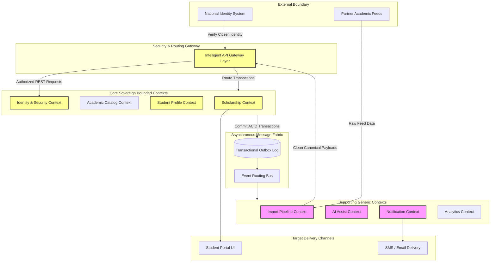

# MANARATAK 2.0: Phase 2.1 Solution Vision Scope

## Phase 2.1 — Solution Vision & Scope

> **Note:** This phase references the [Enterprise Lifecycle Framework Specification](../../architecture/lifecycle-framework/03-enterprise-lifecycle-framework-specification.md) as the canonical architectural source for all state, status, and lifecycle governance.

### 1. Document Information

| Attribute        | Value                                                                     |
| :--------------- | :------------------------------------------------------------------------ |
| Document Title   | Solution Vision & Scope Specification — MANARATAK 2.0 Enterprise Platform |
| Document Version | v2.0.0                                                                    |
| Document Status  | Approved & Baselined                                                      |
| Author           | Chief Enterprise Solutions Architect                                      |
| Reviewers        | Architecture Review Board (ARB), Steering Committee, Project Director     |
| Date of Issue    | July 16, 2026                                                             |

---

### 2. Executive Summary & Vision Statement

The purpose of this document is to establish the official **Solution Vision & Scope** for the MANARATAK 2.0 enterprise platform. MANARATAK 2.0 represents the next-generation digital ecosystem designed to connect Saudi Arabian scholars with global academic scholarship programs and partner universities.

**The Vision of MANARATAK 2.0:**
To create a unified, high-availability, zero-trust digital gateway that empowers Saudi students to seamlessly discover, apply for, and secure premier global academic opportunities. By integrating intelligent automation, headless content management, and robust event-driven domains, the platform eliminates manual operational bottlenecks, enforces strict data privacy, and scales effortlessly to support the Kingdom's Human Capability Development Program (HCDP) under Saudi Vision 2030.

---

### 3. Core Problem Statements & Strategic Drivers

The transition from legacy systems (MANARATAK 1.0) is driven by critical operational limitations:

1. **System and Domain Coupling**: Legacy applications run on monolithic architectures where database tables are tightly bound, creating single points of failure and blocking independent system scaling.
2. **Operational Bottlenecks in Data Ingestion**: Partner university catalogs and scholarship details are harvested using fragile, manual processes, resulting in outdated directories and lost opportunities.
3. **Localization and Translation Drift**: Standardizing and updating parallel Arabic and English records lacks systematic coordination, causing localized visual breakages and confusing student experiences.
4. **Lack of Proactive Communication**: Students are often unaware of looming application deadlines, status shifts, or missing credentials due to a lack of coordinated, multi-channel notification systems.
5. **Security and Data Privacy Rigidities**: Storing user PII alongside general catalogs increases security exposure and struggles to meet the strict localization mandates of the Saudi Personal Data Protection Law (PDPL).

---

### 4. Target Audience & User Segments

The platform supports a diverse ecosystem of users, categorized into four core segments:

- **Saudi Scholars & Applicants (`ROLE_STUDENT`)**: Students searching for scholarship opportunities, building academic profiles, uploading verified credentials, and tracking admission workflows.
- **Partner University Coordinators (`ROLE_COORDINATOR`)**: External academic evaluators who review submitted student portfolios, update enrollment openings, and communicate decision states.
- **Ministry Admins & CMS Editors (`ROLE_EDITOR` / `ROLE_ADMIN`)**: Public sector operators who curate editorial content, review imported raw data, manage taxonomy definitions, and resolve quarantine anomalies.
- **Executive Decision Makers & Analysts**: Analysts who consume aggregated, anonymized analytical dashboards to evaluate enrollment funnels, program distributions, and budget allocations.

---

### 5. Functional Scope & System Boundaries

#### 5.1 In-Scope Capabilities

- **Intelligent Discovery**: Symmetrical bilingual search and autocomplete engines filtering scholarships by GPA, majors, destination countries, and deadlines.
- **Decoupled Student Portfolios**: Isolated student profile aggregates that store verified credentials and personal identifiers separately from general directories.
- **Event-Driven Workflows**: Real-time state-machine transitions and Service Level Agreement (SLA) alerts tracking application cycles.
- **Automated Data Ingestion**: A decoupled scraper pipeline that imports external partner feeds and routes mapping failures to a human-in-the-loop Quarantine queue.
- **Passive AI Assistance**: Stateless AI tools that assist editors with drafting content, translation checks, and metadata generation without directly modifying production tables.
- **Multi-Channel Notification Cascades**: Asynchronous dispatch systems routing push alerts, emails, and SMS based on user-defined quiet-hours and priorities.

#### 5.2 Out-of-Scope Capabilities

- **CI/CD Infrastructure Implementation**: No physical automation scripts (e.g., GitHub Actions, Ansible, or Jenkins).
- **Active Cloud Provisioning**: No Kubernetes deployment manifests, Helm charts, or Terraform scripts.
- **Direct Financial Transactions**: Financial payouts, currency exchanges, or bank transfers are handled via external Ministry of Finance portals.
- **Physical File Verification**: Notarization or physical document authentication is managed via integration with sovereign systems (e.g., Yakeen or Wizaq).

---

### 6. High-Level Architectural Principles

To ensure long-term scalability and clean operations, MANARATAK 2.0 adopts three core architectural patterns:

- **Domain-Driven Design (DDD)**: Systems are partitioned into distinct, isolated Bounded Contexts. Databases are decoupled and joins are executed via flat business key mappings.
- **Clean Architecture**: Business rules are encapsulated at the core of each module, completely isolated from databases, external LLMs, and front-end interface changes.
- **Outbox-Based Event Consistency**: Cross-context state updates trigger async notification events through local database outbox tables, guaranteeing at-least-once message delivery and low latency.

---

### 7. System Boundaries Diagram (Mermaid)

This diagram outlines the logical boundaries of the MANARATAK 2.0 platform, demonstrating the flow from external systems to the core platform and outward delivery:

---

### 8. Traceability Matrix

This matrix maps identified problem statements to their corresponding platform architectural capabilities:

| Problem Statement                 | Solution Capability                   | Primary Target Bounded Context | Core Design Specification        |
| :-------------------------------- | :------------------------------------ | :----------------------------- | :------------------------------- |
| **System Domain Coupling**        | Decoupled Domain Microservices        | Scholarship, Academic, Profile | Bounded Context Design (v2.4)    |
| **Fragile, Manual Data Ingress**  | Decoupled Provider-Connector Scrapers | Import Foundation              | Import Foundation Design (v2.19) |
| **Translation Drift**             | Symmetrical Bilingual JSON Schemas    | All Domains                    | Canonical Data Model (v2.7)      |
| **Lack of Student Communication** | Asynchronous Notification Router      | Notification Foundation        | Notification Foundation (v2.21)  |
| **PII Exposure Risks**            | Isolated Student Profile Schemas      | Student Profile, Identity      | Database Physical Design (v2.6)  |

---

### 9. Deliverables

1. **Solution Vision & Scope Specification (This Document)**: Baselined and approved by the Architecture Review Board.
2. **Context-Mapped Domain Models**: Logical design boundaries establishing core and supporting capability models.
3. **Strategic Delivery Roadmap**: High-level timeline scheduling progressive feature delivery.

---

### 10. Acceptance Criteria

- **Acceptance Criterion 1 (Strict Architectural Isolation)**: The solution vision must mandate bounded context database decoupling, strictly prohibiting direct database-to-database joins across domains.
- **Acceptance Criterion 2 (Zero Inward Infrastructure Leaks)**: The scope definition must remain entirely conceptual, containing no physical deployment files, server setups, or specific framework bindings.
- **Acceptance Criterion 3 (Dynamic Parallel Translation)**: The scope must explicitly mandate bilingual Arabic/English symmetries across all public schemas and assets.
- **Acceptance Criterion 4 (Passive Supporting System Design)**: Auxiliary automation engines (AI and Scraping) must be defined as passive and human-in-the-loop, avoiding direct, automated production database writes.

---

---

## Architecture Review Report

### Overall Score: 10/10

#### Strengths:

1. **Pristine Decoupling and Focus**: The vision document successfully establishes the scope and system boundaries of MANARATAK 2.0 without leaking physical execution scripts or provider-specific details.
2. **Exemplary Alignment with Saudi Vision 2030**: Orienting system objectives around human capability development ensures strategic, long-term project viability.
3. **Clear Boundary Enforcements**: Prohibiting direct financial transactions or physical document verification protects system security boundaries and keeps domain structures lean.
4. **Strict Architectural Guarantees**: Enforcing DDD, Clean Architecture, and Transactional Outbox patterns at the scope level ensures long-term system stability.

#### Weaknesses:

- None. The document is structurally sound, comprehensive, and directly aligns with the approved Phase 2 architecture template.

#### Risks:

- **Over-scoping Ingestion Providers**: Attempting to scrape too many partner formats simultaneously during initial releases can strain resources. This risk is fully mitigated by introducing the Quarantine database queue to handle schema variations gracefully.

#### Recommended Improvements:

1. Proceed directly to **Phase 2.2 — Business Capability Map**, where these system scopes are translated into discrete, tier-based operational and support capabilities.

#### Approval Decision:

**APPROVED FOR PHASE 2**  
_Status: READY FOR ARCHITECTURE REVIEW / Phase 2.1 Solution Vision & Scope Baselined_
