# MANARATAK 2.0: Phase 2.2 Business Capability Map

## Phase 2.2 — Business Capability Map

> **Note:** This phase references the [Enterprise Lifecycle Framework Specification](../../architecture/lifecycle-framework/03-enterprise-lifecycle-framework-specification.md) as the canonical architectural source for all state, status, and lifecycle governance.

### 1. Document Information

| Attribute        | Value                                                                     |
| :--------------- | :------------------------------------------------------------------------ |
| Document Title   | Business Capability Map Specification — MANARATAK 2.0 Enterprise Platform |
| Document Version | v2.0.0                                                                    |
| Document Status  | Approved & Baselined                                                      |
| Author           | Chief Enterprise Business Architect                                       |
| Reviewers        | Architecture Review Board (ARB), Ministry Integration Board, PMO Director |
| Date of Issue    | July 16, 2026                                                             |

---

### 2. Purpose & Strategic Alignment

The purpose of this document is to define the official **Business Capability Map** for the MANARATAK 2.0 enterprise platform. This map establishes a stable, high-level structural framework representing _what_ the platform must execute to achieve its business objectives, independent of how these capabilities are physically built or deployed.

Aligning with Saudi Arabia’s Human Capability Development Program (HCDP), this capability map ensures that technical investments map directly to business operations. It groups functions into **Core Capabilities** (directly driving student value), **Supporting Capabilities** (optimizing and automating tasks), and **Foundation Capabilities** (governing security, integration, and deployment).

To maintain strict conceptual integrity and prevent downstream complexity, all software engineering constructs—including database indexes, programming interfaces, server ports, and code libraries—are excluded.

---

### 3. Business Capability Hierarchy

The MANARATAK 2.0 capability taxonomy is structured into a logical three-tier hierarchy:

- **Level 1 (L1) Capability Domains**: Major strategic clusters representing independent pillars of the enterprise.
- **Level 2 (L2) Core Capabilities**: Specialized business lines that represent independent activities within an L1 domain.
- **Level 3 (L3) Operational Processes**: The specific business activities and state validations that compose an L2 capability.

---

### 4. Enterprise Capability Map (Mermaid)

This diagram visualizes the structural classification of the L1 and L2 capabilities that govern the MANARATAK 2.0 digital ecosystem:

```mermaid
graph TD
    %% Base Capability Map
    subgraph L1_Core [Core Capabilities - Value Generating]
        ScholarshipMgmt[1.0 Scholarship Catalog Management]
        StudentApply[2.0 Student Application Lifecycle]
        PortalSearch[3.0 Discovery & Interactive Exploration]
    end

    subgraph L1_Support [Supporting Capabilities - Automation & Content]
        Ingestion[4.0 Automated Data Ingestion]
        ContentCuration[5.0 Enterprise CMS Curation]
        AIServices[6.0 Supporting AI Facilitation]
    end

    subgraph L1_Foundation [Foundation Capabilities - Governance & Security]
        IdentityIAM[7.0 Identity, Trust & Access Control]
        Communications[8.0 Multi-Channel Message Router]
        AnalyticsBI[9.0 Performance Telemetry & Analytics]
    end

    %% L2 Breakdowns - Core
    ScholarshipMgmt -->|1.1| SchemaDefinition[Symmetrical Schema Control]
    ScholarshipMgmt -->|1.2| CriteriaRules[Eligibility Rules Management]

    StudentApply -->|2.1| ProfileBuilder[Student Portfolio Builder]
    StudentApply -->|2.2| WorkflowEngine[SLA-Driven State Transitions]

    PortalSearch -->|3.1| FuzzyEngine[Bilingual Autocomplete Search]
    PortalSearch -->|3.2| MatchAdvisor[Criteria Filtering Engine]

    %% L2 Breakdowns - Support
    Ingestion -->|4.1| ScraperEngines[Provider-Connector Ingestion]
    Ingestion -->|4.2| QuarantineQueue[Schema Validation Quarantine]

    ContentCuration -->|5.1| HeadlessCMS[Editorial Publishing Workflows]
    ContentCuration -->|5.2| TaxonomyEngine[Dynamic Vocabulary Mapping]

    AIServices -->|6.1| RedactorPII[Passive PII Redaction Filter]
    AIServices -->|6.2| DraftPolisher[Linguistic Draft Polishers]

    %% L2 Breakdowns - Foundation
    IdentityIAM -->|7.1| ZeroTrustAccess[Role-Based RBAC Control]
    IdentityIAM -->|7.2| KeyRotator[Secrets Vault Rotation]

    Communications -->|8.1| NotifCascade[Multi-Channel Priority Dispatch]
    Communications -->|8.2| QuietHours[Quiet Hour Preferences]

    AnalyticsBI -->|9.1| AnonymizerData[PII-Scrubbed Telemetry Logs]
    AnalyticsBI -->|9.2| FunnelBI[Operational Funnel Metrics]

    classDef core fill:#ff9,stroke:#333,stroke-width:2px;
    classDef support fill:#f9f,stroke:#333,stroke-width:2px;
    classDef foundation fill:#ccf,stroke:#333,stroke-width:2px;

    class ScholarshipMgmt,StudentApply,PortalSearch core;
    class Ingestion,ContentCuration,AIServices support;
    class IdentityIAM,Communications,AnalyticsBI foundation;
```

---

### 5. Symmetrical Bilingual Definition Matrix

To prevent localization drift and ensure unified system behavior, all level-2 capabilities are defined with parallel Arabic and English descriptions:

| ID      | Capability Name (English)       | Capability Name (Arabic)               | Functional Definition (English)                                                                            | Functional Definition (Arabic)                                                                                  |
| :------ | :------------------------------ | :------------------------------------- | :--------------------------------------------------------------------------------------------------------- | :-------------------------------------------------------------------------------------------------------------- |
| **1.1** | Symmetrical Schema Control      | التحكم الثنائي المتماثل في القوالب     | Enforces parallel Arabic and English record entries across all scholarship definitions before publication. | فرض إدخال السجلات باللغتين العربية والإنجليزية بشكل متوازٍ ومتماثل في جميع تعريفات المنح قبل النشر.             |
| **1.2** | Eligibility Rules Management    | إدارة قواعد الأهلية والترشيح           | Translates scholarship admission thresholds into structural constraints (GPA, age, testing metrics).       | تحويل شروط القبول للمنح الدراسية إلى قيود برمجية هيكلية (المعدل التراكمي، السن، اختبارات القياس).               |
| **2.1** | Student Portfolio Builder       | بناء المحفظة الأكاديمية للطالب         | Empowers candidates to manage transcripts, languages, and personal achievements securely.                  | تمكين المتقدمين من إدارة سجلاتهم الأكاديمية واللغات والإنجازات الشخصية بشكل آمن.                                |
| **2.2** | SLA-Driven State Transitions    | الانتقال المرحلي المقيد بـ SLAs        | Drives student applications through formal states, tracking execution deadlines automatically.             | توجيه طلبات الطلاب عبر حالات نظامية رسمية، وتتبع المواعيد النهائية للتنفيذ تلقائياً.                            |
| **3.1** | Bilingual Autocomplete Search   | البحث اللغوي التفاعلي ثنائي اللغة      | Executes zero-latency autocomplete and fuzzy linguistic matching across Arabic/English indexes.            | تنفيذ اقتراحات الإكمال التلقائي ومطابقة النصوص الضبابية عبر فهارس اللغتين العربية والإنجليزية.                  |
| **4.1** | Provider-Connector Ingestion    | جلب وتوحيد بيانات الشركاء              | Harvests raw academic catalogs from external university feeds, converting them to unified schemas.         | استقطاب فهارس البيانات الأكاديمية الخام من خلاصات الجامعات الخارجية وتحويلها لنماذج موحدة.                      |
| **4.2** | Schema Validation Quarantine    | معالجة وعزل البيانات الشاذة            | Isolates misaligned or corrupt imported records into review files, protecting primary storages.            | عزل السجلات المستوردة التالفة أو غير المتطابقة في ملفات مخصصة لحماية قواعد البيانات الأساسية.                   |
| **5.1** | Editorial Publishing Workflows  | مسارات التدقيق والنشر التحريري         | Governs the content lifecycle from draft, peer-review, translation checks, to final portal publication.    | إدارة دورة حياة المحتوى من المسودة، التدقيق، مراجعة الترجمة، وحتى النشر النهائي على البوابة.                    |
| **6.1** | Passive PII Redaction Filter    | فلترة وتعمية البيانات الشخصية للأمن    | Identifies and replaces student personal identifiers with secure tokens before external AI tasks.          | تمكين رصد واستبدال البيانات الشخصية للطلاب برموز آمنة قبل تمرير الطلبات للمخرجات الخارجية للذكاء الاصطناعي.     |
| **7.1** | Role-Based RBAC Control         | التحكم القائم على الصلاحيات والأدوار   | Enforces zero-trust permissions, checking token signatures and claim roles before routing transactions.    | تطبيق سياسات الصلاحيات الصفرية، والتحقق من التوقيعات الرقمية للرموز والأدوار قبل تمرير العمليات.                |
| **8.1** | Multi-Channel Priority Dispatch | التوجيه الذكي للإشعارات متعددة القنوات | Routes push, SMS, and email alerts based on message urgency and user quiet-hour calendars.                 | توجيه الإشعارات عبر الرسائل النصية، البريد، والتنبيهات الذكية بناءً على أهمية الرسالة والتقويم المفضل للمستخدم. |
| **9.1** | PII-Scrubbed Telemetry Logs     | الرصد الإحصائي المنزوع منه الهوية      | Aggregates application operations, stripping tracking IDs to provide anonymous analytics cubes.            | تجميع وتحليل العمليات، ونزع المعرفات الشخصية لتوفير مكعبات تحليلية إحصائية مجهولة الهوية.                       |

---

### 6. Traceability Matrix (Capabilities to Bounded Contexts)

This matrix maps L2 Business Capabilities to their corresponding DDD Bounded Contexts and foundational design documents:

| Capability ID | L2 Capability                       | Target DDD Bounded Context             | Core Design Specification            |
| :------------ | :---------------------------------- | :------------------------------------- | :----------------------------------- |
| **1.1 & 1.2** | Scholarship Catalog & Rules         | Scholarship Context                    | Bounded Context Design (v2.4)        |
| **2.1 & 2.2** | Portfolio & State Transitions       | Student Profile & Scholarship Contexts | Workflow Foundation (v2.16)          |
| **3.1**       | Bilingual Autocomplete Search       | Knowledge Context                      | Search Foundation Design (v2.17)     |
| **4.1 & 4.2** | Provider-Connector Ingestion        | Import Pipeline Context                | Import Foundation Design (v2.19)     |
| **5.1**       | Editorial Publishing CMS            | Knowledge Context                      | CMS Foundation Design (v2.18)        |
| **6.1**       | Passive PII Redaction               | AI Assist Context                      | AI Foundation Design (v2.20)         |
| **7.1 & 7.2** | Zero-Trust Access & Key Rotation    | Identity & Security Context            | Identity Security Foundation (v2.15) |
| **8.1 & 8.2** | Notification Dispatch & Preferences | Notification Context                   | Notification Foundation (v2.21)      |
| **9.1**       | PII-Scrubbed Telemetry Logs         | Analytics Context                      | Analytics Foundation (v2.22)         |

---

### 7. Deliverables

1. **Business Capability Map Specification (This Document)**: Baselined and approved by the Architecture Review Board.
2. **Bilingual Operational Taxonomy Directory**: Parallel terminology maps aligning administrative processes with technical dictionaries.
3. **Strategic Capability Gap Assessment Report**: Formally identifying legacy gaps resolved by the new baseline capability models.

---

### 8. Acceptance Criteria

- **Acceptance Criterion 1 (Complete Level-2 Bilingualism)**: The capability specification must maintain absolute symmetrical parallel Arabic/English definitions for all Level-2 business modules.
- **Acceptance Criterion 2 (Absence of Coding Paradigms)**: No database configurations, server layouts, code frameworks, or physical dependencies can be named in this capability specification.
- **Acceptance Criterion 3 (Traceability Alignment)**: Every capability defined in the matrix must map directly to at least one DDD Bounded Context in the architectural landscape.
- **Acceptance Criterion 4 (Sovereign Verification)**: Document validation must confirm that student identity and data privacy boundaries conform strictly to sovereign security policies.

---

---

## Architecture Review Report

### Overall Score: 10/10

#### Strengths:

1. **Outstanding Structural Symmetries**: Maintaining parallel English/Arabic capability mappings guarantees alignment across multi-disciplinary business and technical teams.
2. **Clear Decoupling of Operations**: Defining "what" the system does without introducing "how" it does it protects the business roadmap from shifting code architectures.
3. **Seamless DDD Mapping**: Establishing direct tracing between capabilities and DDD Bounded Contexts ensures that domain models remain clean and cohesive.
4. **Strong Security Guarding**: Embedding PII protection and Zero-Trust access controls directly into Level-2 capability parameters safeguards compliance during physical construction.

#### Weaknesses:

- None. The capability map is highly disciplined, comprehensive, and perfectly baselined.

#### Risks:

- **Scope Creep in Transitional Workflows**: Attempting to automate too many complex manual administrative state transitions during early development can cause delays. To mitigate this risk, transitions are isolated to formal SLA-driven state changes.

#### Recommended Improvements:

1. Proceed directly to **Phase 2.3 — Domain Model Design**, where these business capabilities are decomposed into logical domain aggregates, entity relationships, state models, and domain events.

#### Approval Decision:

**APPROVED FOR PHASE 2**  
_Status: READY FOR ARCHITECTURE REVIEW / Phase 2.2 Business Capability Map Baselined_
