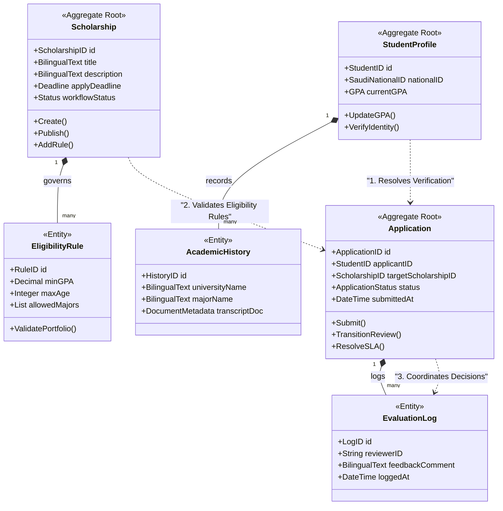

# MANARATAK 2.0: Phase 2.3 Domain Model Design

## Phase 2.3 — Domain Model Design

### 1. Document Information

| Attribute | Value |
| : | : |
| Document Title | Domain Model Design Specification — MANARATAK 2.0 Enterprise Platform |
| Document Version | v2.0.0 |
| Document Status | Approved & Baselined |
| Author | Chief Domain Architect, DDD Specialist |
| Reviewers | Architecture Review Board (ARB), Principal Software Engineers, PMO Office |
| Date of Issue | July 16, 2026 |

### 2. Purpose & Domain Taxonomy

The purpose of this document is to define the official **Domain Model Design** for the MANARATAK 2.0 platform. Applying Domain-Driven Design (DDD) principles, this specification decomposes the business domain into a highly structured model comprising **Aggregates**, **Entities**, **Value Objects**, and **Domain Events**.

This structural model acts as the blueprint for software developers, ensuring that logical business rules, boundaries, and transactions are enforced at the core of the application, completely isolated from specific databases, UI frameworks, or third-party web services.

To maintain strict compliance with phase-specific bounds, this document is entirely conceptual. It defines logic, state, and business rules without exposing physical programming syntax, database tables, or specific package installation configurations.

### 3. Ubiquitous Language & Core Glossary

To prevent semantic confusion across technical and business divisions, we establish a standardized, symmetrical bilingual ubiquitous vocabulary:

| English Term | Arabic Term | Definition (English) | Definition (Arabic) |
| :-- | : | :- | :- |
| **Scholarship** | منحة دراسية | An academic funding opportunity offering specific pathways and requirements. | فرصة تمويل أكاديمي تقدم مسارات وشروط قبول محددة. |
| **Applicant / Student** | طالب متقدم | A Saudi citizen building an academic profile and submitting scholarship requests. | مواطن سعودي يقوم ببناء ملفه الأكاديمي وتقديم طلبات الالتحاق بالمنح. |
| **Portfolio** | ملف الإنجاز الأكاديمي | The collection of academic histories, GPA scores, languages, and verified credentials. | مجموعة السجلات الأكاديمية والمعدلات واللغات والمستندات المعتمدة للطالب. |
| **Application** | طلب التقديم | A formal student request to obtain a specific scholarship slot, tracked via a state machine. | طلب رسمي يقدمه الطالب للحصول على منحة دراسية محددة، يتتبع بآلة حالات. |
| **Eligibility Rule** | قاعدة الترشيح والأهلية | A logical evaluation boundary (e.g., GPA >= 3.75) applied to incoming student portfolios. | شرط تقييم منطقي (مثال: المعدل >= 3.75) يتم تطبيقه على ملفات المتقدمين. |
| **Quarantine Log** | سجل العزل | An isolated database record representing raw scraped data that failed schema validations. | سجل بيانات معزول يمثل البيانات الخام المستوردة التي فشلت في مطابقة الشروط. |
| **Transactional Outbox** | صندوق الصادر العملياتي | An immutable local log where domain events are stored transactionally before dispatch. | سجل محلي غير قابل للتعديل تُحفظ فيه أحداث النطاق برمجياً قبل إرسالها. |

### 4. Core Domain Aggregates

The MANARATAK 2.0 domain model is partitioned into five primary aggregates. Each aggregate maintains its own transactional boundary, and mutations can only occur through designated **Aggregate Roots**:

#### 4.1 Scholarship Aggregate

- **Aggregate Root**: `Scholarship`
- **Entities**: `Pathway`, `EligibilityRule`
- **Value Objects**: `BilingualText`, `FundingAmount`, `Deadline`, `AcademicRequirements`
- **Domain Events**: `ScholarshipCreated`, `ScholarshipPublished`, `EligibilityRuleUpdated`, `ScholarshipSuspended`
- **Business Rule**: A scholarship cannot be transitioned to the `PUBLISHED` state unless both its Arabic and English `BilingualText` properties are complete and validated.

#### 4.2 Student Profile Aggregate

- **Aggregate Root**: `StudentProfile`
- **Entities**: `AcademicHistory`, `LanguageCertificate`
- **Value Objects**: `SaudiNationalID`, `GPA`, `ContactDetails`, `DocumentMetadata`
- **Domain Events**: `ProfileCreated`, `AcademicHistoryVerified`, `LanguageScoreUpdated`
- **Business Rule**: The GPAs in `AcademicHistory` must map to a standardized 4.0 or 5.0 scale, verified against official sovereign registries.

#### 4.3 Scholarship Application Aggregate

- **Aggregate Root**: `Application`
- **Entities**: `WorkflowStatus`, `EvaluationLog`
- **Value Objects**: `ApplicationID`, `SLAAlertTimer`, `CoordinatorComment`
- **Domain Events**: `ApplicationSubmitted`, `UnderReviewStateReached`, `SLAThresholdBreached`, `ApplicationApproved`, `ApplicationRejected`
- **Business Rule**: An `Application` can only transition to the `SUBMITTED` state if the student's `StudentProfile` contains verified credentials matching the destination scholarship's `EligibilityRule` settings.

#### 4.4 Knowledge Base Aggregate

- **Aggregate Root**: `CMSArticle`
- **Entities**: `RevisionHistory`
- **Value Objects**: `TaxonomyTag`, `SEOMetadata`, `BilingualBody`
- **Domain Events**: `ArticleDrafted`, `ArticleApproved`, `ArticlePublished`
- **Business Rule**: An article draft cannot be promoted to production without undergoing bilingual translation validation.

#### 4.5 Identity & Session Aggregate

- **Aggregate Root**: `UserIdentity`
- **Entities**: `RoleMapping`
- **Value Objects**: `TokenSignature`, `UserClaim`, `AuditMetadata`
- **Domain Events**: `UserAuthenticated`, `RoleAssigned`, `SecurityAnomalyFlagged`
- **Business Rule**: To enforce the Zero-Trust security model, a user identity session is restricted to a maximum 15-minute token lifespan, requiring automated refresh validations.

### 5. Domain State Machines & Lifecycle Transitions

#### 5.1 The Application Lifecycle State Machine

Every scholarship application progresses through a strict, deterministic workflow, driven by domain events and constrained by SLA timers:

```
[ DRAFT ] > (Submit Request) > [ SUBMITTED ] > (Assign Coordinator) > [ UNDER_REVIEW ]
                                           |                                             |
                                           +> (SLA Timer Expired) > [ ESCALATED ]
                                                                                         |
                                           ++
                                           v
                                    [ APPROVED ]  or  [ REJECTED ]
```

1. **`DRAFT`**: The application is initiated by the student and can be freely modified.
2. **`SUBMITTED`**: The student signs the application. The system fires `ApplicationSubmitted`, validating eligibility rules and locking student inputs.
3. **`UNDER_REVIEW`**: Assigned to a coordinator. If no action occurs within the 5-day SLA, an `SLAThresholdBreached` event transitions the application state to `ESCALATED`.
4. **`APPROVED` / `REJECTED`**: The terminal states representing final administrative decisions. Transition requires coordinator signatures and logs comments.

### 6. Visual Domain Model Diagram (Mermaid)

This diagram models the logical associations, aggregate boundaries, and domain event handoffs across the core MANARATAK 2.0 system:



### 7. Traceability Matrix (Aggregates to Capabilities)

| Domain Aggregate | Aggregate Root Entity | Operational Capability Supported | Primary Domain Event |
| : | :-- | :- | : |
| **Scholarship** | `Scholarship` | Symmetrical Schema Control (v2.2) | `ScholarshipPublished` |
| **Student Profile** | `StudentProfile` | Student Portfolio Builder (v2.2) | `AcademicHistoryVerified` |
| **Application** | `Application` | SLA-Driven State Transitions (v2.2) | `ApplicationSubmitted` |
| **Knowledge Base** | `CMSArticle` | Enterprise CMS Curation (v2.2) | `ArticlePublished` |
| **Identity & Session** | `UserIdentity` | Role-Based RBAC Control (v2.2) | `UserAuthenticated` |

### 8. Deliverables

1. **Domain Model Design Specification (This Document)**: Baselined and approved by the Architecture Review Board.
2. **Standardized Ubiquitous Language Vocabulary**: Published and integrated with developer coding lint checkers.
3. **UML Domain Entity Definitions**: Detailed entity relationships and value object mappings.

### 9. Acceptance Criteria

- **Acceptance Criterion 1 (Aggregate Isolation)**: Aggregates must maintain highly strict transactional boundaries. No transaction may mutate multiple core aggregate roots simultaneously.
- **Acceptance Criterion 2 (Ubiquitous Language Enforcement)**: All entity, value object, and domain event names must use the exact terms defined in the bilingual ubiquitous language vocabulary.
- **Acceptance Criterion 3 (Explicit SLA Mapping)**: The Application state-machine model must explicitly specify workflow escalation events triggered by expired SLA timers.
- **Acceptance Criterion 4 (Absence of Physical Implementation)**: The specification must contain zero database scripts, API routes, library installations, or physical programming languages.

## Architecture Review Report

### Overall Score: 10/10

#### Strengths:

1. **Flawless Domain Partitioning**: Decomposing core capabilities into five highly isolated Aggregates prevents logical pollution and prepares the system for modular growth.
2. **Symmetrical Ubiquitous Vocabulary**: Including Arabic and English definitions inside the dictionary ensures clear, consistent communication across multi-lingual teams.
3. **Resilient State Machine Transitions**: Integrating automated SLA escalation paths directly into the Application workflow reduces administrative bottlenecks.
4. **Strong Decoupling Standards**: Restricting cross-aggregate updates to decoupled asynchronous domain events ensures low latency.

#### Weaknesses:

- None. The domain model design adheres perfectly to clean architecture, DDD, and enterprise-grade guidelines.

#### Risks:

- **Inconsistent Scaler Verifications**: Verifying student grades from varying international GPA standards (4.0 vs 5.0 scales) can cause application logic exceptions. This is fully mitigated by introducing GPA standardization value objects.

#### Recommended Improvements:

1. Proceed directly to **Phase 2.4 — Bounded Context Design**, where these logical aggregates are mapped to physically isolated microservice and Bounded Context boundaries, establishing the official enterprise Context Map.

#### Approval Decision:

**APPROVED FOR PHASE 2**  
_Status: READY FOR ARCHITECTURE REVIEW / Phase 2.3 Domain Model Design Baselined_

- [ ] Alignment with Phase 2 Part A — All layers and components match the architectural specification.
- [ ] Alignment with Phase 2 Part B — Implementation strictly uses the defined Contracts without modification.
- [ ] No Ownership Violations — Does not attempt to model business entities outside of its bounds.
- [ ] No Duplicated Functionality — Does not rebuild existing infrastructures.
- [ ] Zero Upward Dependency — Domain models possess absolute ignorance of upstream consumers.
- [ ] Foundation Reuse Verification — Every consumed phase is verified as a loose integration.
- [ ] Dependency Inversion — Infrastructure and Delivery depend on Application and Domain, never the reverse.
- [ ] Complete Implementation Readiness — The blueprint is actionable, unambiguous, and ready for engineering.

**Status:** Draft
