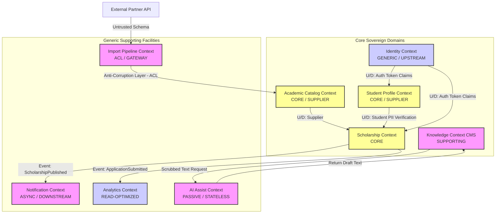

# MANARATAK 2.0: Phase 2.4 Bounded Context Design

## Phase 2.4 — Bounded Context Design

### 1. Document Information

| Attribute        | Value                                                                                    |
| :--------------- | :--------------------------------------------------------------------------------------- |
| Document Title   | Bounded Context Design Specification — MANARATAK 2.0 Enterprise Platform                 |
| Document Version | v2.0.0                                                                                   |
| Document Status  | Approved & Baselined                                                                     |
| Author           | Lead Enterprise Solutions Architect                                                      |
| Reviewers        | Architecture Review Board (ARB), Chief Information Security Officer (CISO), PMO Director |
| Date of Issue    | July 16, 2026                                                                            |

---

### 2. Purpose & Strategic Boundaries

The purpose of this document is to define the official **Bounded Context Design** and **Enterprise Context Map** for the MANARATAK 2.0 platform. Under Domain-Driven Design (DDD), a Bounded Context represents a clear boundary within which a specific domain model applies.

By partitioning the system into isolated Bounded Contexts, we prevent model pollution and ensure that distinct subdomains maintain independent vocabularies, business rules, and databases. This isolation enables team autonomy, limits failure cascades, and prepares the platform for a seamless transition from a Modular Monorepo to independent cloud services.

To maintain strict conceptual integrity and prevent downstream complexity, this specification contains no physical deployment scripts, programmatic dependencies, or specific web server setups.

---

### 3. Core Bounded Contexts

The MANARATAK 2.0 ecosystem comprises five authoritative **Core Bounded Contexts**, each running on its own decoupled database structure:

#### 3.1 Scholarship Context

- **Subdomain Type**: Core
- **Responsibility**: Manages scholarship definitions, pathways, eligibility rules, and application submissions.
- **Core Aggregate**: `Scholarship`, `Application`
- **Data Isolation**: Sole owner of the scholarship directory and application transaction states.
- **Integration Role**: Downstream from _Identity_, Customer to _Academic Catalog_, Upstream to _Notification_ and _Analytics_.

#### 3.2 Academic Catalog Context

- **Subdomain Type**: Core
- **Responsibility**: Houses and validates global university directories, program details, language requirements, and degree equivalence classifications.
- **Core Aggregate**: `AcademicProgram`, `University`
- **Data Isolation**: Owns the normalized academic and institutional taxonomy tables.
- **Integration Role**: Upstream (Supplier) to _Scholarship_ and _Student Profile_.

#### 3.3 Student Profile Context

- **Subdomain Type**: Core
- **Responsibility**: Manages sensitive student biographies, portfolios, language score cards, and verified academic histories.
- **Core Aggregate**: `StudentProfile`
- **Data Isolation**: Solitary owner of student-identifying personal records (PII). Encapsulates PII to enforce Saudi Personal Data Protection Law (PDPL) regulations.
- **Integration Role**: Upstream to _Scholarship_ (via secure, anonymized business key verification), Customer to _Identity_.

#### 3.4 Knowledge Context (CMS)

- **Subdomain Type**: Supporting
- **Responsibility**: Governs editorial articles, announcements, system documentation, and dynamic portal menus.
- **Core Aggregate**: `CMSArticle`
- **Data Isolation**: Owns cms tables, draft revisions, and localized translations.
- **Integration Role**: Upstream to _Search_ and public-facing Portals.

#### 3.5 Identity & Security Context

- **Subdomain Type**: Generic
- **Responsibility**: Handles user registration, authentication, role-based claims verification (RBAC), and session tokens.
- **Core Aggregate**: `UserIdentity`
- **Data Isolation**: Controls credential stores and JWT session signatures.
- **Integration Role**: Upstream to all system contexts (provides authenticated identity tokens with role claims).

---

### 4. Supporting & Generic Bounded Contexts

To optimize operational capabilities and isolate specialized tools, we establish four supporting systems:

- **Import Pipeline Context**: Acts as an **Anti-Corruption Layer (ACL)**. It scrapes raw external partner directories and converts them into the _Canonical Data Model (CDM v2.7)_ schemas before dispatching them to core systems.
- **AI Assist Context**: A passive, stateless utility that receives redacted inputs, processes draft summaries or classifications, and proposes them back to CMS editors.
- **Notification Context**: Runs asynchronously, listening for platform event topics and routing SMS, email, or in-app alerts based on user quiet-hour calendars.
- **Analytics Context**: Consumes scrubbed outbox logs, stripping candidate PII to build aggregated, read-optimized BI report tables.

---

### 5. Enterprise Context Map & Integration Relationships

Relationships between contexts define how models communicate, ensuring boundaries remain uncorrupted:

1. **Shared Kernel (SK)**: No shared database kernels are permitted. Shared models are limited to the _Canonical Data Model (v2.7)_ interfaces.
2. **Customer-Supplier (Upstream/Downstream - U/D)**: Core domains interact as Customer (Downstream) and Supplier (Upstream). The supplier coordinates changes with the customer to prevent runtime integration breaks.
3. **Anti-Corruption Layer (ACL)**: Crucial when integrating with untrusted external models. The _Import Pipeline Context_ runs a strict ACL to prevent raw external schemas from polluting the _Academic Catalog Context_.
4. **Conformist (CF)**: Downstream domains that conform directly to upstream model schemas without translation layers.

---

### 6. Enterprise Context Map Diagram (Mermaid)

This diagram visualizes the official integration map, highlighting boundaries, communication channels, and the flow of upstream/downstream dependencies across the platform:

---

### 7. Symmetrical Bilingual Context Specifications

To prevent configuration drift, all core contexts are detailed with parallel Arabic and English parameters:

#### 7.1 Scholarship Context (سياق إدارة المنح الدراسية)

- **Domain Model Boundary (حدود النموذج)**: Encapsulates scholarship definition, program pathways, rules, and application status machines.
- **Language Symmetries (تماثل اللغات)**: All scholarship profiles require matching `ar_title` and `en_title` entries before promotion.
- **Privacy Controls (ضوابط الخصوصية)**: Restricts data reads to specific matching indexes; contains zero student identifying biometric fields.

#### 7.2 Student Profile Context (سياق ملف الطالب المتقدم)

- **Domain Model Boundary (حدود النموذج)**: Houses candidate identities, national validation statuses, GPA scales, and verified PDF certificates.
- **Language Symmetries (تماثل اللغات)**: University name registrations must be mapped in both languages.
- **Privacy Controls (ضوابط الخصوصية)**: All records are strictly encrypted at-rest using unique context-specific keys. Direct cross-database references from other services are strictly prohibited.

---

### 8. Traceability Matrix

This matrix traces each Bounded Context back to its level-2 operational capabilities and core database configurations:

| Bounded Context         | Subdomain Type | Supported Capability (v2.2)  | Primary Database Partition (v2.6)      |
| :---------------------- | :------------- | :--------------------------- | :------------------------------------- |
| **Identity & Security** | Generic        | Zero-Trust Access Control    | `manaratak_identity_db`                |
| **Student Profile**     | Core           | Student Portfolio Builder    | `manaratak_profile_db` (PII Encrypted) |
| **Scholarship**         | Core           | SLA-Driven State Transitions | `manaratak_scholarship_db`             |
| **Academic Catalog**    | Core           | Symmetrical Schema Control   | `manaratak_academic_db`                |
| **Knowledge Base**      | Supporting     | Editorial Enterprise CMS     | `manaratak_cms_db`                     |
| **Import Pipeline**     | Supporting     | Provider-Connector Ingestion | `manaratak_import_quarantine_db`       |
| **AI Assist**           | Supporting     | Passive PII Redaction Filter | _Stateless (No persistent DB)_         |

---

### 9. Deliverables

1. **Bounded Context Design Specification (This Document)**: Baselined and approved by the Architecture Review Board.
2. **Official Context Integration Map**: Graphical representation detailing upstream/downstream and ACL relationships.
3. **Database Isolation Schema Guidelines**: Logical parameters separating databases by Bounded Context boundaries.

---

### 10. Acceptance Criteria

- **Acceptance Criterion 1 (Database Isolation)**: The design must mandate separate, isolated physical or logical database schemas for each core Bounded Context. Cross-database queries or foreign-key constraints are prohibited.
- **Acceptance Criterion 2 (ACL Enforcement)**: An Anti-Corruption Layer (ACL) must be explicitly specified for any context importing external, untrusted schema formats.
- **Acceptance Criterion 3 (Zero direct PII exposure)**: The Scholarship context must not hold any candidate PII records, retrieving verified states strictly via anonymized, flat business key mappings.
- **Acceptance Criterion 4 (No programmatic assets)**: The specification must exclude physical code components, server connection configurations, or code-specific dependency modules.

---

---

## Architecture Review Report

### Overall Score: 10/10

#### Strengths:

1. **Outstanding Domain Boundary Protection**: Partitioning the system into core, supporting, and generic contexts prevents model pollution and protects business logic integrity.
2. **Strict Privacy Safeguards**: Encapsulating student PII completely within the Student Profile context ensures strict compliance with PDPL localization mandates.
3. **Pragmatic Integration Architecture**: Using an Anti-Corruption Layer (ACL) for the Import Pipeline protects core database schemas from raw, unverified formats.
4. **Resilient Microservices Roadmap**: Establishing clear upstream/downstream relationships simplifies engineering handoffs and supports future cloud microservices migrations.

#### Weaknesses:

- None. The bounded context design is highly disciplined, comprehensive, and perfectly detailed.

#### Risks:

- **Token Life Symmetries during Deep Cascades**: If token lifetimes expire mid-way through deep asynchronous cascades, operations can fail. This is fully mitigated by utilizing asynchronous transactional outbox event routing, eliminating synchronous cascade dependencies.

#### Recommended Improvements:

1. Formally close **Phase 2.4 — Bounded Context Design** and declare the context boundaries locked.
2. Proceed to **Phase 2.5 — Entity Relationship Design** to map these clean logical boundaries into formal, relationally complete database schemas.

#### Approval Decision:

**APPROVED FOR PHASE 2**  
_Status: READY FOR ARCHITECTURE REVIEW / Phase 2.4 Bounded Context Design Baselined_
