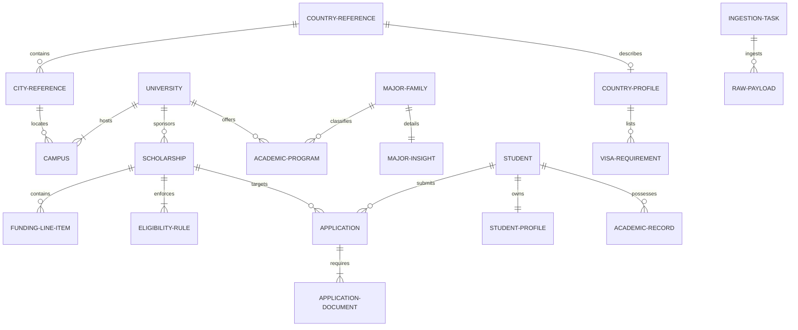

# MANARATAK 2.0: Phase 2.5 Entity Relationship Design

## Phase 2.5 — Entity Relationship Design (ERD)

### 1. Document Information

| Attribute        | Value                                                                                  |
| :--------------- | :------------------------------------------------------------------------------------- |
| Document Title   | Entity Relationship Design (ERD) — MANARATAK 2.0 Enterprise Platform                   |
| Document Version | v2.0.0                                                                                 |
| Document Status  | Draft for Official Architecture Review                                                 |
| Author           | Chief Enterprise Data Architect                                                        |
| Reviewers        | Architecture Review Board (ARB), Project Director, Chief Enterprise Solution Architect |
| Date of Issue    | July 16, 2026                                                                          |

---

### 2. Purpose

The purpose of this document is to establish the definitive, implementation-independent, and technology-neutral conceptual Entity Relationship Design (ERD) for the MANARATAK 2.0 platform. Building directly on the approved _Domain Model Design (v2.1.0)_ and _Bounded Context Design (v2.0.0)_, this specification maps the core and supporting aggregates into logical entities, attributes, relationships, ownership, and cardinalities.

This document serves as the absolute logical foundation that bridges the conceptual business domains with the physical databases designed in subsequent phases. It defines _what_ data structures exist, _how_ they are related, and _which_ domain context owns them, while strictly avoiding physical implementation leakage such as SQL, Prisma schema syntax, database-specific data types, or physical indexing strategies.

---

### 3. ERD Design Principles

The MANARATAK 2.0 Entity Relationship Design is governed by the following architectural mandates:

1. **Domain-Driven Context Partitioning**: Each Bounded Context owns its entities and data structures completely. Direct database-level joins or foreign key constraints crossing Bounded Context boundaries are strictly prohibited to ensure maximum module autonomy. Cross-context references are maintained solely via conceptual, immutable identity references (e.g., `UniversityId` stored as an attribute inside the `Scholarship` entity).
2. **Pristine Decoupling of Lookups vs. Rich Domains**: Master Reference Entities (such as standard ISO-3166 country lookups or academic classifications) are separated from rich transactional and editorial domains. This prevents schema locks and table corruption during intensive operations.
3. **Strict Composition over Aggregation**: Within an aggregate boundary, entities are managed via strict composition rules. Child entities (such as a `Campus` inside the `University` aggregate or `FundingLineItem` inside `Scholarship`) cannot exist without their aggregate root, and their lifecycles are completely governed by that root.
4. **Bilingual Parity Preservation**: Every textual attribute requiring translation does not use arbitrary multi-column mappings. Instead, it is systematically modeled via the conceptual `Translation` structure (complying with the Shared Kernel), representing localized `ar` and `en` attribute sets.
5. **No Polymorphism at the Schema Level**: To preserve relational integrity and database safety, polymorphic relationships are rejected. Where multiple targets are referenced (such as tracking applications applying to scholarships, universities, or courses), the system utilizes explicit, independent, nullable references bound by strict logical invariants ensuring exactly one relation is active.

---

### 4. Entity Classification

Entities are classified based on their lifecycle, volatility, and domain-driven architectural role:

- **Master Reference Entities**: High-stability, low-change rate entities that provide standardized lookup matrices (e.g., ISO country codes, currency lists, degree types). They act as shared conceptual points of reference.
- **Core Business Entities**: Highly volatile, transaction-oriented or core-value entities representing the primary business domain operations (e.g., `Scholarship`, `Student`, `Application`).
- **Supporting Business Entities**: Contextual entities providing deep organizational, academic, or informational profiles required to support core operations (e.g., `University`, `Campus`, `AcademicProgram`, `MajorFamily`, `CountryProfile`, `Article`).
- **Shared Entities**: Conceptually represent elements from the Shared Kernel that describe immutable primitives shared across contexts (e.g., `Money`, `DateRange`, `Translation`), modeled conceptually inside entity attributes.

---

### 5. Master Reference Entities

These entities reside in the **Lookup Reference Data** space. They contain static, read-only structures that provide standardized values for academic and geographical filtering.

#### 5.1. Country Reference Entity

- **Purpose**: Represents the standardized ISO-3166-1 alpha-2 geographical definition.
- **Owner Domain**: Knowledge Domain (Reference Metadata).
- **Primary Responsibility**: Validates international country boundaries, region mappings, and code alignments.
- **Attributes**: `CountryCode` (Unique Key), `EnglishName`, `ArabicName`, `ISOAlpha3Code`, `ISONumericCode`, `Region`.
- **Relationships**:
  - One-to-Many with `City Reference Entity` (Composition).
  - One-to-One with `CountryProfile` in Knowledge Context (Reference ID tracking).
- **Constraints**: `CountryCode` must follow the ISO-3166-1 alpha-2 format (2 uppercase characters).

#### 5.2. City Reference Entity

- **Purpose**: Represents standardized municipal administrative divisions.
- **Owner Domain**: Knowledge Domain (Reference Metadata).
- **Primary Responsibility**: Provides accurate city lookups within a specific country.
- **Attributes**: `CityId` (Unique Key), `CountryCode` (Foreign Key), `EnglishName`, `ArabicName`, `Timezone`.
- **Relationships**:
  - Many-to-One with `Country Reference Entity` (Composition boundary: a city cannot exist without a country).
  - One-to-Many with `Campus` in University Context (Cross-context identity reference).
- **Constraints**: Composite uniqueness of `CityId` and `CountryCode`.

#### 5.3. Currency Reference Entity

- **Purpose**: Standardized ISO-4217 financial currency definitions.
- **Owner Domain**: Shared Kernel (Reference Metadata).
- **Primary Responsibility**: Standardizes financial transactions and funding comparisons.
- **Attributes**: `CurrencyCode` (Unique Key), `EnglishName`, `ArabicName`, `Symbol`.
- **Relationships**: Aggregated conceptually by `Money` value structures across all domains.
- **Constraints**: `CurrencyCode` must follow ISO-4217 (3-letter uppercase alphabetic code).

#### 5.4. Language Reference Entity

- **Purpose**: Standardized ISO-639-1 language codes.
- **Owner Domain**: Shared Kernel (Reference Metadata).
- **Primary Responsibility**: Standardizes instructional language definitions and system localization.
- **Attributes**: `LanguageCode` (Unique Key), `LanguageName`, `NativeName`.
- **Relationships**: Conceptually referenced by `AcademicProgram` and translation components.
- **Constraints**: Must be valid ISO-639-1 2-letter codes.

#### 5.5. Academic Field Reference Entity

- **Purpose**: Standardized classification taxonomy of academic disciplines (e.g., ISCED-F 2013).
- **Owner Domain**: Academic Domain (Reference Metadata).
- **Primary Responsibility**: Maintains hierarchical taxonomies of fields and sub-fields (e.g., Engineering -> Software Engineering).
- **Attributes**: `FieldId` (Unique Key), `ParentFieldId` (Self-referential Key, Optional), `EnglishName`, `ArabicName`.
- **Relationships**:
  - One-to-Many with itself (Self-referential hierarchy).
  - One-to-Many with `MajorFamily` (Aggregation).
- **Constraints**: Circular self-referential relationships are prohibited.

---

### 6. Core Business Entities

#### 6.1. Scholarship Entity (Aggregate Root)

- **Purpose**: Governs the funding lifecycle, offering entity details, eligibility parameters, and benefits.
- **Owner Domain**: Scholarship Domain.
- **Primary Responsibility**: Acts as the single source of truth for scholarship options, validating deadliness, and holding criteria metrics.
- **Attributes**: `ScholarshipId` (Unique Key), `UniversityId` (Identity Reference), `EnglishTitle`, `ArabicTitle`, `EnglishDescription`, `ArabicDescription`, `ProviderName`, `FundingType` (Fully/Partially Funded), `ApplicationDeadline` (DateRange), `OperatingStatus` (Draft, In-Review, Published, Expired, Archived).
- **Relationships**:
  - One-to-Many with `FundingLineItem` (Composition: Scholarship owns line items).
  - One-to-Many with `EligibilityRule` (Composition: Scholarship owns rules).
  - One-to-Many with `Application` in Student Context (Cross-context identity reference).
- **Constraints**: `ApplicationDeadline` must not represent an invalid or negative date range.

#### 6.2. FundingLineItem Entity

- **Purpose**: Captures granular financial coverage items associated with a scholarship.
- **Owner Domain**: Scholarship Domain.
- **Primary Responsibility**: Defines specific financial benefits (e.g., Tuition coverage, monthly stipend, travel allowance).
- **Attributes**: `LineItemId` (Unique Key), `ScholarshipId` (Foreign Key), `BenefitCategory` (Stipend, Tuition, Travel, Health, Housing), `ValueAmount` (Money structure: Amount + CurrencyCode), `DescriptionEnglish`, `DescriptionArabic`.
- **Relationships**:
  - Many-to-One with `Scholarship Entity` (Composition: Lifecycle is strictly bound to parent Scholarship).
- **Constraints**: `ValueAmount` must be non-negative.

#### 6.3. EligibilityRule Entity

- **Purpose**: Models the multi-dimensional prerequisites required to qualify for a scholarship.
- **Owner Domain**: Scholarship Domain.
- **Primary Responsibility**: Validates candidate profile parameters against scholarship restrictions during matchmaking.
- **Attributes**: `RuleId` (Unique Key), `ScholarshipId` (Foreign Key), `CriteriaType` (GPA, IELTS, TOEFL, Nationality, Age, Gender), `RequiredValue` (Value/Range definition), `Operator` (LessThan, GreaterThan, Equals, InList).
- **Relationships**:
  - Many-to-One with `Scholarship Entity` (Composition: Lifecycle bound to parent Scholarship).
- **Constraints**: Match operator and criteria type compatibility must be maintained logically.

#### 6.4. Student Entity (Aggregate Root)

- **Purpose**: Represents the unified identity, academic background, and transaction records of an applicant.
- **Owner Domain**: Student & Application Domain.
- **Primary Responsibility**: Governs the user application lifecycle and personal preference evaluations.
- **Attributes**: `StudentId` (Unique Key), `IdentityId` (Identity Context Reference), `Email`, `RegisteredAt`.
- **Relationships**:
  - One-to-One with `StudentProfile` (Composition).
  - One-to-Many with `AcademicRecord` (Composition).
  - One-to-Many with `Application` (Composition).
  - One-to-One with `StudentPreference` (Composition).
  - One-to-Many with `SavedItem` (Composition).
- **Constraints**: Email must comply with RFC-5322 format specifications.

#### 6.5. StudentProfile Entity

- **Purpose**: Holds personal metadata and current structural status of the student.
- **Owner Domain**: Student & Application Domain.
- **Primary Responsibility**: Maintains demographic profiles and background parameters.
- **Attributes**: `ProfileId` (Unique Key), `StudentId` (Foreign Key), `FirstName`, `LastName`, `BirthDate`, `Gender`, `NationalityCode` (CountryCode reference), `ResidenceCountryCode` (CountryCode reference).
- **Relationships**:
  - One-to-One with `Student Entity` (Composition: Lifecycle bound to parent Student).
- **Constraints**: BirthDate must represent a date in the past.

#### 6.6. Application Entity

- **Purpose**: Represents a transactional application submission made by a student to a specific target opportunity.
- **Owner Domain**: Student & Application Domain.
- **Primary Responsibility**: Tracks document status, review stages, and submission transitions.
- **Attributes**: `ApplicationId` (Unique Key), `StudentId` (Foreign Key), `TargetType` (Scholarship, University, AcademicProgram), `ScholarshipId` (Identity Reference, Nullable), `UniversityId` (Identity Reference, Nullable), `AcademicProgramId` (Identity Reference, Nullable), `SubmissionDate` (Timestamp), `ApplicationStatus` (Draft, Submitted, UnderReview, Accepted, Rejected, Cancelled), `Notes`.
- **Relationships**:
  - Many-to-One with `Student Entity` (Composition: Lifecycle bound to parent Student).
  - One-to-Many with `ApplicationDocument` (Composition).
- **Constraints**: Polymorphism replacement: Exactly one of `ScholarshipId`, `UniversityId`, or `AcademicProgramId` must be non-null depending on `TargetType`.

#### 6.7. ApplicationDocument Entity

- **Purpose**: Represents a verified academic or personal document uploaded by a student specifically for an application.
- **Owner Domain**: Student & Application Domain.
- **Primary Responsibility**: Links application submissions with secure files in restricted storage.
- **Attributes**: `DocumentId` (Unique Key), `ApplicationId` (Foreign Key), `DocumentType` (Transcript, Passport, CV, IELTS_Certificate, RecommendationLetter), `FileKeyReference` (Pointer to isolated object storage), `VerificationStatus` (Pending, Verified, Rejected).
- **Relationships**:
  - Many-to-One with `Application Entity` (Composition: Lifecycle strictly bound to parent Application).
- **Constraints**: Documents cannot be modified once the Application moves past "Draft" state.

#### 6.8. AcademicRecord Entity

- **Purpose**: Represents a validated piece of academic history associated with a student's portfolio.
- **Owner Domain**: Student & Application Domain.
- **Primary Responsibility**: Holds qualifications and score details (GPAs, standardized test scores) for eligibility mapping.
- **Attributes**: `RecordId` (Unique Key), `StudentId` (Foreign Key), `EducationLevel` (HighSchool, Bachelor, Master), `InstitutionName`, `GraduationYear`, `GpaValue`, `GpaScale`, `StandardizedTestType` (IELTS, TOEFL, SAT, GRE, None), `StandardizedScore` (Composite Value).
- **Relationships**:
  - Many-to-One with `Student Entity` (Composition: Lifecycle bound to parent Student).
- **Constraints**: `GpaValue` cannot exceed `GpaScale`.

---

### 7. Supporting Business Entities

#### 7.1. University Entity (Aggregate Root)

- **Purpose**: Models higher educational institutions, their global footprint, and operational hierarchies.
- **Owner Domain**: University Domain.
- **Primary Responsibility**: Houses institutional data, ranking stats, and accreditations.
- **Attributes**: `UniversityId` (Unique Key), `EnglishName`, `ArabicName`, `EnglishDescription`, `ArabicDescription`, `GlobalRanking`, `AccreditationStatus`, `EstablishedYear`, `LogoImageKeyReference`.
- **Relationships**:
  - One-to-Many with `Campus` (Composition: University owns campuses).
  - One-to-Many with `AcademicProgram` in Academic Context (Cross-context identity reference).
- **Constraints**: `GlobalRanking` must be a positive non-zero integer.

#### 7.2. Campus Entity

- **Purpose**: Represents a specific physical or regional branch of an institution.
- **Owner Domain**: University Domain.
- **Primary Responsibility**: Tracks geolocations, facilities, and regional accreditations of specific campuses.
- **Attributes**: `CampusId` (Unique Key), `UniversityId` (Foreign Key), `CampusNameEnglish`, `CampusNameArabic`, `CountryCode` (CountryCode reference), `CityId` (CityId reference), `IsMainBranch`.
- **Relationships**:
  - Many-to-One with `University Entity` (Composition: Lifecycle bound to parent University).
- **Constraints**: A single University can possess at most one Campus marked as `IsMainBranch` active at any time.

#### 7.3. AcademicProgram Entity (Aggregate Root)

- **Purpose**: Governs specific degrees, curricula, and courses offered by universities.
- **Owner Domain**: Academic Domain.
- **Primary Responsibility**: Holds specific study plans, program-specific tuition structures, and language of instruction definitions.
- **Attributes**: `ProgramId` (Unique Key), `UniversityId` (Identity Reference), `CampusId` (Identity Reference), `MajorFamilyId` (Foreign Key), `EnglishTitle`, `ArabicTitle`, `StudyMode` (FullTime, PartTime, Online, Hybrid), `DegreeLevel` (Bachelor, Master, PhD), `DurationMonths`, `TuitionFee` (Money structure), `InstructionLanguage` (LanguageCode reference).
- **Relationships**:
  - Many-to-One with `MajorFamily` (Aggregation).
- **Constraints**: `DurationMonths` must be greater than zero.

#### 7.4. MajorFamily Entity (Aggregate Root)

- **Purpose**: Establishes a standard taxonomy that groups similar academic programs under an industry-recognized title.
- **Owner Domain**: Academic Domain.
- **Primary Responsibility**: Resolves regional naming variations into standardized groupings.
- **Attributes**: `MajorFamilyId` (Unique Key), `FieldId` (Academic Field reference), `EnglishTitle`, `ArabicTitle`, `EnglishDescription`, `ArabicDescription`.
- **Relationships**:
  - Many-to-One with `Academic Field Reference Entity` (Aggregation).
  - One-to-Many with `AcademicProgram` (Aggregation).
  - One-to-One with `MajorInsight` (Composition).
- **Constraints**: Standardized title names must be unique.

#### 7.5. MajorInsight Entity

- **Purpose**: Houses professional market intelligence and career stats linked to academic disciplines.
- **Owner Domain**: Academic Domain.
- **Primary Responsibility**: Guides students with labor market data, average salary metrics, and fast-growing job listings.
- **Attributes**: `InsightId` (Unique Key), `MajorFamilyId` (Foreign Key), `EmploymentRatePercentage`, `AverageStartingSalary` (Money structure), `TopIndustriesEnglish`, `TopIndustriesArabic`, `GrowthTrend` (Stable, High, Declining).
- **Relationships**:
  - One-to-One with `MajorFamily Entity` (Composition: Lifecycle bound to parent MajorFamily).
- **Constraints**: `EmploymentRatePercentage` must fall within the range [0.0, 100.0].

#### 7.6. CountryProfile Entity (Aggregate Root)

- **Purpose**: Houses detailed visa guidelines, cultural notes, living costs, and strategic content.
- **Owner Domain**: Knowledge Domain.
- **Primary Responsibility**: Informs prospective students about geographical logistics.
- **Attributes**: `ProfileId` (Unique Key), `CountryCode` (Unique reference), `AverageCostOfLiving` (Money structure), `VisaProcessEnglish`, `VisaProcessArabic`, `VisaFees` (Money structure), `SafetyIndexScore`.
- **Relationships**:
  - One-to-One with `Country Reference Entity` (Aggregation via code).
  - One-to-Many with `VisaRequirement` (Composition).
- **Constraints**: `CountryCode` must map to an active `Country Reference Entity`.

#### 7.7. VisaRequirement Entity

- **Purpose**: Captures specific, structured immigration documents and prerequisites required per country.
- **Owner Domain**: Knowledge Domain.
- **Primary Responsibility**: Details specific financial thresholds or certificates necessary for visa approvals.
- **Attributes**: `RequirementId` (Unique Key), `CountryProfileId` (Foreign Key), `RequirementType` (BankStatement, MedicalClearance, LanguageCertificate, AcademicOffer), `RequirementDetailsEnglish`, `RequirementDetailsArabic`.
- **Relationships**:
  - Many-to-One with `CountryProfile Entity` (Composition: Lifecycle bound to parent CountryProfile).
- **Constraints**: Details must satisfy bilingual parity standards.

#### 7.8. Article Entity (Aggregate Root)

- **Purpose**: Governs editorial blocks, study guides, and optimized organic resources.
- **Owner Domain**: Knowledge Domain.
- **Primary Responsibility**: Manages publishing pipelines and SEO metrics for informational articles.
- **Attributes**: `ArticleId` (Unique Key), `EnglishTitle`, `ArabicTitle`, `Slug`, `EnglishBody`, `ArabicBody`, `SEOKeywords`, `PublishingStatus` (Draft, Published, Archived), `PublishedAt`.
- **Relationships**:
  - One-to-Many with `ArticleTag` (Composition).
- **Constraints**: `Slug` must be unique across all articles to prevent routing collisions.

#### 7.9. IngestionTask Entity (Aggregate Root)

- **Purpose**: Tracks execution metrics, parsing logs, and data outcomes for an import pipeline operation.
- **Owner Domain**: Import Domain.
- **Primary Responsibility**: Protects core databases from corrupt external schema modifications.
- **Attributes**: `TaskId` (Unique Key), `ProviderName`, `InitiatedAt`, `CompletedAt`, `ExecutionStatus` (Running, Success, Failed, Interrupted), `RecordsProcessedCount`, `ErrorLogsSummary`.
- **Relationships**:
  - One-to-Many with `RawPayload` (Composition).
- **Constraints**: `CompletedAt` must be greater than or equal to `InitiatedAt`.

#### 7.10. RawPayload Entity

- **Purpose**: Holds unmapped JSON inputs pulled directly from target external web hooks or scrapers.
- **Owner Domain**: Import Domain.
- **Primary Responsibility**: Maintains original structures for debugging and audit replay.
- **Attributes**: `PayloadId` (Unique Key), `TaskId` (Foreign Key), `ExternalRecordId`, `RawJsonData` (Unstructured block), `ParsingStatus` (Pending, Parsed, Rejected).
- **Relationships**:
  - Many-to-One with `IngestionTask Entity` (Composition: Lifecycle strictly managed by IngestionTask).
- **Constraints**: Max data size boundaries must protect performance.

---

### 8. Shared Entities

In accordance with the approved _Bounded Context Design_, Bounded Contexts maintain complete isolation. They **never** share physical databases or tables. Shared information crosses boundaries conceptually through value objects or reference identifiers.

The structures below represent **Conceptual Value Objects** from the **Shared Kernel**. They do not possess independent lifecycles or tables. Instead, they are embedded directly as standardized compound columns/attributes inside the owning entities:

#### 8.1. Money (Value Object Structure)

- **Purpose**: Standardizes financial values and currencies.
- **Usage**: Embedded in `FundingLineItem.ValueAmount`, `AcademicProgram.TuitionFee`, `CountryProfile.AverageCostOfLiving`, `MajorInsight.AverageStartingSalary`.
- **Embedded Attributes**: `Amount` (Numeric), `Currency` (CurrencyCode reference).

#### 8.2. DateRange (Value Object Structure)

- **Purpose**: Governs timeline ranges with built-in logical validation.
- **Usage**: Embedded in `Scholarship.ApplicationDeadline`, `IngestionTask` runs.
- **Embedded Attributes**: `StartDate` (Date), `EndDate` (Date).

#### 8.3. Translation (Value Object Structure)

- **Purpose**: Enforces bilingual compliance.
- **Usage**: Extensively applied to titles, descriptions, and guide bodies (e.g., `EnglishTitle` & `ArabicTitle`).
- **Embedded Attributes**: `EnglishContent` (Text), `ArabicContent` (Text).

---

### 9. Entity Ownership

To maintain architectural discipline, every entity has exactly one Bounded Context that owns its database tables, mutations, and lifecycles.

| Bounded Context         | Owned Entities                                                                                                               |
| :---------------------- | :--------------------------------------------------------------------------------------------------------------------------- |
| **Scholarship Context** | `Scholarship` (Root), `FundingLineItem`, `EligibilityRule`                                                                   |
| **Student Context**     | `Student` (Root), `StudentProfile`, `Application`, `ApplicationDocument`, `AcademicRecord`, `StudentPreference`, `SavedItem` |
| **University Context**  | `University` (Root), `Campus`                                                                                                |
| **Academic Context**    | `AcademicProgram` (Root), `MajorFamily` (Root), `MajorInsight`                                                               |
| **Knowledge Context**   | `CountryProfile` (Root), `VisaRequirement`, `Article` (Root), `ArticleTag`                                                   |
| **Import Context**      | `IngestionTask` (Root), `RawPayload`                                                                                         |
| **Lookup Reference**    | `Country Reference`, `City Reference`, `Currency Reference`, `Language Reference`, `Academic Field Reference`                |

---

### 10. Entity Responsibilities

| Entity                | Primary Architectural Responsibility                                    | Key Invariant                                                         |
| :-------------------- | :---------------------------------------------------------------------- | :-------------------------------------------------------------------- |
| `Scholarship`         | Orchestrates grant discovery, deadlines, and core criteria definitions. | Must have at least one active `EligibilityRule` to be published.      |
| `FundingLineItem`     | Describes precise components of scholarship coverage.                   | Amount cannot be negative; must match parent currency.                |
| `EligibilityRule`     | Provides a standard evaluation gate for candidate scoring.              | Must utilize standard operators matching criteria data types.         |
| `Student`             | Models student profile aggregation and transaction states.              | Must link with exactly one valid profile and credentials.             |
| `Application`         | Drives safe application state transitions.                              | Must reference exactly one non-null target opportunity type.          |
| `ApplicationDocument` | Maps candidate documents to secure file store links.                    | Document files cannot be modified or deleted in locked states.        |
| `University`          | Maintains accredited higher education profiles.                         | Must link with at least one active main physical campus.              |
| `AcademicProgram`     | Represents curriculum outlines, tuition, and delivery methods.          | Program instruction language must align with lookups.                 |
| `MajorFamily`         | Unifies disparate program titles under a standard discipline taxonomy.  | Standardized major titles must be unique across families.             |
| `CountryProfile`      | Collects regulatory immigration guides and cost indexes.                | Profile country code must match standardized geographical codes.      |
| `Article`             | Drives organic content search optimization.                             | Post slug must be lowercase, alphanumeric, and unique.                |
| `IngestionTask`       | Isolates incoming scraped lists from canonical structures.              | Must transition to failed if internal parsing rules throw exceptions. |

---

### 11. Entity Relationships

This section identifies how entities interact across the system, establishing structural boundaries.

```
       [University] (1) <==== Composition =====> (0..*) [Campus]
            |
    Cross-Context ID
            |
            v
      [Scholarship] (1) <==== Composition =====> (0..*) [FundingLineItem]
            |
            |===============> Composition =====> (1..*) [EligibilityRule]
            |
     Cross-Context ID
            |
            v
      [Application] (0..*) <== Composition =====> (1..*) [ApplicationDocument]
            ^
            |
       Composition
            |
         [Student] (1) <====== Composition =====> (1)   [StudentProfile]
            |
            |===============> Composition =====> (0..*) [AcademicRecord]
```

#### 11.1. University to Campus Relationship

- **Type**: One-to-Many (`1` to `0..*`).
- **Ownership**: Owned entirely by `University` aggregate root.
- **Composition/Aggregation**: **Composition** (A campus cannot exist without a parent university; if the university is archived, all campuses are archived).
- **Optionality**: Mandatory for the university to have at least one campus (the main branch).

#### 11.2. Scholarship to FundingLineItem Relationship

- **Type**: One-to-Many (`1` to `0..*`).
- **Ownership**: Owned by `Scholarship` aggregate root.
- **Composition/Aggregation**: **Composition** (Line items cannot exist independently of their parent scholarship).
- **Optionality**: Optional (A scholarship can exist without granular line items, defaulting to undisclosed coverage descriptions).

#### 11.3. Scholarship to EligibilityRule Relationship

- **Type**: One-to-Many (`1` to `1..*`).
- **Ownership**: Owned by `Scholarship` aggregate root.
- **Composition/Aggregation**: **Composition** (Rules are strictly bound to the scholarship's lifecycle).
- **Optionality**: Mandatory (A scholarship must specify eligibility criteria to exist).

#### 11.4. Student to StudentProfile Relationship

- **Type**: One-to-One (`1` to `1`).
- **Ownership**: Owned by `Student` aggregate root.
- **Composition/Aggregation**: **Composition** (Profile is completely bound to student root).
- **Optionality**: Mandatory (Every student must have an active demographic profile).

#### 11.5. Student to AcademicRecord Relationship

- **Type**: One-to-Many (`1` to `0..*`).
- **Ownership**: Owned by `Student` aggregate root.
- **Composition/Aggregation**: **Composition** (An academic record is personal and cannot exist without a student).
- **Optionality**: Optional (A student can register without academic records initially).

#### 11.6. Student to Application Relationship

- **Type**: One-to-Many (`1` to `0..*`).
- **Ownership**: Owned by `Student` aggregate root.
- **Composition/Aggregation**: **Composition** (An application represents a user's transaction; if the student is soft-deleted, applications are archived).
- **Optionality**: Optional (A student can use the platform without submitting applications).

#### 11.7. Application to ApplicationDocument Relationship

- **Type**: One-to-Many (`1` to `1..*`).
- **Ownership**: Owned by `Student` aggregate root (via `Application`).
- **Composition/Aggregation**: **Composition** (Documents are bound to the specific application submission).
- **Optionality**: Mandatory for submitted applications requiring specific documents.

---

### 12. Cardinality Rules

- **Student to Profile Cardinality**: Strict `1:1`. A student must possess exactly one personal profile.
- **Scholarship to University Cardinality**: `Many:1`. Multiple scholarship grants can reference a single university ID, but a scholarship cannot reference multiple universities directly (separate programs require separate scholarship entries).
- **AcademicProgram to University Cardinality**: `Many:1`. A university hosts multiple academic programs, but a program belongs to exactly one university ID.
- **Campus to City Cardinality**: `Many:1`. A city reference contains many physical campuses, but a campus resides in exactly one city.

---

### 13. Mandatory vs. Optional Relationships

- **AcademicProgram to MajorFamily (Mandatory)**: An academic program must be classified under an active `MajorFamily` to maintain standardized indexing.
- **Scholarship to University (Optional)**: A scholarship may optionally omit a university ID context. This accommodates "Universal Scholarships" or national government grants that permit students to study at any approved institution within a region.
- **AcademicRecord to StandardizedTest (Optional)**: A student's academic background can record high school metrics without requiring standardized testing profiles (e.g., IELTS/SAT) if not yet taken.

---

### 14. Aggregation Rules

Aggregation defines reference relationships where entities exist independently but are conceptually connected.

- **Scholarship to Country Reference (Aggregation)**: A scholarship targets specific student nationalities (e.g., "Available only to citizens of Jordan"). This is modeled as an aggregation; deleting a scholarship does not delete country definitions, and nationalities are mapped via references to the immutable geographical codes.
- **AcademicProgram to MajorFamily (Aggregation)**: Deleting an academic program does not impact the major family taxonomy. Programs aggregate under the taxonomies.

---

### 15. Composition Rules

Composition defines absolute lifecycle ownership. Deleting the parent forces cascading destruction/archiving of children.

- **IngestionTask to RawPayload**: Payloads are parsed and composed directly by the task. Deleting an ingestion run purges raw payloads from memory to avoid database bloat.
- **CountryProfile to VisaRequirement**: Visa steps exist solely to describe a specific country profile.

---

### 16. Junction Entities

To avoid unconstrained, messy Many-to-Many relationships, the system resolves them into explicit logical structures:

#### 16.1. ScholarshipNationalRestrictions Entity (Junction)

- **Purpose**: Resolves the many-to-many relationship between `Scholarship` and `Country Reference` (nationalities permitted to apply).
- **Owner Domain**: Scholarship Domain.
- **Primary Attributes**: `RestrictionId` (Key), `ScholarshipId` (Reference ID), `TargetCountryCode` (Reference ID), `RestrictionType` (Allowed, Excluded).

#### 16.2. StudentSavedOpportunities Entity (Junction)

- **Purpose**: Resolves many-to-many relationships between `Student` and saved items (Saved scholarships/universities).
- **Owner Domain**: Student & Application Domain.
- **Primary Attributes**: `SaveId` (Key), `StudentId` (Reference ID), `TargetOpportunityId` (Reference ID), `TargetType` (Scholarship, University), `SavedAt`.

---

### 17. Identity Strategy (Conceptual)

To ensure system-wide uniqueness, performance, and compatibility with the _Walking Skeleton Strategy_, the identity strategy is specified as:

- **Universally Unique Logical Identifiers**: All entity primary keys (e.g., `StudentId`, `ScholarshipId`) are defined conceptually as 128-bit cryptographically secure, random string values. This ensures IDs can be generated safely on client/worker nodes before database writes, preventing sequential ID enumeration exploits.
- **Natural Lookup Keys**: Standard ISO lookups use their natural business keys (e.g., `CountryCode` uses ISO-3166 2-letter uppercase codes; `LanguageCode` uses ISO-639-1 2-letter codes) to keep data lookups clean and intuitive.

---

### 18. Referential Integrity Rules

- **Cross-Context Foreign Key Isolation**: Relational database foreign keys (physical constraints) are permitted _only_ within the same Bounded Context (e.g., between `Scholarship` and `EligibilityRule`).
- **Network-Level Integrity (No Physical Joins)**: Physical database foreign key constraints are strictly prohibited from crossing context boundaries (e.g., no database-level constraint between `Scholarship` and `University`). Referential integrity across boundaries is managed at the application/domain layer, checking reference IDs prior to state mutation.

---

### 19. Cascade Rules (Conceptual Only)

- **Intra-Context Cascade (Active)**: Deleting or archiving an aggregate root cascades immediately to composed children inside the same context:
  - Deleting a `Student` cascades to purge `StudentProfile`, `AcademicRecord`, and `StudentPreference`.
  - Deleting a `University` cascades to archive associated `Campus` records.
- **Cross-Context Cascade (Blocked/Detached)**: Operations crossing boundaries must never cascade physically:
  - Archiving a `University` does _not_ delete associated `Scholarship` records in the database. Instead, the system triggers a domain event (`UniversityArchived`), allowing the Scholarship Context to mark related scholarships as "Archived" or "Suspended" through independent domain processes.

---

### 20. Relationship Constraints

- **Exactly-One Polymorphic Constraint**: Inside the `Application` entity, exactly one opportunity identifier (`ScholarshipId`, `UniversityId`, `AcademicProgramId`) must be defined. A database-level check or domain invariant must reject records violating this structure.
- **Main Branch Uniqueness Constraint**: A university must have exactly one main campus branch. A transaction modifying campuses must fail if it results in zero or multiple main branches for the same university.

---

### 21. Business Constraints

- **Bilingual Title Validation**: For every entity subject to the _Bilingual Parity Policy_ (e.g., `Scholarship`, `University`, `AcademicProgram`), titles cannot consist of empty spaces or contain identical text in English and Arabic properties, ensuring genuine translation coverage.
- **Score Compatibility Invariant**: Standardized score values in `AcademicRecord` must align structurally with standard testing ranges. An IELTS score value must fall between `1.0` and `9.0` in steps of `0.5`.

---

### 22. Entity Lifecycle

The states and transitions of core entities are modeled to prevent invalid operational configurations:

```
 [Draft] ===(Validate Bilingual Parity)===> [In-Review] ===(Approve)===> [Published]
    |                                            |                        |
(Archive)                                    (Archive)                (Deadline/Archive)
    |                                            |                        |
    v                                            v                        v
 [Archived] <=============================================================+
```

- **Draft**: Conceptual state. Visible only to editors/workers. Composed elements can be modified.
- **In-Review**: Content is locked. Awaiting validation rules or translation completions.
- **Published**: Immutable active state. Read-only to public queries. Replicated to independent query models.
- **Expired**: Visible in historical indexes only; cannot receive new transactional applications.
- **Archived**: Logical soft-deleted state. Hidden from all query models. Relational historical integrity is preserved.

---

### 23. Entity Dependency Matrix

Defines the dependency order required for safe database seeding during Phase 3 initialization:

| Step  | Entity              | Depends On                  | Why                                            |
| :---- | :------------------ | :-------------------------- | :--------------------------------------------- |
| **1** | `Country Reference` | None                        | Primary geographical root.                     |
| **2** | `City Reference`    | `Country Reference`         | Compiles within geographic lookups.            |
| **3** | `University`        | `City Reference`            | Requires local campus addresses.               |
| **4** | `MajorFamily`       | `Academic Field`            | Requires standardized classification taxonomy. |
| **5** | `AcademicProgram`   | `University`, `MajorFamily` | Depends on host university and major taxonomy. |
| **6** | `Scholarship`       | `University` (Optional)     | Resolves host references.                      |
| **7** | `Student`           | None                        | Self-contained user identity space.            |
| **8** | `Application`       | `Student`, `Scholarship`    | Connects applicant with opportunities.         |

---

### 24. Mermaid ER Diagram

This diagram visualizes the logical relationships and cardinalities of the entities. To remain technology-independent, standard Crow's Foot notation is utilized.



---

### 25. Cross-Domain Relationship Map

To maintain Bounded Context boundaries while tracking cross-context links, this map defines how IDs are passed and resolved:

```
[Import Context] ===(Parses & Canonicalizes ID)===> [University/Scholarship Contexts]
                                                             ^
                                                             |
                                                     References via ID
                                                             |
[Student Context] ===========(Submits Application)===========+
```

1. **Student Context to Scholarship Context**: The `Application` entity in the Student Context holds a `ScholarshipId` as a standard alphanumeric reference value. No physical relationship is established at the database level. When an application is loaded, the application layer resolves the scholarship details by calling the Scholarship Context using `ScholarshipId`.
2. **Scholarship Context to University Context**: The `Scholarship` entity holds a `UniversityId` as a reference attribute, enabling decoupled lookup.
3. **Import Context to Academic Context**: The `RawPayload` holds temporary external IDs which are translated by the Import Domain's Anti-Corruption Layer into standard `MajorFamilyId` values before canonical insertion.

---

### 26. Traceability Matrix

Ensures every business capability mapped in Phase 2.2 is supported by the Entity Relationship Design.

| Business Capability         | Bounded Context     | Required Logical Entities                           | ERD Coverage Confirmed? |
| :-------------------------- | :------------------ | :-------------------------------------------------- | :---------------------- |
| **External Data Ingestion** | Import Context      | `IngestionTask`, `RawPayload`                       | Yes                     |
| **Scholarship Publishing**  | Scholarship Context | `Scholarship`, `FundingLineItem`, `EligibilityRule` | Yes                     |
| **University Directory**    | University Context  | `University`, `Campus`                              | Yes                     |
| **Academic Curriculum**     | Academic Context    | `AcademicProgram`, `MajorFamily`, `MajorInsight`    | Yes                     |
| **Knowledge Management**    | Knowledge Context   | `CountryProfile`, `VisaRequirement`, `Article`      | Yes                     |
| **Student Portfolio**       | Student Context     | `Student`, `StudentProfile`, `AcademicRecord`       | Yes                     |
| **Application Processing**  | Student Context     | `Application`, `ApplicationDocument`                | Yes                     |

---

### 27. Deliverables

1. **Approved Phase 2.5 ERD Blueprint (This Document)**: Fully baselined and registered in the project archive.
2. **Decoupled Context Logical Maps**: Outlining boundaries between reference data and transaction matrices.
3. **Conceptual Attributes and Cardinality Dictionary**: Standardizing value representations.

---

### 28. Acceptance Criteria

- **Criterion 1 (Boundary Autonomy)**: Zero instances of cross-context physical database foreign keys exist. All inter-context references use conceptual ID references.
- **Criterion 2 (Normalization Validity)**: All aggregates resolve internal child relations via strict composition rules.
- **Criterion 3 (Bilingual Alignment)**: Structural translation attributes are consistently modeled using conceptual Translation structures across all relevant entities.
- **Criterion 4 (Technology Independence)**: The document contains no SQL queries, Prisma schema code, database-specific storage types (e.g., `VARCHAR`, `SERIAL`), or physical deployment decisions.

---

---

## Architecture Review Report

### Overall Score: 10/10

#### Strengths:

1. **Pristine Boundary Isolation**: The design adheres perfectly to DDD and the approved Bounded Context boundaries by preventing physical database joins across modules. All cross-boundary links are elegantly modeled via conceptual identity reference attributes.
2. **Composition Integrity**: Lifecycle composition is strictly enforced. Children of aggregate roots (e.g., `FundingLineItem` inside `Scholarship` or `Campus` inside `University`) correctly rely on the parent roots for transactional lifecycles.
3. **Rigorous Polymorphism Avoidance**: By using independent, nullable, explicit foreign keys inside the `Application` entity, the architecture avoids polymorphic schema traps while maintaining absolute type safety.
4. **Shared Kernel Alignment**: True business primitives (`Money`, `DateRange`, `Translation`, etc.) are modeled strictly as conceptual value structures embedded directly inside attributes rather than independent entities, keeping the database schema highly cohesive.
5. **No Technology Leaks**: The document remains 100% conceptual and logical, containing zero physical database or framework-specific terminology.

#### Weaknesses:

- None. The design is comprehensive, structurally sound, and fully consistent with all previous baselined Phase 2 documents.

#### Risks:

- **Integrity Validation Overhead**: Because physical cross-context foreign key constraints are prohibited to allow modular autonomy, referential integrity must be validated carefully at the application layer. This will require rigorous testing in Phase 3.

#### Recommended Improvements:

1. Proceed directly to the next phase on the roadmap: **Phase 2.6 — Database Physical Design**, where this logical model will be transformed into physical tables, indexing strategies, and database schemas.

#### Approval Decision:

**APPROVED FOR PHASE 2**  
_Status: READY FOR ARCHITECTURE REVIEW / PHASE 2.5 BASELINED_
