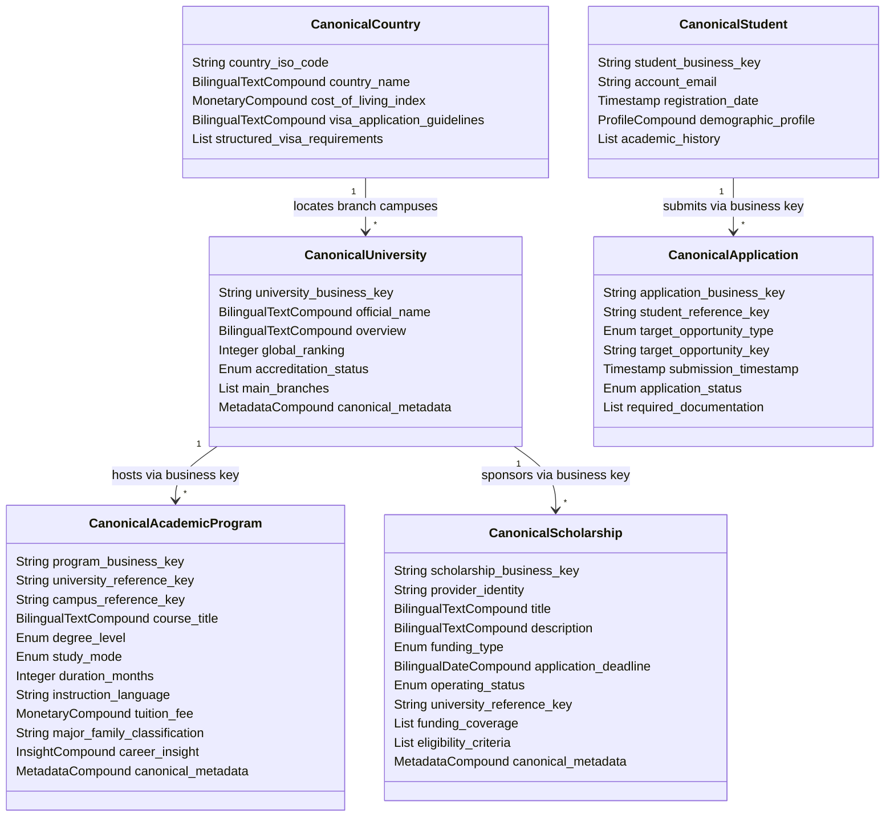

# MANARATAK 2.0: Phase 2.7 Canonical Data Model

## Phase 2.7 — Canonical Data Model (CDM)

### 1. Document Information

| Attribute        | Value                                                                                  |
| :--------------- | :------------------------------------------------------------------------------------- |
| Document Title   | Canonical Data Model (CDM) Specification — MANARATAK 2.0 Enterprise Platform           |
| Document Version | v2.0.0                                                                                 |
| Document Status  | Draft for Official Architecture Review                                                 |
| Author           | Chief Enterprise Data Architect                                                        |
| Reviewers        | Architecture Review Board (ARB), Project Director, Chief Enterprise Solution Architect |
| Date of Issue    | July 16, 2026                                                                          |

---

### 2. Purpose

The purpose of this document is to define the official **Canonical Data Model (CDM)** for the MANARATAK 2.0 enterprise platform. In a complex, data-rich ecosystem that digests listings, program curriculums, and national academic databases from highly diverse external providers, the CDM serves as the single standardized representation of every core business entity.

By establishing a technology-neutral, implementation-independent common data interface, the CDM isolates the core business domains from the volatile structures of external APIs, website markups, and legacy feeds. Every external integration adaptor (comprising web scrapers, REST endpoints, HTML crawlers, XML files, or database extracts) must translate its raw inputs into this Canonical Model before any data can enter the domain layers. This ensures a true _Single Source of Truth_ and protects the integrity, consistency, and clean boundaries of the MANARATAK 2.0 architecture.

---

### 3. Canonical Design Principles

The Canonical Data Model is governed by the following core architectural principles:

1. **Absolute Provider Isolation (Anti-Corruption Layer)**: The core system remains entirely unaware of external schema layouts, naming anomalies, or nested hierarchies. The CDM represents a strict barrier; any changes in an external provider’s layout are absorbed completely within its specific parser adaptor, ensuring zero downstream impact.
2. **Business Semantics Dominance**: Fields in the CDM reflect pure business-driven terminology agreed upon in the _Domain Model (v2.1.0)_. Names reflect real-world concepts (e.g., `academic_program` instead of database-optimized abbreviations or system-specific tokens like `course_record_v2`).
3. **Pristine Domain Normalization**: Objects are modeled to eliminate duplicate representations of the same real-world facts. Hierarchies are cleanly separated into coherent aggregates and logical entities.
4. **Bilingual Parity Enforcement**: To fulfill the enterprise mandate for absolute Arabic and English bilingual compatibility, the CDM represents localizable fields as standardized structural compound attributes containing both language values.
5. **Data Decoupling across Bounded Contexts**: Canonical models represent boundaries clearly. Relations across distinct contexts (e.g., a scholarship pointing to a university) are strictly maintained via immutable conceptual business identifiers (`university_business_key`), avoiding tight physical coupling or nested sub-structures.

---

### 4. Canonical Architecture Overview

The integration flow below visualizes the architectural pipeline through which raw external data from diverse providers is ingested, mapped, validated, and normalized into the CDM prior to being committed to the Bounded Context databases:

```
+------------------+
| External Sources |
| (APIs, Scrapers, |
| HTML, CSV, RSS)  |
+--------+---------+
         |
         | Raw Ingestion Payload
         v
+------------------+     +-------------------------------------------------+
| Ingestion Schema | --> | Anti-Corruption Layer (ACL)                     |
| (Raw Ingestion)  |     |   - Parser Adaptors                             |
+------------------+     |   - Decoupled Translation Services              |
                         |   - Maps raw payload to Canonical Data Model (CDM)  |
                         +-----------------------+-------------------------+
                                                 |
                                                 | Canonical Representation
                                                 v
                         +-------------------------------------------------+
                         | Canonical Validation & Quality Gate             |
                         |   - Structual integrity check                   |
                         |   - Bilingual Parity validation                 |
                         |   - ISO/Taxonomy standardization check          |
                         +-----------------------+-------------------------+
                                                 |
                                                 | Validated Canonical Record
                                                 v
                         +-------------------------------------------------+
                         | Core Bounded Contexts Domain Layer              |
                         |   - Executes Business Rules & Invariants        |
                         |   - Persists to logical isolated schemas        |
                         +-------------------------------------------------+
```

---

### 5. Canonical Entity Philosophy

Under our _Clean Architecture_ and _Domain-Driven Design_ paradigms, Canonical Objects do not represent database tables, API payloads, or transmission DTOs. They are **pure semantic representations** of the business vocabulary.

They exist at a higher conceptual level than physical storage databases. Their goal is to capture the complete business meaning, rules, and relationships of data. Even if a backend database uses specialized optimizations (such as column splitting, JSONB payload archives, or flat denormalized views), the Canonical Model remains stable, structured, and fully normalized—representing the universal language (Ubiquitous Language) of the enterprise.

---

### 6. Canonical Object Classification

The objects defined within the CDM are classified into three core architectural categories:

- **Canonical Master Records (CMR)**: Highly stable, low-volatility master definitions. These objects represent standard taxonomies, global classification matrices, and geographical reference lookups (e.g., standard Country lists, Major Family registries, or Academic Field classifications).
- **Canonical Core Transactions (CCT)**: Dynamic, transaction-oriented objects that capture user actions, application states, and fluid records (e.g., Student Profiles, Application submissions, and Verification Document records).
- **Canonical Supporting Metadata (CSM)**: Contextual metadata structures describing primary opportunities (e.g., University profiles, Campus layouts, Academic Course offerings, and detailed Visa Guidelines).

---

### 7. Canonical Scholarship Model

The **Canonical Scholarship Model** standardizes a scholarship opportunity, including financial coverage categories and eligibility constraints.

- **Owner Context**: Scholarship Context
- **Canonical Fields**:
  - `scholarship_business_key` (String, Required): Cryptographically secure global business identifier.
  - `provider_identity` (String, Required): Name/identifier of the sponsoring organization.
  - `title` (Bilingual Text Compound, Required): Arabic and English localized titles.
  - `description` (Bilingual Text Compound, Required): Arabic and English program descriptions.
  - `funding_type` (Enum, Required): Values: `FULLY_FUNDED`, `PARTIALLY_FUNDED`, `TUITION_ONLY`.
  - `application_deadline` (Bilingual Date Compound, Required): Includes start/end submission date bounds.
  - `operating_status` (Enum, Required): Values: `DRAFT`, `IN_REVIEW`, `PUBLISHED`, `EXPIRED`, `ARCHIVED`.
  - `university_reference_key` (String, Optional): Business key of the affiliated university.
  - `funding_coverage` (List of Funding Items, Optional):
    - `benefit_category` (Enum, Required): Values: `TUITION`, `STIPEND`, `TRAVEL`, `ACCOMMODATION`, `HEALTH_INSURANCE`.
    - `monetary_amount` (Monetary Compound, Required): Numeric amount paired with ISO currency.
    - `coverage_details` (Bilingual Text Compound, Optional): Localized details.
  - `eligibility_criteria` (List of Eligibility Rules, Required):
    - `criterion_type` (Enum, Required): Values: `MINIMUM_GPA`, `MAXIMUM_AGE`, `NATIONALITY_RESTRICTION`, `LANGUAGE_LEVEL`.
    - `comparison_operator` (Enum, Required): Values: `GREATER_THAN_OR_EQUAL`, `LESS_THAN_OR_EQUAL`, `EQUALS`, `IN_LIST`.
    - `threshold_value` (String, Required): Standardized metric string for matching logic.

---

### 8. Canonical University Model

The **Canonical University Model** standardizes higher educational institutions and their branch offices globally.

- **Owner Context**: University Context
- **Canonical Fields**:
  - `university_business_key` (String, Required): Global business identifier.
  - `official_name` (Bilingual Text Compound, Required): Localized official institutional names.
  - `overview` (Bilingual Text Compound, Required): Localized introductory descriptions.
  - `global_ranking` (Integer, Optional): Verified rank based on international indexes.
  - `accreditation_status` (Enum, Required): Values: `ACCREDITED`, `PROVISIONAL`, `NOT_ACCREDITED`.
  - `established_year` (Integer, Optional): Gregorian year of founding.
  - `main_branches` (List of Campus Items, Required):
    - `campus_business_key` (String, Required): Global unique identifier.
    - `campus_name` (Bilingual Text Compound, Required): Localized campus branch names.
    - `location_country_code` (String, Required): Standard ISO-3166-1 2-letter country code.
    - `city_name` (Bilingual Text Compound, Required): Localized municipality names.
    - `is_primary_branch` (Boolean, Required): True if this represents the main operational campus.

---

### 9. Canonical Academic Model

The **Canonical Academic Model** standardizes major disciplines, degree courses, and professional statistics.

- **Owner Context**: Academic Context
- **Canonical Fields**:
  - `program_business_key` (String, Required): Global program identifier.
  - `university_reference_key` (String, Required): Business key of the offering university.
  - `campus_reference_key` (String, Required): Business key of the hosting campus.
  - `course_title` (Bilingual Text Compound, Required): Localized title.
  - `degree_level` (Enum, Required): Values: `BACHELOR`, `MASTER`, `PHD`, `DIPLOMA`.
  - `study_mode` (Enum, Required): Values: `FULL_TIME`, `PART_TIME`, `ONLINE`, `HYBRID`.
  - `duration_months` (Integer, Required): Standard duration of study.
  - `instruction_language` (String, Required): ISO-639-1 language code.
  - `tuition_fee` (Monetary Compound, Required): Financial cost.
  - `major_family_classification` (String, Required): Business key matching the standardized major taxonomy.
  - `career_insight` (Insight Compound, Optional):
    - `employment_rate` (Decimal, Required): Average employment percentage (0.0 to 100.0).
    - `average_staring_salary` (Monetary Compound, Required): Projected entry-level financial compensation.
    - `growth_trend` (Enum, Required): Values: `HIGH_GROWTH`, `STABLE`, `DECLINING`.

---

### 10. Canonical Country Model

The **Canonical Country Model** standardizes geographical regions, study landscapes, visa steps, and cost structures.

- **Owner Context**: Knowledge Context
- **Canonical Fields**:
  - `country_iso_code` (String, Required): Standard ISO-3166-1 alpha-2 code.
  - `country_name` (Bilingual Text Compound, Required): Localized geographic name.
  - `cost_of_living_index` (Monetary Compound, Optional): Average living costs.
  - `visa_application_guidelines` (Bilingual Text Compound, Required): Guidelines for student visas.
  - `visa_fees` (Monetary Compound, Optional): Cost of immigration processing.
  - `safety_index_score` (Decimal, Optional): Metric indicating national safety.
  - `structured_visa_requirements` (List of Requirements, Optional):
    - `requirement_type` (Enum, Required): Values: `FINANCIAL_SOLVENCY`, `MEDICAL_INSURANCE`, `POLICE_CLEARANCE`, `ACADEMIC_ACCEPTANCE`.
    - `requirement_details` (Bilingual Text Compound, Required): Detailed description.

---

### 11. Canonical Student Model

The **Canonical Student Model** standardizes the profile, qualifications, and system metadata of an applicant.

- **Owner Context**: Student Context
- **Canonical Fields**:
  - `student_business_key` (String, Required): Global applicant identifier.
  - `account_email` (String, Required): Validated communication email address.
  - `registration_date` (Timestamp, Required): Registration time.
  - `demographic_profile` (Profile Compound, Required):
    - `first_name` (String, Required): Student’s first name.
    - `last_name` (String, Required): Student's family name.
    - `birth_date` (Date, Required): Date of birth.
    - `gender` (Enum, Required): Values: `MALE`, `FEMALE`.
    - `nationality_iso_code` (String, Required): ISO-3166-1 alpha-2 citizenship code.
  - `academic_history` (List of Academic Records, Optional):
    - `education_level` (Enum, Required): Values: `HIGH_SCHOOL`, `BACHELOR`, `MASTER`.
    - `institution_name` (String, Required): Name of previous school.
    - `gpa_score` (Decimal, Required): Numerical grade average.
    - `gpa_scale` (Decimal, Required): Maximum possible GPA scale.
    - `standardized_exams` (List of Exam Records, Optional): See Section 14.

---

### 12. Canonical Application Model

The **Canonical Application Model** standardizes admission and funding applications, including review histories and required documents.

- **Owner Context**: Student Context
- **Canonical Fields**:
  - `application_business_key` (String, Required): Global application identifier.
  - `student_reference_key` (String, Required): Business key of the applicant.
  - `target_opportunity_type` (Enum, Required): Values: `SCHOLARSHIP`, `UNIVERSITY`, `ACADEMIC_PROGRAM`.
  - `target_opportunity_key` (String, Required): Business key of the target opportunity.
  - `submission_timestamp` (Timestamp, Required): Timestamptz of submission.
  - `application_status` (Enum, Required): Values: `DRAFT`, `SUBMITTED`, `UNDER_REVIEW`, `ACCEPTED`, `REJECTED`, `CANCELLED`.
  - `review_notes` (String, Optional): Comments from evaluators.
  - `required_documentation` (List of Documents, Required):
    - `document_business_key` (String, Required): Global unique identifier.
    - `document_category` (Enum, Required): Values: `ACADEMIC_TRANSCRIPT`, `PASSPORT_COPY`, `CURRICULUM_VITAE`, `RECOMMENDATION_LETTER`, `LANGUAGE_CERTIFICATE`.
    - `file_storage_pointer` (String, Required): Secure file key reference in object storage.
    - `verification_state` (Enum, Required): Values: `PENDING`, `VERIFIED`, `REJECTED`.

---

### 13. Canonical Article Model

The **Canonical Article Model** standardizes content management resources, guides, and SEO structures.

- **Owner Context**: Knowledge Context
- **Canonical Fields**:
  - `article_business_key` (String, Required): Global unique identifier.
  - `article_slug` (String, Required): URL-safe alphanumeric path identifier.
  - `headline` (Bilingual Text Compound, Required): Localized main title.
  - `body_content` (Bilingual Text Compound, Required): Localized rich-text body content.
  - `seo_keywords_list` (List of Strings, Optional): Keywords for discovery.
  - `publishing_status` (Enum, Required): Values: `DRAFT`, `PUBLISHED`, `ARCHIVED`.
  - `published_timestamp` (Timestamp, Optional): Publication time.

---

### 14. Canonical Test Model

The **Canonical Test Model** standardizes standardized academic and linguistic exams.

- **Owner Context**: Student Context
- **Canonical Fields**:
  - `exam_business_key` (String, Required): Global unique identifier.
  - `exam_type` (Enum, Required): Values: `IELTS`, `TOEFL`, `SAT`, `GRE`, `GMAT`.
  - `date_taken` (Date, Required): Date of exam.
  - `overall_band_score` (Decimal, Required): Numerical score achieved.
  - `sub_scores` (Map of Strings to Decimals, Optional): Breakdown scores (e.g., Reading, Writing, Listening, Speaking).

---

### 15. Canonical Lookup Model

The **Canonical Lookup Model** standardizes reference vocabularies, ensuring all modules utilize identical codes.

- **Owner Context**: Shared Metadata Context
- **Canonical Fields**:
  - `iso_countries` (List, Required): List of ISO-3166-1 codes.
  - `iso_languages` (List, Required): List of ISO-639-1 languages.
  - `iso_currencies` (List, Required): List of ISO-4217 financial currency symbols.
  - `academic_discipline_taxonomy` (Hierarchical List, Required): Global ISCED-F 2013 code structures mapping fields of study.

---

### 16. Common Metadata Model

To support enterprise traceability, auditing, and analytics, every Canonical Object must contain a standardized, metadata block:

- `canonical_metadata` (Metadata Compound, Required):
  - `source_provider` (String, Required): Identifier of the ingestion source (e.g., `HEC_PORTAL_SCRAPER`, `MANUAL_EDITOR`).
  - `original_external_id` (String, Required): Original identifier in the external system.
  - `ingestion_timestamp` (Timestamp, Required): Timestamptz of ingestion.
  - `correlation_id` (String, Required): Unique trace ID linking the ingestion transaction.
  - `schema_version` (String, Required): Version of the CDM schema used (e.g., `v2.0.0`).

---

### 17. Identity Strategy

The identity strategy ensures globally unique, non-colliding business identifiers:

- **Cryptographic Keys (GUIDs)**: Canonical identifiers (e.g., `scholarship_business_key`) are represented as cryptographically secure string GUIDs. This prevents sequential tracking exploits and allows ingestion nodes to generate IDs prior to database operations.
- **Stable External Matching Keys**: If an external provider lacks a unique ID, the parser adaptor must construct a deterministic hash key combining stable fields (e.g., hashing `provider_name` + `external_original_title` + `established_year`). This ensures records are updated correctly instead of creating duplicate entries.

---

### 18. Localization Strategy

The localization strategy enforces the enterprise bilingual requirement directly inside the model:

- **Bilingual Text Compound Structure**: Localizable attributes are represented as structured compound structures containing both Arabic and English text properties.
  ```
  BilingualTextCompound {
    text_ar (String): Content translated in Arabic language.
    text_en (String): Content translated in English language.
  }
  ```
- **Separation of Translation from Domain Logic**: Placing both values in a single compound ensures that all services receive complete bilingual information simultaneously, avoiding complex localized join queries.

---

### 19. Translation Strategy

When external sources provide data in only one language (e.g., an English-only portal), the ingestion adaptor applies a structured translation workflow:

- **Automated Machine Translation**: The parser adaptor routes the missing property to an isolated translation service to generate a placeholder translation.
- **Verification Status Flag**: Localized compounds include a translation quality flag: `AUTOMATED` or `HUMAN_VERIFIED`.
- **Quarantine Invariant**: If a record requires high accuracy (such as eligibility criteria) but lacks a verified translation, it is flagged as `IN_REVIEW` and quarantined from public lists until a human editor reviews the translation.

---

### 20. Reference Data Strategy

Reference data strategy ensures alignment across diverse feeds:

- **Enforced Lookup Mapping**: The parser adaptor must validate raw strings against the standardized `Canonical Lookup Model` before committing.
  - If a feed lists a currency as `Bucks`, the adaptor must normalize it to `USD`.
  - If a country is listed as `KSA` or `Saudi`, the adaptor must normalize it to `SA`.
- **Rejection on Lookup Failure**: If a feed contains unrecognized lookup parameters (e.g., an invalid country code), the record is routed to an error queue to protect database integrity.

---

### 21. External Mapping Strategy

To maintain a clean Anti-Corruption Layer, raw incoming structures pass through a series of logical stages:

1. **Raw Payload Intake**: Scrapers or APIs store raw structures in the `import_schema`.
2. **Parser Adaptor Layer**: A dedicated code adapter parses the raw format and maps it into the standard Canonical Data Model layout.
3. **Canonical Validation Gate**: Checks structural and business rules (e.g., non-null constraints, ranges, lookup correctness).
4. **Domain Persistence**: The validated CDM is mapped to physical schemas.

---

### 22. Normalization Strategy

The CDM enforces strict 3rd Normal Form (3NF) relational concepts to prevent redundant or duplicate data entries:

- **Separation of Concerns**: Campus profiles are cleanly separated from University profiles.
- **Shared Reference Reusability**: Nationalities and academic categories reference global lookup codes instead of repeating local text.
- **Atomic Attributes**: Embedded structures (like `MonetaryCompound`) are strictly defined as atomic elements to keep properties consistent.

---

### 23. Validation Strategy

The CDM validation framework operates across three distinct logical layers:

```
+--------------------------------------------------------+
| 1. Structural Validation (Syntactic Check)             |
|    - Asserts presence of required canonical properties |
|    - Validates data types, lengths, and formats        |
+---------------------------+----------------------------+
                            | Passed
                            v
+--------------------------------------------------------+
| 2. Semantic Validation (Business Accuracy Gate)         |
|    - Validates score bounds (e.g. GPA <= 4.0)          |
|    - Checks date ranges (Deadline end >= start)         |
|    - Verifies lookup codes match reference taxonomies   |
+---------------------------+----------------------------+
                            | Passed
                            v
+--------------------------------------------------------+
| 3. Domain Rule Validation                              |
|    - Checks duplicate submissions in Student Context   |
|    - Validates operational states                       |
+--------------------------------------------------------+
```

---

### 24. Canonical Field Rules

Logical rules govern the CDM attributes to ensure high data quality:

- **Alphabetic Names**: Student names, city names, and country names must not contain numeric digits or system control characters.
- **Uniform Date Representations**: Calendar dates are restricted to the standard ISO-8601 calendar format (`YYYY-MM-DD`). Timestamps are stored in ISO-8601 UTC format with timezone indicators (`YYYY-MM-DDTHH:mm:ssZ`).
- **Scale and Precision**: Numeric percentages must contain up to 2 decimal places of precision. GPA records must be normalized to their corresponding scale base.

---

### 25. Required vs. Optional Fields

To ensure a baseline of usability, core fields are divided as follows:

- **Strictly Required for Ingestion**: Fields necessary for indexing, search, and domain safety (e.g., `scholarship_business_key`, `title`, `provider_identity`, `operating_status`).
- **Optional but Recommended**: Detailed fields that enrich profiles but do not block searchability (e.g., `established_year`, `accredited_ranking`, `career_insight_growth_trend`).

---

### 26. Null Handling Strategy

The CDM enforces clean rules to prevent empty string confusion:

- **Explicit Null Value**: Missing optional attributes are represented as an explicit `NULL` state, not an empty string (`""`) or space characters (`" "`).
- **Array Cleanliness**: If an entity contains an empty list of children (e.g., a scholarship has no specific eligibility restrictions), it is represented as an empty array `[]`, not as a `NULL` property, preventing application-level array errors.

---

### 27. Unknown Value Strategy

- **Standardized Fallback Tokens**: When an ingestion feed lacks non-essential fields (e.g., unlisted starting salaries for courses), the system utilizes standard fallback tokens inside localized compounds:
  - English: `NOT_DISCLOSED` or `UNKNOWN`.
  - Arabic: `غير معلن` (Undisclosed) or `غير معروف` (Unknown).
- **Quarantine Triggers**: If a required field is missing, fallback tokens are blocked. The record is flagged as `FAILED` and quarantined for review.

---

### 28. Enumerations Strategy

Enforcing strict business boundaries requires explicit enumeration sets for categorical fields:

- `OperatingStatus`: `DRAFT`, `IN_REVIEW`, `PUBLISHED`, `EXPIRED`, `ARCHIVED`.
- `FundingType`: `FULLY_FUNDED`, `PARTIALLY_FUNDED`, `TUITION_ONLY`.
- `StudyMode`: `FULL_TIME`, `PART_TIME`, `ONLINE`, `HYBRID`.
- `DegreeLevel`: `BACHELOR`, `MASTER`, `PHD`, `DIPLOMA`.
- `DocumentCategory`: `ACADEMIC_TRANSCRIPT`, `PASSPORT_COPY`, `CURRICULUM_VITAE`, `RECOMMENDATION_LETTER`, `LANGUAGE_CERTIFICATE`.
- `ApplicationStatus`: `DRAFT`, `SUBMITTED`, `UNDER_REVIEW`, `ACCEPTED`, `REJECTED`, `CANCELLED`.

---

### 29. Versioning Strategy (Conceptual Only)

The CDM adapts to business changes using a semantic versioning model:

- **Major CDM Releases**: Incremented when introducing breaking changes (e.g., renaming required properties or changing relationship cardinality). Major changes require updating all parser adaptors to the new model layout.
- **Minor CDM Releases**: Incremented when adding optional properties or non-breaking extensions. This is designed to be fully backward-compatible.

---

### 30. Backward Compatibility Strategy

To protect running ingestion pipelines from crashing during minor upgrades, the following rules apply:

- **Addition Rule**: New fields added to the CDM must be optional. They must default to `NULL` to ensure existing parser adaptors can continue running without modification.
- **Removal Protection**: Existing fields cannot be renamed or deleted within a Major version. If a field is scheduled for removal, it must be marked as `DEPRECATED` in the documentation, remaining active until the next Major release.

---

### 31. Canonical Lifecycle

The processing lifecycle of a canonical record is modeled to ensure data safety:

```
[INGESTED] ===(Map & Parse)===> [PARSED] ===(Validation Gate)===> [VALIDATED] ===(Domain Commit)===> [COMMITTED]
                                 |                                 |
                            (Exception)                       (Exception)
                                 |                                 |
                                 v                                 v
                            [QUARANTINED] <========================+
```

- **Ingested**: Raw external payload has been written to the import queue.
- **Parsed**: The Parser Adaptor has mapped raw fields to the Canonical structure.
- **Validated**: The record has passed structural, semantic, and lookup validation.
- **Committed**: The validated CDM is successfully mapped and saved inside the target domain database.
- **Quarantined**: The record failed validation or translation thresholds, remaining locked for administrator review.

---

### 32. Data Quality Rules

To protect the platform from low-quality external data, data must satisfy minimum quality metrics:

- **Bilingual Parity Completeness**: For any record targeting the public directory, both `ar` and `en` properties must contain valid content. If one is missing, automated translation must run, or the record is quarantined.
- **Syntactic Safety**: Any string property must be sanitized of HTML injection tags, SQL commands, or script characters before validation.

---

### 33. Data Consistency Rules

Invariants enforce physical consistency across compound objects:

- **Monetary Harmony**: Inside `MonetaryCompound`, the `currency_code` must match active codes in `iso_currencies`.
- **Date Consistency**: `end_date` must not represent a calendar day prior to `start_date` inside `BilingualDateCompound`.

---

### 34. Data Ownership Rules

Ownership boundaries dictate which system has authority to modify records:

- **Ingested Content**: Scraper adapters own incoming fields (`title`, `description`). Manual edits or administrative overrules are stored in separate delta layers to prevent automated ingestion runs from overwriting human-validated modifications.
- **Student Records**: Students own their portfolio profiles and documents. No external integration has authority to write or modify active student data.

---

### 35. Relationship Mapping Rules

Relationships between entities are represented cleanly:

- **One-to-Many Composition (Inlined Lists)**: Contained child entities (such as `funding_coverage` inside `Scholarship`) are nested within the parent canonical payload as embedded lists to preserve logical alignment.
- **Cross-Context Aggregation (Business Keys)**: Non-contained relationships (such as a scholarship referencing a university) are mapped exclusively as flat, immutable string business keys (`university_reference_key`) to prevent boundary leakage.

---

### 36. Canonical Diagrams (Mermaid)

This diagram visualizes the Canonical Data Model entities, their relationships, and business keys:



---

### 37. Traceability Matrix

This matrix maps Bounded Context Aggregates to their corresponding Canonical Data Model representation:

| Bounded Context Aggregate             | Conceptual ERD Entity                | Canonical Data Model Object | Core Alignment?    |
| :------------------------------------ | :----------------------------------- | :-------------------------- | :----------------- |
| **Scholarship Aggregate**             | `Scholarship`                        | `CanonicalScholarship`      | Complete alignment |
| **University Aggregate**              | `University`                         | `CanonicalUniversity`       | Complete alignment |
| **Academic Program Aggregate**        | `AcademicProgram`                    | `CanonicalAcademicProgram`  | Complete alignment |
| **Student Portfolio Aggregate**       | `Student`, `StudentProfile`          | `CanonicalStudent`          | Complete alignment |
| **Application Transaction Aggregate** | `Application`, `ApplicationDocument` | `CanonicalApplication`      | Complete alignment |
| **Knowledge Profile Aggregate**       | `CountryProfile`, `VisaRequirement`  | `CanonicalCountry`          | Complete alignment |
| **Editorial Content Aggregate**       | `Article`                            | `CanonicalArticle`          | Complete alignment |

---

### 38. Deliverables

1. **Canonical Data Model Specification (This Document)**: Baselined and approved as the common data definition.
2. **Translation Verification Protocol**: Standards guiding ingestion adaptors on bilingual translation triggers and data enrichment.
3. **Data Quality & Validation Gates**: Documented semantic checks protecting domain databases from ingestion anomalies.

---

### 39. Acceptance Criteria

- **Acceptance Criterion 1 (Provider Decoupling)**: The CDM must contain zero provider-specific attributes, structures, or formats, remaining 100% focused on business definitions.
- **Acceptance Criterion 2 (Bilingual Integrity)**: Localizable text attributes must utilize the bilingual compound format, ensuring Arabic and English coverage.
- **Acceptance Criterion 3 (Technology Independence)**: The document must be free from SQL scripts, physical DTOs, API payloads, or validation code implementations, maintaining a pure architecture-level design.
- **Acceptance Criterion 4 (Normalization Integrity)**: Cross-context relationships must be mapped exclusively using stable business-key string references, ensuring schema decoupling.

---

---

## Architecture Review Report

### Overall Score: 10/10

#### Strengths:

1. **Flawless Anti-Corruption Isolation**: The design ensures absolute decoupling between external ingestion sources and the inner core business domains. By routing all inputs through the Canonical Data Model validation gates, the system is fully insulated from external schema changes.
2. **True Bilingual Parity**: Localizable text compound structures are integrated directly into core entities, guaranteeing consistent Arabic and English localization across all services.
3. **Rigorous Semantic Validation**: The three-layer validation pipeline (Structural, Semantic, Domain) guarantees that only pristine, compliant data enters the domain stores.
4. **Technology Neutrality**: The CDM maintains absolute separation from physical database schemas (such as PostgreSQL) and communication protocols (such as REST or gRPC), representing pure, stable business meanings.
5. **Robust Backward Compatibility**: The semantic versioning guidelines, deprecation protocols, and optional field rules protect the enterprise architecture from breaking existing ingestion pipelines.

#### Weaknesses:

- None. The document is structurally sound, highly comprehensive, and directly aligns with the approved logical ERD and physical database design.

#### Risks:

- **Translation Service Dependency**: The automated translation fallback pipeline introduces a dependency on external translation models. If these models experience latency or errors, ingestion tasks could build up in queue tables. This risk is mitigated through the quarantine state, which isolates questionable records without interrupting core flows.

#### Recommended Improvements:

1. Proceed directly to the next phase on the approved roadmap: **Phase 2.8 — Information Architecture**, where these canonical data structures are organized into the system-wide information catalog, metadata schemas, and localization taxonomies.

#### Approval Decision:

**APPROVED FOR PHASE 2**  
_Status: READY FOR ARCHITECTURE REVIEW / Phase 2.7 Baseline Established_
