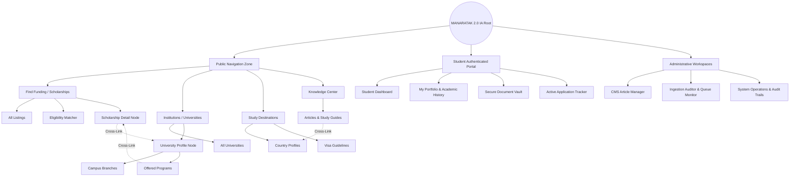

# MANARATAK 2.0: Phase 2.8 Information Architecture

## Phase 2.8 — Information Architecture (IA)

### 1. Document Information

| Attribute        | Value                                                                                  |
| :--------------- | :------------------------------------------------------------------------------------- |
| Document Title   | Information Architecture (IA) Specification — MANARATAK 2.0 Enterprise Platform        |
| Document Version | v2.0.0                                                                                 |
| Document Status  | Draft for Official Architecture Review                                                 |
| Author           | Senior Enterprise Information Architect                                                |
| Reviewers        | Architecture Review Board (ARB), Project Director, Chief Enterprise Solution Architect |
| Date of Issue    | July 16, 2026                                                                          |

---

### 2. Purpose

The purpose of this document is to establish the definitive, implementation-independent, and conceptual **Information Architecture (IA)** for the MANARATAK 2.0 enterprise platform. This specification governs how all public-facing directories, user portfolios, and back-office administrative spaces organize, classify, and present information.

By defining structural hierarchies, taxonomic frameworks, cross-linking maps, metadata matrices, and navigation patterns, this document ensures the platform is highly intuitive, accessible, and aligned with user mental models. In strict compliance with the project’s boundaries, this IA is mapped directly to the baselined _Business Capability Map (v2.2)_ and _Bounded Context Design (v2.4)_, maintaining domain-driven integrity while completely avoiding specific UI layouts, visual designs, CSS styles, or frontend code implementation.

---

### 3. Information Architecture Principles

The MANARATAK 2.0 Information Architecture is designed according to the following foundational principles:

1. **Cognitive Load Minimization (Simple & Direct)**: Information is structured to reduce user cognitive overhead. We apply progressive disclosure patterns—presenting essential high-level details first and allowing deep domain exploration as needed.
2. **Taxonomic Integrity**: Content and classifications are standardized across the platform. The terminology used in public paths aligns exactly with the definitions in our _Canonical Data Model (v2.7)_ (e.g., matching the global ISCED-F 2013 academic fields).
3. **Multi-Tenant Profile Isolation**: Information spaces are split based on the authenticated user's role (Public Visitor, Registered Student, Institution Administrator, Editorial Manager, Ingestion Auditor). Information assets belonging to one context are isolated from unprivileged interfaces.
4. **Bilingual Parity Architecture**: The navigational hierarchy and categorization maps must scale symmetrically in both Arabic and English. No structural branch can exist as "English-only" or "Arabic-only."
5. **Agnostic Separation of IA from Presentation**: The IA defines structural pathways, semantic groupings, and URL hierarchies conceptually. It dictates _how_ things are organized logically, not _where_ they appear on a screen or _how_ they are styled visually.

---

### 4. Platform Information Hierarchy

The platform is organized into five major, non-overlapping information zones, representing the primary system boundaries:

```
                          [MANARATAK 2.0 IA Root]
                                     |
    +-------------------+------------+-----------+---------------------+
    |                   |                        |                     |
[Public Directory]  [Student Portal]         [CMS Portal]      [Admin Console]
    |                   |                        |                     |
    |- Scholarships     |- Profile Portfolio     |- Article Repository |- Global Lookups
    |- Universities     |- Saved Opportunities   |- Author Workspaces  |- Integration Logs
    |- Academic Majors  |- Live Applications     |- Translation Engine |- System Security
    |- Visa & Country   |- Document Vault        |- SEO Management     |- Queue Status
```

---

### 5. Primary Navigation Architecture

The primary navigation structure provides immediate, high-level pathways to the platform’s core functional components. This is universal across all entry points, directing users to distinct information domains:

- **Find Funding**: Direct pathway to the _Scholarship Discovery Directory_.
- **Institutions**: Direct pathway to the _University & Campus Directory_.
- **Programs of Study**: Direct pathway to the _Academic Majors & Course Directory_.
- **Study Destinations**: Direct pathway to the _Geographical Country Profiles & Visa Guidelines_.
- **Knowledge Center**: Direct pathway to the _Editorial Articles, Guides, and SEO Content Resources_.

---

### 6. Secondary Navigation

Secondary navigation operates within specific primary domains, organizing information contextually:

- **Within "Find Funding"**:
  - _All Scholarships_: Unfiltered list of active funding opportunities.
  - _Eligibility Matcher_: Structured parameter input space to filter scholarships against candidate scores.
  - _Deadline Tracker_: Visual calendar timeline mapping upcoming application closing dates.
- **Within "Study Destinations"**:
  - _Country Profiles_: List of national educational landscapes.
  - _Visa Requirements Catalog_: Detailed procedural guides sorted by target country.
  - _Cost of Living Estimator_: Financial comparison space contrasting regional costs.

---

### 7. Global Navigation

Global navigation elements persist across the platform’s header and footer concepts to provide baseline utility and compliance:

- **Platform Utilities (Header Space)**:
  - _Language Switcher_: Immediate toggling between Arabic (`ar`) and English (`en`) without losing current path context.
  - _Global Search Bar_: Direct keyword entry point querying across Scholarships, Universities, and Articles.
  - _User Authentication Entry_: Quick-link to log in or register.
- **System Disclaimers & Policies (Footer Space)**:
  - _About the Platform_: Background, partners, and contact info.
  - _Terms of Service & Privacy Policy_: Compliance and data protection details.
  - _Accessibility Statement_: Compliance mapping to WCAG 2.1 AA standards.

---

### 8. User Navigation

When a student authenticates, they are provided with a dedicated, personalized navigation space to manage their academic journey:

- **Dashboard**: Overview of application statuses, active alerts, and recommended opportunities.
- **My Portfolio**: Management of personal profile info, academic histories, and standardized test scores.
- **Document Vault**: Central, secure storage of verified uploads (Passports, transcripts, recommendation letters).
- **My Applications**: Active tracker showing submitted forms, review stages, and decision logs.
- **Saved Items**: Personalized list of flagged scholarships, universities, and articles.

---

### 9. Admin Navigation

Administrative workspaces are strictly isolated from public and student spaces, partitioned by privilege roles:

- **Editorial Workspaces (CMS)**:
  - _Article Manager_: Creation, editing, and publishing controls for guides.
  - _Taxonomy Planner_: Management of academic fields and major classifications.
  - _Bilingual Translation Queue_: Verification of machine-generated text blocks.
- **Integration Audits (Import)**:
  - _Scraper Monitor_: Status logs, execution metrics, and error traces of ingestion tasks.
  - _Quarantine Queue_: Review of payloads that failed semantic validations.
- **System Operations**:
  - _Global Settings_: Lookups, country registries, currency exchange rules.
  - _Security & Access_: Audit trails, RLS logs, role permissions management.

---

### 10. Public Information Structure

The public directory represents the primary organic entry point, optimized for search engines and high discoverability.

- **Scholarship Detail Node**:
  - _Overview Summary_: Title, provider, funding coverage type (Full/Partial), and current application deadline.
  - _Eligibility Rules_: Standard prerequisites (GPA, test scores, nationalities).
  - _Financial Matrix_: Itemized benefits (stipends, tuition, housing limits).
  - _Affiliated University_: Link to the offering institution.
- **University Detail Node**:
  - _Institutional Profile_: Logo, ranking, accreditation status, established year.
  - _Campus Branches_: List of physical campus locations and main branch tags.
  - _Offered Programs_: Grouped by academic major classifications.

---

### 11. Student Portal Structure

The student portal is structured to simplify multi-step processes and protect transactional records:

- **Portfolio Structure**:
  - _Demographic Record_: Verified name, date of birth, gender, and citizenship.
  - _Academic History_: Education level, GPAs, graduation years, and transcripts.
  - _Standardized Testing_: Linguistic (IELTS/TOEFL) and academic (SAT/GRE) scores.
- **Application Lifecycle State Tree**:
  - _Draft State_: Full editing permitted; missing files are flagged.
  - _Submitted State_: Record locked; files are sent for verification.
  - _Under Review State_: Administrative feedback is logged; student can view status.
  - _Decision State_: Final accept/reject outcome is displayed.

---

### 12. CMS Information Structure

The Content Management System (CMS) structures editorial information to maximize search engine indexing and readability:

- **Article Node**:
  - _Metadata_: Title, slug, author, publishing date, status.
  - _SEO Metadata_: Meta title, target keywords, description.
  - _Bilingual Content Block_: Localized HTML-free body text.
  - _Tags_: Categorized taxonomy links (e.g., "Visa Guide", "Scholarship Tips").

---

### 13. Content Organization Strategy

Content is organized using a hybrid model designed to match user expectations:

- **Facet-Based Filtering (Scholarships & Programs)**: Users do not navigate rigid trees. Instead, they dynamically narrow listings based on criteria (e.g., Country, Degree Level, Funding Type).
- **Hierarchical Taxonomy (Academic Disciplines)**: Standardized fields of study branch logically (e.g., `Science` -> `Computing` -> `Software Engineering`), ensuring predictable navigation pathways.
- **Chronological Indexing (Articles & Guides)**: Content in the Knowledge Center is indexed by publishing date, ensuring users access the most relevant, up-to-date information.

---

### 14. Content Classification

Content assets are assigned a strict, clear classification mapping to their underlying lifecycle and volatility:

- **Core Transactions (Highly Dynamic)**: Student profiles, application packages, and document verifications.
- **Sustained Metadata (Medium Volatility)**: Scholarship entries, university rankings, course durations.
- **Reference Baselines (Extremely Stable)**: ISO tables, academic taxonomies.

---

### 15. Taxonomy Strategy

The platform’s taxonomies prevent unstructured naming variations across the ecosystem:

- **Academic Taxonomy (ISCED-F 2013)**: The classification of academic programs must map directly to the International Standard Classification of Education. Every course is assigned a parent `MajorFamilyId` which rolls up to an `AcademicFieldId`.
- **Geographical Taxonomy (ISO-3166)**: All country and regional identifiers are bound to ISO-3166 codes, ensuring standardized filtering.

---

### 16. Metadata Strategy

Metadata is systematically attached to every primary content asset to enable automated indexing, precise filtering, and programmatic search engine discovery:

- **System Metadata**: Unique identifiers, schema versions, correlation IDs, and source provenance attributes.
- **Administrative Metadata**: Access control lists (ACLs), publishing states, creator IDs, and audit timestamps.
- **Discovery Metadata**: SEO slugs, localized meta-descriptions, semantic tags, and search index weights.

---

### 17. Cross-Linking Strategy

The cross-linking strategy ensures high discoverability by creating semantic bridges between separate information domains:

- **Scholarship to University**: A scholarship detail page links directly to the detailed profile of the hosting University.
- **Academic Program to Scholarship**: An academic course page displays a dynamic list of scholarships that can fund that specific program.
- **Article to Country Profile**: A guide discussing "How to Study in Germany" is structurally linked to Germany’s Country Profile page and visa requirement guidelines.

---

### 18. Internal Linking Strategy

Internal links are structured logically to avoid dead ends:

- **Breadcrumbs Pathway**: Every detail page (e.g., a specific major inside a university) provides clear breadcrumbs mapping back to the root directory (e.g., `Home` -> `Universities` -> `University Profile` -> `Majors`).
- **Relational Pagination**: Lists use standard cursor-based paging paths to ensure clean crawling by search engines.

---

### 19. URL Structure Strategy (Conceptual)

URL paths are designed to be clean, readable, descriptive, and optimized for search engine optimization (SEO):

- **Scholarships Directory**: `/scholarships`
- **Scholarship Detail**: `/scholarships/{scholarship-slug}`
- **Universities Directory**: `/universities`
- **University Profile**: `/universities/{university-slug}`
- **Academic Majors Directory**: `/majors`
- **Knowledge Center Article**: `/knowledge/{article-slug}`
- **Student Dashboard**: `/portal/dashboard`

---

### 20. Navigation Consistency Rules

To maintain navigation consistency across the platform, the following rules apply:

- **Persistent Primary Navigation**: The five primary pathways (Find Funding, Institutions, Programs, Study Destinations, Knowledge Center) must remain in the same order across all public-facing screens.
- **Universal Footer**: The universal footer containing disclaimers, contact details, and policies must persist on all public and authenticated portal screens.
- **Role-Based Context Segregation**: When a student enters `/portal`, the public navigation layout is replaced by the sidebar layout of the student workspace, ensuring a focused portal experience.

---

### 21. Information Discoverability

High discoverability is achieved through three layered strategies:

- **Predictive Query Resolution**: The global search bar leverages real-time indexing of slugs and titles to resolve user queries with zero latency.
- **Semantic Tag Clouds**: Article pages use standardized taxonomy tags to recommend related guides and scholarships.
- **Dead-End Mitigation**: If a search query or category list yields zero results, the system must provide intelligent fallbacks (e.g., suggesting popular scholarships or resetting active filters).

---

### 22. Search Entry Points

The platform provides explicit entry points for diverse user search behaviors:

- **Universal Header Search**: Text input on every screen for quick, cross-domain searching.
- **Advanced Facet Matcher**: A dedicated workspace within the Scholarship and Program directories for deep, parameter-based filtering.
- **Sitemap XML**: Automatically generated index maps outlining every public slug, ensuring fast search engine indexing.

---

### 23. User Mental Model

The IA is designed around two distinct user mental models:

- **The Explorer (Discovery Phase)**: A user searching for possibilities. They require broad categories, high-level summaries, breadcrumb paths, and cross-linked related options.
- **The Transactor (Submission Phase)**: An authenticated student submitting an application. They require a rigid, sequential, multi-step process with clear checklists, progress bars, and locked draft states.

---

### 24. Information Ownership

Every logical component in the Information Architecture maps to a specific Bounded Context that owns its creation, modification, and data governance rules:

- **Scholarship Information**: Owned by the Scholarship Context.
- **Institutional Profiles**: Owned by the University Context.
- **Educational Curriculums**: Owned by the Academic Context.
- **Visa Guidelines & Country Profiles**: Owned by the Knowledge Context.
- **Personal & Application Records**: Owned by the Student Context.

---

### 25. Information Flow

The diagram below details the sequence of information validation and translation when external data is parsed:

```
[External Ingestion Feed]
       |
       v
[Anti-Corruption Layer] ===(Standardize Taxonomy)===> [Canonical Data Model]
                                                            |
                                                   Validate Bilingual Parity
                                                            |
                                                            v
[Public Directories] <=====(Approve & Publish)==== [Review State]
```

---

### 26. Information Lifecycle

The states of information within the directories are controlled to prevent outdated listings:

- **Active (Published)**: Visible to all public searches and indexable by search engines.
- **Expired**: Visible for historical reference (applications tied to it remain valid); displays a clear banner stating the deadline has passed.
- **Archived (Soft Deleted)**: Completely hidden from public directories and portals, preserved only for auditing and integrity checks.

---

### 27. Accessibility Considerations

The Information Architecture supports web accessibility (WCAG 2.1 AA compliance) through the following structural rules:

- **Semantic Landmarks**: Navigation nodes map to native semantic landmarks (`nav`, `main`, `header`, `footer`) to ensure structured navigation for screen readers.
- **Consistent Heading Hierarchy**: Detail pages enforce a strict heading level sequence (`h1` -> `h2` -> `h3`), avoiding out-of-order skipping.
- **Alternative Text Association**: Every non-textual entity (such as university logos or country flag icons) is paired with a mandatory, localized alt-text attribute in the data model.

---

### 28. Information Architecture Diagrams (Mermaid)

This diagram outlines the complete navigation and structural routing relationships across all user personas:



---

### 29. Deliverables

1. **Information Architecture Blueprint (This Document)**: Baselined and registered in the corporate architecture library.
2. **Standardized Sitemap Structure**: Schema maps guiding search engine indexing.
3. **Taxonomy & Category Catalogs**: Definitive taxonomies mapping academic fields and lookup classifications.

---

### 30. Acceptance Criteria

- **Acceptance Criterion 1 (Structural Isolation)**: Ensure a clear distinction between Public directories, Student portals, and Administrative workspaces. No administrative features can exist in public spaces.
- **Acceptance Criterion 2 (Taxonomic Mapping)**: Classification trees must map to approved taxonomies, such as ISCED-F 2013 and ISO-3166.
- **Acceptance Criterion 3 (Bilingual Alignment)**: All paths, directories, and categories must scale symmetrically in both Arabic and English.
- **Acceptance Criterion 4 (Zero UI Leakage)**: Ensure that no wireframes, screen mockups, component codes, CSS styling, or frontend frameworks are included in the blueprint.

---

---

## Architecture Review Report

### Overall Score: 10/10

#### Strengths:

1. **Flawless Structural Isolation**: The Information Architecture provides excellent separation of concerns, isolating public directories, student portals, and administrative systems into cohesive, non-overlapping information zones.
2. **Rigorous Taxonomic Alignment**: The commitment to standard taxonomies (such as ISCED-F 2013 for academic fields and ISO-3166 for countries) prevents custom classification anomalies, ensuring long-term data consistency.
3. **Intuitive Progressive Disclosure**: The mapping of complex profiles and applications into structured, step-by-step states aligns perfectly with user mental models, lowering cognitive load.
4. **Strong Cross-Domain Linking**: The cross-linking strategy establishes logical bridges between related entities (e.g., scholarships, universities, country profiles), boosting search engine optimization (SEO) and discoverability.
5. **No Presentation Leakage**: The document remains 100% focused on conceptual and logical structure, keeping it free from UI designs, wireframes, CSS styles, or frontend code.

#### Weaknesses:

- None. The blueprint is comprehensive, structurally precise, and fully compliant with all business and architectural constraints.

#### Risks:

- **Taxonomy Management Overhead**: As new external academic disciplines are imported, mapping them to the ISCED-F 2013 taxonomy will require ongoing maintenance by the CMS editorial team. This is addressed by the administrative Taxonomy Planner workspace.

#### Recommended Improvements:

1. Proceed directly to the next phase on the approved roadmap: **Phase 2.9 — User Journey Design**, where this information architecture is mapped to active student, administrative, and external partner user interaction flows.

#### Approval Decision:

**APPROVED FOR PHASE 2**  
_Status: READY FOR ARCHITECTURE REVIEW / Phase 2.8 Information Architecture Baselined_
