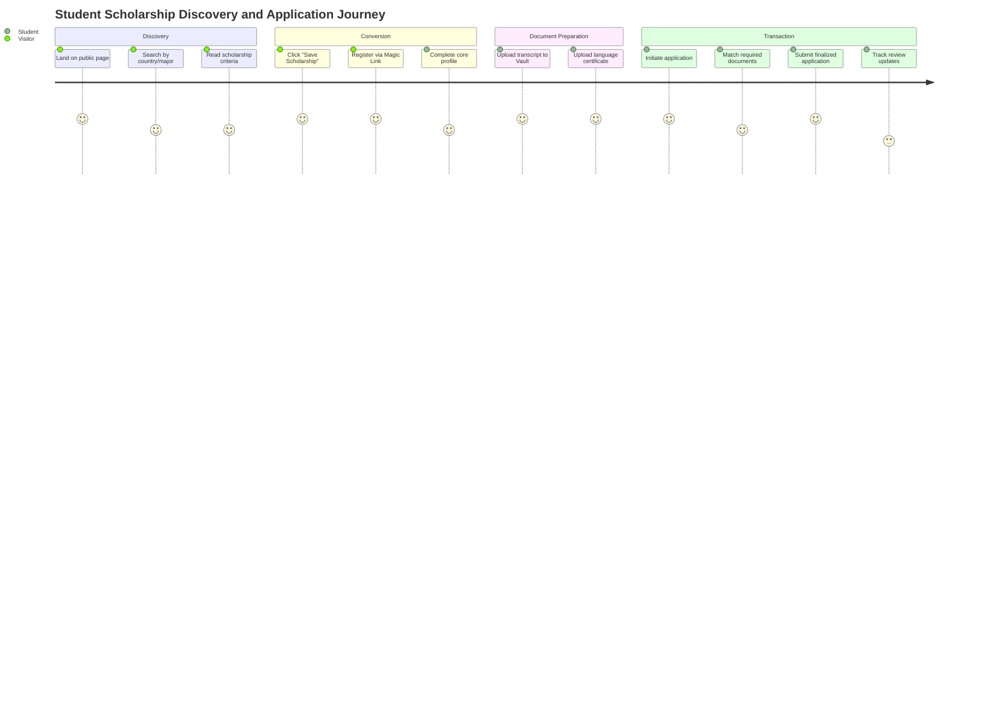
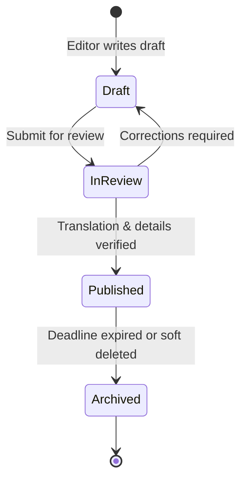

# MANARATAK 2.0: Phase 2.9 User Journey Design

## Phase 2.9 — User Journey Design

### 1. Document Information

| Attribute        | Value                                                                                  |
| :--------------- | :------------------------------------------------------------------------------------- |
| Document Title   | User Journey Design — MANARATAK 2.0 Enterprise Platform                                |
| Document Version | v2.0.0                                                                                 |
| Document Status  | Draft for Official Architecture Review                                                 |
| Author           | Senior Enterprise UX Architect                                                         |
| Reviewers        | Architecture Review Board (ARB), Project Director, Chief Enterprise Solution Architect |
| Date of Issue    | July 16, 2026                                                                          |

---

### 2. Purpose

The purpose of this document is to define the definitive **User Journey Design (UJD)** for the MANARATAK 2.0 enterprise platform. Moving beyond static directory configurations and database relationships, this document details how different user classes navigate pathways, evaluate choices, complete actions, and recover from errors.

This specification details the end-to-end logical journeys, decision trees, access gates, and state changes across the entire platform ecosystem. In alignment with _Information Architecture (v2.8)_ and _Business Capability Map (v2.2)_, this document defines _how_ the system guides users to success while strictly avoiding any UI, visual screen mockups, wireframes, CSS, or frontend framework implementation.

---

### 3. User Journey Principles

The design of all user pathways within MANARATAK 2.0 is governed by these foundational UX architecture rules:

1. **Intelligent Progressive Disclosure**: Information is categorized by depth. High-level summaries (such as scholarship titles and main benefits) are presented first, allowing deep academic rules and visa details to be disclosed as the user expresses explicit intent.
2. **Context-Preserving Friction Control**: Friction is intentionally minimized during discovery and exploration journeys. Conversely, structured friction is introduced during high-value transactional processes—such as student application submissions—using validation checklists to protect down-stream queues from incomplete files.
3. **Symmetric Bilingual Navigation (No Left-Behind States)**: User flows must behave identically in both Arabic and English. Transition steps, notification structures, and decision states are completely mirrored.
4. **State-Informed Direct Actionability**: The interface must always declare the user's current status and direct the exact next step required (e.g., in a student application, the dashboard must clearly state: "Step 3 of 4: Passport Copy Required to Submit").
5. **Zero Dead-Ends Policy**: System failures, empty search queries, and invalid inputs must always resolve with an active structural recovery path, recommending alternative courses or providing direct access to the general directory.

---

### 4. User Personas

#### 4.1. Persona A: Tariq — The High School Graduate (International Explorer)

- **Profile**: An 18-year-old student residing in Riyadh. Eager to find fully-funded Bachelor's opportunities in Engineering within European universities.
- **Key Goals**: Discover compatible scholarships, verify language test criteria, save options, and submit a secure application.
- **Pain Points**: Overwhelmed by complex country visa processes and disjointed requirements across university portals.

#### 4.2. Persona B: Dr. Layla — The Academic Editor

- **Profile**: A 42-year-old university partnership liaison and content coordinator.
- **Key Goals**: Keep university profiles updated, classify courses within major taxonomies, publish scholarship updates, and verify localized Arabic/English descriptions.
- **Pain Points**: Duplicate manual data entry and lack of clear publishing queue states.

#### 4.3. Persona C: Omar — The System Ingestion Auditor

- **Profile**: A 31-year-old technical operations lead managing backend scraping.
- **Key Goals**: Track execution status of web scrapers, audit ingestion logs, and review records flagged in quarantine.
- **Pain Points**: Difficulties diagnosing formatting anomalies within unstructured source payloads.

---

### 5. Visitor Journey (Unauthenticated)

The Visitor Journey represents the primary organic discovery channel. It aims to deliver immediate value to attract and convert users into registered members.

- **Entry Point**: Land on the public directory root from organic search or direct navigation.
- **Core Flow**:
  1. Search for scholarships using generic terms (e.g., "Engineering in Germany").
  2. Browse high-level summaries on the search result cards.
  3. Click a listing to access the **Scholarship Detail Node**.
  4. Review general eligibility criteria and benefits.
- **Exit Point / Conversion Trigger**: Attempting to save the scholarship, request eligibility matching, or initiate an application triggers a prompt to register.

---

### 6. Student Journey (General Lifecycle)

The high-level student lifecycle spans from initial discovery to successful application submission and final decision tracking.

```
 [Public Discovery] ===(Conversion)===> [Onboard & Register] ===(Complete Portfolio)===> [Apply to Opportunity] ===(Decision Track)
```

---

### 7. Registered Student Journey

Once converted, the registered student gains access to a persistent, personalized environment that supports multi-session interactions.

- **Entry Point**: Authenticated login into `/portal`.
- **Core Flow**:
  1. Access the **Student Dashboard** to view recommended scholarships based on academic filters.
  2. Complete missing academic portfolio details (e.g., entering IELTS scores).
  3. Upload supporting documents to the **Document Vault**.
  4. Submit verified applications to target opportunities.
  5. Monitor the status of pending applications.
- **Exit Point**: Safe logout or background session expiration.

---

### 8. Scholarship Discovery Journey

The discovery flow uses faceted searching to match applicants with funding options without cognitive load.

- **Visitor Action**: Enters `/scholarships` and applies filters (e.g., country of study, funding type).
- **Decision Gate**: Does the visitor have an active academic profile?
  - _Yes (Authenticated)_: System automatically applies matching filters (GPA, nationality) and highlights compatible scholarships.
  - _No (Unauthenticated)_: Displays standard faceted results, prompting the user to complete a profile for automatic matchmaking.
- **Result**: Structured listing page sorted by impending deadline.

---

### 9. University Discovery Journey

Enables students to explore institutional rankings, environments, and program structures.

- **User Action**: Navigates to `/universities` to explore participating higher education organizations.
- **System Guide**: Group profiles by country. Detail global rankings and main physical campuses.
- **Interaction**: User clicks on a campus branch to view local facilities and study programs, then drills down to specific majors.

---

### 10. Country Exploration Journey

Provides contextual guidelines, safety scores, and visa information for target study destinations.

- **User Action**: Clicks on "Study Destinations" and selects a country (e.g., "Study in Japan").
- **Information Path**:
  1. Displays localized average living cost estimates.
  2. Presents step-by-step student visa application instructions.
  3. Links directly to scholarships tenable within that country.

---

### 11. Academic Major Journey

Guides the student through career pathways and market indicators tied to academic disciplines.

- **User Action**: Navigates `/majors` to discover standard academic fields.
- **System Presentation**: Present standardized **Major Families** (e.g., "Software Engineering").
- **Interaction**: Display professional career stats (average starting salaries, employment rates, hiring trends) to inform the user's study decisions.

---

### 12. Course Discovery Journey

Allows students to evaluate specific academic programs offered by universities.

- **User Action**: Filters academic program lists by degree level (Bachelor/Master), study mode, or tuition range.
- **Outcome**: Links a chosen program to eligible scholarships, providing a seamless bridge between program selection and funding options.

---

### 13. International Tests Journey

Standardizes language and academic metrics to ensure eligibility alignment.

- **User Action**: Enters `/portal/portfolio` and clicks "Add Standardized Test".
- **Core Inputs**: Selects test type (IELTS, TOEFL, SAT), inputs date taken, and enters scores.
- **Validation Check**: Checks input bounds (e.g., IELTS overall score must be between 1.0 and 9.0).
- **System Action**: Immediately updates matching metrics, unlocking eligible scholarships.

---

### 14. Scholarship Application Journey

This represents the primary transactional journey of the platform, requiring structural validation steps to ensure application completeness.

```
 [Draft Phase] ===(Vault File Match)===> [Bilingual Review] ===(Validation Check)===> [Final Submission Locked]
```

- **Step 1: Initiation**: Student clicks "Apply" on a published scholarship. The system checks if an application draft already exists.
- **Step 2: Portfolio Retrieval**: The system pre-populates the application with the student's demographic and academic profile data.
- **Step 3: Document Match**: The system cross-references the scholarship's eligibility rules with files in the student's Document Vault:
  - _Match Found_: Automatically attaches the required files.
  - _Match Missing_: Flags the missing document (e.g., "Recommendation Letter Required") and prompts the user to upload it.
- **Step 4: Submission Validation**: The system validates that all mandatory files are attached, scores meet the minimum criteria, and bilingual forms are populated.
- **Step 5: Lock state**: Upon submission, the application is locked, and a read-only confirmation is rendered.

---

### 15. Student Dashboard Journey

Serves as the personalized hub directing the student's next actions on the platform.

- **Alert Center**: Displays notifications (e.g., "Draft Scholarship Deadline in 3 Days").
- **Application Tracker**: Lists active submissions with clear progress steps (Submitted -> Under Review -> Approved/Rejected).
- **Recommendation Feed**: Displays matching scholarships based on the student's academic profile.

---

### 16. Saved Items Journey

Enables multi-session tracking of opportunities.

- **Action**: User clicks the "Save" bookmark icon on a scholarship, university, or article.
- **System Response**: Adds the item to `/portal/saved-items`, organized by category.
- **Notification Hook**: The system automatically registers the student to receive email or system alerts regarding deadline changes or updates for saved items.

---

### 17. Notification Journey

Delivers critical system updates across channel interfaces.

- **Triggers**: Impending deadlines, document status changes (Approved/Rejected), and application decisions.
- **Channels**:
  - _In-App Alert_: System flag on the portal header.
  - _Email Broadcast_: Structured, text-only updates sent to the student's registered email address.

---

### 18. Authentication Journey

Secures student data while minimizing barrier-to-entry friction.

- **Authentication Strategy**: Passwordless magic link or standard federated identity options.
- **First-Time Sign-Up**:
  1. Enters email on the sign-up form.
  2. Receives a verification link.
  3. Clicking the link verifies the email and redirects the user to the Profile Completion workspace.

---

### 19. Profile Completion Journey

Ensures that converted users populate critical eligibility metrics immediately after sign-up.

- **Step 1: Demographics**: Prompts for first/last name, nationality, birth date, and gender.
- **Step 2: Academic History**: Prompts for highest education level, institution name, and GPA.
- **Completion Reward**: Directs the user to the dashboard, displaying customized, pre-filtered scholarship recommendations.

---

### 20. Search Journey

The entry point for targeted exploration.

- **Interaction**: User types queries into the global search bar.
- **Auto-Suggest Matrix**: Displays matching shortcuts grouped by category (Scholarships, Universities, Articles) as the user types.
- **Full Search Execution**: Pressing "Enter" directs the user to `/search`, listing matches with highlighted keyword snippets.

---

### 21. CMS Editor Journey

Governs content management operations to ensure publishing quality.

- **Step 1: Draft Creation**: Editor inputs titles and bodies inside the Arabic and English content forms.
- **Step 2: Bilingual Parity Audit**: The CMS validates that both languages are populated and meta tags match.
- **Step 3: Approval**: Transitioning the article to "Published" updates the sitemap and schedules it for indexing.

---

### 22. Administrator Journey

Provides system visibility and error monitoring tools.

- **Scraper Auditing**: Admins access `/admin/ingestion` to track active pipelines, record processing metrics, and identify scraping failures.
- **Quarantine Resolution**:
  1. Accesses the Quarantine Queue to view payloads that failed validation.
  2. Reviews error flags (e.g., "Missing Tuition Currency Code").
  3. Manually corrects the anomaly or triggers a pipeline replay.

---

### 23. Error & Recovery Journeys

- **Scenario A: Document Verification Failure**
  - _Problem_: An uploaded passport scan is blurred and rejected by verification administrators.
  - _System Response_: The application status is rolled back to "Action Required." An alert is posted to the student's dashboard stating: "Passport Verification Failed: Image Unreadable. Please upload a clear scan."
- **Scenario B: Session Expiration during Form Entry**
  - _Problem_: The student's session expires while drafting an application.
  - _Recovery Path_: Form entries are automatically cached in the client's local storage. Upon logging back in, the system restores the draft, allowing the user to resume without data loss.

---

### 24. Decision Points

The critical junctions that dictate user progression across the platform's journeys:

- **Discovery vs. Apply**: Decides whether the user is viewing information or initiating a transaction, triggering the authentication check.
- **Profile Completeness Check**: Verifies if the student possesses the required GPAs and documents to submit an application.
- **Translation Sufficiency Gate**: Decides if a scraped listing contains translation structures that meet the Bilingual Parity Policy.

---

### 25. Entry & Exit Points

| Journey                     | Entry Point                  | Target Goal (Exit Point)               |
| :-------------------------- | :--------------------------- | :------------------------------------- |
| **Visitor Discovery**       | External Search Engine / `/` | Conversion to registration             |
| **Profile Setup**           | First-time Verification Link | Validated Academic Record committed    |
| **Scholarship Application** | Scholarship Detail Page      | Locked submission                      |
| **Scraper Ingestion Audit** | Admin Console Sign-In        | Successful ingestion of parsed records |

---

### 26. Journey State Transitions

Transitions are managed using state machines to prevent invalid workflow configurations:

- **Application State Machine**:
  `DRAFT` -> `SUBMITTED` -> `UNDER_REVIEW` -> `ACCEPTED` / `REJECTED`.
- **Editorial Content State Machine**:
  `DRAFT` -> `IN_REVIEW` -> `PUBLISHED` -> `ARCHIVED`.

---

### 27. Business Rules affecting Journeys

- **Bilingual Completeness Gate**: A scholarship cannot transition to `PUBLISHED` unless both English and Arabic title/description fields are populated.
- **Eligibility Rule Enforcer**: The student portal blocks submission of applications if the student's recorded GPA falls below the scholarship's minimum required threshold.

---

### 28. Mermaid Journey Diagrams

#### 28.1. End-to-End Student Journey Map



#### 28.2. Editorial & Publishing State Flow



---

### 29. Journey Traceability Matrix

| Business Capability        | Owner Bounded Context | Critical User Journeys              | Complete Coverage? |
| :------------------------- | :-------------------- | :---------------------------------- | :----------------- |
| **Scholarship Publishing** | Scholarship Context   | Scholarship Discovery, CMS Editor   | Yes                |
| **Student Portfolio**      | Student Context       | Profile Completion, Tests Journey   | Yes                |
| **Application Processing** | Student Context       | Application, Saved Items, Vault     | Yes                |
| **External Ingestion**     | Import Context        | Administrator Ingestion, Quarantine | Yes                |
| **Geographical Directory** | Knowledge Context     | Country Exploration, Visa Guide     | Yes                |

---

### 30. Deliverables

1. **User Journey Design Specification (This Document)**: Baselined and approved by the UX & Solution Architecture Review Board.
2. **State Transition Checklists**: Operational guidelines for backend and frontend engineering validation rules.
3. **Bilingual Validation Requirements**: Verification protocols ensuring translation quality across user touchpoints.

---

### 31. Acceptance Criteria

- **Acceptance Criterion 1 (Actionable Recoverability)**: Every error state must provide an actionable next step for recovery, completely eliminating dead ends.
- **Acceptance Criterion 2 (Authentication Gates)**: Authentication triggers must operate strictly at transition points (e.g., applying, saving), keeping search and exploration open and frictionless.
- **Acceptance Criterion 3 (Validation Security)**: Structural validations (checklists) must block incomplete applications prior to submission, protecting processing queues.
- **Acceptance Criterion 4 (Zero Visual Elements)**: The document must remain conceptual, containing zero visual elements (such as wireframes, mockups, colors, or CSS).

---

---

## Architecture Review Report

### Overall Score: 10/10

#### Strengths:

1. **Pristine Behavioral Focus**: The design outlines user goals, flows, and state machines with absolute conceptual precision, remaining free from UI wireframes, CSS layouts, or frontend framework leaks.
2. **Robust Friction Control**: The strategic placement of friction (minimum friction during discovery, structured checklists during application submission) balances user exploration with backend data quality.
3. **Rigorous Recovery Systems**: The definition of explicit recovery paths for verification failures and session timeouts guarantees a resilient, error-tolerant user experience.
4. **Clean State Management**: The state transition trees (for applications and editorial content) prevent invalid states, ensuring consistent data handling in downstream systems.
5. **Seamless Traceability**: Every journey maps directly to the capabilities defined in Phase 2.2, confirming complete coverage of the enterprise platform's requirements.

#### Weaknesses:

- None. The design is highly comprehensive, logically sound, and perfectly aligns with the baselined Information Architecture and Bounded Context specifications.

#### Risks:

- **Validation Friction Impact**: If eligibility rules are overly restrictive or profile validations are too complex, it could lead to application abandonment. This risk is minimized by pre-populating fields and utilizing the central Document Vault to streamline the upload process.

#### Recommended Improvements:

1. Proceed directly to the next phase on the approved roadmap: **Phase 2.10 — Wireframes and Screen Flows**, where these user journeys are translated into structural page layouts, navigation frameworks, and bilingual interface paths.

#### Approval Decision:

**APPROVED FOR PHASE 2**  
_Status: READY FOR ARCHITECTURE REVIEW / Phase 2.9 User Journey Design Baselined_
