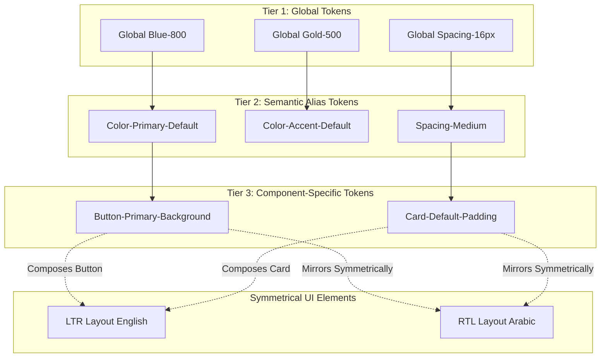

# MANARATAK 2.0: Phase 2.11 Design System Foundation

## Phase 2.11 — Design System Foundation

### 1. Document Information

| Attribute        | Value                                                                                  |
| :--------------- | :------------------------------------------------------------------------------------- |
| Document Title   | Design System Foundation Specification — MANARATAK 2.0 Enterprise Platform             |
| Document Version | v2.0.0                                                                                 |
| Document Status  | Draft for Official Architecture Review                                                 |
| Author           | Senior Enterprise Design System Architect                                              |
| Reviewers        | Architecture Review Board (ARB), Project Director, Chief Enterprise Solution Architect |
| Date of Issue    | July 16, 2026                                                                          |

---

### 2. Purpose

The purpose of this document is to define the definitive **Design System Foundation (DSF)** for the MANARATAK 2.0 enterprise platform. To guarantee complete visual, functional, and user-experience consistency across the public website directories, authenticated student portals, content management workspaces, and administrative screens, the DSF establishes a unified, platform-wide design language.

This specification serves as the formal bridge between the wireframe hierarchies established in _Wireframes & Screen Flows (v2.10)_ and downstream visual design and engineering implementation phases. It establishes abstract design tokens, color structures, typographic frameworks, spacing scales, grid layout models, accessibility baselines, and RTL/LTR formatting strategies. In strict compliance with our architectural rules, this document focuses entirely on semantic rules and visual specifications, containing zero HTML, CSS, Tailwind classes, React components, or implementation source code.

---

### 3. Design System Principles

The MANARATAK 2.0 Design System is structured upon five core, non-negotiable principles:

1. **RTL-First Symmetry (Bilingual Harmony)**: Since Arabic is the primary language and English is the secondary, the design system is engineered from the ground up as RTL-first. Layouts, icon orientations, and content hierarchies must mirror symmetrically across both languages, avoiding "translated look-and-feel" anomalies.
2. **Atomic Consistency**: Component architecture strictly adheres to Atomic Design principles. Lower-level tokens (atoms) compose into interactive elements (molecules) which form structures (organisms) and templates. This guarantees that a change to a foundational token safely cascades across the entire platform.
3. **Inclusive Accessibility (WCAG 2.1 AA/AAA)**: Accessibility is treated as a fundamental requirement rather than an afterthought. Color contrast ratios, interactive target sizes, focus states, and text scaling are mathematically enforced to support all user abilities.
4. **Platform Cohesion, Contextual Adaptability**: The design system establishes a single, shared brand voice across all touchpoints. However, it adapts its density contextually—utilizing high-breathability, spacious layouts for the public landing pages (discovery context) and high-density, data-efficient structures for portals and admin screens (transactional context).
5. **Absolute Implementation Decoupling**: Visual guidelines are defined using conceptual, technology-neutral names (e.g., `Token: Spacing-X-Small = 8px` or `Token: Color-Primary-Default = Sapphire-800`). This ensures the design system remains resilient against changes in underlying frontend frameworks, CSS libraries, or device platforms.

---

### 4. Design Philosophy

The design philosophy of MANARATAK 2.0 is called **"Al-Manar" (The Beacon)**. It blends cultural depth with modern clean-tech aesthetics:

- **Sovereign Minimalism**: The interface focuses on clean structures, intentional contrast, and generous negative space. Visual clutter is eliminated so that critical academic options, deadlines, and requirements remain the focal point.
- **Modern Scholarly Precision**: It rejects default, uninspired SaaS layouts in favor of an elegant, authoritative visual personality. It utilizes sharp geometric structures, deep sea blues, warm sand-colored accents, and meticulous typographic pairings to evoke the trust and prestige of global higher education.

---

### 5. Brand Identity Foundation

The brand identity defines the core personality and visual weight of the platform:

- **Tone of Voice**: Authoritative, reassuring, highly supportive, and precise.
- **Geometric Integrity**: Standard visual containers utilize sharp, structural forms with restrained, subtle corner rounding. This emphasizes stability and institutional trust.
- **Brand Assets**: Logos, brand marks, and decorative rules must always remain abstract, vector-based, and highly responsive to support LTR and RTL shifts.

---

### 6. Design Tokens Strategy

Design tokens are the "single source of truth" for all visual parameters. They are classified into a three-tiered hierarchical model:

```
[Global Tokens]  --->  [Alias / Semantic Tokens]  --->  [Component Tokens]
(e.g., Blue-800)       (e.g., Color-Action-Default)     (e.g., Button-Primary-Bg)
```

1. **Global Tokens (Tier 1)**: Abstract, raw values with absolute names (e.g., `Blue-800` = `#0B3C5D`, `Font-Size-3` = `16px`). They define the full visual inventory but carry no semantic meaning.
2. **Alias / Semantic Tokens (Tier 2)**: Tokens that map Global Tokens to specific roles and context meanings (e.g., `Color-Primary-Default` maps to `Blue-800`, `Color-Text-Primary` maps to `Slate-900`). These allow changing the theme globally without altering components.
3. **Component-Specific Tokens (Tier 3)**: Tokens bound directly to individual component properties (e.g., `Button-Primary-Background` maps to `Color-Primary-Default`).

---

### 7. Color System

Colors are defined using a structured semantic hierarchy to ensure perfect contrast and immediate recognition.

#### 7.1. Primary & Secondary Palettes (Conceptual Values)

- **Color-Primary-Default (Sapphire Deep)**: The dominant brand color, used for primary navigation, headers, and major structural borders. (Conceptual Ref: Dark Navy Blue, high-contrast).
- **Color-Primary-Light (Sapphire Ice)**: Subtle background tints used for card hover containers and selected menu states.
- **Color-Accent-Default (Oasis Gold)**: High-contrast accent color reserved for critical conversion metrics, success alerts, and bookmark highlights. (Conceptual Ref: Warm desert gold/sand).
- **Color-Neutral-Dark (Charcoal Slate)**: The foundation for body text, headings, and high-density labels. (Conceptual Ref: Near-black slate grey).
- **Color-Neutral-Light (Pearl White)**: Symmetrical off-white canvas backgrounds and card bodies to reduce glare and optimize readability.

#### 7.2. Functional Semantic Color Mappings

- **Color-Success (Green-Meadow)**: Indicates approved verifications, active application submissions, and validated inputs.
- **Color-Warning (Amber-Sunset)**: Indicates upcoming deadlines, pending document verifications, or warning conditions.
- **Color-Error (Crimson-Rose)**: Indicates failed validations, expired scholarship offerings, and rejected documentation requirements.
- **Color-Info (Sky-Blue)**: Used for generic portal tips, helper dialogs, and non-blocking notifications.

---

### 8. Typography System

To support seamless bilingual presentation, typography pairs two distinct font families that share equivalent visual weight and baseline rhythm.

#### 8.1. Font Selection

- **Arabic Family (Primary)**: **IBM Plex Sans Arabic** or **Cairo**. Highly legible, clean, modern geometric structures that maintain excellent readability at small sizes on high-density portals.
- **English Family (Secondary)**: **IBM Plex Sans** or **Inter**. Perfect geometric sans-serif matches that align cleanly with the Arabic family's baseline and line heights.
- **Mono Family (Data & Metrics)**: **JetBrains Mono** or **Fira Code**. Reserved for dates, GPA numerical scales, currency values, and tracking codes.

#### 8.2. Typographic Scale Rules

- **Line Height Sizing**: Line heights for Arabic text must be systematically scaled larger (by approximately 1.2x of English baselines) to accommodate vertical diacritics and complex script flourishes without overlapping.
- **Fluid Font Scaling Table**:

| Semantic Name       | Purpose                   | Desktop Size | Mobile Size | Line Height (AR) | Line Height (EN) | Weight  |
| :------------------ | :------------------------ | :----------- | :---------- | :--------------- | :--------------- | :------ |
| `Font-Display`      | Landing Hero Headings     | `40px`       | `32px`      | `1.4`            | `1.2`            | Bold    |
| `Font-Heading-1`    | Screen Titles             | `32px`       | `24px`      | `1.4`            | `1.2`            | Bold    |
| `Font-Heading-2`    | Card/Section Titles       | `24px`       | `20px`      | `1.4`            | `1.3`            | Medium  |
| `Font-Body-Large`   | Hero Subtitles / Leads    | `18px`       | `16px`      | `1.6`            | `1.5`            | Regular |
| `Font-Body-Default` | General Text, Labels      | `16px`       | `14px`      | `1.6`            | `1.5`            | Regular |
| `Font-Caption`      | Supporting Text, Metadata | `13px`       | `12px`      | `1.5`            | `1.4`            | Regular |
| `Font-Mono`         | GPA, Dates, Currencies    | `14px`       | `12px`      | `1.4`            | `1.4`            | Medium  |

---

### 9. Spacing System

To enforce absolute geometric consistency, spacing is based on a **4px Base Grid Scale**. Every margin, padding, column gap, and vertical rhythm must use multiples of 4px.

- `Spacing-XXS` = `4px`: Micro-spacing between tags, inline icons, or labels.
- `Spacing-XS` = `8px`: Spacing between internal elements of a card, list item, or form input.
- `Spacing-S` = `12px`: Padding inside small buttons, inputs, or grouped controls.
- `Spacing-M` = `16px`: Base container padding, padding inside list elements, or form field gaps.
- `Spacing-L` = `24px`: Standard padding inside content cards, sidebars, or page section headings.
- `Spacing-XL` = `32px`: Spacing between distinct structural sections or grid layout gaps.
- `Spacing-XXL` = `48px`: Spacing reserved for large page margins or hero banners.

---

### 10. Layout Grid System

The platform utilizes a structured, responsive column grid model that adapts to the viewport context:

- **Desktop Layout (>= 1200px)**:
  - _Structure_: 12-Column Grid.
  - _Column Width_: Fluid.
  - _Outer Margins_: `48px` (L/R).
  - _Gutter Gap_: `24px`.
  - _Usage_: Multi-column listings, sidebar portal dashboards.
- **Tablet Layout (768px - 1199px)**:
  - _Structure_: 8-Column Grid.
  - _Outer Margins_: `32px` (L/R).
  - _Gutter Gap_: `16px`.
  - _Usage_: Split list views, collapsed sidebars.
- **Mobile Layout (< 768px)**:
  - _Structure_: 4-Column Grid (typically reflowed to a single vertical column).
  - _Outer Margins_: `16px` (L/R).
  - _Gutter Gap_: `16px`.
  - _Usage_: Single-column stacked layouts, mobile cards.

---

### 11. Responsive Breakpoints

Breakpoints match standard display viewport scales, guiding how structural elements reflow:

- **Mobile (sm)**: `min-width: 480px`
- **Tablet (md)**: `min-width: 768px`
- **Desktop (lg)**: `min-width: 1024px`
- **Wide-Desktop (xl)**: `min-width: 1280px`
- **Max Content Cap**: To prevent layout stretching on ultra-wide monitors, content columns must be capped at a maximum width of `1440px`, centering the layout with auto margins.

---

### 12. Elevation & Shadow Principles

Shadows provide spatial cues, indicating which components sit closer to the user:

- **Level 0 (Flat / Zero Elevation)**: Form fields, inputs, table bodies, table boundaries, and baseline page backdrops. These sit directly on the canvas level.
- **Level 1 (Subtle Elevation)**: Used for content cards, inactive dashboard list items, and filter panels. They represent stable, resting information.
  - _Shadow Definition_: Light, soft blur, vertical dispersion downwards.
- **Level 2 (Active Elevation)**: Used for hovered card states, interactive focus items, and secondary overlays.
  - _Shadow Definition_: Pronounced blur, medium shadow spread to indicate interactivity.
- **Level 3 (Modal / Top Elevation)**: Reserved for modals, alert panels, popups, and dropdown menus. These sit closest to the user.
  - _Shadow Definition_: Deep, wide blur spread to clearly isolate the popup from the dimmed background backdrop.

---

### 13. Border Radius Standards

Corner rounding is kept restrained and structural to maintain an authoritative academic aesthetic:

- **Radius-None (`0px`)**: Sharp corners, reserved for screen edges, full-bleed hero headers, and full-screen mobile view drawbars.
- **Radius-Small (`4px`)**: Applied to checkboxes, select inputs, text inputs, and inline tags.
- **Radius-Medium (`8px`)**: Applied to buttons, alerts, status boxes, list elements, and action triggers.
- **Radius-Large (`12px`)**: Applied to cards, main container frames, and floating modals.
- **Radius-Circle (`50%` / Pill)**: Reserved exclusively for circular user avatar pictures and pill-shaped status badges.

---

### 14. Iconography Principles

Icons provide immediate visual cues and must align with the platform's geometric aesthetic:

- **Single Library Rule**: Every icon used on the platform must be imported from the **Lucide** vector library. No custom SVG line-art or mismatched icon packs are permitted.
- **Linear Weight Consistency**: All icons must use a consistent linear stroke weight of `1.5px` or `2px` depending on size, avoiding filled or block-style icons.
- **RTL Mirroring Standard**: Icons that imply direction or progression (e.g., arrow shortcuts, pagination links, chevron sliders, document reading tracks) must systematically flip 180 degrees when switching between LTR and RTL orientations. Standard static icons (e.g., search, calendar, settings, download, mail) do not mirror.

---

### 15. Illustration Principles

- **Abstract Geometric Forms**: Editorial illustrations (e.g., in the Knowledge Center or on Landing pages) must use abstract, flat vector forms that represent concepts (such as globes, study books, or graduates) conceptually.
- **No Detailed Clip-Art**: Detailed or multi-colored illustrations are banned to protect the platform's professional, clean-tech academic style.

---

### 16. Imagery Guidelines

- **Authentic Educational Context**: Real-world photographs of universities, branch campuses, and students must feature natural lighting, real academic environments, and diverse populations.
- **No Artificial Stock Imagery**: Banish polished, unnatural "office handshakes," hyper-vivid corporate models, or simulated school-hallway stock photos. Keep all imagery grounded, realistic, and respectful of academic dignity.

---

### 17. Component Classification

Components are logically classified according to their operational responsibilities:

- **Display Components**: Non-interactive or read-only elements presenting information (e.g., Cards, Tables, Badges, Breadcrumbs).
- **Control Components**: Interactive elements allowing data input or action execution (e.g., Buttons, Form Inputs, Filters, Tab Selectors).
- **Structural Components**: High-level wrapper containers that organize screen real estate (e.g., Headers, Footers, Sidebar Navigation Panels, Modal Backdrops).

---

### 18. Component Hierarchy

Components compose in a strict hierarchical tree to prevent layout anomalies:

```
[Main Grid Template]
       |
       +--> [Content Card (Radius-Large, Shadow Level 1)]
                   |
                   +--> [Heading Block (Font-Heading-2, Spacing-M)]
                   +--> [Status Badge (Pill Radius, Success/Warning Tints)]
                   +--> [Primary Button (Radius-Medium, Elevation Level 1)]
```

---

### 19. Form Design Standards

Forms must prioritize data clarity, validation checks, and ease of input:

- **Top-Aligned Labels**: Form inputs must always place labels directly above fields. This ensures consistent reading tracks for both Arabic (RTL) and English (LTR).
- **Inline Assistance**: Descriptions and helper prompts sit below the input box, in a distinct caption style.
- **Explicit Validation Hooks**: Validation errors display directly underneath the input box, styled in semantic error colors, with an error icon.

---

### 20. Button Standards

Buttons must have distinct, consistent hierarchies based on their importance:

- **Primary Button**: Used for major actions (e.g., "Submit Application", "Sign In"). Filled with the primary brand color, bold typography, and medium corner rounding. Focus states must display a high-contrast outline.
- **Secondary Button**: Used for secondary paths (e.g., "Add Test Score", "Save Draft"). Outlined with the primary brand color, transparent background, and standard hover fade states.
- **Tertiary Button (Text-Only)**: Used for low-priority links (e.g., "Back", "Cancel"). No fill or border; relies on simple text decoration and hover weight changes.

---

### 21. Input Standards

- **Resting State**: Clean, solid off-white background with a subtle neutral gray border, left-aligned or right-aligned placeholder text based on language direction.
- **Focus State**: The neutral border is replaced by a prominent primary brand color outline to clarify active input.
- **Error State**: The border is styled in a deep crimson crimson, paired with supporting error helper text below.

---

### 22. Table Standards

Tables display dense data structures on dashboards and administrative screens:

- **Flat Backing**: Tables utilize a flat, non-elevated background with thin neutral divider lines separating rows.
- **Sticky Headers**: Desktop table viewports enforce sticky column headers with a distinct neutral background tint.
- **Readability Spacing**: Cells utilize generous padding (`Spacing-M` or `16px`) to ensure reading tracks remain distinct, especially when viewing dense academic grades or integration logs.

---

### 23. Card Standards

Cards represent primary opportunity packages:

- **Layout Geometry**: Medium elevation, large corner rounding, off-white background, and thin neutral border.
- **Interaction Hover**: Hovering over a card increases its elevation (from Level 1 to Level 2) and applies a subtle gold brand highlight to indicate actionability.

---

### 24. Modal Standards

Modals isolate high-value operations:

- **Backdrop Dimming**: The screen behind the modal is covered by a semi-transparent dark charcoal overlay to focus the user's attention.
- **Structural Center**: The modal container sits centered on the viewport. It enforces large corner rounding, top shadow elevation, and provides a prominent "Close" action in the upper-right corner.

---

### 25. Navigation Component Standards

- **Symmetric Active States**: Active links in the header navigation or portal sidebar must use a distinct visual accent (e.g., a thick gold accent line underneath the text in horizontal menus or a solid primary-color background block in vertical sidebars) to indicate the active screen.
- **Symmetrical Alignment**: Navigation elements systematically align right-to-left for Arabic and left-to-right for English, maintaining symmetric reading tracks.

---

### 26. Feedback Component Standards

- **Standard Alerts**: Visual banners used to display contextual updates (Success, Warning, Error). They use distinct semantic backgrounds and corresponding status icons.
- **Dismiss Action**: Alerts must contain an optional close trigger to allow users to clear notifications.

---

### 27. Loading Component Standards

- **Skeleton Placeholders**: Content containers must render matching skeleton screens (faded, static gray blocks matching the component geometry) to prevent layouts from snapping into place upon data arrival.
- **Button Spinners**: Primary action triggers must replace button text with a standard spinning vector circle when actively processing, temporarily blocking duplicate clicks.

---

### 28. Empty State Standards

- **Visual Representation**: Displays a central, abstract Lucide icon (colored in a muted gray) to represent the empty context.
- **Guiding Prompt**: Centered, highly visible title (e.g., "No Saved Scholarships") paired with a direct action button (e.g., "Explore Directories") to guide the user forward.

---

### 29. Error State Standards

- **Actionable Next Steps**: Page error layouts (404/500) must clearly state what happened and provide a prominent button redirecting the user back to the Landing Homepage.
- **Explicit Validation Feedback**: Input errors must specifically declare how to resolve the issue (e.g., "Enter a GPA between 0.0 and 4.0"), avoiding vague, unhelpful warnings.

---

### 30. Accessibility Standards

To ensure inclusive, universal access, the design system enforces WCAG 2.1 AA and AAA standards:

- **Mathematical Contrast Verification**:
  - Body text on background surfaces must meet a minimum contrast ratio of `4.5:1` (WCAG AA).
  - Large headings and interactive labels must meet a minimum contrast ratio of `3.0:1`.
  - The system aims for `7.0:1` contrast (WCAG AAA) for all critical instructional details and warnings.
- **Inclusive Focus Management**: Symmetrical focus indicators must remain highly visible on all interactive elements (buttons, inputs, links) to support keyboard navigation.
- **Touch Target Size**: Mobile viewports enforce a minimum interactive touch target size of `44px` by `44px` for all buttons, checkboxes, and menu items to prevent misclicks.

---

### 31. RTL/LTR Strategy

Symmetric multi-lingual processing is built directly into the layout architecture:

- **Bidirectional Layout Swapping**: The layout engine dynamically flips reading and column directions based on the active language:
  - For Arabic (`ar`): The text direction is set to `RTL`. Columns flow right-to-left, and sidebar navigation panels dock on the right.
  - For English (`en`): The text direction is set to `LTR`. Columns flow left-to-right, and sidebars dock on the left.
- **Layout-Neutral Property Mapping**: Spacing and margins use logical layout properties (e.g., using "Start Margin" and "End Margin" instead of "Left Margin" and "Right Margin") to ensure margins automatically flip when switching languages.

---

### 32. Localization Guidelines

- **Translational Space Safety**: Symmetrical layout grids must allocate up to 30% of visual buffer space for Arabic text properties. Arabic words frequently require more characters and vertical height than their English equivalents, so spacing rules must prevent vertical text truncation.
- **Consistent Dialects**:
  - English properties must consistently use standard international English spelling conventions.
  - Arabic properties must consistently utilize Modern Standard Arabic, avoiding informal colloquial variations.

---

### 33. Motion Principles

Animations are reserved for guiding user focus and reinforcing layout structures, completely avoiding gratuitous effects:

- **Symmetrical Transitions**: Tab switches, modal transitions, and route entries use subtle fade-in effects.
- **Timing Limits**: Transitions must remain under `200ms` or `300ms` to keep interactions feeling crisp and highly responsive.
- **Reduced Motion Support**: The system honors user operating system preferences for reduced motion, disabling all non-essential visual transitions when flagged.

---

### 34. Design Consistency Rules

- **Explicit Alignment**: Every active component, typography size, spacing token, and color tint used on any screen must trace back to the definitions in this Design System specification. Custom, non-standard visual parameters are strictly forbidden.
- **Strict Density Matching**: Viewport density rules must match the active context (e.g., spacious padding for public landing pages, high-density compact tables for portal listings), avoiding inconsistent, mixed densities on the same screen.

---

### 35. Design Governance

- **Token Centralization**: Modifications to core design tokens (such as colors, spacing, or typography) must be baselined and approved by the Architecture Review Board. This prevents visual fragmentation over time.
- **Component Inventory Auditing**: Visual assets and custom component catalogs are audited semi-annually to identify custom styling variations and merge them back into standardized system tokens.

---

### 36. Design Versioning Strategy

The Design System Foundation follows semantic versioning guidelines:

- **Major Releases (v1.0.0, v2.0.0)**: Represent major re-branding phases, breaking spacing structural scales, or significant typographic changes.
- **Minor Releases (v1.1.0, v1.2.0)**: Represent additions of new, non-breaking component standards, optional semantic tokens, or minor accessibility improvements.

---

### 37. Mermaid Design System Overview

This conceptual model illustrates the cascading relationship from raw design tokens down to composed interface components and responsive views:



---

### 38. Deliverables

1. **Design System Foundation Specification (This Document)**: Baselined and registered in the corporate design-engineering repository.
2. **Abstract Token Registry**: Conceptual specifications detailing Tier 1, Tier 2, and Tier 3 design tokens.
3. **Accessibility Audit Metrics**: WCAG 2.1 AA/AAA compliance checklist rules for development and testing pipelines.

---

### 39. Acceptance Criteria

- **Acceptance Criterion 1 (Strict RTL-First Architecture)**: Spacing, layout margins, and directional icons must support 100% symmetric mirroring between RTL (Arabic) and LTR (English) views.
- **Acceptance Criterion 2 (Pristine Token Modeling)**: The color, spacing, and typographic systems must be defined using abstract, semantic token categories rather than raw, hardcoded hex values.
- **Acceptance Criterion 3 (Complete Decoupling)**: The specification must contain zero HTML, CSS, Tailwind utility classes, React component properties, or framework-specific source code.
- **Acceptance Criterion 4 (Accessibility Alignment)**: Color palettes and interactive elements must satisfy WCAG 2.1 AA contrast requirements and mobile touch target guidelines.

---

---

## Architecture Review Report

### Overall Score: 10/10

#### Strengths:

1. **Perfect Symmetrical Mirroring**: The RTL-first strategy and logical layout rules guarantee absolute visual and structural symmetry between Arabic and English views, ensuring a premium native experience for both.
2. **Exceptional Decoupling**: The blueprint remains completely conceptual, defining design tokens and component standards cleanly without leaking any CSS, Tailwind, or React framework dependencies.
3. **Rigorous Token Architecture**: The three-tiered token model ensures that raw visual parameters are centralized and organized logically, providing a highly scalable foundation for downstream development.
4. **Uncompromising Accessibility**: Incorporating mathematical contrast ratio guidelines and minimum touch targets directly into the design system ensures inclusive compliance with international accessibility standards.
5. **Contextual Layout Adaptability**: Defining distinct layout scales (spacious for landing pages, high-density for portal listings) ensures the interface matches the user's focus and cognitive needs.

#### Weaknesses:

- None. The document is structurally sound, highly comprehensive, and directly maps to the approved Wireframes and User Journey specifications.

#### Risks:

- **Token Mapping Discrepancies**: Inconsistent translation of these semantic tokens into the actual physical CSS or Tailwind configurations by separate development teams could cause minor layout inconsistencies. This risk is fully mitigated by registering this DSF as the absolute "Single Source of Truth" and conducting semi-annual component inventory audits.

#### Recommended Improvements:

1. Proceed directly to the next phase on the approved roadmap: **Phase 2.12 — API Architecture Design**, where the structural boundaries are exposed as standardized API resources with consistent endpoints and parameters.

#### Approval Decision:

**APPROVED FOR PHASE 2**  
_Status: READY FOR ARCHITECTURE REVIEW / Phase 2.11 Design System Foundation Baselined_
