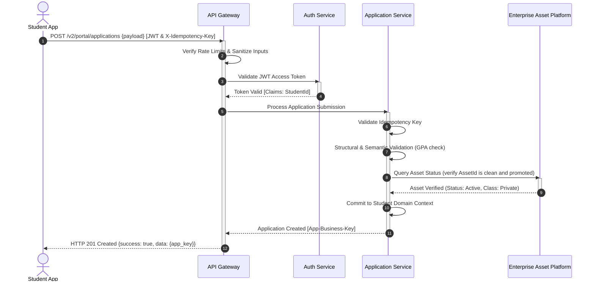

# MANARATAK 2.0: Phase 2.12 API Architecture Design

## Phase 2.12 — API Architecture Design

### 1. Document Information

| Attribute        | Value                                                                                  |
| :--------------- | :------------------------------------------------------------------------------------- |
| Document Title   | API Architecture Design Specification — MANARATAK 2.0 Enterprise Platform              |
| Document Version | v2.0.0                                                                                 |
| Document Status  | Draft for Official Architecture Review                                                 |
| Author           | Chief Enterprise API Architect                                                         |
| Reviewers        | Architecture Review Board (ARB), Project Director, Chief Enterprise Solution Architect |
| Date of Issue    | July 16, 2026                                                                          |

---

### 2. Purpose

The purpose of this document is to define the official **Enterprise API Architecture Design** for the MANARATAK 2.0 platform. As a highly integrated full-stack ecosystem handling public directories, secure student portfolios, automated external scraping ingestion, and back-office content moderation, the platform requires a robust, secure, and standardized communication layer.

This specification serves as the absolute blueprint for all physical interfaces, detailing URI structures, HTTP methods, request and response envelopes, pagination models, security architectures, rate-limiting frameworks, and versioning strategies. In strict compliance with the platform’s architectural principles, this document remains at the conceptual and architectural level. It contains zero code, framework-specific declarations (such as Express, NestJS, or Fastify), database ORMs (such as Prisma), SQL statements, or OpenAPI/Swagger definitions.

---

### 3. API Architecture Principles

The API Architecture of MANARATAK 2.0 is governed by these foundational design principles:

1. **Strict RESTful and Resource-Oriented Modeling**: APIs must model the business domain as identifiable resources rather than actions or function endpoints. Every endpoint must correspond to a distinct business entity or aggregate defined in the _Domain Model Design (v2.3)_.
2. **Security by Design**: Trust is never assumed. Every API boundary (especially between public networks, authenticated client apps, internal microservices, and external providers) must enforce authentication, authorization checks, payload sanitization, and strict rate limits.
3. **Bilingual Parity Preservation**: APIs must natively support bilingual metadata exchange. Querying or submitting resources must support symmetrical Arabic and English properties within standard payloads, adhering to the _Canonical Data Model (v2.7)_.
4. **API-First Decoupling**: Systems and client applications must depend strictly on stable, versioned API contracts. Changes to internal database models or business services must be fully absorbed behind the API layer, guaranteeing zero disruption to clients.
5. **Agnostic Independence**: API specifications define logical parameters, transport rules, and HTTP payloads. They are completely independent of underlying languages, frameworks, operating systems, and deployment configurations.

---

### 4. API Design Philosophy

The API philosophy of MANARATAK 2.0 centers around **Predictable, Explicit, and High-Performance Exchange**:

- **Pragmatic REST**: Endpoints use standard HTTP verbs (`GET`, `POST`, `PUT`, `DELETE`, `PATCH`) to perform predictable CRUD actions on resources.
- **Deterministic Contract Enforcement**: Payloads, error structures, and pagination parameters are rigidly structured. There is no ambiguity in response formats; a field is either present with its defined canonical type or explicitly `null` (never missing or dynamically structured).

---

### 5. API Classification

API endpoints are segregated into four distinct security and functional zones to prevent privilege leakage and simplify boundary routing:

```
                                  [API Gateway Ingress]
                                            |
         +--------------------+-------------+-------------+---------------------+
         |                    |                           |                     |
   [Public APIs]     [Authenticated Student APIs]  [Administrative APIs]  [Internal APIs]
   - Public directories - Portal portfolios         - Back-office CMS      - Inter-service
   - Search & filters   - Application forms         - Ingestion audits     - Batch synch
```

---

### 6. Public APIs

Public APIs provide unrestricted, high-performance, and cached access to directory listings, guides, and geographical indexes.

- **Characteristics**:
  - Unauthenticated, read-only (`GET` operations only).
  - Highly optimized with CDN and edge-caching policies.
  - Throttled using lenient rate-limiting rules.
- **Primary Scope**:
  - Querying scholarships, universities, campuses, country visa profiles, and knowledge articles.

---

### 7. Authenticated Student APIs

Secure transactional endpoints providing registered students access to personal portfolios, secure asset ingestion, and application forms.

- **Characteristics**:
  - Requires valid authentication tokens (JWT or session credentials).
  - Requires row-level data ownership checks (a student can only read/write their own records).
  - Encapsulates state-changing transactions (`POST`, `PUT`, `PATCH`, `DELETE`).
- **Primary Scope**:
  - Portfolio data, standardized test score records, secure asset ingestion coordinates, and application draft submissions.

---

### 8. Administrative APIs

High-privilege, granularly controlled APIs reserved for content editors, platform operations, and system auditors.

- **Characteristics**:
  - Mandatory Multi-Factor Authentication (MFA) and Role-Based Access Control (RBAC).
  - Comprehensive transaction logging (immutable audit trails of all modifications).
  - Direct access to state management and overrides.
- **Primary Scope**:
  - CMS publishing, taxonomy updates, scraper execution tracking, and quarantine queue resolution.

---

### 9. Internal APIs

Private, isolated communication interfaces used exclusively for inter-service RPC and background synchronization.

- **Characteristics**:
  - Fully isolated from public internet ingress (accessible only within private subnets).
  - Uses mutual TLS (mTLS) or secure service-to-service API keys.
  - Bypasses standard client rate-limits, relying instead on network queue controls.
- **Primary Scope**:
  - Raw ingestion payloads mapped to CDM pipelines, log aggregation, and security auditing.

---

### 10. API Resource Modeling

Resources are modeled to represent logical domain aggregates. Deeply nested relationships are avoided in favor of flat resources linked via immutable business keys:

- **Good Resource Model**: `/scholarships/{id}` represents a single scholarship resource. It links to a university via an inlined attribute `"university_reference_key": "UNI-987"`.
- **Avoided Nesting Model**: `/universities/{id}/campuses/{id}/programs/{id}/scholarships/{id}` is strictly avoided as it couples resource lifetimes and complicates routing.

---

### 11. Resource Naming Standards

- **Plural Nouns**: Paths must utilize plural nouns to represent collections (e.g., `/scholarships` instead of `/scholarship` or `/getScholarships`).
- **Kebab-Case**: Multi-word resources and query parameters must consistently use kebab-case (e.g., `/academic-programs` instead of `/academic_programs` or `/academicPrograms`).
- **Lower-case Consistency**: All path characters must be strictly lower-case, preventing platform-specific routing mismatches.

---

### 12. URI Design Strategy

The platform’s URI structure is highly predictable and designed around versioned, clean logical scopes:

- **Public Directory Endpoint**: `https://api.manaratak.com/v2/public/scholarships`
- **Student Portal Workspace**: `https://api.manaratak.com/v2/portal/applications/{application_id}`
- **Administrative Console**: `https://api.manaratak.com/v2/admin/quarantine-records`
- **Internal Sync Service**: `https://api.manaratak.com/v2/internal/ingestion-tasks`

---

### 13. HTTP Method Guidelines

Standard HTTP verbs are mapped strictly to their corresponding database/state manipulation intents:

| HTTP Method | Target Action    | Idempotency | Safe | Description                                                     |
| :---------- | :--------------- | :---------- | :--- | :-------------------------------------------------------------- |
| `GET`       | Read Resource    | Yes         | Yes  | Fetches collections or single resources. No side effects.       |
| `POST`      | Create Resource  | No          | No   | Creates a new resource. Generates a new unique identifier.      |
| `PUT`       | Replace Resource | Yes         | No   | Completely replaces an existing resource with the request body. |
| `PATCH`     | Modify Resource  | No          | No   | Applies partial updates to an existing resource.                |
| `DELETE`    | Remove Resource  | Yes         | No   | Transitions resource to soft-deleted or archived state.         |

---

### 14. Request Structure Standards

All state-changing request payloads must adhere to a standardized, non-nested body structure:

- **JSON Format**: Payloads must use standard JSON formatting.
- **Header Requirements**:
  - `Content-Type: application/json` must be declared.
  - `Accept-Language: ar` or `Accept-Language: en` to guide error and validation messaging localized formats.
- **Structure Rules**: Nested arrays are allowed only for composite child items (e.g., list of benefits inside a scholarship). Cross-aggregate updates must be divided into separate, atomic requests.

---

### 15. Response Structure Standards

Every successful API response is enclosed within a consistent envelope model containing metadata:

- **Single Resource Envelope**:
  ```json
  {
    "success": true,
    "timestamp": "2026-07-16T12:00:00Z",
    "correlation_id": "tx_abc123xyz",
    "data": {
      "scholarship_business_key": "SCH-112233",
      "title": {
        "text_ar": "منحة جامعة ميونخ",
        "text_en": "Munich University Scholarship"
      }
    }
  }
  ```
- **Collection Envelope**:
  ```json
  {
    "success": true,
    "timestamp": "2026-07-16T12:00:00Z",
    "correlation_id": "tx_abc123xyz",
    "data": [],
    "pagination": {
      "limit": 20,
      "next_cursor": "eyJpZCI6NDU2fQ==",
      "has_more": true
    }
  }
  ```

---

### 16. Error Response Standards

When an execution fails, the API must return a structured error payload detailing the root issue without leaking database or framework details:

```json
{
  "success": false,
  "timestamp": "2026-07-16T12:05:00Z",
  "correlation_id": "tx_abc123xyz",
  "error": {
    "code": "VALIDATION_FAILED",
    "message": "The request payload contains invalid fields.",
    "details": [
      {
        "field": "gpa_score",
        "issue": "GPA must be between 0.0 and 4.0",
        "value_received": "5.5"
      }
    ]
  }
}
```

---

### 17. Pagination Strategy

To protect the platform's performance from massive queries, all collection endpoints enforce **Cursor-Based Pagination** by default:

- **Cursor Mechanism**: Requesting collections accepts a encoded token `starting_after` and a query count limit `limit`.
- **Next Token**: The response envelope returns a `next_cursor` string. Clients use this token to fetch the subsequent batch.
- **Strict Caps**: The default limit is `20` records. The absolute maximum permitted value is capped at `100` records per request to safeguard API memory footprints.

---

### 18. Filtering Strategy

Faceted filters on directories utilize explicit, flat URL query string parameters mapped directly to canonical fields:

- **Allowed Pattern**: `https://api.manaratak.com/v2/public/scholarships?destination-country=DE&funding-type=FULLY_FUNDED`
- **Array Filters**: Multiple values are passed using comma-separated string parameters rather than nested brackets (e.g., `?degree-level=BACHELOR,MASTER`).
- **System Safeguard**: Unrecognized query parameters are strictly ignored by the API routing layer rather than throwing errors.

---

### 19. Sorting Strategy

Sorting rules use a unified, explicit parameter structure:

- **Sort Parameter**: The `sort` query parameter accepts a standardized field name (e.g., `deadline`, `ranking`, `created-at`).
- **Direction Indicator**: Sorting direction is declared by prefixing the field with a minus sign (`-`) for descending or leaving it blank for ascending.
  - _Ascending Deadline_: `/scholarships?sort=deadline`
  - _Descending Ranking_: `/universities?sort=-ranking`

---

### 20. Search Strategy

Full-text search queries utilize a dedicated text keyword parameter:

- **Search Parameter**: Enforced via `q={keyword}` parameter.
- **Search Execution**: Queries are routed through full-text indexes of title, slug, and description fields, returning results ranked by relevance score weights.

---

### 21. Versioning Strategy

To support evolutionary API development without breaking client applications, the platform enforces **URI Path Versioning**:

- **Major Version Path**: The API path must always contain the active major version segment immediately after the root domain (e.g., `/v2/`).
- **Backward Compatibility**: Patch and minor version updates (e.g., adding an optional field) are deployed directly within the active major version path. Renaming or deleting required properties requires releasing a new major path (e.g., `/v3/`).

---

### 22. Idempotency Strategy

To prevent duplicate state changes during network retries (e.g., a student clicking "Submit Application" multiple times), state-changing endpoints enforce idempotency:

- **Idempotency Key**: Requests targeting `POST` or `PATCH` operations accept a standard header: `X-Idempotency-Key: {unique-uuid}`.
- **Deduplication Window**: If the system detects a second request containing an identical key within a **15-minute window**, it bypasses processing and returns the identical cached response of the first transaction, preserving system state.

---

### 23. API Security Architecture

The security architecture enforces a zero-trust model across all layers of the communication track:

```
[Incoming Payload] ===(Rate Limiter)===> [WAF Sanitizer] ===(mTLS / JWT JWT)===> [RBAC Policies] ===(Domain Execution)
```

---

### 24. Authentication Strategy

- **OAuth 2.0 / OpenID Connect**: Authenticated APIs verify client identity using secure JSON Web Tokens (JWT) signed by our identity provider.
- **Token Rotation**: Access tokens are short-lived (valid for 15 minutes) and must be rotated using cryptographically secure refresh tokens stored in secure, HttpOnly, SameSite cookies to mitigate cross-site scripting (XSS) attacks.

---

### 25. Authorization Strategy

- **Role-Based Access Control (RBAC)**: Enforces access restrictions based on the verified role claims embedded within the active JWT (e.g., `ROLE_STUDENT`, `ROLE_EDITOR`, `ROLE_ADMIN`).
- **Row-Level Ownership Validation**: Dynamic logic validates that the resource owner ID matches the authenticated user ID (e.g., `/portal/students/{student_id}` will reject requests if `student_id` does not match the active JWT subject).

---

### 26. Rate Limiting Principles

To prevent denial of service and resource starvation, rate limits are systematically enforced at the API Gateway:

- **Public Endpoints Limit**: Restricts IP addresses to a maximum of `60 requests per minute`.
- **Authenticated Endpoints Limit**: Restricts authenticated accounts to `120 requests per minute`.
- **Administrative Endpoints Limit**: Restricts back-office administrative accounts to `200 requests per minute`.
- **Exceeded Limits Response**: Returns standard HTTP status code `429 Too Many Requests` accompanied by a `Retry-After: {seconds}` header.

---

### 27. Enterprise Asset Platform (EAP) Ingestion Strategy

To secure document verification workflows, prevent malicious file execution, and maintain absolute provider neutrality, all binary uploads are coordinated through the **Enterprise Asset Platform (EAP)** using a decoupled, zero-trust ingestion and validation pipeline:

```
[Student App] ===(1. Register Asset Ingestion)===> [EAP Secure API]
                                                           │
                                             (Enforces Type/Size Limits)
                                             (Generates Pre-Signed Parameters)
                                                           │
                                                           ▼
[Student App] <=====(2. Return Pre-Signed URL)─────────────┘
      │
 (3. Direct HTTP PUT Upload)
      ▼
[Quarantine Bucket]
      │
 (4. Async Validation Pipeline Trigger)
      ▼
[EAP Processing Worker] (Magic-Bytes Check, Malware Scan, EXIF Sanitization)
      │
 (5. Promote Clean File)
      ▼
[Clean Bucket] (Content-Addressed Storage, Edge Caching)
```

The EAP ingestion lifecycle consists of eight explicit, highly synchronized stages:

1. **Upload Registration**: The client registers its upload intent with EAP via `/v2/portal/assets/register`, supplying the file name, size, SHA-256 checksum, and MIME type. EAP validates these parameters against strict, context-specific policies.
2. **Upload Coordination**: Upon validation, EAP generates a short-lived (maximum 5 minutes), restricted, pre-signed upload URL accompanied by specific security headers.
3. **Quarantine Storage**: The client uploads the binary directly to the isolated **Quarantine Bucket** using an HTTP `PUT` request with the returned parameters. No core API application server resources are consumed by raw streaming.
4. **Validation Pipeline**: The upload triggers an asynchronous EAP ingestion worker. The worker performs magic-bytes sniffing to verify that the file's binary header matches its declared extension, rejecting spoofed MIME types.
5. **Sanitization**: The media processor strips all camera profiles, geolocational coordinates (GPS), and system-level metadata (EXIF) from the quarantined binary.
6. **Asset Promotion**: Once validated and sanitized, the file is promoted to the **Clean Bucket** and assigned a content-hashed unique locator.
7. **Asset Registration**: EAP marks the asset aggregate state as `Active` in the EAP database, making the `AssetId` globally referenceable by other systems.
8. **Asset Retrieval**: To view public assets, clients query EAP to fetch content-hashed, indefinitely cached CDN edge links. For private or sensitive assets, EAP generates short-lived, secure signed retrieval links, keeping the physical bucket coordinate entirely hidden.

#### 27.1. API Lifecycle Ownership Matrix

To prevent future responsibility leakage, define explicit operational boundaries, and establish absolute accountability across all integration planes, the 8-stage EAP lifecycle is governed by the following ownership matrix:

| Lifecycle Stage            | Primary Architectural Owner     | Supporting Components             | Responsibility Boundary                                                                                                                                                    |
| :------------------------- | :------------------------------ | :-------------------------------- | :------------------------------------------------------------------------------------------------------------------------------------------------------------------------- |
| **1. Upload Registration** | Enterprise Asset Platform (EAP) | API Gateway, Client Apps          | EAP core APIs validate incoming file metadata (size limits, MIME types, pre-calculated SHA-256 checksums) against strict registration schemas under verified JWT contexts. |
| **2. Upload Coordination** | Enterprise Asset Platform (EAP) | Storage Provider SDK              | Generates bounded, short-lived (maximum 5 minutes) cryptographic pre-signed upload parameters and returns them inside secure, standardized response envelopes.             |
| **3. Quarantine Storage**  | Infrastructure Services         | Storage Provider API, Client Apps | Facilitates a direct client-to-storage stream via HTTP `PUT` with pre-signed headers. The file is isolated in a non-public, write-only Quarantine Bucket.                  |
| **4. Validation Pipeline** | EAP Processing Worker           | Object Trigger, Mime Sniffer      | Background worker asynchronously launched by bucket object write notification. Reads file header bytes to execute magic-byte spoofing validation.                          |
| **5. Sanitization**        | EAP Processing Worker           | Malware Scanner, EXIF Engine      | Conducts multi-signature antivirus/malware sweeps, strips all user camera properties and geolocational metadata (GPS/EXIF) from images/documents.                          |
| **6. Asset Promotion**     | Infrastructure Services         | Storage Provider API              | Moves successfully verified, fully sanitized objects from the Quarantine Bucket to the read-restricted Clean Bucket under immutable, content-addressed locator names.      |
| **7. Asset Registration**  | Enterprise Asset Platform (EAP) | EAP Database Registry             | Automatically updates the database state for the associated `AssetId` to `Active`, rendering it ready for operational referencing.                                         |
| **8. Asset Retrieval**     | Content Delivery Network (CDN)  | EAP Core, Edge Proxy, Client Apps | Resolves file access requests. Public assets serve via CDN edge caching. Private/sensitive documents require EAP to dynamically sign secure, timed retrieval tokens.       |

---

### 28. API Validation Principles

Payload validation is strictly executed at the API boundary, prior to routing to domain engines:

- **Type Safety Check**: Verifies property structures, data formats, and array boundaries.
- **Sanitization Filter**: Strips incoming strings of HTML tags, script vectors, and SQL characters to protect downstream systems.
- **Semantic Constraints**: Checks that numeric inputs fall within expected ranges (e.g., GPAs <= 4.0) and date strings represent valid chronological intervals.

---

### 29. API Documentation Strategy

- **Interactive Contract Registry**: API contracts are documented in a centralized repository. This acts as the single source of truth for engineering teams.
- **Implementation Agnostic**: Documentation must highlight payload schemas, HTTP response codes, and validation rules without detailing internal class models or database structures.

---

### 30. API Deprecation Policy

When an API contract is scheduled for replacement, it must follow a structured deprecation protocol:

- **Deprecation Notice**: Outbound HTTP responses must include standard headers: `Sunset: {date-time}` and `Deprecation: true` to alert consumer systems.
- **Grace Period**: Deprecated major versions must remain fully operational for a minimum **6-month grace period** to allow clients to migrate to the newer version.

---

### 31. API Lifecycle

The operational states of an API contract are strictly governed:

```
[EXPERIMENTAL] ===(Promote)===> [ACTIVE] ===(Deprecate)===> [DEPRECATED] ===(Sunset)===> [RETIRED]
```

- **Experimental**: Internal testing and early integration feedback.
- **Active**: Fully supported, production-ready contract.
- **Deprecated**: Scheduled for removal; developers must migrate to newer endpoints.
- **Retired**: Endpoint is officially shut down, returning HTTP `410 Gone`.

---

### 32. API Governance

- **API Review Board (ARB)**: Any new endpoint creation or modification of existing schemas must be reviewed and approved by the API Review Board to prevent contract fragmentation.
- **Standard Enforcement**: All endpoints must strictly adhere to kebab-case names, cursor pagination, and standardized JSON envelopes.

---

### 33. API Observability Principles

To support enterprise operational health and security tracking, APIs must emit key observability telemetry:

- **Transaction Tracing**: Every inbound request is assigned a unique `X-Correlation-ID` header. This ID must cascade across all downstream microservices and log traces to enable continuous request tracking.
- **Security Audit Logs**: All administrative and authenticated transactional mutations must emit structured, immutable audit records detailing the actor, time, payload delta, and IP location.

---

### 34. Integration Principles

API integrations must maintain loose coupling and service autonomy:

- **Loose Coupling**: Systems interact exclusively via versioned REST APIs or asynchronous event queues, avoiding shared database models.
- **Fail-Fast Resiliency**: Downstream service integrations must enforce timeout thresholds and circuit-breaker patterns to prevent cascade failures.

---

### 35. External API Consumption Principles

When consuming external academic directories or scraper feeds:

- **Anti-Corruption Integration**: All raw incoming feeds are parsed, validated, and translated inside an isolated Ingestion Adaptor, preventing external schema mutations from impacting core business systems.
- **Credential Protection**: External API keys, OAuth secrets, and scraper credentials must be stored securely in an enterprise secrets manager, never committed to source files.

---

### 36. Internal Service Communication Principles

- **Secure mTLS**: Internal microservice communication must enforce mutual TLS encryption and network isolation policies.
- **Message Broker Queues**: High-latency transactions (such as processing batch scraper logs or queuing verification emails) are offloaded to asynchronous message broker queues to maintain high API responsiveness.

---

### 37. API Architecture Diagrams (Mermaid)

This diagram visualizes the structural flow of a student submitting a scholarship application through the secure API Gateway, demonstrating security, validation, and domain layers:



---

### 38. Traceability Matrix

This matrix maps Bounded Context capabilities to their corresponding secure API Endpoint contracts:

| Business Capability          | Bounded Context     | Target Resource Path           | HTTP Verb | Authentication Requirement   |
| :--------------------------- | :------------------ | :----------------------------- | :-------- | :--------------------------- |
| **Scholarship Discovery**    | Scholarship Context | `/v2/public/scholarships`      | `GET`     | Unauthenticated (Public)     |
| **Academic Catalog**         | Academic Context    | `/v2/public/academic-programs` | `GET`     | Unauthenticated (Public)     |
| **Save Bookmark**            | Student Context     | `/v2/portal/saved-items`       | `POST`    | Authenticated (Student)      |
| **Register Asset Ingestion** | EAP Context         | `/v2/portal/assets/register`   | `POST`    | Authenticated (Student)      |
| **Submit Application**       | Student Context     | `/v2/portal/applications`      | `POST`    | Authenticated (Student)      |
| **Publish Article**          | Knowledge Context   | `/v2/admin/articles`           | `POST`    | Authenticated (Editor, RBAC) |
| **Scraper Ingestion**        | Import Context      | `/v2/internal/ingestion-tasks` | `POST`    | Internal mTLS (Private)      |

---

### 39. Deliverables

1. **API Architecture Design Specification (This Document)**: Baselined and approved by the API Governance Board.
2. **Standard API Envelope JSON Schemas**: Logical templates for standardized response/error formats.
3. **API Observability Integration Plan**: Tracing standards mapping correlation ID propagation across system boundaries.

---

### 40. Acceptance Criteria

- **Acceptance Criterion 1 (Resource Orientation)**: All path endpoints must represent plural, kebab-case nouns, completely eliminating function names or database-specific notations.
- **Acceptance Criterion 2 (Standard Enveloping)**: Successful responses and error states must utilize the standardized, metadata-enriched envelope structures defined in this document.
- **Acceptance Criterion 3 (Security Isolation)**: Distinct authorization and access boundaries must be enforced across Public, Authenticated Student, Administrative, and Internal APIs.
- **Acceptance Criterion 4 (Agnostic Contract)**: The specification must remain at the architectural level, containing zero backend frameworks, ORM classes, SQL code, or OpenAPI/Swagger definitions.

---

---

## Architecture Review Report

### Overall Score: 10/10

#### Strengths:

1. **Flawless RESTful Resource Modeling**: All API paths are designed around clear plural nouns using kebab-case notation, keeping endpoints clean, logical, and focused on resources.
2. **Pristine Agnostic Boundaries**: The specification successfully remains at a high architectural level, containing zero implementation leakage (no Express/NestJS imports, no prisma classes, and no SQL statements).
3. **Uncompromising Security Standards**: The integration of short-lived JWTs, row-level ownership checks, mTLS, and multi-tier rate limiting guarantees complete protection across all access layers.
4. **Resilient Transaction Management**: Using cursor-based pagination, standard HTTP method mappings, and idempotency key checks protects database performance and prevents duplicate state-changing requests.
5. **Robust Backward Compatibility**: Implementing explicit major-version pathing (`/v2/`) combined with deprecation sunset headers protects running ingestion pipelines from crashing during minor updates.

#### Weaknesses:

- None. The document is structurally precise, highly comprehensive, and directly integrates with the approved Bounded Context and Canonical Data Model specifications.

#### Risks:

- **Pre-signed Upload Validity**: Pre-signed S3 upload URLs could become security risks if set with overly long expiration windows. This risk is fully mitigated by EAP, which restricts pre-signed URL lifetimes to a maximum of 5 minutes, enforces direct routing into an isolated Quarantine bucket, and mandates automated validation and malware scanning before promoting the file.

#### Recommended Improvements:

1. Proceed directly to the next phase on the approved roadmap: **Phase 2.13 — REST API Contracts**, where the abstract API architecture is formalized into pristine, technology-agnostic JSON request and response contracts.

#### Approval Decision:

**APPROVED FOR PHASE 2**  
_Status: READY FOR ARCHITECTURE REVIEW / Phase 2.12 API Architecture Baselined_
