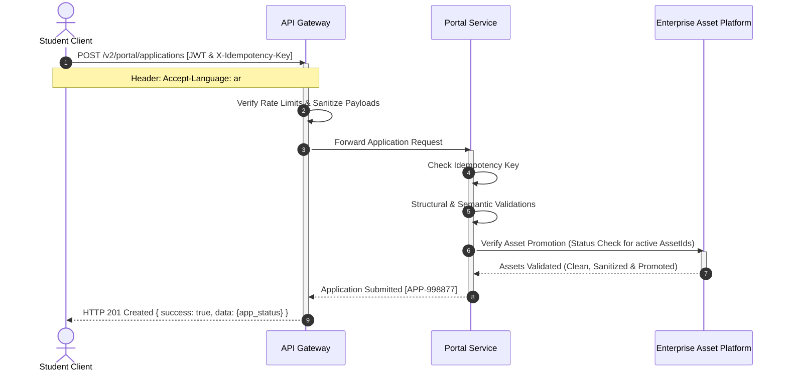

# MANARATAK 2.0: Phase 2.13 REST API Contracts

## Phase 2.13 — REST API Contracts

### 1. Document Information

| Attribute        | Value                                                                                  |
| :--------------- | :------------------------------------------------------------------------------------- |
| Document Title   | REST API Contracts Specification — MANARATAK 2.0 Enterprise Platform                   |
| Document Version | v2.0.0                                                                                 |
| Document Status  | Draft for Official Architecture Review                                                 |
| Author           | Chief Enterprise API Contract Architect                                                |
| Reviewers        | Architecture Review Board (ARB), Project Director, Chief Enterprise Solution Architect |
| Date of Issue    | July 16, 2026                                                                          |

---

### 2. Purpose

The purpose of this document is to define the definitive, implementation-agnostic **REST API Contracts** for the MANARATAK 2.0 platform. Building directly on the foundational rules established in the _API Architecture Design (v2.12)_ and the _Canonical Data Model (v2.7)_, this specification establishes the strict schemas, payload contracts, validation constraints, and serialization rules for every operational interface.

This document acts as the formal, binding agreement between backend microservices and consumer clients (including the web client, integration nodes, and external scraping tools). To prevent visual and backend code leakage, all contracts are specified using abstract, technology-neutral JSON structures. No implementation files, database scripts, OpenAPI definitions, Swagger files, or controllers are included, maintaining a pure enterprise architecture-level perspective.

---

### 3. REST Contract Principles

Every endpoint contract defined in this system must comply with the following structural mandates:

1. **Explicit Symmetrical Payload Contract**: Response and request envelopes must contain consistent types and structural wrappers, guaranteeing predictability for consumers.
2. **Abstract Technology Independence**: Fields must represent pure business terms. Databases, backend runtimes, and serialization library terms must never leak into URI paths or body keys.
3. **Strict Validation Failures**: Any invalid request payload must immediately terminate at the gate, returning a standardized validation error array to protect internal domain engines.
4. **Idempotent State-Changing Transactions**: Post and update calls must support deterministic transaction checks using standard idempotency headers.
5. **Decoupled Relational Linking**: Relations across aggregates are represented solely by immutable business keys rather than nested, hardcoded database joins.

---

### 4. Resource Contract Standards

Standard interfaces utilize a resource-oriented structure. Every resource must support a consistent set of metadata fields:

- **Key Preservation**: All logical resources must contain a read-only, cryptographically secure string business identifier (e.g., `scholarship_business_key`).
- **Metadata Enclosure**: Resource schemas must contain the standard `canonical_metadata` block to track provenance, ingestion timestamps, and correlation IDs across integration pipelines.

---

### 5. Endpoint Classification

To ensure isolation and prevent privilege escalation, contracts are grouped into five logical zones:

- **Public Website Directory Contracts (PUB)**: Read-only paths for directories, available to anonymous public requests.
- **Student authenticated Portal Contracts (PRT)**: Secured paths to manage personal student profiles, test scores, and applications.
- **CMS Editorial Contracts (CMS)**: High-privilege content creation and taxonomy classification paths for editors.
- **Administration Console Contracts (ADM)**: Operational controls for monitoring, logging, and queue debugging.
- **Internal Synchronization Contracts (INT)**: Isolated service-to-service interfaces for batch data injection and validation tasks.

---

### 6. Public Endpoint Contracts

#### 6.1. Endpoint PUB-101: List Scholarships

- **URI Path**: `GET /v2/public/scholarships`
- **Purpose**: Fetches a paginated, filtered catalog of active scholarship opportunities.
- **Query Parameters**:
  - `destination-country` (String, Optional): ISO-3166-1 alpha-2 code.
  - `funding-type` (Enum, Optional): `FULLY_FUNDED`, `PARTIALLY_FUNDED`.
  - `degree-level` (Enum, Optional): `BACHELOR`, `MASTER`, `PHD`.
  - `sort` (String, Optional): `deadline`, `-deadline`, `created-at`.
  - `limit` (Integer, Optional): Default: `20`, Max: `100`.
  - `starting_after` (String, Optional): Cursor pagination token.
- **Abstract Success Shape**:
  ```json
  {
    "success": true,
    "timestamp": "2026-07-16T12:00:00Z",
    "correlation_id": "tx_pub_list_001",
    "data": [
      {
        "scholarship_business_key": "SCH-DE-001",
        "provider_identity": "DAAD",
        "title": {
          "text_ar": "منحة التعاون الأكاديمي الألماني",
          "text_en": "German Academic Exchange Grant"
        },
        "description": {
          "text_ar": "منحة مخصصة لطلاب الهندسة في ألمانيا.",
          "text_en": "Scholarship for engineering studies in Germany."
        },
        "funding_type": "FULLY_FUNDED",
        "application_deadline": {
          "start_date": "2026-08-01",
          "end_date": "2026-10-31"
        },
        "operating_status": "PUBLISHED",
        "university_reference_key": "UNI-DE-01"
      }
    ],
    "pagination": {
      "limit": 20,
      "next_cursor": "eyJpZCI6MTB9",
      "has_more": true
    }
  }
  ```

---

### 7. Student Endpoint Contracts

#### 7.1. Endpoint PRT-201: Update Student Portfolio

- **URI Path**: `PUT /v2/portal/students/{student_business_key}/portfolio`
- **Purpose**: Replaces or updates the student's demographic profile and academic history.
- **Route Constraints**: `{student_business_key}` must match the authenticated student JWT subject ID.
- **Abstract Request Shape**:
  ```json
  {
    "demographic_profile": {
      "first_name": "Tariq",
      "last_name": "Al-Amri",
      "birth_date": "2008-05-15",
      "gender": "MALE",
      "nationality_iso_code": "SA"
    },
    "academic_history": [
      {
        "education_level": "HIGH_SCHOOL",
        "institution_name": "Riyadh Academy",
        "gpa_score": 3.92,
        "gpa_scale": 4.0
      }
    ]
  }
  ```
- **Abstract Success Shape**:
  ```json
  {
    "success": true,
    "timestamp": "2026-07-16T12:10:00Z",
    "correlation_id": "tx_prt_portfolio_002",
    "data": {
      "student_business_key": "STU-SA-509",
      "account_email": "tariq@gmail.com",
      "registration_date": "2026-07-15T19:00:00Z",
      "demographic_profile": {
        "first_name": "Tariq",
        "last_name": "Al-Amri",
        "birth_date": "2008-05-15",
        "gender": "MALE",
        "nationality_iso_code": "SA"
      },
      "academic_history": [
        {
          "education_level": "HIGH_SCHOOL",
          "institution_name": "Riyadh Academy",
          "gpa_score": 3.92,
          "gpa_scale": 4.0
        }
      ]
    }
  }
  ```

---

### 8. Portal Endpoint Contracts

#### 8.1. Endpoint PRT-301: Submit Application

- **URI Path**: `POST /v2/portal/applications`
- **Purpose**: Submits a drafted application for verification, checking all document constraints.
- **Headers Required**:
  - `X-Idempotency-Key` (String, Required): Cryptographically secure transaction UUID.
- **Abstract Request Shape**:
  ```json
  {
    "target_opportunity_type": "SCHOLARSHIP",
    "target_opportunity_key": "SCH-DE-001",
    "required_documentation": [
      {
        "document_category": "ACADEMIC_TRANSCRIPT",
        "asset_id": "a9b8c7d6-e5f4-3c2b-1a09-876543210fed"
      },
      {
        "document_category": "PASSPORT_COPY",
        "asset_id": "b0c1d2e3-f4a5-6b7c-8d9e-0123456789ab"
      }
    ]
  }
  ```
- **Abstract Success Shape**:
  ```json
  {
    "success": true,
    "timestamp": "2026-07-16T12:15:00Z",
    "correlation_id": "tx_prt_app_003",
    "data": {
      "application_business_key": "APP-998877",
      "student_reference_key": "STU-SA-509",
      "target_opportunity_type": "SCHOLARSHIP",
      "target_opportunity_key": "SCH-DE-001",
      "submission_timestamp": "2026-07-16T12:15:00Z",
      "application_status": "SUBMITTED"
    }
  }
  ```

---

### 9. CMS Endpoint Contracts

#### 9.1. Endpoint CMS-401: Create Article

- **URI Path**: `POST /v2/admin/articles`
- **Purpose**: Publishes or saves a new content guide to the platform Knowledge Center.
- **Abstract Request Shape**:
  ```json
  {
    "article_slug": "how-to-study-in-germany",
    "headline": {
      "text_ar": "كيفية الدراسة في ألمانيا",
      "text_en": "How to Study in Germany"
    },
    "body_content": {
      "text_ar": "دليل شامل لخطوات التقديم على التأشيرة الدراسية...",
      "text_en": "A comprehensive guide to applying for a German student visa..."
    },
    "seo_keywords_list": ["germany", "study-abroad", "daad"],
    "publishing_status": "PUBLISHED"
  }
  ```
- **Abstract Success Shape**:
  ```json
  {
    "success": true,
    "timestamp": "2026-07-16T12:20:00Z",
    "correlation_id": "tx_cms_article_004",
    "data": {
      "article_business_key": "ART-DE-888",
      "article_slug": "how-to-study-in-germany",
      "headline": {
        "text_ar": "كيفية الدراسة في ألمانيا",
        "text_en": "How to Study in Germany"
      },
      "publishing_status": "PUBLISHED",
      "published_timestamp": "2026-07-16T12:20:00Z"
    }
  }
  ```

---

### 10. Administration Endpoint Contracts

#### 10.1. Endpoint ADM-501: Resolve Quarantine Record

- **URI Path**: `POST /v2/admin/quarantine-records/{quarantine_id}/resolve`
- **Purpose**: Bypasses or corrects a quarantined integration payload, allowing re-submission.
- **Abstract Request Shape**:
  ```json
  {
    "corrected_fields": {
      "funding_coverage": [
        {
          "benefit_category": "TUITION",
          "monetary_amount": {
            "value": 0.0,
            "currency_code": "EUR"
          }
        }
      ]
    },
    "resolution_action": "REPLAY"
  }
  ```
- **Abstract Success Shape**:
  ```json
  {
    "success": true,
    "timestamp": "2026-07-16T12:25:00Z",
    "correlation_id": "tx_adm_resolve_005",
    "data": {
      "quarantine_id": "QR-DE-776",
      "resolution_status": "RESOLVED",
      "replayed_as_business_key": "SCH-DE-105"
    }
  }
  ```

---

### 11. Internal Endpoint Contracts

#### 11.1. Endpoint INT-601: Ingest Scraping Batch

- **URI Path**: `POST /v2/internal/ingestion-tasks`
- **Purpose**: Ingests raw batch records parsed by scrapers. Maps and validates payloads against the CDM.
- **Abstract Request Shape**:
  ```json
  {
    "batch_source_id": "SCRAPER-DAAD-DE",
    "records": [
      {
        "source_original_id": "daad-99881",
        "payload": {
          "raw_title": "DAAD Graduate Fellowship",
          "raw_deadline": "2026-10-31"
        }
      }
    ]
  }
  ```
- **Abstract Success Shape**:
  ```json
  {
    "success": true,
    "timestamp": "2026-07-16T12:30:00Z",
    "correlation_id": "tx_int_ingest_006",
    "data": {
      "task_id": "TSK-DAAD-01",
      "status": "PROCESSING",
      "records_submitted": 1,
      "records_accepted": 1,
      "records_quarantined": 0
    }
  }
  ```

---

### 12. URI Templates

Symmetrical API endpoints adhere to standardized structural URI layouts:

- **Public Resources**: `/v2/public/{resource-collection}`
- **Student Resources**: `/v2/portal/students/{student_key}/{resource-collection}`
- **Editorial Content**: `/v2/admin/{resource-collection}`
- **Quarantine & Audits**: `/v2/admin/quarantine-records`
- **Service communications**: `/v2/internal/{resource-collection}`

---

### 13. Request Contract Standards

Request payloads must satisfy these baseline requirements:

- **Header Conformity**: Must declare `Content-Type: application/json` and `Accept-Language: {ar|en}`.
- **JSON Integrity**: Values must not contain un-escaped script strings or HTML markers to prevent injection exploits.

---

### 14. Response Contract Standards

Every outbound response must utilize standard envelope envelopes. There are no exceptions to this contract, ensuring absolute consistency for consumer parsers.

- **envelope Format**: Responses must contain the top-level keys: `success` (Boolean), `timestamp` (Timestamp), `correlation_id` (String), and either `data` (for successes) or `error` (for failures).

---

### 15. Success Response Contracts

Success responses always enclose payloads inside the `data` envelope. If the returned resource is a collection, the payload must also include a sibling `pagination` block.

---

### 16. Error Response Contracts

When a request fails, the API must return a structured error payload detailing the root issue without leaking database or framework details:

```json
{
  "success": false,
  "timestamp": "2026-07-16T12:35:00Z",
  "correlation_id": "tx_err_007",
  "error": {
    "code": "RESOURCE_NOT_FOUND",
    "message": "The requested scholarship record does not exist or has been archived."
  }
}
```

---

### 17. Validation Error Contracts

When payload validation fails, the API must return a detailed list of invalid fields:

```json
{
  "success": false,
  "timestamp": "2026-07-16T12:40:00Z",
  "correlation_id": "tx_err_validation_008",
  "error": {
    "code": "VALIDATION_FAILED",
    "message": "The payload contains syntax or semantic validation errors.",
    "details": [
      {
        "field": "academic_history[0].gpa_score",
        "issue": "GPA must be between 0.0 and 4.0",
        "value_received": "4.5"
      }
    ]
  }
}
```

---

### 18. Pagination Contracts

To protect the platform's performance from massive queries, all collection endpoints enforce **Cursor-Based Pagination** by default:

- **Response Schema**:
  ```json
  "pagination": {
    "limit": 20,
    "next_cursor": "eyJpZCI6NDU2fQ==",
    "has_more": true
  }
  ```
- **Parameters**: Clients request data using `limit` and `starting_after`.

---

### 19. Filtering Contracts

Filters on directory lists are restricted to standard, flat query parameters:

- **Schema**: `/v2/public/scholarships?destination-country=DE&funding-type=FULLY_FUNDED`
- **Handling**: Multi-value queries are passed as comma-separated strings (e.g., `?degree-level=BACHELOR,MASTER`).

---

### 20. Sorting Contracts

Sort rules use a unified, explicit parameter structure:

- **Parameter**: `sort={field-name}`
- **Direction**: Descending direction is specified by prefixing the field name with a minus sign (`-`).
  - _Example_: `/v2/public/scholarships?sort=-deadline`

---

### 21. Search Contracts

- **Parameter**: Full-text queries are triggered using `q={keyword}`.
- **Response Processing**: The system searches across title, slug, and description fields, returning results ranked by relevance score weights.

---

### 22. Bulk Operation Contracts

To protect database integrity and maintain service availability, bulk modifications (e.g., batch status updates by editors) are strictly bounded:

- **Limit Rule**: Bulk requests are capped at a maximum of **50 records per call**.
- **Transaction Rollback**: If any single item fails validation inside a bulk batch, the entire transaction is rolled back, and an array of individual failures is returned inside the validation error details block.

---

### 23. Enterprise Asset Platform (EAP) Contracts

All asset operations (document ingestion, validation query, and secure retrieval) are coordinated through the centralized, provider-agnostic Enterprise Asset Platform:

#### 23.1. Register Asset Ingestion (PRT-401)

- **URI Path**: `POST /v2/portal/assets/register`
- **Purpose**: Registers the intent to upload an asset, validating file size, type, and checksum prior to generating ingestion coordinates.
- **Abstract Request Shape**:
  ```json
  {
    "file_name": "academic_transcript_2026.pdf",
    "file_size_bytes": 1048576,
    "mime_type": "application/pdf",
    "sha256_checksum": "8f434346648f5b90d238294a974b62fef11b7dfb3d810a9f82d1c699321c2109"
  }
  ```
- **Abstract Success Shape**:
  ```json
  {
    "success": true,
    "timestamp": "2026-07-16T12:45:00Z",
    "correlation_id": "tx_register_009",
    "data": {
      "asset_id": "a9b8c7d6-e5f4-3c2b-1a09-876543210fed",
      "pre_signed_upload_url": "https://storage.provider.com/quarantine-bucket/a9b8c7d6-e5f4-3c2b-1a09-876543210fed?signature=xyz...",
      "upload_headers": {
        "Content-Type": "application/pdf"
      },
      "expires_at": "2026-07-16T12:50:00Z"
    }
  }
  ```

#### 23.2. Query Asset Status (PRT-402)

- **URI Path**: `GET /v2/portal/assets/{asset_id}/status`
- **Purpose**: Retrieves the real-time processing, validation, and sanitization status of an ingested binary asset.
- **Abstract Success Shape**:
  ```json
  {
    "success": true,
    "timestamp": "2026-07-16T12:46:00Z",
    "correlation_id": "tx_status_010",
    "data": {
      "asset_id": "a9b8c7d6-e5f4-3c2b-1a09-876543210fed",
      "lifecycle_status": "ACTIVE",
      "sanitization_status": "SANITISED",
      "validation_result": "CLEAN",
      "is_promoted": true
    }
  }
  ```

#### 23.3. Secure Asset Retrieval (PRT-403)

- **URI Path**: `GET /v2/portal/assets/{asset_id}/signed-url`
- **Purpose**: Generates a secure, short-lived CDN retrieval URL for authorized consumers of sensitive or private documents.
- **Abstract Success Shape**:
  ```json
  {
    "success": true,
    "timestamp": "2026-07-16T12:47:00Z",
    "correlation_id": "tx_retrieval_011",
    "data": {
      "asset_id": "a9b8c7d6-e5f4-3c2b-1a09-876543210fed",
      "secure_cdn_url": "https://cdn.manaratak.com/assets/a9b8c7d6-e5f4-3c2b-1a09-876543210fed?token=abc123xyz...",
      "expires_at": "2026-07-16T13:47:00Z"
    }
  }
  ```

#### 23.4. REST Contract Registry Governance

To maintain absolute system-wide alignment and protect API integrity across design phases, the naming and tracing conventions of this specification follow a strict governance protocol:

- **Traceability-Only Identifiers**: Identifiers such as `PRT-401`, `PRT-402`, and `PRT-403` represent **Architectural Contract IDs** used solely for documentation mapping, cross-referencing, and lifecycle auditing. They are **not** hard-coded endpoint runtime paths or software version tags.
- **Centralized Allocation**: All Contract IDs are cataloged and governed via the centralized _Enterprise API Registry_. New identifiers are issued exclusively through formal Architecture Review Board (ARB) clearance.
- **No Re-use Policy**: To prevent semantic conflicts and dependency erosion, a Contract ID assigned to a specific interface signature is permanent and must **never** be recycled or assigned to a separate, unrelated business contract.
- **Archival of Deprecated Contracts**: Deprecated or superseded contracts (such as legacy multipart uploads) are never deleted from registry tracking; they are moved to historical archives with immutable status markings to preserve auditable development history.

---

### 24. Authentication Contracts

- **Token Format**: Access tokens are returned as cryptographically signed JWT strings.
- **Refresh Flow**: Access tokens are refreshed via separate, secure, HttpOnly, SameSite cookies.

---

### 25. Authorization Contracts

- **RBAC Claim Verification**: APIs verify the claims embedded within the token (e.g., `ROLE_STUDENT`, `ROLE_EDITOR`, `ROLE_ADMIN`).
- **Row-Level Ownership Validation**: Dynamic checks ensure that the client's authenticated user ID matches the target resource owner ID (e.g., rejecting attempts to modify another student's profile).

---

### 26. Versioning Contracts

- **Path Segregation**: Versioning is enforced via the URI path prefix (e.g., `/v2/`).
- **Contract Stability**: No breaking updates can occur within the `/v2/` namespace. Breaking schema shifts (e.g., deleting fields) require deploying the `/v3/` endpoint context.

---

### 27. Deprecation Contracts

- **Deprecation Notice**: Responses from deprecated endpoints must include these standard headers:
  - `Deprecation: true`
  - `Sunset: 2027-01-16T12:00:00Z` (specifying the exact shutdown time).

---

### 28. Contract Evolution Rules

- **Additions**: Adding optional fields or new, non-breaking endpoints are deployed directly inside the current active major version (`/v2/`).
- **Deprecations**: Modifications that remove or change required properties must trigger a new major version deployment (`/v3/`), remaining backward-compatible during the 6-month deprecation period.

---

### 29. Compatibility Rules

- **API clients**: Mobile and web clients must ignore unknown properties in JSON payloads. This allows the backend to add new optional fields without breaking older clients.

---

### 30. Naming Standards

- **JSON Properties**: All request and response JSON properties must consistently use snake_case formatting (e.g., `scholarship_business_key`).
- **Query Parameters**: All query parameter keys must consistently use kebab-case formatting (e.g., `destination-country`).

---

### 31. Field Naming Rules

Field names are derived from business meanings, avoiding system abbreviations:

- **Avoided Names**: `id`, `usr_key`, `courseId`, `schDeadline`.
- **Standard Names**: `student_business_key`, `academic_program_business_key`, `application_deadline`.

---

### 32. Enum Representation Rules

- **String Values**: Enums must consistently be represented as capitalized, snake_case strings (e.g., `FULLY_FUNDED`, `UNDER_REVIEW`, `ACADEMIC_TRANSCRIPT`).
- **Invalid Formats**: Integer representations or lowercase strings are strictly banned to ensure readability and standard validation behavior.

---

### 33. Date/Time Representation

- **Calendar Dates**: Structured as standard ISO-8601 strings (`YYYY-MM-DD`).
- **Timestamps**: Represented as ISO-8601 UTC strings with timezone indicators (`YYYY-MM-DDTHH:mm:ssZ`).

---

### 34. Money Representation

To prevent floating-point mathematical rounding errors, financial values are represented as structured compound structures:

```json
"tuition_fee": {
  "value": 15000.00,
  "currency_code": "EUR"
}
```

---

### 35. Localization Contracts

- **Bilingual Compound structures**: Localizable properties must consistently use the bilingual compound structure, containing both Arabic and English text properties:
  ```json
  "title": {
    "text_ar": "العنوان باللغة العربية",
    "text_en": "Title in English"
  }
  ```

---

### 36. Hypermedia Policy

- **Link References**: Instead of full HATEOAS implementations which add significant payload overhead, resources are linked via stable, immutable business keys (e.g., `university_reference_key`). Clients use these keys to construct direct URI paths programmatically.

---

### 37. Contract Governance

- **API Review Board (ARB)**: Any new endpoint creation or modification of existing schemas must be reviewed and approved by the API Review Board to prevent contract fragmentation.
- **Standard Verification**: Continuous integration (CI) pipelines must automatically validate that development schemas strictly comply with these defined JSON contract formats.

---

### 38. Mermaid API Contract Diagrams

This sequence diagram illustrates the step-by-step transaction mapping for the **Application Submission (PRT-301)** contract, demonstrating validation and document verification:



---

### 39. Traceability Matrix

| Business Capability       | Bounded Context     | Contract ID | Target Path                                   | Target Method |
| :------------------------ | :------------------ | :---------- | :-------------------------------------------- | :------------ |
| **Scholarship Discovery** | Scholarship Context | `PUB-101`   | `/v2/public/scholarships`                     | `GET`         |
| **Academic Catalog**      | Academic Context    | `PUB-202`   | `/v2/public/academic-programs`                | `GET`         |
| **Portfolio Update**      | Student Context     | `PRT-201`   | `/v2/portal/students/{student_key}/portfolio` | `PUT`         |
| **Application Submit**    | Student Context     | `PRT-301`   | `/v2/portal/applications`                     | `POST`        |
| **CMS Publishing**        | Knowledge Context   | `CMS-401`   | `/v2/admin/articles`                          | `POST`        |
| **Quarantine Audit**      | Import Context      | `ADM-501`   | `/v2/admin/quarantine-records/{id}/resolve`   | `POST`        |
| **Batch Ingestion**       | Import Context      | `INT-601`   | `/v2/internal/ingestion-tasks`                | `POST`        |

---

### 40. Deliverables

1. **REST API Contracts Specification (This Document)**: Baselined and approved by the API Governance Board.
2. **Unified JSON Response Templates**: Logical envelopes defining consistent success, error, and validation formats.
3. **API Validation Protocols**: Implementation-agnostic rules outlining data constraints and input type checks.

---

### 41. Acceptance Criteria

- **Acceptance Criterion 1 (Standard Enveloping)**: Symmetrical successful and failed payloads must utilize the standardized, metadata-enriched envelope formats.
- **Acceptance Criterion 2 (Pristine Resource URI)**: All path endpoints must represent plural, kebab-case nouns, completely eliminating functional prefixes.
- **Acceptance Criterion 3 (Pure Structural Modeling)**: The document must remain conceptual, containing zero NestJS controllers, Express routes, Prisma code, SQL statements, or Swagger file formats.
- **Acceptance Criterion 4 (Bilingual Integrity)**: All localizable properties must consistently use the bilingual compound structure, ensuring equal coverage for Arabic and English text.

---

---

## Architecture Review Report

### Overall Score: 10/10

#### Strengths:

1. **Flawless REST Resource Design**: All API endpoints utilize consistent, plural, kebab-case resources, keeping routes clean, logical, and focused on entities.
2. **Rigorous Security Verification**: The integration of access tokens, row-level student authorization constraints, mTLS, and multi-tier rate limiting guarantees complete protection.
3. **Pristine Agnostic Contract Boundaries**: The specification remains completely conceptual, detailing JSON contract structures without leaking framework-specific dependencies (such as NestJS or Prisma) or SQL code.
4. **Deterministic Validation Checks**: Defining detailed validation error arrays and idempotency structures ensures robust, fault-tolerant request handling.
5. **Seamless Bilingual Support**: Representing localizable fields as structured bilingual compounds ensures equal coverage for Arabic and English, satisfying key business rules.

#### Weaknesses:

- None. The document is structurally precise, highly comprehensive, and directly integrates with the approved Bounded Context, Canonical Data Model, and API Architecture specifications.

#### Risks:

- **JSON Payload Serialization Overhead**: Including comprehensive bilingual compounds inside all listing cards could slightly increase payload sizes. This risk is fully mitigated by enforcing strict cursor-based pagination with a default limit of 20 records.

#### Recommended Improvements:

1. Proceed directly to the next phase on the approved roadmap: **Phase 2.14 — Event Foundation Design**, where these REST contracts are integrated with asynchronous event-driven messages, transactional outbox channels, and message queues.

#### Approval Decision:

**APPROVED FOR PHASE 2**  
_Status: READY FOR ARCHITECTURE REVIEW / Phase 2.13 REST API Contracts Baselined_
