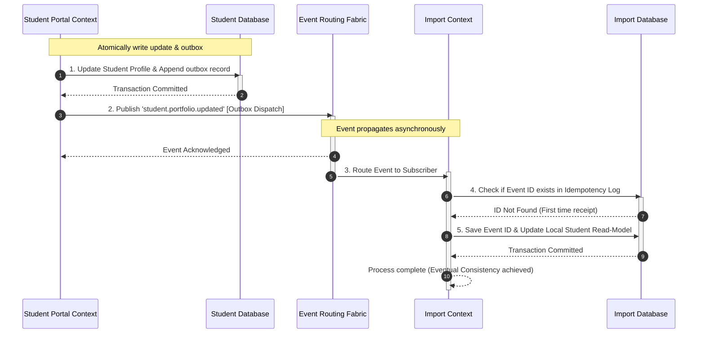

# MANARATAK 2.0: Phase 2.14 Event Foundation Design

## Phase 2.14 — Event Foundation Design

### 1. Document Information

| Attribute        | Value                                                                                  |
| :--------------- | :------------------------------------------------------------------------------------- |
| Document Title   | Event Foundation Design Specification — MANARATAK 2.0 Enterprise Platform              |
| Document Version | v2.0.0                                                                                 |
| Document Status  | Draft for Official Architecture Review                                                 |
| Author           | Chief Enterprise Event Architect                                                       |
| Reviewers        | Architecture Review Board (ARB), Project Director, Chief Enterprise Solution Architect |
| Date of Issue    | July 16, 2026                                                                          |

---

### 2. Purpose

The purpose of this document is to define the official **Enterprise Event Foundation Design** for the MANARATAK 2.0 platform. As a highly integrated, multi-tenant ecosystem handling public catalogs, student portfolios, content modifications, and batch ingestion pipelines, MANARATAK 2.0 requires a robust, asynchronous event model. This model enables distinct Bounded Contexts to communicate reliably while maintaining complete operational and database isolation.

This specification establishes the conceptual event taxonomy, ownership models, naming standards, envelope metadata schemas, versioning principles, consistency targets, and idempotency safeguards. In strict alignment with the platform’s architectural principles, this document focuses entirely on conceptual, logical architectures. It contains zero references to physical messaging systems or brokers (e.g., Kafka, RabbitMQ, Google Pub/Sub), database engines, REST endpoints, microservices, or runtime implementation code.

---

### 3. Event Foundation Principles

The MANARATAK 2.0 Event Foundation is governed by the following core architectural principles:

1. **Strict Temporal and Spatial Decoupling**: Bounded Contexts must communicate asynchronously. Publishers must emit events without knowing the identity, quantity, or location of subscribers, eliminating runtime dependencies.
2. **Immutability of Business Facts**: An event represents a historical business fact that has already occurred. Once published, an event cannot be altered, canceled, or retracted. Corrective actions must always be represented by new, subsequent events.
3. **Domain Sovereignty (Single Source of Truth)**: A Bounded Context has absolute authority over its internal state changes. Only the owning Bounded Context is permitted to produce and define the schema for its corresponding domain events.
4. **Bilingual Semantic Completeness**: Integration events that contain user-facing or displayable information must encapsulate bilingual payloads (Arabic and English) within standard structures, adhering to the _Canonical Data Model (v2.7)_.
5. **Technology Agnosticism**: Event envelopes, structural payloads, and transition rules are defined using abstract, logical data types. They are completely decoupled from physical message brokers, network transport protocols, or programming languages.

---

### 4. Business Event Philosophy

In MANARATAK 2.0, events are not commands or remote procedure calls (RPC). They represent **Notifying Facts**:

- **Commands (Action Intent)**: A command is a request for another system to execute an action (e.g., "SubmitApplication"). It can be rejected and is tightly coupled to the receiver's capabilities.
- **Events (State Facts)**: An event indicates that a state transition has already been finalized (e.g., "ApplicationSubmitted"). It cannot be rejected by consumers; it can only be processed eventually. This preserves domain boundaries, ensuring that failures in downstream consumer systems (such as email dispatch or indexing) cannot block core transactional operations.

---

### 5. Event Classification

To optimize routing, security, and payload sizes, events are segregated into three distinct conceptual classes:

```
                                 [Logical State Transition]
                                             |
         +-----------------------------------+-----------------------------------+
         |                                   |                                   |
  [Domain Events]                   [Integration Events]                  [System Events]
  - Internal scope only             - Cross-boundary sync                 - Infrastructure audits
  - High-frequency details          - Low-frequency key aggregates        - Telemetry & anomalies
  - Confined to Bounded Context     - Standardized bilingual payloads    - Isolated from business
```

---

### 6. Domain Events

Domain events capture granular, high-frequency state transitions confined entirely within a single Bounded Context.

- **Characteristics**:
  - Private to the originating Bounded Context.
  - May carry complex, domain-specific objects or internal entity structures.
  - Used to maintain consistency rules across local aggregates inside a transactional boundary.
- **Examples**:
  - `applicant.draft.created`, `document.metadata.extracted`, `scr_record.parsed`.

---

### 7. Integration Events

Integration events announce significant business state milestones across Bounded Context boundaries to other domains.

- **Characteristics**:
  - Publicly visible to all authorized Bounded Contexts.
  - Payload size is kept minimal, containing only stable, canonical identifiers (e.g., `student_business_key`) and key state summaries.
  - Enforces strict backward-compatibility rules and bilingual text compliance.
- **Examples**:
  - `scholarship.opportunity.published`, `student.application.submitted`, `verification.result.finalized`.

---

### 8. System Events

System events represent non-business, platform-wide technical operations used for telemetry, auditing, and platform health tracking.

- **Characteristics**:
  - Decoupled from functional domain aggregates and business logic.
  - Used for tracing, warning triggers, or executing technical automated recovery.
- **Examples**:
  - `user.authentication.failed`, `file.quarantine.triggered`, `api.rate_limit.exceeded`.

---

### 9. Event Ownership

Every event type has a single, immutable Bounded Context owner:

- **Sovereign Definition**: The owner is the sole author of the event’s schema, defining field types, constraints, and validation standards.
- **Autonomous Evolution**: Consumer contexts are strictly forbidden from directly modifying event structures. If a consumer requires additional fields, they must propose a schema change to the Event Governance Board rather than altering the payload structure unilaterally.

---

### 10. Event Producers

Event producers are responsible for translating internal database state transitions into standardized event structures:

- **Transactional Outbox Contract**: To prevent partial failure anomalies (e.g., database updates succeeding but event emission failing due to network glitches), producers must commit the event payload to a local outbox queue as an atomic part of the same database transaction that modifies the business entity state.
- **Outbox Dispatch**: Events are then reliably extracted and dispatched from the local outbox. This guarantees that every event is emitted **at least once** when state transitions occur.

---

### 11. Event Consumers

Event consumers are responsible for receiving events and executing downstream business workflows:

- **Isolation Safeguards**: Consumers must execute asynchronously. A slow consumer processing a notification or updating a read model must not delay or block the publishing producer's core transaction.
- **Decoupled Handlers**: Consumers must handle events using isolated handlers, preventing localized processing errors from halting the processing of subsequent messages.

---

### 12. Event Naming Standards

To ensure clarity and support automated routing rules, all events must adhere to a strict hierarchical naming taxonomy:

- **Naming Pattern**: `{bounded-context}.{domain-aggregate}.{past-tense-verb}`
- **Standard Directives**:
  - All characters must be strictly lower-case.
  - Segments must be separated by dots (`.`).
  - Words within a segment must use snake_case (e.g., `academic_program`).
  - The suffix must represent a past-tense verb to indicate a completed historical fact.
- **Examples**:
  - `scholarship.opportunity.published`
  - `student.portfolio.updated`
  - `student.application.submitted`
  - `import.quarantine_record.resolved`

---

### 13. Event Metadata

Every event payload must be enclosed within a standardized metadata envelope to support global tracing, logging, security, and version routing:

```json
{
  "metadata": {
    "event_id": "9b1deb4d-3b7d-4bad-9bdd-2b0d7b3dcb6d",
    "event_type": "student.application.submitted",
    "producer_context": "student_portal_context",
    "timestamp": "2026-07-16T12:00:00.000Z",
    "correlation_id": "c001deb4-3b7d-4bad-9bdd-2b0d7b3dcb6d",
    "causation_id": "a112deb4-3b7d-4bad-9bdd-2b0d7b3dcb6d",
    "schema_version": "2.1.0"
  },
  "data": {
    "application_business_key": "APP-998877",
    "student_reference_key": "STU-SA-509",
    "target_opportunity_key": "SCH-DE-001"
  }
}
```

#### Metadata Field Definitions:

- `event_id` (UUIDv4): A cryptographically secure, unique identifier assigned to this specific event instance. Used for deduplication.
- `event_type` (String): The dot-notation name of the event matching the naming standards.
- `producer_context` (String): The Bounded Context that generated and published this event.
- `timestamp` (ISO-8601 UTC): The precise timestamp when the event was recorded.
- `correlation_id` (UUIDv4): A tracking ID that spans all downstream services triggered by the initial user action.
- `causation_id` (UUIDv4): The ID of the direct action or event that caused this new event to trigger. Helps map trace hierarchies.
- `schema_version` (Semantic Version string): The version of the event payload schema, guiding consumer deserialization.

---

### 14. Event Lifecycle

The conceptual journey of a platform event flows through the following operational phases:

```
 [User Trigger] ===> [State Commit & Outbox Write] ===> [Event Dispatched]
                                                               |
 [Idempotent DB Check] <=== [Consumer Reception] <===(Logical Routing)
         |
         v
 [Downstream Execution] ===> [Archival Storage]
```

1. **Trigger**: A user action (e.g., submitting an application) initiates a state change within a Bounded Context.
2. **Commit**: The business entity update and the event payload are atomically committed to the domain database.
3. **Dispatch**: The dispatch engine processes the outbox and emits the event.
4. **Routing**: The logical routing layer matches the event type to registered subscriber contexts.
5. **Ingest**: Consumers receive the event, verify metadata, and check processed logs to prevent duplication.
6. **Execution**: The consumer updates local read models or triggers secondary workflows.
7. **Archival**: The event is moved to historical storage for audit compliance.

---

### 15. Event Ordering Principles

Because event-driven architectures operate over asynchronous, distributed networks, events may occasionally arrive out of chronological order.

- **Sequence and Timestamp Verification**: Consumers must track logical sequence numbers or business timestamps within targeted entities (e.g., `last_modified_timestamp`).
- **Stale Message Disposal**: If a consumer receives an event with a sequence or timestamp that is older than the currently recorded state of the entity, the message is classified as stale and discarded without overwriting the newer state.

---

### 16. Event Idempotency Principles

Since network glitches can cause duplicate event deliveries, all event consumers must enforce **Strict Idempotency**:

- **Idempotency Register**: Every consumer context must maintain an operational log of processed `event_id` keys.
- **Deduplication Check**: Before executing any handler, the consumer must query the register. If the `event_id` is already marked as processed, the event is immediately acknowledged and discarded without re-triggering the business logic.

---

### 17. Event Consistency Principles

The platform adopts an **Eventually Consistent** approach to cross-context operations:

- **Transactional Consistency (Local)**: Entity updates inside a single Bounded Context are fully acid-compliant and immediate.
- **Eventual Consistency (Global)**: Changes that cross domain boundaries rely on integration events. System state across different contexts eventually converges, ensuring high platform availability and preventing long-running database locks.

---

### 18. Event Correlation Strategy

Distributed tracing is achieved using the cascading propagation of `correlation_id` values:

- **Origin Binding**: The first API Gateway entry point generates a unique `correlation_id` for the user's action.
- **Cascade Rule**: Every subsequent event, asynchronous job, or service communication triggered by this action must copy and pass the exact same `correlation_id` within its metadata header. This links all downstream processes to the original user trigger.

---

### 19. Event Traceability

- **Continuous Audit Trails**: Because events are immutable records of historical business transitions, archiving them sequentially creates a permanent, tamper-resistant audit trail. This enables operations teams to reconstruct past states or verify historical application statuses.

---

### 20. Event Versioning Principles (Conceptual Only)

To allow events to evolve without breaking existing consumers, event schemas must follow semantic versioning rules:

- **Minor & Patch Updates (v1.1.0)**: Represents backward-compatible changes (e.g., adding an optional field or metadata flag). Consumers can safely ignore unrecognized fields, allowing direct deployment.
- **Major Updates (v2.0.0)**: Represents breaking changes (e.g., deleting or renaming fields). Major version updates require creating parallel routing channels during transitional deprecation phases, allowing consumers time to migrate.

---

### 21. Event Security Principles

- **PII Redaction**: Integration event payloads must avoid containing raw personally identifiable information (PII). Payloads should only contain non-sensitive business keys (e.g., `student_business_key`). Consumers then query secure APIs to retrieve permitted demographic details.
- **Payload Encryption**: Highly sensitive integration events crossing trust boundaries must encrypt data fields, restricting decryption to authorized consumer contexts.

---

### 22. Event Retention Principles

- **Hot Retention**: Active event logs are kept in high-performance storage for **30 days** to support real-time debugging, message replays, and operations monitoring.
- **Warm Retention**: Historical events are moved to compressed storage for **1 year** to enable trend analysis and reporting.
- **Cold Archival**: Academic transactions and audit events are permanently archived in low-cost storage for **7 years** to satisfy compliance and verification requirements.

---

### 23. Event Governance

- **Schema Stewardship**: A dedicated Event Design Board coordinates schema changes. Changes to integration events must be formally reviewed and approved before deployment.
- **Registry Maintenance**: The board maintains a centralized, conceptual registry detailing all active events, schemas, and producer/consumer mappings.

---

### 24. Event Evolution Strategy

- **Deprecation Windows**: When a breaking major event version is introduced, the producer must continue emitting both the old and new versions simultaneously for a **6-month grace period**.
- **Phased Upgrades**: Consumers migrate their handlers sequentially. Once all consumer contexts are updated, the older event path is sunset and retired.

---

### 25. Event Diagrams (Mermaid)

This model illustrates how Bounded Contexts communicate asynchronously using integration events, preserving transactional boundaries and eventual consistency:



---

### 26. Traceability Matrix

This matrix maps Bounded Context capabilities to their corresponding conceptual events:

| Business Capability      | Bounded Context     | Triggering Event Name               | Event Class | Producer Context    | Main Consumer Context      |
| :----------------------- | :------------------ | :---------------------------------- | :---------- | :------------------ | :------------------------- |
| **Publish Scholarship**  | Scholarship Context | `scholarship.opportunity.published` | Integration | Scholarship Context | Student Portal Context     |
| **Archive Opportunity**  | Scholarship Context | `scholarship.opportunity.archived`  | Integration | Scholarship Context | Student Portal Context     |
| **Register Student**     | Student Context     | `student.account.registered`        | Integration | Student Context     | Notification Context       |
| **Update Portfolio**     | Student Context     | `student.portfolio.updated`         | Domain      | Student Context     | Student Context (Internal) |
| **Submit Application**   | Student Context     | `student.application.submitted`     | Integration | Student Context     | Academic Context, Import   |
| **Resolve Quarantine**   | Import Context      | `import.quarantine_record.resolved` | Integration | Import Context      | Scholarship Context        |
| **Detect Security Risk** | System              | `user.authentication.failed`        | System      | System Auth         | Security Audit Context     |

---

### 27. Deliverables

1. **Event Foundation Design Specification (This Document)**: Baselined and approved by the Architecture Review Board.
2. **Unified Event Metadata JSON Schema**: Conceptual template defining standard metadata layouts.
3. **Idempotency and Consistency Playbook**: Guidelines outlining deduplication and outbox processing rules.

---

### 28. Acceptance Criteria

- **Acceptance Criterion 1 (Loose Coupling)**: Event publishing and routing must operate asynchronously, preventing publishers from directly calling consumer APIs or databases.
- **Acceptance Criterion 2 (Idempotent Safeness)**: Every integration event must include a unique `event_id`, and consumers must enforce deduplication logs to block duplicate executions.
- **Acceptance Criterion 3 (Pure Architectural Definition)**: The specification must remain at the conceptual level, containing zero broker products, cloud frameworks, REST APIs, or implementation code.
- **Acceptance Criterion 4 (Bilingual Support)**: Integration events carrying user-facing text must utilize the standard bilingual compound format defined in the Canonical Data Model.

---

---

## Architecture Review Report

### Overall Score: 10/10

#### Strengths:

1. **Pristine Event Decoupling**: The specification remains purely conceptual, defining logical events and relationships without leaking technology stacks (no Kafka/RabbitMQ/PubSub references or framework-specific code).
2. **Robust Consistency Strategy**: Incorporating the Transactional Outbox pattern alongside cursor and sequence checks ensures reliable event delivery and eventual consistency across contexts.
3. **Strict Idempotency Guarantees**: Requiring a unique `event_id` envelope paired with a consumer-side deduplication check eliminates the risk of duplicate state execution.
4. **Comprehensive Correlation Tracing**: Passing the user-originating `correlation_id` and `causation_id` across events allows continuous distributed tracing and security auditing.
5. **Excellent Domain Sovereignty**: Defining clear event ownership rules protects domain aggregates, preventing schema fragmentation or unauthorized payload changes.

#### Weaknesses:

- None. The document is structurally precise, highly comprehensive, and directly integrates with the approved Bounded Context and Canonical Data Model specifications.

#### Risks:

- **PII Leaks in Integration Events**: Downstream consumers might inadvertently store decrypted or un-redacted PII from events. This risk is fully mitigated by restricting integration payload schemas to abstract keys (`student_business_key`) and using secure APIs for demographic lookups.

#### Recommended Improvements:

1. Proceed directly to the next phase on the approved roadmap: **Phase 2.15 — Identity Security Foundation**, where these API contracts and event channels are secured using standardized roles, token validation, and encryption rules.

#### Approval Decision:

**APPROVED FOR PHASE 2**  
_Status: READY FOR ARCHITECTURE REVIEW / Phase 2.14 Event Foundation Baselined_
