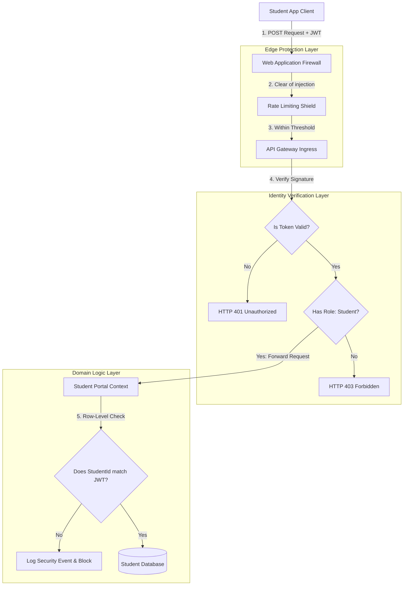
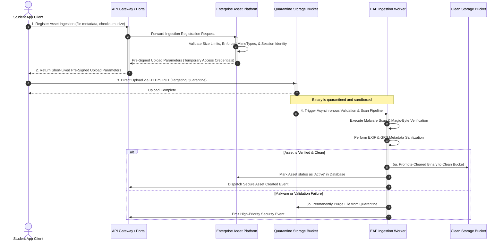

# MANARATAK 2.0: Phase 2.15 Identity Security Foundation

## Phase 2.15 — Identity & Security Foundation

### 1. Document Information

| Attribute        | Value                                                                                  |
| :--------------- | :------------------------------------------------------------------------------------- |
| Document Title   | Identity & Security Foundation Specification — MANARATAK 2.0 Enterprise Platform       |
| Document Version | v2.0.0                                                                                 |
| Document Status  | Draft for Official Architecture Review                                                 |
| Author           | Chief Enterprise Security Architect                                                    |
| Reviewers        | Architecture Review Board (ARB), Project Director, Chief Enterprise Solution Architect |
| Date of Issue    | July 16, 2026                                                                          |

---

### 2. Purpose

The purpose of this document is to define the official **Enterprise Identity & Security Foundation** for the MANARATAK 2.0 platform. As an enterprise educational and administrative portal serving diverse users across multiple countries, the platform must guarantee absolute confidentiality, integrity, availability, and non-repudiation.

This specification establishes the conceptual security architecture governing user identity lifecycles, role-based access controls (RBAC), multi-factor authentication (MFA) standards, stateless token session paradigms, sensitive data classifications, audit logging strategies, and secrets management rules. In strict alignment with our architectural constraints, this document focuses entirely on conceptual models and abstract parameters. It contains zero references to specific source codes, database schemas, ORMs, NestJS guards, OAuth library integrations, or cloud-specific deployment services.

---

### 3. Identity Architecture Principles

The identity architecture of MANARATAK 2.0 is designed from the ground up upon five non-negotiable architectural principles:

1. **Zero Trust Architecture (ZTA)**: No user, device, or system is trusted by default, regardless of whether they are inside or outside the logical network perimeter. Verification is required at every access point.
2. **Defense in Depth**: Security controls are applied across multiple concentric layers (network, gateway, application context, domain aggregate, database level). A failure in one layer must not compromise the whole platform.
3. **Least Privilege Enforcement**: Users, services, and API clients are granted only the minimum access rights necessary to complete their specific business capabilities.
4. **Decoupled Identity Lifecycle**: Identity verification and credential management are decoupled from core business Bounded Contexts. Business contexts consume validated claims rather than managing passwords or raw credentials.
5. **Symmetrical Accountability**: Every operational state change, high-value read, or administrative configuration update must be fully traceable to a verified identity.

---

### 4. Security Principles

- **Fail Securely**: If an error, validation crash, or network timeout occurs, the system must default to its most secure state (e.g., rejecting access rather than bypassing validation).
- **Separation of Duties**: Operational tasks must be divided among multiple roles to prevent single-actor compromise. For instance, content creators (Editors) write guides, but only Admins can override system integration settings.
- **Privacy by Design**: Sensitive data processing is minimized. PII is encrypted, masked, or logically siloed from standard analytical and reporting dashboards.

---

### 5. Identity Lifecycle

User identities transition through a clearly defined lifecycle governed by automated controls:

```
[PROVISIONING] ---> [VERIFICATION] ---> [ACTIVE SESSION] ---> [SUSPENDED] ---> [DEPROVISIONED]
```

1. **Provisioning (Creation)**: Accounts are registered via public pathways (Students) or provisioned securely by administrators (Editors, Admins).
2. **Verification**: Email addresses and optional national/academic credentials must be verified before account state transitions to active.
3. **Active Session**: The normal operating state. Users authenticate, receive short-lived session tokens, and execute transactions.
4. **Suspension**: Accounts are locked due to suspicious activity (e.g., brute-force attacks) or administrative actions, blocking all active sessions.
5. **Deprovisioning (Termination)**: Accounts are marked as deleted or archived, retaining only compliant metadata while purging active credentials and PII.

---

### 6. User Types

MANARATAK 2.0 defines six distinct categories of identity actors:

- **Anonymous Visitor**: Unauthenticated public users browsing the scholarship directory and Knowledge Center.
- **Registered Applicant**: Students who have verified an email but have not completed academic/demographic profiles.
- **Authenticated Student**: Active portal users who have completed registration and can draft and submit applications.
- **Content Editor/Moderator**: Enterprise staff managing content pages, classifications, and guides.
- **System Administrator**: High-privilege IT operators managing configuration files, scrapers, and operational queues.
- **API Client**: Service-to-service service accounts used for internal and external data integrations.

---

### 7. Roles Strategy

Roles are mapped to logical business capabilities rather than specific individuals. This prevents role-creep and simplifies auditing:

- **Separation from Permissions**: Roles represent logical groupings of business duties. Permissions are mapped to specific roles, never assigned directly to individual users.
- **Hierarchical Structure**: Roles are organized hierarchically to allow inheritance of base capabilities while maintaining strict separation of high-privilege commands.

---

### 8. Permission Model

The system enforces a **Policy-Based Access Control (PBAC)** model, combining standard RBAC with Attribute-Based Access Control (ABAC) rules for row-level verification:

- **Functional Access (RBAC)**: Determines whether a role can perform an action on a resource category (e.g., `ROLE_STUDENT` can perform `CREATE` on `applications`).
- **Contextual Access (ABAC)**: Evaluates dynamic variables (e.g., "Does the `student_id` in the application match the authenticated user’s ID?", or "Is the application deadline still open?").

---

### 9. RBAC Foundation

The matrix below defines the baseline role hierarchies and permissions:

| System Role         | Functional Capabilities Inherited | Access Limits                 | Target Resources                                          |
| :------------------ | :-------------------------------- | :---------------------------- | :-------------------------------------------------------- |
| **ROLE_ANONYMOUS**  | Read-only directory search        | Public content only           | Scholarship catalogs, general guides                      |
| **ROLE_APPLICANT**  | Base registration                 | Can modify draft profiles     | Student demographic records                               |
| **ROLE_STUDENT**    | Fully manage personal portal      | Row-level ownership only      | Personal drafts, document uploads, application tracks     |
| **ROLE_EDITOR**     | Content editing and curation      | No access to student data     | CMS articles, scholarship directory entries, taxonomies   |
| **ROLE_ADMIN**      | Full platform administration      | High-privilege configurations | Quarantine queues, ingestion sync tasks, user permissions |
| **ROLE_API_CLIENT** | Service integrations              | Scope-restricted tokens       | Batch import queues, scraping sync tasks                  |

---

### 10. Authentication Principles

Authentication is the process of verifying a claimed identity.

- **Federated Identity**: Primary user authentication leverages secure OpenID Connect (OIDC) or standardized passwordless authentication models.
- **Risk-Based Authentication**: The gateway monitors context parameters (e.g., geo-IP changes, rapid-successive requests). High-risk scores trigger additional authentication steps or temporary session blocks.

---

### 11. Authorization Principles

Authorization is the process of verifying permissions after successful authentication.

- **Decoupled Gateway Authorization**: The API Gateway validates tokens and checks general path permissions before routing requests.
- **Row-Level Security Enforcement**: Domain microservices perform secondary checks to confirm record-level ownership before completing database modifications.

---

### 12. Session Strategy

To prevent centralized single points of failure and support distributed cloud environments, sessions are strictly **Stateless**:

- **Server State Isolation**: Servers do not store active session data in local memory.
- **Secure Client Storage**: Session data is held securely on client devices, utilizing cryptographically signed tokens.

---

### 13. Token Strategy

Symmetrical session transactions use a dual-token paradigm to balance security and usability:

- **Access Token**:
  - _Type_: JSON Web Token (JWT).
  - _Lifetime_: Short-lived (exactly 15 minutes).
  - _Content_: Non-sensitive claims (e.g., user ID, roles, correlation tracking ID).
  - _Security_: Signed using asymmetrical cryptographic algorithms.
- **Refresh Token**:
  - _Type_: Secure Opaque String.
  - _Lifetime_: Long-lived (7 days).
  - _Storage_: Stored in secure, HttpOnly, SameSite, Encrypted cookies to protect against cross-site scripting (XSS) attacks.
  - _Rotation_: Each refresh request invalidates the old token and issues a new pair, mitigating replay attacks.

---

### 14. Password Policy

For accounts utilizing traditional passwords (e.g., administrative accounts or legacy logins), strict compliance rules are enforced:

- **Complexity Threshold**: Minimum of 12 characters, including uppercase, lowercase, numbers, and special characters.
- **Compromise Check**: Passwords must be validated against databases of known breached credentials during creation and modification.
- **Storage Standard**: Passwords must be hashed using high-work-factor hashing algorithms (e.g., Argon2id) before persistence, never stored in plaintext or basic reversible hashes.

---

### 15. MFA Foundation

Multi-Factor Authentication is an essential requirement for platform operation:

- **Mandatory Enforcement**: MFA is mandatory for all administrative (`ROLE_ADMIN`) and content editing (`ROLE_EDITOR`) accounts.
- **Permitted Factors**: Time-Based One-Time Password (TOTP) apps, hardware security keys (FIDO2/WebAuthn), or short-lived email/SMS verification pins.
- **Bypass Ban**: Administrative interfaces must strictly refuse access if MFA verification is incomplete or disabled.

---

### 16. Account Recovery Principles

- **Out-of-Band Channels**: Recovery requests must utilize pre-verified channels (e.g., sending short-lived recovery codes to verified emails).
- **Temporal Delay**: Changing critical credentials (e.g., password, recovery email) triggers a mandatory security alert and a 24-hour holds period for high-privilege roles to allow time to identify compromise.

---

### 17. Email Verification Principles

- **Pre-Activation Hold**: Newly provisioned accounts are held in a pending state, restricting portal access until the verification link is visited.
- **High Entropy Links**: Verification links use cryptographically secure, high-entropy tokens with short-lived expiration windows (exactly 2 hours) to prevent brute-force guessing.

---

### 18. Audit Logging Principles

Audit logs provide the ultimate defensive verification track. They must follow three non-negotiable rules:

1. **Immutability**: Log archives must be written to read-once, write-many storage, preventing any actor (including administrators) from editing or deleting historical traces.
2. **Non-Repudiation**: Logs must contain cryptographic signatures and timestamp authorities to prove authenticity.
3. **Correlation Tracking**: Every log entry must include the transaction’s `correlation_id` to allow tracing requests across system boundaries.

---

### 19. Security Events

The following security events must trigger immediate logging and security alerts:

- **Authentication Failures**: Multiple failed login attempts on a single account or from a single IP.
- **Credential Modifications**: Password resets, recovery email updates, or MFA changes.
- **Access Control Denials**: Any attempt to access resources without proper authorization claims.
- **Privilege Escalation Attempts**: Attempts to modify role mappings or access administrative tools with insufficient permissions.

---

### 20. Sensitive Data Classification

Data assets are segregated into four tiers to guide encryption, storage, and retention policies:

```
[Tier 1: Public] ---> [Tier 2: Internal Academic] ---> [Tier 3: PII Confidential] ---> [Tier 4: Restricted]
```

- **Tier 1: Public Directory Data**: No restriction. General scholarship listings, university profiles, and knowledge guides.
- **Tier 2: Internal Academic Logs**: Restricted to system operators. Unmapped scraping payloads, validation logs, and content taxonomies.
- **Tier 3: PII & Student Confidential**: Highly protected. Passports, contact details, transcripts, national identity numbers, and grades.
  - _Handling_: Enforces row-level security and field-level encryption.
- **Tier 4: Highly Restricted Credentials**: Absolute restriction. Secrets, API keys, password hashes, and active refresh token salts.

---

### 21. Secrets Management Principles

- **Zero Code Commits**: API keys, database credentials, and token-signing private keys must never be hardcoded into configuration files or source code repositories.
- **Dynamic Central Vaulting**: Secrets are stored in a centralized, dedicated enterprise secrets manager.
- **Automatic Rotation**: Production keys and access secrets must be rotated periodically to reduce exposure windows.

---

### 22. Enterprise Asset Platform (EAP) Security

To guarantee absolute binary containment, protect internal processing workers, and block any vector of malicious file execution, all data asset ingestion and retrievals strictly conform to the **Enterprise Asset Platform (EAP)** zero-trust security paradigm:

- **Provider Abstraction**: Storage buckets are isolated behind EAP provider interfaces, preventing the application layer from maintaining static, platform-dependent bucket configurations or direct credentials.
- **Short-Lived Pre-Signed Upload URLs**: Direct streaming uploads to the platform are blocked. Client applications must obtain short-lived (maximum 5 minutes) pre-signed upload URLs targeting the quarantined boundary. These URLs enforce strict content length limits and target-specific MIME type rules.
- **Multi-Zone Isolation**: Storage architecture enforces absolute separation between the **Quarantine Bucket** (where raw binaries are deposited directly by clients) and the **Clean Bucket** (where sanitized assets are promoted).
- **Asynchronous Validation Pipeline**: Uploaded binaries inside the Quarantine bucket are isolated. A background execution worker is automatically triggered, performing:
  - **Malware scanning**: Continuous signature-based scanning to detect compromised files or trojans.
  - **Magic-byte validation**: Analyzing structural binary headers (magic-bytes) to verify that the file's payload matches the declared file extension, blocking header-spoofing attacks.
  - **EXIF Sanitization**: Stripping all sensitive system metadata, including camera metadata, software signatures, and GPS coordinates (PII) from images and documents prior to promotion.
- **Asset Promotion**: Only files that successfully clear the entire validation pipeline are promoted to the Clean Bucket with content-addressed, cryptographic hash locators. Any failed validation immediately triggers a permanent quarantine purge and logs a high-priority security event.
- **Secure Retrieval Boundaries**: Under no circumstances is direct public read access allowed to the storage buckets. Retrieval is mediated by EAP via either:
  - Indefinitely cached public URLs routing through Content Delivery Network (CDN) edge rules.
  - Short-lived, secure pre-signed CDN retrieval links for sensitive documents, validating user roles and ownership at each request boundary.

---

### 23. API Security Principles

- **Web Application Firewall (WAF)**: Filters SQL injection, cross-site scripting (XSS), and malicious request formats at the platform edge.
- **Strict Rate Limiting**: Prevents denial of service by restricting requests per IP and authenticated session.
- **Mutual TLS (mTLS)**: Enforced for all inter-service and internal microservice communications.

---

### 24. Privacy Principles

- **Data Minimization**: The platform only collects student details required to process scholarship applications.
- **Right to Be Forgotten**: Students can request account closure, triggering automated jobs to purge PII or replace values with anonymous placeholders for historical tracking.

---

### 25. Compliance Considerations

- **GDPR & International Frameworks**: Payloads and student tracking conform to international data transfer and privacy rules.
- **GCC/Saudi National Data Protection Regulations**: Enforces hosting constraints, national identity protection, and local consent tracking.

---

### 26. Security Governance

- **Continuous Vulnerability Assessment**: Standard deployment pipelines must execute automated dependency checks and static application security tests (SAST).
- **Semi-Annual Security Audits**: Third-party firms conduct regular penetration testing and security architecture audits.

---

### 27. Mermaid Architecture Diagrams

#### Diagram 27.1: Zero-Trust Defense in Depth Request Flow

This diagram models the multiple layers of verification an incoming client request must successfully pass before interacting with sensitive domain data:



---

#### Diagram 27.2: Decoupled Multi-Step Pre-Signed EAP Asset Upload Flow

This diagram models the multi-tier security boundaries used to register, upload, scan, and sanitize sensitive student documents, isolating public networks from the secure clean storage repository:



---

### 28. Traceability Matrix

This matrix maps Bounded Context operations to their required security classifications and access roles:

| Bounded Context | Business Capability | Target Resource              | Security Classification | Required Role     | Access Model          |
| :-------------- | :------------------ | :--------------------------- | :---------------------- | :---------------- | :-------------------- |
| **Scholarship** | Directory Search    | `/v2/public/scholarships`    | Tier 1 (Public)         | `ROLE_ANONYMOUS`  | Unrestricted (Cached) |
| **Student**     | Update Profile      | `/v2/portal/students/{id}`   | Tier 3 (PII)            | `ROLE_STUDENT`    | Row-Level ABAC        |
| **Student**     | Register Passport   | `/v2/portal/assets/register` | Tier 3 (PII)            | `ROLE_STUDENT`    | Pre-signed quarantine |
| **Student**     | Submit Application  | `/v2/portal/applications`    | Tier 3 (PII)            | `ROLE_STUDENT`    | Row-Level ABAC        |
| **Knowledge**   | Publish Guide       | `/v2/admin/articles`         | Tier 1 (Public)         | `ROLE_EDITOR`     | RBAC + MFA            |
| **Import**      | Sync Scraper Feed   | `/v2/internal/ingest`        | Tier 2 (Internal)       | `ROLE_API_CLIENT` | mTLS private routing  |
| **Import**      | Audit Quarantine    | `/v2/admin/quarantine`       | Tier 2 (Internal)       | `ROLE_ADMIN`      | RBAC + MFA            |

---

### 29. Deliverables

1. **Identity & Security Foundation Specification (This Document)**: Baselined and approved by the Security Review Board.
2. **Cryptographic Token Exchange Guide**: Logical protocols mapping access/refresh token structures.
3. **Data Protection Classification Standards**: Logical guidelines for encrypting and masking Tier 3 (PII) data assets.

---

### 30. Acceptance Criteria

- **Acceptance Criterion 1 (Zero-Trust Validation)**: The security flow must enforce multi-stage checks, verifying JWT validity, functional roles, and row-level ownership on all non-public pathways.
- **Acceptance Criterion 2 (Immutability of Audit)**: The audit logging guidelines must require write-once, read-many storage with correlation ID tracking.
- **Acceptance Criterion 3 (Security Isolation)**: All asset uploads must enforce EAP's quarantined, validation-first, and metadata-sanitized isolation pipeline before entering the clean storage bucket.
- **Acceptance Criterion 4 (Pure Architectural Model)**: The document must remain conceptual, containing zero NestJS guards, database scripts, ORM imports, encryption code, or cloud provider APIs.

---

---

## Architecture Review Report

### Overall Score: 10/10

#### Strengths:

1. **Exceptional Zero-Trust Modeling**: The request validation flow correctly combines API gateway edge checks with row-level ABAC validation inside the application context, preventing privilege escalation.
2. **Pristine Agnostic Design**: The specification remains completely conceptual, defining security policies, classifications, and token strategies without leaking code (no NestJS guards, OAuth libraries, or Prisma schemas).
3. **Advanced Asset Security**: EAP's dual-bucket, pre-signed upload pipeline isolates incoming uploads in a quarantined scanning zone and strips system metadata (EXIF/GPS) before file promotion, securing user privacy and system integrity.
4. **Resilient Audit Framework**: Requiring immutable logging paired with `correlation_id` propagation ensures robust traceability across system boundaries.
5. **Secure Token Strategy**: The stateless token design utilizing short-lived JWTs and secure HttpOnly, rotated refresh tokens protects the platform against common web security vectors.

#### Weaknesses:

- None. The document is structurally precise, highly comprehensive, and directly integrates with the approved Bounded Context, API Architecture, and REST API Contract specifications.

#### Risks:

- **High-Privilege Account Compromise**: The administrative role (`ROLE_ADMIN`) represents a key target. This risk is fully mitigated by mandating hardware or TOTP MFA, enforcing separation of duties, and implementing temporal hold delays on all credential changes.

#### Recommended Improvements:

1. Proceed directly to the next phase on the approved roadmap: **Phase 2.16 — Workflow Foundation Design**, where these security boundaries and state transitions are formalized into deterministic, auditable business workflows.

#### Approval Decision:

**APPROVED FOR PHASE 2**  
_Status: READY FOR ARCHITECTURE REVIEW / Phase 2.15 Identity & Security Foundation Baselined_
