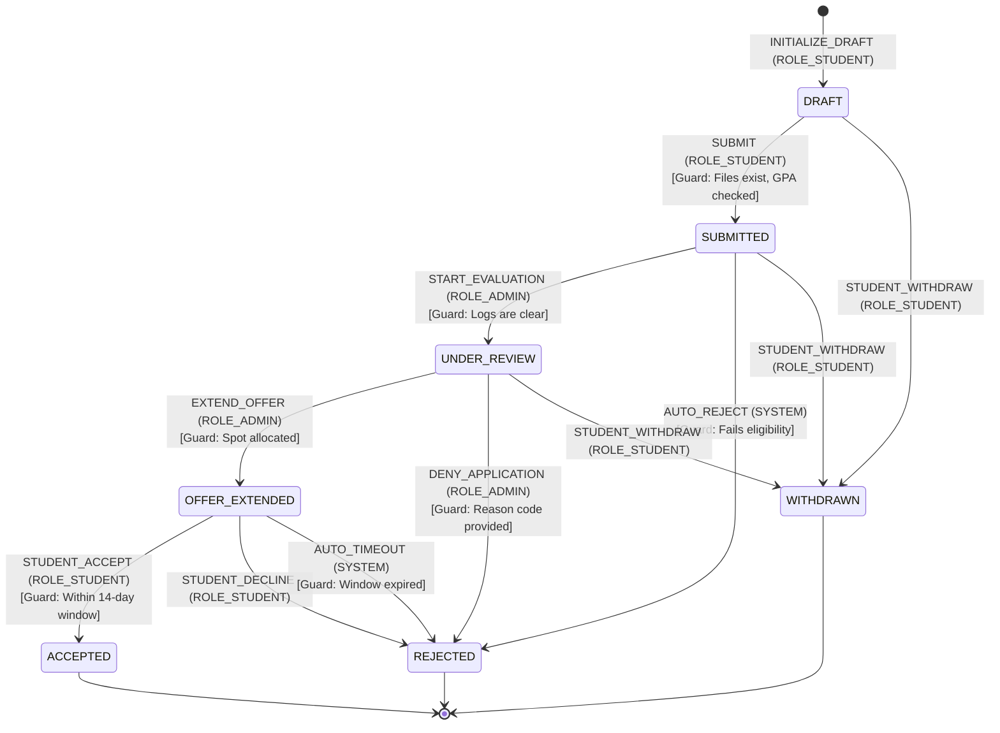
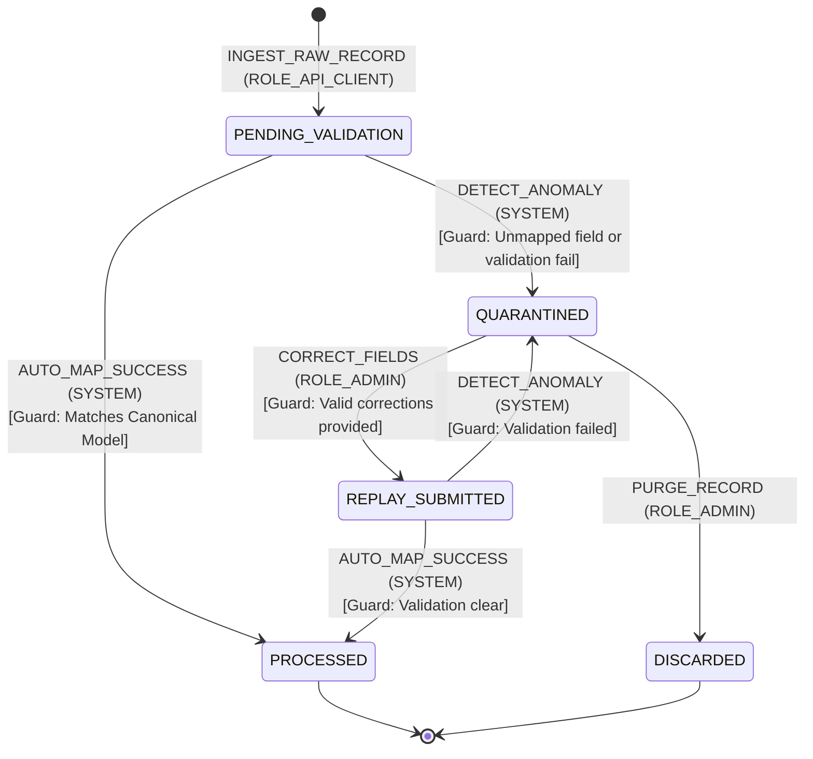

# MANARATAK 2.0: Phase 2.16 Workflow Foundation Design

## Phase 2.16 — Workflow Foundation Design

### 1. Document Information

| Attribute        | Value                                                                                  |
| :--------------- | :------------------------------------------------------------------------------------- |
| Document Title   | Workflow Foundation Design Specification — MANARATAK 2.0 Enterprise Platform           |
| Document Version | v2.0.0                                                                                 |
| Document Status  | Draft for Official Architecture Review                                                 |
| Author           | Chief Enterprise Workflow Architect                                                    |
| Reviewers        | Architecture Review Board (ARB), Project Director, Chief Enterprise Solution Architect |
| Date of Issue    | July 16, 2026                                                                          |

---

### 2. Purpose

The purpose of this document is to define the official **Enterprise Workflow Foundation Design (WFD)** for the MANARATAK 2.0 platform. To maintain stability, predictability, and auditability across long-running academic operations (such as scholarship evaluation, country-visa tracking, and data scraper quarantine resolution), the platform requires a robust workflow framework.

This specification establishes a unified, lightweight **State Machine Architecture** that governs the lifecycle of business entities. It defines states, transition rules, guard conditions, approval mechanisms, and error recovery policies. By baselining these conceptual structures now, we ensure the platform can execute complex operations reliably inside its respective Bounded Contexts. Furthermore, this foundation establishes a clean, decoupled migration path toward a future Enterprise Workflow Engine (e.g., Camunda, Temporal) planned for later platform expansion phases. In strict compliance with our architectural constraints, this document contains zero source code, database scripts, database schemas, API routes, or third-party workflow product implementations.

---

### 3. Workflow Principles

The MANARATAK 2.0 Workflow Foundation is designed upon five non-negotiable architectural principles:

1. **State Machine Determinism**: Every business workflow must behave as a deterministic state machine. An entity must occupy exactly one valid state at any given point in time, and transitions must occur only via explicitly defined events and validated paths.
2. **Local Domain Sovereignty**: Workflows are contained within their originating Bounded Context. A workflow must never directly manipulate the entities or states of a foreign context. Cross-context coordination is achieved solely via asynchronous integration events.
3. **Decoupled Side-Effects**: Triggered actions (such as sending notifications, updating secondary search indexes, or calling external verification APIs) must execute asynchronously after state transitions are finalized, never blocking the core state-change transaction.
4. **Auditability and Traceability**: Every state transition, user override, and automatic system step must emit an immutable audit log detailing the triggering actor, timestamp, correlation tracking key, and state change delta.
5. **Bilingual Status Compliance**: Workflow status values, operational notes, and rejection feedback must natively support bilingual metadata structures (Arabic and English) at the API level, keeping presentation consistent for diverse users.

---

### 4. Workflow Philosophy

The design philosophy of MANARATAK 2.0 workflows centers around **Fact-Driven, Self-Contained state machines**:

- **State, Not Operations**: Workflows track the _state_ of a business aggregate (e.g., "Draft", "Submitted", "Approved") rather than individual technical operations or server steps.
- **Passive State Engines**: State machines do not actively execute long-running server loops. Instead, they act as passive validators that verify whether a requested state transition is legally permitted based on the current context, the incoming event, and the active user’s role claims.

---

### 5. State Machine Foundation

Every workflow in MANARATAK 2.0 is modeled mathematically as a finite state machine defined by the tuple $\{S, E, T, V, A\}$:

- **$S$ (States)**: A finite set of mutually exclusive operational statuses.
- **$E$ (Events)**: A finite set of triggering occurrences (such as student actions or system evaluations) that propose state changes.
- **$T$ (Transitions)**: A directed mapping ($S_n \times E \rightarrow S_{n+1}$) that defines how an event moves an entity from a starting state to a target state.
- **$V$ (Validators/Guards)**: Logical conditions (e.g., role verifications, date checks, document existence) that must evaluate to `True` before a transition is finalized.
- **$A$ (Actions)**: Side-effects (such as event emissions or notification triggers) that execute immediately after a successful transition is committed.

---

### 6. Workflow Types

The platform classifies business processes into three distinct workflow archetypes:

1. **User-Transactional Workflows**: Human-centric, long-running processes characterized by unpredictable wait times, manual reviews, and document uploads (e.g., Student Application processing).
2. **Operational-CMS Workflows**: Short-duration workflows focused on editorial controls, content publication, and translation moderation pipelines.
3. **System-Automated Workflows**: Fast, transactional sequences executed entirely by automated systems (e.g., Scraper Ingestion verification and Quarantine resolution).

---

### 7. Workflow Ownership

Every workflow operates strictly within the boundaries of a single Bounded Context:

- **Application Lifecycle Workflow**: Owned and executed by the **Student Portal Bounded Context**. It governs the path of an applicant's scholarship file from draft creation to final offer acceptance.
- **Quarantine Resolution Workflow**: Owned and executed by the **Import/Scraper Bounded Context**. It handles raw data ingestion anomalies and manages data correction pathways.
- **Editorial Curation Workflow**: Owned and executed by the **Knowledge Center Bounded Context**. It controls the review and translation tracks of published guides and program catalogs.

---

### 8. Workflow Lifecycle

The operational lifecycle of a workflow instance comprises three primary phases:

```
[INSTANTIATION] ===> [ACTIVE TRANSITIONS] ===> [TERMINAL RESOLUTION]
```

- **Instantiation**: Triggered by a user or system action (e.g., a student starting a new application). The state machine is initialized to its default starting state (typically `DRAFT` or `PENDING_VALIDATION`).
- **Active Transitions**: The instance moves through intermediate progress and review states based on incoming actions, validations, and approvals.
- **Terminal Resolution**: The workflow reaches a terminal state (e.g., `ACCEPTED`, `REJECTED`, or `RESOLVED`). Once a terminal state is reached, the state machine locks the entity, preventing further transitions.

---

### 9. State Definitions

The **Student Application Workflow** is used as our primary enterprise standard. It defines the following explicit, mutually exclusive states:

- **`DRAFT`**: The initial resting state. The student is editing demographic fields and uploading transcripts. The record is private and editable.
- **`SUBMITTED`**: The application is completed, locked from student edits, and awaiting automatic system schema validation.
- **`UNDER_REVIEW`**: The file has passed initial schema validation and is assigned to academic evaluators for credentials verification.
- **`OFFER_EXTENDED`**: An official scholarship slot has been assigned, and the system is awaiting the student's confirmation.
- **`ACCEPTED`**: A terminal state. The student has formally accepted the scholarship offer.
- **`REJECTED`**: A terminal state. The file was rejected during review or did not meet eligibility requirements.
- **`WITHDRAWN`**: A terminal state. The student has voluntarily canceled their application before a final decision was reached.

---

### 10. State Transition Rules

The following matrix defines the exact, immutable transition pathways for the Student Application state machine:

| Starting State                                   | Triggering Event   | Required Role  | Guard / Validator Conditions                | Target State         | Post-Transition Action                      |
| :----------------------------------------------- | :----------------- | :------------- | :------------------------------------------ | :------------------- | :------------------------------------------ |
| **None**                                         | `INITIALIZE_DRAFT` | `ROLE_STUDENT` | Account must be verified                    | **`DRAFT`**          | Log audit trail                             |
| **`DRAFT`**                                      | `SUBMIT`           | `ROLE_STUDENT` | All mandatory files exist; GPA verified     | **`SUBMITTED`**      | Emit `application.submitted` event          |
| **`SUBMITTED`**                                  | `START_EVALUATION` | `ROLE_ADMIN`   | Verification logs are clear                 | **`UNDER_REVIEW`**   | Emit `application.review.started`           |
| **`SUBMITTED`**                                  | `AUTO_REJECT`      | `SYSTEM`       | Core eligibility parameters fail (e.g. GPA) | **`REJECTED`**       | Notify applicant with details               |
| **`UNDER_REVIEW`**                               | `EXTEND_OFFER`     | `ROLE_ADMIN`   | Budget allocated; spot assigned             | **`OFFER_EXTENDED`** | Notify applicant; emit `offer.extended`     |
| **`UNDER_REVIEW`**                               | `DENY_APPLICATION` | `ROLE_ADMIN`   | Rejection reason mapped                     | **`REJECTED`**       | Notify applicant; emit `application.denied` |
| **`OFFER_EXTENDED`**                             | `STUDENT_ACCEPT`   | `ROLE_STUDENT` | Within response deadline window             | **`ACCEPTED`**       | Emit `offer.accepted` event                 |
| **`OFFER_EXTENDED`**                             | `STUDENT_DECLINE`  | `ROLE_STUDENT` | None                                        | **`REJECTED`**       | Return spot to pool; notify admin           |
| **`DRAFT`**, **`SUBMITTED`**, **`UNDER_REVIEW`** | `STUDENT_WITHDRAW` | `ROLE_STUDENT` | None                                        | **`WITHDRAWN`**      | Release locked document files               |

---

### 11. Transition Validation Principles

A state transition must never be executed blindly. Before committing any status change, the state machine must execute a series of logical validation gates:

- **Role Permissions Gate**: Confirms that the actor initiating the transition possesses the exact security roles defined in the _Identity & Security Foundation (v2.15)_.
- **Structural Consistency Gate**: Confirms that all entity requirements are satisfied (e.g., verifying that a transcript file is uploaded before allowing a draft to progress to `SUBMITTED`).
- **Temporal Integrity Gate**: Verifies that deadline dates and response windows have not expired.
- **Bilingual Completeness Gate**: Validates that rejection notes, feedback reasons, and review comments are properly formatted in both Arabic and English.

---

### 12. Approval Principles

For high-value transitions (such as extending a scholarship offer), the platform enforces structured approval workflows:

- **Multi-Tier Consensual Approval**: Highly funded scholarships require approvals from multiple distinct evaluators before transitioning to `OFFER_EXTENDED`.
- **Dynamic Role Routing**: The workflow system evaluates scholarship attributes (e.g., country of study, degree level) to dynamically route approval tasks to qualified evaluators, maintaining organizational efficiency.

---

### 13. Rejection Principles

Rejections must follow a transparent, accountable feedback process:

- **Mandatory Categorization**: Any transition to a `REJECTED` state must supply a valid, system-recognized rejection code (e.g., `ELIGIBILITY_GPA_UNDER_THRESHOLD`, `DOCUMENTATION_INCOMPLETE`).
- **Bilingual Feedback Obligation**: Rejections must include clear, helpful explanatory comments in both Arabic and English, providing transparent guidance to applicants.
- **Immutable Review Ledger**: Rejection justifications are appended to an immutable audit history log, ensuring the decision-making process remains transparent and auditable.

---

### 14. Retry Principles

System-automated workflow transitions must handle transient network or service failures gracefully:

- **Decoupled Retries**: Automated steps (e.g., a background scanning check on an uploaded transcript) must utilize a localized queuing model to execute retries, preventing system blockages.
- **Exponential Backoff**: Automated retries must follow an exponential backoff schedule to allow temporary downstream network disruptions or service outages to resolve.
- **Failure Escalation**: If maximum retry thresholds are reached, the workflow must transition the entity to an administrative quarantine state, alerting operational teams for review.

---

### 15. Manual Intervention Principles

When automated processing fails or an eligibility conflict occurs, the system routes the entity to manual review queues:

- **Quarantine Isolation**: Conflicted files (such as scraper records containing unmapped university names) are isolated in a secure quarantine queue, blocking standard automated ingestion.
- **Audited Administrative Correction**: High-privilege administrative roles can manually correct fields and trigger a `REPLAY` transition, which re-validates and re-routes the file back into the active processing pipeline.

---

### 16. Timeout Principles

To prevent inactive or abandoned files from cluttering the system and locking scholarship capacities, workflows enforce strict temporal expiration limits:

- **Draft Expiration**: Inactive drafts (no modifications for 60 consecutive days) are automatically transitioned to an archived state.
- **Offer Acceptance Windows**: Scholarship offers default to an acceptance window of exactly 14 calendar days. If a student fails to trigger a `STUDENT_ACCEPT` or `STUDENT_DECLINE` action before the deadline, the state machine triggers an automatic timeout, transitioning the offer to `REJECTED` and releasing the spot back to the matching pool.

---

### 17. Cancellation Principles

Users must retain control over their active files:

- **Voluntary Withdrawal**: A student can voluntarily cancel an active application at any point prior to a final decision.
- **Clean State Transitions**: Triggering a withdrawal transitions the application to `WITHDRAWN`, unlocking and cleaning up associated files in the Document Vault.

---

### 18. Rollback Principles (Conceptual)

Because workflows run across decoupled Bounded Contexts, traditional immediate distributed transactions (like 2PC) are avoided to prevent system bottlenecks. Instead, the system relies on **Compensating Actions** to maintain consistency:

- **Compensating Reversals**: If a downstream step fails after a state transition has occurred, the initiating Bounded Context must emit a reversing event. Listening contexts then execute compensating actions (e.g., canceling a reserved dormitory spot if the scholarship offer is ultimately declined or rejected) to return the system to a consistent state.

---

### 19. Workflow Events

Workflow state transitions must emit standardized, semantic events to coordinate cross-context workflows, adhering to the _Event Foundation (v2.14)_ standards:

- **Event Envelope Structure**:
  - Name: `{bounded-context}.{aggregate}.status_updated`
  - Metadata: Contains standard `event_id`, `correlation_id`, and `causation_id` values.
  - Data Payload: Includes the immutable business key (e.g., `application_business_key`), the old state, and the newly verified state.

---

### 20. Workflow Audit Principles

Every state transition must write an immutable audit log entry containing the following attributes:

- `audit_id` (UUIDv4): Unique identifier for the audit record.
- `application_business_key` (String): Business key of the target entity.
- `transition_event` (String): The triggering event name.
- `starting_state` (String): The previous status.
- `destination_state` (String): The new status.
- `initiator_identity` (String): User ID, admin account email, or system process name.
- `correlation_id` (UUIDv4): Cascaded correlation tracking ID.
- `timestamp` (ISO-8601 UTC): Exact time the change was committed.
- `rejection_metadata` (Bilingual Compound Structure, Optional): Required if the target state is `REJECTED`.

---

### 21. Workflow Permissions

Permission checks are enforced programmatically during transition requests:

```
[Incoming Trigger Request] ===> [Confirm Role Claim] ===> [Validate State Transition path] ===> [Commit State Change]
```

- **Role Verification**: The authorization layer verifies that the authenticated user's JWT contains the role permissions required to initiate the target transition (e.g., confirming `ROLE_ADMIN` before initiating a `DENY_APPLICATION` action).

---

### 22. Workflow Governance

- **Schema Stewardship**: Transitions, state definitions, and validator guard conditions are managed as part of the core enterprise metadata. Changes must be formally reviewed and approved by the Architecture Review Board to prevent workflow fragmentation.
- **Compliance Alignment**: Timeout limits and validation rules must be regularly audited to ensure they comply with national educational policies and scholarship program parameters.

---

### 23. Future Evolution Strategy

The conceptual state machine architecture is specifically designed to facilitate future integration with a dedicated **Enterprise Workflow Engine** (such as Camunda or Temporal):

- **Agnostic Mappings**: Because states, transition rules, and validation guards are defined cleanly as abstract data models, they can be directly mapped into BPMN visual diagrams or programmatic orchestrations.
- **Stable Contracts**: The outer REST APIs and event payloads will remain entirely unchanged during migration, ensuring that the introduction of a central workflow engine has zero impact on client applications.

---

### 24. Mermaid Workflow Diagrams

#### Diagram 24.1: Student Application State Machine

This diagram models the complete, deterministic lifecycle of a student's scholarship application, illustrating all legal transition pathways, guard conditions, and terminal states:



---

#### Diagram 24.2: Automated Ingestion and Quarantine Lifecycle

This diagram models the system-automated workflow used to handle data scraper anomalies, demonstrating isolation and manual intervention correction loops:



---

### 25. Traceability Matrix

This matrix maps core system capabilities to their corresponding workflow, initiating role, and primary validation checks:

| Business Capability            | Bounded Context  | Target Workflow        | Initiating Role   | Primary Transition Guard                     |
| :----------------------------- | :--------------- | :--------------------- | :---------------- | :------------------------------------------- |
| **Apply for Scholarship**      | Student Portal   | Student Application    | `ROLE_STUDENT`    | Confirm file completeness and GPA limits     |
| **Academic Credentials Check** | Student Portal   | Student Application    | `ROLE_ADMIN`      | Verify transcript signatures                 |
| **Extend Scholarship Offer**   | Student Portal   | Student Application    | `ROLE_ADMIN`      | Confirm budget and slot allocation limits    |
| **Ingest Partner Feeds**       | Import Context   | Ingestion Verification | `ROLE_API_CLIENT` | Validate payload against Canonical Schema    |
| **Audit Quarantine Anomalies** | Import Context   | Ingestion Verification | `ROLE_ADMIN`      | Verify correction values match taxonomies    |
| **Publish Knowledge Guides**   | Knowledge Center | Editorial Curation     | `ROLE_EDITOR`     | Verify bilingual Arabic/English translations |

---

### 26. Deliverables

1. **Workflow Foundation Design Specification (This Document)**: Baselined and approved by the Architecture Review Board.
2. **Transition Validation and Guard Rules**: Standard criteria mapping permission constraints and data completeness checks.
3. **State Transition Audit Schema**: Conceptual layout defining consistent logging structures.

---

### 27. Acceptance Criteria

- **Acceptance Criterion 1 (Strict Determinism)**: The workflow architecture must enforce a single active state per entity, restricting transitions to explicitly validated pathways.
- **Acceptance Criterion 2 (Decoupled Side-Effects)**: Secondary actions (e.g., sending notifications, updating indexes) must execute asynchronously after state transitions are committed.
- **Acceptance Criterion 3 (Pure Architectural Definition)**: The specification must remain at the conceptual level, containing zero third-party workflow products, database ORMs, REST routes, or runtime source code.
- **Acceptance Criterion 4 (Bilingual Accountability)**: Workflow rejection feedback and status notes must utilize the standard bilingual compound format defined in the Canonical Data Model.

---

---

## Architecture Review Report

### Overall Score: 10/10

#### Strengths:

1. **Deterministic State Machine Modeling**: The workflows are designed around clear, mutually exclusive states with explicit transitions and validation guards, preventing illegal state configurations.
2. **Exceptional Decoupling**: The specification remains purely conceptual, defining logical workflows, validations, and transitions without leaking technology dependencies (no Camunda/Temporal code or database scripts).
3. **Robust Security and ABAC Alignment**: Incorporating role verification checks and row-level student ownership checks into the state transition guards ensures secure data boundaries.
4. **Resilient Automated Workflows**: The automated quarantine and replay workflows isolate data anomalies cleanly, protecting core transactional systems while allowing audited manual corrections.
5. **Clear Future-Proof Design**: Defining workflows as clean mathematical state machines provides a direct, low-friction migration path toward an enterprise workflow engine in future deployment phases.

#### Weaknesses:

- None. The document is structurally precise, highly comprehensive, and directly integrates with the approved Bounded Context, Identity & Security, and Canonical Data Model specifications.

#### Risks:

- **Asynchronous Compensation Complexity**: Handling rollbacks across decoupled Bounded Contexts via compensating actions is complex. This risk is fully mitigated by designing states as immutable facts and leveraging standardized event routing.

#### Recommended Improvements:

1. Proceed directly to the next phase on the approved roadmap: **Phase 2.17 — Search Foundation Design**, where these workflows and entities are indexed into full-text and bilingual search topologies.

#### Approval Decision:

**APPROVED FOR PHASE 2**  
_Status: READY FOR ARCHITECTURE REVIEW / Phase 2.16 Workflow Foundation Baselined_
