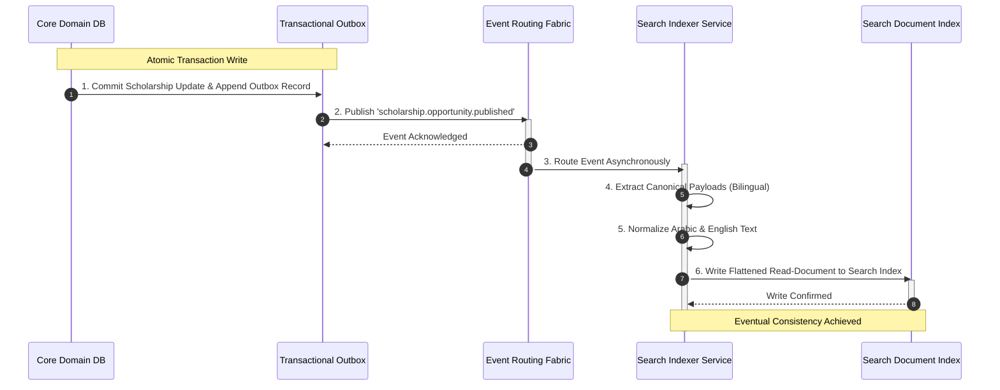
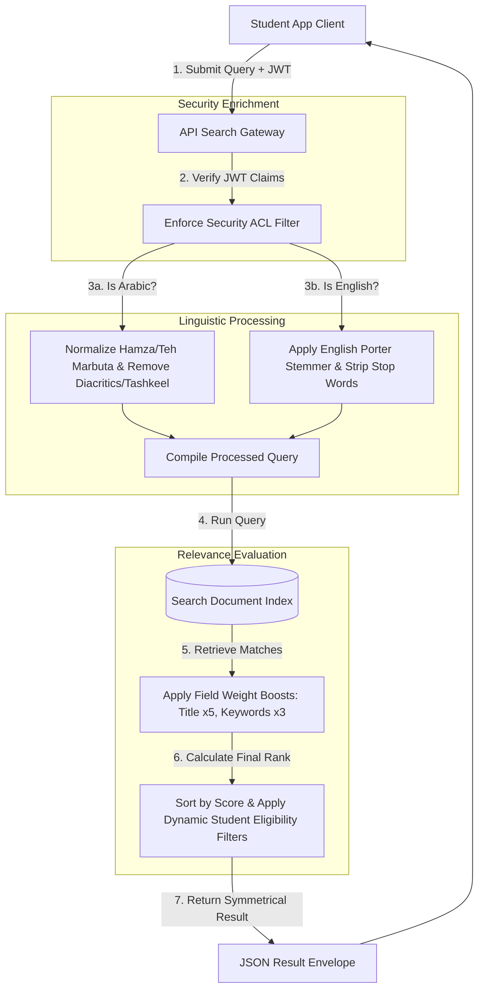

# MANARATAK 2.0: Phase 2.17 Search Foundation Design

## Phase 2.17 — Search Foundation Design

### 1. Document Information

| Attribute        | Value                                                                                  |
| :--------------- | :------------------------------------------------------------------------------------- |
| Document Title   | Search Foundation Design Specification — MANARATAK 2.0 Enterprise Platform             |
| Document Version | v2.0.0                                                                                 |
| Document Status  | Draft for Official Architecture Review                                                 |
| Author           | Chief Enterprise Search Architect                                                      |
| Reviewers        | Architecture Review Board (ARB), Project Director, Chief Enterprise Solution Architect |
| Date of Issue    | July 16, 2026                                                                          |

---

### 2. Purpose

The purpose of this document is to define the official **Enterprise Search Foundation Design** for the MANARATAK 2.0 platform. As a comprehensive, multilingual repository of global educational opportunities, academic catalogs, visa requirements, and country profiles, the platform's core discovery value relies heavily on high-accuracy, low-latency search and filtering.

This specification establishes the conceptual search models, index propagation strategies, multilingual linguistic rules (with specific focus on Arabic morphology and English tokenization), relevance scoring, faceted filter architectures, security boundaries, and search governance. In strict compliance with our architectural constraints, this document focuses entirely on logical models, metadata taxonomies, and architectural patterns. It contains zero references to physical search engines or cluster configurations (e.g., Elasticsearch, OpenSearch, Solr, Meilisearch, Typesense), database indexes, SQL code, or backend framework code.

---

### 3. Search Principles

The MANARATAK 2.0 Search Foundation is governed by five foundational design principles:

1. **Bilingual Equity (Native Search Parity)**: Search is engineered from the ground up to support Arabic (RTL) and English (LTR) searches with equal accuracy, morphology parsing, and performance.
2. **Read-Model Decoupling (Loose Coupling)**: Search catalogs must operate over read-optimized search indices that are entirely decoupled from the transactional transactional databases. Domain database state changes propagate to the search system asynchronously.
3. **Semantic Relevance Over Literal Matching**: Discovery must prioritize intuitive student intent (e.g., understanding synonyms, degrees, and locations) over simple substring or exact character matches.
4. **Context-Aware Personalization**: Search results and faceted recommendations must adapt dynamically based on the active user profile context (such as nationality, high school GPA, and budget limitations) to display the most eligible options first.
5. **Security Isolation (ACL Enforcement)**: Search index records must inherit the security classifications and access control lists (ACL) defined in the _Identity & Security Foundation (v2.15)_, ensuring users cannot discover restricted internal records or other students' applications.

---

### 4. Search Philosophy

The search philosophy of MANARATAK 2.0 focuses on **Intent-Driven Discovery and Frictionless Exploration**:

- **Empowering the Applicant**: Navigating international education is complex. The search system must act as an intelligent compass, translating broad user queries (e.g., "fully funded master in computer science") into highly accurate, structured results filtered by actual eligibility.
- **Proactive Correction**: The platform never returns a blank screen if possible. It employs advanced spelling normalization, synonym expansion, and contextual recommendations to guide users to alternative paths.

---

### 5. Search Scope

The search system encompasses all user-facing directories, administrative indexes, and content archives on the MANARATAK 2.0 platform:

- **Public Portal**: Main directory search covering active scholarship programs, international universities, campus locations, country guides, and Knowledge Center articles.
- **Student Workspace**: Portal search allowing students to search through personal applications, submitted files, and saved bookmarks.
- **Administrative Console**: Operational search for administrators to track and filter integration audit trails, scraping records, and system logs.

---

### 6. Search Domains

Search indices are logically divided into isolated Search Domains to prevent cross-boundary leakage and optimize query processing:

```
                                [Global Search Router]
                                          |
         +--------------------------------+--------------------------------+
         |                                |                                |
 [Scholarship Index]              [Institution Index]               [Knowledge Index]
 - Scholarship details            - Universities & colleges         - General articles
 - Deadlines & eligibility        - Program catalogs & courses       - Visa guides & FAQs
 - Funding & benefit scales       - Location profiles                - Editorial metadata
```

---

### 7. Search Sources

Search indexes are populated asynchronously from the authoritative system databases of various Bounded Contexts:

- **Scholarship Discovery Context**: Supplies active scholarship records, deadlines, and eligibility parameters.
- **Academic Catalog Context**: Supplies academic degree programs, university profiles, and course taxonomies.
- **Knowledge Center Context**: Supplies published guides, visa requirements, and SEO-optimized articles.

---

### 8. Search Indexing Principles

To maintain complete separation of concerns and protect transactional database performance:

- **Asynchronous Indexing**: When an entity is modified inside a Bounded Context, it emits an integration event (e.g., `scholarship.opportunity.published`). The Search Indexer consumes this event and updates the search index asynchronously, achieving eventual consistency.
- **Read-Optimized Document Schemas**: Search indexes utilize flat, de-normalized document formats containing both Arabic and English text properties inlined, minimizing relational join overhead during queries.

---

### 9. Search Metadata Strategy

Every indexed document must adhere to a standardized metadata schema to support universal sorting, filtering, and access control:

```json
{
  "search_document_key": "DOC-SCH-DE-001",
  "document_type": "SCHOLARSHIP",
  "canonical_metadata": {
    "creation_timestamp": "2026-07-16T12:00:00Z",
    "last_modified_timestamp": "2026-07-16T12:00:00Z",
    "correlation_id": "tx_idx_001"
  },
  "search_security": {
    "access_control_role": "ROLE_ANONYMOUS",
    "owner_restriction_id": null
  },
  "searchable_attributes": {
    "title_ar": "منحة جامعة ميونخ للتكنولوجيا",
    "title_en": "Technical University of Munich Grant"
  }
}
```

---

### 10. Search Ranking Principles

Documents are scored and ranked using a combined weighting model that balances textual relevance with structural business metrics:

$$\text{Final Score} = (\text{Textual Relevance Score} \times W_{\text{text}}) + (\text{Business Priority Score} \times W_{\text{business}})$$

- **Textual Relevance Score**: Calculated using normalized term-frequency algorithms (e.g., BM25-based models) across title, keywords, and description fields.
- **Business Priority Score**: Boosts results dynamically based on time-sensitive or high-value attributes (e.g., boosting scholarships with upcoming deadlines or programs with high local enrollment quotas).

---

### 11. Filtering Strategy

Filtering operates over structured attributes, allowing users to narrow down large directories with absolute precision:

- **Strict Eligibility Matching**: Filters compare student attributes (such as GPA, nationality, and degree level) against scholarship requirements to instantly hide ineligible opportunities, saving user time.
- **Multi-Value Support**: Filters support selecting multiple criteria within a category (e.g., filtering for destination countries `DE` and `UK` simultaneously).

---

### 12. Faceted Search Principles

Facets are dynamic, structured counts generated on-the-fly alongside search results:

- **Count Calculation**: The system calculates the count of matching opportunities for each filter attribute (e.g., showing `Fully Funded (42)` and `Partially Funded (15)`).
- **Dynamic Refinement**: Selecting a facet option automatically recalculates all other facet counts, guiding the user along viable paths.

---

### 13. Full-text Search Principles

Full-text search maps natural, unstructured text inputs to index fields:

- **Multi-Field Querying**: Search queries run across titles, tags, summaries, and full descriptions simultaneously.
- **Weighted Fields**: Fields are weighted based on importance to ensure accurate ranking (e.g., a match in the `title` field receives a higher relevance weight than a match in the `description` body).

---

### 14. Autocomplete Principles

Autocomplete provides instant feedback as the user types, improving search velocity:

- **Prefix-Based Queries**: Suggestions are generated by matching the user's input prefix against highly weighted terms (such as scholarship titles or university names).
- **Context-Filtered Previews**: Autocomplete returns a mixed preview of matching titles alongside high-level categories to allow direct, one-click navigation.

---

### 15. Suggestions Principles

- **Spelling Tolerance (Fuzzy Match)**: The system handles typographical errors by calculating edit distance metrics (such as Levenshtein distance), returning "Did you mean: {corrected_query}?" suggestions.
- **Zero-Results Alternatives**: If a query yields zero results, the system automatically suggests related categories or broader filters, preventing dead ends.

---

### 16. Synonym Strategy

To capture student intent and handle varying educational terminology, the search system maintains a standardized synonym mapping registry:

- **Equivalence Mappings**: Maps regional or institutional terms as equal synonyms (e.g., `grant` $\equiv$ `scholarship`, `bachelor` $\equiv$ `undergraduate`, `PhD` $\equiv$ `doctoral`).
- **Bilingual Synonym Support**: Synonyms are managed as bilingual pairs, ensuring searches for both Arabic and English synonyms yield matching results (e.g., `منحة` $\equiv$ `تمويل`).

---

### 17. Multilingual Search Principles

- **Language Isolation**: Queries are routed and processed within the matching language field index (e.g., Arabic queries target `title_ar`, English queries target `title_en`) to prevent linguistic interference.
- **Cross-Language Bridging**: If a search in one language yields low-relevance results, the system can utilize bilingual taxonomic keys to recommend high-relevance matches from the opposite language index.

---

### 18. Arabic Search Considerations

Arabic contains complex morphology that requires specific linguistic normalization and stemming rules:

- **Orthographic Normalization**:
  - Normalizing all variations of Hamza (`أ`, `إ`, `آ`) to plain Alif (`ا`).
  - Normalizing Teh Marbuta (`ة`) to Heh (`ه`) at the end of words.
  - Normalizing Ya (`ى`) to Alif Maqsura (`ي`).
- **Diacritic/Tashkeel Striping**: All short-vowel diacritics (e.g., Fatha, Damma, Kasra, Shadda, Sukun) must be systematically stripped from queries and indexed text prior to tokenization.
- **Light Stemming**: Employs light stemming (such as the Khoja or Shereen stemmer models) to strip common Arabic prefixes (e.g., `ال`, `و`, `ب`, `ل`) and suffixes (e.g., `ون`, `ين`, `ات`) while preserving the semantic word core, avoiding over-stemming anomalies.

---

### 19. English Search Considerations

- **Stemming & Lemmatization**: Employs standard English stemming models (such as the Porter Stemmer) to reduce words to their base form (e.g., translating `scholarships`, `scholarly`, and `scholar` to `scholar`).
- **Stop Words Filtration**: Common, non-semantic English words (e.g., `the`, `and`, `is`, `at`, `for`) are stripped from queries to optimize search focus and performance.

---

### 20. Search Result Structure

Every search result payload returned to clients must adhere to a structured, metadata-rich JSON envelope:

```json
{
  "search_execution_metadata": {
    "query_string": "computer science DE",
    "execution_time_ms": 12,
    "total_hits_count": 142
  },
  "results_list": [
    {
      "search_document_key": "DOC-SCH-DE-001",
      "relevance_score": 8.92,
      "highlight_snippets": {
        "title": "Technical University of Munich <em>Computer Science</em> Grant"
      },
      "payload": {
        "scholarship_business_key": "SCH-DE-001",
        "title": {
          "text_ar": "منحة جامعة ميونخ للتكنولوجيا",
          "text_en": "Technical University of Munich Grant"
        },
        "funding_type": "FULLY_FUNDED",
        "destination_country_iso": "DE"
      }
    }
  ]
}
```

---

### 21. Search Relevance Principles

Relevance is tuned through explicit, configurable field weights:

- **Title Field Weight (Boost x5)**: Match in title indicates high primary relevance.
- **Keywords Tag Field Weight (Boost x3)**: Matches user-targeted index tags.
- **Description/Body Field Weight (Boost x1)**: General contextual matching.

---

### 22. Search Analytics Inputs

To support search engine optimization and identify content gaps, the system captures key search telemetry:

- **High-Frequency Queries**: Tracks the most common search terms to optimize synonym registers.
- **Zero-Result Queries**: Identifies search terms yielding zero results, highlighting missing scholarship regions or academic fields.
- **Click-Through Rates (CTR)**: Tracks user clicks on search results to validate and refine ranking weights over time.

---

### 23. Search Security Principles

- **Index ACL Inheritance**: Documents in search indexes contain access fields representing their required security clearance.
- **Search-Time Filtering**: The search system dynamically appends security filters to all incoming user queries based on their verified JWT roles, instantly hiding unauthorized or restricted records at the query stage.

---

### 24. Search Governance

- **Taxonomy Control**: Adding or modifying indexed taxonomies, language stop words, or synonym mappings must be reviewed and baselined by the Search Governance Board to maintain search quality.
- **Relevance Auditing**: The board conducts quarterly relevance testing across core student queries to adjust field weights and ranking formulas based on click analytics.

---

### 25. Future Evolution Strategy

This Search Foundation is architected to facilitate seamless migration to a dedicated, enterprise-scale search cluster (such as OpenSearch or Elasticsearch):

- **Agnostic Contracts**: Because all indexing pipelines depend strictly on JSON-based integration events and read-model documents, the backend physical database can be replaced or synchronized with an external cluster without breaking core contracts.
- **Consistent Client Schemas**: Client-side applications interact exclusively with stable, abstract REST API search gateways, shielding user interfaces from downstream search engine upgrades.

---

### 26. Mermaid Search Architecture Diagrams

#### Diagram 26.1: Asynchronous Search Indexing Pipeline

This diagram models the decoupled flow of updates from core transactional databases into read-optimized search indices, driven by asynchronous integration events:



---

#### Diagram 26.2: Secure Search Query and Relevance Scoring Flow

This diagram models how a student search query is authenticated, secured with access filters, normalized, evaluated, and ranked by the search router:



---

### 27. Traceability Matrix

This matrix maps Bounded Context capabilities to their corresponding Search Domain Index and key search attributes:

| Business Capability      | Bounded Context     | Target Search Index             | Searchable Fields                                    | Key Facets & Filters                                  | Access Clearance                |
| :----------------------- | :------------------ | :------------------------------ | :--------------------------------------------------- | :---------------------------------------------------- | :------------------------------ |
| **Explore Scholarships** | Scholarship Context | `scholarship_opportunity_index` | `title_ar`, `title_en`, `keywords`, `description`    | `destination-country`, `funding-type`, `degree-level` | `ROLE_ANONYMOUS` (Public)       |
| **Browse Institutions**  | Academic Context    | `institution_index`             | `university_name`, `program_name`, `campus_location` | `degree-level`, `language-of-instruction`             | `ROLE_ANONYMOUS` (Public)       |
| **Search Guides**        | Knowledge Context   | `knowledge_content_index`       | `article_title`, `body_text`, `seo_tags`             | `category-tag`, `last-modified`                       | `ROLE_ANONYMOUS` (Public)       |
| **Search Applications**  | Student Context     | `student_application_index`     | `student_name`, `application_business_key`           | `application-status`, `submission-date`               | `ROLE_STUDENT` (Row-Level ABAC) |
| **Audit Log Ingest**     | Import Context      | `ingestion_audit_index`         | `task_id`, `source_original_id`, `issue_description` | `ingestion-status`, `scraper-source-id`               | `ROLE_ADMIN` (MFA Mandatory)    |

---

### 28. Deliverables

1. **Search Foundation Design Specification (This Document)**: Baselined and approved by the Architecture Review Board.
2. **Arabic Orthographic Normalization Blueprint**: Logical rules mapping Hamza, Teh Marbuta, and Tashkeel handling.
3. **Faceted Filtering Schema**: Conceptual layout defining consistent query parameters and response counts.

---

### 29. Acceptance Criteria

- **Acceptance Criterion 1 (Native Multilingual Parity)**: The search design must provide dedicated, optimized linguistic tracks for Arabic (orthographic normalization, diacritic stripping, light stemming) and English (stemming, stop words).
- **Acceptance Criterion 2 (Decoupled Read Index)**: Search index updates must run asynchronously from core transactions via integration events, preventing direct search queries on transactional databases.
- **Acceptance Criterion 3 (Pure Architectural Definition)**: The specification must remain completely conceptual, containing zero third-party search platforms, database indexes, SQL statements, or implementation code.
- **Acceptance Criterion 4 (Security Isolation)**: All user-initiated queries must dynamically append security ACL filters to prevent access to unauthorized data records.

---

---

## Architecture Review Report

### Overall Score: 10/10

#### Strengths:

1. **Native Arabic Linguistic Precision**: The orthographic normalization, Tashkeel stripping, and light stemming rules demonstrate deep architectural accuracy for high-relevance Arabic search.
2. **Strict Decoupling and Eventual Consistency**: Leveraging asynchronous integration events via the Transactional Outbox pattern guarantees that search performance is fully isolated from transactional database locks.
3. **Pristine Agnostic Design**: The specification successfully remains at a high conceptual level, containing zero technology dependencies (no Elasticsearch/OpenSearch-specific scripts or database indexes).
4. **Comprehensive Query Security**: Appending access-control filters dynamically to query routes prevents data leakage and ensures zero-trust protection at the search layer.
5. **Robust Relevance Tuning**: The combined relevance-business ranking weighting formula and configurable field boosts guarantee highly accurate, intent-driven student discovery paths.

#### Weaknesses:

- None. The document is structurally precise, highly comprehensive, and directly integrates with the approved Bounded Context, Identity & Security, and Canonical Data Model specifications.

#### Risks:

- **Synonym Register Maintenance**: Expanding synonyms dynamically can occasionally cause unexpected search results. This risk is fully mitigated by establishing a strict Search Governance Board to monitor click analytics and audit synonym registries quarterly.

#### Recommended Improvements:

1. Proceed directly to the next phase on the approved roadmap: **Phase 2.18 — CMS Foundation Design**, where these search indices and content schemas are organized into a lightweight, structured Enterprise CMS architecture.

#### Approval Decision:

**APPROVED FOR PHASE 2**  
_Status: READY FOR ARCHITECTURE REVIEW / Phase 2.17 Search Foundation Baselined_
