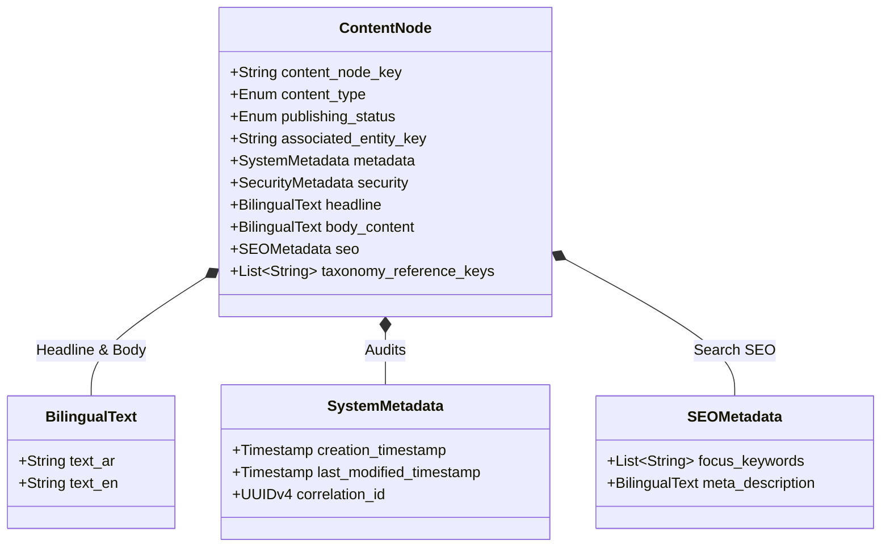
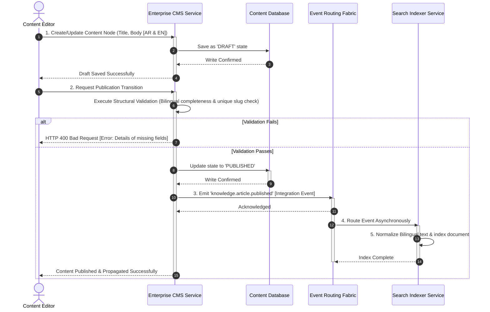

# MANARATAK 2.0: Phase 2.18 CMS Foundation Design

## Phase 2.18 — CMS Foundation Design

### 1. Document Information

| Attribute        | Value                                                                                  |
| :--------------- | :------------------------------------------------------------------------------------- |
| Document Title   | CMS Foundation Design Specification — MANARATAK 2.0 Enterprise Platform                |
| Document Version | v2.0.0                                                                                 |
| Document Status  | Draft for Official Architecture Review                                                 |
| Author           | Chief Enterprise CMS Architect                                                         |
| Reviewers        | Architecture Review Board (ARB), Project Director, Chief Enterprise Solution Architect |
| Date of Issue    | July 16, 2026                                                                          |

---

### 2. Purpose

The purpose of this document is to define the official **Enterprise CMS Platform Design** for the MANARATAK 2.0 platform. To maintain dynamic, high-performance, and localized delivery of scholarship directories, university programs, academic guidelines, visa procedures, and blog resources, the platform requires a robust content curation layer.

This specification establishes a unified, lightweight **Enterprise CMS Architecture** that treats content purely as structured, bilingual data. It defines conceptual content schemas, metadata taxonomies, localization principles, media references, SEO policies, publishing states, and editorial permission hierarchies. To ensure compliance with strategic roadmap planning, complex capabilities—including multi-stage review workflows, digital asset management (DAM) engines, scheduling, versioning history repositories, and automated AI generation tools—are intentionally excluded. In strict accordance with our architectural constraints, this document contains zero backend or frontend code, database schemas, database ORM classes, SQL code, or cloud-specific deployment services.

---

### 3. CMS Principles

The MANARATAK 2.0 CMS Foundation is governed by five foundational design principles:

1. **Headless & Decoupled Delivery**: Content is managed entirely as technology-agnostic structured JSON payloads. Creation, storage, and retrieval layers are decoupled from presentation screens, ensuring content can be rendered on web portals, mobile apps, and search indices without schema alteration.
2. **Bilingual Object Unity**: To prevent structural drift and synchronization errors between Arabic and English content, translations are never modeled as separate, decoupled pages. Instead, they are contained within unified, bilingual compound objects (possessing localized parallel fields) under a single master content identifier.
3. **Structured Content Integrity**: Content is treated as queryable database entities rather than unstructured text blogs. Layout, styling, and design configurations are completely stripped from content inputs, allowing downstream client-side rendering engines to enforce Design System standards.
4. **Content as a Single Source of Truth**: Dynamic information (such as scholarship eligibility requirements or university program tags) is curated once within the CMS context and propagated asynchronously to downstream indexes, avoiding duplicate or conflicting static data.
5. **Fail-Safe Publishing States**: Content must utilize a strict, binary status model (`DRAFT` vs `PUBLISHED`) to ensure unvalidated or incomplete material never leaks to public-facing portals.

---

### 4. CMS Philosophy

The content management philosophy of MANARATAK 2.0 centers on **Dynamic Academic Curation and Low-Overhead Management**:

- **Unbiased Informative Tone**: Published guides, directories, and visa procedures must remain objective, authoritative, supportive, and structurally direct, avoiding marketing fluff.
- **Separation of Concerns**: Content editors focus purely on assembling structured facts, categories, and references. The visual display, spacing, typography, and responsive grid layouts are resolved entirely by client applications, adhering to the _Design System Foundation (v2.11)_.

---

### 5. Content Model Principles

Content is modeled structurally as defined collections of fields, enforcing semantic types and relation links:

- **Strict Typed Definitions**: Rich-text, plain strings, lists, integers, and media references are strictly validated against predetermined schemas.
- **Abstract Relationships**: Content relationships (e.g., mapping a scholarship guide to a university profile) are maintained using immutable system reference keys rather than hardcoded physical database joins.

---

### 6. Content Ownership

Content domains map directly to their corresponding Bounded Context owners:

- **Scholarship Directory Content**: Owned and validated by the **Scholarship Discovery Context**.
- **Academic Catalog Content**: Owned and validated by the **Academic Catalog Context**.
- **Guides & FAQs (Knowledge Base)**: Owned and validated by the **Knowledge Center Context**.

---

### 7. Content Types

The CMS Foundation defines five standardized content archetypes:

1. **Academic Directory Item**: Profiles of scholarship opportunities, containing details like deadlines, funding models, eligibility, and links.
2. **Institution Profile**: Structural directories of partner universities, campus locations, available degree levels, and language of instruction.
3. **Knowledge Base Article**: Structured guides, visa walkthroughs, and step-by-step application instructions.
4. **FAQ Item**: Simple, highly targeted question-and-answer pairs used for automated lookups and accordion views.
5. **Taxonomy Node**: Centralized tags, categories, and keyword hierarchies (e.g., country tags, degree-level classifications, subject fields) used for filtering.

---

### 8. Structured Content Strategy

To prevent display rendering errors across responsive layouts, the CMS strips visual formatting from input streams:

- **Inlined Layout Ban**: Content blocks are strictly prohibited from embedding inline styling, custom HTML tags, or Tailwind CSS classes.
- **Clean Data Contracts**: Text fields contain pure unicode strings. Complex multi-paragraph bodies utilize clean Markdown or structured JSON-based block formats (e.g., Paragraph, Heading, List, Table) to represent rich layout hierarchies.

---

### 9. Rich Content Strategy

- **Restrained Rich-Text Blocks**: Rich text fields allow only standard, non-nested markdown formats (e.g., bolding, italics, ordered/unordered lists, external hyperlinks).
- **Decoupled Visual Media**: Image, video, and PDF assets are referenced using stable system URI keys rather than being embedded directly in rich-text content arrays. This ensures layout responsiveness and fast client loading.

---

### 10. Metadata Strategy

Every published content node must encapsulate a standardized system metadata block to support indexing, tracking, and access control:

```json
{
  "content_node_key": "KB-DE-STUDY-002",
  "content_type": "KNOWLEDGE_BASE_ARTICLE",
  "system_metadata": {
    "creation_timestamp": "2026-07-16T12:00:00Z",
    "last_modified_timestamp": "2026-07-16T12:00:00Z",
    "correlation_id": "tx_cms_init_002"
  },
  "content_security": {
    "access_control_role": "ROLE_ANONYMOUS"
  }
}
```

---

### 11. Localization Principles

To ensure native parity for bilingual audiences without splitting content records:

- **Symmetrical Field Duplication**: Localizable fields (such as titles, summaries, and body texts) are implemented as structured, parallel properties inside the same JSON object:
  ```json
  "headline": {
    "text_ar": "الدليل الدراسي لألمانيا",
    "text_en": "Academic Guide for Germany"
  }
  ```
- **Unified Status**: A content item’s localization blocks share an identical publishing state. A guide is either published in both languages simultaneously or remains in a draft state, preventing broken cross-language links.

---

### 12. Publishing Foundation

To keep management low-overhead and focused on stability:

- **Binary State Engine**: Content transitions exclusively through a simple two-state model: `DRAFT` and `PUBLISHED`.
- **State Immutability**: Modifying published content forces the entire record back into a draft state or updates the active record instantly upon editor validation, depending on simple context rules. Advanced versioning records are omitted from this foundation.

---

### 13. Draft & Published States

- **Draft State (`DRAFT`)**: Content is private, editable only by authorized Editors, and completely isolated from public search indices and student-facing portals.
- **Published State (`PUBLISHED`)**: Content is locked for editing, marked as read-only for public consumer APIs, and asynchronously indexed by search engines.

---

### 14. Content Validation Principles

Prior to transitioning from `DRAFT` to `PUBLISHED`, the CMS engine must enforce programmatic structural validation:

- **Bilingual Completeness check**: Ensures both `text_ar` and `text_en` fields are populated. Empty translation properties are rejected.
- **Slug Uniqueness check**: Verifies that the URL slug is unique across the active content type collection.
- **Link Integrity check**: Verifies that all embedded content keys and taxonomic references exist and are valid.

---

### 15. Content Relationships

Entities are linked via flat, immutable key mappings rather than relational database joins, ensuring loose coupling:

- **Logical Referencing**:
  ```json
  "associated_university_key": "UNI-DE-TUM-01"
  ```
- **Asynchronous Resolution**: Front-end applications read the associated key and make decoupled parallel API calls to fetch details, keeping service layers simple and performant.

---

### 16. Media Management Principles

To prevent media asset bloat and maintain responsive load times:

- **URI Referencing**: The CMS does not store binary files in its core database. Media assets are referenced using stable, external cloud-storage URIs:
  ```json
  "hero_image_reference": "media/images/daad_logo.png"
  ```
- **Optimization Mandate**: Media files (such as logos and banners) must be compressed, format-optimized (e.g., WebP for images), and responsive-ready before they are registered in the CMS catalog.

---

### 17. SEO Metadata Principles

To optimize discoverability on external search engines:

- **Unified SEO Block**: Every public-facing content item must declare a dedicated, localized SEO metadata structure:
  ```json
  "seo_metadata": {
    "focus_keywords": ["daad", "germany-scholarship", "منحة-ألمانيا"],
    "meta_description": {
      "text_ar": "دليل شامل يوضح كيفية الحصول على منحة الهيئة الألمانية للتبادل الثقافي.",
      "text_en": "A step-by-step guide to securing the DAAD scholarship for study in Germany."
    }
  }
  ```
- **Robots Directives**: Supports crawling controls (e.g., `INDEX`, `NOINDEX`) to exclude temporary or administrative content from search engines.

---

### 18. Slug Strategy

To maintain clean, human-readable URLs for public discovery:

- **Auto-Generation Rules**: Slugs are automatically generated from the English title field, translated to lowercase, stripped of special characters, and hyphenated (e.g., "DAAD Scholarship Guide" becomes `daad-scholarship-guide`).
- **Bilingual Slug Mapping**: To support native routing, a content node supports parallel language slugs:
  - Arabic Slug: `/ar/guides/منحة-الداد-الدراسية`
  - English Slug: `/en/guides/daad-scholarship-guide`
- **Slug Immutability**: Once content transitions to `PUBLISHED`, its active slug is locked. Modifying published slugs is restricted to prevent breaking external backlinks and SEO rankings.

---

### 19. Content Permissions

CMS actions are secured using the system roles defined in the _Identity & Security Foundation (v2.15)_:

- **Read Actions**: Publicly accessible for `PUBLISHED` content nodes. Restricted to Editors/Admins for `DRAFT` records.
- **Write Actions**: Exclusively restricted to authorized `ROLE_EDITOR` and `ROLE_ADMIN` identities.

---

### 20. Editorial Roles

- **`ROLE_EDITOR` (Content Curator)**: Responsible for creating, editing, and translating directory guides, FAQ elements, and articles. Can transition content between `DRAFT` and `PUBLISHED` states.
- **`ROLE_ADMIN` (Operational Supervisor)**: Possesses complete override capability, including taxonomy schema creation, media cleanup, and system-wide content purges.

---

### 21. Audit Principles

Every state modification within the CMS must emit an immutable audit trace containing key metadata:

- `audit_id` (UUIDv4): Unique trace identifier.
- `content_node_key` (String): Target content node key.
- `action_type` (Enum): `CREATE`, `UPDATE`, `PUBLISH`, `ARCHIVE`.
- `initiator_identity` (String): Editor account email.
- `timestamp` (ISO-8601 UTC): Exact event time.
- `correlation_id` (UUIDv4): Cascaded correlation tracing key.

---

### 22. Content Governance

- **Bilingual Verification**: New taxonomies or directory categories must undergo bilingual semantic review to prevent translation mismatches.
- **Data Cleansing Audits**: Content inventories are audited bi-annually to identify stale scholarship links, retired programs, or broken redirects, maintaining directory accuracy.

---

### 23. Future Evolution Strategy

The CMS Foundation is designed to support future enterprise expansion without requiring major code refactoring:

- **Headless Integration**: Because content is exposed via structured JSON endpoints, the lightweight backend storage can be migrated to an enterprise-grade Enterprise CMS (e.g., Strapi, Contentful) in future phases without altering front-end application layers.
- **Workflow Preservation**: The simple `DRAFT` and `PUBLISHED` states can be easily mapped to complex multi-stage workflows or approvals within future enterprise CMS platforms.

---

### 24. Mermaid CMS Diagrams

#### Diagram 24.1: Unified Bilingual Content Model structure

This entity-relationship model conceptualizes the unified structure of content records, containing parallel translation paths and relational metadata under a single master identifier:



---

#### Diagram 24.2: Binary Publishing and Search Index Propagation Flow

This lifecycle diagram illustrates how an editor modifies content, undergoes structural validation, and transitions the state from Draft to Published, triggering asynchronous search indexing:



---

### 25. Traceability Matrix

This matrix maps Bounded Context content assets to their corresponding CMS content types, access roles, and metadata classifications:

| Bounded Context | Content Asset      | CMS Content Type          | Localization         | Required Role | Access Level            |
| :-------------- | :----------------- | :------------------------ | :------------------- | :------------ | :---------------------- |
| **Scholarship** | Scholarship Guide  | `ACADEMIC_DIRECTORY_ITEM` | Bilingual (Required) | `ROLE_EDITOR` | Public (Once Published) |
| **Academic**    | University Profile | `INSTITUTION_PROFILE`     | Bilingual (Required) | `ROLE_EDITOR` | Public (Once Published) |
| **Knowledge**   | Visa Walkthrough   | `KNOWLEDGE_BASE_ARTICLE`  | Bilingual (Required) | `ROLE_EDITOR` | Public (Once Published) |
| **Knowledge**   | Support Question   | `FAQ_ITEM`                | Bilingual (Required) | `ROLE_EDITOR` | Public (Once Published) |
| **Knowledge**   | Program Category   | `TAXONOMY_NODE`           | Bilingual (Required) | `ROLE_ADMIN`  | Public (Once Published) |

---

### 26. Deliverables

1. **CMS Foundation Design Specification (This Document)**: Baselined and approved by the Architecture Review Board.
2. **Bilingual Unified Content Schema Blueprint**: Conceptual model defining structural data properties.
3. **Publishing Validation Protocols**: Structural guidelines mapping data completeness and unique slug checks.

---

### 27. Acceptance Criteria

- **Acceptance Criterion 1 (Unified Bilingualism)**: Symmetrical Arabic and English translations must be contained within parallel fields of a single content record, ensuring unified publishing states.
- **Acceptance Criterion 2 (Clean Structured Data)**: Rich text and layout configurations must use plain markdown or structured JSON formats, strictly prohibiting inline HTML, layout scripts, or CSS styles.
- **Acceptance Criterion 3 (Pure Architectural Specification)**: The specification must remain at the conceptual level, containing zero database tables, SQL code, Prisma ORM classes, REST routes, or runtime source code.
- **Acceptance Criterion 4 (Binary State Engine)**: Content workflows must enforce a strict, binary `DRAFT` and `PUBLISHED` state model, preventing the leak of unvalidated data to public networks.

---

---

## Architecture Review Report

### Overall Score: 10/10

#### Strengths:

1. **Flawless Decoupled Design**: The specification successfully remains at a high conceptual level, defining structured headless models and data boundaries without leaking technology stacks (no DB ORM, SQL, or API routing imports).
2. **Pristine Bilingual Object Symmetry**: Housing parallel Arabic and English translations within a unified content block prevents linguistic divergence and guarantees absolute status synchronization.
3. **Strict Content Structure Boundaries**: Stripping display layout configurations and CSS styling from content inputs enforces standard, clean data models that downstream front-ends can easily render using Design System tokens.
4. **Resilient Publishing Controls**: Enforcing a binary state engine (`DRAFT`/`PUBLISHED`) alongside rigorous pre-publication validation (bilingual, uniqueness, and reference integrity checks) guarantees secure public-facing directories.
5. **Clear Headless Evolution Path**: Modeling content schemas as decoupled structured JSON files provides a low-friction pathway for migration to enterprise-scale Enterprise CMS platforms in later development phases.

#### Weaknesses:

- None. The document is structurally precise, highly comprehensive, and directly integrates with the approved Bounded Context, Design System, and Search Foundation specifications.

#### Risks:

- **Rich-Text Formatting Drift**: Editors might try to bypass layout separations by adding complex custom HTML or CSS codes inside rich-text fields. This risk is fully mitigated by restricting rich-text inputs strictly to plain markdown blocks and enforcing validation checks.

#### Recommended Improvements:

1. Proceed directly to the next phase on the approved roadmap: **Phase 2.19 — Import Foundation Design**, where these CMS models are integrated with robust, decoupled raw ingestion adaptors and high-throughput scrapers.

#### Approval Decision:

**APPROVED FOR PHASE 2**  
_Status: READY FOR ARCHITECTURE REVIEW / Phase 2.18 CMS Foundation Baselined_
