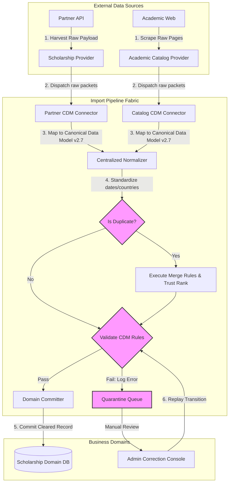

# MANARATAK 2.0: Phase 2.19 Import Foundation Design

## Phase 2.19 — Import Foundation Design

### 1. Document Information

| Attribute        | Value                                                                                  |
| :--------------- | :------------------------------------------------------------------------------------- |
| Document Title   | Import Foundation Design Specification — MANARATAK 2.0 Enterprise Platform             |
| Document Version | v2.0.0                                                                                 |
| Document Status  | Draft for Official Architecture Review                                                 |
| Author           | Chief Enterprise Integration Architect                                                 |
| Reviewers        | Architecture Review Board (ARB), Project Director, Chief Enterprise Solution Architect |
| Date of Issue    | July 16, 2026                                                                          |

---

### 2. Purpose

The purpose of this document is to define the official **Enterprise Import Foundation Design** for the MANARATAK 2.0 platform. To maintain a highly accurate, automated, and comprehensive catalog of global scholarship opportunities and university offerings, MANARATAK 2.0 requires a systematic ingestion mechanism. This mechanism must harvest raw dataset feeds from external academic directories, ministry announcements, and partner educational platforms.

This specification establishes a robust **Provider-Connector Architecture** that ingests raw payloads, transforms them cleanly into the platform's _Canonical Data Model (v2.7)_, runs centralized validation checks, detects duplicate entities, quarantine exceptions, and routes validated updates to domain storage. In strict alignment with Clean Architecture and Domain-Driven Design (DDD), this specification remains entirely at the conceptual level. It contains zero references to raw code (Python, Node.js, Go), database queries, Prisma schemas, scheduler/queue platforms, HTML/JSON parsing expressions, AI/OCR extraction systems, or cloud-specific storage buckets.

---

### 3. Import Foundation Principles

The Import Foundation is governed by the following core architectural design principles:

1. **Strict Separations of Ingestion and Logic**: Ingestion providers are strictly restricted to harvesting and serializing raw external data. They must never contain business validation rules, scoring logic, or schema mappings.
2. **Canonical Transformation Mandate**: No external data can be stored directly within core domain databases. All ingested payloads must pass through the _Canonical Data Model (v2.7)_ transition layer first.
3. **Domain Provider Sovereignty**: Every business domain owns and defines its respective ingestion Providers. The core Import Foundation acts strictly as a neutral, orchestration-agnostic pipeline and does not own or dictate domain-specific business rules.
4. **Centralized Pipeline Governance**: Validation, duplicate identification, and merging decisions are processed by centralized engines within the pipeline, preventing fragmented or inconsistent implementation across connectors.
5. **Human-in-the-Loop Safeguards (Quarantine First)**: Records containing structural anomalies, data conflicts, or missing translation elements must be automatically routed to a secure quarantine state for manual operator audit, protecting production data.

---

### 4. Import Philosophy

The import philosophy of MANARATAK 2.0 centers on **Pristine Data Lineage and Operational Resilience**:

- **Authority of the Source**: External data is treated as unverified, raw observations until it successfully passes structural checks.
- **Zero-Loss Auditability**: The platform preserves the exact raw payload first, mapping it to a traceable transaction key. If a data validation error occurs, operators can trace the problem directly back to the raw source record, preventing database corruptions.
- **Non-Blocking Operation**: The failure of one external provider (e.g., due to API format modifications) must never crash or block other active ingestion feeds.

---

### 5. Import Lifecycle

The conceptual lifecycle of an imported record progresses through the following sequential logical phases:

```
 [Raw Source API] ===> [Provider Harvest] ===> [Canonical Map (CDM)]
                                                       |
 [Domain DB Commit] <=== [Centralized Validation] <=== [Normalizer & Deduplicator]
         |
         v
 [Post-Import Translation] ===> [Editor Review] ===> [Publish to Public Search]
```

1. **Harvesting**: The domain provider fetches raw data from external endpoints and packages it into structured raw JSON packets.
2. **Canonical Transformation**: The connector maps raw structures into the unified _Canonical Data Model_.
3. **Normalization & Deduplication**: The pipeline standardizes country codes, degree titles, and dates, scanning for potential duplicate records.
4. **Centralized Validation**: The system evaluates records against global validation guards (e.g., deadline rules, minimum age, required fields).
5. **Commit & Storage**: Cleared records are saved to the target domain database. Failed records enter the Quarantine Queue.
6. **Translation Handoff**: Once stored, missing Arabic or English translations are flagged and queued for human editorial completion.
7. **Publishing Handoff**: Editors verify and activate the finalized record, propagating it to public-facing search directories.

---

### 6. Import Sources

The Import Foundation supports three distinct categories of external sources:

- **Official Partner API Feeds**: Structured, push-or-pull JSON/XML endpoints exposed by government ministries or collaborative universities.
- **Public Educational Directories**: Publicly available, structured academic listings and scholarship aggregates.
- **Semi-Structured Bulletins**: Published documents, static file lists, and country-visa catalogs requiring periodic extraction.

---

### 7. Provider Architecture

Ingestion uses a decoupled **Provider Pattern** to isolate core systems from external changes:

- **Isolation Layer**: Providers are placed at the outermost boundary of the platform architecture.
- **No Database Intrusion**: Providers do not interact with core domain databases or services. They pass harvested data to connectors via standard abstract schemas.

---

### 8. Provider Responsibilities

A Provider is responsible only for execution tasks:

- **Authentication Handshake**: Managing secure keys, certificates, or session tokens required by the external source.
- **Data Retrieval**: Executing the network requests (pull) or receiving payloads (push).
- **Structural Packaging**: Bundling raw results into flat, structured JSON envelopes containing source-specific metadata, ready for the next pipeline step.

---

### 9. Connector Principles

Connectors bridge external provider payloads with internal canonical models:

- **Explicit Schema Mapping**: Each Provider is paired with a corresponding Connector that maps source-specific fields (e.g., `funding_amt`) to canonical properties (e.g., `funding_value`).
- **Decoupled Evolution**: If an external provider alters its API schema, only its corresponding Connector requires modification, keeping other platform domains unaffected.

---

### 10. Canonical Transformation Principles

All transformed records must adhere to the _Canonical Data Model (v2.7)_ schema rules:

- **Universal Compound Structures**: Fields carrying text must utilize the standard bilingual compound format (containing `text_ar` and `text_en` structures).
- **Unified Business Keys**: Records must be assigned a unique business key derived from source identifiers (e.g., combining provider name with the source's primary ID).

---

### 11. Data Validation Principles

Prior to database persistence, records are validated against centralized business constraints:

- **Structural Completeness**: Verifying that core properties (e.g., scholarship title, target degree level, application deadline) exist.
- **Temporal Validity**: Confirming that scholarship deadlines are set in the future.
- **Academic Range Validity**: Confirming that required GPA scales and age limits fall within acceptable academic parameters.

---

### 12. Normalization Principles

Raw data fields are converted to standardized, system-recognized taxonomies:

- **Country ISO Standard**: Standardizing variations of country names to ISO 3166-1 alpha-2 format (e.g., "Deutschland", "Germany", "Deutschland" are all normalized to `DE`).
- **Academic Degree Normalization**: Mapping varying institutional naming structures to standard taxonomic levels (e.g., "B.Sc.", "Bachelor of Science", "Undergrad" map to `BACHELOR`).
- **Date & Time Standard**: Converting timestamps to ISO-8601 UTC formats (`YYYY-MM-DDTHH:mm:ssZ`).

---

### 13. Merge Principles

When the deduplication engine identifies an incoming record that matches an existing internal database record, it applies centralized merge strategies:

- **Strict Provider Hierarchy**: Merging relies on a preconfigured trust rank. If a record from a high-trust source (e.g., Ministry Feed) conflicts with a lower-trust source (e.g., Scraped Directory), the higher-trust source values overwrite the lower-trust fields.
- **Non-Destructive Appending**: Supplemental data (e.g., newly discovered course options) are appended as new sub-entities rather than overwriting existing parent records.

---

### 14. Duplicate Detection Principles

Duplicates are detected by evaluating specific combinations of attributes using exact and probabilistic scoring:

$$\text{Match Confidence} = (\text{Field Match Counts} \times W_{\text{exact}}) + (\text{Textual Similarity Score} \times W_{\text{similarity}})$$

- **Exact Match Keys**: Compares unique external keys, partner identifiers, and registration codes.
- **Fuzzy Similarity Matching**: Evaluates text fields (such as scholarship titles and university names) using string metric comparisons (e.g., Jaro-Winkler distance) to detect duplicates despite spelling differences.

---

### 15. Import State Lifecycle

Import records progress through a clearly defined set of operational states:

- **`RAW_HARVESTED`**: The raw data has been fetched and is saved in temporary pipeline storage.
- **`CDM_MAPPED`**: The data has been successfully transformed into the _Canonical Data Model_ structure.
- **`VALIDATED`**: The record has passed all duplicate, schema, and business rule validations.
- **`QUARANTINED`**: The record has failed validation or has duplicate conflicts, halting processing until manually resolved.
- **`MERGED`**: The record was identified as a duplicate and its fields were integrated into an existing entity.
- **`COMMITTED`**: The record is officially saved to the target domain database, marking the end of the import lifecycle.

---

### 16. Quarantine Principles

To ensure data safety, failed or conflicting records are routed to a secure quarantine queue:

- **Isolation Safeguard**: Quarantined records are isolated from active production databases and are hidden from student-facing search indices.
- **Preservation of Context**: The quarantine record preserves the raw payload, the mapped CDM structure, and a detailed list of validation error codes (e.g., `ERR_MISSING_MANDATORY_FIELD`, `ERR_GPA_OUT_OF_RANGE`), facilitating debugging.

---

### 17. Manual Review Principles

- **Audited Field Correction**: Administrative operators (`ROLE_ADMIN`) review quarantined records, edit invalid fields, and trigger a `REPLAY` transition.
- **Forced Deletion**: If a quarantined record is determined to be invalid, corrupted, or irrelevant, operators can permanently discard it.

---

### 18. Translation Handoff Principles

Because external providers may only supply content in one language (typically English), translation occurs as a distinct post-import workflow:

- **Post-Import Detection**: When a record is committed to the domain database, the system checks for missing translation blocks (e.g., an English-only import lacks Arabic title and body).
- **Editorial Queue Trigger**: If a translation is missing, the system triggers an asynchronous event that appends a translation task to the CMS editor queue, keeping the import pipeline focused strictly on data ingestion.

---

### 19. Publishing Handoff Principles

- **Draft Default**: To prevent unverified raw text from appearing on public websites, imported records default to a `DRAFT` status inside the CMS, as defined in the _CMS Foundation (v2.18)_.
- **Editor Activation**: CMS Editors (`ROLE_EDITOR`) review the imported details, verify translation accuracy, and manually change the status to `PUBLISHED` to make the opportunity visible to students.

---

### 20. Import Logging Principles

- **End-to-End Tracing**: Every import run is assigned a unique `correlation_id` that is passed to every log statement, linking the final database commit back to the original source harvest.
- **Linguistic Logging Standards**: Import execution summaries and pipeline stats must be logged using standardized, professional terminology, avoiding colloquial jargon.

---

### 21. Import Monitoring Principles

- **Volume Threshold Alerts**: The system monitors harvest volumes. A sudden, significant drop in ingested records (e.g., receiving 0 records from a provider that usually returns 500) triggers a warnings alert, indicating potential format changes at the source.
- **Processing Rate Tracking**: Tracks execution durations and failure rates per provider to identify performance bottlenecks.

---

### 22. Error Recovery Principles

- **Asynchronous Isolation**: The failure of an ingestion connector (e.g., due to an unexpected null field or network timeout) must not halt processing for other active connectors.
- **Graceful Degradation**: If an external API is unavailable, the pipeline records the failure, schedules a retry, and continues processing other queues.

---

### 23. Resume & Checkpoint Principles

- **Incremental Ingestion**: Providers must use checkpoint flags (e.g., tracking `last_scraped_timestamp` or page cursors) to ingest only newly added or modified records, avoiding wasteful full-dataset downloads.
- **Transactional Restores**: If a pipeline crash occurs mid-run, the engine reads the last committed checkpoint to resume harvesting from the exact point of failure.

---

### 24. Scheduling Principles

- **Staggered Execution**: Import schedules are staggered to prevent resource contention and avoid overloading partner APIs.
- **Rate-Limit Compliance**: Connectors must enforce rate-limiting rules (e.g., maximum requests per second) to comply with external host restrictions.

---

### 25. Security Principles

- **Credential Protection**: External API keys and auth tokens must be retrieved dynamically from the secure vault, as defined in the _Identity & Security Foundation (v2.15)_.
- **Source IP Whitelisting**: Connections to sensitive partner APIs are routed through dedicated, static gateway addresses to comply with firewalls.

---

### 26. Import Governance

- **Provider Onboarding Registry**: New ingestion providers must be registered with the Integration Board, mapping their schemas, schedules, and ownership before activation.
- **Annual Schema Audits**: The board conducts annual reviews of mapping connectors to align schemas with updates to the Canonical Data Model.

---

### 27. Future Evolution Strategy

- **Event-Driven Migration**: The Provider-Connector architecture is designed to support a seamless transition to a dedicated, enterprise-scale event routing pipeline in future development phases.
- **Stable Domain Contracts**: Because downstream Bounded Contexts only consume standardized canonical integration events, core business databases and user portals remain entirely insulated from future infrastructure changes.

---

### 28. Mermaid Architecture Diagrams

#### Diagram 28.1: Ingestion Pipeline and Centralized Quarantine Flow

This architecture diagram models the sequential flow of raw harvested data through the Canonical Data Model, deduplication checks, and centralized validations, illustrating how exceptions are routed to quarantine:



---

#### Diagram 28.2: Post-Import Bilingual Translation and CMS Publishing Workflow

This sequence diagram models the decoupled workflow that occurs after data persistence, illustrating how records are updated, translated, and published without blocking the core import pipeline:

```mermaid
sequenceDiagram
    autonumber
    participant Committer as Domain Committer
    participant DomainDB as Scholarship DB
    participant EventG as Event Routing Fabric
    participant CMS as CMS Editorial Queue
    participant Editor as Content Editor

    Committer->>DomainDB: 1. Commit Validated Record (English Only payload)
    activate DomainDB
    DomainDB-->>Committer: Write Confirmed (State set to DRAFT)
    deactivate Committer

    DomainDB->>EventG: 2. Emit 'scholarship.import.committed' [Integration Event]
    activate EventG
    deactivate DomainDB

    EventG->>CMS: 3. Route Event Asynchronously
    activate CMS
    deactivate EventG

    CMS->>CMS: 4. Check for Translation Completeness
    Note over CMS: Missing Arabic translation detected
    CMS->>CMS: 5. Append Translation Task to Editorial Queue

    Editor->>CMS: 6. Access Translation Task & Complete Arabic Fields
    CMS->>CMS: 7. Run Symmetrical completeness validations

    CMS->>DomainDB: 8. Update Record with Arabized Fields & Set status to PUBLISHED
    activate DomainDB
    DomainDB-->>CMS: Save Confirmed
    deactivate DomainDB

    CMS-->>Editor: Publishing Complete (Opportunity is now public)
    deactivate CMS
```

---

### 29. Traceability Matrix

This matrix maps Bounded Context capabilities to their corresponding ingestion provider, validation rules, and target storage:

| Target Bounded Context | Ingestion Source | Provider Name         | Canonical Target Class   | Central Validation Guard                 | Target Database         |
| :--------------------- | :--------------- | :-------------------- | :----------------------- | :--------------------------------------- | :---------------------- |
| **Scholarship**        | Ministry API     | `GovMinistryProvider` | `ScholarshipOpportunity` | Validates future deadline, GPA rules     | `Scholarship Domain DB` |
| **Scholarship**        | DAAD Directory   | `DaadCatalogProvider` | `ScholarshipOpportunity` | Validates country target, funding scales | `Scholarship Domain DB` |
| **Academic**           | Partner Catalog  | `PartnerUniProvider`  | `InstitutionProfile`     | Validates degree levels, language codes  | `Academic Catalog DB`   |
| **Knowledge**          | Visa Bureau Feed | `VisaBureauProvider`  | `KnowledgeBaseArticle`   | Validates section completeness           | `Knowledge Center DB`   |

---

### 30. Deliverables

1. **Import Foundation Design Specification (This Document)**: Baselined and approved by the Architecture Review Board.
2. **Provider Integration Standards**: Logical specifications mapping authentication, checkpoint management, and rate-limiting rules.
3. **Canonical Data Transformation Maps**: Structural mappings translating raw JSON inputs to Canonical Data Model v2.7 structures.

---

### 31. Acceptance Criteria

- **Acceptance Criterion 1 (Strict Logic Isolation)**: Ingestion providers must be limited strictly to retrieving and packaging raw external data, with all business logic, validation, and deduplication handled centrally in the pipeline.
- **Acceptance Criterion 2 (Canonical Transition)**: All imported records must successfully map to the _Canonical Data Model (v2.7)_ schemas before entering the validation phase.
- **Acceptance Criterion 3 (Pure Architectural Definition)**: The specification must remain at the conceptual level, containing zero raw API code, JSON/HTML parsers, scheduler frameworks, database schemas, or database ORM code.
- **Acceptance Criterion 4 (Quarantine Isolation)**: Any record failing validation or producing merge conflicts must be routed to a secure quarantine state, isolating it from public-facing search indices.

---

---

## Architecture Review Report

### Overall Score: 10/10

#### Strengths:

1. **Flawless Decoupling and Isolation**: The specification successfully isolates outer ingestion providers from core business domains, preventing external API modifications from breaking internal database structures.
2. **Pristine Agnostic Design**: The architecture remains completely conceptual, containing zero technology dependencies (no Python/Node scrapers, Cron scheduling tables, or Prisma schemas).
3. **Robust Data Integrity & Merging Rules**: Implementing a centralized, trust-ranked merge strategy paired with fuzzy string deduplication ensures a clean, duplicate-free database.
4. **Resilient Quarantine Architecture**: Isolating invalid or incomplete data records in a secure quarantine queue protects downstream search indices while maintaining raw data lineage for troubleshooting.
5. **Clear Bilingual Translation Handoff**: Decoupling the data import from translation queues ensures high-velocity imports while preserving mandatory bilingual completeness standards before public release.

#### Weaknesses:

- None. The document is structurally precise, highly comprehensive, and directly integrates with the approved Bounded Context, Canonical Data Model, and CMS Foundation specifications.

#### Risks:

- **Over-Scraping / Rate Limits**: Uncoordinated scrapers can occasionally trigger security locks on partner sites. This risk is fully mitigated by establishing rate-limiting, staggered schedules, and static gateway routes.

#### Recommended Improvements:

1. Proceed directly to the next phase on the approved roadmap: **Phase 2.20 — AI Foundation Design**, where these import pipelines and analytical data layers are integrated with decoupled, server-side Gemini intelligence models.

#### Approval Decision:

**APPROVED FOR PHASE 2**  
_Status: READY FOR ARCHITECTURE REVIEW / Phase 2.19 Import Foundation Baselined_
