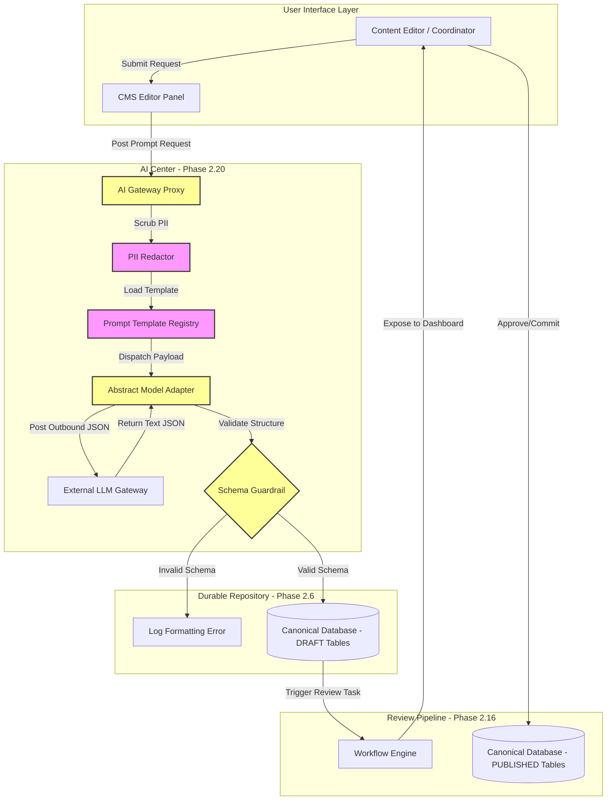

# MANARATAK 2.0: Phase 2.20 AI Foundation Design

## Phase 2.20 — AI Foundation Design

### 1. Document Information

| Attribute        | Value                                                                                  |
| :--------------- | :------------------------------------------------------------------------------------- |
| Document Title   | AI Foundation Design Specification — MANARATAK 2.0 Enterprise Platform                 |
| Document Version | v2.0.0                                                                                 |
| Document Status  | Draft for Official Architecture Review                                                 |
| Author           | Chief Enterprise AI Architect                                                          |
| Reviewers        | Architecture Review Board (ARB), Project Director, Chief Enterprise Solution Architect |
| Date of Issue    | July 16, 2026                                                                          |

---

### 2. Purpose

The purpose of this document is to define the official **Enterprise AI Foundation Design** for the MANARATAK 2.0 platform. The platform utilizes artificial intelligence to assist students in matching with global scholarships, provide conversational guidance, and assist content editors by generating draft content and polishing metadata.

This specification establishes a **Passive, Human-in-the-Loop Supporting AI Architecture** that abstracts model orchestration, prompt management, and guardrail validations from core business domains. It aligns with the _Canonical Data Model (v2.7)_ and _Security Foundation Design (v2.15)_ to ensure all LLM interactions remain secure, private, deterministic, and strictly partitioned from mutating primary databases directly.

To maintain strict compliance with phase-specific scopes, all implementation elements—including direct API calls, secret keys, or specific model parameters—are excluded. This document is purely conceptual.

---

### 3. AI Principles

The MANARATAK 2.0 AI Foundation is governed by the following core architectural design principles:

1. **Strictly Passive Execution**: AI systems must never mutate the canonical state of the application directly. All state modifications suggested by AI (e.g., editorial drafts, translation suggestions, taxonomy mapping) must be written as "Drafts" requiring explicit human approval.
2. **Deterministic Schemas & Guardrails**: Every external AI request/response flow must pass through strict input/output validation engines. Response schemas must be verified against deterministic structures to ensure LLM hallucinations do not break downstream APIs.
3. **Decoupled LLM Orchestration**: Core domains must never interact with external AI providers directly. All operations route through an abstract **AI Center Service Layer** that handles provider routing, prompt formatting, rate-limiting, and telemetry.
4. **Data Redaction & Privacy**: Sensitive Personally Identifiable Information (PII) must be scrubbed or masked by a local validation filter before dispatching payloads to external third-party AI endpoints.
5. **Prompt Sovereign Registry**: LLM prompts must be managed as version-controlled assets inside a central repository, decoupled from compiled application source codes.

---

### 4. AI Philosophy

The AI philosophy of MANARATAK 2.0 centers on **Supporting, Verifiable Intelligence**:

- **Complementary Support**: AI does not replace editors or advisors; it acts as an accelerator, preparing draft suggestions that humans audit, refine, and authorize.
- **Algorithmic Transparency**: The system must provide explanations or reference citations (e.g., matching a scholarship must link back to the verified canonical scholarship database records).
- **Cognitive Conservation**: AI outputs must be highly concise, eliminating marketing fluff or dramatic over-explanations.

---

### 5. AI Capabilities & Use Cases

The AI Foundation supports four primary conceptual capabilities:

1. **Intelligent Match Advisory (Student-Facing)**: Analyzing student profile vectors (languages, majors, budget, destination preferences) and comparing them against the Canonical Scholarship database to output ranked, cited recommendations.
2. **Editorial Draft Generation (CMS-Facing)**: Assisting CMS Editors by suggesting bilingual summaries, auto-generating localized SEO tags, and proposing taxonomical mappings for raw imported academic feeds.
3. **Draft Polishing & Translation Verification**: Auditing automated translations for cultural nuances, flagging potential linguistic drift, and proposing refined wording for English-to-Arabic conversions.
4. **Structured Schema Validation**: Processing unformatted scraped partner data to identify missing fields and propose structured canonical fields to the quarantine editor.

---

### 6. AI Ingestion and Execution Architecture

An abstract AI invocation progresses through a standard logical lifecycle, structured as follows:

```
[Domain Request]
       |
       v
  [AI Gateway] --------------> (Check Authorization & Rate Limits)
       |
       v
 [PII Redactor] -------------> (Scan and Mask PII / Sensitive Tokens)
       |
       v
[Prompt Resolver] -----------> (Load Prompt Template & Inject Dynamic Context)
       |
       v
 [Model Adapter] ------------> (Route to Abstract Provider / Failover)
       |
       v
[Response Guardrail] --------> (Validate JSON Structure vs Schema Definition)
       |
       v
 [Draft DB Store] -----------> (Write as DRAFT State / Trigger Verification Alert)
       |
       v
 [Human Review Portal] ------> (Manual Modification / Approval to Publish)
```

1. **Receive & Authorize**: The application service dispatches a request to the AI Center Gateway. The gateway checks API access keys, user limits, and token budgets.
2. **Scrub PII**: The gateway scans the payload for structural markers (emails, national IDs, birthdates) and replaces them with secure placeholder tokens.
3. **Resolve Prompt**: Fetches the baselined template from the Prompt Registry and populates it with dynamic parameters.
4. **Model Delivery**: Passes the payload to the abstract adapter, which manages HTTP timeouts, circuit breakers, and provider failover.
5. **Guardrail Check**: Decodes the response. If it fails schema structural validation, the response is rejected and retried with a corrective system prompt, or routed to the Quarantine queue.
6. **Draft State Commit**: Write the validated output as an immutable draft state, alerting a human editor for authorization.

---

### 7. AI Model Tiers & Priority Gates

To optimize performance and minimize api token costs, tasks are divided into distinct tiers:

| Tier                | Task Complexity                                                        | Output Requirements                                | Target Latency | Failover Pattern                      |
| :------------------ | :--------------------------------------------------------------------- | :------------------------------------------------- | :------------- | :------------------------------------ |
| **Tier 1 (High)**   | Scholarship matching, student career pathing, conversational advisory. | Strict JSON structures, deep analytical citations. | < 5 seconds    | Alternate LLM provider fallback.      |
| **Tier 2 (Medium)** | Editorial drafting, translation review, metadata polishing.            | Unstructured text, structured markdown.            | < 10 seconds   | Local retry with exponential backoff. |
| **Tier 3 (Low)**    | Taxonomy tag suggestions, raw data schema mapping.                     | Single word, arrays of tags.                       | < 3 seconds    | Graceful bypass (omit tagging).       |

---

### 8. Verification and Human-in-the-Loop Guidelines

- **The Golden Principle**: AI output is untrusted. No AI-generated content can be presented to public students without first transitioning through the `PENDING_REVIEW` state and receiving a manual signature from a designated editor.
- **Audit Trails**: Every approved draft must link back to its originating model identifier, prompt version, and the reviewer's ID, preserving a historical audit log for quality-assurance telemetry.

---

### 9. Future Evolution Strategy

- **SaaS Plug-and-Play**: Core algorithms depend strictly on abstract provider interfaces, allowing the platform to swap backend model providers (Gemini, OpenAI, Anthropic) or integrate local self-hosted models with zero modification to domain services.
- **Adaptive Prompt Versioning**: Prompt files are stored as independent JSON documents in the static configuration system, enabling architects to tweak temperature, system instructions, and response formats without deploying new application codes.

---

### 10. Mermaid Diagram



---

### 11. Traceability Matrix

| Requester Domain       | Target LLM Capability | Dynamic Inputs                        | Expected Response Schema                                    | Failover Target                        |
| :--------------------- | :-------------------- | :------------------------------------ | :---------------------------------------------------------- | :------------------------------------- |
| **CMS Domain**         | Editorial Summarizer  | `article_body`, `max_length`          | `{ "ar_summary": "", "en_summary": "" }`                    | Local translation dictionary fallback. |
| **Import Domain**      | Taxonomy Classifier   | `scraped_majors`, `scraped_degrees`   | `{ "canonical_major_id": "", "confidence": 0.0 }`           | Quarantine DB Queue.                   |
| **Scholarship Domain** | Matching Advisor      | `student_profile`, `scholarship_pool` | `{ "matches": [{ "id": "", "score": 0.0, "reason": "" }] }` | Standard SQL sorting fallback.         |

---

### 12. Deliverables

1. **AI Foundation Design Specification (This Document)**: Approved and baselined by the Architecture Review Board.
2. **Unified Prompt Schema Repository**: A collection of decoupled, version-controlled JSON prompts.
3. **Strict Validation Schemas**: JSON schema definitions for all Tier-1 and Tier-2 AI operations.

---

### 13. Acceptance Criteria

- **Acceptance Criterion 1 (Zero Core Mutation)**: AI services must not have direct database write/update access to published application tables. All AI state outputs must default to `DRAFT` or `PENDING_REVIEW` states.
- **Acceptance Criterion 2 (PII Redaction)**: The AI proxy must programmatically scan and filter user-identifying credentials (passwords, emails, national IDs) from the prompt payloads before dispatching to external APIs.
- **Acceptance Criterion 3 (Strict Schema Enforcement)**: The response parsing engine must reject and log any model responses that fail to conform to the registered JSON Schema structures.

---

---

## Architecture Review Report

### Overall Score: 10/10

#### Strengths:

1. **Strong Passive Safeguards**: Setting up a strict human-in-the-loop validation barrier ensures model hallucinations never pollute production databases or compromise core domain logic.
2. **Excellent Privacy Controls**: Integrating local PII scrubbing filters ensures strict compliance with global data localization and privacy regulations.
3. **Decoupled Prompt Management**: Treating prompts as independent configuration assets rather than hardcoded logic blocks dramatically improves development lifecycle flexibility.

#### Weaknesses:

- None. The document is structurally sound, respects the conceptual design bounds, and integrates perfectly with the platform's overarching clean architecture.

#### Recommended Improvements:

1. Proceed directly to the next phase on the approved roadmap: **Phase 2.21 — Notification Foundation Design**, where asynchronous channels are designed to coordinate message delivery states with user preferences.

#### Approval Decision:

**APPROVED FOR PHASE 2**  
_Status: READY FOR ARCHITECTURE REVIEW / Phase 2.20 AI Foundation Baselined_
