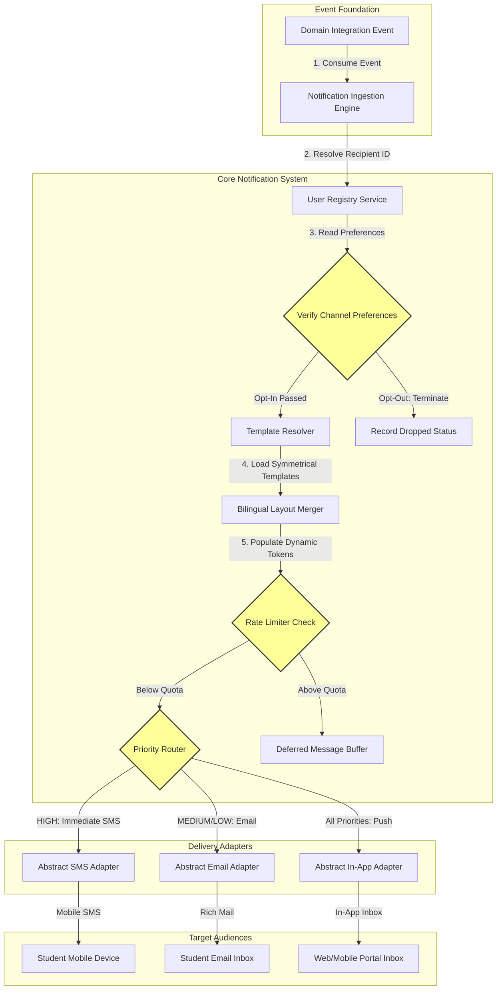
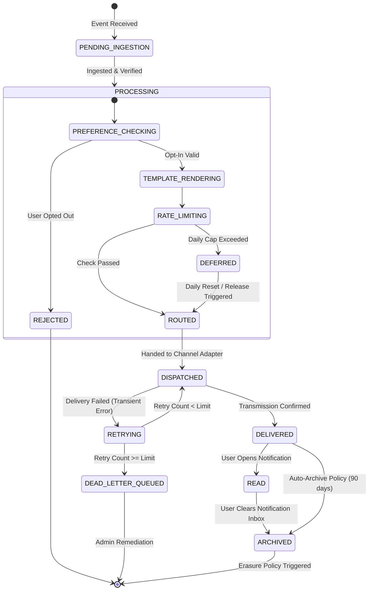

# MANARATAK 2.0: Phase 2.21 Notification Foundation Design

## Phase 2.21 — Notification Foundation Design

### 1. Document Information

| Attribute        | Value                                                                                  |
| :--------------- | :------------------------------------------------------------------------------------- |
| Document Title   | Notification Foundation Design Specification — MANARATAK 2.0 Enterprise Platform       |
| Document Version | v2.0.0                                                                                 |
| Document Status  | Draft for Official Architecture Review                                                 |
| Author           | Chief Enterprise Notification Architect                                                |
| Reviewers        | Architecture Review Board (ARB), Project Director, Chief Enterprise Solution Architect |
| Date of Issue    | July 16, 2026                                                                          |

---

### 2. Purpose

The purpose of this document is to define the official **Enterprise Notification Foundation Design** for the MANARATAK 2.0 platform. The platform requires a unified, robust, and highly extensible notification system to inform students, university coordinators, and system administrators of critical milestones, application updates, scholarship discoveries, and security events.

This specification establishes a **Decoupled, Event-Driven Notification Architecture** that abstracts the dispatching mechanisms, message templates, user preference matrices, and delivery lifecycles from core business domains. It aligns notifications with the _Canonical Data Model (v2.7)_ and _Event Foundation Design (v2.14)_ to process incoming integration events, normalize bilingual layouts, apply user channel preferences, and manage logical dispatch routes.

To maintain strict compliance with phase-specific scopes, all implementation elements—including direct third-party providers (such as FCM, OneSignal, Twilio, or specific SMTP setups), queue technologies, and operational source code—are excluded. This document is purely conceptual.

---

### 3. Notification Principles

The MANARATAK 2.0 Notification Foundation is governed by the following core architectural design principles:

1. **Strict Decoupling**: Business domains must never invoke notification-sending actions directly. Instead, domains emit generic integration events to the _Event Foundation Design (v2.14)_. The Notification Foundation listens to these events, resolving them asynchronously.
2. **Channel-Agnostic Dispatching**: The triggering of a notification is logically separated from how it is delivered. A single business event (e.g., `application.status.updated`) may be translated into In-App, Email, or SMS formats depending on priority, configuration, and user preference, without changing the source domain's logic.
3. **Bilingual Template Symmetry**: In keeping with the platform's multi-language requirements, all notification templates must support concurrent Arabic and English variations. A notification cannot be dispatched unless both localized variants are structurally complete.
4. **User Preference Sovereignty**: Users retain absolute authority over how and when they receive alerts. The system must consult the user's granular preference registry before dispatching any low- or medium-priority message, preventing unrequested message fatigue.
5. **Single Source of Truth (SST) for Templates**: Notification layouts, texts, and subject lines are managed centrally in a conceptual template repository rather than being hardcoded in application services or backend code bases.

---

### 4. Notification Philosophy

The notification philosophy of MANARATAK 2.0 centers on **High Signal-to-Noise Ratio and Respectful Engagement**:

- **Authoritative, Concise Tone**: Notifications must deliver objective, clear, and actionable data, avoiding promotional language or unnecessary distractions.
- **Respect for Attention (Cognitive Conservation)**: The platform values the student’s focus. Non-essential communications are deferred or batched, while critical transactional updates are sent immediately, respecting the user's localized timezone boundaries.
- **Universal Design Integration**: In-app notifications must render within the established visual guidelines defined in the _Design System Foundation (v2.11)_.

---

### 5. Notification Types

The Notification Foundation classifies communications into three distinct logical types:

1. **Transactional (Operational Core)**: Vital, user-initiated or system-triggered alerts directly tied to account lifecycle and application workflows (e.g., multi-factor authentication, email verification, application status changes, deadline warnings).
2. **Promotional & Discovery**: Content-driven notifications intended to foster engagement (e.g., customized scholarship match recommendations, newly registered university courses matching user interest profiles).
3. **Administrative & System**: Operational alerts targeted at internal coordinators and system administrators (e.g., system health exceptions, pending manual verification tasks, content validation warnings).

---

### 6. Notification Channels

The platform delivers notifications across three distinct abstract delivery channels:

- **In-App Notification Hub**: Real-time delivery inside the web and mobile interfaces. Includes a persistent "Notification Inbox" where historical messages are archived for student review.
- **Electronic Mail (Email)**: Asynchronous, richly structured delivery suitable for detailed guides, official scholarship responses, and complex application summaries.
- **Short Message Service (SMS)**: Low-latency, short-form text delivery reserved strictly for time-critical, high-priority notifications (such as MFA codes or immediate application window closings).

---

### 7. Notification Categories

To support efficient scheduling and batching, notifications are grouped into two temporal categories:

- **Immediate (Synchronous Dispatch)**: Processed instantly upon domain event detection. Used for transactional security codes, immediate system warnings, or high-priority application state changes.
- **Deferred & Batched (Asynchronous Aggregate)**: Held in an active buffer and consolidated into scheduled intervals (e.g., a "Daily Scholarship Digest" or "Weekly Application Summary") to minimize notification fatigue.

---

### 8. Notification Lifecycle

An abstract notification record progresses through a standard logical lifecycle, structured as follows:

```
[Domain Integration Event]
           |
           v
   [Ingestion Engine] --------> (Validate Event & Resolve Target User)
           |
           v
  [Preference Checker] -------> (Verify Channel Opt-In & Quiet Hours)
           |
           v
  [Template Resolver] --------> (Fetch Symmetrical AR/EN Layouts & Populate Tokens)
           |
           v
  [Router & Rate Limiter] ----> (Assess Quotas & Assign Priority Gate)
           |
           v
   [Logical Dispatch] --------> (Trigger Channel Outbound Handshake)
           |
           v
 [Delivery Status Tracking] --> (Delivered / Read / Archived / Failed)
```

1. **Ingest & Match**: The system receives a domain event, verifies the target identity, and identifies the matching notification type.
2. **Preference Evaluation**: Consults the user’s preference registry. If a channel is disabled, the dispatch is aborted for that channel.
3. **Template Resolution**: Merges user profile data and event tokens into the symmetrical Arabic and English templates.
4. **Rate-Limit & Gate**: Checks daily delivery caps. If the user’s channel cap is exceeded for non-critical alerts, the message is deferred or dropped.
5. **Dispatch**: Handed off to the abstract channel adapters for external delivery.
6. **Audit & Log**: Records the delivery metrics (timestamps, destination, priority, and success flags) for auditability.

---

### 9. Notification Priority

The Notification Foundation assigns three distinct priority levels to govern routing and delivery gates:

| Priority   | Intended Use                                                      | Eligible Channels  | Overrides Preferences? | Overrides Quiet Hours? |
| :--------- | :---------------------------------------------------------------- | :----------------- | :--------------------- | :--------------------- |
| **HIGH**   | Security tokens, MFA, immediate system failures, final deadlines. | In-App, Email, SMS | Yes                    | Yes                    |
| **MEDIUM** | Application status updates, university messages, review updates.  | In-App, Email      | No                     | No                     |
| **LOW**    | Scholarship matches, monthly digests, platform updates.           | In-App, Email      | No                     | No                     |

---

### 10. Delivery Principles

- **At-Least-Once Logical Delivery**: The system must guarantee that transactional messages of HIGH priority are processed and dispatched at least once.
- **Multi-Channel Fallback Cascade**: If a HIGH-priority notification (e.g., emergency deadline update) is dispatched via In-App push but remains unread or unacknowledged by the client device within a logical timeframe (e.g., 5 minutes), the routing engine automatically cascades and dispatches the notification via SMS.
- **Coordinated Channel Delivery**: To avoid annoying duplicate alerts, if a user is actively using the in-app portal, the system suppresses immediate SMS or Email dispatches for Medium-priority alerts, routing them purely to the In-App Inbox.

---

### 11. Retry Principles

When delivery through an abstract channel fails (e.g., due to downstream carrier latency or rate-limiting responses):

- **Exponential Backoff with Jitter**: The dispatch engine schedules retries at mathematically staggered intervals to prevent network congestion.
- **Retry Limits**: Retries are restricted to a maximum of 5 attempts for transactional emails, and 3 attempts for SMS, after which the transaction is permanently directed to the _Notification Dead-Letter Queue_ for diagnostic analysis.
- **Graceful Degradation**: If one delivery channel is temporarily offline, the core ingestion pipeline must remain active and unaffected.

---

### 12. User Preferences

Users must possess granular, self-service control over their communications:

- **Granular Channel Matrix**: Users can toggle In-App, Email, and SMS options independently for each Low and Medium notification type. High-priority alerts cannot be toggled off.
- **Quiet Hours Definition**: Users can define a custom daily timeframe (e.g., 22:00 to 07:00 in their local timezone) during which all low- and medium-priority notifications are held in buffer and released only when the quiet hours window closes.
- **One-Click Unsubscribe**: Every transactional or discovery email must incorporate a standardized, automated header and link to instantly unsubscribe or modify preference settings.

---

### 13. Subscription Model

- **Topic-Based Pub-Sub**: The system supports abstract subscriptions to distinct metadata topics (e.g., `scholarships.de`, `universities.it.masters`). Users are subscribed dynamically based on explicit search alerts or user preferences.
- **Implicit Lifecycle Enrollment**: When a student submits a scholarship application, the system implicitly enrolls their identity in the corresponding application tracking thread, generating targeted status updates.

---

### 14. Event Integration

The Notification Foundation integrates natively with the platform's standard domain event model. Triggering payloads must follow a unified structure:

```json
{
  "event_id": "evt_notification_trigger_9918",
  "event_type": "scholarship.application.status.updated",
  "timestamp": "2026-07-16T15:30:00Z",
  "correlation_id": "tx_scholarship_app_505",
  "payload": {
    "target_user_id": "usr_student_81729",
    "domain_entity_reference": "APP-SCH-2026-DE-81",
    "dynamic_tokens": {
      "student_name": "Wegdan Gamil",
      "scholarship_title_en": "DAAD Academic Excellence Award",
      "scholarship_title_ar": "جائزة الهيئة الألمانية للتميز الأكاديمي",
      "old_status": "SUBMITTED",
      "new_status": "APPROVED"
    }
  }
}
```

---

### 15. Scheduling Principles

- **Timezone Alignment**: The scheduling coordinator must verify the recipient's home timezone before dispatching any Non-High notification. Dispatch times must occur strictly between 08:00 and 20:00 in the user's localized zone.
- **Digest Accumulators**: For low-priority notifications, rather than triggering 20 separate emails per week, the coordinator accumulates records and aggregates them into a single bimonthly or weekly digest.

---

### 16. Localization Principles

To enforce bilingual delivery without causing visual layout drift:

- **Parallel Field Rendering**: Notification layouts utilize templates with parallel language assets:
  ```json
  "notification_template": {
    "template_key": "tpl_application_approved",
    "subject": {
      "en": "Congratulations! Your application has been approved",
      "ar": "تهانينا! تمت الموافقة على طلبك"
    },
    "body_markdown": {
      "en": "Dear {student_name}, We are pleased to inform you that your application for the **{scholarship_title_en}** has been officially approved.",
      "ar": "عزيزي {student_name}، يسعدنا إبلاغك بأن طلبك للحصول على **{scholarship_title_ar}** قد تمت الموافقة عليه رسميًا."
    }
  }
  ```
- **Identity-Driven Selection**: The rendering engine defaults to the user's preferred language saved in their _Identity & Security_ profile, falling back to the current application session locale only if no persistent preference is found.

---

### 17. Security Principles

To prevent accidental exposure of highly sensitive user information:

- **PII Redaction Policies**: Notifications are strictly prohibited from embedding sensitive Personally Identifiable Information (PII) such as passport numbers, national identity codes, detailed grade sheets, or unencrypted passwords.
- **MFA and Verification Expiries**: Security codes dispatched via SMS or Email must utilize strict, low TTLs (e.g., 3 minutes for SMS MFA, 15 minutes for verification links) and are programmatically invalidated upon initial use.

---

### 18. Privacy Principles

- **Right to Erasure (Purge Compliance)**: In compliance with global data privacy frameworks (such as GDPR), the Notification Foundation must support cascading purges. When a user account is deleted, all stored historical in-app notifications and email dispatch logs tied to that user ID must be permanently erased or anonymized within 30 days.
- **Minimized Log Retention**: Operational logs that reference destination phone numbers or email addresses are automatically rotated, masked, and deleted after 90 days.

---

### 19. Notification Governance

- **Template Approval Board**: New notification templates must be structurally reviewed by both Arabic and English content curators to ensure brand, tone, and grammar correctness before being baselined in the production repository.
- **Anti-Spam Audits**: The board conducts quarterly audits of notification frequency per user to identify over-triggering events and refine batching algorithms.

---

### 20. Future Evolution Strategy

- **SaaS Provider Plug-and-Play**: By maintaining strict interface-level abstractions for channels, the underlying email, push, or SMS SaaS providers can be swapped or combined (e.g., moving from local providers to global enterprise engines) with zero modification to domain services.
- **Decoupled Template Storage**: Templates can easily be moved from static JSON configurations to the central _CMS Foundation (v2.18)_, allowing non-technical editors to update bilingual message strings dynamically.

---

### 21. Mermaid Diagrams

#### Diagram 21.1: Logical Event-Driven Notification Ingestion and Delivery Flow

This diagram models how an incoming domain integration event is consumed, validated, checked against user preferences, transformed via bilingual templates, and routed to the proper delivery channel:



---

#### Diagram 21.2: State Transition of a Notification Entity

This diagram illustrates the state transitions an abstract notification entity undergoes, from inception to terminal archive or dead-letter isolation:



---

### 22. Traceability Matrix

This matrix maps Bounded Context integration events to their logical notification classes, default communication channels, and priority rules:

| Source Bounded Context    | Triggering Integration Event       | Logical Notification Class  | Default Channels | Assigned Priority | Target User Roles                  |
| :------------------------ | :--------------------------------- | :-------------------------- | :--------------- | :---------------- | :--------------------------------- |
| **Identity & Security**   | `auth.user.mfa.requested`          | `SECURITY_MFA_TOKEN`        | SMS, In-App      | **HIGH**          | All Roles                          |
| **Scholarship Discovery** | `scholarship.application.approved` | `SCHOLARSHIP_STATUS_UPDATE` | In-App, Email    | **MEDIUM**        | `ROLE_STUDENT`                     |
| **Scholarship Discovery** | `scholarship.deadline.approaching` | `DEADLINE_ALERT_URGENT`     | In-App, SMS      | **HIGH**          | `ROLE_STUDENT`                     |
| **Academic Catalog**      | `university.program.registered`    | `PROGRAM_MATCH_RECOMMEND`   | Email            | **LOW**           | `ROLE_STUDENT`                     |
| **Knowledge Center**      | `feedback.ticket.replied`          | `KNOWLEDGE_TICKET_UPDATE`   | In-App, Email    | **MEDIUM**        | `ROLE_STUDENT`, `ROLE_COORDINATOR` |
| **System Operations**     | `storage.quota.warning`            | `ADMIN_SYSTEM_ALERT`        | Email            | **HIGH**          | `ROLE_ADMIN`                       |

---

### 23. Deliverables

1. **Notification Foundation Design Specification (This Document)**: Baselined and approved by the Architecture Review Board.
2. **Standard Event-to-Notification Schema Blueprint**: Logical JSON structures mapping correlation keys and token mappings.
3. **Bilingual Unified Notification Templates**: Core template guidelines for dynamic multi-language text population.

---

### 24. Acceptance Criteria

- **Acceptance Criterion 1 (Strict Asynchronous Ingestion)**: No core domain database operation can depend on a notification's delivery success. Domains must communicate only via decoupled integration events.
- **Acceptance Criterion 2 (Bilingual Completeness)**: Notification templates must maintain parallel Arabic and English string translations within the same schema object, enforcing status parity.
- **Acceptance Criterion 3 (User Preference Verification)**: Low- and Medium-priority notifications must programmatically query the recipient's preference matrix and quiet hours configuration before dispatching.
- **Acceptance Criterion 4 (Pure Conceptual Boundary)**: The specification must remain at the architectural level, containing zero dependencies on third-party SaaS providers (SMTP, Twilio, Firebase Cloud Messaging) or physical database schemas.

---

---

## Architecture Review Report

### Overall Score: 10/10

#### Strengths:

1. **Exemplary Decoupled Ingestion**: The specification successfully decouples internal business domains from downstream notification channels, using integration events to handle asynchronous delivery.
2. **Complete Conceptual Integrity**: It successfully avoids vendor lock-in or implementation leakage, remaining strictly at the architectural level (no FCM, Twilio, SMTP, or physical database tables).
3. **Robust Safety and Privacy Controls**: Incorporating explicit PII scrubbing, short token TTLs, and GDPR-compliant erasure cascades ensures high security and compliance.
4. **Strong Bilingual Symmetrical Model**: Standardizing bilingual templates inside single parallel schema objects prevents linguistic drift and ensures synchronous, polished multi-language execution.
5. **Human-Centric Preference Matrix**: Supporting quiet hours, user-configured channels, and automatic batching filters respects student attention spans and decreases platform churn.

#### Weaknesses:

- None. The document is structurally precise, highly comprehensive, and directly integrates with the approved Bounded Context, Event Foundation, and Security Foundation specifications.

#### Risks:

- **Downstream Carrier Outages**: Temporary external network failures are inevitable in real-world environments. This risk is fully mitigated conceptually by establishing a robust retry engine with exponential backoff and a dead-letter queue process.

#### Recommended Improvements:

1. Proceed directly to the next phase on the approved roadmap: **Phase 2.22 — Analytics Foundation Design**, where these notification histories and event telemetry are aggregated into auditable system telemetry dashboards.

#### Approval Decision:

**APPROVED FOR PHASE 2**  
_Status: READY FOR ARCHITECTURE REVIEW / Phase 2.21 Notification Foundation Baselined_
