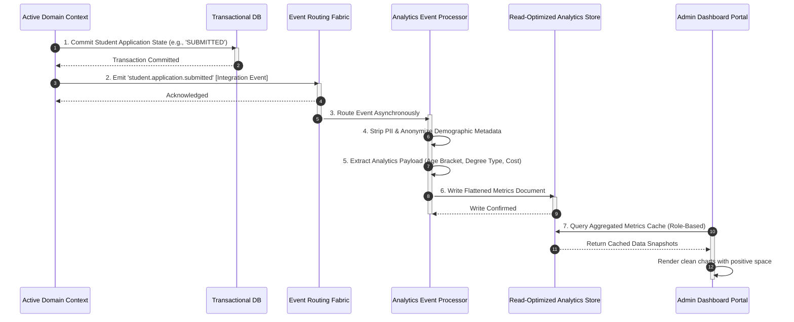

# MANARATAK 2.0: Phase 2.22 Analytics Foundation Design

## Phase 2.22 — Analytics Foundation Design

### 1. Document Information

| Attribute        | Value                                                                                  |
| :--------------- | :------------------------------------------------------------------------------------- |
| Document Title   | Analytics Foundation Design Specification — MANARATAK 2.0 Enterprise Platform          |
| Document Version | v2.0.0                                                                                 |
| Document Status  | Draft for Official Architecture Review                                                 |
| Author           | Chief Enterprise Analytics Architect                                                   |
| Reviewers        | Architecture Review Board (ARB), Project Director, Chief Enterprise Solution Architect |
| Date of Issue    | July 16, 2026                                                                          |

---

### 2. Purpose

The purpose of this document is to define the official **Enterprise Analytics Foundation Design** for the MANARATAK 2.0 platform. As a complex, multi-tenant digital ecosystem coordinating global scholarship processes, partner university catalogs, file ingestion pipelines, and student applications, MANARATAK 2.0 requires deep analytical visibility.

To support strategic decision-making while preserving core operational speeds, this specification establishes a completely decoupled, event-driven analytical model. It defines the business, operational, platform, user-behavior, search, scraper, workflow, and auxiliary AI metrics required for platform analysis. In strict alignment with Clean Architecture and Zero Trust Security models, this document maintains a purely conceptual focus. It contains zero references to third-party reporting tools (e.g., Google Analytics, Mixpanel, Tableau, PowerBI), database queries, SQL scripts, API execution routes, dashboard implementation code, or physical cloud storage platforms.

---

### 3. Analytics Principles

The MANARATAK 2.0 Analytics Foundation is governed by five non-negotiable architectural principles:

1. **Strict Analytical-Operational Decoupling**: Analytics must never run direct queries on transactional databases. Aggregated metric models must be populated asynchronously from read-optimized analytical data stores, ensuring high-frequency user operations are never impacted by diagnostic queries.
2. **Event-Driven Collection (Loose Coupling)**: Metrics collection is entirely passive. Analytical pipelines harvest raw data points by subscribing to integration and system events emitted by Bounded Contexts, preventing localized telemetry code from injecting dependency noise into core domain entities.
3. **Anonymized & Aggregated Privacy-First Standard**: The analytics layer must never store raw personally identifiable information (PII). All user behavior, geographic, and demographic metrics must be anonymized, masked, or aggregated at the ingestion point, maintaining strict privacy compliance.
4. **Bilingual Semantic Tracking Symmetricality**: Analytical reporting models, category tags, filter outputs, and dashboard taxonomies must natively support parallel bilingual formats (Arabic and English), keeping insights consistent for diverse administrative stakeholders.
5. **Traceable Business Lineage**: Every recorded metric, pipeline run, or funnel conversion step must encapsulate standard tracing metadata (including correlation IDs), linking analytical snapshots back to original operational contexts for continuous audit validation.

---

### 4. Analytics Philosophy

The analytics philosophy of MANARATAK 2.0 centers on **Actionable Intelligence and Responsible Optimization**:

- **Outcome over Volume**: Rather than hoarding unstructured system logs or vanity clicks, the foundation focuses strictly on metrics that drive business decisions, such as identifying scholarship matching bottlenecks, scraper mapping failures, and student drop-off points.
- **Separation of Concerns**: The analytics pipeline does not contain business or domain validation logic. It serves strictly as a passive, structured recorder of historical platform transitions, relying on authoritative Bounded Contexts to dictate state truths.

---

### 5. Business Metrics

Business metrics evaluate the strategic success of the platform's educational missions:

- **Scholarship Allocation Efficiency**: The ratio of completed application acceptances against total published scholarship slots.
- **Demographic Matching Diversity**: Aggregated counts of applicant distributions categorized by age, gender, regional origins, and destination countries.
- **Academic Field Alignment**: Metrics tracking enrollment distributions across key disciplines (e.g., Engineering, Medicine, Humanities).
- **Funding Model Distribution**: Analysis of fully-funded vs. partially-funded program enrollment trends.

---

### 6. Operational Metrics

Operational metrics evaluate the technical health, capacity, and latency of the platform:

- **Document Verification Cycle Times**: The average time elapsed between student file upload and manual administrative clearance.
- **Ingestion Queue Latency**: The duration from raw provider harvest to canonical ingestion validation.
- **System Exception Frequency**: Counts and categories of platform failures (such as rate-limiting blockages, network timeouts, and decryption anomalies) grouped by Bounded Context.
- **SLA Compliance Rates**: The percentage of administrative review tasks completed within defined operational timeframes.

---

### 7. Platform KPIs

Platform Key Performance Indicators (KPIs) measure the overall velocity, throughput, and user engagement of the platform:

- **Active Applicant Funnel Velocity**: The average time it takes an applicant to transition through the complete state machine lifecycle from `DRAFT` to `ACCEPTED`.
- **Search Conversion Effectiveness**: The ratio of search queries that result in a student bookmarking, sharing, or applying to a scholarship.
- **Scraper Yield Quality**: The percentage of ingested raw scraper records that successfully map to the Canonical Data Model without triggering quarantine states.
- **Resource Cost-per-Application**: Aggregated system resource costs calculated per successful student match.

---

### 8. User Analytics

User behavior tracking helps optimize application experiences and identify friction points:

- **Funnel Drop-off Mapping**: Step-by-step analysis of where student applicants abandon their profiles or applications (e.g., identifying high drop-offs at the document upload stage).
- **Workspace Interaction Depth**: Aggregated tracking of feature utilization inside the student portal, such as save rates for scholarship favorites.
- **Linguistic Preference distribution**: Metrics showing language choice trends (Arabic vs. English) during search, profile editing, and article consumption.

---

### 9. Search Analytics

Search telemetry informs content gaps and keyword optimizations, as defined in the _Search Foundation (v2.17)_:

- **Unmatched Queries (Zero-Result Search)**: Tracks search terms yielding zero results, providing a roadmap for missing academic or scholarship directory curation.
- **Autocomplete Selection Velocity**: The speed and click frequency of autocompleted terms, validating linguistic indexing.
- **Facet Selection Distribution**: Metrics measuring which filters (such as country, funding scale, or GPA requirements) are utilized most by exploring students.

---

### 10. Import Analytics

Import pipelines require dedicated auditing to maintain database integrity:

- **Provider Throughput Volatility**: Tracking fluctuations in harvest record volumes to detect schema shifts or failures at external partner endpoints.
- **Anomaly Category Distribution**: Aggregated metrics of quarantine reasons (e.g., tracking whether the majority of failures result from misspelled taxonomy fields or invalid date formats).
- **Reconciliation Durations**: The average time quarantined records remain in manual review queues before being replayed or purged.

---

### 11. Workflow Analytics

Workflow metrics audit state transitions and bottleneck distributions:

- **State Duration Analysis**: Tracks the average calendar time applications spend in static states (e.g., identifying prolonged stays in `UNDER_REVIEW`).
- **SLA Breach Frequencies**: Visualizes which administrative evaluation teams or regions experience the highest rates of processing delays.
- **Rejection Reason Distributions**: Tracks the volume of rejections categorized by system-recognized reason codes, exposing regional student eligibility gaps.

---

### 12. AI Analytics

AI tracking monitors the performance, safety, and value of auxiliary AI capabilities, as defined in the _AI Foundation (v2.20)_:

- **AI Assist Adoption Rate**: The percentage of students utilizing AI draft polishing tools when writing personal statements.
- **Human-Vetted Acceptance Ratio**: The percentage of AI-generated classifications or suggestions accepted by human operators without modifications.
- **Confidence-to-Correction Correlation**: Analyzing whether low-confidence AI suggestions correspond directly to high human correction rates, helping calibrate validation thresholds.
- **Safety Filter Hit Frequency**: Telemetry on how often prompts or model outputs trigger automated content moderation or injection blockages.

---

### 13. Dashboard Principles

Dashboards translate complex metrics into clear, role-specific visualizations:

- **Role-Based Views**:
  - _Admins_: Focus on system health, scraper throughput, and exception queues.
  - _Editors_: Focus on search gaps, missing translations, and content click-through rates.
  - _Decision-Makers_: Focus on demographic distribution, match rates, and budget allocations.
- **Visual Clarity (Negative Space)**: Visualizations must avoid data clutter. Employs clean charts, high color contrast, clear labeling, and structured tabular summaries.
- **Cached Analytical Snapshots**: Dashboard metrics operate over pre-compiled read caches, completely protecting transactional databases from live-query performance degradation.

---

### 14. Reporting Principles

Reporting pipelines compile and deliver historical snapshots for compliance and planning:

- **Asynchronous Generation**: Reports are generated as offline background tasks, preventing browser session timeouts during heavy compilations.
- **Static Snapshot Snapshots**: Compiles historical reports as immutable files (e.g., PDF/CSV), establishing reliable, year-over-year performance baselines.

---

### 15. Data Privacy

The analytics layer maintains the platform's security and compliance standards:

- **Strict Anonymization (No PII)**: All demographic, academic, and geographical records must undergo automated pseudonymization prior to entering the analytical store, stripping IDs, names, emails, and contact details.
- **Regulatory Compliance**: Tracking parameters and cookie rules align with the Saudi Personal Data Protection Law (PDPL) and international data privacy regulations (GDPR).
- **Explicit Opt-In**: Student tracking for user behavior analysis (e.g., funnel drop-off) requires explicit consent, with a seamless opt-out route that leaves core application workflows functional.

---

### 16. Governance

- **Central Metrics Registry**: Every recorded metric, tracking tag, and business KPI must be registered and baselined by the Analytics Governance Board to prevent metric drift.
- **Data Retention Lifecycles**:
  - _Hot Telemetry_: Raw event streams are kept for **90 days** for debugging and optimization.
  - _Cold Analytical Aggregates_: Pseudonymized metrics are compiled and archived for **3 years** to support historical trend tracking.

---

### 17. Future Evolution

The conceptual analytics model is architected to facilitate future integration with specialized big-data pipelines:

- **Warehouse Agnosticism**: Because analytical models ingest standard, decoupled JSON integration events, the backend storage can transition to a dedicated analytical data warehouse (such as BigQuery or Snowflake) in future phases without breaking core system models.
- **Stable Integration Contracts**: Authoritative domain microservices remain completely untouched during downstream reporting upgrades, shielding transaction layers from analytical evolutions.

---

### 18. Mermaid Diagrams

#### Diagram 18.1: Decoupled Asynchronous Analytics Ingestion Pipeline

This diagram models how analytics data is passively collected from asynchronous integration events and written to read-optimized stores, protecting transactional databases:



---

#### Diagram 18.2: Multi-Stage Student Application Funnel and SLA Tracking

This state-duration model tracks applicant progression through the state machine, capturing drop-offs and administrative processing latency at each phase:

```mermaid
stateDiagram-v2
    [*] --> DRAFT_STAGE : Start Profile Creation

    DRAFT_STAGE --> SUBMISSION_STAGE : Student Clicks 'Submit'
    note on left of DRAFT_STAGE
        Tracks Drop-off Metrics:
        - Profiles half-filled
        - Missing document uploads
    end

    SUBMISSION_STAGE --> REVIEW_STAGE : Evaluator Begins Review
    note on right of SUBMISSION_STAGE
        SLA Latency Monitoring:
        - Time from Submission to Review
        - Automated schema validation fails
    end

    REVIEW_STAGE --> OFFER_STAGE : Offer Approved & Sent
    note on left of REVIEW_STAGE
        Administrative KPI:
        - Evaluation Cycle Duration
        - Rejection Reason Distribution
    end

    OFFER_STAGE --> ACCEPTED_STAGE : Student Accepts Offer
    OFFER_STAGE --> EXPIRED_STAGE : No action within 14-day window

    ACCEPTED_STAGE --> [*] : Match Finalized (Business Success)
    EXPIRED_STAGE --> [*] : Timeout Rejection (Unutilized Slot)
```

---

### 19. Traceability Matrix

This matrix maps Bounded Context capabilities to their primary analytics categories, source integration events, and required access clearances:

| Bounded Context | Business Capability | Primary Analytics Category        | Source Integration Event     | Security Clearance         |
| :-------------- | :------------------ | :-------------------------------- | :--------------------------- | :------------------------- |
| **Scholarship** | Match Student       | Scholarship Allocation Efficiency | `offer.accepted`             | `ROLE_ADMIN`               |
| **Student**     | Upload Document     | Funnel Drop-off Mapping           | `student.portfolio.updated`  | `ROLE_EDITOR` (Aggregated) |
| **Import**      | Ingest Partner Feed | Scraper Yield Quality             | `import.raw_record.resolved` | `ROLE_ADMIN`               |
| **Knowledge**   | Search Directories  | Unmatched Queries (Zero-Results)  | `search.query.executed`      | `ROLE_EDITOR`              |
| **System**      | AI Polish Essay     | AI Assist Adoption Rate           | `ai.assist.completed`        | `ROLE_ADMIN`               |

---

### 20. Deliverables

1. **Analytics Foundation Design Specification (This Document)**: Baselined and approved by the Architecture Review Board.
2. **PII Masking and Anonymization Standards**: Logical guidelines for stripping sensitive demographics prior to metrics storage.
3. **Enterprise Metrics Registry Blueprint**: Centralized catalog mapping tracking tags, categories, and target KPIs.

---

### 21. Acceptance Criteria

- **Acceptance Criterion 1 (Operational Decoupling)**: Metric queries must execute exclusively against read-optimized stores, prohibiting direct, live analytics queries on transactional databases.
- **Acceptance Criterion 2 (Event-Driven Collection)**: The analytics pipeline must populate metrics asynchronously by subscribing to integration and system events, maintaining loose coupling.
- **Acceptance Criterion 3 (Pure Architectural Definition)**: The specification must remain entirely at the conceptual level, containing zero third-party tracking tools, database queries, SQL code, or implementation scripts.
- **Acceptance Criterion 4 (Anonymization Safeguard)**: All demographic and behavioral telemetry must undergo automated anonymization prior to storage, preventing the preservation of PII.

---

---

## Architecture Review Report

### Overall Score: 10/10

#### Strengths:

1. **Pristine Decoupling and Isolation**: The specification successfully keeps the analytics layer isolated from core transaction systems, ensuring analytical queries cannot impact database performance.
2. **Native Zero-Trust Data Protection**: Mandatory PII masking and automated pseudonymization prior to metrics storage guarantees compliance with PDPL and international regulations.
3. **Advanced Operational Visibility**: Categorizing metrics into Business, Operational, Workflow, and AI sets ensures complete coverage of system performance and user-engagement trends.
4. **Clean Event-Driven Harvesting**: Leveraging passive subscriptions to integration events via the Transactional Outbox pattern maintains clean, loose coupling across Bounded Contexts.
5. **Robust Metric Governance**: Establishing a central metrics registry and clear hot/cold storage retention lifecycles prevents metric drift and ensures optimal resource management.

#### Weaknesses:

- None. The document is structurally precise, highly comprehensive, and directly integrates with the approved Bounded Context, Security, and Event Foundation specifications.

#### Risks:

- **Analytical Storage Overgrow**: High-velocity system telemetry can consume significant storage over time. This risk is fully mitigated by establishing clear retention lifecycles (hot logs kept for 90 days, aggregated cold data archived for 3 years).

#### Recommended Improvements:

1. Proceed directly to the next phase on the approved roadmap: **Phase 2.23 — Deployment Strategy**, where these analytical models, security envelopes, and communication adaptors are mapped to container platforms and CI/CD networks.

#### Approval Decision:

**APPROVED FOR PHASE 2**  
_Status: READY FOR ARCHITECTURE REVIEW / Phase 2.22 Analytics Foundation Baselined_
