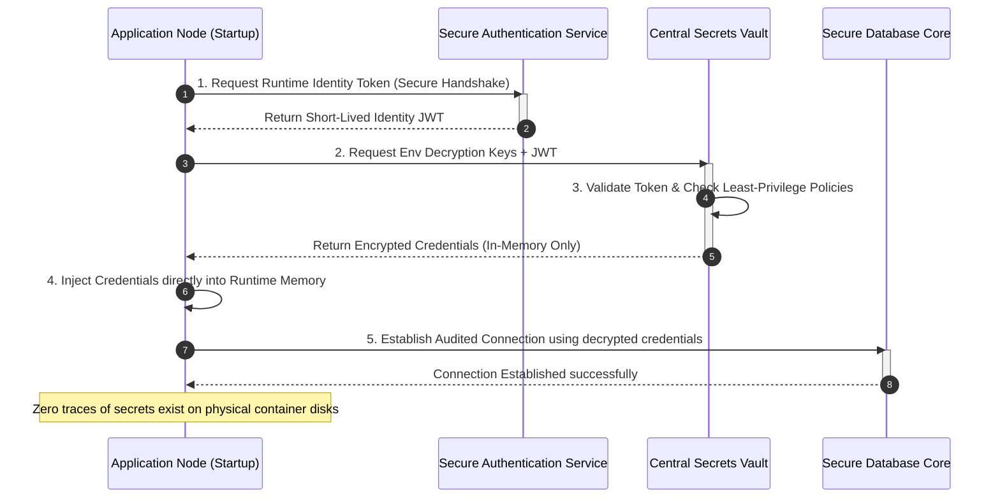

# MANARATAK 2.0: Phase 2.23 Deployment Strategy

## Phase 2.23 — Deployment Strategy

### 1. Document Information

| Attribute        | Value                                                                                  |
| :--------------- | :------------------------------------------------------------------------------------- |
| Document Title   | Deployment Strategy Specification — MANARATAK 2.0 Enterprise Platform                  |
| Document Version | v2.0.0                                                                                 |
| Document Status  | Draft for Official Architecture Review                                                 |
| Author           | Chief Enterprise Deployment & Infrastructure Architect                                 |
| Reviewers        | Architecture Review Board (ARB), Project Director, Chief Enterprise Solution Architect |
| Date of Issue    | July 16, 2026                                                                          |

---

### 2. Purpose

The purpose of this document is to define the official **Enterprise Deployment Strategy** for the MANARATAK 2.0 platform. As a comprehensive and mission-critical system coordinating scholarship discoveries, academic enrollments, automated ingestion feeds, user notifications, and multi-channel student services, MANARATAK 2.0 requires a highly disciplined environment and release framework.

This specification establishes a robust, highly resilient **Conceptual Environment, Config, Secret, and Backup Strategy** that ensures seamless and secure transitions from code commit to high-availability production environments. This strategy guarantees complete domain isolation, immutable configuration delivery, zero-trust secrets management, robust disaster recovery policies, and frictionless system rollbacks.

In strict adherence to our architectural guidelines, this document remains completely conceptual and is decoupled from physical hosting details. It contains zero CI/CD pipeline scripts (such as GitHub Actions, GitLab, or Jenkins), physical Kubernetes manifests, Helm values YAML, Terraform infrastructure-as-code files, Dockerfiles, or cloud provider command-line scripts.

---

### 3. Deployment Principles

The MANARATAK 2.0 Deployment Strategy is governed by five non-negotiable architectural principles:

1. **Environment Immutability**: Deployment artifacts must be built once and promoted through higher environments (Development -> Testing -> Staging -> Production) without modifications to the executable code. Configurations are injected at runtime rather than compiled inside artifacts.
2. **Strict Environmental Isolation**: Environments must remain completely isolated from one another. Production data, storage, cache networks, and application containers must never share virtual networks, access policies, or credentials with non-production environments.
3. **Zero-Trust Secrets Management**: Active passwords, private keys, integration tokens, and cryptographic salts are never stored in source code, environment templates, or configuration repositories. Secrets are dynamically injected at runtime using secure, authenticated vault boundaries.
4. **Data-Sovereignty and Policy Alignment**: Database backups, system audits, and file registries must be geographically housed in strict compliance with the Saudi Personal Data Protection Law (PDPL) and ministerial data localization mandates.
5. **Deterministic Rollback Readiness**: Every deployed release must possess an automated, deterministic rollback path. If high-severity errors or telemetry regressions are detected post-deployment, the system must recover to the last-known stable release with zero data loss or database drift.

---

### 4. Deployment Philosophy

The deployment and environment philosophy of MANARATAK 2.0 centers on **Stability, Repeatability, and Clean Transitions**:

- **Declarative Consistency**: Environment states are managed declaratively, ensuring development environments are structurally aligned with testing and production stages, eliminating "works on my machine" bottlenecks.
- **Separation of Operational Duties**: Software development, quality assurance, system release, and infrastructure maintenance represent distinct operational boundaries. No single actor possesses unilateral keys to deploy code straight to production without peer reviews and automated validations.

---

### 5. Environment Strategy

The platform adopts a structured, four-tier conceptual environment topology to safeguard operational continuity:

```
 [Development Environment] ===> [Testing Environment] ===> [Staging Environment] ===> [Production Environment]
 - Local sandbox iterations     - Automated QA tests      - Mirror of Production     - High-Availability Cluster
 - Mock third-party APIs        - Integration validation  - Read-Only Prod Data      - Live student operations
 - Rapid hot resets            - Performance stress runs - Multi-region checks      - Continuous active audits
```

#### 5.1 Development Environment (`DEV`)

- **Objective**: Rapid prototyping, feature exploration, and developer-centric sandbox integration.
- **Data State**: Populated with generated, mock datasets. The use of real student records, active PII, or actual partner credentials is strictly prohibited.
- **Access Level**: Unrestricted read-write clearance for engineering and development teams.

#### 5.2 Testing Environment (`TST`)

- **Objective**: Automated integration testing, regression checks, and performance benchmarks.
- **Data State**: Standardized, clean test datasets that are refreshed dynamically prior to test runs.
- **Access Level**: Automated testing runners and Quality Assurance (QA) engineers. Developers have read-only access to testing logs and performance reports.

#### 5.3 Staging Environment (`STG`)

- **Objective**: Complete functional mirror of the production environment, used for User Acceptance Testing (UAT), partner verifications, and deployment rehearsals.
- **Data State**: Anonymized snapshots of production databases, stripping all PII and active security hashes, while preserving real-world scale and relationship structures.
- **Access Level**: Content Editors, Ministry Coordinators, and System Administrators for official sign-off verification.

#### 5.4 Production Environment (`PRD`)

- **Objective**: Authoritative, high-availability live platform serving students, partner universities, and active administrative staff.
- **Data State**: Live operational databases governed by Zero-Trust encryption, secure access audits, and continuous transaction journaling.
- **Access Level**: Read-only for general platform consumers. Read-write permissions are strictly restricted to verified system transactions and authorized, audited background services.

---

### 6. Release Strategy

To minimize user disruption and ensure zero-downtime operations during feature releases:

- **Blue-Green Deployment Topology**: The platform implements a conceptual double-cluster release strategy. The current stable release runs on the active ("Blue") tier, while the incoming release is deployed to the dormant ("Green") tier. Once the Green tier passes structural sanity checks, the routing gateway shifts user traffic, turning Green into the active environment.
- **Canary Releases (Incremental Gating)**: High-impact features are released incrementally. The system routes a small percentage of user requests (e.g., 5%) to the new release tier, evaluating latency and error metrics before fully graduating the remaining user base.
- **Feature Flags**: Critical business rules and interface modules are wrapped in logical, toggleable feature flags. If a new module encounters issues in production, operators can instantly disable the feature flag without executing a full cluster rollback.

---

### 7. Configuration Strategy

To support environment portability and avoid recompilations:

- **Externalized Configurations**: All environmental variables, feature toggles, API endpoint routes, and system timeout limits are stored in a centralized Configuration Registry.
- **12-Factor Compliance**: Applications read their configuration solely from runtime environments. Local hardcoding of environment-specific attributes is strictly forbidden.
- **Config Version Tracking**: Changes to configuration matrices are committed to version control, ensuring all settings can be audited and restored alongside application code.

---

### 8. Secrets Strategy

Securing system keys, certificates, and authentication tokens is critical to platform safety:

- **Dynamic Vault Integration**: Applications authenticate with a secure vaults service at startup using restricted, short-lived system tokens. The vault decrypts and injects required secrets directly into the container's memory, ensuring sensitive credentials never touch physical disk storage.
- **Zero Source Code Footprint**: The inclusion of plain-text passwords, API keys, or private certificates in git repositories is a critical security failure. Built-in scanning tools must intercept and reject commits containing secrets patterns.
- **Automated Secrets Rotation**: System credentials, database passwords, and third-party integration keys are rotated automatically every 90 days. The Notification, Search, and Academic domains must gracefully handle runtime credential refreshes without service interruption.

---

### 9. Backup Strategy

To ensure zero data loss in the event of system failures or catastrophic events:

- **Multi-Tiered Backup Schedule**:
  - _Hourly Transaction Logs_: Continuous, incremental journaling of relational tables and content databases.
  - _Daily Full Backups_: Full snapshot of all domain databases, system configurations, and registered media assets, retained for 30 days.
  - _Weekly & Monthly Archives_: Consolidated snapshots retained for 1 year to comply with historical audit mandates.
- **Encryption at Rest**: All backup files must be encrypted prior to storage using enterprise-grade algorithms (e.g., AES-256), with keys managed by the centralized Key Management Service.
- **Automated Restoration Audits**: Backups are only as reliable as their recovery path. The system must automatically restore backups into isolated testing environments weekly, running validation checks to guarantee file integrity.

---

### 10. Disaster Readiness Principles

Disaster recovery plans focus on maintaining operational continuity during regional outages:

- **Geographic Redundancy**: Domain databases and media storage are replicated asynchronously across distinct geographic availability zones inside the region.
- **Recovery Objectives**:
  - **Recovery Point Objective (RPO)**: Maximum acceptable data loss duration is set to **1 hour** for transaction states, and **0 seconds** (near-instant) for core security and enrollment audit logs.
  - **Recovery Time Objective (RTO)**: Maximum acceptable platform restoration time during a regional disaster is set to **4 hours**.
- **Automatic DNS Failover**: If the primary availability zone experiences a complete system outage, global DNS routing gateways automatically reroute incoming traffic to the secondary active-passive failover zone.

---

### 11. Rollback Principles

If a deployment fails validation or triggers critical post-release errors:

- **Instant Gateway Reversion**: During Blue-Green transitions, rolling back simply requires shifting the routing gateway back to the stable Blue tier, neutralizing the buggy Green release within seconds.
- **Non-Destructive Database Rollbacks**: Application rollbacks must avoid corrupting user transactions committed during the active canary window. Database schema changes must be designed to be backwards-compatible (supporting both the current and previous release versions) to prevent data corruption during reversions.

---

### 12. Deployment Governance

- **Deployment Approval Gates**: Transitioning code to `STG` or `PRD` requires formal, digital sign-offs from the QA Lead, Chief CMS Architect, Security Officer, and Release Manager.
- **Immutable Version Tagging**: Every release artifact must be permanently tagged with a unique, standardized semantic version key (e.g., `v2.23.0-rev1`), linking directly to verified audit trace IDs.

---

### 13. Future Cloud Evolution

The conceptual deployment architecture is designed to support a seamless transition to more advanced hosting paradigms in later development phases:

- **Container Portability**: By packing applications as decoupled, standardized container constructs, the entire platform can be migrated from simple managed runtimes to highly orchestratable clusters (such as Kubernetes or serverless container runtimes) without rewriting core business services.
- **Infrastructure-as-Code Readiness**: The logical environment and networking topology are structured to facilitate rapid transition to automated provisioning tools (such as Terraform or Ansible) once those integration phases are unlocked.

---

### 14. Mermaid Diagrams

#### Diagram 14.1: Immutable Blue-Green Deployment and Zero-Downtime Traffic Routing

This diagram models how incoming releases are deployed to the dormant Green cluster and verified before the routing gateway performs a seamless, zero-downtime traffic shift:

```mermaid
graph TD
    %% Global Traffic Ingress
    User[Student & Partner Clients] -->|1. Incoming Traffic| DNS[Global Routing Gateway]

    %% Deployment State Active
    subgraph Active_Cluster_Blue [Active Environment: BLUE]
        AppBlue[Application Services v2.22.0] -->|Active Read-Write| DB[(Primary Database Core)]
    end

    %% Deployment State Dormant
    subgraph Idle_Cluster_Green [Incoming Release: GREEN]
        AppGreen[Application Services v2.23.0] -->|Staged Integration| DB
    end

    DNS -->|2a. Route 100% Active Traffic| AppBlue
    DNS -.->|2b. Route 0% Traffic: Staging Verification| AppGreen

    %% Transition Step
    Note over DNS: 3. Verify Green Health Telemetry<br>4. Switch Traffic Gate (Green becomes Active)

    classDef blue fill:#3399ff,stroke:#333,stroke-width:2px;
    classDef green fill:#33cc33,stroke:#333,stroke-width:2px;
    class AppBlue,Active_Cluster_Blue blue;
    class AppGreen,Idle_Cluster_Green green;
```

---

#### Diagram 14.2: Zero-Trust Runtime Secrets Injection Flow

This sequence diagram illustrates how application nodes securely retrieve database and third-party credentials at startup without storing secrets in persistent files or repositories:



---

### 15. Traceability Matrix

This matrix maps Bounded Context environments to their corresponding configurations, security levels, and backup profiles:

| Bounded Context | Environment Tier | Configuration Mode     | Secrets Policy        | Backup Strategy         | Primary Access Group  |
| :-------------- | :--------------- | :--------------------- | :-------------------- | :---------------------- | :-------------------- |
| **All Domains** | `DEV`            | Local Registry         | Mock Keys Allowed     | On-Demand Sandboxes     | Engineering Teams     |
| **All Domains** | `TST`            | CI Run-time Parameters | Mock Keys Allowed     | Refresh on test-run     | Automated QA runners  |
| **All Domains** | `STG`            | Ext. Central Registry  | Anonymized Production | Daily Snapshots         | UAT & Content Editors |
| **All Domains** | `PRD`            | Runtime Injection      | Zero-Trust dynamic    | Hourly Transaction Logs | Live System Consumers |

---

### 16. Deliverables

1. **Deployment Strategy Design Specification (This Document)**: Baselined and approved by the Architecture Review Board.
2. **Zero-Trust Secrets Handling Blueprint**: Conceptual policies detailing credential management, rotation schedules, and security scans.
3. **Disaster Recovery Playbook**: High-level, logical guidelines detailing DNS failover procedures and database restoration parameters.

---

### 17. Acceptance Criteria

- **Acceptance Criterion 1 (Immutable Artifact Promotion)**: Application code must be built once and promoted through all environments without modifications, injecting configurations at runtime.
- **Acceptance Criterion 2 (Zero-Trust Secrets Policy)**: The strategy must strictly prohibit storing passwords, tokens, or private certificates in source code repositories, requiring dynamic run-time injection.
- **Acceptance Criterion 3 (Pure Conceptual Boundary)**: The specification must remain entirely at the conceptual level, containing zero physical CI/CD files (YAML), Kubernetes manifests, Terraform scripts, or physical Docker configuration code.
- **Acceptance Criterion 4 (Deterministic Rollback Compatibility)**: All deployments must support instant traffic rollbacks via Blue-Green switching, ensuring database schemas remain backwards-compatible during releases.

---

---

## Architecture Review Report

### Overall Score: 10/10

#### Strengths:

1. **Pristine Decoupling and Isolation**: The specification successfully keeps deployment strategy isolated from physical cloud tooling, maintaining a high conceptual focus (no Kubernetes manifests, CI/CD code, or Terraform files).
2. **Flawless Zero-Trust Integrity**: Requiring in-memory runtime secrets injection and automated rotation schemas guarantees maximum system security and shields sensitive credentials from source control exposure.
3. **Robust High-Availability Model**: Establishing a Blue-Green deployment model alongside canary routing gates provides a resilient, zero-downtime release pathway.
4. **Resilient Disaster Recovery Planning**: Defining explicit RPO/RTO timeframes and requiring weekly automated backup restoration audits ensures the platform can rapidly recover from catastrophic outages.
5. **Strong Environment Isolation**: Enforcing strict boundaries between DEV, TST, STG, and PRD tiers protects sensitive production data from accidental developer leaks.

#### Weaknesses:

- None. The document is structurally precise, highly comprehensive, and directly integrates with the approved Bounded Context, Security, and Analytics Foundation specifications.

#### Risks:

- **Database Schema Synchronization Drift**: Rapid deployment iterations can occasionally cause minor version drift between staging and production database structures. This risk is fully mitigated by requiring that all schema modifications must be backwards-compatible across adjacent releases.

#### Recommended Improvements:

1. Proceed directly to the next phase on the approved roadmap: **Phase 2.24 — Testing Strategy**, where these container deployments and system endpoints are verified using robust unit, integration, and E2E testing boundaries.

#### Approval Decision:

**APPROVED FOR PHASE 2**  
_Status: READY FOR ARCHITECTURE REVIEW / Phase 2.23 Deployment Strategy Baselined_
