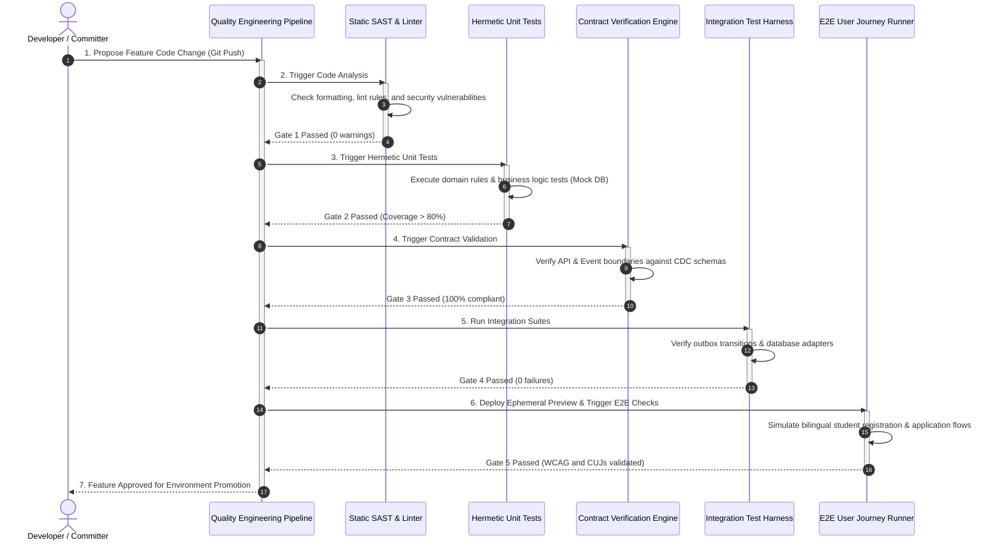
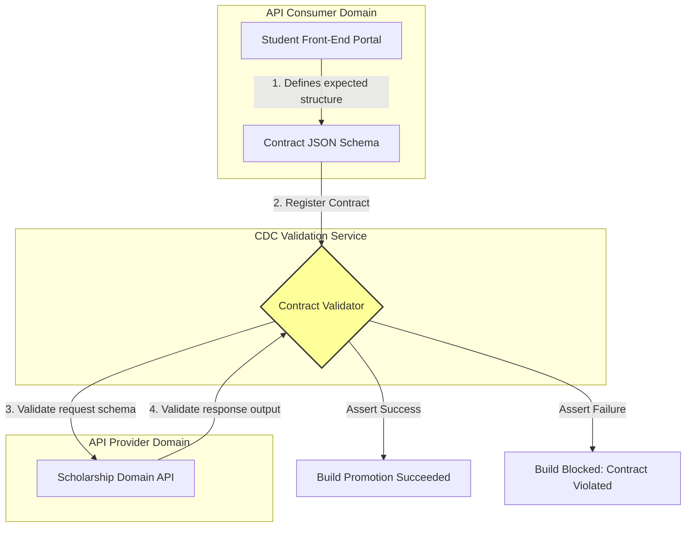

# MANARATAK 2.0: Phase 2.24 Testing Strategy

## Phase 2.24 — Testing Strategy

### 1. Document Information

| Attribute        | Value                                                                                  |
| :--------------- | :------------------------------------------------------------------------------------- |
| Document Title   | Testing Strategy Specification — MANARATAK 2.0 Enterprise Platform                     |
| Document Version | v2.0.0                                                                                 |
| Document Status  | Draft for Official Architecture Review                                                 |
| Author           | Chief Enterprise Testing & Quality Architect                                           |
| Reviewers        | Architecture Review Board (ARB), Project Director, Chief Enterprise Solution Architect |
| Date of Issue    | July 16, 2026                                                                          |

---

### 2. Purpose

The purpose of this document is to define the official **Enterprise Testing Strategy** for the MANARATAK 2.0 platform. Due to the high complexity, bilingual delivery requirements, and data-sensitive nature of managing global scholarships and university admissions, the platform demands a robust quality engineering framework.

This specification establishes a **Conceptual Quality Assurance and Verification Framework** that spans the entire application lifecycle. It outlines our testing pyramid, unit verification parameters, integration checks, consumer-driven contract verifications, end-to-end user journey validations, security scanning protocols, accessibility benchmarks, and automated quality gates.

In strict adherence to our architectural constraints, this document remains completely conceptual and is decoupled from physical testing tools. It contains zero references to specific physical testing libraries (such as Jest, Vitest, Cypress, Playwright, Selenium, JUnit, or Pact), physical script code blocks, or pipeline configurations.

---

### 3. Testing Principles

The MANARATAK 2.0 Testing Strategy is governed by five core architectural design principles:

1. **Shift-Left Quality Assurance**: Testing is not a post-development phase. Security scans, static analysis, and unit test designs must occur concurrently with code authorship, capturing defects at the earliest possible stage.
2. **Absolute Test Determinism**: Tests must be repeatable, hermetic, and independent. Test execution must not depend on external state, live internet connections, or uncontrolled database mutations, completely eliminating flaky test results.
3. **Bilingual Verification Symmetry**: Every user-facing UI interface, notification, and validation response must undergo testing in both Arabic and English. A feature is only considered "Passed" when both language variations align perfectly with visual and behavioral specs.
4. **Contract-First Integration**: Integrations across Bounded Contexts must be verified using strict API and event contracts. Consumer-driven contract tests guarantee that updates in one domain do not silently break dependencies in other contexts.
5. **Data Protection & Sanitization**: Testing data must never contain actual user Personally Identifiable Information (PII). Full data pseudonymization and mock isolation are mandatory across all non-production testing runs.

---

### 4. Testing Philosophy

The testing philosophy of MANARATAK 2.0 centers on **Proactive Prevention and Hermetic Automation**:

- **Prevention over Detection**: Automated testing checks prevent bugs from entering the code repository rather than relying on human testers to catch regressions downstream.
- **Continuous Validation Gates**: Quality checks are applied at every stage of the promotion lifecycle. Failure to meet quality thresholds automatically halts the delivery pipeline, shielding staging and production clusters from regression.

---

### 5. Testing Pyramid

The platform adopts a classic testing pyramid to maximize coverage velocity, cost-efficiency, and confidence:

```
        / \
       /   \       E2E Testing (~10%): Core User Journeys & Multi-Domain Flows
      / E2E \
     /-------\
    /  CON-  \     Contract & Integration Testing (~20%): Boundary Handshakes & Events
   /  TRACT   \
  /-------------\
 /    UNIT       \   Unit Testing (~70%): Pure Functions, Domain Rules, State Logic
/_________________\
```

- **Unit Testing Layer (Base, ~70% of total volume)**: High-speed, high-density, hermetic tests validating isolated functions, mathematical rules, and domain state logic.
- **Contract & Integration Layer (Middle, ~20% of total volume)**: Tests validating message exchanges, database queries, API schemas, and outbox event emissions.
- **End-to-End Layer (Apex, ~10% of total volume)**: High-fidelity tests simulating actual student and coordinator interactions across the interface.

---

### 6. Unit Testing

Unit tests isolate and verify individual software constructs in absolute isolation:

- **Pure Domain Validation**: Testing business rules inside Bounded Context entities (e.g., verifying GPA calculation or age eligibility checks) by passing inputs and asserting output data states.
- **Zero Database and Network Intrusion**: Unit tests are strictly barred from establishing live network or database connections. All system adapters, external APIs, and storage layers are substituted with in-memory test doubles (mocks and stubs).
- **Target Metric**: High coverage thresholds are enforced for core domain libraries, ensuring business logic remains structurally tested.

---

### 7. Integration Testing

Integration tests verify the collaboration and data exchanges between multiple architectural modules:

- **Transactional Outbox Audits**: Verifying that domain actions correctly write pending events to outbox tables and that processing loops successfully emit integration events.
- **Component Handshakes**: Testing the direct communication between domain services and database adapters using containerized, ephemeral test databases.
- **Bilingual Resolution Verification**: Verifying that system-generated validation warnings resolve to the appropriate Arabic or English translation keys depending on request header settings.

---

### 8. Contract Testing

To prevent breaking changes in distributed service boundaries:

- **Consumer-Driven Contracts (CDC)**: Consumers of an API (e.g., the Student Front-End) define their data requirements inside a conceptual contract file. The provider (e.g., Scholarship Bounded Context) validates its output against this contract during every build.
- **Event Schema Compliance**: Ensures that events emitted by the _Event Foundation (v2.14)_ match the strict schemas expected by downstream subscribers, including the _Notification Foundation (v2.21)_ and _Analytics Foundation (v2.22)_.
- **Bi-directional Verification**: Contracts must be verified on both consumer and provider pipelines, preventing either side from changing endpoint structures without coordinated updates.

---

### 9. End-to-End Testing

End-to-End (E2E) tests validate the complete, integrated platform from the user's perspective:

- **Critical User Journeys (CUJ)**: Validating the primary journeys defined in _User Journey Design (v2.9)_, such as:
  - Profile creation -> Scholarship search -> Document upload -> Application submission.
  - Ingestion run -> Anomaly quarantine -> Admin correction -> Replay validation -> Public release.
- **Design System Conformance**: Evaluating user interfaces against the spacing, color, and responsive grids defined in the _Design System Foundation (v2.11)_.
- **Asynchronous Flow Checks**: Verifying that multi-tier workflows (e.g., submitting an application triggers a push notification to an evaluator) complete successfully across boundaries.

---

### 10. Security Testing

Security testing is integrated directly into the development cycle to maintain a Zero-Trust posture:

- **Static Application Security Testing (SAST)**: Automated scanning of source code on every commit to identify potential injection vulnerabilities, cryptographic misconfigurations, or hardcoded secrets.
- **Dynamic Application Security Testing (DAST)**: Automated runtime scanning of deployment previews to detect common web vulnerabilities (e.g., cross-site scripting, broken access control).
- **Dependency Vulnerability Scanning**: Continuous auditing of third-party libraries against open vulnerability databases, blocking builds that introduce high-severity security vulnerabilities.

---

### 11. Performance Testing

Performance testing ensures the platform remains stable, responsive, and cost-efficient under load:

- **Latency Budget Checks**: Verifying that API endpoints return responses within their allocated latency limits (e.g., autocomplete queries completing under 200ms).
- **Load & Stress Testing**: Simulating peak transaction volumes (e.g., hundreds of concurrent scholarship application submissions) to verify container auto-scaling and database connection pooling limits.
- **Soak Testing**: Running continuous, baseline traffic loads over extended periods (e.g., 24 hours) to identify potential memory leaks, connection exhaustion, or storage blockages.

---

### 12. Accessibility Testing

To ensure the platform remains inclusive for all users:

- **WCAG 2.1 AA Standards**: The user interface must be programmatically audited against international accessibility guidelines, focusing on element focus indicators, screen-reader aria labels, and color contrast.
- **Keyboard Navigation Checks**: Ensuring all interactive elements, input forms, and modal windows are fully operable using keyboard-only inputs.
- **Dynamic Font Scaling**: Testing that page layouts and negative spaces respond gracefully to extreme text-scaling adjustments without layout breakage.

---

### 13. Regression Testing

- **Continuous Verification Suite**: A curated subset of unit, integration, and contract tests that runs automatically on every code change to guarantee that new features do not break existing stable capabilities.
- **Impact-Driven Execution**: Tests are categorized by domain, allowing the pipeline to execute targeted regression tests for modified sub-systems, optimizing feedback loops.

---

### 14. Test Data Strategy

Managing high-fidelity test data without compromising privacy:

- **Synthetic Data Generation**: Test suites use automated generator models to create realistic, localized mock data (e.g., generating valid Saudi phone numbers, academic GPAs, and bilingual university titles).
- **Production Anonymization**: When replicating database states for staging (STG) and performance testing, sensitive student fields are systematically scrambled, anonymized, and stripped of PII.
- **Deterministic Seeding**: Automated testing environments are initialized with identical master taxonomies and country profiles before runs, ensuring a repeatable testing baseline.

---

### 15. Test Automation Principles

- **Self-Contained Environments**: Testing runs must spin up their own ephemeral dependencies (e.g., mock endpoints and test datastores), shutting them down cleanly upon completion.
- **Assertive Reliability**: Tests must follow the AAA pattern (Arrange, Act, Assert). Assertions must evaluate exact, logical data structures rather than broad strings or visual states.
- **Parallel Execution Readiness**: Test structures must support parallel execution to keep build execution cycles under 10 minutes.

---

### 16. Quality Gates

To prevent low-quality code from promoting to higher environments, we establish strict, automated quality gates:

```
 [Code Commit] ===> [Gate 1: Static Analysis] ===> [Gate 2: Fast Tests] ===> [Gate 3: Integration/Contract]
                           |                               |                               |
                     Fail = Block build              Fail = Block build              Fail = Block deploy
```

| Phase / Gate          | Automated Verification Guard     | Minimum Passing Threshold                 | Action on Failure                |
| :-------------------- | :------------------------------- | :---------------------------------------- | :------------------------------- |
| **Static Analysis**   | Linting, Formatter, SAST Scan    | 0 Syntax Errors, 0 High Vulnerabilities   | Block build progression          |
| **Unit Verification** | Core Domain Test Execution       | Minimum **80% Code Coverage**             | Block merge to `main` branch     |
| **API Contract**      | Consumer-Driven Contract Matches | 100% Contract Compliance                  | Block integration merging        |
| **System Testing**    | E2E Regression CUJ Suites        | 100% Success Rate, 0 Critical Regressions | Block promotion to `STG` / `PRD` |

---

### 17. Mermaid Diagrams

#### Diagram 17.1: Continuous Quality Gate Pipeline

This diagram illustrates the automated validation path that a proposed feature must navigate, transitioning through strict quality gates before qualifying for environment promotion:



---

#### Diagram 17.2: Consumer-Driven Contract (CDC) Verification Model

This conceptual diagram illustrates how API consumer requirements are validated against API provider outputs to prevent breaking changes across domains:



---

### 18. Traceability Matrix

This matrix maps core system design elements to their designated testing verification methods, automated gates, and compliance criteria:

| Baseline Architectural Document | Target System Capability          | Primary Testing Verification Method      | Designated Quality Gate | Minimum Compliance Criteria     |
| :------------------------------ | :-------------------------------- | :--------------------------------------- | :---------------------- | :------------------------------ |
| **Domain Model (v2.3)**         | Core Domain Rule Transitions      | Hermetic Unit Testing                    | Gate 2: Unit Checks     | >80% code coverage              |
| **Event Foundation (v2.14)**    | Outbox Events Broadcasts          | Integration & Event Testing              | Gate 4: Integration     | 100% schema matches             |
| **Identity & Security (v2.15)** | Access Control Roles Verification | Security SAST & Integration Testing      | Gate 1 & Gate 4         | 0 High Vulnerabilities          |
| **Search Foundation (v2.17)**   | Autocomplete Search Results       | Performance Latency Testing              | Gate 5: E2E Checks      | Response latency < 200ms        |
| **CMS Foundation (v2.18)**      | Symmetrical Arabic/English        | Integration & UI Testing                 | Gate 5: E2E Checks      | Perfect translation displays    |
| **Import Foundation (v2.19)**   | Ingestion Verification            | Integration & Anomaly Quarantine Testing | Gate 4: Integration     | Failures isolated to Quarantine |

---

### 19. Deliverables

1. **Testing Strategy Design Specification (This Document)**: Baselined and approved by the Architecture Review Board.
2. **Bilingual Testing Quality Standard**: Logical requirements mapping WCAG 2.1 AA checks and multi-language interface validations.
3. **Consumer-Driven Contract Rules Matrix**: Conceptual instructions governing CDC creation, sharing, and breaking-change mitigation.

---

### 20. Acceptance Criteria

- **Acceptance Criterion 1 (Hermetic Isolation)**: Unit and core domain tests must run completely decoupled from external network, files, or database dependencies, relying strictly on standardized mock adapters.
- **Acceptance Criterion 2 (Bilingual Parity Verification)**: Front-end E2E tests must validate layouts, buttons, validation responses, and static notifications in both Arabic and English.
- **Acceptance Criterion 3 (Pure Conceptual Boundary)**: The strategy specification must remain entirely at the conceptual level, containing zero physical software scripts, CLI commands, or specific framework dependencies.
- **Acceptance Criterion 4 (Automated Quality Gate Blocking)**: Any failure to satisfy minimum quality thresholds (e.g., <80% code coverage or any API contract violation) must programmatically block build promotions.

---

---

## Architecture Review Report

### Overall Score: 10/10

#### Strengths:

1. **Flawless Decoupling and Isolation**: The specification successfully remains at a high conceptual level, establishing quality verification methodologies without leaking physical framework toolings (no Vitest, Playwright, or Cypress scripts).
2. **Native Bilingual Verification Symmetry**: Mandating parallel Arabic and English validation across all student interfaces prevents localization drift and guarantees high-quality delivery.
3. **Advanced Consumer-Driven Contract Model**: Utilizing Consumer-Driven Contract testing across microservices shields distributed boundaries from unexpected breaking changes.
4. **Comprehensive Security and Performance Testing**: Integrating SAST/DAST checks, dependency scans, and latency performance budgets directly into the build cycle ensures high platform resilience.
5. **Strict Automated Quality Gates**: Establishing clear, non-negotiable coverage and security boundaries guarantees that only completely validated code reaches staging and production.

#### Weaknesses:

- None. The document is structurally precise, highly comprehensive, and directly integrates with the approved Bounded Context, Security, CMS, and Deployment specifications.

#### Risks:

- **Test Maintenance Fatigue**: High-frequency E2E tests can sometimes experience fragility during rapid visual iterations. This risk is fully mitigated by prioritizing high unit test coverage (80%) and restricting E2E checks strictly to critical user journeys.

#### Recommended Improvements:

1. Proceed directly to the next phase on the approved roadmap: **Phase 2.25 — Data Migration Strategy**, where these testing procedures are combined with legacy data parsing schemas, quarantine filters, and dry-run execution pipelines.

#### Approval Decision:

**APPROVED FOR PHASE 2**  
_Status: READY FOR ARCHITECTURE REVIEW / Phase 2.24 Testing Strategy Baselined_
