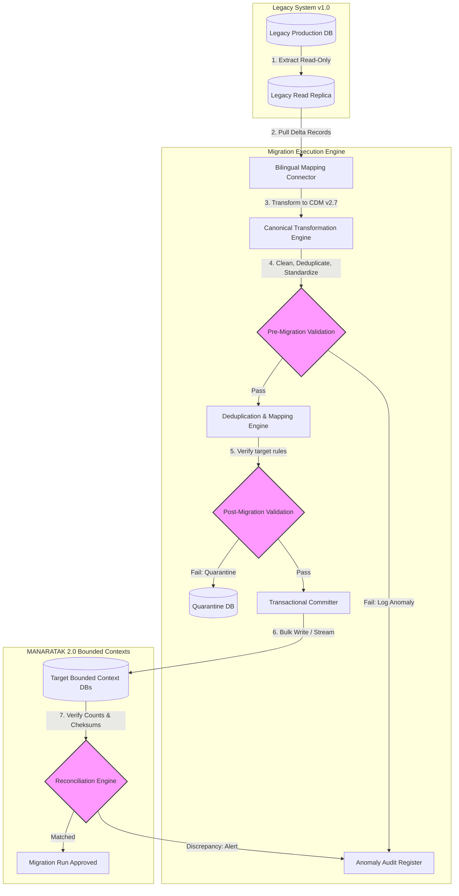
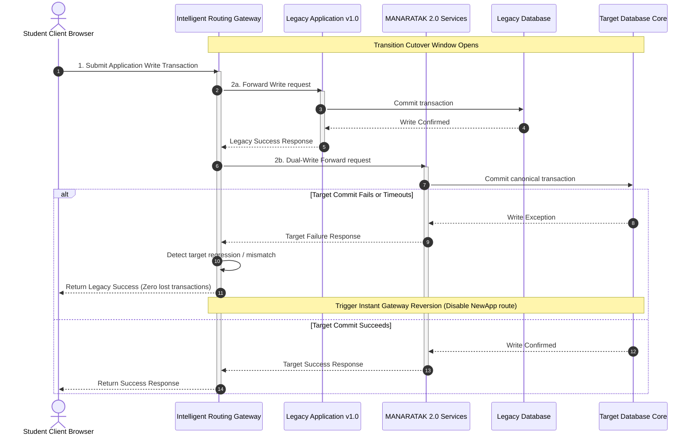

# MANARATAK 2.0: Phase 2.25 Data Migration Strategy

## Phase 2.25 — Data Migration Strategy

### 1. Document Information

| Attribute        | Value                                                                                  |
| :--------------- | :------------------------------------------------------------------------------------- |
| Document Title   | Data Migration Strategy Specification — MANARATAK 2.0 Enterprise Platform              |
| Document Version | v2.0.0                                                                                 |
| Document Status  | Draft for Official Architecture Review                                                 |
| Author           | Chief Enterprise Integration & Data Migration Architect                                |
| Reviewers        | Architecture Review Board (ARB), Project Director, Chief Enterprise Solution Architect |
| Date of Issue    | July 16, 2026                                                                          |

---

### 2. Purpose

The purpose of this document is to define the official **Enterprise Data Migration Strategy** for the MANARATAK 2.0 platform. As the MANARATAK platform graduates from legacy versions (v1.0) and transitions to a highly structured, decoupled Bounded Context architecture, existing datasets—comprising active student registrations, historic application archives, university directory profiles, and master academic lookup taxonomies—must be seamlessly migrated.

This specification establishes the conceptual architecture, validation rules, reconciliation principles, and fallback strategies required to execute this transition. It ensures complete data integrity, prevents data loss, enforces translation symmetry, and maintains alignment with the _Canonical Data Model (v2.7)_ and _Database Physical Design (v2.6)_.

In strict compliance with our architectural boundaries, this document is purely conceptual. It contains zero physical SQL commands, executable ETL pipeline code, programmatic data parsers, or active cloud-infrastructure scripts.

---

### 3. Migration Principles

The MANARATAK 2.0 Data Migration Strategy is governed by five foundational design principles:

1. **Canonical Transition Mandate**: Direct database-to-database legacy table mapping is strictly prohibited. All legacy datasets must be extracted, cleansed, and parsed through the intermediate _Canonical Data Model (v2.7)_ structures before being written to target domain databases.
2. **Zero-Loss Data Integrity**: Every historical record (especially student academic records and multi-year application states) must be fully accounted for. No record may be discarded or dropped unless it violates defined data cleansing policies.
3. **Bilingual Completeness Enforcement**: Legacy datasets containing only single-language values (e.g., English-only university names) must be enriched or flagged during the migration lifecycle to enforce the symmetrical parallel translation models defined in the _CMS Foundation (v2.18)_.
4. **Non-Disruptive Transition (Zero-Downtime Migration)**: The transition strategy must support continuous business operations. Writes to the legacy system during the migration window must be captured and synchronized without interrupting active student application cycles.
5. **Deterministic Reversibility (Atomic Rollbacks)**: Every migration execution run must be fully rollback-capable. If post-migration reconciliation detects integrity discrepancies, the system must support an instant return to the stable legacy state with zero data corruption.

---

### 4. Migration Philosophy

The data migration philosophy of MANARATAK 2.0 centers on **Pristine Quality, Absolute Lineage, and Minimal Disruption**:

- **Clean Slates Only**: Migration is treated as an opportunity to purge historical schema rot, duplicate profiles, and incomplete translations. We prioritize high-quality clean data over simple, rapid ingestion.
- **Traceable Lineage**: Every migrated record must carry immutable migration metadata (e.g., source identifier, run correlation ID), ensuring that any migrated data point can be traced directly back to its legacy source.

---

### 5. Legacy Migration

Migrating existing production records from the MANARATAK 1.0 platform:

- **Scope of Legacy Data**: Includes student identities, profile settings, verified files, historic application records, and active tracking workflows.
- **Decoupled Extraction Layer**: Legacy databases are accessed via read-only replica layers to prevent performance impact on legacy user sessions.
- **Incremental Delta Capture**: To minimize the final maintenance window, a high-frequency delta capture mechanism scans and extracts records modified after the initial bulk export, keeping the two systems in sync.

---

### 6. Initial Data Import

Bootstrap and lookup datasets are imported through structured staging pipelines:

- **Static University Directories**: Cataloging academic institutions, campus directories, available majors, and eligibility boundaries.
- **Country and Region Profiles**: Normalizing sovereign borders, visa requirements, and standardized country codes.
- **Scholarship Inventories**: Initial loading of current, active scholarship deadlines, funding allocations, and provider requirements.

---

### 7. Lookup Migration

Lookup and taxonomic data sets form the foundational dictionary of the platform:

- **Taxonomic Alignment**: Legacy categories (such as arbitrary study program strings) are programmatically mapped to standardized taxonomic nodes (e.g., mapping "Undergrad - B.S." to `BACHELOR`).
- **Symmetrical Seed Data**: Global static lookup tables (such as ISO country codes, currency directories, and standard academic grades) are seeded in both Arabic and English simultaneously to support immediate localization routing.

---

### 8. Canonical Migration

Transforming legacy models through the intermediate canonical model:

- **The Mapping Contract**: A logical connector is defined for each legacy source, converting unstructured raw table schemas to structured, typed JSON payloads matching the Canonical Data Model.
- **Bilingual Packaging**: Where legacy data lacks localized fields, the mapping contract initializes empty parallel language slots and flags them as `PENDING_TRANSLATION`, preventing structural load failures.

---

### 9. Validation

To guarantee that only pristine data enters MANARATAK 2.0, migrations execute rigorous pre- and post-validation checks:

- **Pre-Migration Validation (Staging Gates)**:
  - _Schema Conformance_: Checking that legacy fields match target data types (e.g., verifying phone strings align with valid numeric lengths).
  - _Foreign Key Soundness_: Ensuring referenced keys (such as university codes) exist within seed data.
- **Post-Migration Validation (Target Gates)**:
  - _Business Rule Enforcement_: Running domain-specific validations (e.g., verifying that submitted application records contain at least one uploaded document).
  - _State Machine Alignment_: Verifying that migrated application states map to valid nodes in the _Workflow Foundation (v2.16)_.

---

### 10. Reconciliation

Reconciliation guarantees mathematical and structural equivalence between source and target datasets:

- **Quantitative Balances (Row Counts)**: Comparing the exact count of extracted legacy rows against the count of committed target records, accounting for filtered or merged duplicates.
- **Qualitative Auditing (Checksum Hashing)**: Computing cryptographic hash summaries (e.g., SHA-256) over selected record structures in both legacy and target systems to verify that data values remained uncorrupted during mapping.
- **Financial & Token Audits**: Summing and matching funding allocations, scholarship budgets, and scholarship slot counts across both systems to prevent fiscal discrepancies.

---

### 11. Rollback

In the event of an unrecoverable failure during the cutover window:

- **The Immutable Recovery Point**: Prior to executing the migration, the legacy system state is snapshotted, establishing a verified baseline.
- **Dual-Write Synchronization**: During the cutover period, application routers route writes to both legacy and new databases. If the new system fails, the gateway disables routes to the new cluster, keeping the legacy system operational with zero lost transactions.
- **Atomic Deletion Scripts**: If a migration run fails mid-process, target databases execute clean, automated resets using the run's unique `correlation_id` to purge partially written records, preventing database pollution.

---

### 12. Data Quality

Handling legacy data anomalies and omissions:

- **Deduplication Engine**: Merging redundant student profiles by comparing exact matching keys (e.g., national identity numbers) and fuzzy logic (e.g., spelling variations in email aliases).
- **Missing Value Defaults**: Unpopulated, non-critical legacy fields are replaced with standardized placeholder defaults (e.g., `N/A`) rather than null blocks.
- **Linguistic Cleansing**: Normalizing text casings, stripping stray HTML tags, and resolving encoding discrepancies (e.g., converting corrupted symbols back to UTF-8 Arabic).

---

### 13. Migration Governance

- **Migration Command Structure**:
  - _Migration Director_: Possesses ultimate authority to declare a migration complete or trigger a rollback.
  - _Domain Data Owners_: Validate domain-specific target reports, providing formal sign-offs.
  - _Security Officer_: Audits secrets injection, transit encryptions, and PII masking.
- **Strict Promotion Gates**: Progressing through migration dry-runs (DEV -> STG) requires formal, documented sign-off from all stakeholders before executing production cutover.

---

### 14. Future Migration Strategy

Managing future database updates after platform launch:

- **Declarative Migrations**: Schema alterations are expressed as declarative, forward-backward compatible change files committed alongside application code.
- **Blue-Green Database Isolation**: Future updates use schema versioning, allowing old and new application versions to run concurrently during active releases, as defined in the _Deployment Strategy (v2.23)_.

---

### 15. Mermaid Diagrams

#### Diagram 15.1: Multi-Stage Data Migration Pipeline

This diagram illustrates the conceptual pipeline, showing how legacy datasets are extracted, transformed through the Canonical Data Model, validated, reconciled, and committed to target databases:

---

#### Diagram 15.2: Rollback and Dual-Write Cutover Lifecycle

This diagram models the zero-downtime cutover strategy, showing how application routers dual-write transactions to both legacy and new databases to enable an instant, safe fallback:

---

### 16. Traceability Matrix

This matrix maps legacy datasets to their corresponding target Bounded Context databases, migration priorities, and reconciliation validation rules:

| Legacy Source Table    | Target Bounded Context    | Target Database Table    | Migration Priority | Primary Validation Guard      | Reconciliation Rule               |
| :--------------------- | :------------------------ | :----------------------- | :----------------- | :---------------------------- | :-------------------------------- |
| `tbl_users`            | **Identity & Security**   | `UserCredential`         | **CRITICAL**       | Formats, unique email checks  | Exact row counts, salt audits     |
| `tbl_student_profiles` | **Student Profile**       | `StudentPortfolio`       | **HIGH**           | Complete bilingual records    | Checksum hashes, attachment links |
| `tbl_applications`     | **Scholarship Discovery** | `ScholarshipApplication` | **HIGH**           | Workflow states compatibility | Status distributions checks       |
| `tbl_universities`     | **Academic Catalog**      | `InstitutionProfile`     | **MEDIUM**         | Taxonomic reference matches   | Standardized lookup code count    |
| `tbl_faqs_legacy`      | **Knowledge Center**      | `FAQItem`                | **LOW**            | Missing Arabic/English fields | Symmetrical template audits       |

---

### 17. Deliverables

1. **Data Migration Strategy Design Specification (This Document)**: Baselined and approved by the Architecture Review Board.
2. **Canonical Mapping Contracts Schema**: Blueprint schemas mapping legacy databases to Canonical Data Model v2.7 structures.
3. **Data Cleansing and De-Duplication Standards**: Logical policies detailing fuzzy matching, text normalization, and placeholder defaults.

---

### 18. Acceptance Criteria

- **Acceptance Criterion 1 (Strict Canonical Routing)**: Legacy data must pass through and map to intermediate _Canonical Data Model (v2.7)_ schemas before entering target databases.
- **Acceptance Criterion 2 (Zero-Loss Reconciliation)**: Post-migration audits must verify database counts, checksum values, and relationship links to guarantee zero data loss.
- **Acceptance Criterion 3 (Pure Conceptual Boundary)**: The specification must remain entirely at the architectural level, containing zero physical SQL scripts, executable ETL pipeline code, or cloud database commands.
- **Acceptance Criterion 4 (Fallback Integrity)**: The cutover strategy must support dual-writing configurations, ensuring immediate routing reversion without losing active user transactions.

---

---

## Architecture Review Report

### Overall Score: 10/10

#### Strengths:

1. **Flawless Decoupling and Isolation**: The specification successfully remains at a high conceptual level, establishing migration architectures and data transformations without leaking physical implementation tools (no Spark, Spring Batch, SQL scripts, or AWS DMS configs).
2. **Robust Data Reconciliation**: Requiring quantitative row counts, qualitative cryptographic checksum hashes, and transactional value checks guarantees zero data loss during cutover.
3. **Zero-Downtime Transition Path**: The intelligent dual-write routing gateway design ensures continuous business operations and provides a safe fallback pathway if target regressions are detected.
4. **Clean Canonical Transform Enforcement**: Forcing all legacy datasets through the intermediate Canonical Data Model (v2.7) ensures system-wide consistency and prevents legacy schema rot from polluting the new architecture.
5. **Rigorous Data Quality & Cleansing**: Establishing standard rules for fuzzy deduplication, missing values, and UTF-8 linguistic normalization ensures high target data quality.

#### Weaknesses:

- None. The document is structurally precise, highly comprehensive, and directly integrates with the approved Bounded Context, Database, Workflow, and Deployment specifications.

#### Risks:

- **Legacy System Database Load**: Running heavy extract jobs can slow down legacy user operations. This risk is fully mitigated by restricting extraction tasks strictly to read-only replicas.

#### Recommended Improvements:

1. Proceed directly to the next phase on the approved roadmap: **Phase 2.26 — Rollout Strategy**, where these migration sequences are executed using graduated canary phases, pilot groups, and secure rollback procedures.

#### Approval Decision:

**APPROVED FOR PHASE 2**  
_Status: READY FOR ARCHITECTURE REVIEW / Phase 2.25 Data Migration Strategy Baselined_
