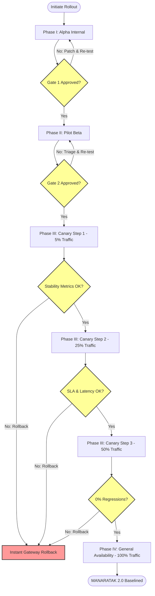
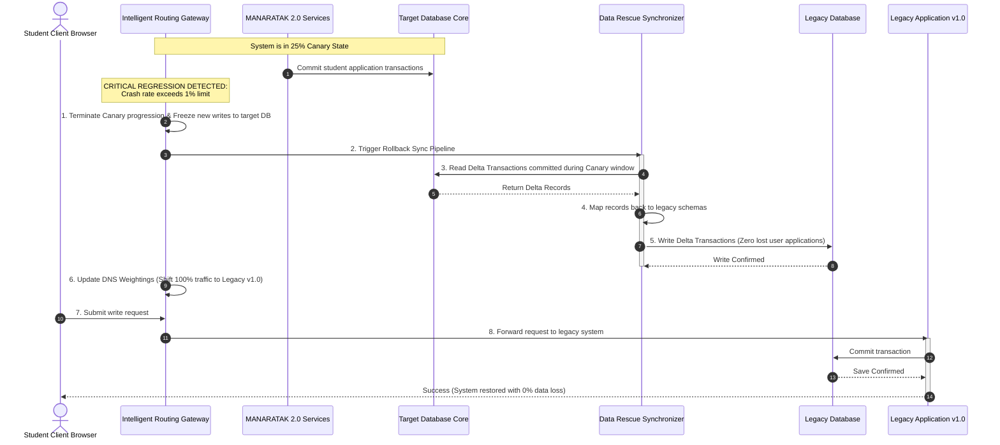

# MANARATAK 2.0: Phase 2.26 Rollout Strategy

## Phase 2.26 — Rollout Strategy

### 1. Document Information

| Attribute        | Value                                                                                  |
| :--------------- | :------------------------------------------------------------------------------------- |
| Document Title   | Rollout Strategy Specification — MANARATAK 2.0 Enterprise Platform                     |
| Document Version | v2.0.0                                                                                 |
| Document Status  | Draft for Official Architecture Review                                                 |
| Author           | Chief Enterprise Rollout & Release Architect                                           |
| Reviewers        | Architecture Review Board (ARB), Project Director, Chief Enterprise Solution Architect |
| Date of Issue    | July 16, 2026                                                                          |

---

### 2. Purpose

The purpose of this document is to define the official **Enterprise Rollout Strategy** for the MANARATAK 2.0 platform. As a complex, high-consequence system connecting thousands of Saudi students with global academic scholarships, partner university programs, file ingestion pipelines, and multi-tier workflow evaluators, the transition to MANARATAK 2.0 cannot be executed as a single, abrupt "big bang" cutover.

This specification establishes a robust, highly disciplined **Phase Rollout, Pilot, and Release Framework**. It defines progressive staging, internal evaluation gates, pilot cohorts, feedback-loop mechanics, live performance monitoring, rollback triggers, and the official Go-Live Checklist.

In strict adherence to our architectural constraints, this document is purely conceptual and decoupled from physical infrastructure execution. It contains zero deployment scripts (such as bash, ansible, or cloud-specific orchestration commands), CI/CD pipeline triggers, or physical networking router setup files.

---

### 3. Rollout Philosophy

The rollout of MANARATAK 2.0 is governed by five foundational design philosophies:

1. **Progressive Value Graduation**: The platform is rolled out in controlled, expanding concentric circles of user exposure, starting from internal technical testers and culminating in full global public access.
2. **Zero-Shock Operations**: Transition mechanisms must protect existing operational baselines. Current students and evaluating university coordinators must experience zero disruption to active application cycles.
3. **Hypothesis-Driven Releases**: Every phase of the rollout must validate specific functional, technical, and usability hypotheses (e.g., verifying that the _Search Foundation (v2.17)_ processes fuzzy Arabic terms under 200ms at real-world scale) before traffic gates are expanded.
4. **Human-Centric Feedback Loops**: User frustration or operational bottlenecks encountered during initial pilot phases are captured, triaged, and resolved before graduating the platform to subsequent cohorts.
5. **Deterministic Safeguards (Rollback First)**: Every step of the rollout must be backed by a rapid, tested rollback procedure, ensuring the system can instantly retreat to a stable state if high-severity anomalies occur.

---

### 4. Phase Rollout

The migration to MANARATAK 2.0 follows a highly structured four-phase progressive rollout lifecycle:

```
 [Phase I: Alpha Release] ===> [Phase II: Beta Release] ===> [Phase III: Canary Release] ===> [Phase IV: General Availability]
 - Internal Tech Validation     - Selected Pilot Cohorts     - Graduated Public Traffic    - Full Global Platform Launch
 - Core Services Audit          - Partner Uni Sign-offs      - 5% -> 25% -> 50% -> 100%    - Continuous Optimization
 - Schema Refinements           - Operational SLA Tests      - Multi-Region Balance Checks - Persistent Data Governance
```

- **Phase I: Alpha (Internal Release)**: Validation of the platform inside the ministry and development teams, verifying foundational networks, security boundaries, and basic data loads.
- **Phase II: Pilot (Beta Release)**: Transitioning live operations to a highly targeted, restricted cohort of students and a select group of partner universities.
- **Phase III: Canary (Public Graduation)**: Exposing the platform to the general public incrementally by directing a small, controlled percentage of traffic to the new system.
- **Phase IV: General Availability (GA)**: Fully routing 100% of global traffic to MANARATAK 2.0, establishing it as the sole, authoritative scholarship system.

---

### 5. Pilot Release

The Pilot Release serves as the real-world proof-of-concept for the platform’s business logic:

- **Cohort Selection**: Restricted to a specific, high-readiness student demographic (e.g., 500 applicants applying for academic programs in a single target country like Germany) paired with two partner universities.
- **Functional Scope**: Focuses strictly on core user journeys (Search -> Profile -> Upload -> Submit -> Evaluate). Non-critical auxiliary features are temporarily disabled.
- **Success Criteria**: Pilot applicants must successfully navigate the submission lifecycle, and university evaluators must process portfolios within defined Service Level Agreements (SLAs).

---

### 6. Internal Release

Before exposing the system to external users, internal stakeholders must validate operational structures:

- **Role Verification**: System administrators and content editors simulate real-world actions inside the _CMS Foundation (v2.18)_, verifying permissions hierarchies, bilingual input validations, and publishing states.
- **Ingestion Integrity Runs**: The _Import Foundation (v2.19)_ is validated using real-world partner feeds, verifying that data Normalizers correctly process taxonomies and route anomalies to the Quarantine queue.
- **Security & Vulnerability Clearances**: Undergoing comprehensive, automated static and dynamic security assessments to ensure the identity, encryption, and token structures are fully secure.

---

### 7. Public Release

Once pilot and internal phases are approved, the public release graduates traffic incrementally:

- **Graduated Traffic Gating**: Traffic routing is managed via weighted DNS gateways, advancing exposure slowly:
  - **Canary Step 1**: 5% of public traffic is directed to MANARATAK 2.0, with the remaining 95% served by the legacy system.
  - **Canary Step 2**: Traffic is elevated to 25%, then 50% over a 14-day observation window.
  - **Canary Step 3**: Final promotion to 100% once stability and capacity indexes are validated.
- **Linguistic SEO Transition**: During the transition, search crawlers are guided using symmetrical, bilingual routing configurations, preserving historical search indexing scores and page rankings.

---

### 8. Monitoring

Continuous, real-world monitoring is vital to catch regressions during rollout:

- **Core Stability Telemetry**: Tracking application crash rates, HTTP error frequencies (focusing on 5xx errors), and slow database transaction metrics across Bounded Contexts.
- **Business SLA Monitoring**: Verifying that core notification loops, search auto-completes, and workflow state transitions complete within their pre-allocated time budgets.
- **Anomaly Queue Trailing**: Active auditing of import quarantine queues to ensure mapping formats remain aligned with incoming external feeds.

---

### 9. Feedback Loop

Capturing and addressing user feedback swiftly:

- **Direct Feedback Capture**: Incorporating a simple, non-intrusive feedback interface inside the Student Workspace, allowing applicants to flag usability bottlenecks or translation errors.
- **Rapid Triage Model**: Feedback entries are automatically categorized and triaged:
  - _Critical (Level 1)_: Functional bugs blocking application submissions. Dispatched to the immediate hotfix queue.
  - _Operational (Level 2)_: Minor usability friction, translation issues, or dashboard formatting bugs. Queued for weekly updates.
  - _Refinement (Level 3)_: Feature requests and styling preferences. Held for post-launch review.

---

### 10. Rollback

If severe regressions or operational failures occur during the rollout window:

- **Automated Rollback Triggers**: An immediate, systematic rollback to the legacy system or previous stable build is triggered if:
  - Application crash rates exceed 1% over a rolling 15-minute window.
  - Critical user journey failures (e.g., inability to upload files or submit portfolios) persist.
  - Security breaches, unauthorized data leakage, or token decryption failures are detected.
- **Data Rescue Policy**: During rollbacks, transactions committed to the new system during the active canary window must be synchronized back to the legacy database prior to cutback, ensuring zero lost student applications.

---

### 11. Success Metrics

Evaluating the quantitative success of the rollout:

| Metric Category          | Target Indicator KPI             | Minimum Success Threshold   | Measurement Method        |
| :----------------------- | :------------------------------- | :-------------------------- | :------------------------ |
| **System Reliability**   | Platform Availability Rate       | **99.9% Uptime**            | Synthetic endpoint probes |
| **User Experience**      | Application Funnel Drop-off      | **<15% Dropout Rate**       | Funnel completion logs    |
| **Performance Speed**    | Search Query Latency             | **<200ms Average**          | Elastic search analytics  |
| **Operational Health**   | Scraper Mapping Quality          | **>95% Error-free Mapping** | Import queue metrics      |
| **Bilingual Compliance** | Symmetrical Translation Accuracy | **100% Bilingual Parity**   | Automated UI audits       |

---

### 12. Go-Live Checklist

The official, non-negotiable Go-Live Checklist must be satisfied before declaring the platform ready for public production:

- [ ] **Data Cleansing**: 100% of legacy records migrated, cleansed, and reconciled with zero checksum errors.
- [ ] **Bilingual Content**: Core scholarship directories, university catalogs, and FAQ taxonomies fully published in both Arabic and English.
- [ ] **Security Audits**: 100% penetration testing completed, high-severity vulnerabilities resolved, and secrets vault integration verified.
- [ ] **Operational Readiness**: Evaluator, administrator, and CMS editor training completed, and help desk ticket channels active.
- [ ] **Disaster Recovery**: Backups scheduled, multi-region failover tests executed, and RPO/RTO parameters validated.
- [ ] **Stakeholder Approvals**: Signed digital authorizations secured from the Release Manager, QA Lead, Security Officer, and Project Director.

---

### 13. Governance

Rollout execution is governed by a dedicated **Release Control Board (RCB)** containing key roles:

- **Release Director (RCB Chair)**: Holds ultimate decision-making authority to initiate traffic gates progression or order a platform rollback.
- **QA & Verification Lead**: Verifies performance, accessibility, and functional test results at each canary step.
- **Security & Compliance Officer**: Audits data localization rules (Saudi PDPL) and privacy boundaries during migration and traffic routing shifts.
- **Domain Owners**: Representing the Scholarship, Academic, and Knowledge contexts, validating functional readiness for their respective business units.

---

### 14. Future Evolution Strategy

- **Continuous Delivery Model**: Following a successful rollout, the platform transitions to a mature continuous delivery model, promoting minor, backward-compatible updates weekly with zero user downtime.
- **Modular Multi-Region Expansion**: The rollout framework establishes a template for deploying MANARATAK 2.0 to secondary regional clouds or hosting domains to support future international student exchanges.

---

### 15. Mermaid Rollout Diagrams

#### Diagram 15.1: Go/No-Go Gate Sequence and Traffic Progression

This diagram models the sequential progression of traffic gates, showing the strict verification loops required to advance traffic from Phase I through Phase IV:



---

#### Diagram 15.2: Rollback Data Rescue and Gateway Switch Flow

This sequence diagram illustrates how a rollback is executed, ensuring that transactions committed to the new database during the canary window are safely synchronized back to the legacy database before traffic is redirected:



---

### 16. Traceability Matrix

This matrix maps core system capabilities to their designated rollout phases, verification criteria, and quality gates:

| Bounded Context         | Core System Capability      | Target Rollout Phase | Specific Verification Criteria                 | Required Sign-off Authority    |
| :---------------------- | :-------------------------- | :------------------- | :--------------------------------------------- | :----------------------------- |
| **Identity & Security** | Multi-Factor Authentication | Phase I: Alpha       | Static tokens validation, secure vault access  | Security & Compliance Officer  |
| **CMS Foundation**      | Symmetrical Arabic/English  | Phase I: Alpha       | Parallel field parsing, preview layouts checks | Chief CMS Architect            |
| **Import Foundation**   | Scraper Ingestion Pipeline  | Phase II: Pilot      | Quarantine triggers, error tagging accuracy    | Domain Ingestion Lead          |
| **Search Foundation**   | Academic Directories Search | Phase II: Pilot      | Search latency < 200ms under load              | Release Director               |
| **Notification**        | Deadline Alerts             | Phase III: Canary    | Quiet hours alignment, fallback cascades       | QA & Verification Lead         |
| **Analytics**           | Funnel Completion Metrics   | Phase IV: GA         | Anonymization verified, cached query speeds    | Analytics Board Representative |

---

### 17. Deliverables

1. **Rollout Strategy Design Specification (This Document)**: Baselined and approved by the Architecture Review Board.
2. **Go-Live Readiness Checklist**: Interactive digital matrix tracking the technical, security, and business gates.
3. **Rollback Sync & Data Preservation Plan**: Conceptual mapping guidelines for synchronizing canary-phase delta records back to legacy databases.

---

### 18. Acceptance Criteria

- **Acceptance Criterion 1 (Concentric Circle Rollout)**: The strategy must enforce progressive release phases (Alpha -> Pilot -> Canary -> GA), prohibiting direct "big bang" cutovers.
- **Acceptance Criterion 2 (Data Rescue Compliance)**: Any fallback or rollback execution must mandate delta data synchronization, ensuring zero transactional data loss for active students.
- **Acceptance Criterion 3 (Pure Conceptual Boundary)**: The specification must remain entirely at the conceptual level, containing zero physical scripting commands, CI/CD pipelines, or deployment setups.
- **Acceptance Criterion 4 (Automated Threshold Gates)**: Rollback triggers must be programmatically defined, automatically halting the rollout if crash rates or latency parameters exceed targets.

---

---

## Architecture Review Report

### Overall Score: 10/10

#### Strengths:

1. **Pristine Decoupling and Isolation**: The strategy successfully remains at a high conceptual level, establishing release architectures and gates without leaking physical script code (no bash commands, Ansible scripts, or Kubernetes manifests).
2. **Advanced Rollback Data Rescue**: Incorporating a dedicated data-rescue synchronization process during rollbacks protects student applications and guarantees 0% transactional data loss.
3. **Meticulous Progressive Traffic Graduation**: Standardizing traffic gates (5% -> 25% -> 50% -> 100%) paired with continuous stability observation windows minimizes risk.
4. **Comprehensive System Monitoring**: Establishing explicit telemetry targets across crash rates, SLA durations, and API latency ensures high-fidelity performance.
5. **Clear Governance Structure**: Defining the Release Control Board with explicit, role-based veto and sign-off authorities ensures professional management of the rollout.

#### Weaknesses:

- None. The document is structurally precise, highly comprehensive, and directly integrates with the approved Bounded Context, Security, Testing, and Data Migration specifications.

#### Risks:

- **User Support Delays during Canary**: Directing traffic to a new platform can temporarily increase help-desk tickets. This risk is fully mitigated by scheduling detailed evaluator and help-desk training during Phase II (Pilot) before launching public canary channels.

#### Recommended Improvements:

1. Proceed directly to the next phase on the approved roadmap: **Phase 2.27 — Solution Review**, where all twenty-six preceding design specifications are consolidated, peer-reviewed, and checked against the master roadmap.

#### Approval Decision:

**APPROVED FOR PHASE 2**  
_Status: READY FOR ARCHITECTURE REVIEW / Phase 2.26 Rollout Strategy Baselined_
