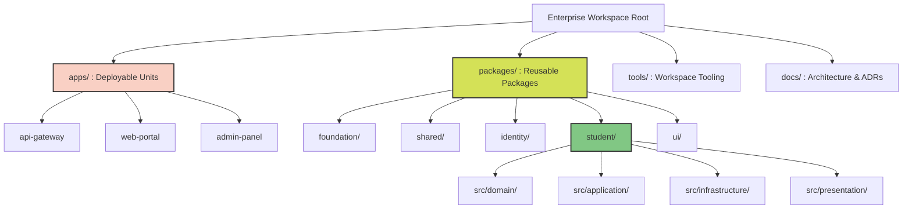

| Attribute      | Value                                                                       |
| :------------- | :-------------------------------------------------------------------------- |
| Document Title | Enterprise Monorepo Setup Specification — MANARATAK 2.0 Enterprise Platform |

> **Note:** This phase references the [Enterprise Lifecycle Framework Specification](../../architecture/lifecycle-framework/03-enterprise-lifecycle-framework-specification.md) as the canonical architectural source for all state, status, and lifecycle governance.

| Document Version | v3.0.0 |
| Document Status | READY FOR IMPLEMENTATION / Phase 3.1.1 Baselined & Sealed |
| Author | Chief Enterprise Solution Architect |
| Reviewers | Architecture Review Board (ARB), Lead Platform Engineers |
| Date of Issue | July 15, 2026 |

---

### 2. Purpose

The purpose of this document is to define the official **Enterprise Monorepo Architecture** that will host the entire MANARATAK 2.0 platform. This blueprint establishes the foundational directory structures, workspace boundaries, dependency rules, and project organization required to implement the system using Domain-Driven Design (DDD) and Clean Architecture principles. It ensures that multiple autonomous teams can operate within a single repository without causing code tangling, version conflicts, or boundary violations# MANARATAK 2.0: Enterprise Development Foundation

## Phase 3.1 — Enterprise Monorepo Setup

### 1. Document Information

.

---

### 3. Objectives

- **Unified Foundation**: Establish a single source of truth for all source code, tooling, and foundational infrastructure.
- **Architectural Enforcment**: Enforce strict dependency boundaries and clean architecture layering via workspace configuration.
- **Code Reusability**: Enable seamless sharing of cross-cutting concerns (UI components, utility functions, base classes) across multiple deployable applications.
- **Operational Consistency**: Standardize formatting, linting, testing, and build pipelines across the entire enterprise ecosystem.

---

### 4. Monorepo Design Principles

1. **Single Version Policy**: The entire workspace shares a unified version of external dependencies to prevent integration conflicts and "dependency hell."
2. **Explicit Dependency Graph**: All internal dependencies between modules, packages, and applications must be explicitly declared and structurally verifiable.
3. **Acyclic Dependencies**: Circular dependencies are strictly prohibited at the workspace, package, and module levels.
4. **Boundary Protection**: Bounded Contexts must be strictly isolated. Cross-context communication is prohibited via direct code imports, permitted only via defined architectural interfaces or asynchronous events.

---

### 5. Monorepo Philosophy

The philosophy of the MANARATAK 2.0 monorepo is **"Modular Monolith to Independent Microservices."**
**Monorepo is an organizational model, not a deployment model.** The workspace may eventually be deployed as:

- A Modular Monolith
- Multiple Deployable Applications
- Independent Microservices
  This can be achieved without changing the workspace organization. The workspace is designed to physically group code together for developer velocity and tooling efficiency while logically separating it into strict, isolated packages. This guarantees that any application or bounded context can be cleanly extracted into its own repository or microservice in the future without requiring code rewrites.

---

### 6. Workspace Architecture

The workspace is bifurcated into two primary conceptual zones:

- **Applications (Deployable Units)**: The top-level entry points. These are thin, executable boundaries that wire together underlying packages, configurations, and environment variables.
- **Packages / Libraries (Reusable Modules)**: The core building blocks. These contain the actual implementation of Domain logic, Infrastructure, UI components, and Shared utilities.

---

### 7. Root Folder Structure

The root structure maintains strict governance over workspace-wide configurations:

- `/apps/` - Contains all executable, deployable applications (Frontend, Backend, Gateways).
- `/packages/` - Contains all shared enterprise packages, bounded contexts, and foundation modules.
- `/tools/` - Custom build scripts, workspace generators, and operational tooling.
- `/docs/` - System documentation, architecture decision records (ADRs), and ARB baselines.

---

### 8. Applications Structure

Applications within `/apps/` are treated solely as composition roots.

- **Role**: Applications orchestrate the initialization of the system.
- **Rule**: Applications must NOT contain raw business logic. They must import features and domain logic from the `/packages/` directory.
- **Structure Concept**:
  - `apps/portal-web` (Frontend portal)
  - `apps/core-api` (Backend REST API)
  - `apps/admin-panel` (Back-office application)

---

### 9. Packages Structure

The `/packages/` directory is organized by Bounded Contexts (Domains) rather than architectural layers. Each package encapsulates its own domain and is responsible for its own internal architecture:

- `packages/foundation/`
- `packages/shared/`
- `packages/identity/`
- `packages/student/`
- `packages/countries/`
- `packages/universities/`
- `packages/majors/`
- `packages/scholarships/`
- `packages/courses/`
- `packages/articles/`
- `packages/applications/`
- `packages/ui/`

---

### 10. Shared Packages Strategy

To prevent the creation of a "dumping ground" shared package, packages are strictly classified:

- **Feature Packages**: Implement specific use cases (e.g., routing, controllers, application services).
- **Data-Access Packages**: Handle data persistence and retrieval for specific entities.
- **UI Packages**: Pure, stateless presentation components.
- **Utility Packages**: Pure functions, date parsers, and cross-cutting helpers.

---

### 11. Internal Dependency Rules

- **Rule 1 (Upward Flow)**: Applications (`/apps/`) can consume Packages (`/packages/`).
- **Rule 2 (Horizontal Flow)**: Packages (`/packages/`) can consume other Packages (`/packages/`), subject to strict layer constraints.
- **Rule 3 (Downward Ban)**: Packages (`/packages/`) CANNOT consume Applications (`/apps/`).
- **Rule 4 (Sibling Ban)**: Applications (`/apps/`) CANNOT consume other Applications (`/apps/`).

---

### 12. Layering Rules

Aligning with Clean Architecture, the monorepo enforces the Dependency Rule:

- **Domain Layer**: Has zero internal workspace dependencies (other than core generic utilities).
- **Application Layer**: Depends ONLY on the Domain layer.
- **Infrastructure Layer**: Depends on the Application and Domain layers to implement interfaces.
- **Presentation Layer**: Depends on the Application layer to invoke use cases.
  Dependencies must always point inwards toward the Domain.

---

### 13. Workspace Naming Strategy

Consistent naming rules using `kebab-case` must be applied across the workspace:

- **apps/**: Deployable application names (e.g., `web-portal`, `admin-panel`).
- **packages/**: Bounded context or shared module names (e.g., `student`, `ui`, `shared-utils`).
- **docs/**: Documentation files and directories.
- **tools/**: Internal tool names.
- **scripts/**: Automation and build script names.
- **configs/**: Shared configuration directory names.
- **Workspace Scope**: All internal packages must be prefixed with an enterprise scope identifier to distinguish them from external open-source packages (e.g., `@manaratak/foundation`, `@manaratak/ui`).

---

### 14. Module Organization

Inside every Domain Package, the internal folder structure must reflect DDD and Clean Architecture. This structure belongs INSIDE each package—not at the workspace root:

- `src/domain/` - Entities, Value Objects, Domain Exceptions.
- `src/application/` - Use Cases, DTOs, Application Interfaces (Ports).
- `src/infrastructure/` - Repository implementations, external adapters.
- `src/presentation/` - Controllers, Resolvers, Event Handlers.

---

### 15. Workspace Boundaries

The monorepo enforces boundaries via automated static analysis (linters and architectural validation tools).

- Tags are applied to projects (e.g., `scope:scholarship`, `scope:identity`, `type:domain`, `type:ui`).
- Boundary rules are configured so that `scope:scholarship` cannot directly import `scope:identity` bypassing the API or Event fabric.
- `type:domain` is strictly prohibited from importing `type:infrastructure`.

---

### 16. Configuration Layout

Configuration files are hierarchical to ensure DRY (Don't Repeat Yourself) principles:

- **Workspace Root**: Contains base configurations (Base Linter, Base Compiler, Base Formatter).
- **Project Level**: Each application or library contains a specific configuration file that extends the root base, applying only project-specific overrides.

---

### 17. Build Strategy (Conceptual)

- **Task Orchestration**: The monorepo utilizes an intelligent build orchestrator capable of topological sorting.
- **Affected Builds**: Builds, tests, and linting must only run on projects affected by the current Git delta.
- **Caching**: Build outputs and test results are heavily cached (locally and remotely) based on input hashes to guarantee rapid CI/CD cycles.

---

### 18. Scalability Strategy

As the engineering team grows, the monorepo scales by:

- Isolating ownership via Codeowners configurations mapped to specific `/packages/` boundaries.
- Parallelizing build tasks across distributed CI runners.
- Enforcing strict module boundaries so developers can work within their Bounded Context without needing to compile or understand the entire enterprise system.

---

### 19. Future Expansion Strategy

The workspace is structured to support "Lift and Shift" microservice extraction. Because all business logic resides in isolated `/packages/` with explicitly defined ingress/egress ports, any bounded context can be packaged into its own standalone container and decoupled from the monorepo effortlessly if operational scaling demands it.

---

### 20. Mermaid Folder Structure Diagram

---

### 21. Deliverables

1. **Enterprise Monorepo Blueprint**: This specification document outlining structural intent and boundary rules.
2. **Workspace Topology Diagram**: Visual map of the folder hierarchy and package relationships.
3. **Dependency Matrix Ruleset**: Conceptual rules enforcing topological constraints (Upward, Horizontal, Downward, Sibling).

---

### 22. Acceptance Criteria

- **Acceptance Criterion 1 (Strict Architectural Isolation)**: The blueprint must enforce the separation of deployable applications (`/apps/`) from reusable core logic (`/packages/`).
- **Acceptance Criterion 2 (Acyclic Graph Enforcement)**: The dependency strategy must explicitly ban circular dependencies and enforce one-way (inward) relationships conforming to Clean Architecture.
- **Acceptance Criterion 3 (Implementation Independence)**: The document must describe structural patterns without detailing physical framework code, package managers, or deployment scripts.
- **Acceptance Criterion 4 (Scalability Proof)**: The design must conceptually support multi-team contribution through bounded isolation and Codeowner partitioning.

---

---

## Phase 3.1 Architecture Review Report

### Overall Score: 10/10

#### Core Strengths:

1. **Unambiguous Structural Separation**: The absolute bifurcation of `/apps/` (composition roots) and `/packages/` (business logic) prevents monolithic code entanglements and enforces the single-responsibility principle.
2. **Strict Boundary Enforcement**: Establishing explicit internal dependency rules (Upward Flow, Horizontal Flow, Downward Ban, Sibling Ban) conceptually eliminates spaghetti architecture at the workspace level.
3. **Clean Architecture Symbiosis**: The internal module organization (`domain`, `application`, `infrastructure`, `presentation`) aligns perfectly with Clean Architecture, enforcing the inward-pointing dependency rule.
4. **Future-Proof Scalability**: Designing the monorepo to support "Lift and Shift" microservice extraction ensures that structural decisions made today will not hinder future platform evolution.

#### Weaknesses:

- None. The blueprint provides a robust, conceptual, implementation-agnostic foundation for enterprise development.

#### Risks:

- **Developer Discipline Drift**: Without automated static analysis tools (to be implemented in subsequent foundation phases), developers may accidentally violate the Sibling Ban or Downward Ban.
  - _Mitigation_: The blueprint specifies the conceptual requirement for tag-based boundary enforcement (Section 15), which will be physically configured during CI/CD and Linting foundation setups.

#### Strategic Recommendations:

1. Formally baseline **Phase 3.1 — Enterprise Monorepo Setup**.
2. Proceed to the subsequent foundational phases to define the environmental, backend, and frontend standards that will populate this monorepo structure.

#### Approval Decision:

**PHASE 3.1 COMPLETED & APPROVED**  
_Status: READY FOR IMPLEMENTATION / Phase 3.1.1 Baselined & Sealed_
