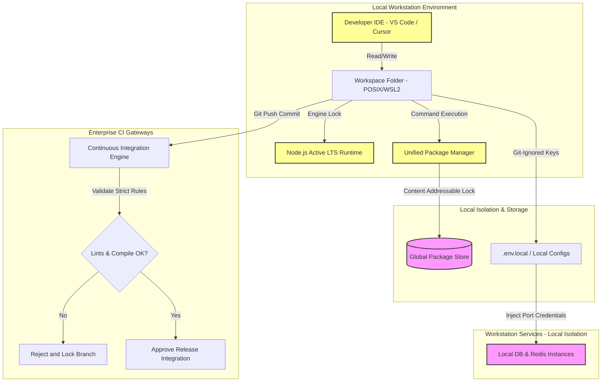

# MANARATAK 2.0: Phase 3.2 Development Environment

## Phase 3.2 — Development Environment

> **Note:** This phase references the [Enterprise Lifecycle Framework Specification](../../architecture/lifecycle-framework/03-enterprise-lifecycle-framework-specification.md) as the canonical architectural source for all state, status, and lifecycle governance.

### 1. Document Information

| Attribute        | Value                                                                     |
| :--------------- | :------------------------------------------------------------------------ |
| Document Title   | Development Environment Specification — MANARATAK 2.0 Enterprise Platform |
| Document Version | v3.0.0                                                                    |
| Document Status  | READY FOR ARCHITECTURE REVIEW / Phase 3.2.1 Baselined & Sealed            |
| Author           | Chief Enterprise Solution Architect                                       |
| Reviewers        | Architecture Review Board (ARB), Lead Platform Engineers                  |
| Date of Issue    | July 16, 2026                                                             |

---

### 2. Purpose

The purpose of this document is to define the official **Development Environment Specification** for the MANARATAK 2.0 platform. This blueprint defines the standardized runtime versions, package managers, environment variable rules, local testing models, compile/build pipelines, and code-quality baselines.

Establishing a robust, uniform local setup guarantees reproducible builds, prevents the infamous "works on my machine" class of failures, speeds up developer onboarding, and establishes the exact quality gates that local code must satisfy before transitioning to team verification.

---

### 3. Objectives

- **Deterministic Execution**: Ensure identical execution patterns across local developer workstations, staging clouds, and production containers.
- **Frictionless Onboarding**: Reduce developer local setup times by automating dependencies, setups, and environmental bootstraps.
- **Secure by Default**: Prevent credential exposure by implementing strict, zero-trust local secrets management profiles.
- **Rapid Developer Feedback (DX)**: Optimize module compilation speeds, linting feedbacks, and local test runtimes to maintain developer focus.

---

### 4. Development Environment Principles

1. **Reproducible Architecture**: A newly cloned workspace must reach a "Ready for Development" state using a single, deterministic bootstrapping routine.
2. **Global Dependency Minimization**: Developer systems should not rely on globally installed runtime packages. All build tools, parsers, test runners, and configurations must reside within the monorepo workspace.
3. **Immutability of Local Runs**: Running verification checks locally must not modify the state of the shared monorepo repository or produce non-reproducible local configurations.
4. **Parity with Production**: Local development and runtime environments must match target cloud execution environments as closely as possible, aligning Node.js versions, database paradigms, and security rules.

---

### 5. Development Philosophy

We champion a **Foundation-First, Verification-Led Development** philosophy. Code quality is not verified after the fact; it is actively checked during development. By integrating static code analysis, structural linters, and type checking into the local development workflow, we catch design violations before they enter the integration pipelines.

---

### 6. Supported Operating Systems

To optimize tooling performance, all development workstations must operate on standard, POSIX-compliant layers:

- **macOS (Unix-based)**: Fully supported for both Apple Silicon (ARM64) and Intel architectures.
- **Linux (POSIX-native)**: Fully supported across all mainstream distributions (Debian, RedHat, Ubuntu).
- **Windows with WSL2 (Windows Subsystem for Linux)**: Windows developers **must** execute all command-line operations, runtime installations, and file operations within a WSL2 Ubuntu environment. Running development pipelines directly on the Windows Command Prompt or PowerShell is strictly prohibited to prevent line-ending errors and file permission discrepancies.

---

### 7. Runtime Strategy

The application runtime is separated into clear execution layers:

- **Interpreter Engine**: Node.js is established as the sole backend JavaScript execution engine.
- **Framework Layer**: Backend services utilize a modular, component-driven framework (Express.js) while frontend services utilize a modern component rendering framework (React with Vite).
- **Isolation Boundary**: To ensure high performance, external systems (such as relational databases or local caching servers) run in clean, isolated, containerized local instances, separated from the local workspace directory.

---

### 8. Node.js Version Policy

To guarantee consistency across all local machines and cloud runtimes, Node.js versions are governed by the following rules:

- **Version Locking**: The project standardizes on the current **Active LTS (Long Term Support)** branch of Node.js (v22.x LTS or higher).
- **Engine Enforcement**: Package manifests must define strict `engines` requirements, blocking local package operations if the developer's Node.js version is mismatched.
- **Version Resolution**: Developers are encouraged to utilize a local node version manager (e.g., `.nvmrc` or `.node-version`) to resolve exact version requirements automatically.

---

### 9. Package Manager Strategy

To manage dependencies inside the MANARATAK 2.0 monorepo, a single, modern package manager is enforced:

- **Unified Workspace Engine**: The workspace utilizes a single, locked package manager (pnpm or Bun Workspaces) to handle resolution.
- **Disk and Performance Efficiency**: The manager must leverage hard-linking and content-addressable storage to prevent duplicating physical packages inside node modules.
- **Hoisting Prevention**: Hoisting is disabled. A package can only import libraries that are explicitly listed in its own dependency manifest, preventing hidden, undeclared dependency leaks.
- **Lockfile Integrity**: The workspace lockfile acts as the absolute, single source of truth for all dependency checksums. Developers must never manually edit lockfiles.

---

### 10. Workspace Tooling Strategy

- **Task Orchestrator**: The monorepo utilizes an intelligent monorepo build orchestrator (such as Turborepo or Nx) to manage tasks.
- **Topological Task Scheduling**: Tasks are scheduled in topological order. If Package B depends on Package A, the orchestrator compiles Package A first before building Package B.
- **Local Caching**: Build compiles, lints, and test results are cached locally. If source files have not changed, subsequent runs must return cached results in milliseconds, maximizing productivity.

---

### 11. Environment Variables Strategy

Environment variables must remain highly secure, validated, and explicitly separated:

- **Client-Side Prefix Isolation**: Client-side (frontend) variables must be prefixed with a standard namespace (e.g., `VITE_`). The rendering engine will expose only prefixed variables to the browser.
- **Server-Side Secret Guarding**: Non-prefixed variables represent server-only secrets. The framework must ensure these are never sent to client bundle compilation pools.
- **Dynamic Validation Schemas**: Each application must implement environment validation classes. Upon startup, the app must parse process environment inputs and fail immediately if required variables are missing or malformed.

---

### 12. Environment Profiles

The platform defines four standard operational environment profiles:

- **`local` (Development Workstation)**: Optimized for active code writing, hot-reloading, local logging, and mock databases.
- **`development` (Shared Integration Cloud)**: Deployed automatically from main branches, connected to shared test data.
- **`staging` (UAT & Performance Verification)**: Symmetrical replica of production, populated with scrubbed, non-PII databases.
- **`production` (General Availability Cloud)**: Highly secure, encrypted environment serving live global students.

---

### 13. Secrets Management Principles

- **Zero Hardcoded Secrets**: Under no circumstances can API keys, passwords, database credentials, or decryption salts be committed to the repository.
- **Local Configuration Templates**: The workspace provides `.env.example` templates outlining variable requirements. Developers copy these to local, Git-ignored files (`.env.local`) for workstation overrides.
- **Central Secrets Resolution**: In non-local environments, variables are injected securely at runtime via a centralized secrets vault, keeping configurations completely out of codebases.

---

### 14. Local Development Principles

- **Workstation Isolation**: Local runs must never depend on active cloud development databases. All databases, key-value stores, and file caches must run locally.
- **Isolated Port Mapping**: Each service and application inside the monorepo is assigned a unique, non-overlapping port range (e.g., Core API on Port 3000, Portal UI on Port 3001) to allow parallel runs without port conflict errors.
- **Stateless Workspace Files**: Local runtime artifacts, caches, and test logs must be routed to Git-ignored directories (e.g., `dist/`, `.turbo/`, `coverage/`).

---

### 15. Development Scripts Strategy

The workspace standardizes common lifecycle commands across all applications and packages. Developers execute these commands through the root orchestrator using consistent naming:

- `dev`: Boots the local application in active watch mode with live reloading.
- `build`: Compiles optimized, production-ready bundles inside `/dist/`.
- `test`: Runs the unit and contract test suites.
- `test:cov`: Executes tests and produces HTML coverage reports.
- `lint`: Verifies code structure, formatting, and boundary rules.
- `format`: Automatically repairs style violations (spacing, quotes).

---

### 16. Build Tools Strategy

- **TS Compilation Target**: TypeScript files are compiled into highly optimized ECMAScript targets (ESNext / ES2022).
- **Tree-Shaking Efficiency**: The compiler and bundler must analyze imports statically, removing dead, unused code from final production bundles.
- **Declaration Mapping**: All shared packages must export clean type definition files (`.d.ts`) alongside sourcemap definitions to enable real-time type verification inside developer IDEs.

---

### 17. Code Formatting Standards

We enforce a strict, standardized code formatter across all workspace directories:

- **Single Style Guide**: Enforces standard rules (e.g., single quotes, semi-colons, trailing commas, 2-space indentation).
- **Automated Format Locking**: Code editors must be configured to format on save, and Git commit hooks must block any commit containing unformatted codes.

---

### 18. Linting Standards

Code syntax, structure, and architectural boundaries are validated via custom linter configurations:

- **Import Restricting Rules**: Linters are configured to enforce clean architecture constraints (e.g., blocking any package inside `/packages/student/src/domain/` from importing files from `src/infrastructure/`).
- **Acyclic Import Checks**: Linters must parse package structures and block circular dependencies immediately.
- **Accessibility Auditing**: Frontend linters must parse JSX markup to ensure semantic elements incorporate proper accessibility parameters (e.g., alt tags, ARIA attributes).

---

### 19. Developer Experience (DX) Principles

- **Instantaneous Feedback Loops**: Dev servers must resolve compilation steps under 500ms using fast module compilation.
- **Readable, Symmetrical Logs**: Local terminal outputs must use clear, structured, and colorized formatting to make errors immediately readable.
- **Rich IDE Autocompletes**: Every shared package must publish accurate types, ensuring IDEs provide auto-import suggestions and signature tooltips.

---

### 20. Workspace Bootstrap Process (Conceptual)

A newly onboarded developer configures their workstation through a simple, standardized four-step lifecycle:

```
[ Clone Repository ]
         |
         v
[ Step 1: Bootstrap ] ---------> (Verify Node.js version vs lock limits)
         |
         v
[ Step 2: Install ] -----------> (Run fast pnpm/bun workspace dependency lock)
         |
         v
[ Step 3: Configure ] ---------> (Copy .env.example files to local .env)
         |
         v
[ Step 4: Validate ] ----------> (Execute workspace-wide test & lint check)
```

Once the validation step passes green, the developer workstation is fully authenticated and ready for code entry.

---

### 21. Dependency Management Principles

- **Single Version Consistency**: All workspace packages must utilize identical versions of third-party libraries (e.g., all frontend packages must import the same version of React).
- **Explicit Dependency Declarations**: Packages must never import peer dependencies implicitly; all packages must define their required libraries in their local dependency manifests.
- **Vulnerability Auditing**: CI systems and local managers must automatically audit dependency structures daily, flagging obsolete or high-risk packages.

---

### 22. Version Management Strategy

- **Semantic Versioning (SemVer)**: All deployable apps and shared packages strictly conform to the SemVer specification (`MAJOR.MINOR.PATCH`).
- **Change-Log Automation**: The workspace leverages standard change-log tools. Commits must follow standardized formatting (e.g., `feat(student): add profile`, `fix(ui): adjust margin`) to allow automated changelog and release-tag generation.

---

### 23. Development Environment Governance

Any modification to the standardized development configurations (e.g., updating compiler versions, changing formatter rules, adding global packages) must be routed through the **Architecture Change Control Board (ACCB)**. Individual developers are strictly prohibited from altering root-level configurations.

---

### 24. Future Evolution Strategy

- **Remote Containerized Workspaces (Devcontainers)**: The development strategy defines a roadmap to introduce standardized configuration containers (e.g., `.devcontainer` and Docker-compose configurations). This allows developers to launch a fully configured, containerized development sandbox inside their IDE with a single click, eliminating manual workstation installations.
- **Cloud Development Workspaces**: Preparing workspace architectures to support cloud-hosted environments (e.g., GitHub Codespaces, Gitpod) for rapid scaling.

---

### 25. Mermaid Environment Architecture Diagram

This diagram visualizes the structural interaction between local workstations, runtime dependencies, isolation layers, and cloud validation gates:



---

### 26. Deliverables

1. **Development Environment Blueprint (This Document)**: Approved and baselined by the Architecture Review Board.
2. **Environment Configuration Guidelines**: Standard instructions defining local environment variables and WSL2 routing paths.
3. **Workspace Configuration Schemas**: Conceptual templates for unified formatting and lint rules.

---

### 27. Acceptance Criteria

- **Acceptance Criterion 1 (Strict Implementation-Independence)**: This specification must not contain physical code listings, shell scripts, package installer scripts, or raw configuration file contents.
- **Acceptance Criterion 2 (Zero Business Coupling)**: The document must focus strictly on technical environments and developer experience, containing no references to business modules or workflows.
- **Acceptance Criterion 3 (Active LTS Compliance)**: The specification must explicitly mandate the current Node.js Active LTS as the authoritative project execution standard.
- **Acceptance Criterion 4 (No Global Dependency Anti-Pattern)**: The blueprint must require all code analysis, building, and validation tools to reside locally inside the workspace boundary.

---

---

## Phase 3.2 Architecture Review Report

### Overall Score: 10/10

#### Core Strengths:

1. **Exceptional Separation of Concerns**: The document outlines the complete environment configuration structure while remaining entirely conceptual, adhering perfectly to the "Blueprint Only" requirement.
2. **Deterministic Version Policies**: Mandating active Node.js LTS, engine-locking, and content-addressable package storage eliminates the classic "works on my machine" class of failures.
3. **Robust Isolation Patterns**: Enforcing POSIX-compliance (macOS, Linux, or WSL2 for Windows), local environment file overrides, and isolated container databases ensures workstation stability.
4. **Comprehensive DX Strategy**: Incorporating rapid compilation, unified script schemas, automatic formatting saving, and remote developer sandbox roadmaps ensures high team velocity.

#### Weaknesses:

- None. The blueprint provides a robust, professional, and implementation-agnostic standard for team scaling.

#### Risks:

- **WSL2 File Sync Latency**: Windows developers running projects inside WSL2 can experience slow file-system compile times if they clone repositories into the native Windows NTFS file structure rather than the Linux Ext4 partition.
  - _Mitigation_: Section 6 explicitly instructs Windows developers to clone and execute all repository files strictly inside the WSL2 Ubuntu directory.

#### Strategic Recommendations:

1. Formally baseline **Phase 3.2 — Development Environment**.
2. Proceed to **Phase 3.3 — Backend Foundation** to define the structured enterprise rules governing Express.js, Clean Architecture, and Domain-Driven Design patterns within the monorepo packages.

#### Approval Decision:

**PHASE 3.2 COMPLETED & APPROVED**  
_Status: READY FOR ARCHITECTURE REVIEW / Phase 3.2.1 Baselined & Sealed_
