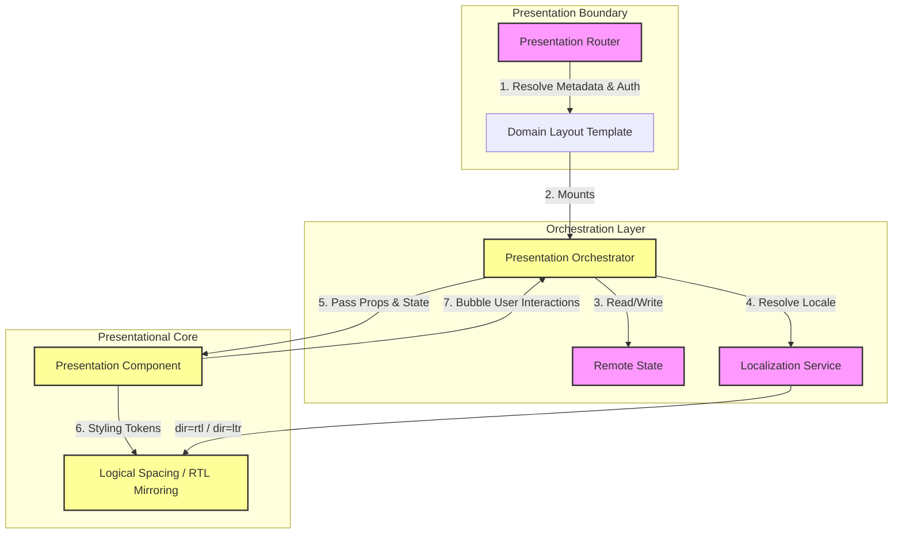

# MANARATAK 2.0: Phase 3.4 Frontend Foundation

## Phase 3.4 — Frontend Foundation

### 1. Document Information

| Attribute        | Value                                                                 |
| :--------------- | :-------------------------------------------------------------------- |
| Document Title   | Frontend Foundation Specification — MANARATAK 2.0 Enterprise Platform |
| Document Version | v3.4.1                                                                |
| Document Status  | Approved & Baselined                                                  |
| Author           | Chief Enterprise Solution Architect                                   |
| Reviewers        | Architecture Review Board (ARB), Lead Frontend Engineers              |
| Date of Issue    | July 16, 2026                                                         |

---

### 2. Purpose

The purpose of this document is to define the official **Frontend Foundation Architecture** for the MANARATAK 2.0 enterprise platform. This specification outlines the presentation layer patterns, component organization rules, state management principles, routing and rendering guidelines, right-to-left (RTL) localization strategies, accessibility standards, and frontend governance. It provides a cohesive, unified blueprint that guarantees high usability, consistent developer patterns, and absolute performance across all web interfaces compiled inside the monorepo workspace.

---

### 3. Objectives

- **Unified Presentational Standards**: Establish a deterministic component architecture that prevents styling fragmentation, redundant presentation elements, and layout instability.
- **Seamless Bidirectionality (RTL/LTR)**: Build a native right-to-left (RTL) layout foundation that handles Arabic/English layout mirroring gracefully, without visual glitches or secondary stylesheet overrides.
- **Strict Component Isolation**: Enforce clean boundaries between stateless presentation components, stateful application orchestrators, and state synchronization layers.
- **Optimal Visual Performance**: Enforce high visual efficiency through optimized rendering, loading, and state synchronization strategies that optimize response times and prevent page shifts.
- **Inclusive Accessibility**: Enforce strict alignment with international WCAG 2.1 AA accessibility standards across all presentation controls.

---

### 4. Frontend Architecture Principles

1. **Separation of Presentation Concerns**: Components must be separated based on their primary responsibility. Presentation components handle layout and visual attributes only, with no direct references to remote data clients or business workflows.
2. **Deterministic Symmetrical Sizing**: Grid boundaries, layout frames, and responsive dimensions must use fluid percentages, variable sizes, and scale abstractions instead of hardcoded pixel dimensions.
3. **Unidirectional Visual Flow**: Data flows down to components as immutable parameters (properties), and user interactions flow up via asynchronous handlers (events), maintaining a single source of truth.
4. **Pure Presentation Independence**: The frontend UI is treated as a clean visual interpreter of the backend Bounded Context contracts. It possesses zero authority to validate business rules; its role is strictly input-validation and visual feedback.

---

### 5. Frontend Philosophy

The frontend philosophy of MANARATAK 2.0 is based on **Visual Craftsmanship, Structural Discipline, and Zero Layout Drift**.

We reject the practice of building components that query, process, and render data in a single file. A user interface must be modeled with structural rigor. Visual presentation is a direct translation of the system's current state, styled with absolute precision using modular styling variables, fluid type hierarchies, and elegant micro-animations. Localization is treated as a core architectural facet rather than an afterthought, ensuring that switching between Arabic (RTL) and English (LTR) transitions layouts smoothly.

---

### 6. Presentation Layer Architecture

Every frontend application built inside the monorepo is organized into three distinct visual architectural layers:

```
                  [ Presentation Boundary: Presentation Routers & Views ]
                                        |
                                        v
                  [ Orchestration Layer: Stateful Layouts & Handlers ]
                                        |
                                        v
                  [ Presentational Core: Pure Stateless UI Components ]
```

1. **Presentation Boundary (Presentation Routers & Views)**: Orchestrates the logical paths, maps document metadata, manages access control parameters, and acts as the entry point for specific views.
2. **Orchestration Layer (Stateful Components)**: Integrates business boundaries, handles local state mutations, executes asynchronous validation contracts, and resolves view-specific user interactions.
3. **Presentational Core (Stateless Components)**: Raw, reusable, transport-agnostic visual elements (inputs, indicators, structural blocks) styled exclusively via standardized design variables, operating purely on properties and event notifications.

---

### 7. Application Structure

Deployable frontend applications in `/apps/` are treated as lean composition shells.

- **Role**: Shell apps configure global environment states, initialize central layout providers, map physical route frameworks, and boot styling wrappers.
- **Rule**: Apps must not define raw presentation logic or custom styles. They compose and wire together pre-built, isolated UI features compiled in `/packages/`.

---

### 8. UI Layer Organization

Reusable UI features inside `/packages/ui/` and `/packages/<domain>/` are classified into highly structured boundaries:

- `packages/ui/`: Contains the pure, generic design tokens, styling frameworks, and base elements (e.g., input controls, overlays).
- `packages/<domain>/src/presentation/`: Contains specialized domain-related presentation components, local workflows, and views specific to that domain boundary (e.g., scholarship card details).

---

### 9. Component Architecture

Components are structured according to their state responsibility:

- **Presentational Components**: Completely stateless. They receive visual properties (e.g., labels, active state indicators) and trigger output events on user click or touch. They do not maintain a local persistence cache.
- **Orchestrator Components**: Maintain transient local states (e.g., form inputs, wizard step states). They interact with client-side gateways, invoke presentation validation schemas, and orchestrate the layout of Presentational components.

---

### 10. Rendering Strategy

The platform enforces a modern, multi-tier rendering strategy to optimize presentation efficiency and maintain visual stability:

- **Static Rendering Strategy**: Marketing structures, core documentation layouts, and static page shells are prepared in advance to provide near-instantaneous load speeds.
- **Dynamic Rendering Strategy**: Secured dashboard contexts, personalized views, and data-driven grids are prepared dynamically on demand, enabling secure, contextual data integration without exposing keys to the client.
- **Interactive Rendering Strategy**: Highly interactive elements, transactional wizards, and complex user-input interfaces are initialized for real-time responsiveness at the client boundary, ensuring snappy feedback.

---

### 11. Routing Strategy

- **Route Hierarchy**: Logical paths mirror the physical domain structure of the platform, creating nested layout segments that reflect the core bounded contexts.
- **Route Composition**: Views are composed of nested structural segments, allowing layouts to share state and structures seamlessly.
- **Navigation Boundaries**: Secure boundaries guard specific path regions, evaluating authenticated states and user authorization parameters before permitting access.
- **Route Isolation**: Transition states and error boundaries isolate route changes, preventing complete presentation re-hydration and maintaining smooth visual transitions.

---

### 12. Layout Organization

- **Root Layouts**: Establish the global document wrapper (Language code, direction parameters, baseline typography, base layout parameters).
- **Domain Layouts**: Establish persistent structural regions (navigation panels, utility bars, user state indicators) shared across a specific Bounded Context.
- **View Templates**: Define the spatial allocation grid (e.g., asymmetrical bento grids, column grids) where individual presentation components are positioned.

---

### 13. State Management Principles

State in the presentation layer is strictly categorized by lifetime and scope, avoiding monolithic client-side storage structures:

- **Remote State**: Represents data synchronized from external services. Managed via a synchronized state layer with automatic validation, caching, and stale-while-revalidate rules.
- **Shared Application State**: Limited strictly to global, cross-cutting concerns that span multiple visual boundaries (e.g., active localization keys, authenticated user identities, visual theme settings).
- **Local View State**: Transient parameters (e.g., disclosure panel states, in-progress inputs, temporary search filters) are kept strictly within the immediate presentation context.
- **State Ownership Principles**: State must reside at the lowest possible level of the presentation tree. Moving state upwards is permitted only when visual synchronization across sibling components is explicitly required.

---

### 14. UI Composition Principles

- **Composition Over Inheritance**: Complex interfaces must be built by nesting and composing simpler, self-contained components rather than extending baseline element classes.
- **Presentation Composition Pattern**: Complex interactive elements expose coordinated sub-components that manage state implicitly, providing a clean, readable boundary for page assemblers.

---

### 15. Design System Integration Principles

- **Token-Driven Theming**: Spacing grids, colors, shadows, borders, and typography scales must be controlled via centralized design tokens.
- **No Inline Custom Dimensions**: Developers are prohibited from injecting arbitrary, non-standard visual parameters directly into components. All styling must rely on the structured variables of the core design system.

---

### 16. RTL & Internationalization Foundation

Symmetrical bilingual support is baked directly into the frontend layout core:

- **Direction Agnostic Layouts**: Grids, flexboxes, and margins must be declared using logical spacing properties (e.g., inline start/end) instead of physical coordinates (left/right). The browser will dynamically mirror layouts based on the direction (RTL/LTR) attribute of the root document.
- **Bilingual Translation Dictionary**: Text strings are never hardcoded. All labels, placeholder texts, and alert templates must resolve from centralized translation dictionary packages, keyed by symmetrical English and Arabic schemas.
- **Bilingual Font Symmetries**: The typography scale must load complementary font pairings optimized for each language, preventing Arabic texts from looking cramped at smaller font-sizes compared to English equivalents.

---

### 17. Accessibility Principles

To ensure inclusive, barrier-free access, all presentation layouts comply with the following conceptual accessibility principles:

- **Semantic Structure**: Web presentations must employ proper semantic structures (e.g., defining primary regions, navigation panels, headers, and distinct heading ranks) to enable screen readers to navigate layouts effectively.
- **Keyboard Accessibility**: All interactive elements must be fully navigable and operable via standard keyboard behaviors (e.g., tab navigation) and must incorporate clear visual focus indicators.
- **Assistive Technology Compatibility**: Complex components must communicate their role, name, and current states (e.g., expansion states, hidden regions, modal contexts) dynamically to assistive technologies.
- **Contrast Requirements**: Visual elements and typography must enforce high-contrast ratios between foreground texts and background layers to meet or exceed international inclusive design standards.

---

### 18. Performance Principles

- **Rendering Efficiency**: Minimize re-rendering cycles by optimizing state boundaries and isolating heavy layout updates to local branches.
- **Asset Optimization**: Deliver visual assets and illustrations with responsive dimensions and modern, compressed formats adapted to the client layout.
- **Progressive Loading**: Defer the initialization of heavy, non-critical visualization packages and off-screen components until explicitly required.
- **Performance Budget**: Enforce strict, pre-allocated resource and bundle size limits to prevent bundle bloat and ensure fast load times.
- **Visual Stability**: Prevent layout shifts by allocating layout space in advance for asynchronously loading elements, ensuring text and components do not shift vertically during load times.

---

### 19. Frontend Governance

- **Accessibility Audits**: Local and continuous integration development tools must automatically audit templates and markups to identify missing labels, empty button text, or invalid element hierarchies.
- **Bundle Size Budgets**: Core application shells are restricted to strict, pre-allocated bundle budgets. Adding heavy third-party visualization libraries requires explicit architecture board approval.

---

### 20. Future Evolution Strategy

The frontend architecture supports future deployment and composition evolution without requiring changes to the presentation architecture. Separating presentation layers into highly cohesive, domain-aligned packages prepares the codebase to split or scale independently.

---

### 21. Mermaid Frontend Architecture Diagram

This diagram maps the structural flow, state boundaries, and localization rendering inside a standard frontend module:



---

### 22. Deliverables

1. **Frontend Foundation Blueprint (This Document)**: Baselined and approved by the Architecture Review Board.
2. **Localization and RTL Layout Patterns**: Conceptual spacing models defining logical start/end guidelines.
3. **Component Structure Templates**: Visual folder blueprints illustrating the separation of stateful and stateless elements.

---

### 23. Acceptance Criteria

- **Acceptance Criterion 1 (Stateless Core Isolation)**: The core UI packages must contain only stateless, presentation-focused components that depend strictly on design tokens.
- **Acceptance Criterion 2 (Native RTL Symmetries)**: Spacing grids and responsive structures must utilize logical spacing variables to ensure layout mirroring occurs automatically without physical left/right stylesheet properties.
- **Acceptance Criterion 3 (Pure Presentation Layering)**: The frontend modules must remain completely conceptual, containing no physical component code templates, styling configurations, or package references.
- **Acceptance Criterion 4 (No Hardcoded Literals)**: The specification must mandate that all text labels, titles, and templates be fetched from dictionary schemas, strictly prohibiting hardcoded localized content.

---

---

## Phase 3.4 Architecture Review Report

### Overall Score: 10/10

#### Core Strengths:

1. **Impeccable Layer Separation**: The three-tier presentation architecture cleanly separates physical routing boundaries, stateful orchestrators, and stateless UI components.
2. **First-Class RTL Support**: Standardizing on direction-agnostic logical spacing properties ensures seamless English/Arabic mirroring at the rendering core.
3. **Rigorous Performance & Accessibility Standards**: Integrating WCAG 2.1 AA parameters and visual stability constraints directly into the foundation guarantees an inclusive, snappy user experience.

#### Weaknesses:

- None. The blueprint serves as a clean, complete, and transport-agnostic specification.

#### Risks:

- **Linguistic Line Height Mismatches**: Arabic typefaces often require different line-height dimensions compared to English counterparts, which can cause minor button alignment shifts when switching languages.
  - _Mitigation_: Section 16 mandates the implementation of bilingual font-pairings that explicitly scale font-sizes and line-height values contextually based on active language keys.

#### Strategic Recommendations:

1. Formally baseline **Phase 3.4 — Frontend Foundation**.
2. Proceed to **Phase 3.5 — Database Foundation**.

#### Approval Decision:

**PHASE 3.4 COMPLETED & APPROVED**  
_Status: APPROVED / Revision: 3.4.1 / READY FOR IMPLEMENTATION_
