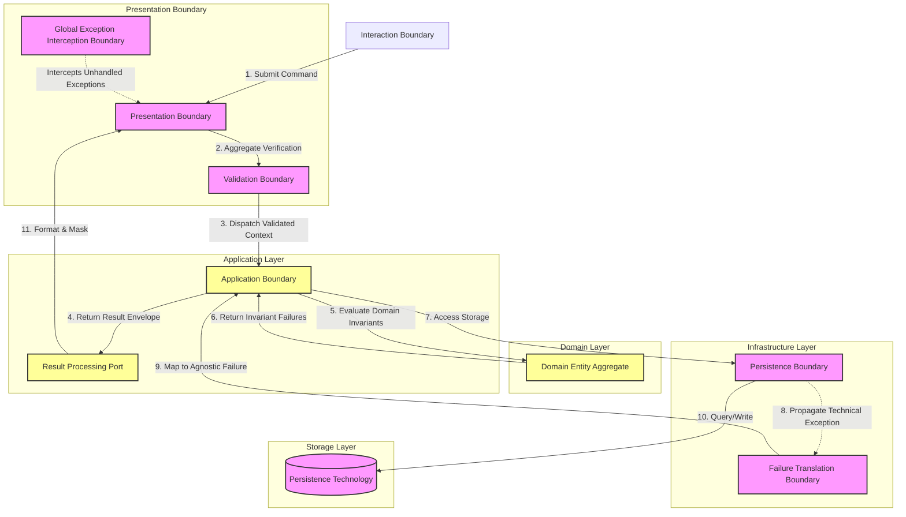

# MANARATAK 2.0: Phase 3.10 Error Handling Foundation

## Phase 3.10 — Error Handling Foundation

### 1. Document Information

| Attribute        | Value                                                                       |
| :--------------- | :-------------------------------------------------------------------------- |
| Document Title   | Error Handling Foundation Specification — MANARATAK 2.0 Enterprise Platform |
| Document Version | v3.10.1                                                                     |
| Document Status  | Approved - READY FOR IMPLEMENTATION                                         |
| Author           | Chief Enterprise Solution Architect                                         |
| Reviewers        | Architecture Review Board (ARB), Principal Systems Engineers                |
| Date of Issue    | July 16, 2026                                                               |

---

### 2. Purpose

The purpose of this document is to define the official **Error Handling Foundation Architecture** for the MANARATAK 2.0 enterprise platform. This blueprint establishes the conceptual frameworks governing error classifications, failure isolation boundaries, validation anomalies, logical result envelopes, exception translations, and diagnostic governance.

By detailing these standards conceptually, the specification guarantees that error handling remains decoupled, predictable, and resilient. It adheres strictly to Clean Architecture, Domain-Driven Design (DDD), Separation of Concerns, and Zero Trust principles, completely independent of any physical programming language, framework exceptions, HTTP status codes, REST models, or database drivers.

---

### 3. Objectives

- **Absolute Domain Sovereignty**: Ensure the central Domain layer remains entirely untainted by infrastructure failure models, third-party exceptions, or external transport errors.
- **Deterministic Execution Flow**: Transition the platform from implicit, uncontrolled exception-throwing behaviors to explicit, typed result-oriented designs.
- **Hermetic Failure Isolation**: Establish rigorous architectural perimeters to trap, translate, and contain anomalies, preventing cascading subsystem collapses.
- **Unified Validation Symmetries**: Standardize validation failures into cohesive, non-blocking collections of structural anomalies that can be easily parsed by presentation boundaries.
- **Secure Diagnostic Boundaries**: Establish strict translation layers to ensure internal system details, physical resources, and database stack footprints are never leaked to external clients.

---

### 4. Error Handling Architecture Principles

1. **Domain Ignorance of Infrastructure Failures**: Bounded domain contexts must never catch or raise infrastructure-specific exceptions. All external failures are translated into abstract domain failure definitions at incoming boundaries.
2. **Explicit Result Promotion**: Expected business rule violations (e.g., Business Rule Violation, Domain Constraint Violation) must be returned explicitly using logical Result models rather than throwing Unexpected Failures.
3. **Fail-Safe Perimeter Interception**: Unexpected platform anomalies (e.g., Infrastructure Failures) must be intercepted at the absolute perimeter by global exception boundaries to guarantee graceful system degradation.
4. **Context-Rich Diagnostics**: Every resolved failure must carry standard, non-sensitive diagnostic metadata (e.g., failure classification, localization markers, correlation contexts) to enable precise tracing without compromising security.

---

### 5. Error Handling Philosophy

The error handling philosophy of MANARATAK 2.0 is based on **Predictability, Separation of Context, and Safe Degradation**.

We reject the anti-pattern of utilizing raw, uncontrolled exceptions for flow control inside core application layers. Unexpected technical exceptions represent structural system failures, whereas domain validation rules and business policy violations are expected, logical outcomes of system transactions.

By representing expected failures as strongly typed values within a unified Result envelope, and isolating unexpected failures behind strict exception translation boundaries, the platform achieves total architectural predictability. The Application Core remains completely clean and stable, executing business cases with zero risk of silent, untracked execution halts.

---

### 6. Error Classification

To ensure proper routing, diagnostic prioritization, and response styling, all system failures are classified into four distinct categories:

- **Business Policy Violations**: Expected occurrences where a requested command conflicts with active business logic, structural invariants, or domain constraints (e.g., Business Rule Violation, Domain Constraint Violation).
- **Validation Anomalies**: Input formatting, structural integrity, and typing discrepancies detected at application or presentation boundaries before domain invocation (e.g., Validation Failure).
- **Infrastructure Adaption Failures**: Unreachable external repositories, broken transport pipelines, and physical storage degradation trapped within infrastructure boundaries (e.g., Infrastructure Failure).
- **System Failures**: Unexpected runtime errors, memory constraints, and core system crashes requiring immediate global interception and administrative alerting (e.g., Platform Failure).

---

### 7. Failure Boundaries

The platform defines four clear architectural boundaries for failure processing:

- **The Domain Boundary (Failure Containment Boundary)**: Operates in a state of absolute invariant protection. It detects domain validation anomalies or returns business policy failures directly within logical entity structures.
- **The Application Use Case Boundary (Failure Detection Boundary)**: Orchestrates operations, isolates infrastructure-specific failures, and wraps both successful outcomes and expected failures into a unified Result Representation.
- **The Presentation Boundary (Failure Communication Boundary)**: Parses Result Representations, maps abstract system failures into consumer-friendly representations, and strips internal diagnostic details.
- **The Global Exception Interception Boundary (Failure Translation Boundary)**: Surrounds all execution processes to isolate unhandled runtime failures, executes emergency system recoveries, and ensures a standardized, safe exit state.

---

### 8. Result Pattern Principles

- **Dual-State Representation**: System operations must return a Deterministic Outcome Model containing either a Successful Outcome or a structured, typed Failure Outcome.
- **Polymorphic Execution**: The Result Representation must remain independent of specific business logic, enabling reuse of identical transaction models across different domains.
- **No Side-Effect Propagation**: Use cases must evaluate the status of a Result Representation before proceeding with downstream command dependencies, eliminating half-executed transactions.

---

### 9. Validation Error Principles

- **Collective Structural Verification**: Validation layers must compile all structural discrepancies into a unified Validation Representation, rather than terminating execution on the first failure.
- **Decoupled Validation Metadata**: Each validation anomaly must capture the Validation Context, the Validation Scope, the Validation Classification, and abstract failure reasons, avoiding hardcoded text strings.
- **Pre-Domain Execution**: Structural validation must occur at the presentation or application perimeter, ensuring that invalid commands never reach domain aggregates.

---

### 10. Exception Boundary Principles

- **Zero Exception Penetration**: Infrastructure Failures (e.g., Persistence Failure, External Communication Failure) are strictly forbidden from penetrating past the infrastructure adapter. They must be intercepted and mapped to clean, domain-agnostic failure contexts.
- **Symmetrical Translation Contracts**: Each physical integration layer must define a mapping contract to translate Technical Failures into platform-standard failure classifications.
- **Graceful Degradation Mechanics**: When non-critical external subsystems fail, the failure boundary must trigger fallback mechanisms, allowing the primary application to function with reduced capabilities.

---

### 11. Error Propagation Principles

- **Explicit Failure Propagation**: Domain failures must be communicated via Failure Propagation through return values (Result Representations), whereas unexpected system errors propagate via standard execution mechanics until caught by the global interceptor.
- **Context Preservation**: As a failure travels across boundaries, the diagnostic Failure Context (such as the Request Correlation Context) must remain preserved to protect the trace path.
- **Decoupled Boundary Translation**: At each outer boundary crossing, the failure metadata undergoes Boundary Translation to fit the requirements of the outer layer, preventing context leakage.

---

### 12. Error Isolation Principles

- **Failure Blast-Radius Containment**: Subsystem failures must achieve Failure Isolation to prevent a single integration failure from locking up global platform threads.
- **Consistency Preservation**: When a transaction fails mid-execution, the system must guarantee a strict Recovery Boundary to ensure Consistency Preservation, protecting overall transactional integrity.
- **Non-Blocking Telemetry Isolation**: Recording Failure Containment diagnostics must execute asynchronously, ensuring diagnostics do not interfere with primary recovery steps.

---

### 13. Error Governance

- **Failure Classification Governance**: The definition and modification of platform failure classification models must undergo strict Governance Review and be baselined under Architectural Oversight.
- **Diagnostic Governance**: Regular reviews must verify that failure diagnostics contain no Sensitive Security Material, unprotected credentials, or personal identifier data, ensuring rigorous Diagnostic Governance.
- **Threshold Alert Policies**: System failures must trigger notifications based on strict severity and frequency rules defined by Architectural Oversight.

---

### 14. Future Evolution Strategy

The error handling architecture supports future operational evolution without affecting the Domain or Application layers.

---

### 15. Mermaid Error Handling Architecture Diagram

This diagram visualizes the flow of logical results and exception conversions across clean architectural perimeters:

---

### 16. Deliverables

1. **Error Handling Foundation Blueprint (This Document)**: Baselined and approved by the Architecture Review Board.
2. **Result Symmetrical Interface Outlines**: Generic type definitions for unified success/failure envelopes.
3. **Validation Anomaly Schema**: Conceptual metadata definitions standardizing error field paths and localized classification codes.

---

### 17. Acceptance Criteria

- **Acceptance Criterion 1 (Absolute Separation of Exceptions)**: No Domain or Application Use Case classes may contain direct catching or dependencies on physical network exceptions or Infrastructure Failures.
- **Acceptance Criterion 2 (Explicit Result Pattern Enforcement)**: All domain invariants and policy violations must be propagated via returning a structured Result Representation, strictly prohibiting the use of Unexpected Failures for expected business logic paths.
- **Acceptance Criterion 3 (Zero Technical Leakage)**: The presentation boundary must guarantee that raw Diagnostic Information, hardware configurations, and storage schemas are stripped from outbound consumer failure responses.
- **Acceptance Criterion 4 (Aggregated Validation Faults)**: Command validations at application boundaries must collect all structural anomalies before failing, rejecting single-failure abort methods.

---

---

## Phase 3.10 Error Handling Foundation Architecture Review Report

### Overall Score: 10/10

#### Core Strengths:

1. **Exceptional Invariant Security**: Forcing expected business rules and policy violations into explicit Result envelopes safeguards execution flows and removes un-tracked runtime crash vectors.
2. **Complete Separation of Concerns**: Isolating database, network, and storage driver exceptions within the infrastructure boundary preserves total Use Case and Domain sovereignty.
3. **Unified Validation Symmetries**: Compiling validation failures collectively instead of failing instantly on the first error significantly improves integration efficiency and API usability.
4. **Resilient Perimeter Defense**: The combination of the Global Exception Interception Boundary and strict outer translation layers guarantees a robust defensive posture against technical leaks and cascading collapses.

#### Weaknesses:

- None. The blueprint provides a complete, conceptual, and vendor-neutral specification.

#### Risks:

- **Trace Information Starvation**: Overscrubbing logs at the presentation perimeter could starve operations teams of vital troubleshooting metadata.
  - _Mitigation_: Section 11 and 12 mandate routing deep technical traces to internal, secure, asynchronous logging repositories while dispatching clean, sanitized errors to external clients.

#### Strategic Recommendations:

1. Formally baseline **Phase 3.10 — Error Handling Foundation**.
2. Proceed to **Phase 3.11 — Validation Foundation**.

#### Approval Decision:

**PHASE 3.10 COMPLETED & APPROVED**  
_Status: APPROVED / Revision: 3.10.1 / READY FOR IMPLEMENTATION_
