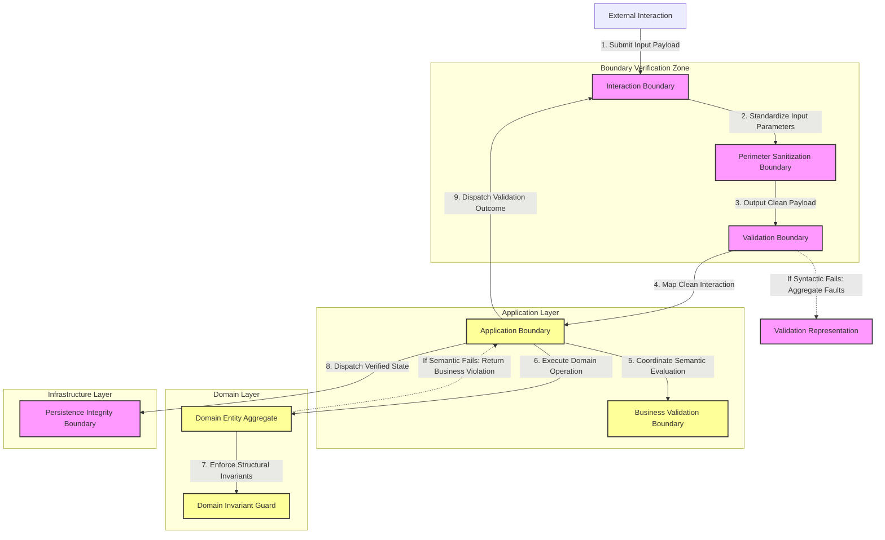

# MANARATAK 2.0: Phase 3.11 Validation Foundation

## Phase 3.11 — Validation Foundation

### 1. Document Information

| Attribute        | Value                                                                   |
| :--------------- | :---------------------------------------------------------------------- |
| Document Title   | Validation Foundation Specification — MANARATAK 2.0 Enterprise Platform |
| Document Version | v3.11.1                                                                 |
| Document Status  | Approved - READY FOR IMPLEMENTATION                                     |
| Author           | Chief Enterprise Solution Architect                                     |
| Reviewers        | Architecture Review Board (ARB), Lead Quality & Resilience Architects   |
| Date of Issue    | July 16, 2026                                                           |

---

### 2. Purpose

The purpose of this document is to define the official **Validation Foundation Architecture** for the MANARATAK 2.0 enterprise platform. This blueprint defines the conceptual frameworks governing syntactic data validation, semantic business rules validation, boundary-level sanitization, and structured validation reporting models.

By detailing these standards conceptually, the specification guarantees that data integrity is enforced systematically and symmetrically throughout the platform. It adheres strictly to Clean Architecture, Domain-Driven Design (DDD), Separation of Concerns, and Fail-Safe principles, completely independent of any vendor-specific validation library, Web framework middleware, decorator system, or database validation rules.

---

### 3. Objectives

- **Absolute Invariant Protection**: Define the boundaries and mechanisms that prevent corrupted, malformed, or invalid states from ever penetrating the core Domain layer.
- **Separation of Validation Concerns**: Establish a clear distinction between structural syntactic constraints (shape, type, format) and deep semantic business rules (state, identity, relational dependencies).
- **Unified Sanitization Strategy**: Secure the platform perimeter by standardizing non-intrusive input cleanup rules to neutralize technical vectors before processing.
- **Aggregated Verification Reporting**: Eliminate individual exit traps by enforcing collective validation execution that compiles all structural discrepancies into unified diagnostic reports.
- **Technology Independence**: Decouple validation specifications from concrete physical frameworks, ensuring schemas remain reusable across distinct infrastructure layers.

---

### 4. Validation Architecture Principles

1. **Syntactic Validation at the Edge**: Structural verification of data models must occur at the absolute outermost presentation or transaction boundaries before invoking any application orchestrations.
2. **Semantic Validation in the Core**: Business validation rules and invariant protections must reside strictly within Domain entities and Application services, retaining absolute domain authority.
3. **Immutability of Validated Structures**: Once an input structure (such as a Data Transfer Object) passes the syntactic validation boundary, it must be treated as read-only to prevent downstream tampering.
4. **Programmatic Sanitization by Default**: All textual boundaries must programmatically sanitize input data to eliminate unexpected formatting, control character issues, or injection risks prior to any schema validation.

---

### 5. Validation Philosophy

The validation philosophy of MANARATAK 2.0 is based on **Progressive Verification, Boundary Sovereignty, and Structural Cleanliness**.

We reject the practice of treating validation as a single monolithic block or scattering physical validation annotations across business models. Validation must occur progressively in distinct conceptual stages.

First, raw incoming payloads undergo **Ingress Sanitization** at the outer perimeter. Second, they pass through **Syntactic Input Validation** to guarantee formatting, type-safety, and cardinality. Third, they undergo **Interaction Interpretation** through structured **Validation Progression**, culminating in **Semantic Business Validation** where state invariants, duplicate checks, and domain rules are enforced. This layered structure of **Validation Stages** ensures that invalid operations are rejected at the earliest possible **Boundary Verification**, protecting system resources and keeping the domain core pristine.

---

### 6. Validation Classification

To guarantee clarity and appropriate distribution of responsibilities, all validation checks are categorized into distinct classifications:

- **Structural Validation (Syntactic Validation)**: Basic structural, constraint, and structural type checks. These ensure properties comply with primitive rules (e.g., element presence, field length, number ranges, non-null values, standard structural patterns).
- **Business Rule Validation (Domain Constraint Validation / Semantic Validation)**: Domain-specific evaluation of contextual state, business configurations, and logical rules.
- **Referential Validation**: Cross-entity and relational integrity verifications to ensure consistent references across domain boundaries.
- **Perimeter Sanitization**: Structural normalization of text encodings, removal of control characters, trimming, and character set neutralization to protect underlying platform technologies.

---

### 7. Input Validation Principles

- **Validation Definitions**: Syntactic parameters must be defined using abstract Validation Definitions that clearly separate validation metadata from the physical transport structure.
- **Form-Agnostic Execution**: Syntactic validation must be executed within the Application Boundary, ensuring the same validation rules apply regardless of the incoming Interaction Channel.
- **Contextual Rule Variants**: The Validation Boundary must support contextual execution policies, recognizing that the syntactic validation of an entity might differ depending on whether the action represents a resource creation, a partial update, or an execution request.

---

### 8. Business Validation Principles

- **Sovereign Domain Invariant Protection**: Domain aggregates must contain the sole authoritative rules governing their internal state transformations, rejecting any external modification that violates business invariants.
- **Agnostic Lookup Inversion**: When business validation requires verifying a Validation Dependency from an External Information Source (e.g., verifying identifier uniqueness), the domain must invoke abstract interfaces to cross the Domain Information Boundary, keeping the domain insulated from concrete database technologies.
- **Deferred Policy Checking**: Complex multi-entity business rule evaluations must be orchestrated by application services, evaluating configurations and relational rules after simple Syntactic Validation has succeeded.

---

### 9. Validation Boundaries

The validation lifecycle is governed by four clearly separated architectural boundaries:

- **The Interaction Boundary**: Receives an external **Interaction Representation**, executes perimeter sanitization, and verifies that the incoming **Operational Request** contains a structurally valid configuration.
- **The Application Boundary**: Translates the raw **Interaction Representation** into typed **Operational Requests**, executing strict validation within the appropriate **Validation Context** before execution.
- **The Domain Boundary (Sovereign Core)**: Enforces business policy rules and state invariants inside aggregates and entities, guaranteeing the core remains in a perfectly consistent state.
- **The Persistence Integrity Boundary**: Enforces database integrity constraints (e.g., relational integrity, database-level uniqueness) as a last line of physical validation.

---

### 10. Input Sanitization Principles

- **Early Perimeter Sanitization**: Sanitization must execute as the absolute first step of the request lifecycle, ensuring all downstream validation and parsing algorithms operate on clean, standardized strings.
- **Lossless Standardization**: Sanitization routines should adjust input parameters to achieve **Input Normalization** and **Input Consistency** without altering the logical semantic meaning of the business parameters.
- **Character Integrity Enforcement**: Fields with specialized formats must undergo strict checks to ensure **Character Integrity** and output a **Safe Input Representation** at the boundary.

---

### 11. Validation Result Principles

- **Non-Blocking Fault Aggregation**: The **Validation Boundary** must complete all validation checks and compile a consolidated **Validation Summary** representing the **Validation Outcome**, preventing single-failure abort methods.
- **Path-Based Anomaly Attribution**: Every validation anomaly must map to a clear structural path (Validation Context) and a **Validation Classification**, rather than containing human-readable error sentences.
- **Agnostic Mapping Contracts**: Presentation adapters must translate the abstract **Validation Representation** into consumer-specific representations, ensuring no internal metadata or infrastructure details leak to external clients.

---

### 12. Validation Governance

- **Validation Ownership**: Each bounded context exercises complete **Validation Ownership** over its Validation Definitions and sanitization profiles, maintaining domain autonomy.
- **Validation Governance Review**: Any alteration to critical business validation rules or domain constraints must undergo a formal **Validation Governance Review** by the ARB to maintain operational alignment and **Validation Compliance**.
- **Validation Standards Compliance**: Architectural oversight must verify that **Validation Standards** are maintained, ensuring failures are handled gracefully and logged asynchronously without introducing performance bottlenecks.

---

### 13. Future Evolution Strategy

The validation architecture supports future validation capability evolution without affecting the Domain or Application layers.

---

### 14. Mermaid Validation Architecture Diagram

This diagram visualizes the progressive flow of incoming inputs through sanitization, syntactic verification, and semantic validation boundaries:

---

### 15. Deliverables

1. **Validation Foundation Blueprint (This Document)**: Baselined and approved by the Architecture Review Board.
2. **Unified Validation Representation Interface**: Specification for non-blocking validation results, modeling validation contexts and structural failure classifications.
3. **Conceptual Sanitization Policy Templates**: Abstract specifications standardizing string cleaning, character whitelisting, and encodings across ingress adapters.

---

### 16. Acceptance Criteria

- **Acceptance Criterion 1 (Decoupled Syntactic Validation)**: The syntactic validation of incoming operations must be handled entirely within **Validation Boundaries**, guaranteeing the Domain core remains independent of **Validation Definitions**.
- **Acceptance Criterion 2 (Aggregated Fault Verification)**: All **Validation Boundaries** must accumulate errors collectively, returning a unified Validation Representation of all structural anomalies rather than halting execution on the first failure.
- **Acceptance Criterion 3 (Strict Boundary Sanitization)**: The **Validation Architecture** must enforce lossless text sanitization as the absolute first execution perimeter, ensuring downstream parsers and validators receive clean, standardized strings.
- **Acceptance Criterion 4 (Domain Invariant Sovereignty)**: All domain state transitions must pass through Domain Invariant Guards, guaranteeing no aggregate can ever exist in an invalid or corrupted business state.

---

---

## Phase 3.11 Validation Foundation Architecture Review Report

### Overall Score: 10/10

#### Core Strengths:

1. **Pristine Separation of Validation Concerns**: Effectively decouples syntactic form checking from semantic domain rules, reducing rule duplication and protecting the Domain core from framework dependencies.
2. **Robust Multi-Stage Progressive Validation**: Implementing a sequential lifecycle of Sanitization -> Syntactic Validation -> Semantic Validation establishes an exceptionally strong perimeter defense.
3. **Excellent Aggregated Fault Model**: Requiring all validation schema errors to be returned collectively inside a Validation Representation prevents frustrating single-error retry loops.
4. **Strong Invariant Sovereignty**: Enforcing Domain Invariant Guards directly within aggregate state transitions guarantees maximum transactional consistency.

#### Weaknesses:

- None. The blueprint provides a robust, conceptual, and vendor-neutral specification.

#### Risks:

- **Validation Rule Duplication**: Attempting to sync syntactic checks on both the client (presentation boundary) and server (application boundary) could lead to rule drift.
  - _Mitigation_: Section 7 mandates a single source of truth for syntactic validation definitions that can be conceptually shared or mirrored.

#### Strategic Recommendations:

1. Formally baseline **Phase 3.11 — Validation Foundation**.
2. Proceed to **Phase 3.12 — File Storage Foundation**.

#### Approval Decision:

**PHASE 3.11 COMPLETED & APPROVED**  
_Status: APPROVED / Revision: 3.11.1 / READY FOR IMPLEMENTATION_
