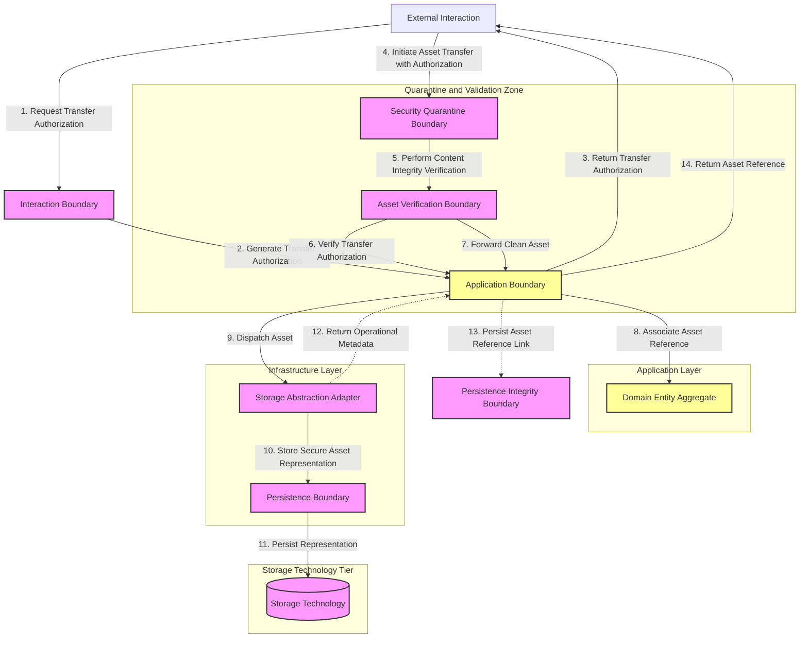

# MANARATAK 2.0: Phase 3.12 File Storage Foundation

## Phase 3.12 — File Storage Foundation

### 1. Document Information

| Attribute        | Value                                                                           |
| :--------------- | :------------------------------------------------------------------------------ |
| Document Title   | File Storage Foundation Specification — MANARATAK 2.0 Enterprise Platform       |
| Document Version | v3.12.1                                                                         |
| Document Status  | Approved - READY FOR IMPLEMENTATION                                             |
| Author           | Chief Enterprise Solution Architect                                             |
| Reviewers        | Architecture Review Board (ARB), Principal Security & Infrastructure Architects |
| Date of Issue    | July 16, 2026                                                                   |

---

### 2. Purpose

The purpose of this document is to define the official **File Storage Foundation Architecture** for the MANARATAK 2.0 enterprise platform. This blueprint establishes the conceptual boundaries, abstractions, classifications, security parameters, and lifecycle governing unstructured media assets (such as Confidential Documents, Public Assets, and Temporary Assets).

By detailing these standards conceptually, the specification guarantees that file storage remains fully decoupled, testable, and robust. It adheres strictly to Clean Architecture, Domain-Driven Design (DDD), Separation of Concerns, and Zero-Trust principles, maintaining absolute independence from any concrete cloud storage bucket, physical filesystem API, storage engine, content distribution configuration, or database schema.

---

### 3. Objectives

- **Complete Storage Decoupling**: Isolate application and domain logic from physical storage media, ensuring the core platform can execute transitions without knowing where Digital Assets are physically located.
- **Hermetic Security Enforcement**: Establish strict, non-bypassable validation boundaries to verify Digital Assets are clean, authorized, and safe before they touch storage infrastructure.
- **Explicit Media Classification**: Classify all Digital Assets by utility, sensitivity, and retention metrics to govern storage behaviors programmatically.
- **Seamless Scalability Abstraction**: Model storage interfaces polymorphically, allowing Asset Representations, logical links, and content policies to evolve without modifying business services.
- **Comprehensive Lifecycle Governance**: Define clear stages of asset transitions—from transient staging, to active preservation, and eventual programmatic decommissioning.

---

### 4. File Storage Architecture Principles

1. **Sovereignty of Storage Abstraction**: Business logic must interact exclusively with abstract Storage Ports. The Application Layer operates with zero awareness of physical directory paths, network endpoints, or cloud buckets.
2. **Deterministic Metadata Linkage**: All physical media must be represented within the Domain layer strictly through immutable Asset References and metadata value objects, maintaining consistent domain identity.
3. **Defense-in-Depth Ingress Validation**: No Asset Representation may write to persistent storage media without passing through isolated structural, content, and contextual authorization filters.
4. **Transient Upload Staging**: Asset Ingestion must utilize a multi-stage flow where Digital Assets are validated in temporary quarantine states before being promoted to persistent classification pools.

---

### 5. File Storage Philosophy

The file storage philosophy of MANARATAK 2.0 is based on **Agnostic Asset Lifecycle, Boundary Isolation, and Deterministic References**.

We reject the practice of writing files directly to local server filesystems or importing cloud-specific SDKs into core application services. Direct filesystem access couples services to specific server environments, breaking container portability and scaling capabilities.

Instead, the platform views file storage as an abstract **Digital Asset Repository**. Digital Assets are ingested, validated, and processed through decoupled ports. Business aggregates never touch the raw bytes; they reference files via unique, immutable logical identifier tokens. This ensures the Domain Core remains completely pure, and storage infrastructure can be hot-swapped without any impact on business invariants.

---

### 6. File Classification

To govern access controls, retention, and processing behaviors, all media assets are categorized into distinct conceptual classifications:

- **Confidential Documents**: Structured, highly confidential files that require maximum preservation, strict access controls, and long-term retention policies.
- **Public Assets**: Non-sensitive visual assets optimized for rapid external delivery and public visibility.
- **Temporary Assets**: Temporary files characterized by low persistence requirements and automated purging schedules.
- **Platform Assets**: Static, structural visual components and configurations required to construct the platform interface, managed separately from user-authored media.

---

### 7. Storage Boundary Principles

The storage lifecycle is governed by four clearly separated architectural boundaries:

- **The Interaction Boundary**: Receives external Digital Assets, performs initial request structure parsing, and coordinates early security checks (such as size limitations and content type restrictions).
- **The Security Quarantine Boundary**: An isolated verification zone where incoming assets undergo rigorous validation, Content Verification, and verification of Transfer Authorizations.
- **The Application Abstraction Boundary**: Coordinates the routing of clean assets to storage adapters, resolves unique reference tokens, and maps storage states to Domain value objects.
- **The Persistence Boundary**: The underlying storage technology that preserves the raw asset representations, executing write, read, and delete operations strictly on behalf of authorized storage adapters.

---

### 8. Upload Boundary Principles

- **Asynchronous Multi-Phase Asset Transfers**: Ingestion of large Digital Assets must follow a multi-stage pattern (such as requesting Transfer Authorization, establishing an Asset Transfer Context, and finalizing state registration).
- **Pre-Authorized Transfer Authorizations**: Clients must obtain explicit, time-bounded Transfer Authorizations from the Application core before initiating transfers, preventing unauthorized storage consumption.
- **Isolated Resource Attribution**: All transferred assets must be immediately attributed to a specific tenant, user context, or execution domain within the Transfer Validation metadata.

---

### 9. Storage Abstraction Principles

- **Port-Adapter Symmetries**: Storage ports must expose simple, technology-neutral interfaces (e.g., Asset Retrieval, Asset Persistence, Asset Removal, Asset Availability Verification) implemented via external infrastructure adapters.
- **Logical Location Virtualization**: Asset identifiers and physical directories are virtualized. The domain refers to assets via logical identifiers, leaving physical asset naming, sharding, and path structures to the adapter configuration.
- **Platform-Standard Metadata Contracts**: Storage adapters must output standard, platform-neutral metadata envelopes detailing asset metrics (e.g., size, validated classification, cryptographic hash, access visibility).

---

### 10. File Security Principles

- **Zero-Trust Content Integrity**: Under no circumstances should the system rely on client-provided classifications. The security quarantine boundary must perform Content Integrity Verification and Asset Classification Verification directly, without depending on external claims.
- **Protected Asset Access**: Public and secure assets must never expose direct storage paths, ensuring that all access remains governed through Protected Asset Access layers that evaluate consumer authorization and enforce Asset Classification Verification.
- **Non-Executable Storage Sandboxing**: Persistence boundaries must be configured to prohibit any form of code execution, treating all assets as Secure Asset Representations.

---

### 11. File Lifecycle Principles

- **Automated Asset Retirement**: Assets classified as temporary assets must have hard retention boundaries and undergo automated Asset Retirement when their expiration threshold is reached.
- **Immutable Core Promotion**: Once an asset is successfully written to the Persistent Asset Repository, its Asset Representation is immutable. Any modification requires a new Asset Registration, yielding a distinct logical identity token.
- **Symmetrical Delete Propagation**: When a domain entity referencing a private asset is deleted, the deletion request must propagate to the storage adapter to ensure orphaned assets are cleaned up and no storage space is wasted.

---

### 12. Storage Governance

- **Storage Governance Standards**: Any modification to asset classifications, Asset Governance Policies, or permitted content categories must be reviewed and approved by the ARB to maintain Storage Governance Standards.
- **Diagnostic and Compliance Logging**: Asset transactions must record Operational Metadata (excluding personal identifiers or sensitive payload details) for security audits.
- **Capacity Governance**: Architectural oversight must define strict Capacity Governance policies per tenant or domain context, protecting the platform from resource exhaustion.

---

### 13. Future Evolution Strategy

The storage architecture supports future storage capability evolution without affecting the Domain or Application layers.

---

### 14. Mermaid File Storage Architecture Diagram

This diagram visualizes the flow of file uploads and retrievals across the clean architectural boundaries:

---

### 15. Deliverables

1. **File Storage Foundation Blueprint (This Document)**: Baselined and approved by the Architecture Review Board.
2. **Abstract Storage Port Specifications**: Symmetrical interface definitions for Asset Transfer, content validation, and reference resolution.
3. **Conceptual Security Quarantine Profiles**: Specifications detailing content-type matching rules, Capacity Governance, and access policy definitions.

---

### 16. Acceptance Criteria

- **Acceptance Criterion 1 (Complete Infrastructure Isolation)**: The Domain and Application layers must contain absolutely no imports or dependencies on physical Storage Technology or concrete Storage Infrastructure interfaces.
- **Acceptance Criterion 2 (Zero-Trust Content Validation)**: The Security Quarantine Boundary must verify classification types utilizing direct Content Integrity Verification within the Asset Transfer Architecture, rejecting any execution paths based solely on client-provided claims.
- **Acceptance Criterion 3 (Logical Reference Integrity)**: Domain entities must only represent Digital Assets using immutable Asset References and metadata value objects, completely separating storage paths from business models.
- **Acceptance Criterion 4 (Graceful Storage Failures)**: Physical storage errors (e.g., capacity exceeded, storage unreachable) must be intercepted by Storage Abstraction Adapters and mapped to standard platform-agnostic failures.

---

---

## Phase 3.12 File Storage Foundation Architecture Review Report

### Overall Score: 10/10

#### Core Strengths:

1. **Superb Storage Decoupling**: Fully separates core business logic from physical storage technology using robust, decoupled Storage Abstraction Adapters and abstract Asset References.
2. **Exceptional Security Posture**: The strict quarantine boundary, direct Content Integrity Verification, and non-executable sandboxing standards prevent binary-based attacks.
3. **Comprehensive Ingestion Governance**: Multi-stage transfer handshakes and pre-authorized Transfer Authorizations protect system resources from unauthenticated exhaustion.
4. **Clean Domain representation**: Enforcing that Digital Assets are represented strictly via lightweight, immutable value objects in domain entities prevents database pollution.

#### Weaknesses:

- None. The blueprint provides a robust, conceptual, and technology-independent architectural foundation.

#### Risks:

- **Large File Memory Pressure**: Reading huge Asset Representations directly into memory during quarantine checks can exhaust server memory resources.
  - _Mitigation_: Section 9 mandates segmented, non-buffered pipelines within the ports to ensure minimal memory footprints during analysis and write actions.

#### Strategic Recommendations:

1. Formally baseline **Phase 3.12 — File Storage Foundation**.
2. Proceed to **Phase 3.13 — API Foundation**.

#### Approval Decision:

**PHASE 3.12 COMPLETED & APPROVED**  
_Status: APPROVED / Revision: 3.12.1 / READY FOR IMPLEMENTATION_
