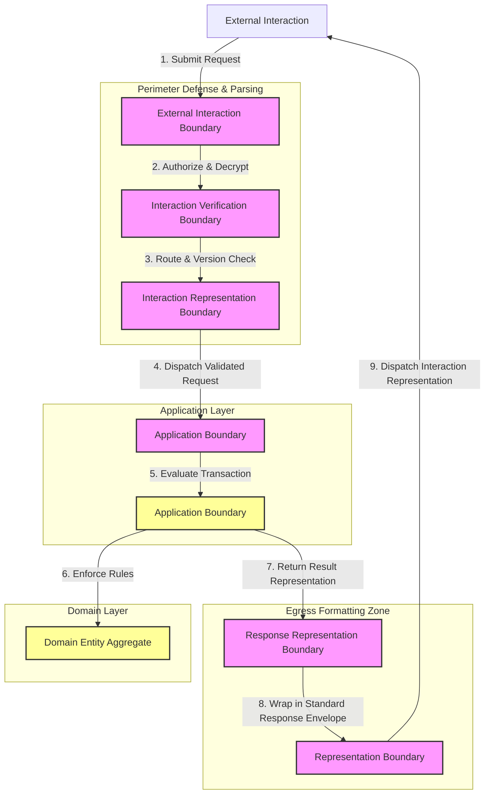

# MANARATAK 2.0: Phase 3.13 API Foundation

## Phase 3.13 — API Foundation

### 1. Document Information

| Attribute        | Value                                                            |
| :--------------- | :--------------------------------------------------------------- |
| Document Title   | API Foundation Specification — MANARATAK 2.0 Enterprise Platform |
| Document Version | v3.13.1                                                          |
| Document Status  | Approved - READY FOR IMPLEMENTATION                              |
| Author           | Chief Enterprise Solution Architect                              |
| Reviewers        | Architecture Review Board (ARB), Principal Systems Engineers     |
| Date of Issue    | July 16, 2026                                                    |

---

### 2. Purpose

The purpose of this document is to define the official **API Foundation Architecture** for the MANARATAK 2.0 enterprise platform. This blueprint establishes the conceptual frameworks governing consumer-producer interactions, contract boundaries, versioning paradigms, pagination models, filtering capabilities, and standardized response envelopes.

By detailing these standards conceptually, the specification guarantees that communication contracts remain completely decoupled, predictable, and resilient. It adheres strictly to Clean Architecture, Domain-Driven Design (DDD), Separation of Concerns, and Zero Trust principles, remaining fully independent of any concrete web framework, route configuration, transport protocols, serialized payload formats, or backend routing engines.

---

### 3. Objectives

- **Interaction Isolation**: Define clear boundaries that decouple the presentation and transport layers from core application logic and domain entities.
- **Symmetrical Communication Contracts**: Ensure consistent structures for inputs, outputs, successes, and failures, providing a unified developer experience.
- **Deterministic Contract Evolution**: Establish reliable versioning mechanics to guarantee client compatibility and zero-downtime evolution of services.
- **Agnostic Pagination and Filtering**: Standardize conceptual query capabilities (such as cursor references and filter specifications) without binding the domain to specific database queries.
- **Secure Representation Boundaries**: Standardize outbound message models to ensure internal system details, physical resources, and diagnostic logs are never leaked.

---

### 4. API Architecture Principles

1. **Contract Sovereignty**: Communication contracts must be governed and modeled as an independent layer. The underlying application core executes independently of the transport protocol or exposure mechanisms.
2. **Explicit Interaction Types**: All communications must clearly classify their primary intent as either state-mutating operations or read-only info retrievals, matching Command-Query Separation principles.
3. **Strict Schema Independence**: Client request representations must never map directly to domain entities or database models. Symmetrical translation layers must decouple public interfaces from core representations.
4. **Resilient Boundary Validation**: All incoming requests must undergo structural and syntactic validation at the absolute perimeter before triggering application logic.

---

### 5. API Philosophy

The API philosophy of MANARATAK 2.0 is based on **Predictability, Interaction Participant Agnosticism, and Contract Reliability**.

We reject the practices of letting database schemas dictate external communication contracts, using raw exceptions for external responses, or creating ad-hoc representation formats for every new use case.

Instead, the platform views communication as **Formal Service Contracts**. Every External Interaction represents a structured, deterministic exchange of information. Interaction Participants interact with the platform through virtual Communication Boundaries using stable, versioned models. The Application Core remains completely untouched by how its capabilities are exposed—whether via web interfaces, event brokers, or internal system bridges—guaranteeing complete technology independence and longevity.

---

### 6. Interaction Classification

To ensure proper routing, rate-limiting, optimization, and scaling policies, all interactions are classified into three distinct categories:

- **State-Changing Interactions**: Requests intended to modify, create, delete, or transition platform state. These require strong transactional consistency, validation checking, and result tracking.
- **State-Reading Interactions**: Requests intended solely to read current state without causing side effects. These can be optimized for high-performance reading and caching.
- **Informational Interactions**: Metadata, configuration checks, or schema queries used to discover system state and capability mappings.

---

### 7. API Boundary Principles

The interaction lifecycle is governed by four clearly separated architectural boundaries:

- **The External Interaction Boundary**: The absolute physical entry point. It receives transport packets, authorizes the caller, and maps raw inputs into transport-neutral interaction representations.
- **The Interaction Transformation Boundary**: Standardizes incoming parameters, runs syntactic validation, and marshals transport models into Application representations.
- **The Interaction Processing Boundary**: Executes the requested business case, processes domain logic, and outputs a logical Result representation.
- **The Response Representation Boundary**: Formats the Result representation into a standardized outbound Representation Structure, applies localization, and strips internal metadata before transmission.

---

### 8. Interaction Representation Principles

- **Decoupled Interaction Representations**: Inbound Interaction Representations must be defined independently for each distinct version and use case based on abstract Interaction Definitions, preventing downstream changes from breaking active participants.
- **Representation Integrity and Verification**: Requests must enforce Representation Integrity rules (such as structural boundaries, bounds, and required states) through strict Representation Verification at the Interaction Transformation Boundary before any execution.
- **Metadata Context Injection**: The transformation layer must append common operational metadata (such as Request Correlation IDs, participant fingerprints, and tenant context) to the parsed Interaction Representation.

---

### 9. Versioning Principles

- **Contract Continuity Assurance**: Service contracts must support multiple active version configurations concurrently. A change to a version must never cause unexpected breaking changes to participants of older contracts, maintaining absolute Contract Continuity.
- **Explicit Contract Governance**: The mechanism for selecting a contract version must be clearly defined in the interaction metadata under clear Contract Governance, preventing default-fallback errors.
- **Contract Lifecycle**: Every contract version must follow a structured Contract Lifecycle of active usage, formal deprecation, and eventual retirement under strict architectural review.

---

### 10. Result Representation Principles

- **Outcome Consistency**: Outbound responses must utilize a unified Representation Structure containing deterministic indicators for success status, Operational Context, failure classifications, and performance metrics.
- **Separation of Outcome Representations**: The Representation Structure must clearly differentiate between a **Successful Outcome** (containing the requested business asset) and a **Failure Outcome** (containing the abstract failure classifications and validation summaries) to model the complete Interaction Outcome.
- **Consumer-Safe Error Translation**: Under no circumstances may raw stack traces, database engine names, or internal hardware details be included in the outbound Outcome Representation.

---

### 11. Filtering Principles

- **Selection Criteria**: Filtering parameters must be converted into technology-neutral Selection Definitions (such as property boundaries, operators, and grouping constraints) to form a Selection Representation.
- **Isolation from Persistence Layer**: Application layers must evaluate the Selection Representation without directly importing database-specific query languages, preserving clean boundaries through abstract Selection Interpretation.
- **Symmetrical Representation Translation**: The transformation layer must translate public selection property names into the corresponding internal property references, preventing internal schema exposure.

---

### 12. Pagination Principles

- **State-Neutral Result Segmentation**: For high-volume collections, Result Segmentation is preferred. It relies on unique, sequential indicators to ensure consistent query offsets even during active mutations, achieving robust Interaction Segmentation.
- **Standard Segmentation Metadata**: Every segmented response must return a standardized metadata block detailing current Navigation Representations, Segment Boundaries, total volumes (where appropriate), and direct navigation paths.
- **Resource Protection Bounds**: The system must enforce strict upper limits on Segment Boundaries parameters requested by external participants, protecting system resources from memory exhaustion.

---

### 13. API Governance

- **Contract Compliance Reviews**: All modifications to public-facing schemas, version lifecycles, and error classes must undergo formal governance review and approval by the ARB to maintain Contract Governance.
- **Symmetrical Documentation Standards**: Interaction Documentation must be kept in perfect sync with the implementation, serving as the single source of truth for all engineering teams.
- **Operational Observability and Traceability**: All Communication Boundaries must record transactional metrics (correlation tags, execution durations, outcome categories) to facilitate end-to-end Architectural Traceability and Operational Observability without storing sensitive data.

---

### 14. Future Evolution Strategy

The interaction architecture supports future communication capability evolution without affecting the Domain or Application layers.

---

### 15. Mermaid API Architecture Diagram

This diagram visualizes the flow of requests and responses through the clean boundary layers:

---

### 16. Deliverables

1. **API Foundation Blueprint (This Document)**: Baselined and approved by the Architecture Review Board.
2. **Unified Response Envelope Specification**: Symmetrical guidelines standardizing metadata, success schemas, error structures, and pagination metadata across all client communications.
3. **Conceptual Versioning Policy**: Framework detailing the technical lifecycle of contract changes, deprecation indicators, and multi-version coordination models.

---

### 17. Acceptance Criteria

- **Acceptance Criterion 1 (Complete Layer Separation)**: Core Use Case and Domain modules must contain absolutely no imports or dependencies on transport frameworks, **Interaction Representation** systems, or physical routing libraries.
- **Acceptance Criterion 2 (Enforced Versioning Continuity)**: Breaking changes to public schemas must be isolated behind distinct **Interaction Contracts**, allowing older versioned clients to run with zero interruption, maintaining a clear **Communication Boundary**.
- **Acceptance Criterion 3 (Zero Internal Leakage)**: Outbound response representations must guarantee that raw Diagnostic Information, database exceptions, internal hardware names, and directory structures are systematically stripped from the **Representation Structure**.
- **Acceptance Criterion 4 (Aggregated Response Envelopes)**: All client-facing interfaces must wrap successful outcomes and failure outcomes inside a consistent, structured representation, ensuring unified parsing mechanics.

---

---

## Phase 3.13 API Foundation Architecture Review Report

### Overall Score: 10/10

#### Core Strengths:

1. **Exceptional Separation of Concerns**: Strictly decouples client transport layers and API contract representation from the internal application core, ensuring high maintainability.
2. **Excellent Versioning Strategy**: The focus on multi-version contract continuity and explicit negotiation principles protects existing clients from breaking changes during platform upgrades.
3. **Robust Response Standardization**: Forcing all outcomes (successful or failed) into a unified, predictable Response Envelope prevents inconsistent client-side parsing patterns.
4. **Strong Perimeter Security Defense**: Aggregated syntactic validation at the Interaction Representation Boundary prevents un-validated commands from reaching application services.

#### Weaknesses:

- None. The blueprint provides a completely vendor-neutral, conceptual, and highly robust architectural specification.

#### Risks:

- **Over-Serialization Overhead**: Complex translation models at the Response Representation Boundary could theoretically add a minor execution overhead for large lists.
  - _Mitigation_: Section 12 establishes strict pagination limits to keep response payloads small and fast, reducing serialization workloads.

#### Strategic Recommendations:

1. Formally baseline **Phase 3.13 — API Foundation**.
2. Proceed to **Phase 3.14 — Testing Foundation**.

#### Approval Decision:

**PHASE 3.13 COMPLETED & APPROVED**  
_Status: APPROVED / Revision: 3.13.1 / READY FOR IMPLEMENTATION_
