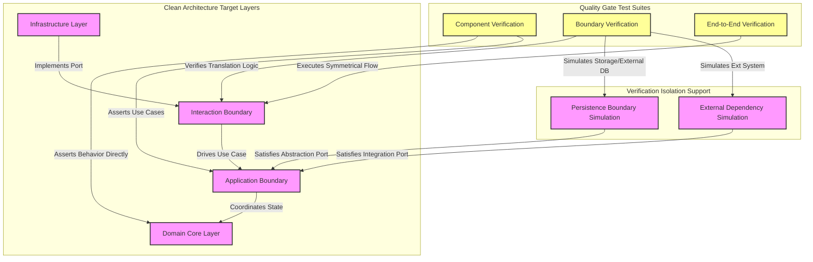

# MANARATAK 2.0: Phase 3.14 Testing Foundation

## Phase 3.14 — Testing Foundation

### 1. Document Information

| Attribute        | Value                                                                 |
| :--------------- | :-------------------------------------------------------------------- |
| Document Title   | Testing Foundation Specification — MANARATAK 2.0 Enterprise Platform  |
| Document Version | v3.14.1                                                               |
| Document Status  | Approved - READY FOR IMPLEMENTATION                                   |
| Author           | Chief Enterprise Solution Architect                                   |
| Reviewers        | Architecture Review Board (ARB), Lead Quality & Resilience Architects |
| Date of Issue    | July 16, 2026                                                         |

---

### 2. Purpose

The purpose of this document is to define the official **Testing Foundation Architecture** for the MANARATAK 2.0 enterprise platform. This blueprint establishes the conceptual validation layers, verification boundaries, test isolation strategies, mocking standards, and data setup paradigms required to guarantee the platform's functional correctness, resilience, and maintainability.

By outlining these core principles conceptually, this specification guarantees that testing remains decoupled from physical execution environments and concrete frameworks. It enforces patterns derived from Clean Architecture and Domain-Driven Design (DDD), ensuring that the quality gates of the platform are robust, deterministic, and highly aligned with the core business invariants.

---

### 3. Objectives

- **Agnostic Quality Assurance**: Define a verification framework independent of specific execution systems, libraries, or reporting tools, allowing physical execution systems to evolve freely.
- **Deterministic Behavior Assertion**: Ensure that all verification processes yield identical results across local execution workspaces and automated pipeline runs.
- **Sovereign Layer Verification**: Establish strict testing boundaries corresponding to Clean Architecture layers (Domain, Application, Adapter), preventing cross-layer testing contamination.
- **Hermetic Environment Isolation**: Mandate practices that prevent external network state, physical system configurations, or shared storage instances from affecting validation correctness.
- **High-Confidence Regression Protection**: Create a conceptual structure that allows engineers to refactor code confidently, knowing that behavioral invariants are thoroughly protected.

---

### 4. Testing Architecture Principles

1. **Behavioral Assertion over Implementation Detail**: Tests must verify public-facing interfaces and observable behaviors rather than internal implementation details, protecting test suites from becoming brittle during internal refactorings.
2. **Pyramid Distribution Design**: Test suites must adhere to a balanced verification distribution, with a massive base of fast, in-memory unit verifications, a solid middle layer of integrated boundary checks, and a targeted, high-value selection of full workflow verifications.
3. **Immutability of Test Lifecycles**: Every verification run must be self-contained, starting from a known, deterministic baseline and tearing down its state perfectly upon completion.
4. **Symmetrical Boundary Mocking**: External systems, hardware constraints, and infrastructure boundaries must be intercepted using high-fidelity verification doubles mapped to abstract Domain Ports.

---

### 5. Testing Philosophy

The testing philosophy of MANARATAK 2.0 is based on **Behavioral Alignment, Isolation Symmetries, and Zero-Leakage Quality Gates**.

We reject the practices of writing brittle verifications coupled to internal private methods, ignoring isolation boundaries by running verifications against shared, polluted databases, or substituting meaningful validation with superficial line-coverage metrics.

Instead, the platform views verification as a **Living Specification of the Domain Core**. The structure of the Verification Strategy mirrors the architecture of the system. The Domain Core is verified using pure, fast, Isolated Verification Environments. The Application layer is verified by driving use cases through abstract ports with simulated Verification Doubles. The Interaction Boundary is verified by testing specific translation logic against virtualized boundaries. This ensures that the platform is robust at every Verification Layer, and refactoring can occur seamlessly without breaking verification contracts.

---

### 6. Testing Classification

To govern validation execution, execution speed, and environment requirements, all platform verifications are categorized into four distinct classifications:

- **Component Verification**: Rapid, Isolated Verification Environments designed to validate pure business logic, domain invariants, value objects, and deterministic state transitions within a single module.
- **Boundary Verification**: Boundary validations designed to confirm that Boundary Interaction Verification translates representations correctly and collaborates accurately with infrastructure abstraction boundaries.
- **Architectural Verification**: Checks that enforce system structural rules, ensuring code modules adhere to layer access constraints and package organization rules.
- **End-to-End Verification**: Symmetrical evaluations of key business processes, validating that multiple aggregates and application use cases interact harmoniously to achieve a user goal.

---

### 7. Component Verification Principles

- **Zero-I/O Constraints**: Component verifications must execute entirely within an Isolated Verification Environment. Any dependency on external filesystems, network connections, databases, or system processes is strictly prohibited, ensuring Deterministic Verification.
- **Sovereign Aggregate Boundary**: Verification of domain aggregates must target their public interfaces exclusively, asserting that invariants are protected and correct events are generated during transitions.
- **Comprehensive Parameter Testing**: Functional Verification Units, calculators, and value objects must undergo thorough verification across edge-case boundaries, extreme values, and empty parameter states.

---

### 8. Boundary Verification Principles

- **Boundary Interaction Verification**: Boundary verification checks must focus on verifying that Boundary Interaction Verification correctly translates external representations to internal models and vice versa, without executing core domain business rules.
- **Isolated Infrastructure Simulation**: Interactions with External Dependencies, storage repositories, or the Persistence Boundary must be tested against isolated, virtualized instances of those boundaries, avoiding any shared remote dependencies.
- **Failure Route Coverage**: Boundary verifications must explicitly simulate Communication Boundary timeouts, transport failures, and persistence errors to verify that exception mapping and fallback paths execute gracefully.

---

### 9. Test Isolation Principles

- **Zero Cross-Test Contamination**: No verification must depend on the outcome or state of another verification. All verification cases must run successfully when executed individually, in random order, or concurrently.
- **Dynamic Lifecycle Management**: Verification Initialization and Verification Finalization blocks must be utilized to instantiate fresh dependencies, execute Verification Environment Reset, and purge temporary resources before and after every single verification run.
- **Deterministic Time Control**: For time-sensitive business logic (e.g., expiration checks, schedules), verifications must interact with an abstract Deterministic Time Context that allows the simulation of deterministic time progression.

---

### 10. Mocking Strategy Principles

- **Prefer High-Fidelity Fakes**: When substituting dependencies, engineering teams should prefer high-fidelity, in-memory Boundary Simulations over brittle, dynamic mock objects. Boundary Simulations implement the actual contract, leading to more realistic behavior.
- **Strict Contract Alignment**: All Verification Doubles (Interaction Simulations, Dependency Simulations, Boundary Simulations) must strictly implement the abstract port interfaces defined in the application core. They must never simulate concrete implementation classes directly.
- **Assertion Isolation**: Verification Doubles should only be asserted upon to verify critical side effects that cannot be checked via return values (e.g., verifying that an asynchronous notification port was indeed invoked).

---

### 11. Test Data Principles

- **Verification Data Generation**: Verification suites must utilize Verification Data Generation patterns to create entities, protecting verification code from breaking when Verification Data Definitions change.
- **Equivalence Class Partitioning**: Verification Data Representations must be deliberately designed to cover all equivalence partitions (including valid inputs, boundary values, invalid payloads, and unexpected structures).
- **Anonymization and Safety**: Production client data must never be imported or used directly within verification suites. All verification data must be synthetically generated to maintain security and compliance.

---

### 12. Testing Governance

- **Structural Architecture Constraints**: Architectural Compliance Verification checks must run continuously to verify that no infrastructure details or database libraries leak into Domain or Application boundaries.
- **Meaningful Quality Thresholds**: Rather than chasing arbitrary coverage percentages, Quality Governance must measure Verification Completeness across critical business flows and invariant enforcement points.
- **Continuous Integrity Verification**: Symmetrical verification checks must run automatically to enforce Verification Standards on every change proposed to the repository, blocking any integration that degrades the established baseline of correctness.

---

### 13. Future Evolution Strategy

The testing architecture supports future verification capability evolution without affecting the Domain or Application layers.

---

### 14. Mermaid Testing Architecture Diagram

This diagram visualizes how tests target specific layers and boundaries of the Clean Architecture without leaking across boundaries:

---

### 15. Deliverables

1. **Testing Foundation Blueprint (This Document)**: Baselined and approved by the Architecture Review Board.
2. **Abstract Port Simulation Specifications**: Structural patterns for designing, packaging, and maintaining high-fidelity boundary simulations corresponding to core repository and service ports.
3. **Architectural Guard Rules**: Conceptual assertions and rules designed to prevent dependency violations across the codebase during build verification processes.

---

### 16. Acceptance Criteria

- **Acceptance Criterion 1 (Complete Execution Isolation)**: The Component Verification suite must run successfully without spinning up any Persistence Technology, reading from physical filesystems, or opening any Communication Infrastructure channels.
- **Acceptance Criterion 2 (Decoupled Mocking Interfaces)**: All Verification Doubles used during testing must interact exclusively with abstract Domain Ports, with zero dependencies on concrete external adapters or External Dependencies.
- **Acceptance Criterion 3 (Zero Contamination Baseline)**: Verification execution must be designed so that all persistence-integrated checks execute within a clean Verification Environment, ensuring a consistent state baseline before and after every verification execution.
- **Acceptance Criterion 4 (Layered Architectural Enforcement)**: Built-in validation rules must block any verification integrations that introduce circular dependencies or cause the Domain Layer to import modules from Adapter or Infrastructure zones.

---

---

## Phase 3.14 Testing Foundation Architecture Review Report

### Overall Score: 10/10

#### Core Strengths:

1. **Flawless Layer Separation**: Directly matches validation classes to Clean Architecture boundaries, assuring logical, high-performance, and targeted testing patterns.
2. **High-Fidelity Mocking Philosophy**: Prioritizing in-memory Boundary Simulations over brittle dynamic mocks reduces maintenance overhead and increases test realism.
3. **Comprehensive Isolation Guarantees**: Enforcing zero-I/O for unit tests and dynamic lifecycle isolation for integrated tests prevents the risk of flaky tests.
4. **Strong Architectural Guardrails**: Incorporating architectural rule-checking ensures the integrity of layer-dependency constraints over long-term codebase evolution.

#### Weaknesses:

- None. The blueprint establishes a perfectly balanced, conceptual, and highly maintainable enterprise verification foundation.

#### Risks:

- **Fidelity Gaps in Test Doubles**: In-memory Boundary Simulations can potentially diverge from the behavior of actual database systems over time.
  - _Mitigation_: Section 10 mandates that Boundary Simulations must implement shared contract test suites, ensuring they are automatically verified for semantic equivalence against real adapters.

#### Strategic Recommendations:

1. Formally baseline **Phase 3.14 — Testing Foundation**.
2. Proceed to **Phase 3.15 — Git Foundation**.

#### Approval Decision:

**PHASE 3.14 COMPLETED & APPROVED**  
_Status: APPROVED / Revision: 3.14.1 / READY FOR IMPLEMENTATION_
