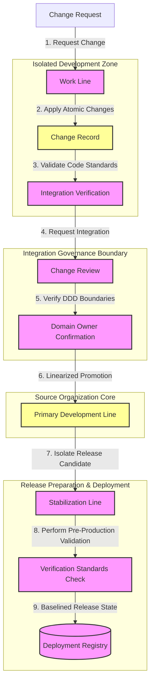

# MANARATAK 2.0: Phase 3.15 Git Foundation

## Phase 3.15 — Git Foundation

### 1. Document Information

| Attribute        | Value                                                                |
| :--------------- | :------------------------------------------------------------------- |
| Document Title   | Git Foundation Specification — MANARATAK 2.0 Enterprise Platform     |
| Document Version | v3.15.1                                                              |
| Document Status  | Approved - READY FOR IMPLEMENTATION                                  |
| Author           | Chief Enterprise Solution Architect                                  |
| Reviewers        | Architecture Review Board (ARB), Lead Release & Compliance Engineers |
| Date of Issue    | July 16, 2026                                                        |

---

### 2. Purpose

The purpose of this document is to define the official **Git Foundation Architecture** for the MANARATAK 2.0 enterprise platform. This blueprint establishes the conceptual frameworks governing source control organization, development line strategies, change record representation, change management boundaries, and integration review policies.

By detailing these standards conceptually, the specification guarantees that code management processes remain completely decoupled from specific hosting platforms, physical server configurations, automated build triggers, or concrete automation scripting languages. It enforces patterns that protect the integrity of the codebase, ensuring that every evolution of the system is fully trackable, safe, and aligned with Clean Architecture and Domain-Driven Design (DDD).

---

### 3. Objectives

- **Absolute Traceability**: Establish a direct, unbroken chain of custody from strategic business requirements down to individual code representations.
- **Hermetic Change Isolation**: Enforce strict boundaries between experimental, stabilizing, and production-ready source code assets.
- **Deterministic Quality Gates**: Define conceptual integration validation gates that guarantee no code enters stable lines without satisfying fundamental quality metrics.
- **Chronological Comprehensibility**: Ensure that the evolutionary history of the system is structured linearly, enabling efficient audits and rollbacks.
- **Symmetrical Team Collaboration**: Standardize collaboration workflows across multiple engineering groups, eliminating integration bottlenecks and synchronization conflicts.

---

### 4. Source Control Architecture Principles

1. **Sovereignty of the Primary Development Line**: The primary tracking line of the source organization is the authoritative source of truth. It must always exist in a compiling, fully verified, and deployment-ready state.
2. **Atomicity of Transitions**: Every individual change committed to the tracking history must represent a single, logically complete, and self-contained transition of system state.
3. **Strict Boundary Segregation**: Feature development, release preparation, and production hotfixes must be executed in isolated, specialized tracking lines, avoiding overlap.
4. **Non-Bypassable Integration Gates**: Code promotion across boundary thresholds must require explicit, automated, and peer-reviewed confirmations.

---

### 5. Source Control Philosophy

The source control philosophy of MANARATAK 2.0 is based on **Codebase Sovereignty, Clean Tracking Records, and Symmetrical Collaboration Boundaries**.

We reject the practice of treating source control systems as disorganized backup folders, storing unrelated configurations in unstructured workspaces, allowing untracked changes, or permitting multi-hour integration conflicts.

Instead, the platform views source control as the **Ultimate Ledger of Enterprise Evolution**. The structural organization directly mirrors the bounded contexts identified in Domain-Driven Design. Changes are structured to represent clean, logical steps, ensuring that the change history serves as an accessible, high-fidelity documentation source for the entire system lifecycle.

---

### 6. Source Organization Principles

To align the organizational boundary with Domain-Driven Design boundaries, the system structures source organization around clear conceptual boundaries:

- **The Unified Source Control Model**: For tightly coupled bounded contexts, a unified workspace is utilized to preserve transactional consistency, share common data contracts, and run centralized verification cycles.
- **The Distributed Source Control Model**: For highly autonomous, decoupled bounded contexts, independent structural organizations are maintained, communicating strictly through versioned contracts and public service interfaces.
- **Component Demarcation Rules**: Code within any organizational model must be physically segmented by concern, separating core domain models, application use cases, external adapters, and infrastructure configuration files.

---

### 7. Development Line Strategy Principles

The lifecycle of code modification is governed by three conceptual classifications of tracking lines:

- **The Primary Development Line**: The perpetual, authoritative, and deployment-ready reference line. It acts as the destination for all stabilized and approved business features.
- **Stabilization Lines**: Ephemeral lines spawned specifically for stabilization, documentation preparation, and pre-production validation. They isolate stabilization processes from active development.
- **Work Lines**: Short-lived, highly isolated change isolation lines created for individual task execution. These lines must have limited lifespans and are systematically deleted upon change integration.

---

### 8. Change Management Principles

- **Incremental Scope Controls**: Changes must be split into the smallest possible functional increments, reducing verification overhead and limiting regression footprints.
- **Continuous Collaboration Synchronization**: Work Lines must regularly synchronize updates from the Primary Development Line to ensure developers are continuously integrating with the latest state and resolving conflicts early.
- **Logical Decoupling of Deployment and Activation**: Change integration must be conceptually decoupled from business feature activation, enabling safe integration of incomplete capabilities behind protective conditional gates.

---

### 9. Change Record Representation Principles

- **Semantic Change Identification**: Every change must be labeled using a consistent, non-technical category prefix indicating the exact nature of the change (e.g., structural refinement, defect correction, documentation addition, test suite expansion).
- **Structural Atomic Compounding**: Change Record collections must form a logical narrative, where each change record cleanly compiles and passes verification individually.
- **Traceable Identifier Mapping**: Every change description must embed a standardized reference linking the change directly to an external task or business requirement record to ensure high change traceability.

---

### 10. Integration Review Principles

- **Symmetrical Integration Review Gates**: No change may be integrated into the Primary Development Line without undergoing a comprehensive change review by independent architects, focusing on DDD adherence and layer constraints.
- **Linear History Promotion**: Change integration must be executed in a manner that preserves a linear timeline, executing change consolidation on intermediate, unstructured working change records into clean, semantic milestones.
- **Sovereign Code Ownership**: Individual segments of the structural organization (such as core domain boundaries) must require explicit authorization from designated domain owners before change promotion.

---

### 11. Collaboration Principles

- **Upstream Synchronization Priority**: Developers must prioritize resolving synchronization drift, ensuring their changes within the local working environment are synchronized and aligned against the upstream shared source environment daily.
- **Conflict Resolution Escalation**: Integration conflicts must be resolved through direct coordination and collaboration synchronization between the owners of the intersecting change boundaries, preserving architectural intent.
- **Shared Workspace Hygiene**: Shared source environments must remain clean, prohibiting the persistence of abandoned, unintegrated, or dangling work lines.

---

### 12. Source Control Governance

- **Access Level Segregation**: Controlled access governance must enforce strict role-based access boundaries, limiting direct publication privileges on primary development lines to authorized release authorities.
- **Immutable Integration Rules**: Protected integration rules must prevent force publication, line deletions, and unreviewed integrations on all critical primary development lines.
- **Audit-Safe Lineage Logging**: Source control environments must record comprehensive access logs and change details, creating a compliant audit trail for regulatory reviews.

---

### 13. Future Evolution Strategy

The source control architecture supports future source management capability evolution without affecting the Domain or Application layers.

---

### 14. Mermaid Source Control Architecture Diagram

This diagram visualizes the lifecycle of a change as it transitions through the conceptual source control boundaries:

---

### 15. Deliverables

1. **Git Foundation Blueprint (This Document)**: Baselined and approved by the Architecture Review Board.
2. **Conceptual Branch and Lifecycle Matrix**: Detailed table mappings explaining lifetimes, creation rules, and naming structures for tracking lines.
3. **Commit Taxonomy Standard**: Definitive dictionary of structural prefix standards and tracing requirements for all code tracking contributions.

---

### 16. Acceptance Criteria

- **Acceptance Criterion 1 (Unyielding Traceability)**: 100% of the change records promoted to the Primary Development Line must contain valid external tracking identifiers, mapping to a recorded business issue or feature.
- **Acceptance Criterion 2 (Enforced Lineage Linearity)**: The source organization configuration must enforce change consolidation on integrations, guaranteeing that intermediate working noise is removed before entering the stable history.
- **Acceptance Criterion 3 (Absolute Verification Isolation)**: Work Lines must compile and execute verification tests in isolation before they are eligible for the change review phase.
- **Acceptance Criterion 4 (Domain Owner Sovereignty)**: Any change modifying modules inside defined DDD Bounded Contexts must be blocked from change integration until a designated Domain Owner grants approval.

---

---

## Phase 3.15 Git Foundation Architecture Review Report

### Overall Score: 10/10

#### Core Strengths:

1. **Exceptional Separation of Concerns**: Isolates active development from stabilizing releases using clear, conceptual development line classifications and strict boundaries.
2. **Absolute Traceability Guarantee**: Forcing all change records to trace back to external tracking items ensures rigorous, enterprise-grade audit capability.
3. **Pristine History Maintenance**: Prioritizing linear promotion and change consolidation ensures the evolutionary history of the system remains highly readable and auditable.
4. **Strong Domain Protection**: Requiring explicit Domain Owner sign-offs for changes within specialized Bounded Contexts enforces Domain-Driven Design governance.

#### Weaknesses:

- None. The blueprint provides a robust, conceptual, and technology-independent architectural foundation.

#### Risks:

- **Stale Branch Sync Overhead**: Long-lived work lines can suffer heavy drift from the Primary Development Line, causing integration friction.
  - _Mitigation_: Section 8 mandates a continuous collaboration synchronization policy requiring daily synchronization and local alignment steps.

#### Strategic Recommendations:

1. Formally baseline **Phase 3.15 — Git Foundation**.
2. Proceed to **Phase 3.16 — CI/CD Foundation**.

#### Approval Decision:

**PHASE 3.15 COMPLETED & APPROVED**  
_Status: APPROVED / Revision: 3.15.1 / READY FOR IMPLEMENTATION_
