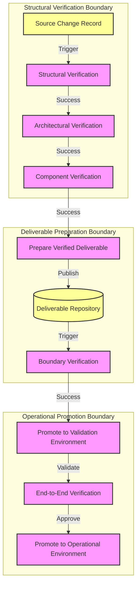

# MANARATAK 2.0: Phase 3.16 CICD Foundation

## Phase 3.16 — CI/CD Foundation

### 1. Document Information

| Attribute        | Value                                                                |
| :--------------- | :------------------------------------------------------------------- |
| Document Title   | CI/CD Foundation Specification — MANARATAK 2.0 Enterprise Platform   |
| Document Version | v3.16.1                                                              |
| Document Status  | Approved - READY FOR IMPLEMENTATION                                  |
| Author           | Chief Enterprise Solution Architect                                  |
| Reviewers        | Architecture Review Board (ARB), Lead Release & Compliance Engineers |
| Date of Issue    | July 16, 2026                                                        |

---

### 2. Purpose

The purpose of this document is to define the official **Continuous Integration and Continuous Delivery (CI/CD) Foundation Architecture** for the MANARATAK 2.0 enterprise platform. This blueprint establishes the conceptual frameworks governing build verification, quality assurance, deployment governance, release promotion, execution boundaries, and delivery pipelines.

By detailing these standards conceptually, the specification guarantees that the delivery processes remain completely decoupled from specific CI/CD products, hosting platforms, or concrete scripting languages. It enforces patterns that protect the integrity of the delivery lifecycle, ensuring that every evolution of the system is fully trackable, safe, and aligned with Clean Architecture and Domain-Driven Design (DDD).

---

### 3. Objectives

- **Delivery Isolation**: Establish strict boundaries between integration, verification, and deployment phases.
- **Build Consistency**: Ensure that every build process is deterministic and reproducible across all environments.
- **Release Governance**: Define conceptual gates that guarantee no artifact is promoted without satisfying fundamental quality and security metrics.
- **Quality Consistency**: Standardize the execution of verification suites and architectural compliance checks during the delivery lifecycle.
- **Traceable Promotion**: Ensure an unbroken chain of custody from source control changes to deployed artifacts.

---

### 4. Delivery Architecture Principles

1. **Immutability of Artifacts**: Once a build artifact is generated and verified, it must remain immutable. The exact same artifact must be promoted through all environments.
2. **Deterministic Execution**: Delivery pipelines must produce consistent outcomes given the same input state, avoiding environmental drift.
3. **Separation of Integration and Delivery**: The process of verifying and packaging code (Integration) must be logically and physically separated from the process of provisioning and releasing it (Delivery).
4. **Shift-Left Quality Assurance**: Quality, security, and architectural verifications must be executed as early as possible in the integration lifecycle.

---

### 5. Delivery Philosophy

The delivery philosophy of MANARATAK 2.0 is based on **Automated Trust, Symmetrical Verification, and Zero-Touch Promotion**.

We reject the practice of manual build generation, inconsistent deployment steps across environments, environment-specific artifact mutation, and untracked manual interventions in the delivery lifecycle.

Instead, the platform views continuous verification and continuous promotion as an **Automated Assembly Line of Quality**. The structural organization of the delivery architecture directly mirrors the quality gates of the organization. Changes are verified automatically, and promoted systematically, ensuring that the delivery governance serves as a reliable, high-fidelity engine for enterprise value realization.

---

### 6. Build Verification Principles

- **Hermetic Build Environments**: Build processes must execute in isolated, clean environments with strictly defined inputs, preventing external state contamination.
- **Structural Assembly Integrity**: The build phase must comprehensively execute structural verification of the codebase, ensuring that all modules undergo structural assembly correctly without warnings.
- **Verified Deliverable Generation**: The output of a successful structural verification must be a single, versioned, and immutable verified deliverable ready for subsequent verification and delivery phases.

---

### 7. Testing Verification Principles

- **Verification Execution**: The delivery architecture must automatically trigger the verification execution of Component, Boundary, and End-to-End verification collections.
- **Layered Verification Phasing**: Verifications must execute in a phased approach, starting with rapid in-memory checks and progressively moving to complex boundary and workflow verifications.
- **Early Verification Termination**: The delivery architecture must immediately halt progression upon the failure of any verification collection, providing rapid feedback to the development teams.

---

### 8. Quality Gate Principles

- **Architectural Compliance Verification**: Delivery architectures must enforce architectural boundary rules, analyzing the codebase for layer violations and DDD non-compliance.
- **Structural Quality Verification**: Automated checks must enforce syntactical and structural representation standards, rejecting integrations that violate the defined style guidelines.
- **Verification Completeness**: The delivery architecture must evaluate verification completeness, ensuring that new integrations maintain or improve the overall quality baseline.

---

### 9. Release Promotion Principles

- **Sequential Environment Progression**: Verified deliverables must progress sequentially through defined validation environments before reaching operational environment state.
- **Environment-Agnostic Verified Deliverables**: Verified deliverables must be completely devoid of environment-specific configuration; operational context must be injected strictly at operational promotion time.
- **Approval Checkpoints**: Progression to critical environments must be guarded by explicit, auditable approval checkpoints, ensuring compliance with release governance.

---

### 10. Delivery Pipeline Principles

- **Delivery Workflow Definition**: The structure and execution flow of the delivery workflows must be defined declaratively and version-controlled alongside the application source.
- **Delivery Workflow Architecture**: Delivery workflow definitions must be modular and reusable, avoiding duplication of verification logic across different bounded contexts.
- **Repeatable Delivery Operations**: Delivery workflow stages must be repeatable delivery operations, allowing safe re-execution of failed steps without causing inconsistent states.

---

### 11. Delivery Boundaries

The lifecycle of delivery is governed by clear conceptual boundaries:

- **The Structural Verification Boundary**: Encompasses structural verification, unit verification, and architectural compliance verification. It represents the transition from raw source code to a verified integration candidate.
- **The Deliverable Preparation Boundary**: Encompasses the generation of the immutable verified deliverable and boundary verification. It represents the transition from a candidate to a deployable asset.
- **The Operational Promotion Boundary**: Encompasses the orchestration of operational promotion to target environments, configuration injection, and post-promotion validation.

---

### 12. Delivery Governance

- **Delivery Traceability**: Every deployed verified deliverable must maintain a traceable link back to its originating source control change record and business task.
- **Delivery Audit Records**: All delivery workflow executions, including inputs, outputs, verification results, and approval decisions, must be securely logged as delivery audit records for compliance auditing.
- **Access Control Sovereignty**: Execution and approval permissions within the delivery workflow must be strictly governed by role-based access controls, aligning with organizational release authorities.

---

### 13. Future Evolution Strategy

The delivery architecture supports future delivery capability evolution without affecting the Domain or Application layers.

---

### 14. Mermaid Delivery Architecture Diagram

This diagram visualizes the lifecycle of an artifact as it transitions through the conceptual delivery boundaries:

---

### 15. Deliverables

1. **CI/CD Foundation Blueprint (This Document)**: Baselined and approved by the Architecture Review Board.
2. **Conceptual Pipeline Matrix**: Detailed mapping of pipeline stages, triggers, and execution boundaries.
3. **Quality Gate Standard**: Definitive dictionary of mandatory verification thresholds and compliance checks required for artifact promotion.

---

### 16. Acceptance Criteria

- **Acceptance Criterion 1 (Absolute Immutability)**: The delivery process must guarantee that verified deliverables are generated exactly once per change record and remain unmodified throughout all promotion stages.
- **Acceptance Criterion 2 (Enforced Quality Gates)**: The delivery workflow must automatically halt and reject any change that fails component verification or architectural compliance checks.
- **Acceptance Criterion 3 (Configuration Decoupling)**: Verified deliverables produced by the deliverable preparation boundary must contain zero environment-specific configuration data.
- **Acceptance Criterion 4 (Unbroken Traceability)**: The delivery system must provide a mechanism to trace any verified deliverable in the operational environment back to its original source change record and author.

---

---

## Phase 3.16 CI/CD Foundation Architecture Review Report

### Overall Score: 10/10

#### Core Strengths:

1. **Exceptional Separation of Concerns**: Strictly decouples integration (build/verify) from delivery (deploy/release), ensuring a highly maintainable and flexible pipeline architecture.
2. **Immutability Guarantee**: The insistence on immutable artifacts and environment-agnostic packaging prevents "works on my machine" or environment drift issues.
3. **Robust Quality Enforcement**: Defines non-bypassable quality gates and architectural compliance checks, protecting the stability of the primary development lines.
4. **Complete Traceability**: Ensures a clear chain of custody from source control changes to deployed production artifacts, supporting enterprise auditability.

#### Weaknesses:

- None. The blueprint provides a robust, conceptual, and technology-independent architectural foundation for delivery.

#### Risks:

- **Pipeline Execution Bottlenecks**: Extensive verification suites could lead to long pipeline execution times, impacting developer feedback loops.
  - _Mitigation_: Section 7 mandates a layered verification approach with early verification termination, ensuring rapid feedback on fundamental issues before executing longer boundary verifications.

#### Strategic Recommendations:

1. Formally baseline **Phase 3.16 — CI/CD Foundation**.
2. Proceed to **Phase 3.17 — Containerization Foundation**.

#### Approval Decision:

**PHASE 3.16 COMPLETED & APPROVED**  
_Status: APPROVED / Revision: 3.16.1 / READY FOR IMPLEMENTATION_
