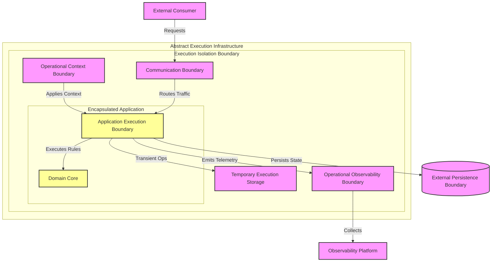

# MANARATAK 2.0: Phase 3.17 Docker Foundation

## Phase 3.17 — Containerization Foundation

### 1. Document Information

| Attribute        | Value                                                                         |
| :--------------- | :---------------------------------------------------------------------------- |
| Document Title   | Containerization Foundation Specification — MANARATAK 2.0 Enterprise Platform |
| Document Version | v3.17.1                                                                       |
| Document Status  | Approved - READY FOR IMPLEMENTATION                                           |
| Author           | Chief Enterprise Solution Architect                                           |
| Reviewers        | Architecture Review Board (ARB), Lead Platform Engineers                      |
| Date of Issue    | July 16, 2026                                                                 |

---

### 2. Purpose

The purpose of this document is to define the official **Containerization Foundation Architecture** for the MANARATAK 2.0 enterprise platform. This blueprint establishes the conceptual frameworks governing execution isolation, runtime consistency, container boundaries, environment portability, operational governance, and runtime resources.

By detailing these standards conceptually, the specification guarantees that the containerization processes remain completely decoupled from specific container runtimes, orchestration engines, registry providers, or underlying hardware operating systems. It enforces patterns that protect the execution integrity of the platform, ensuring that every evolution of the system is fully portable, safe, and aligned with Clean Architecture and Domain-Driven Design (DDD) principles.

---

### 3. Objectives

- **Execution Isolation**: Establish strict boundaries between application runtimes and the underlying host operating environments to prevent resource contamination.
- **Runtime Consistency**: Ensure that every application component behaves identically across local development, testing, staging, and operational environments.
- **Environment Portability**: Decouple the application from physical infrastructure constraints, enabling seamless migration across different hosting providers and deployment models.
- **Secure Container Boundaries**: Standardize the conceptual perimeter of containerized processes to minimize attack surfaces and limit operational footprints.
- **Operational Autonomy**: Provide self-contained execution units that package all necessary dependencies, ensuring predictable and reliable application startup.

---

### 4. Containerization Architecture Principles

1. **Immutable Execution Environments**: Once an application runtime environment is defined and packaged, it must remain entirely immutable. No structural changes may occur during runtime execution.
2. **Single Concern Responsibility**: Each isolated execution boundary must encapsulate a single logical concern or bounded context, adhering to architectural modularity.
3. **Environment-Agnostic Packaging**: The packaged execution unit must be completely devoid of environment-specific configurations; operational context must be injected solely at startup.
4. **Ephemeral State Operations**: Execution runtimes must treat local filesystems as transient and ephemeral. All durable state must be externalized to dedicated persistence boundaries.

---

### 5. Containerization Philosophy

The containerization philosophy of MANARATAK 2.0 is based on **Runtime Sovereignty, Immutable Portability, and Execution Determinism**.

We reject the practice of modifying execution environments in-place, relying on execution dependencies, maintaining long-lived mutable states within application hosts, or treating environments as unique, delicate configurations.

Instead, the platform views containerization as the **Ultimate Encapsulation of Execution State**. The structural organization of the container boundaries directly mirrors the bounded contexts of Domain-Driven Design. Runtimes are defined immutably, instantiated dynamically, and destroyed ephemerally, ensuring that the execution infrastructure serves as a highly reliable, fungible commodity.

---

### 6. Execution Isolation Principles

- **Process Perimeter Segregation**: Every application component must run within a strictly segregated execution boundary, unable to directly interact with or observe processes outside its designated boundary.
- **Filesystem Encapsulation**: The runtime execution must operate against a dedicated, isolated execution context, completely independent of the underlying host operating system structure.
- **Dependency Inclusion**: All necessary execution dependencies, runtime dependencies, and execution components required by the application core must be explicitly included within the execution isolation boundary.

---

### 7. Execution Consistency Principles

- **Universal Execution Artifact**: The exact same verified execution unit must be promoted and utilized across every single tier of the delivery and operational lifecycle, from development environments to operational environments.
- **Deterministic Initialization**: The startup sequence of the execution unit must be strictly deterministic, ensuring that initialization logic executes identically regardless of the underlying host topology.
- **Architectural Parity**: The execution constraints enforced in development environments must conceptually mirror the constraints enforced in the final operational environment.

---

### 8. Container Boundary Principles

- **Explicit Network Interfaces**: Isolated execution units must define explicit, standardized communication boundaries for all inbound interactions, treating the network as the sole ingress boundary.
- **Configuration Injection Perimeter**: All operational context, protected operational context, and environment-specific variables must be passed across the container boundary exclusively at runtime via standardized injection mechanisms.
- **Observability Egress Boundary**: All application operational observability and diagnostic information must be routed transparently to operational observability boundaries, allowing the boundary to delegate collection to external observers.

---

### 9. Environment Portability Principles

- **Infrastructure Independence**: The encapsulated execution unit must make absolutely no assumptions about the physical hardware, execution infrastructure, or specific hosting environment hosting the runtime.
- **Abstract Backing Services**: Integration with external persistence or external operational services must occur through abstract network boundaries, allowing backing services to be swapped seamlessly between environments (e.g., local simulations vs. managed cloud services).
- **Architecture-Neutral Abstractions**: The structural definition of the execution unit must support platform portability, ensuring portability across diverse processing architectures.

---

### 10. Runtime Resource Principles

- **Constrained Resource Allocation**: Every execution unit must operate under clearly defined resource boundaries, specifying conceptual limits on computational resources and processing resources to prevent systemic exhaustion.
- **Ephemeral Storage Boundaries**: Any utilization of the internal temporary execution storage must be strictly limited to temporary caching or transient processing, with the understanding that the storage boundary may be destroyed at any moment.
- **Graceful Lifecycle Management**: The runtime process must respect standard graceful execution termination sent across the container boundary, ensuring graceful shutdown procedures and state preservation.

---

### 11. Container Governance

- **Execution Lineage Traceability**: Every packaged execution artifact must maintain verifiable metadata linking it directly to the source control change records and delivery pipelines that produced it.
- **Minimal Attack Surface Architecture**: The structural definition of the execution environment must systematically strip all unnecessary system utilities, execution utilities, and diagnostic utilities to reduce security risks.
- **Continuous Security Compliance Verification**: The foundational layers and dependencies within the execution boundary must undergo continuous, automated security compliance verification against known security threats.

---

### 12. Future Evolution Strategy

The containerization architecture supports future execution capability evolution without affecting the Domain or Application layers.

---

### 13. Mermaid Containerization Architecture Diagram

This diagram visualizes the conceptual isolation and boundaries of the execution environment:

---

### 14. Deliverables

1. **Containerization Foundation Blueprint (This Document)**: Baselined and approved by the Architecture Review Board.
2. **Conceptual Runtime Resource Standard**: Guidelines defining memory, computational, and ephemeral storage constraints for distinct bounded contexts.
3. **Execution Security Baseline**: Definitive dictionary of structural requirements for minimizing attack surfaces and defining vulnerability compliance thresholds.

---

### 15. Acceptance Criteria

- **Acceptance Criterion 1 (Absolute Immutability)**: The containerization process must guarantee that verified execution units are fully immutable and unmodified throughout all promotion stages.
- **Acceptance Criterion 2 (Configuration Decoupling)**: Packaged execution environments must contain zero hardcoded environment-specific configuration data; all operational context must be provided via operational context.
- **Acceptance Criterion 3 (Zero Durable State)**: Application runtimes must rely entirely on external persistence boundaries for durable data, keeping the temporary execution storage strictly ephemeral.
- **Acceptance Criterion 4 (Isolated Portability)**: Verified execution units must demonstrate the capability to run consistently across diverse development environments and operational validation environments without internal modification.

---

---

## Phase 3.17 Containerization Foundation Architecture Review Report

### Overall Score: 10/10

#### Core Strengths:

1. **Exceptional Separation of Concerns**: Strictly decouples the application core from the host infrastructure, ensuring high maintainability and runtime consistency.
2. **Immutability Guarantee**: The insistence on immutable execution environments prevents environment drift and untracked modifications.
3. **Robust Security Posture**: Defines minimal attack surfaces and standardizes configuration injection to protect sensitive operational contexts.
4. **Complete Portability**: Ensures that the application execution remains agnostic of physical hardware, hypervisors, and cloud provider lock-in.

#### Weaknesses:

- None. The blueprint provides a robust, conceptual, and technology-independent architectural foundation for containerization.

#### Risks:

- **Ephemeral State Mishandling**: Developers accustomed to stateful servers might inadvertently design use cases that rely on the local container filesystem.
  - _Mitigation_: Section 10 clearly mandates that ephemeral storage boundaries are strictly for temporary transient processing and may be destroyed at any moment.

#### Strategic Recommendations:

1. Formally baseline **Phase 3.17 — Containerization Foundation**.
2. Proceed to **Phase 3.18 — Monitoring Foundation**.

#### Approval Decision:

**PHASE 3.17 COMPLETED & APPROVED**  
_Status: APPROVED / Revision: 3.17.1 / READY FOR IMPLEMENTATION_
