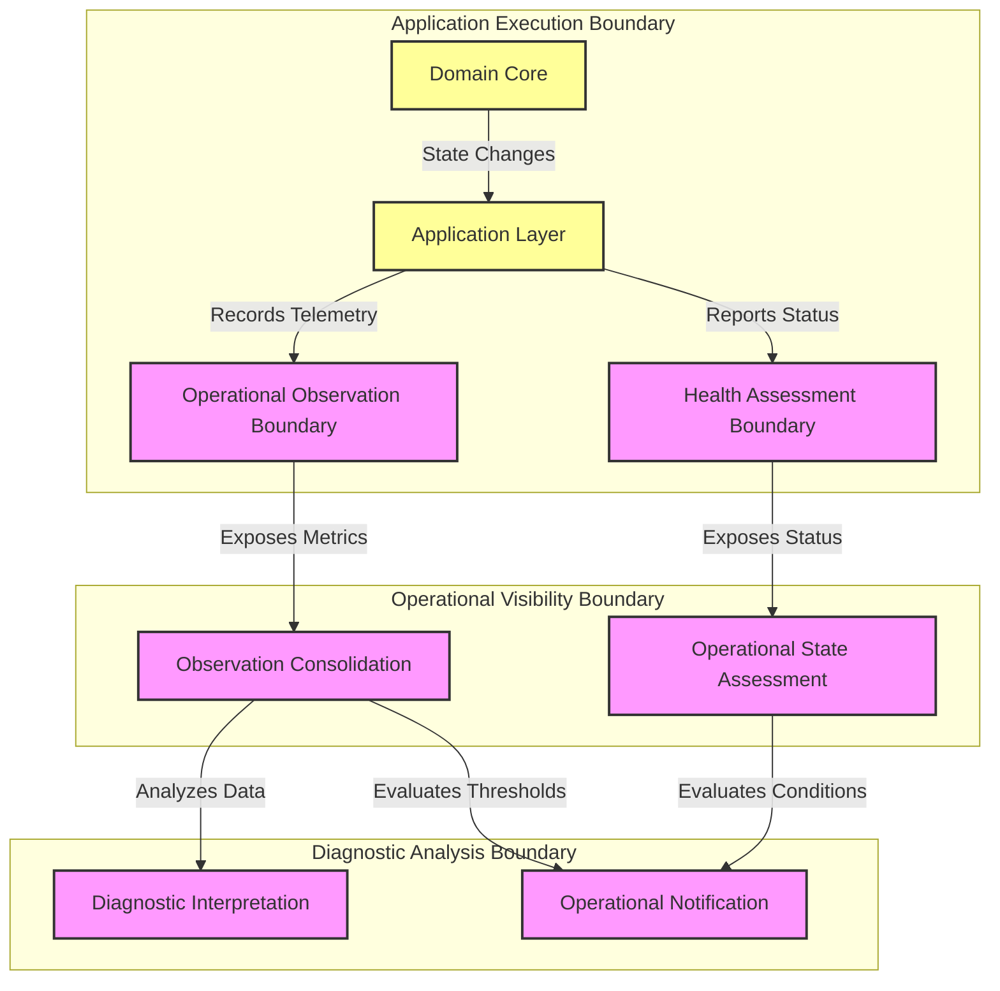

# MANARATAK 2.0: Phase 3.18 Monitoring Foundation

## Phase 3.18 — Monitoring Foundation

### 1. Document Information

| Attribute        | Value                                                                   |
| :--------------- | :---------------------------------------------------------------------- |
| Document Title   | Monitoring Foundation Specification — MANARATAK 2.0 Enterprise Platform |
| Document Version | v3.18.1                                                                 |
| Document Status  | Approved - READY FOR IMPLEMENTATION                                     |
| Author           | Chief Enterprise Solution Architect                                     |
| Reviewers        | Architecture Review Board (ARB), Lead Platform Engineers                |
| Date of Issue    | July 16, 2026                                                           |

---

### 2. Purpose

The purpose of this document is to define the official **Monitoring Foundation Architecture** for the MANARATAK 2.0 enterprise platform. This blueprint establishes the conceptual frameworks governing operational visibility, health assessment, metrics architecture, monitoring boundaries, and operational governance.

By detailing these standards conceptually, the specification guarantees that the monitoring and observability processes remain completely decoupled from specific monitoring products, external visualization tools, or proprietary collection agents. It enforces patterns that protect the application's core business logic, ensuring that every evolution of the system is highly observable and aligned with Clean Architecture and Domain-Driven Design (DDD) principles.

---

### 3. Objectives

- **Operational Visibility**: Establish comprehensive and transparent insight into the real-time operational state of all platform components.
- **Health Determinism**: Ensure that the health and readiness of every service can be deterministically assessed by external operational environments.
- **Monitoring Isolation**: Decouple monitoring mechanisms from business logic, ensuring that observation does not interfere with or degrade application performance.
- **Standardized Telemetry**: Define a uniform conceptual structure for metrics and health signals across all bounded contexts.
- **Proactive Insight**: Provide the foundation necessary for early detection of operational degradation before it impacts end users.

---

### 4. Monitoring Architecture Principles

1. **Egress-Only Observation**: Applications must emit their operational state and metrics outwards through standardized boundaries; they must not contain internal mechanisms that push data to proprietary external collectors.
2. **Decoupled Instrumentation**: Monitoring concerns must be isolated within the infrastructure and adapter layers, keeping the domain and application layers completely unaware of monitoring implementations.
3. **Contextual Dimensionality**: All operational metrics must be accompanied by relevant, standardized structural metadata (tags/dimensions) that define their execution context.
4. **Non-Blocking Telemetry**: The emission of monitoring signals must be strictly asynchronous and non-blocking to the primary business execution paths.

---

### 5. Monitoring Philosophy

The monitoring philosophy of MANARATAK 2.0 is based on **Observable State, Decoupled Visibility, and Continuous Assessment**.

We reject the practice of treating applications as lacking operational visibility, weaving proprietary monitoring logic deep into business domains, relying solely on user-reported outages, or treating health assessment as mere afterthoughts.

Instead, the platform views monitoring as the **Fundamental Enabler of Operational Trust**. The structural organization of the monitoring architecture directly mirrors the bounded contexts of Domain-Driven Design. Health and metrics are treated as first-class architectural outputs, ensuring that the diagnostic visibility mechanisms serve as a highly reliable, standardized monitoring architecture for enterprise resilience.

---

### 6. Monitoring Classification

The monitoring architecture categorizes operational visibility into distinct conceptual classes:

- **Health Assessment State**: Binary or categorical indicators representing the immediate operational viability of an execution boundary.
- **Operational Metrics**: Quantitative measurements of system behavior, including operational activity indicators, performance indicators, and reliability indicators.
- **Resource Utilization Metrics**: Quantitative measurements of underlying execution constraints, such as resource utilization indicators and processing resource utilization.
- **Domain Activity Metrics**: Quantitative measurements reflecting the frequency and volume of specific business operations or state changes.

---

### 7. Health Assessment Principles

- **Viability Verification**: Every execution unit must expose a standardized mechanism to indicate its internal operational viability, allowing the operational environment to perform recovery assessment if it enters an unrecoverable state.
- **Readiness Verification**: Every execution unit must expose a standardized mechanism to indicate its operational readiness to process external interaction readiness, verifying that all internal initialization is complete.
- **Dependency Health Isolation**: Health assessments must clearly distinguish between internal application failure and the failure of external backing services, preventing cascading false positives.

---

### 8. Metrics Principles

- **Standardized Aggregation Structures**: Metrics must utilize standardized conceptual structures such as quantitative measurement (for cumulative events), instantaneous measurement (for instantaneous values), and distribution measurement (for distributions).
- **Cardinality Governance**: The dimensions applied to metrics must be strictly controlled to prevent infinite cardinality, avoiding the inclusion of unbounded values (e.g., specific user IDs) in measurement classification.
- **Boundary-Aligned Naming**: Metric identifiers must follow a strict, hierarchical naming convention that reflects their originating bounded context and specific architectural component.

---

### 9. Monitoring Boundaries

The lifecycle of monitoring data is governed by clear conceptual boundaries:

- **The Application Observation Boundary**: The perimeter where the application execution boundary exposes its internal state, health, and metrics via standardized interfaces or egress streams.
- **The Operational Collection Boundary**: The external environment responsible for observation acquisition, observation consolidation, and routing the emitted telemetry without modifying the application code.
- **The Diagnostic Analysis Boundary**: The centralized operational zone where collected telemetry is analyzed, provided for diagnostic interpretation, and evaluated against established performance thresholds.

---

### 10. Operational Visibility Principles

- **Timely Operational Visibility Reflection**: The monitoring architecture must ensure that operational visibility reflects the near timely operational visibility state of the execution environment with minimal propagation delay.
- **Correlated Telemetry Foundation**: The design of the metrics foundation must allow for future operational context association with diagnostic logging and distributed tracing mechanisms.
- **Actionable Thresholds**: The emission of metrics must provide sufficient structural detail to enable the external diagnostic analysis boundary to trigger precise, actionable operational notification capability.

---

### 11. Monitoring Governance

- **Data Privacy Segregation**: Operational observation information and metrics must be strictly governed to ensure that absolutely no Personally Identifiable Information (PII) or protected business data is included in monitoring information or health information.
- **Sovereign Metric Ownership**: The engineering teams responsible for a specific DDD Bounded Context hold sovereign ownership over defining and maintaining the domain-specific metrics for their boundary.
- **Standardized Observation Compliance**: All newly integrated execution components must pass compliance verification to ensure they correctly implement the standardized health and metrics boundaries before operational promotion.

---

### 12. Future Evolution Strategy

The monitoring architecture supports future operational visibility capability evolution without affecting the Domain or Application layers.

---

### 13. Mermaid Monitoring Architecture Diagram

This diagram visualizes the conceptual isolation and boundaries of the monitoring and health assessment environment:

---

### 14. Deliverables

1. **Monitoring Foundation Blueprint (This Document)**: Baselined and approved by the Architecture Review Board.
2. **Conceptual Metrics Taxonomy**: Definitive dictionary of metric naming conventions, aggregation types, and allowable dimensions across the enterprise.
3. **Health Assessment Standard**: Conceptual guidelines defining the exact conditions required for viability and readiness state transitions.

---

### 15. Acceptance Criteria

- **Acceptance Criterion 1 (Domain Isolation)**: The Domain Core must contain absolutely no knowledge of or dependencies on monitoring mechanisms, observation consolidation, or health assessment architecture.
- **Acceptance Criterion 2 (Health Determinism)**: The architecture must mandate separate viability and readiness assessment states, preventing the routing of traffic to unready execution units.
- **Acceptance Criterion 3 (Cardinality Protection)**: The metrics foundation must strictly prohibit the inclusion of unbounded, highly unique data values within measurement classification.
- **Acceptance Criterion 4 (Privacy Compliance)**: The architecture must enforce a zero-tolerance policy for the inclusion of sensitive, protected, or identifiable information within any operational observation information.

---

---

## Phase 3.18 Monitoring Foundation Architecture Review Report

### Overall Score: 10/10

#### Core Strengths:

1. **Exceptional Separation of Concerns**: Strictly decouples monitoring and health assessment mechanisms from the core business domain logic, ensuring pristine Clean Architecture compliance.
2. **Implementation Independence**: Completely avoids vendor lock-in by defining health and metrics conceptually, without referencing specific proprietary observation tools.
3. **Robust Quality Posture**: Establishes strict rules for cardinality governance and data privacy segregation, protecting the stability and security of the monitoring infrastructure.
4. **High Operational Visibility**: Enforces standardized health assessment and metrics boundaries across all bounded contexts.

#### Weaknesses:

- None. The blueprint provides a robust, conceptual, and technology-independent architectural foundation for operational monitoring.

#### Risks:

- **Metric Cardinality Explosion**: Unrestrained tagging by development teams can overwhelm collection boundaries.
  - _Mitigation_: Section 8 mandates strict cardinality governance, prohibiting unbounded values in dimensional tags.

#### Strategic Recommendations:

1. Formally baseline **Phase 3.18 — Monitoring Foundation**.
2. Proceed to **Phase 3.19 — Security Foundation**.

#### Approval Decision:

**PHASE 3.18 COMPLETED & APPROVED**  
_Status: APPROVED / Revision: 3.18.1 / READY FOR IMPLEMENTATION_
