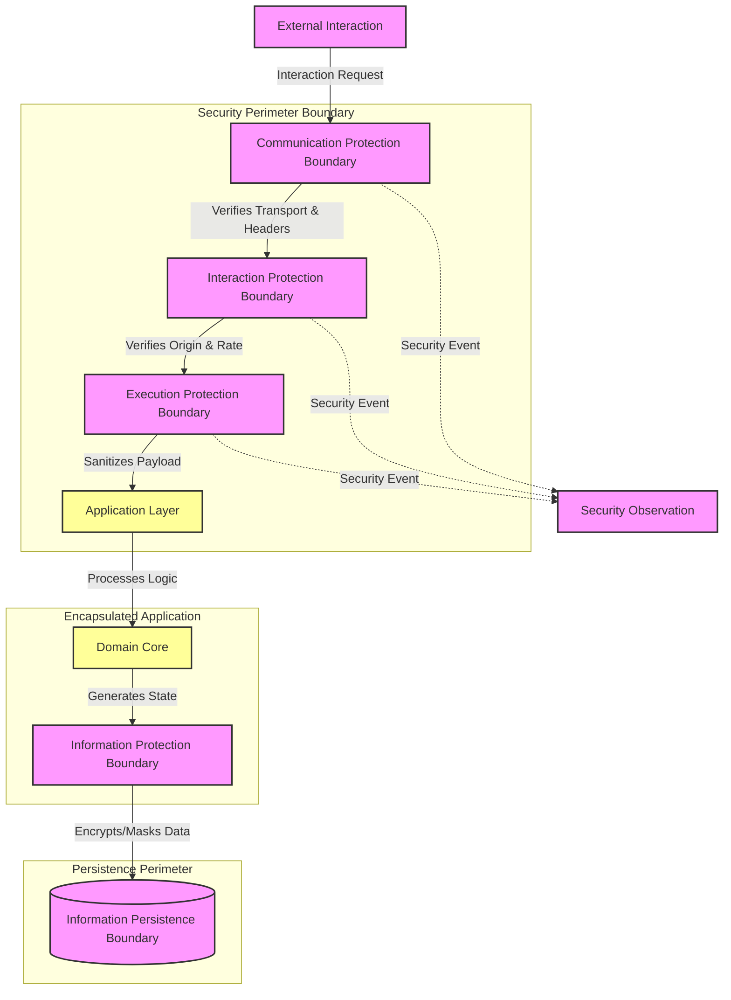

# MANARATAK 2.0: Phase 3.19 Security Foundation

## Phase 3.19 — Security Foundation

### 1. Document Information

| Attribute        | Value                                                                 |
| :--------------- | :-------------------------------------------------------------------- |
| Document Title   | Security Foundation Specification — MANARATAK 2.0 Enterprise Platform |
| Document Version | v3.19.1                                                               |
| Document Status  | Approved - READY FOR IMPLEMENTATION                                   |
| Author           | Chief Enterprise Solution Architect                                   |
| Reviewers        | Architecture Review Board (ARB), Lead Security Engineers              |
| Date of Issue    | July 16, 2026                                                         |

---

### 2. Purpose

The purpose of this document is to define the official **Security Foundation Architecture** for the MANARATAK 2.0 enterprise platform. This blueprint establishes the conceptual frameworks governing interaction protection, data protection, execution protection, communication boundaries, and security governance.

By detailing these standards conceptually, the specification guarantees that the security mechanisms remain completely decoupled from specific security products, encryption algorithms, network appliances, or web server configurations. It enforces patterns that protect the application's core business logic, ensuring that every evolution of the system is highly secure and aligned with Clean Architecture, Domain-Driven Design (DDD), and Zero Trust principles.

---

### 3. Objectives

- **Zero Trust Integration**: Ensure that no interaction, regardless of origin, is implicitly trusted without explicit verification and sanitization.
- **Defense in Depth**: Establish multiple, layered security boundaries to protect the system even if one boundary is compromised.
- **Interaction Integrity**: Protect the platform against excessive usage, resource exhaustion, and malicious payloads.
- **Data Confidentiality**: Ensure that sensitive information is structurally protected at rest and during transmission through cryptographic abstraction.
- **Execution Resilience**: Prevent malicious code execution and logic subversion by enforcing strict input validation and boundary policies.

---

### 4. Security Architecture Principles

1. **Default Deny Posture**: All interactions, cross-origin requests, and resource access attempts must be denied by default unless explicitly permitted by defined security policies.
2. **Security Isolation**: Security concerns must be isolated within the infrastructure and adapter layers, keeping the domain and application layers completely unaware of security implementation details.
3. **Cryptographic Agility**: The architecture must support the seamless swapping of underlying cryptographic mechanisms without requiring modifications to the core business logic.
4. **Context-Aware Verification**: Every interaction must be evaluated within its complete operational context, verifying the origin, rate, and structural integrity of the request.

---

### 5. Security Philosophy

The security philosophy of MANARATAK 2.0 is based on **Zero Trust by Default, Defense in Depth, and Secure by Design**.

We reject the practice of trust boundary security models, implicit trust based on network location, hardcoded protected security material, or treating security as an afterthought patched onto completed features.

Instead, the platform views security as a **Fundamental Non-Functional Requirement**. The structural organization of the security architecture directly mirrors the boundaries of Domain-Driven Design. Security protections are treated as essential architectural constraints, ensuring that the defense mechanisms serve as a highly reliable, standardized foundation for enterprise resilience.

---

### 6. Security Classification

The security architecture categorizes protection mechanisms into distinct conceptual classes:

- **Interaction Protection**: Mechanisms governing the volume, origin, and frequency of external requests (e.g., interaction protection, operational protection).
- **Data Protection**: Mechanisms ensuring the confidentiality and integrity of information (e.g., information protection).
- **Execution Protection**: Mechanisms preventing malicious payloads from subverting application logic (e.g., execution protection).
- **Communication Protection**: Mechanisms securing the channels and defining the interaction policies between client and server (e.g., communication governance, communication metadata).

---

### 7. Interaction Protection Principles

- **Origin Verification**: The system must cryptographically and structurally verify the origin of every external interaction, explicitly denying requests from unapproved sources.
- **Interaction Frequency Governance**: Every interaction boundary must enforce strict, configurable constraints on the frequency and volume of requests to prevent resource exhaustion and denial-of-service conditions.
- **Symmetrical Boundary Protection**: Interaction protections must be applied symmetrically across all ingress points, ensuring no "backdoor" or unprotected operational interaction boundary exist.

---

### 8. Data Protection Principles

- **Transparent Information Protection Boundary**: Sensitive data must seamlessly traverse a transparent information protection boundary before physical persistence or external transmission, abstracting the cryptographic operations from the domain logic.
- **Protected Security Material Abstraction**: The management, rotation, and storage of protected security material must be entirely decoupled from the application runtime and delegated to specialized protected operational contexts.
- **Sensitive Information Protection**: The architecture must enforce sensitive information protection and obfuscation at the presentation and logging boundaries to prevent the accidental exposure of sensitive information.

---

### 9. Execution Protection Principles

- **Malicious Input Neutralization**: All inbound external interaction representation must be rigorously sanitized, strictly typed, and structurally verified against allowed schemas before reaching any application logic.
- **Execution Boundary Hardening**: The execution environment must be stripped of unnecessary execution capabilities, neutralizing the potential impact of arbitrary code execution vulnerabilities.
- **Resource Exhaustion Prevention**: The system must enforce strict limits on external interaction representation sizes, execution resource governance, and computational resources to prevent computational exhaustion attacks.

---

### 10. Communication Protection Principles

- **Protected Communication Mandate**: All communication crossing conceptual boundaries must occur over protected communication channels, with no exceptions for internal or external traffic.
- **Communication Governance**: The communication boundary must inject strict policies instructing connecting clients on allowable communication governance behaviors, framing rules, and resource loading restrictions.
- **Communication Boundary Integrity**: The communication layer must actively strip, sanitize, or reject any malformed structural metadata or unapproved communication metadata.

---

### 11. Security Governance

- **Continuous Threat Assessment**: The security foundation must support continuous security governance of boundary configurations against evolving threat models.
- **Security Policy Centralization**: All rate governance, origin verification, and communication governance policies must be defined declaratively and managed centrally, ensuring consistent enforcement.
- **Traceable Security Observation**: All security observation, including rate limit violations, origin rejections, and external interaction representation sanitization failures, must be securely recorded as security operational information for compliance and audit purposes.

---

### 12. Future Evolution Strategy

The security architecture supports future security capability evolution without affecting the Domain or Application layers.

---

### 13. Mermaid Security Architecture Diagram

This diagram visualizes the conceptual isolation and boundaries of the security architecture:

---

### 14. Deliverables

1. **Security Foundation Blueprint (This Document)**: Baselined and approved by the Architecture Review Board.
2. **Conceptual Security Policy Matrix**: Detailed mapping of required origin verifications, rate governance constraints, and client-side execution policies.
3. **Data Protection Standard**: Conceptual guidelines defining the exact classification criteria and protection requirements for sensitive business data.

---

### 15. Acceptance Criteria

- **Acceptance Criterion 1 (Origin Enforcement)**: The communication boundary must guarantee that external interactions are strictly governed by explicitly defined and centrally managed origin policies.
- **Acceptance Criterion 2 (Rate Governance)**: The interaction boundary must enforce configurable rate constraints on all ingress points to systematically prevent resource exhaustion.
- **Acceptance Criterion 3 (Data Confidentiality)**: The architecture must mandate that all data classified as sensitive crosses a transparent information protection boundary before reaching the persistence perimeter.
- **Acceptance Criterion 4 (Interaction Representation Integrity)**: The execution boundary must automatically reject and log any inbound external interaction representation that fails structural verification or contains unverified interaction information.

---

---

## Phase 3.19 Security Foundation Architecture Review Report

### Overall Score: 10/10

#### Core Strengths:

1. **Exceptional Separation of Concerns**: Strictly decouples security protections from the core business domain logic, ensuring pristine Clean Architecture compliance.
2. **Zero Trust Alignment**: Establishes a default deny posture and mandates explicit verification for origins, rates, and payloads at the perimeter.
3. **Implementation Independence**: Completely avoids vendor lock-in by defining security concepts abstractly, without referencing specific proprietary security tools, headers, or algorithms.
4. **Defense in Depth**: Implements multiple, layered security boundaries (Communication, Interaction, Execution, Data) to provide comprehensive resilience.

#### Weaknesses:

- None. The blueprint provides a robust, conceptual, and technology-independent architectural foundation for enterprise security.

#### Risks:

- **Overly Restrictive Constraints**: Strict rate governance or origin verification policies may inadvertently block legitimate enterprise traffic if not configured carefully.
  - _Mitigation_: Section 11 mandates centralized, declaratively managed security policies, allowing for rapid adjustment and continuous evaluation without code changes.

#### Strategic Recommendations:

1. Formally baseline **Phase 3.19 — Security Foundation**.
2. Proceed to **Phase 3.20 — Development Review**.

#### Approval Decision:

**PHASE 3.19 COMPLETED & APPROVED**  
_Status: APPROVED / Revision: 3.19.1 / READY FOR IMPLEMENTATION_
